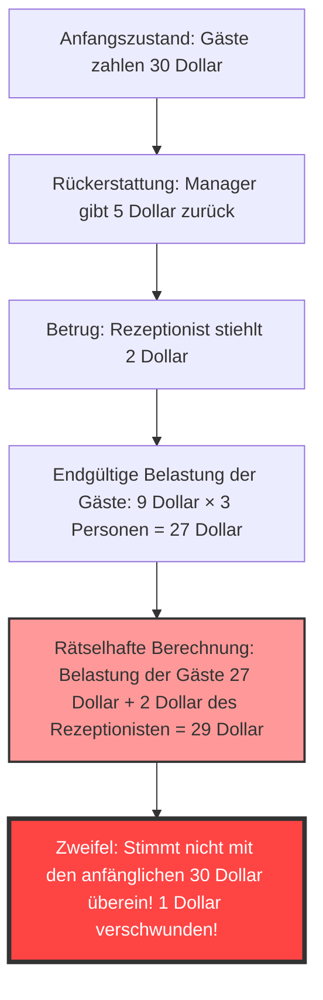
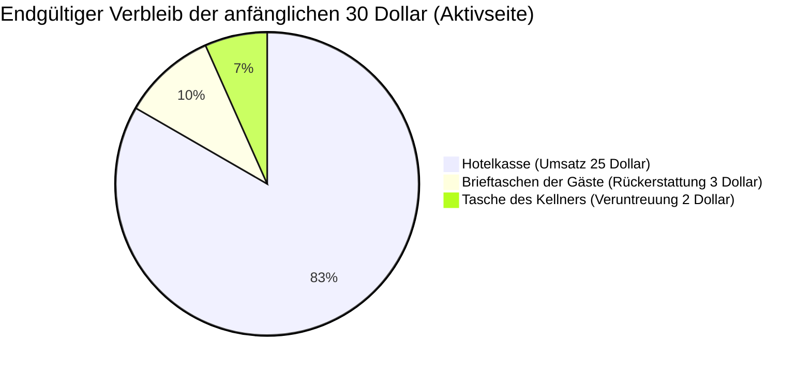

## 1. Einführung: Warum wir uns von einfacher Addition täuschen lassen?

In dieser Welt gibt es seltsame Probleme, die keinen fortgeschrittenen Kalkül oder komplexe Topologie erfordern, sondern unser Gehirn allein mit „Addition“ und „Subtraktion“ auf Grundschulniveau völlig zum Absturz bringen können. Eines der berühmtesten dieser Probleme, das viele Menschen auf der ganzen Welt verblüfft hat, ist **„Das Rätsel des verschwundenen Dollars“ (The Missing Dollar Riddle)**.

Auf den ersten Blick scheint es eine ganz normale Alltagssituation zu sein, eine Geschichte über Probleme bei der Abrechnung in einem Restaurant. Folgt man jedoch den Berechnungen ein wenig, verschwindet plötzlich „1 Dollar“ aus der Welt.

In diesem Artikel betrachten wir dieses berühmte mathematische Paradoxon (genauer gesagt, eine paradox anmutende Fangfrage) und analysieren gründlich, warum unsere Intuition getäuscht wird und wo die logischen Fallen liegen, und zwar aus drei Perspektiven: Mathematik, Kognitionspsychologie und doppelte Buchführung (Rechnungswesen).

---

## 2. Problemstellung: Das Rätsel des verschwundenen Dollars

Bitte lesen Sie zunächst die folgende Geschichte. Und wenn Sie Stift und Papier zur Hand haben, rechnen Sie gerne mit.

> [!QUESTION] Das Rätsel des verschwundenen Dollars (Die Geschichte)
> Eines Tages kamen drei Reisende in ein kleines Hotel.
> Der Rezeptionist sagte ihnen: „Ein Dreibettzimmer kostet insgesamt 30 Dollar pro Nacht.“
> Die drei Reisenden nahmen jeweils 10 Dollar aus ihren Brieftaschen, zahlten dem Rezeptionisten insgesamt 30 Dollar und gingen auf ihr Zimmer.
> 
> Einige Zeit später kam der Hotelmanager und sagte zum Rezeptionisten:
> „Heute haben wir eine Sonderaktion, das Zimmer kostet nur 25 Dollar. Bring ihnen sofort 5 Dollar zurück.“
> 
> Der Rezeptionist machte sich mit einem 5-Dollar-Schein auf den Weg zu den Gästen. Unterwegs kam ihm jedoch ein Gedanke:
> „Es ist schwer, 5 Dollar gleichmäßig auf drei Personen aufzuteilen. Wenn ich heimlich 2 Dollar behalte und die restlichen 3 Dollar zurückgebe, bekommt jeder genau 1 Dollar und die Rechnung geht auf.“
> 
> Also versteckte der Rezeptionist 2 Dollar in seiner Tasche, log die Reisenden an mit den Worten „Wegen einer Aktion wurden 3 Dollar erstattet“ und gab jedem 1 Dollar zurück.
> 
> **Nun kommt das Problem.**
> 
> 1. Die Reisenden haben anfangs jeweils 10 Dollar gezahlt und später 1 Dollar zurückbekommen, also beträgt der tatsächlich gezahlte Betrag **10 Dollar - 1 Dollar = 9 Dollar**.
> 2. Der Gesamtbetrag, den die drei Reisenden gezahlt haben, ist **9 Dollar × 3 Personen = 27 Dollar**.
> 3. Andererseits befinden sich in der Tasche des Rezeptionisten heimlich gestohlene **2 Dollar**.
> 4. Addiert man die **27 Dollar**, die die Reisenden gezahlt haben, und die **2 Dollar**, die der Rezeptionist hat, erhält man **27 + 2 = 29 Dollar**.
> 
> Anfangs haben die Reisenden definitiv „30 Dollar“ gezahlt.
> Aber nach der jetzigen Berechnung sind es nur „29 Dollar“.
> 
> **Wo ist der restliche 1 Dollar hingekommen?**

Wie finden Sie das?
Je öfter man es liest, desto mehr gerät das Gehirn in Verwirrung und man denkt: „Es fehlt tatsächlich 1 Dollar!“. Die Berechnungen selbst, `9 × 3 = 27` und `27 + 2 = 29`, sind so einfach, dass selbst Grundschüler sie verstehen. Dennoch stimmen sie aus irgendeinem Grund nicht mehr mit den ursprünglichen 30 Dollar überein.

In den folgenden Kapiteln werden wir den Trick hinter diesem seltsamen Phänomen aufdecken.

---

## 3. Die Diskrepanz zwischen Intuition und richtiger Antwort: Warum das Gehirn abstürzt?

Wenn viele Leute dieses Problem hören, fallen sie in folgendes Denkmuster:

Die wahre Natur dieses Paradoxons liegt in einem raffinierten **Wort-Trick (Framing-Effekt)**, bei dem Dinge addiert werden, die man nicht addieren darf.

### Der Kern des Irrtums: Die sinnlose Berechnung „27 + 2“
Schauen Sie sich den folgenden Teil am Ende der Aufgabenstellung noch einmal genau an.

> Addiert man die **27 Dollar**, die die Reisenden gezahlt haben, und die **2 Dollar**, die der Rezeptionist hat, erhält man **27 + 2 = 29 Dollar**.

Tatsächlich ist genau diese Berechnung „27 + 2“ logisch völlig sinnlos.
Der Grund dafür ist, dass **in dem „von den Reisenden gezahlten Endbetrag (27 Dollar)“ bereits der „vom Rezeptionisten gestohlene Betrag (2 Dollar)“ enthalten ist**.

Die Aufschlüsselung der von den Reisenden gezahlten 27 Dollar sieht wie folgt aus:
*   **Betrag in der Hotelkasse**: 25 Dollar
*   **Vom Rezeptionisten gestohlener Betrag**: 2 Dollar
*   Gesamt: 27 Dollar

Das heißt, wenn man zu den 27 Dollar noch die 2 Dollar des Rezeptionisten addiert, führt das zu einer **„Doppelzählung (Double Counting)“ der 2 Dollar des Rezeptionisten**.

Wenn man korrekterweise wieder auf die anfänglichen „30 Dollar“ kommen möchte, muss man „den von den Gästen gezahlten Betrag“ und „den an die Gäste zurückgegebenen Betrag“ addieren.
*   Endgültig von den Gästen gezahlter Betrag: 27 Dollar (Kasse 25 Dollar + Rezeptionist 2 Dollar)
*   An die Gäste zurückgegebener Betrag: 3 Dollar
*   Gesamt: 27 + 3 = 30 Dollar

Wenn man so rechnet, wird klar, dass kein einziger Dollar verschwunden ist.

---

## 4. Mathematische Klärung: Ein strenger Beweis durch Gleichungen

Für diejenigen, die von der verbalen Erklärung noch nicht ganz überzeugt sind, lassen Sie uns den Geldfluss (Cashflow) mit strengen mathematischen Formeln beweisen.

Wir definieren die gesamten Geldbewegungen mit Variablen.

*   $ P_{initial} $ : Der anfangs von den Gästen gezahlte Gesamtbetrag (30)
*   $ C_{hotel} $ : Der endgültig vom Hotel (Manager) erhaltene Betrag (25)
*   $ R_{total} $ : Der vom Manager an den Rezeptionisten übergebene Rückerstattungsbetrag (5)
*   $ R_{guest} $ : Der endgültig von den Gästen erhaltene Rückerstattungsbetrag (3)
*   $ S_{waiter} $ : Der vom Rezeptionisten gestohlene Betrag (2)

Aus dem anfänglichen Geldfluss ergibt sich die folgende Gleichung:
$$ P_{initial} = C_{hotel} + R_{total} \quad \cdots (1) $$
(30 Dollar = 25 Dollar + 5 Dollar)

Die vom Manager zurückgegebenen 5 Dollar verteilen sich auf die Hände der Gäste und die Tasche des Rezeptionisten.
$$ R_{total} = R_{guest} + S_{waiter} \quad \cdots (2) $$
(5 Dollar = 3 Dollar + 2 Dollar)

Wir setzen Gleichung (2) in Gleichung (1) ein:
$$ P_{initial} = C_{hotel} + (R_{guest} + S_{waiter}) \quad \cdots (3) $$
(30 Dollar = 25 Dollar + 3 Dollar + 2 Dollar)

Hier definieren wir den in der Problemstellung erwähnten „endgültig von den Gästen gezahlten Betrag“ als $ P_{final} $. Dies ist der anfängliche Zahlungsbetrag abzüglich des an die Gäste zurückgegebenen Betrags.
$$ P_{final} = P_{initial} - R_{guest} \quad \cdots (4) $$
(27 Dollar = 30 Dollar - 3 Dollar)

Verschieben wir nun $ R_{guest} $ aus Gleichung (3) auf die linke Seite:
$$ P_{initial} - R_{guest} = C_{hotel} + S_{waiter} \quad \cdots (5) $$

Aus den Gleichungen (4) und (5) lässt sich die folgende Wahrheit ableiten:
$$ P_{final} = C_{hotel} + S_{waiter} \quad \cdots (6) $$
(Endgültige Zahlung der Gäste 27 Dollar = Umsatz des Hotels 25 Dollar + Diebstahl des Rezeptionisten 2 Dollar)

Der Trick der Problemstellung besteht darin, **dass sie versucht, zu $ P_{final} $ (27 Dollar) auf der linken Seite den Betrag $ S_{waiter} $ (2 Dollar), der bereits auf der rechten Seite enthalten ist, noch einmal zu addieren**.
Das heißt, die durch die Problemstellung induzierte Berechnung sieht so aus:
$$ P_{final} + S_{waiter} = (C_{hotel} + S_{waiter}) + S_{waiter} $$
$$ 27 + 2 = (25 + 2) + 2 = 29 $$

Diese Zahl „29“ ist lediglich ein fiktiver Wert, der sich aus „Umsatz des Hotels + Diebstahl des Rezeptionisten × 2“ zusammensetzt und physikalisch wie ökonomisch völlig bedeutungslos ist. Dies ist die mathematische Natur der Illusion, dass „1 Dollar verschwunden“ sei.

---

## 5. Die Perspektive der Buchhaltung: Das Paradoxon durch doppelte Buchführung zerstören

Wenn Sie selbst nach den mathematischen Gleichungen noch nicht überzeugt sind (oder intuitiv noch unsicher sind), können Sie das Geheimnis durch das Konzept der **„doppelten Buchführung“ (Double-Entry Bookkeeping)**, das in der Geschäftswelt seit über 500 Jahren verwendet wird, perfekt veranschaulichen.

Das Grundprinzip der doppelten Buchführung besagt, dass „Soll“ (Debit) und „Haben“ (Credit) immer übereinstimmen müssen. Lassen Sie uns dies verwenden, um die Geldbewegungen zu buchen (Journal Entry).

### Transaktion 1: Gäste zahlen 30 Dollar
Dies ist der Anfangszustand aus der Sicht des Hotels.

| Soll (Zunahme der Vermögenswerte) | Haben (Zunahme von Verbindlichkeiten/Eigenkapital) |
| :--- | :--- |
| Bargeld (Cash): $30 | Einlagen (oder Umsatz): $30 |

### Transaktion 2: Manager gibt dem Rezeptionisten 5 Dollar und verbucht 25 Dollar als Umsatz
Da der Zimmerpreis auf 25 Dollar geändert wurde, bekommt der Rezeptionist 5 Dollar für „Rückerstattungszwecke“.

| Soll | Haben |
| :--- | :--- |
| Einlagen: $30 | Umsatz (Sales): $25 Rezeptionist (Bargeld): $5 |

### Transaktion 3: Handlung des Rezeptionisten (3 Dollar Rückerstattung und 2 Dollar Veruntreuung)
Dies ist der wichtigste Teil. Wir buchen den Verbleib der 5 Dollar Bargeld, die der Rezeptionist hat.

| Soll | Haben |
| :--- | :--- |
| Rückerstattung an Gäste: $3 Verlust durch Veruntreuung (Loss): $2 | Rezeptionist (Bargeld): $5 |

### Endgültiger konsolidierter Status von Bilanz (B/S) und Gewinn- und Verlustrechnung (P/L)
Wir fassen das Gesamtergebnis zusammen, wo sich das Bargeld befindet und unter welchem Posten es verbucht ist.

**[Bestätigung des Endzustands]**
*   **Herkunft der Mittel (Ausgaben der Gäste)**: 30 Dollar
*   **Verbleib der Mittel (Ergebnis)**: 
    *   25 Dollar in der Hotelkasse
    *   2 Dollar in der Tasche des Kellners
    *   3 Dollar in den Händen der Gäste
    *   Gesamt = 25 + 2 + 3 = 30 Dollar

Betrachtet man das Prinzip der „Bilanzgleichung (T-Konten)“ in der Buchhaltung, ist „der von den Gästen gezahlte Betrag von 27 Dollar (Ausgabe)“ eine „Verringerung auf der Aktivseite“, und die Handlung, dazu „die vom Kellner gestohlenen 2 Dollar (Verschiebung auf der Aktivseite)“ zu addieren, ist nach den Rechnungslegungsstandards **nichts anderes als der unmögliche Fehler, „Soll und Haben zu vermischen und zu addieren“**.
Wenn in der Geschäftswelt ein Buchhalter der Geschäftsführung die Berechnung „27 + 2 = 29“ vorlegen würde, wäre das ein logischer Zusammenbruch von einem Ausmaß, das sofort zu einer Entlassung oder dem Verdacht auf Bilanzfälschung führen würde.

---

## 6. Die Perspektive der Kognitionspsychologie: Warum akzeptieren wir „27 + 2 = 29“?

Warum akzeptieren so viele Menschen unbewusst eine Berechnung, die sowohl mathematisch als auch buchhalterisch falsch ist, mit einem „Hmm, verstehe“? Das hat mit den starken **kognitiven Verzerrungen (Bias)** zu tun, die in das menschliche Gehirn eingebaut sind.

### 1. Der Fehler in der mentalen Buchführung (Mental Accounting)
Der Verhaltensökonom Richard Thaler (Nobelpreisträger für Wirtschaftswissenschaften) schlug vor, dass Menschen unbewusst eine „Kategorisierung von Geld (mentale Buchführung)“ in ihren Köpfen vornehmen.
Am Ende der Problemstellung werden „die Ausgaben der Gäste (27 Dollar)“ und „das vom Kellner erhaltene Geld (2 Dollar)“ als die gleiche Kategorie „Geld“ präsentiert. Das Gehirn nimmt nur „die Zahlen der Beträge (27 und 2)“, ignoriert die Vektorrichtung – ob es sich um „gezahltes Geld (minus)“ oder „besessenes Geld (plus)“ handelt – und führt einfach eine Addition durch.

### 2. Der Framing-Effekt (Rahmen der Information)
Dies ist der Effekt, dass sich die Entscheidungen und Urteile von Menschen je nachdem ändern, wie Informationen präsentiert werden.
Das Raffinierte an der Problemstellung ist, **dass sie „die ursprüngliche Zahl von 30 Dollar als Ziel festlegt“**.
Nachdem das Gehirn die Berechnung „27 + 2 = 29 Dollar“ gesehen hat, versucht es unbewusst, sie zwanghaft mit dem Ziel (Anker) „es müssten eigentlich die ursprünglichen 30 Dollar sein“ zu verknüpfen. Man wird gezwungen, Zahlen zu vergleichen, die eigentlich nicht verglichen werden sollten, und das Entstehen eines Fehlers von „1“ löst absichtlich eine starke kognitive Dissonanz (Unbehagen und Verwirrung) aus.

### 3. Die Magie des Storytellings
Menschen sind besser darin, „Geschichten“ zu verstehen als mathematische Formeln. Während man die Handlungen der Figuren (Gäste, Manager, Kellner) im Kopf simuliert, wird das Arbeitsgedächtnis (Kurzzeitgedächtnis) voll, und die kognitiven Ressourcen, um die logische Gültigkeit der letzten Gleichung zu überprüfen, erschöpfen sich. Genau die gleiche Methode wie die „Fehlleitung“ (Misdirection), die Magier anwenden, um den Blick des Publikums zu lenken und ihre Tricks erfolgreich auszuführen, wird in dieser Textaufgabe verwendet.

---

## 7. Geschichte und ähnliche Rätsel des „Rätsels des verschwundenen Dollars“

Diese Art von Paradoxon existiert seit langer Zeit und wird in verschiedenen Variationen über Epochen und Grenzen hinweg überliefert.

### Der Ursprung des Paradoxons
Der genaue Ursprung dieses Problems ist unbekannt, aber es wurde in den 1930er Jahren in Amerika weithin bekannt. Damals wurde es „Bellboy Paradox“ genannt, und die Beträge variierten. Es wird auch gesagt, dass es die Massenpsychologie im Amerika der Großen Depression widerspiegelt, als der Verbleib von nur „1 Dollar“ von großem Interesse war.

### Ähnliches Rätsel: Das Rätsel der verschwundenen 10 Yen
In Japan ist eine Version berühmt, bei der die Beträge in Yen umgewandelt wurden: „Drei Personen geben jeweils 100 Yen, um einen Artikel für 300 Yen zu kaufen, und das Wechselgeld beträgt 50 Yen...“. Es ist auch regelmäßig ein Thema in Quizbüchern für Kinder oder als klassisches Copy-Paste in Internetforen.

### Eine noch fortschrittlichere Variante: Das Rätsel des verschwundenen Quadrats
Eine Anwendung dieser „sprachlichen Täuschung“ auf „Formen (Geometrie)“ ist das in einem anderen Artikel in diesem Blog vorgestellte **„Rätsel des verschwundenen Quadrats (Missing square puzzle)“**.
Es ist ein intuitiver Fehler, bei dem nach dem Neuanordnen von Formteilen, die die gleiche Fläche haben sollten, aus irgendeinem Grund ein Loch (Fläche) von einem Quadrat verschwindet. Dies nutzt auch die kognitive Grenze aus, dass „das menschliche Auge winzige Verzerrungen in geraden Linien (Unterschiede in der Neigung) nicht erkennen kann“.

---

## 8. Lektionen für die reale Welt: Was sollten wir aus dem Paradoxon lernen?

„Das Rätsel des verschwundenen Dollars“ enthält eine tiefe Lektion, die zu schade wäre, um sie nur als einfachen Partytrick oder als Quiz für Kinder abzutun.

1. **Die Fähigkeit, den „gegebenen Rahmen (die Prämisse)“ in Frage zu stellen**
   Wenn wir in unserem täglichen Geschäfts- oder Anlageleben Entscheidungen treffen, nehmen wir dann nicht oft Präsentationsmaterialien oder Verkaufsgespräche unkritisch hin, die besagen: „Wenn man diese Zahl und diese Zahl addiert, bekommt man das“?
   Selbst wenn das Rechenergebnis stimmt (27 + 2 ist tatsächlich 29), ist kritisches Denken (Critical Thinking) unerlässlich, um zu fragen: **„Hat es überhaupt einen logischen Sinn, diese Gleichung aufzustellen?“**.
2. **Die Absolutheit des Cashflows**
   Bilanzfälschungen in der Unternehmensbuchhaltung oder das Verbergen von Verlusten bei komplexen Finanzderivaten können als hochentwickelte Versionen des „Rätsels des verschwundenen Dollars“ betrachtet werden. Selbst wenn man immaterielle Zahlen addiert und subtrahiert, um es so aussehen zu lassen, als würde ein Gewinn erzielt, wird bei einer grundlegenden Verfolgung der „Geldbewegung (Cashflow)“ zwangsläufig ein Widerspruch aufgedeckt. Gerade wenn Dinge kompliziert erscheinen, muss man zu der grundlegenden Frage zurückkehren: „Woher kam das Geld und wohin ist es gegangen?“.

---

## 9. Fazit: Der 1 Dollar war von Anfang an nicht verschwunden

Abschließend möchte ich dieses Rätsel mit der prägnantesten und stärksten Antwort auf das Paradoxon beenden.

> **„Die Gäste haben insgesamt 27 Dollar bezahlt; 25 Dollar sind in der Hotelkasse gelandet und 2 Dollar in der Tasche des Kellners. Die Berechnung ist perfekt korrekt. Die Formel, die zwanghaft versucht, auf die ursprünglichen 30 Dollar zurückzukommen, ist die eigentliche Ursache für all die Verwirrung.“**

Egal wie weit sich unser Gehirn entwickelt hat, es lässt sich leicht durch die Kombination aus einer „plausiblen Geschichte“ und einer „einfachen Addition“ täuschen.
Doch durch den Einsatz starker Werkzeuge wie Mathematik und Logik (Gleichungen und doppelte Buchführung) können wir diese Illusion durchbrechen und die Wahrheit erkennen.

Wenn das nächste Mal ein Freund mit selbstgefälligem Gesichtsausdruck „Das Rätsel des verschwundenen Dollars“ stellt, sollten Sie auf jeden Fall mit diesem tiefen Wissen im Hintergrund cool antworten: „Die Vektoren der Zahlen, die man addieren und subtrahieren soll, sind falsch!“
