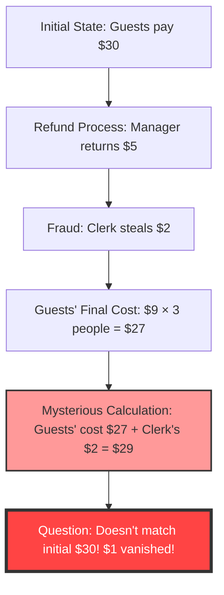
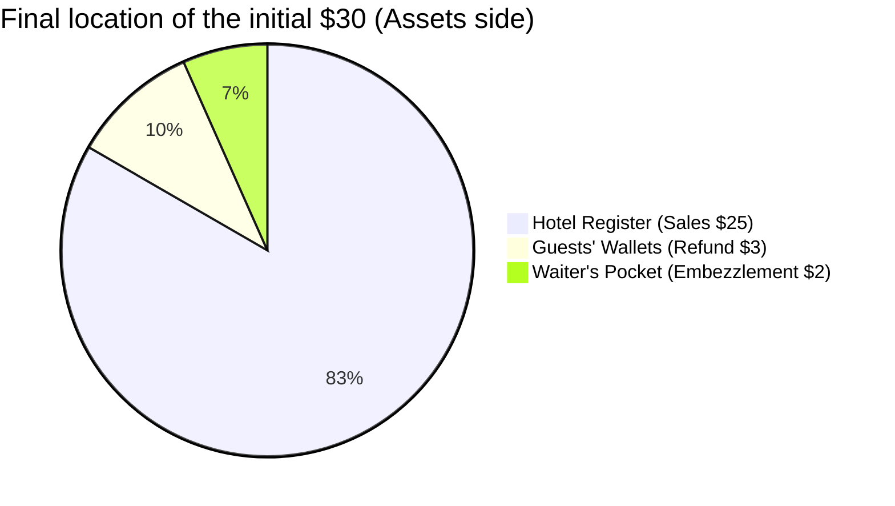

## 1. Introduction: Why Are We Deceived by Simple Addition?

In the world, there exist strange problems that can completely bug out the human brain using only lower elementary school level "addition" and "subtraction", without relying on advanced calculus or complex topology. Among these, the most famous worldwide and the one that has troubled many people is **"The Missing Dollar Riddle"**.

At first glance, it seems like an ordinary everyday scene, a story about a bill issue at a restaurant (or hotel). However, just by following the calculations a little, "$1" suddenly vanishes from the world.

In this article, we will take up this famous math paradox (more accurately, a paradox-style trick question) and thoroughly dissect why our intuition is deceived and where the logical pitfalls lie, from three perspectives: mathematics, cognitive psychology, and double-entry bookkeeping (accounting).

---

## 2. Posing the Problem: The Missing Dollar Riddle

First, please read the following story. And if you have a pen and paper at hand, please try following the calculations together.

> [!QUESTION] The Missing Dollar Riddle (Story)
> One day, three travelers came to a small hotel.
> The front desk clerk at the reception said, "A room for three is $30 total for one night."
> The three travelers each took out $10 from their wallets, paid a total of $30 to the clerk, and headed to their room.
> 
> After a while, the hotel manager came by and told the clerk:
> "Today is a campaign day, so that room is only $25. Go return $5 immediately."
> 
> The clerk headed to the guest room holding $5 in bills. However, he thought to himself on the way:
> "It's hard to split $5 equally among 3 people. If I secretly take $2 and return the remaining $3, it fits perfectly at $1 per person."
> 
> So, the clerk hid $2 in his pocket, lied to the travelers saying "You get a $3 refund from the campaign," and returned $1 to each person.
> 
> **Now, here is the problem.**
> 
> 1. The travelers initially paid $10 each and later got back $1 each, so the amount they actually paid is **$10 - $1 = $9**.
> 2. The total amount paid by the 3 travelers is **$9 × 3 people = $27**.
> 3. Meanwhile, the clerk has the secretly pocketed **$2** in his pocket.
> 4. If you add the **$27** paid by the travelers and the **$2** held by the clerk, it becomes **27 + 2 = $29**.
> 
> Initially, the travelers definitely paid "$30".
> However, according to the current calculation, there is only "$29".
> 
> **Where in the world did the remaining $1 disappear to?**

How about it?
The more you read, the more your brain might get confused thinking, "There is definitely $1 missing!". The calculation formulas themselves are as simple as `9 × 3 = 27` and `27 + 2 = 29`, which even elementary schoolers can understand. And yet, for some reason, it doesn't add up to the initial $30.

From the next chapter onward, let's unravel the trick behind this strange phenomenon.

---

## 3. The Gap Between Intuition and the Right Answer: Why Does the Brain Bug Out?

The thought process that many people fall into when hearing this problem is as follows:

The true identity of this paradox lies in a clever **word trick (Framing Effect)** of "adding things that shouldn't be added".

### The Core of the Fallacy: The Meaningless Calculation of "27 + 2"
Look closely again at the following part at the end of the problem text:

> If you add the **$27** paid by the travelers and the **$2** held by the clerk, it becomes **27 + 2 = $29**.

Actually, this calculation of "27 + 2" itself is a logically completely meaningless calculation.
This is because **the "final amount paid by the travelers ($27)" already includes the "amount secretly pocketed by the clerk ($2)"**.

The breakdown of the $27 paid by the travelers is as follows:
*   **Amount in the hotel cash register**: $25
*   **Amount pocketed by the clerk**: $2
*   Total: $27

In other words, adding the clerk's $2 on top of the $27 means you are **"Double Counting" the clerk's $2**.

If you want to correctly match it up with the initial "$30", you need to add together the "amount paid by the guests" and the "amount returned to the guests".
*   Final amount paid by the guests: $27 (Register $25 + Clerk $2)
*   Amount returned to the guests: $3
*   Total: 27 + 3 = $30

Calculated this way, it becomes obvious that not a single dollar has disappeared.

---

## 4. Mathematical Clarification: Strict Proof by Equations

For those who are not satisfied with just a verbal explanation, let's prove the cash flow using strict mathematical formulas.

Let's define the overall movement of money with variables.

*   $ P_{initial} $ : Total amount initially paid by guests (30)
*   $ C_{hotel} $ : Final amount received by the hotel (manager) (25)
*   $ R_{total} $ : Refund amount handed to the clerk by the manager (5)
*   $ R_{guest} $ : Final refund amount received by the guests (3)
*   $ S_{waiter} $ : Amount pocketed by the clerk (waiter) (2)

From the initial cash flow, the following equation holds:
$$ P_{initial} = C_{hotel} + R_{total} \quad \cdots (1) $$
($30 = $25 + $5)

The $5 returned by the manager is divided between the guests and the clerk's pocket.
$$ R_{total} = R_{guest} + S_{waiter} \quad \cdots (2) $$
($5 = $3 + $2)

Substitute equation (2) into equation (1).
$$ P_{initial} = C_{hotel} + (R_{guest} + S_{waiter}) \quad \cdots (3) $$
($30 = $25 + $3 + $2)

Here, we define the "final amount paid by the guests" mentioned in the problem as $ P_{final} $. This is the initial amount paid minus the amount returned to the guests.
$$ P_{final} = P_{initial} - R_{guest} \quad \cdots (4) $$
($27 = $30 - $3)

Let's transpose $ R_{guest} $ to the left side from equation (3).
$$ P_{initial} - R_{guest} = C_{hotel} + S_{waiter} \quad \cdots (5) $$

From equation (4) and equation (5), the following truth is derived:
$$ P_{final} = C_{hotel} + S_{waiter} \quad \cdots (6) $$
(Guests' final payment $27 = Hotel sales $25 + Clerk's theft $2)

The trick of the problem lies in the fact that **it tries to add $ S_{waiter} $ ($2), which is supposed to be included in the right side, once again to $ P_{final} $ ($27) on the left side**.
In other words, the calculation formula induced by the problem text is as follows:
$$ P_{final} + S_{waiter} = (C_{hotel} + S_{waiter}) + S_{waiter} $$
$$ 27 + 2 = (25 + 2) + 2 = 29 $$

This number "29" is a fictional value with absolutely no physical or economic meaning, simply being "hotel sales + clerk's theft × 2". This is the mathematical true identity of the illusion that makes it seem like "$1 disappeared".

---

## 5. The Accounting Perspective: Shattering the Paradox with Double-Entry Bookkeeping

For those who are still not convinced (or feel intuitively foggy) even with mathematical equations, you can perfectly visualize this mystery using the concept of **"Double-Entry Bookkeeping"**, which has been used in the business world for over 500 years.

The basic principle of double-entry bookkeeping is that "Debit" and "Credit" always match. Let's use this to make a journal entry of the movement of money.

### Transaction 1: Guests pay $30
This is the initial state from the hotel's perspective.

| Debit (Increase in Assets) | Credit (Increase in Liabilities/Equity) |
| :--- | :--- |
| Cash: $30 | Deposits (or Sales): $30 |

### Transaction 2: Manager hands $5 to clerk, records $25 as sales
Since the room charge was changed to $25, $5 is given to the clerk for "refund".

| Debit | Credit |
| :--- | :--- |
| Deposits: $30 | Sales: $25 Clerk (Cash): $5 |

### Transaction 3: Clerk's action ($3 refund and $2 embezzlement)
This is the most important part. We record the destination of the $5 cash held by the clerk.

| Debit | Credit |
| :--- | :--- |
| Refund to Guests: $3 Embezzlement Loss: $2 | Clerk (Cash): $5 |

### Final Integrated State of Balance Sheet (B/S) and Profit & Loss (P/L)
As a result of the whole process, we summarize where the cash is and under what name.

**[Confirmation of Final State]**
*   **Source of funds (Guests' expense)**: $30
*   **Location of funds (Result)**: 
    *   $25 in the hotel register
    *   $2 in the waiter's pocket
    *   $3 with the guests
    *   Total = 25 + 2 + 3 = $30

Looking at it through the accounting "principle of matching debits and credits (T-accounts)", the "amount paid by the guests $27 (expense)" is a "decrease on the asset side", and the act of adding the "waiter's stolen $2 (movement on the asset side)" to it is nothing but an **impossible mistake of "mixing and adding debits and credits"** according to accounting standards.
In the business world, if an accountant reported the calculation "27 + 2 = 29" to management, it is a logical failure on the level that they would immediately be fired or suspected of accounting fraud.

---

## 6. The Cognitive Psychology Perspective: Why Do We Accept "27+2=29"?

Why do many people unconsciously accept a calculation formula that is mathematically and accountingly wrong, thinking "Hmm, I see"? That involves powerful **cognitive biases** built into the human brain.

### 1. The Bug in Mental Accounting
Behavioral economist Richard Thaler (Nobel Prize winner in Economics) proposed that humans unconsciously categorize money in their heads ("Mental Accounting").
At the end of the problem text, the "guests' expense ($27)" and the "waiter's obtained money ($2)" are presented under the same category of "money". The brain just extracts the "amount numbers (27 and 2)" and easily performs addition, ignoring the direction of the vectors—whether it is "money paid (negative)" or "money held (positive)".

### 2. Framing Effect (Information Framework)
This is the effect where people's decision-making and judgment change depending on how information is presented.
The clever part of the problem text is **"setting the initial number of $30 as the goal"**.
After being shown the calculation "27 + 2 = $29", the brain unconsciously tries to forcefully link it to the goal (anchoring) of "it should become the original $30". It is designed to cause intense cognitive dissonance (discomfort and confusion) by making you compare numbers that shouldn't originally be compared, and an error of "1" arises there.

### 3. The Magic of Storytelling
Humans are better at understanding "stories" than mathematical formulas. While simulating the movements of the characters (guests, manager, waiter) in your head, your working memory fills up, and the cognitive resources to verify the logical validity of the final equation are depleted. The exact same technique as "misdirection", where a magician guides the audience's gaze to succeed in a trick, is used in this word problem.

---

## 7. History and Similar Problems of "The Missing Dollar Riddle"

This kind of paradox has existed since ancient times and has been passed down in various variations across eras and borders.

### Origin of the Paradox
The exact origin of this problem is unknown, but it became widely known in America in the 1930s. At the time, it was called the "Bellboy paradox", and the amount settings varied. It is said to reflect the mass psychology during the Great Depression in America, where the whereabouts of a mere "$1" was a major concern.

### Similar Problem: The Missing 10 Yen Riddle
In Japan, a version replacing the amounts with Yen is famous, in the form of "3 people each pay 100 yen to buy a 300 yen item, the change is 50 yen...". It regularly becomes a hot topic as a classic copy-paste on internet message boards or in quiz books for children.

### An Even More Advanced Derivative: The Missing Square Puzzle
Applying this "verbal deception" to "shapes (geometry)" is the **"Missing square puzzle"**, which is introduced in another article on this blog.
It is an intuition bug where, when rearranging shape parts that should have the same area, a hole of 1 square (area) somehow disappears. This also uses the cognitive limit that "the human eye cannot detect slight distortions (differences in slope) of straight lines".

---

## 8. Lessons for the Real World: What Should We Learn from the Paradox?

"The Missing Dollar Riddle" has deep lessons that are a pity to end as just a drinking party joke or a child's quiz.

1. **The Ability to Doubt the "Given Framework (Premise)"**
   When we make decisions in everyday business or investments, aren't we swallowing whole the presentation materials or sales pitches presented by someone saying "Adding this number and this number results in this"?
   Even if the calculation result is correct (27 + 2 is definitely 29), critical thinking asking **"Does setting up that equation itself even make logical sense in the first place?"** is indispensable.
2. **The Absoluteness of Cash Flow**
   Accounting fraud in corporate accounting and loss concealment in complex financial derivatives can be said to be highly sophisticated "Missing Dollar Riddles". Even if one makes it look like there is profit by adding and subtracting numbers without substance, tracing the "movement of cash (cash flow)" from the root will inevitably expose the contradiction. Exactly when things feel complex, it is necessary to return to the basics of "Where did the money come from, and where did it go?".

---

## 9. Conclusion: The $1 Was Never Missing from the Start

Finally, I would like to conclude by presenting the most concise and powerful answer to this paradox.

> **"The guests paid a total of $27; $25 went into the hotel register, and $2 went into the waiter's pocket. The calculation is perfectly correct. The calculation formula trying to forcefully return to the initial $30 is the very source of all the confusion."**

No matter how much our brains evolve, they are very easily deceived by the combination of a "plausible story" and "simple addition".
However, by using the powerful tools of mathematics and logic (equations and double-entry bookkeeping), we can sever that illusion and see through to the truth.

Next time, if a friend poses "The Missing Dollar Riddle" with a smug face, definitely try to reply coolly with this deep knowledge in the background, "The vectors of the numbers to add and the numbers to subtract are wrong!"
