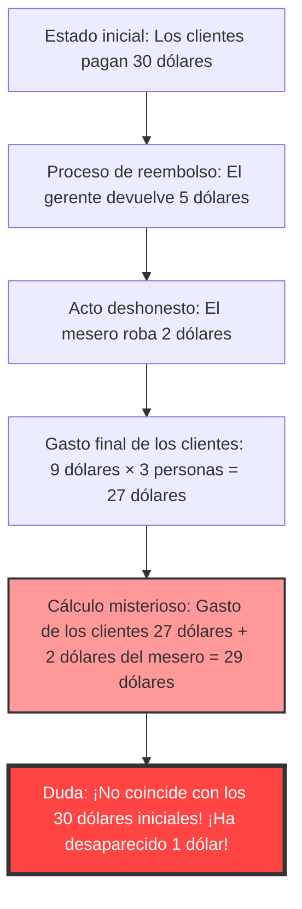
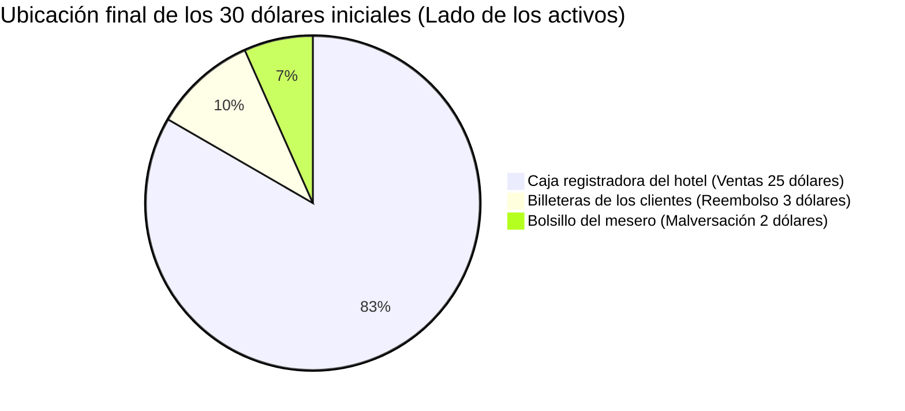

## 1. Introducción: ¿Por qué nos engañan las sumas simples?

En el mundo existen problemas misteriosos que, sin usar cálculo diferencial o topología compleja, pueden causar un corto circuito completo en el cerebro humano con solo "sumas" y "restas" al nivel de los primeros años de escuela primaria. Entre ellos, el más famoso del mundo y que ha desconcertado a muchas personas es **"El misterio del dólar perdido" (The Missing Dollar Riddle)**.

A simple vista, parece una historia sobre un problema en el cobro de un restaurante, un escenario cotidiano sin nada de especial. Sin embargo, con solo seguir un poco los cálculos, un "dólar" desaparece de repente del mundo.

En este artículo abordaremos esta famosa paradoja matemática (o más exactamente, una pregunta trampa con apariencia de paradoja), y analizaremos exhaustivamente por qué nuestra intuición se ve engañada y dónde se encuentra la trampa lógica, desde las tres perspectivas de las matemáticas, la psicología cognitiva y la contabilidad por partida doble.

---

## 2. Planteamiento del problema: El misterio del dólar perdido

Primero, por favor lee la siguiente historia. Y si tienes papel y lápiz a mano, intenta seguir los cálculos con nosotros.

> [!QUESTION] El misterio del dólar perdido (Historia)
> Un día, tres viajeros llegaron a un pequeño hotel.
> El recepcionista les dijo: "Una habitación para tres cuesta 30 dólares en total por noche".
> Los tres viajeros sacaron 10 dólares cada uno de sus billeteras, pagaron un total de 30 dólares al recepcionista y se dirigieron a su habitación.
> 
> Un poco más tarde, el gerente del hotel se acercó y le dijo al recepcionista:
> "Hoy es día de promoción, así que esa habitación cuesta 25 dólares. Ve y devuélveles 5 dólares inmediatamente".
> 
> El recepcionista se dirigió a la habitación con billetes que sumaban 5 dólares. Sin embargo, en el camino pensó:
> "Es difícil dividir 5 dólares equitativamente entre 3 personas. Si me quedo en secreto con 2 dólares y devuelvo los 3 dólares restantes, cada uno recibirá exactamente 1 dólar y las cuentas cuadrarán".
> 
> Así que el recepcionista escondió 2 dólares en su bolsillo y mintió a los viajeros diciendo: "Por la promoción se les han devuelto 3 dólares", devolviéndoles 1 dólar a cada uno.
> 
> **Ahora, aquí viene el problema.**
> 
> 1. Los viajeros inicialmente pagaron 10 dólares cada uno, y luego se les devolvió 1 dólar a cada uno, por lo que la cantidad real que pagaron es **10 dólares - 1 dólar = 9 dólares**.
> 2. La cantidad total pagada por los 3 viajeros es **9 dólares × 3 personas = 27 dólares**.
> 3. Por otro lado, en el bolsillo del recepcionista están los **2 dólares** que robó en secreto.
> 4. Sumando los **27 dólares** pagados por los viajeros y los **2 dólares** que tiene el recepcionista, el resultado es **27 + 2 = 29 dólares**.
> 
> Al principio, los viajeros ciertamente pagaron "30 dólares".
> Sin embargo, según el cálculo actual, solo hay "29 dólares".
> 
> **¿A dónde desapareció el dólar restante?**

¿Qué te parece?
Cuanto más lo lees, más se confunde tu cerebro pensando "¡Ciertamente falta 1 dólar!". Las ecuaciones en sí son cálculos muy sencillos que hasta un estudiante de primaria puede entender: `9 × 3 = 27`, `27 + 2 = 29`. Y sin embargo, por alguna razón, no concuerdan con los 30 dólares iniciales.

En los siguientes capítulos, desvelaremos el truco detrás de este extraño fenómeno.

---

## 3. Discrepancia entre la intuición y la respuesta correcta: ¿Por qué el cerebro sufre un fallo?

Cuando escuchan este problema, el proceso mental en el que caen muchas personas es el siguiente.

La verdadera identidad de esta paradoja es un ingenioso **truco de palabras (Efecto de encuadre o Framing Effect)** de "sumar cosas que no deben sumarse".

### El núcleo de la falacia: El cálculo sin sentido de "27 + 2"
Vuelve a mirar atentamente la siguiente parte al final del texto del problema.

> Sumando los **27 dólares** pagados por los viajeros y los **2 dólares** que tiene el recepcionista, el resultado es **27 + 2 = 29 dólares**.

En realidad, este cálculo de "27 + 2" en sí mismo no tiene ningún sentido lógico.
La razón es que **dentro de la "cantidad final pagada por los viajeros (27 dólares)", ya está incluida la "cantidad que el recepcionista robó (2 dólares)"**.

El desglose de los 27 dólares pagados por los viajeros es el siguiente:
*   **Cantidad en la caja registradora del hotel**: 25 dólares
*   **Cantidad robada por el recepcionista**: 2 dólares
*   Total: 27 dólares

Es decir, sumar los 2 dólares del recepcionista a los 27 dólares significa que **se están contando dos veces (Double Counting) los 2 dólares del recepcionista**.

Si quieres que las cuentas cuadren correctamente con los "30 dólares" iniciales, necesitas sumar la "cantidad pagada por los clientes" y la "cantidad devuelta a los clientes".
*   Cantidad finalmente pagada por los clientes: 27 dólares (25 dólares en la caja + 2 dólares del recepcionista)
*   Cantidad devuelta a las manos de los clientes: 3 dólares
*   Total: 27 + 3 = 30 dólares

Calculando de esta manera, queda claro que no ha desaparecido ni un solo dólar.

---

## 4. Explicación matemática: Prueba estricta mediante ecuaciones

Para aquellos que no quedan satisfechos solo con explicaciones verbales, intentemos probar el flujo de dinero (flujo de caja) utilizando fórmulas matemáticas estrictas.

Definamos el flujo total de dinero con variables.

*   $ P_{initial} $ : Cantidad total pagada inicialmente por los clientes (30)
*   $ C_{hotel} $ : Cantidad finalmente recibida por el hotel (gerente) (25)
*   $ R_{total} $ : Cantidad de reembolso entregada por el gerente al recepcionista (5)
*   $ R_{guest} $ : Cantidad de reembolso finalmente recibida por los clientes (3)
*   $ S_{waiter} $ : Cantidad robada por el recepcionista (2)

A partir del flujo de dinero inicial, se establece la siguiente ecuación:
$$ P_{initial} = C_{hotel} + R_{total} \quad \cdots (1) $$
(30 dólares = 25 dólares + 5 dólares)

Los 5 dólares devueltos por el gerente se dividen entre las manos de los clientes y el bolsillo del recepcionista.
$$ R_{total} = R_{guest} + S_{waiter} \quad \cdots (2) $$
(5 dólares = 3 dólares + 2 dólares)

Sustituimos la ecuación (2) en la ecuación (1).
$$ P_{initial} = C_{hotel} + (R_{guest} + S_{waiter}) \quad \cdots (3) $$
(30 dólares = 25 dólares + 3 dólares + 2 dólares)

Aquí, definimos la "cantidad finalmente pagada por los clientes" mencionada en el problema como $ P_{final} $. Esto es la cantidad de pago inicial menos la cantidad devuelta a los clientes.
$$ P_{final} = P_{initial} - R_{guest} \quad \cdots (4) $$
(27 dólares = 30 dólares - 3 dólares)

Transpongamos $ R_{guest} $ al lado izquierdo de la ecuación (3).
$$ P_{initial} - R_{guest} = C_{hotel} + S_{waiter} \quad \cdots (5) $$

De las ecuaciones (4) y (5), se deriva la siguiente verdad.
$$ P_{final} = C_{hotel} + S_{waiter} \quad \cdots (6) $$
(Pago final de los clientes de 27 dólares = Ingreso del hotel de 25 dólares + Robo del recepcionista de 2 dólares)

El truco en el enunciado del problema radica en **intentar sumar de nuevo $ S_{waiter} $ (2 dólares), que ya está incluido en el lado derecho, al $ P_{final} $ (27 dólares) en el lado izquierdo**.
Es decir, la ecuación a la que el problema induce es la siguiente:
$$ P_{final} + S_{waiter} = (C_{hotel} + S_{waiter}) + S_{waiter} $$
$$ 27 + 2 = (25 + 2) + 2 = 29 $$

Este número "29" es simplemente "Ingreso del hotel + Robo del recepcionista × 2", un valor imaginario que no tiene ningún sentido ni físico ni económico. Esta es la verdadera naturaleza matemática de la ilusión que hace parecer que "ha desaparecido 1 dólar".

---

## 5. Perspectiva contable: Destrozando la paradoja con la contabilidad por partida doble

Para aquellos que aún no están convencidos (o intuitivamente se sienten confundidos) incluso usando ecuaciones matemáticas, este misterio se puede visualizar perfectamente utilizando el concepto de **"Contabilidad por partida doble" (Double-Entry Bookkeeping)**, que se ha utilizado en el mundo de los negocios durante más de 500 años.

El principio básico de la contabilidad por partida doble es que el "Debe (Debit)" y el "Haber (Credit)" siempre coinciden. Usemos esto para registrar (Asiento en el diario) el movimiento del dinero.

### Transacción 1: Los clientes pagan 30 dólares
Este es el estado inicial visto desde el lado del hotel.

| Debe (Aumento de activos) | Haber (Aumento de pasivos / patrimonio neto) |
| :--- | :--- |
| Efectivo (Cash): $30 | Depósitos (o Ingresos por ventas): $30 |

### Transacción 2: El gerente entrega 5 dólares al recepcionista y registra 25 dólares como ingresos
Debido a que el precio de la habitación cambió a 25 dólares, se le dan 5 dólares al recepcionista como "fondos para reembolso".

| Debe | Haber |
| :--- | :--- |
| Depósitos: $30 | Ventas (Sales): $25 Recepcionista (Efectivo): $5 |

### Transacción 3: Acción del recepcionista (reembolso de 3 dólares y malversación de 2 dólares)
Aquí está lo más importante. Registramos el destino de los 5 dólares en efectivo que tiene el recepcionista.

| Debe | Haber |
| :--- | :--- |
| Reembolso a clientes: $3 Pérdida por malversación (Loss): $2 | Recepcionista (Efectivo): $5 |

### Estado integrado del Balance General (B/S) final y Pérdidas y Ganancias (P/L)
Como resultado de todo el proceso, resumimos dónde está el efectivo y bajo qué concepto.

**【Confirmación del estado final】**
*   **Origen de los fondos (Gasto de los clientes)**: 30 dólares
*   **Ubicación de los fondos (Resultado)**: 
    *   En la caja registradora del hotel: 25 dólares
    *   En el bolsillo del mesero: 2 dólares
    *   En manos de los clientes: 3 dólares
    *   Total = 25 + 2 + 3 = 30 dólares

Visto desde el "Principio de coincidencia de deudores y acreedores (Cuenta T)" de la contabilidad, la "cantidad de 27 dólares pagada por los clientes (gasto)" es una "disminución en el lado de los activos", y la acción de sumarle los "2 dólares robados por el mesero (movimiento en el lado de los activos)" es, bajo los estándares contables, nada menos que **un error imposible de "confundir y sumar el Debe con el Haber"**.
En el mundo de los negocios, si un contador informara a la dirección de la empresa de un cálculo de "27 + 2 = 29", sería una falla lógica de tal magnitud que resultaría en un despido inmediato o en sospechas de fraude contable.

---

## 6. Perspectiva de la psicología cognitiva: ¿Por qué aceptamos que "27+2=29"?

¿Por qué muchos seres humanos aceptan inconscientemente asintiendo con la cabeza un cálculo que es incorrecto tanto matemática como contablemente? Esto involucra fuertes **sesgos cognitivos** incorporados en el cerebro humano.

### 1. El error de la contabilidad mental (Libro de contabilidad mental)
El economista conductual Richard Thaler (ganador del Premio Nobel de Economía) propuso que los seres humanos inconscientemente realizan una "categorización del dinero (Contabilidad mental)" en sus mentes.
Al final del enunciado del problema, el "gasto de los clientes (27 dólares)" y el "dinero obtenido por el mesero (2 dólares)" se presentan como la misma categoría: "dinero". El cerebro extrae solo los "números monetarios (27 y 2)", ignora la dirección del vector de si es "dinero pagado (negativo)" o "dinero que se tiene (positivo)", y ejecuta una suma fácilmente.

### 2. Efecto de encuadre (Marco de la información)
Es el efecto por el cual las decisiones y juicios de las personas cambian dependiendo de cómo se presente la información.
La genialidad del problema radica en que **"establece la cifra inicial de 30 dólares como la meta"**.
Después de que se le presenta el cálculo "27 + 2 = 29 dólares", el cerebro intenta inconscientemente y a la fuerza conectarlo con la meta (anclaje) de "debería volver a los 30 dólares originales". Está diseñado para provocar una fuerte disonancia cognitiva (incomodidad y confusión) al hacernos comparar números que originalmente no deberían compararse, y generar ahí un margen de error de "1".

### 3. La magia de la narración de historias
Los seres humanos son más hábiles para entender "narrativas (historias)" que fórmulas matemáticas. Mientras simulamos en nuestra cabeza los movimientos de los personajes (clientes, gerente, mesero), la memoria de trabajo (memoria a corto plazo) se llena, y se agotan los recursos cognitivos para verificar la validez lógica de la ecuación final. Es exactamente la misma técnica de "Misdirection" (distracción) que usa un mago para desviar la mirada del público y lograr que su truco tenga éxito la que se utiliza en este problema verbal.

---

## 7. Historia y problemas similares de "El misterio del dólar perdido"

Este tipo de paradoja existe desde hace mucho tiempo y se ha transmitido en varias versiones a lo largo de las épocas y más allá de las fronteras.

### Origen de la paradoja
Se desconoce el origen exacto de este problema, pero se hizo ampliamente conocido en los Estados Unidos en la década de 1930. En aquel entonces se le llamaba "La paradoja del botones" (Bellboy paradox), y los montos de dinero también variaban. Se dice que refleja la psicología de las masas en Estados Unidos durante la Gran Depresión, donde el paradero de un simple "1 dólar" era un asunto de gran preocupación.

### Problema similar: El misterio de los 10 yenes perdidos
En Japón, es famosa una versión en la que las cantidades se cambian a yenes: "3 personas ponen 100 yenes cada una y compran un artículo de 300 yenes, y reciben 50 yenes de cambio...". Regularmente se convierte en un tema de conversación como en los libros de cuestionarios para niños o como el clásico "copypaste" de los foros de Internet.

### Variación más avanzada: El misterio del cuadrado perdido
Una aplicación de este "engaño verbal" a las "figuras (geometría)" es **"El misterio del cuadrado perdido" (Missing square puzzle)**, que también se presenta en otro artículo de este blog.
Es un fallo de la intuición en el que, al reorganizar las piezas de una figura que deberían tener la misma área, por alguna razón desaparece un agujero de 1 cuadrado (área). Pero esto también aprovecha los límites de la cognición humana: "el ojo humano no puede detectar ligeras distorsiones en líneas rectas (diferencias de inclinación)".

---

## 8. Lecciones para el mundo real: ¿Qué debemos aprender de la paradoja?

"El misterio del dólar perdido" tiene lecciones profundas que son demasiado buenas para dejarlas como una simple anécdota para una fiesta o un acertijo para niños.

1. **La capacidad de cuestionar el "marco dado (premisas)"**
   Cuando tomamos decisiones en los negocios diarios o en inversiones, ¿acaso nos tragamos la presentación o el argumento de ventas de alguien que dice "si sumas este número y este número, obtienes esto"?
   Incluso si el resultado del cálculo es correcto (27 + 2 es, en efecto, 29), el pensamiento crítico para preguntarse **"¿Tiene algún sentido lógico plantear esa ecuación en primer lugar?"** es indispensable.
2. **La absoluta certeza del flujo de caja**
   Se puede decir que el fraude contable (maquillaje de cuentas) en la contabilidad corporativa o la ocultación de pérdidas en productos derivados financieros complejos son un "Misterio del dólar perdido" extremadamente avanzado. Incluso si parece que se están obteniendo ganancias sumando y restando cifras irreales, si rastreas desde la raíz el "movimiento de efectivo (flujo de caja)", siempre se expondrán las contradicciones. Especialmente cuando sientes que las cosas son complejas, es necesario volver al punto básico de "de dónde vino el dinero y a dónde fue".

---

## 9. Conclusión: El dólar nunca desapareció desde el principio

Finalmente, me gustaría concluir presentando la respuesta más simple y poderosa a esta paradoja.

> **"Los clientes pagaron un total de 27 dólares; 25 dólares terminaron en la caja registradora del hotel y 2 dólares en el bolsillo del mesero. Los cálculos cuadran perfectamente. La ecuación que intenta forzosamente regresar a los 30 dólares iniciales es la causa principal de toda la confusión."**

Por mucho que evolucione, nuestro cerebro es engañado muy fácilmente por la combinación de una "historia plausible" y "sumas simples".
Sin embargo, al utilizar las poderosas herramientas de las matemáticas o la lógica (ecuaciones y contabilidad por partida doble), podemos romper esa ilusión y ver la verdad.

La próxima vez, si un amigo te plantea "El misterio del dólar perdido" con cara de suficiencia, por favor, responde fríamente respaldado por este profundo conocimiento: "Estás confundiendo los vectores de los números que debes sumar y los que debes restar".
