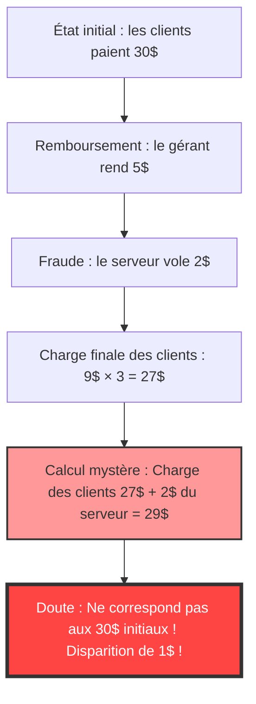
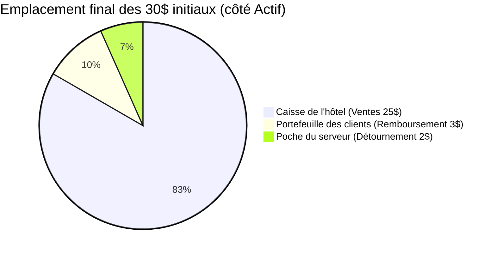

## 1. Introduction : pourquoi sommes-nous trompés par de simples additions ?

Dans notre monde, il existe des problèmes étranges qui n'utilisent ni calculs différentiels et intégraux avancés ni topologie complexe, mais de simples "additions" et "soustractions" de niveau école primaire, capables de faire complètement bugger le cerveau humain. Parmi ceux-ci, le plus célèbre au monde et qui a tourmenté d'innombrables personnes est **"Le mystère du dollar disparu (The Missing Dollar Riddle)"**.

À première vue, cela ressemble à une scène banale du quotidien, une histoire de problème d'addition dans un restaurant ou un hôtel. Cependant, il suffit de suivre un peu les calculs pour que, soudainement, "1 dollar" disparaisse de la surface de la terre.

Dans cet article, nous allons aborder ce célèbre paradoxe mathématique (plus exactement, une question piège aux allures de paradoxe) pour disséquer en profondeur pourquoi notre intuition est trompée et où se trouve la faille logique, sous trois angles : les mathématiques, la psychologie cognitive et la comptabilité en partie double.

---

## 2. L'énoncé du problème : le mystère du dollar disparu

Tout d'abord, lisez l'histoire suivante. Si vous avez un papier et un stylo sous la main, essayez de suivre les calculs avec moi.

> [!QUESTION] Le mystère du dollar disparu (L'histoire)
> Un jour, 3 voyageurs arrivent dans un petit hôtel.
> Le réceptionniste leur annonce : "La chambre pour 3 personnes coûte un total de 30 dollars pour la nuit."
> Les 3 voyageurs sortent chacun 10 dollars de leur portefeuille, paient un total de 30 dollars au réceptionniste et se dirigent vers leur chambre.
> 
> Un peu plus tard, le gérant de l'hôtel arrive et dit au réceptionniste :
> "Aujourd'hui c'est un jour de promotion, cette chambre n'est qu'à 25 dollars. Va tout de suite leur rendre 5 dollars."
> 
> Le réceptionniste se dirige vers la chambre des clients avec 5 billets d'un dollar. Mais en chemin, il se fait la réflexion suivante :
> "C'est difficile de diviser 5 dollars équitablement entre 3 personnes. Si je garde discrètement 2 dollars et que je leur rends les 3 dollars restants, cela fera exactement 1 dollar par personne et le compte sera bon."
> 
> Le réceptionniste cache donc 2 dollars dans sa poche, et ment aux voyageurs en leur disant : "Grâce à une promotion, on vous rembourse 3 dollars", et rend 1 dollar à chacun.
> 
> **Et c'est ici que réside le problème.**
> 
> 1. Les voyageurs ont initialement payé 10 dollars chacun, puis on leur a rendu 1 dollar, le montant réel qu'ils ont payé est donc de **10 dollars - 1 dollar = 9 dollars**.
> 2. Le montant total payé par les 3 voyageurs est donc de **9 dollars × 3 personnes = 27 dollars**.
> 3. D'un autre côté, le réceptionniste a dans sa poche les **2 dollars** qu'il a discrètement empochés.
> 4. Si l'on additionne les **27 dollars** payés par les voyageurs et les **2 dollars** que possède le réceptionniste, cela donne **27 + 2 = 29 dollars**.
> 
> Au début, les voyageurs ont pourtant bel et bien payé "30 dollars".
> Mais d'après les calculs actuels, nous n'avons que "29 dollars".
> 
> **Où est donc passé le dollar manquant ?**

Qu'en pensez-vous ?
Plus vous lisez, plus votre cerveau s'embrouille en se disant : "C'est vrai qu'il manque 1 dollar !". Les formules de calcul elles-mêmes, `9 × 3 = 27` et `27 + 2 = 29`, sont des opérations simples qu'un élève de primaire pourrait comprendre. Et pourtant, pour une raison quelconque, cela ne correspond plus aux 30 dollars de départ.

Dans les sections suivantes, nous allons démêler les mécanismes de ce phénomène étrange.

---

## 3. L'écart entre l'intuition et la bonne réponse : pourquoi notre cerveau bugge-t-il ?

Lorsque la plupart des gens entendent ce problème, leur processus de réflexion est le suivant :

La véritable nature de ce paradoxe réside dans un **effet de présentation (Framing Effect)** astucieux qui consiste à "additionner des éléments qui ne devraient pas l'être".

### Le cœur de l'erreur : le calcul absurde de "27 + 2"
Regardez à nouveau de plus près la dernière partie de l'énoncé du problème :

> Si l'on additionne les **27 dollars** payés par les voyageurs et les **2 dollars** que possède le réceptionniste, cela donne **27 + 2 = 29 dollars**.

En réalité, ce calcul "27 + 2" n'a absolument aucun sens logique.
Pourquoi ? Parce que **le montant que le serveur a empoché (2 dollars) est DÉJÀ inclus dans le montant final payé par les voyageurs (27 dollars)**.

Le détail des 27 dollars payés par les voyageurs est le suivant :
*   **Montant dans la caisse de l'hôtel** : 25 dollars
*   **Montant volé par le réceptionniste** : 2 dollars
*   Total : 27 dollars

En d'autres termes, ajouter les 2 dollars du réceptionniste aux 27 dollars revient à **compter deux fois (Double Counting)** les 2 dollars du réceptionniste.

Si vous voulez vraiment retrouver les "30 dollars" initiaux, vous devez additionner "le montant payé par les clients" et "le montant qui leur a été rendu" :
*   Montant final payé par les clients : 27 dollars (Caisse 25$ + Réceptionniste 2$)
*   Montant rendu aux clients : 3 dollars
*   Total : 27 + 3 = 30 dollars

En calculant ainsi, il devient évident que pas un seul dollar n'a disparu.

---

## 4. Explication mathématique : preuve rigoureuse par équations

Pour ceux qui ne seraient pas satisfaits d'une simple explication verbale, prouvons le mouvement de l'argent (flux de trésorerie) avec des formules mathématiques rigoureuses.

Définissons les mouvements globaux d'argent par des variables :

*   $ P_{initial} $ : Montant total initialement payé par les clients (30)
*   $ C_{hotel} $ : Montant finalement reçu par l'hôtel (le gérant) (25)
*   $ R_{total} $ : Montant remboursé par le gérant au réceptionniste (5)
*   $ R_{guest} $ : Montant finalement reçu par les clients en remboursement (3)
*   $ S_{waiter} $ : Montant volé par le réceptionniste (2)

D'après le flux de trésorerie initial, nous avons l'équation suivante :
$$ P_{initial} = C_{hotel} + R_{total} \quad \cdots (1) $$
(30 dollars = 25 dollars + 5 dollars)

Les 5 dollars rendus par le gérant sont répartis entre les clients et la poche du réceptionniste.
$$ R_{total} = R_{guest} + S_{waiter} \quad \cdots (2) $$
(5 dollars = 3 dollars + 2 dollars)

Substituons l'équation (2) dans l'équation (1).
$$ P_{initial} = C_{hotel} + (R_{guest} + S_{waiter}) \quad \cdots (3) $$
(30 dollars = 25 dollars + 3 dollars + 2 dollars)

Maintenant, définissons le "montant final payé par les clients" tel qu'énoncé dans le problème comme étant $ P_{final} $. Il s'agit du montant initial payé moins la somme rendue aux clients.
$$ P_{final} = P_{initial} - R_{guest} \quad \cdots (4) $$
(27 dollars = 30 dollars - 3 dollars)

À partir de l'équation (3), déplaçons $ R_{guest} $ du côté gauche.
$$ P_{initial} - R_{guest} = C_{hotel} + S_{waiter} \quad \cdots (5) $$

Des équations (4) et (5), nous déduisons la vérité suivante :
$$ P_{final} = C_{hotel} + S_{waiter} \quad \cdots (6) $$
(Paiement final des clients 27 dollars = Ventes de l'hôtel 25 dollars + Vol du réceptionniste 2 dollars)

L'astuce de l'énoncé du problème réside dans le fait **qu'il tente d'ajouter à nouveau le terme $ S_{waiter} $ (2 dollars), qui est pourtant déjà inclus dans le côté droit de l'équation, à la valeur de gauche $ P_{final} $ (27 dollars)**.
En d'autres termes, l'équation suggérée par le problème ressemble à cela :
$$ P_{final} + S_{waiter} = (C_{hotel} + S_{waiter}) + S_{waiter} $$
$$ 27 + 2 = (25 + 2) + 2 = 29 $$

Ce chiffre "29" est simplement "Ventes de l'hôtel + Vol du réceptionniste × 2", une valeur fictive qui n'a absolument aucune signification physique ou économique. Voilà la véritable nature mathématique de l'illusion qui donne l'impression qu'un "1 dollar a disparu".

---

## 5. Le point de vue de la comptabilité : détruire le paradoxe avec la comptabilité en partie double

Si les équations mathématiques ne vous convainquent toujours pas (ou si vous avez une intuition confuse), le concept de la **"Comptabilité en partie double (Double-Entry Bookkeeping)"**, utilisé dans le monde des affaires depuis plus de 500 ans, permet de visualiser parfaitement ce mystère.

Le principe de base de la comptabilité en partie double est que le "Débit (Debit)" et le "Crédit (Credit)" doivent toujours correspondre. Faisons les écritures de journal (Journal Entry) pour les mouvements d'argent.

### Transaction 1 : Les clients paient 30 dollars
L'état initial du point de vue de l'hôtel.

| Débit (Augmentation des actifs) | Crédit (Augmentation du passif/capitaux propres) |
| :--- | :--- |
| Espèces (Cash) : 30$ | Dépôts reçus (ou Ventes) : 30$ |

### Transaction 2 : Le gérant remet 5$ au réceptionniste, enregistre 25$ de ventes
Puisque le prix de la chambre a été modifié à 25 dollars, 5 dollars sont remis au réceptionniste pour un "remboursement".

| Débit | Crédit |
| :--- | :--- |
| Dépôts reçus : 30$ | Ventes (Sales) : 25$ Réceptionniste (Espèces) : 5$ |

### Transaction 3 : Action du réceptionniste (Remboursement de 3$ et détournement de 2$)
C'est ici le point clé. Nous enregistrons la destination des 5 dollars en espèces détenus par le réceptionniste.

| Débit | Crédit |
| :--- | :--- |
| Remboursement aux clients : 3$ Perte sur détournement (Loss) : 2$ | Réceptionniste (Espèces) : 5$ |

### Bilan final de la balance (B/S) et des pertes et profits (P/L)
En résumé, nous vérifions où se trouve l'argent et sous quel nom.

**【Vérification de l'état final】**
*   **Source des fonds (Dépense des clients)** : 30 dollars
*   **Emplacement des fonds (Résultat)** : 
    *   25 dollars dans la caisse de l'hôtel
    *   2 dollars dans la poche du serveur
    *   3 dollars chez les clients
    *   Total = 25 + 2 + 3 = 30 dollars

Si l'on regarde à travers le "Principe de la partie double (compte en T)" de la comptabilité, "les 27 dollars payés par les clients (dépense)" représentent "une diminution côté actif", et y ajouter "les 2 dollars volés par le serveur (déplacement côté actif)" est une **erreur inconcevable consistant à "additionner en confondant Débit et Crédit"** selon les normes comptables.
Dans le monde des affaires, si un comptable rapportait à la direction un calcul de "27 + 2 = 29", ce serait une aberration logique d'un niveau suffisant pour justifier un renvoi immédiat ou des soupçons de fraude comptable.

---

## 6. Le point de vue de la psychologie cognitive : pourquoi acceptons-nous que "27+2=29" ?

Pourquoi tant de personnes acceptent-elles inconsciemment en disant "Hmm, d'accord" une formule mathématiquement et comptablement incorrecte ? Cela est dû à un **biais cognitif** puissant ancré dans le cerveau humain.

### 1. Le bug de la comptabilité mentale (Mental Accounting)
L'économiste comportemental Richard Thaler (lauréat du prix Nobel d'économie) a suggéré que les humains catégorisent inconsciemment l'argent dans leur tête ("Comptabilité mentale").
À la fin de l'énoncé du problème, "la dépense des clients (27 dollars)" et "l'argent gagné par le serveur (2 dollars)" sont présentés comme la même catégorie : "Argent". Le cerveau isole seulement "les chiffres (27 et 2)", ignore la direction du vecteur — s'il s'agit "d'argent payé (moins)" ou "d'argent que l'on possède (plus)" — et effectue facilement l'addition.

### 2. L'effet de présentation (Framing Effect)
C'est un effet où la façon dont l'information est présentée change les décisions et les jugements des gens.
Ce qui est habile dans ce problème, c'est **d'avoir fixé le chiffre initial de "30 dollars" comme objectif**.
Après s'être vu présenter le calcul de "27 + 2 = 29 dollars", le cerveau essaie inconsciemment et de force de le relier à l'objectif (ancrage) "cela devrait être les 30 dollars d'origine". Ce problème est conçu pour forcer une comparaison entre des nombres qui ne devraient pas être comparés, créant ainsi un écart de "1" qui provoque une forte dissonance cognitive (inconfort et confusion).

### 3. La magie de la narration (Storytelling)
Les humains sont bien meilleurs pour comprendre des "histoires" que des formules mathématiques. En simulant mentalement les actions des personnages (clients, gérant, serveur), la mémoire de travail (mémoire à court terme) se remplit, épuisant ainsi les ressources cognitives nécessaires pour vérifier la validité logique de l'équation finale. La même technique de "misdirection" qu'utilise un magicien pour réussir son tour en détournant l'attention du public est utilisée dans ce problème.

---

## 7. Histoire et problèmes similaires du "Mystère du dollar disparu"

Ce genre de paradoxe existe depuis longtemps et est transmis à travers les époques et les frontières sous diverses variations.

### Origine du paradoxe
L'origine exacte de ce problème est inconnue, mais il est devenu largement connu aux États-Unis dans les années 1930. À l'époque, on l'appelait "Le paradoxe du groom (Bellboy paradox)" et les montants variaient. On dit que cela reflète la psychologie des masses de la Grande Dépression aux États-Unis, où le sort d'un simple "1 dollar" était un sujet de préoccupation majeur.

### Problème similaire : Le mystère des 10 yens disparus
Au Japon, une version célèbre remplace les montants par des yens : "3 personnes donnent chacune 100 yens pour acheter un article à 300 yens, et la monnaie est de 50 yens...". C'est un sujet qui refait régulièrement surface dans les livres de quiz pour enfants ou comme copié-collé classique sur les forums Internet.

### Version dérivée plus avancée : Le mystère du carré manquant
Une application de cette "tromperie verbale" à la "géométrie" est le célèbre **"Mystère du carré manquant (Missing square puzzle)"**, également présenté dans un autre article de ce blog.
C'est un bug de l'intuition où, en réarrangeant des pièces de figures géométriques censées avoir la même surface, un trou (surface) équivalent à un carré disparaît mystérieusement. Cela exploite la limite cognitive selon laquelle "l'œil humain ne peut pas détecter de légères distorsions de lignes droites (différences d'inclinaison)".

---

## 8. Leçon pour le monde réel : que devons-nous apprendre du paradoxe ?

"Le mystère du dollar disparu" comporte des leçons profondes qu'il serait dommage de reléguer au rang de simple anecdote de soirée ou de quiz pour enfants.

1. **La capacité à douter du "cadre donné (prémisses)"**
   Lorsque nous prenons des décisions dans les affaires ou les investissements, n'avalons-nous pas aveuglément les présentations ou arguments de vente qui disent : "Si vous additionnez ce chiffre et ce chiffre, vous obtenez cela" ?
   Même si le résultat du calcul est correct (27 + 2 fait bien 29), il est essentiel d'avoir une pensée critique (Critical Thinking) pour se demander : **"Le fait de poser cette équation a-t-il un sens logique en premier lieu ?"**.
2. **L'aspect absolu du flux de trésorerie (Cash Flow)**
   Les fraudes comptables dans les entreprises et la dissimulation de pertes sur des produits financiers dérivés complexes (Derivatives) peuvent être considérées comme des versions extrêmement sophistiquées du "Mystère du dollar disparu". Même si l'on donne l'illusion de bénéfices en ajoutant ou en soustrayant des nombres fictifs, si l'on trace les "mouvements d'argent liquide (cash flow)" depuis leur base, les contradictions apparaîtront toujours au grand jour. C'est précisément quand les choses semblent complexes qu'il faut revenir à la base : "D'où vient l'argent et où est-il allé ?".

---

## 9. Conclusion : le dollar n'a jamais disparu dès le début

Pour conclure, j'aimerais proposer la réponse la plus concise et la plus puissante à ce paradoxe.

> **"Les clients ont payé un total de 27 dollars : 25 dollars sont allés dans la caisse de l'hôtel, et 2 dollars dans la poche du serveur. Le calcul est parfaitement juste. La formule qui essaie de forcer un retour aux 30 dollars initiaux est la véritable source de toute la confusion."**

Peu importe l'évolution de notre cerveau, il se laisse très facilement berner par la combinaison d'une "histoire plausible" et d'une "simple addition".
Cependant, en utilisant des outils puissants tels que les mathématiques et la logique (équations et comptabilité en partie double), nous pouvons briser cette illusion et voir la vérité.

La prochaine fois qu'un ami vous posera fièrement "Le mystère du dollar disparu", fort de ces connaissances approfondies, répondez-lui avec calme : "Ton vecteur des nombres à additionner et à soustraire est erroné !"
