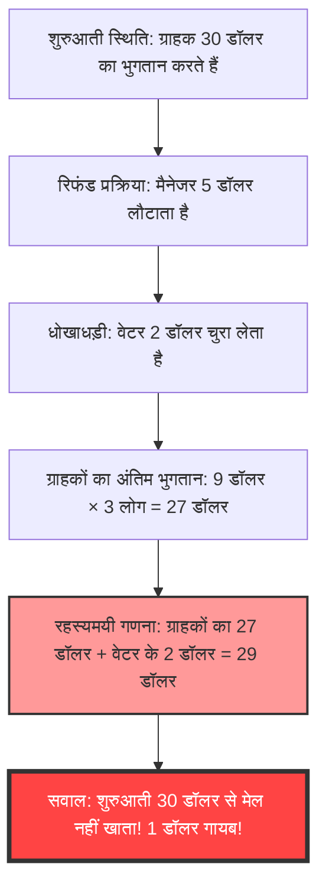
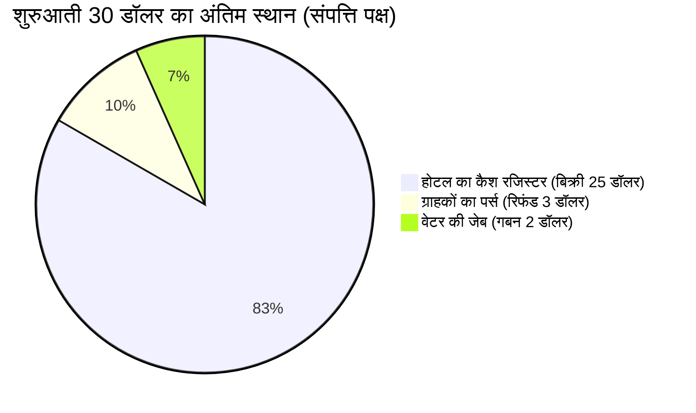

## 1. परिचय: हम साधारण जोड़ में भी क्यों धोखा खा जाते हैं?

दुनिया में ऐसी अजीबोगरीब समस्याएं मौजूद हैं जो इंसान के दिमाग को पूरी तरह से चकरा सकती हैं, और इसके लिए किसी एडवांस कैलकुलस या जटिल टोपोलॉजी की आवश्यकता नहीं है, बल्कि प्राइमरी स्कूल स्तर के "जोड़" और "घटाव" ही काफी हैं। इनमें से सबसे प्रसिद्ध और कई लोगों को परेशान करने वाली समस्या है **"गायब हुए 1 डॉलर का रहस्य (The Missing Dollar Riddle)"**।

पहली नज़र में, यह एक साधारण रोज़मर्रा की घटना लगती है - एक रेस्तरां या होटल में बिल चुकाने की परेशानी की कहानी। लेकिन थोड़ा सा हिसाब लगाने पर ही, ऐसा लगता है जैसे दुनिया से "1 डॉलर" अचानक गायब हो गया हो।

इस लेख में, हम इस प्रसिद्ध गणितीय पैराडॉक्स (या अधिक सटीक रूप से, एक पैराडॉक्स-नुमा ट्रिकी सवाल) पर चर्चा करेंगे। हम गणित, कॉग्निटिव साइकोलॉजी (संज्ञानात्मक मनोविज्ञान), और डबल-एंट्री बुककीपिंग (अकाउंटिंग) के तीन दृष्टिकोणों से गहराई से विश्लेषण करेंगे कि क्यों हमारा सहज ज्ञान धोखा खा जाता है, और लॉजिक की खामी कहाँ छिपी है।

---

## 2. समस्या की प्रस्तुति: गायब हुए 1 डॉलर का रहस्य

सबसे पहले, नीचे दी गई कहानी पढ़ें। यदि आपके पास पेन और पेपर है, तो साथ में गणना करने का प्रयास करें।

> [!QUESTION] गायब हुए 1 डॉलर का रहस्य (कहानी)
> एक दिन, 3 यात्री एक छोटे से होटल में पहुंचे।
> रिसेप्शनिस्ट ने उन्हें बताया: "3-बेड वाले कमरे का एक रात का किराया कुल 30 डॉलर है।"
> तीनों यात्रियों ने अपने-अपने पर्स से 10-10 डॉलर निकाले और रिसेप्शनिस्ट को कुल 30 डॉलर देकर अपने कमरे में चले गए।
> 
> थोड़ी देर बाद, होटल का मैनेजर आया और उसने रिसेप्शनिस्ट से कहा:
> "आज कोई विशेष ऑफर चल रहा है, इसलिए उस कमरे का किराया सिर्फ 25 डॉलर है। जाकर तुरंत उन्हें 5 डॉलर वापस कर दो।"
> 
> रिसेप्शनिस्ट 5 डॉलर लेकर उनके कमरे की ओर बढ़ा। लेकिन रास्ते में उसने सोचा:
> "5 डॉलर को 3 लोगों में बराबर बांटना मुश्किल है। अगर मैं चुपचाप 2 डॉलर रख लूँ और बाकी 3 डॉलर उन्हें लौटा दूँ, तो हर किसी को 1-1 डॉलर मिलेगा और हिसाब भी बराबर रहेगा।"
> 
> इसलिए रिसेप्शनिस्ट ने 2 डॉलर अपनी जेब में छिपा लिए और यात्रियों से झूठ बोला: "ऑफर के कारण आपको 3 डॉलर वापस किए जा रहे हैं", और हर एक को 1-1 डॉलर लौटा दिया।
> 
> **अब, यहाँ से असली सवाल शुरू होता है।**
> 
> 1. यात्रियों ने शुरू में 10-10 डॉलर दिए, और बाद में उन्हें 1-1 डॉलर वापस मिल गया, इसका मतलब है कि उन्होंने वास्तव में **10 डॉलर - 1 डॉलर = 9 डॉलर** का भुगतान किया।
> 2. 3 यात्रियों द्वारा चुकाई गई कुल रकम है: **9 डॉलर × 3 लोग = 27 डॉलर**।
> 3. दूसरी ओर, रिसेप्शनिस्ट की जेब में उसके द्वारा चुपचाप चुराए गए **2 डॉलर** हैं।
> 4. यात्रियों द्वारा दिए गए **27 डॉलर** और रिसेप्शनिस्ट के पास मौजूद **2 डॉलर** को जोड़ने पर, **27 + 2 = 29 डॉलर** होते हैं।
> 
> शुरू में, यात्रियों ने निश्चित रूप से "30 डॉलर" का भुगतान किया था।
> लेकिन अब जो हिसाब किया गया है, उसके अनुसार केवल "29 डॉलर" ही हैं।
> 
> **तो बचा हुआ 1 डॉलर कहाँ गायब हो गया?**

तो कैसा लगा?
आप इसे जितना पढ़ेंगे, आपका दिमाग उतना ही चकराएगा और आप सोचेंगे, "वाकई 1 डॉलर कम है!"। हिसाब के समीकरण `9 × 3 = 27` और `27 + 2 = 29` हैं, जो इतने सरल हैं कि कोई भी बच्चा समझ सकता है। फिर भी, यह शुरुआती 30 डॉलर्स के साथ मेल नहीं खाता।

आइए अगले अध्यायों में इस अजीब घटना के रहस्य को उजागर करें।

---

## 3. अंतर्ज्ञान और वास्तविकता में अंतर: हमारा दिमाग क्यों चकरा जाता है?

जब लोग इस समस्या को सुनते हैं, तो उनकी सोचने की प्रक्रिया कुछ इस प्रकार होती है:

इस पैराडॉक्स का रहस्य एक बहुत ही चालाक **शब्दों के खेल (Framing Effect: फ्रेमिंग इफेक्ट)** में छिपा है, जहां हम "ऐसी चीजों को जोड़ रहे होते हैं जिन्हें नहीं जोड़ा जाना चाहिए"।

### भ्रांति का मूल: "27 + 2" एक अर्थहीन गणना है
समस्या के अंत में दिए गए इस हिस्से को एक बार फिर से ध्यान से देखें:

> यात्रियों द्वारा दिए गए **27 डॉलर** और रिसेप्शनिस्ट के पास मौजूद **2 डॉलर** को जोड़ने पर, **27 + 2 = 29 डॉलर** होते हैं।

दरअसल, यह "27 + 2" का हिसाब लॉजिकल नजरिए से पूरी तरह से बेमानी है।
ऐसा इसलिए है क्योंकि **"यात्रियों द्वारा भुगतान की गई अंतिम राशि (27 डॉलर)" में पहले से ही "रिसेप्शनिस्ट द्वारा चुराई गई राशि (2 डॉलर)" शामिल है**।

यात्रियों द्वारा भुगतान किए गए 27 डॉलर का विवरण कुछ इस प्रकार है:
*   **होटल के कैश रजिस्टर में मौजूद राशि**: 25 डॉलर
*   **रिसेप्शनिस्ट द्वारा चुराई गई राशि**: 2 डॉलर
*   कुल: 27 डॉलर

अर्थात, 27 डॉलर में रिसेप्शनिस्ट के 2 डॉलर और जोड़ने का मतलब है कि **हम रिसेप्शनिस्ट के 2 डॉलर को "दो बार गिन (Double Counting)" रहे हैं**।

अगर आप शुरुआत के "30 डॉलर" का सही हिसाब लगाना चाहते हैं, तो आपको "ग्राहकों द्वारा भुगतान की गई राशि" और "ग्राहकों को वापस मिली राशि" को जोड़ना होगा:
*   ग्राहकों द्वारा अंततः भुगतान की गई राशि: 27 डॉलर (रजिस्टर के 25 डॉलर + रिसेप्शनिस्ट के 2 डॉलर)
*   ग्राहकों को वापस मिली राशि: 3 डॉलर
*   कुल: 27 + 3 = 30 डॉलर

इस तरह से गणना करने पर, यह स्पष्ट हो जाता है कि 1 डॉलर भी गायब नहीं हुआ है।

---

## 4. गणितीय स्पष्टीकरण: समीकरणों द्वारा कठोर प्रमाण

यदि शब्दों का स्पष्टीकरण आपको संतुष्ट नहीं करता है, तो आइए हम कैश फ्लो (पैसे के प्रवाह) को साबित करने के लिए कठोर गणितीय समीकरणों का उपयोग करें।

हम पैसे के पूरे लेन-देन को वेरिएबल्स (variables) द्वारा परिभाषित करेंगे:

*   $ P_{initial} $ : ग्राहकों द्वारा शुरुआत में भुगतान की गई कुल राशि (30)
*   $ C_{hotel} $ : होटल (मैनेजर) को अंततः प्राप्त राशि (25)
*   $ R_{total} $ : मैनेजर द्वारा रिसेप्शनिस्ट को दी गई रिफंड राशि (5)
*   $ R_{guest} $ : ग्राहकों को अंततः प्राप्त रिफंड राशि (3)
*   $ S_{waiter} $ : रिसेप्शनिस्ट द्वारा चुराई गई राशि (2)

शुरुआती पैसे के लेन-देन से, निम्नलिखित समीकरण बनता है:
$$ P_{initial} = C_{hotel} + R_{total} \quad \cdots (1) $$
(30 डॉलर = 25 डॉलर + 5 डॉलर)

मैनेजर द्वारा लौटाए गए 5 डॉलर ग्राहकों और रिसेप्शनिस्ट के बीच बंट जाते हैं:
$$ R_{total} = R_{guest} + S_{waiter} \quad \cdots (2) $$
(5 डॉलर = 3 डॉलर + 2 डॉलर)

अब हम समीकरण (2) को समीकरण (1) में रखते हैं:
$$ P_{initial} = C_{hotel} + (R_{guest} + S_{waiter}) \quad \cdots (3) $$
(30 डॉलर = 25 डॉलर + 3 डॉलर + 2 डॉलर)

अब, हम समस्या में वर्णित "ग्राहकों द्वारा अंततः भुगतान की गई राशि" को $ P_{final} $ के रूप में परिभाषित करते हैं। यह प्रारंभिक भुगतान से ग्राहकों को वापस मिली राशि घटाकर आता है:
$$ P_{final} = P_{initial} - R_{guest} \quad \cdots (4) $$
(27 डॉलर = 30 डॉलर - 3 डॉलर)

समीकरण (3) से $ R_{guest} $ को बाईं ओर ले जाते हैं:
$$ P_{initial} - R_{guest} = C_{hotel} + S_{waiter} \quad \cdots (5) $$

समीकरण (4) और समीकरण (5) से, निम्नलिखित सच्चाई सामने आती है:
$$ P_{final} = C_{hotel} + S_{waiter} \quad \cdots (6) $$
(ग्राहकों का अंतिम भुगतान 27 डॉलर = होटल की कमाई 25 डॉलर + रिसेप्शनिस्ट की चोरी 2 डॉलर)

समस्या की चाल यह है कि **बाईं ओर मौजूद $ P_{final} $ (27 डॉलर) के साथ, दाईं ओर पहले से शामिल $ S_{waiter} $ (2 डॉलर) को फिर से जोड़ने का प्रयास किया गया है**।
यानी, जिस समीकरण की ओर कहानी हमें ले जाती है, वह कुछ इस प्रकार है:
$$ P_{final} + S_{waiter} = (C_{hotel} + S_{waiter}) + S_{waiter} $$
$$ 27 + 2 = (25 + 2) + 2 = 29 $$

यह "29" की संख्या पूरी तरह से काल्पनिक है, जिसका मतलब केवल "होटल की कमाई + रिसेप्शनिस्ट की चोरी × 2" है। इसका कोई भौतिक या आर्थिक अर्थ नहीं है। गणितीय रूप से यही उस भ्रम का कारण है जिससे लगता है कि "1 डॉलर गायब हो गया"।

---

## 5. अकाउंटिंग का दृष्टिकोण: डबल-एंट्री बुककीपिंग के साथ पैराडॉक्स को सुलझाना

यदि गणितीय समीकरण आपको आश्वस्त नहीं करते (या अभी भी भ्रमित करते हैं), तो इस रहस्य को पूरी तरह से स्पष्ट करने के लिए आप **"डबल-एंट्री बुककीपिंग (Double-Entry Bookkeeping)"** का उपयोग कर सकते हैं, जिसका उपयोग व्यावसायिक दुनिया में 500 वर्षों से किया जा रहा है।

डबल-एंट्री बुककीपिंग का मूल सिद्धांत यह है कि "डेबिट (Debit)" और "क्रेडिट (Credit)" हमेशा बराबर होने चाहिए। आइए जर्नल एंट्रीज़ (Journal Entries) का उपयोग करके पैसे के लेन-देन को रिकॉर्ड करें।

### लेन-देन 1: ग्राहकों ने 30 डॉलर का भुगतान किया
यह होटल के नजरिए से शुरुआती स्थिति है।

| डेबिट (संपत्ति में वृद्धि) | क्रेडिट (देनदारी/इक्विटी में वृद्धि) |
| :--- | :--- |
| नकद (Cash): $30 | अग्रिम जमा (या बिक्री): $30 |

### लेन-देन 2: मैनेजर 5 डॉलर रिसेप्शनिस्ट को देता है, और 25 डॉलर की बिक्री बुक करता है
कमरे का किराया 25 डॉलर कर दिया गया है, इसलिए वह रिसेप्शनिस्ट को "रिफंड" के रूप में 5 डॉलर देता है।

| डेबिट | क्रेडिट |
| :--- | :--- |
| अग्रिम जमा: $30 | बिक्री (Sales): $25 रिसेप्शनिस्ट (नकद): $5 |

### लेन-देन 3: रिसेप्शनिस्ट की कार्यवाही (3 डॉलर का रिफंड और 2 डॉलर का गबन)
यह सबसे महत्वपूर्ण हिस्सा है। हम रिकॉर्ड करते हैं कि रिसेप्शनिस्ट के पास मौजूद 5 डॉलर नकद का क्या हुआ।

| डेबिट | क्रेडिट |
| :--- | :--- |
| ग्राहकों को रिफंड: $3 गबन का नुकसान (Loss): $2 | रिसेप्शनिस्ट (नकद): $5 |

### अंतिम बैलेंस शीट (B/S) और प्रॉफिट एंड लॉस (P/L) की संयुक्त स्थिति
अंत में हम देखते हैं कि पैसा कहां है और किस नाम से है:

**【अंतिम स्थिति की पुष्टि】**
*   **पैसे का स्रोत (ग्राहकों का खर्च)**: 30 डॉलर
*   **पैसे का स्थान (परिणाम)**: 
    *   होटल के कैश रजिस्टर में: 25 डॉलर
    *   वेटर की जेब में: 2 डॉलर
    *   ग्राहकों के पास: 3 डॉलर
    *   कुल = 25 + 2 + 3 = 30 डॉलर

अकाउंटिंग के "डेबिट और क्रेडिट के सिद्धांत (T-अकाउंट)" के नजरिए से देखा जाए, तो "ग्राहकों द्वारा चुकाए गए 27 डॉलर (खर्च)" का मतलब "संपत्ति पक्ष में कमी" है। और इसमें "वेटर द्वारा चुराए गए 2 डॉलर (संपत्ति पक्ष का स्थानांतरण)" को जोड़ने की प्रक्रिया अकाउंटिंग मानकों में **"डेबिट और क्रेडिट को मिलाकर जोड़ने की एक असंभव गलती"** है।
व्यवसाय की दुनिया में, अगर कोई एकाउंटेंट मैनेजमेंट को "27 + 2 = 29" की गणना रिपोर्ट करता है, तो यह इतनी बड़ी तार्किक विफलता होगी कि उसे या तो तुरंत निकाल दिया जाएगा या वित्तीय धोखाधड़ी का संदेह होगा।

---

## 6. कॉग्निटिव साइकोलॉजी (संज्ञानात्मक मनोविज्ञान) का दृष्टिकोण: हम "27+2=29" को क्यों स्वीकार कर लेते हैं?

गणित और अकाउंटिंग दोनों के नजरिए से गलत समीकरण होने के बावजूद, हम में से बहुत से लोग अनजाने में इसे "हाँ, सही बात है" कहकर क्यों स्वीकार कर लेते हैं? इसके पीछे हमारे मस्तिष्क में मौजूद शक्तिशाली **संज्ञानात्मक पूर्वाग्रह (Cognitive Biases)** हैं।

### 1. मेंटल अकाउंटिंग (मानसिक बहीखाता) का बग
बिहेवियरल इकोनॉमिस्ट और नोबेल पुरस्कार विजेता रिचर्ड थेलर ने प्रस्ताव दिया कि मनुष्य अनजाने में अपने दिमाग में पैसे को अलग-अलग श्रेणियों में बांट लेता है, जिसे "मेंटल अकाउंटिंग" कहते हैं।
समस्या के अंत में, "ग्राहकों का खर्च (27 डॉलर)" और "वेटर को मिला पैसा (2 डॉलर)" दोनों को "पैसे" की एक ही श्रेणी में प्रस्तुत किया जाता है। हमारा मस्तिष्क केवल "धनराशि की संख्याओं (27 और 2)" को चुनता है, और यह भूल जाता है कि एक "भुगतान किया गया पैसा (माइनस)" है और दूसरा "प्राप्त किया गया पैसा (प्लस)", और वह बिना सोचे-समझे जोड़ना शुरू कर देता है।

### 2. फ्रेमिंग इफेक्ट (जानकारी का ढांचा)
यह वह प्रभाव है जहां जानकारी को जिस तरीके से प्रस्तुत किया जाता है, वह हमारे निर्णय और 판단 (निर्णय) को बदल देता है।
समस्या की चतुर बात यह है कि **"शुरुआती 30 डॉलर को एक लक्ष्य के रूप में निर्धारित किया गया है"**।
"27 + 2 = 29 डॉलर" की गणना देखने के बाद, दिमाग अनजाने में इसे "मूल 30 डॉलर होना चाहिए" वाले लक्ष्य (एंकरिंग) से जोड़ने की कोशिश करता है। हमें ऐसे नंबरों की तुलना करने के लिए मजबूर किया जाता है जिनकी तुलना नहीं की जानी चाहिए, और "1" के अंतर के कारण यह हमारे दिमाग में गंभीर कॉग्निटिव डिसोनेंस (संज्ञानात्मक असंगति - बेचैनी और भ्रम) पैदा करता है।

### 3. कहानी सुनाने (स्टोरीटेलिंग) का जादू
मनुष्य समीकरणों की तुलना में "कहानियों" को समझने में अधिक माहिर होता है। पात्रों (ग्राहक, मैनेजर, और वेटर) की गतिविधियों को हमारे दिमाग में सिमुलेट करते समय, हमारी वर्किंग मेमोरी (अल्पकालिक स्मृति) पूरी तरह से भर जाती है, और अंत में समीकरण के तर्कों को सत्यापित करने के लिए मानसिक संसाधन समाप्त हो जाते हैं। कहानी में यह बिल्कुल वही "मिसडायरेक्शन (ध्यान भटकाने)" तकनीक है जिसका उपयोग जादूगर अपनी चालों को सफल बनाने के लिए करते हैं।

---

## 7. "गायब हुए 1 डॉलर का रहस्य" का इतिहास और समान समस्याएं

इस तरह के पैराडॉक्स प्राचीन काल से चले आ रहे हैं और युगों व सीमाओं को पार करके विभिन्न रूपों में सुनाए जाते रहे हैं।

### पैराडॉक्स की उत्पत्ति
इस विशिष्ट समस्या की सटीक उत्पत्ति अज्ञात है, लेकिन 1930 के दशक में यह अमेरिका में व्यापक रूप से लोकप्रिय हो गई। उस समय, इसे "बेलबॉय पैराडॉक्स (Bellboy paradox)" कहा जाता था, और पैसे की मात्रा भी बदलती रहती थी। कहा जाता है कि ग्रेट डिप्रेशन (महामंदी) के युग के अमेरिका में, केवल "1 डॉलर" के ठिकाने को लेकर यह पहेली लोगों की गहरी चिंता को दर्शाती है।

### समान समस्या: गायब हुए 10 येन का रहस्य
जापान में, इसका एक येन वाला संस्करण बहुत प्रसिद्ध है: "3 लोगों ने 100-100 येन दिए और 300 येन का सामान खरीदा, और 50 येन का चेंज मिला..."। यह अक्सर बच्चों की क्विज़ किताबों में या इंटरनेट मंचों पर एक क्लासिक कॉपी-पेस्ट पहेली के रूप में उभरता रहता है। (हिंदी में इसे रुपये से जोड़ा जा सकता है: गायब हुए 10 रुपये का रहस्य)।

### और अधिक जटिल रूप: गायब हुए वर्ग (Square) का रहस्य
इस "शब्दों के धोखे" को "आकृतियों (Geometry)" में लागू करना इस ब्लॉग के दूसरे लेख में भी चर्चा में है, जिसे **"गायब हुए वर्ग का रहस्य (Missing square puzzle)"** कहा जाता है।
यह हमारे अंतर्ज्ञान में एक बग है जहां समान क्षेत्रफल वाले टुकड़ों को फिर से व्यवस्थित करने पर किसी तरह 1 वर्ग (क्षेत्रफल) का छेद बन जाता है। यह इस संज्ञानात्मक सीमा का फायदा उठाता है कि "मनुष्य की आंखें सीधी रेखा में मामूली विकृतियों (ढलान में अंतर) का पता नहीं लगा सकती हैं"।

---

## 8. वास्तविक दुनिया के लिए सबक: पैराडॉक्स से हमें क्या सीखना चाहिए?

"गायब हुए 1 डॉलर का रहस्य" को केवल पार्टी का एक मज़ाक या बच्चों की पहेली समझकर छोड़ देना सही नहीं है; इसमें बहुत गहरे सबक छिपे हैं।

1. **"दिए गए ढांचे (मान्यताओं)" पर संदेह करने की क्षमता**
   जब हम अपने दैनिक व्यवसाय या निवेश में निर्णय लेते हैं, तो क्या हम किसी के द्वारा प्रस्तुत की गई इस बात पर आँख बंद करके विश्वास कर लेते हैं: "इस संख्या और इस संख्या को जोड़ने पर यह परिणाम आएगा" जैसे कि प्रेजेंटेशन या सेल्स पिच में?
   भले ही गणना सही हो (27 + 2 वास्तव में 29 है), लेकिन **"क्या उस समीकरण को बनाने का ही कोई तार्किक अर्थ है?"** यह पूछने की आलोचनात्मक सोच (क्रिटिकल थिंकिंग) होना अत्यंत आवश्यक है।
2. **कैश फ्लो (पैसे के प्रवाह) की पूर्णता**
   कॉर्पोरेट अकाउंटिंग में धोखाधड़ी या जटिल फाइनेंशियल डेरिवेटिव्स के नुकसान को छिपाने की कोशिशें, "गायब हुए 1 डॉलर के रहस्य" का ही अत्यधिक उन्नत रूप हैं। भले ही वे अवास्तविक नंबरों को जोड़-घटाकर मुनाफा दिखाएं, लेकिन अगर आप पैसे की वास्तविक गति ("कैश फ्लो") को उसके मूल से ट्रैक करेंगे, तो विरोधाभास हमेशा सामने आ जाएंगे। जब भी चीजें जटिल लगें, तो "पैसा कहां से आया और कहां गया" के मूल सिद्धांत पर लौटना जरूरी है।

---

## 9. निष्कर्ष: 1 डॉलर कभी गायब हुआ ही नहीं था

अंत में, मैं इस पैराडॉक्स का सबसे संक्षिप्त और शक्तिशाली उत्तर देकर इस लेख को समाप्त करना चाहूंगा।

> **"ग्राहकों ने कुल 27 डॉलर का भुगतान किया, होटल के रजिस्टर में 25 डॉलर गए, और वेटर की जेब में 2 डॉलर। हिसाब पूरी तरह से सही है। शुरुआती 30 डॉलर पर वापस जाने के लिए जो जबरन समीकरण बनाया गया है, वही सारी उलझन की जड़ है।"**

हमारा दिमाग चाहे जितना विकसित हो जाए, वह बड़ी आसानी से "एक विश्वसनीय कहानी" और "साधारण जोड़" के संयोजन से धोखा खा सकता है।
हालांकि, गणित या तर्कशास्त्र (जैसे समीकरण या डबल-एंट्री बुककीपिंग) जैसे शक्तिशाली उपकरणों का उपयोग करके, हम उस भ्रम को तोड़ सकते हैं और सच्चाई को देख सकते हैं।

अगली बार, यदि आपका कोई दोस्त आत्मविश्वास के साथ आपसे "गायब हुए 1 डॉलर का रहस्य" पूछे, तो इस गहरे ज्ञान का उपयोग करें और शांति से उत्तर दें: "तुम जिन नंबरों को जोड़ रहे हो और घटा रहे हो, उनकी दिशा (वेक्टर) ही गलत है!"
