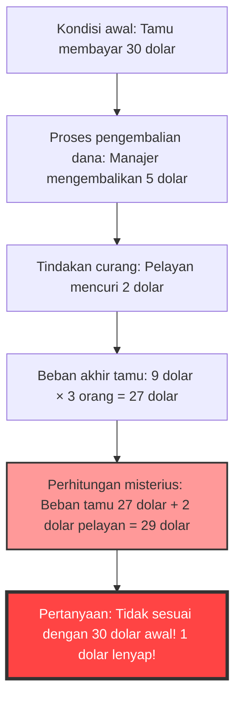
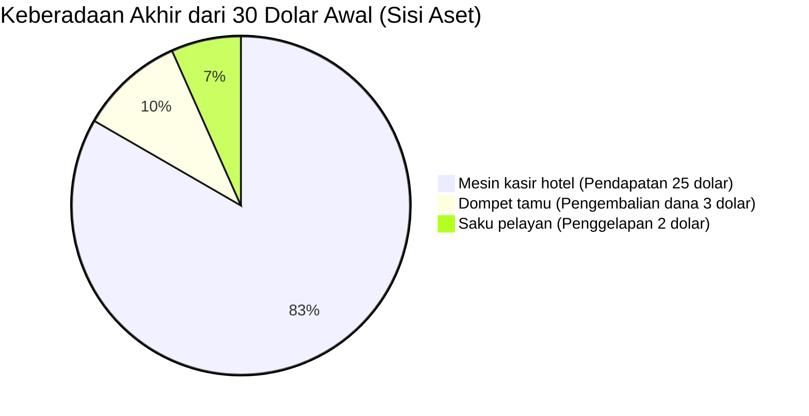

## 1. Pendahuluan: Mengapa Kita Tertipu oleh Penjumlahan Sederhana?

Di dunia ini, ada masalah aneh yang bahkan tanpa menggunakan kalkulus tingkat lanjut atau topologi yang rumit, hanya dengan "penjumlahan" dan "pengurangan" tingkat sekolah dasar saja sudah bisa membuat otak manusia sepenuhnya nge-bug. Di antaranya yang paling terkenal di dunia dan telah membingungkan banyak orang adalah **"Misteri 1 Dolar yang Hilang (The Missing Dollar Riddle)"**.

Sekilas, ini tampak seperti kejadian sehari-hari yang biasa saja, kisah tentang masalah pembayaran di sebuah restoran atau hotel. Namun, hanya dengan sedikit mengikuti perhitungannya, "1 dolar" tiba-tiba menghilang dari dunia ini.

Dalam artikel ini, kami akan mengangkat paradoks matematika terkenal ini (lebih tepatnya, pertanyaan jebakan bergaya paradoks), dan membedah secara tuntas mengapa intuisi kita tertipu, serta di mana letak jebakan logikanya, dari tiga sudut pandang: matematika, psikologi kognitif, dan pembukuan berpasangan (akuntansi).

---

## 2. Pengajuan Masalah: Misteri 1 Dolar yang Hilang

Pertama-tama, silakan baca cerita berikut. Dan jika Anda memiliki kertas dan pena, cobalah ikuti perhitungannya bersama-sama.

> [!QUESTION] Misteri 1 Dolar yang Hilang (Cerita)
> Suatu hari, 3 orang wisatawan datang ke sebuah hotel kecil.
> Resepsionis mengatakan, "Kamar untuk 3 orang totalnya 30 dolar semalam."
> Ketiga wisatawan tersebut masing-masing mengeluarkan 10 dolar dari dompet mereka, membayar total 30 dolar kepada resepsionis, dan pergi ke kamar.
> 
> Beberapa saat kemudian, manajer hotel datang dan berkata kepada resepsionis:
> "Hari ini ada kampanye, jadi kamar itu harganya cukup 25 dolar saja. Segera kembalikan 5 dolarnya."
> 
> Resepsionis membawa uang kertas 5 dolar menuju kamar tamu. Namun, di tengah jalan dia berpikir:
> "Membagi rata 5 dolar untuk 3 orang itu sulit. Jika saya diam-diam mengambil 2 dolar, dan mengembalikan sisa 3 dolarnya, maka perhitungannya akan pas 1 dolar untuk setiap orang."
> 
> Maka resepsionis itu menyembunyikan 2 dolar di sakunya, dan berbohong kepada para wisatawan dengan mengatakan, "Karena ada kampanye, 3 dolar dikembalikan kepada Anda," lalu mengembalikan 1 dolar kepada masing-masing orang.
> 
> **Nah, dari sinilah masalahnya.**
> 
> 1. Wisatawan awalnya membayar 10 dolar masing-masing, dan kemudian mendapatkan kembali 1 dolar, jadi jumlah yang sebenarnya mereka bayar adalah **10 dolar - 1 dolar = 9 dolar**.
> 2. Total jumlah yang dibayar oleh 3 wisatawan adalah **9 dolar × 3 orang = 27 dolar**.
> 3. Di sisi lain, di saku resepsionis, ada **2 dolar** yang dia gelapkan diam-diam.
> 4. Jika **27 dolar** yang dibayarkan wisatawan ditambah dengan **2 dolar** yang dimiliki resepsionis, hasilnya adalah **27 + 2 = 29 dolar**.
> 
> Awalnya, para wisatawan jelas-jelas membayar "30 dolar".
> Namun, dengan perhitungan sekarang, hanya ada "29 dolar".
> 
> **Lalu, ke mana perginya sisa 1 dolar tersebut?**

Bagaimana menurut Anda?
Semakin Anda membacanya, mungkin otak Anda semakin bingung dan berpikir, "Benar juga, kurang 1 dolar!". Rumus perhitungannya sendiri sangat sederhana dan bisa dipahami anak SD, yaitu `9 × 3 = 27`, `27 + 2 = 29`. Namun entah mengapa, itu tidak cocok dengan 30 dolar di awal.

Mari kita bongkar rahasia dari fenomena aneh ini di bab-bab selanjutnya.

---

## 3. Kesenjangan Antara Intuisi dan Fakta: Mengapa Otak Kita Mengalami Bug?

Ketika mendengar masalah ini, alur pemikiran yang dialami kebanyakan orang adalah sebagai berikut.

Identitas sebenarnya dari paradoks ini terletak pada **trik kata-kata yang cerdik (Framing Effect: Efek Pembingkaian)** yaitu "menambahkan sesuatu yang tidak seharusnya ditambahkan".

### Inti dari Kesalahan Logika: Perhitungan Tanpa Makna "27 + 2"
Silakan lihat kembali bagian berikut di akhir teks masalah dengan saksama.

> Jika **27 dolar** yang dibayarkan wisatawan ditambah dengan **2 dolar** yang dimiliki resepsionis, hasilnya adalah **27 + 2 = 29 dolar**.

Sebenarnya, perhitungan "27 + 2" itu sendiri sama sekali tidak memiliki arti secara logis.
Sebab, **di dalam "jumlah akhir yang dibayar wisatawan (27 dolar)", sudah termasuk "jumlah uang yang digelapkan resepsionis (2 dolar)"**.

Rincian dari 27 dolar yang dibayarkan oleh wisatawan adalah sebagai berikut.
*   **Jumlah uang di mesin kasir hotel**: 25 dolar
*   **Jumlah uang yang digelapkan resepsionis**: 2 dolar
*   Total: 27 dolar

Artinya, menambahkan 2 dolar milik resepsionis ke 27 dolar sama saja dengan **"menghitung ganda (Double Counting)" 2 dolar milik resepsionis**.

Jika ingin mencocokkan perhitungan dengan "30 dolar" di awal dengan benar, kita perlu menambahkan "jumlah uang yang dibayarkan tamu" dan "jumlah uang yang kembali ke tamu".
*   Jumlah uang yang pada akhirnya dibayar tamu: 27 dolar (Kasir 25 dolar + Resepsionis 2 dolar)
*   Jumlah uang yang kembali ke tangan tamu: 3 dolar
*   Total: 27 + 3 = 30 dolar

Jika dihitung seperti ini, jelas bahwa tidak ada 1 dolar pun yang hilang.

---

## 4. Penjelasan Matematis: Pembuktian Ketat Menggunakan Persamaan

Bagi mereka yang tidak merasa puas hanya dengan penjelasan kata-kata, mari kita buktikan arus uang (cash flow) secara ketat menggunakan persamaan matematika.

Kita definisikan pergerakan uang secara keseluruhan dengan variabel.

*   $ P_{initial} $ : Total yang dibayar tamu di awal (30)
*   $ C_{hotel} $ : Jumlah yang akhirnya diterima hotel (manajer) (25)
*   $ R_{total} $ : Jumlah uang yang diberikan manajer kepada resepsionis untuk dikembalikan (5)
*   $ R_{guest} $ : Jumlah uang yang akhirnya diterima kembali oleh tamu (3)
*   $ S_{waiter} $ : Jumlah uang yang digelapkan resepsionis (2)

Dari arus uang di awal, terbentuk persamaan berikut.
$$ P_{initial} = C_{hotel} + R_{total} \quad \cdots (1) $$
(30 dolar = 25 dolar + 5 dolar)

Uang 5 dolar yang dikembalikan manajer terbagi ke tangan tamu dan saku resepsionis.
$$ R_{total} = R_{guest} + S_{waiter} \quad \cdots (2) $$
(5 dolar = 3 dolar + 2 dolar)

Substitusikan persamaan (2) ke persamaan (1).
$$ P_{initial} = C_{hotel} + (R_{guest} + S_{waiter}) \quad \cdots (3) $$
(30 dolar = 25 dolar + 3 dolar + 2 dolar)

Di sini, kita definisikan "jumlah akhir yang dibayar tamu" dalam masalah sebagai $ P_{final} $. Ini adalah jumlah pembayaran awal dikurangi jumlah uang yang kembali ke tangan tamu.
$$ P_{final} = P_{initial} - R_{guest} \quad \cdots (4) $$
(27 dolar = 30 dolar - 3 dolar)

Mari kita pindahkan $ R_{guest} $ dari persamaan (3) ke sisi kiri.
$$ P_{initial} - R_{guest} = C_{hotel} + S_{waiter} \quad \cdots (5) $$

Dari persamaan (4) dan (5), kebenaran berikut dapat disimpulkan.
$$ P_{final} = C_{hotel} + S_{waiter} \quad \cdots (6) $$
(Jumlah akhir yang dibayar tamu 27 dolar = Pendapatan hotel 25 dolar + Pencurian resepsionis 2 dolar)

Trik dari masalah ini adalah, **berusaha menambahkan lagi $ S_{waiter} $ (2 dolar), yang seharusnya sudah termasuk di sisi kanan, ke $ P_{final} $ (27 dolar) di sisi kiri**.
Dengan kata lain, rumus perhitungan yang diarahkan oleh teks masalah menjadi seperti berikut.
$$ P_{final} + S_{waiter} = (C_{hotel} + S_{waiter}) + S_{waiter} $$
$$ 27 + 2 = (25 + 2) + 2 = 29 $$

Angka "29" ini hanyalah angka fiktif yang tidak memiliki arti fisik maupun ekonomi, yaitu sekadar "Pendapatan hotel + Pencurian resepsionis × 2". Inilah wujud asli matematis dari ilusi seolah-olah "1 dolar hilang".

---

## 5. Sudut Pandang Akuntansi: Menghancurkan Paradoks dengan Pembukuan Berpasangan

Bagi Anda yang masih belum yakin (atau secara intuitif masih merasa mengganjal) meski sudah menggunakan persamaan matematika, kita dapat memvisualisasikan misteri ini dengan sempurna menggunakan konsep **"Pembukuan Berpasangan (Double-Entry Bookkeeping)"** yang telah digunakan di dunia bisnis selama lebih dari 500 tahun.

Prinsip dasar dari pembukuan berpasangan adalah "Debit" dan "Kredit" harus selalu seimbang. Mari kita buat jurnal (Journal Entry) perpindahan uang menggunakan konsep ini.

### Transaksi 1: Tamu membayar 30 dolar
Ini adalah kondisi awal dilihat dari sisi hotel.

| Debit (Peningkatan Aset) | Kredit (Peningkatan Kewajiban/Ekuitas) |
| :--- | :--- |
| Kas (Cash): $30 | Uang Titipan (atau Pendapatan): $30 |

### Transaksi 2: Manajer memberikan 5 dolar kepada resepsionis, dan mencatat 25 dolar sebagai pendapatan
Karena tarif kamar diubah menjadi 25 dolar, 5 dolar diberikan kepada resepsionis untuk "pengembalian dana".

| Debit | Kredit |
| :--- | :--- |
| Uang Titipan: $30 | Pendapatan (Sales): $25 Resepsionis (Kas): $5 |

### Transaksi 3: Tindakan resepsionis (pengembalian dana 3 dolar dan penggelapan 2 dolar)
Ini yang paling penting. Kita akan mencatat ke mana perginya uang tunai 5 dolar yang dipegang oleh resepsionis.

| Debit | Kredit |
| :--- | :--- |
| Pengembalian kepada tamu: $3 Kerugian Penggelapan (Loss): $2 | Resepsionis (Kas): $5 |

### Status Integrasi Neraca (B/S) dan Laba Rugi (P/L) Akhir
Hasil akhir dari keseluruhan proses, kita merangkum di mana uang tunai berada dan apa sebutannya.

**【Konfirmasi Status Akhir】**
*   **Sumber dana (Pengeluaran tamu)**: 30 dolar
*   **Lokasi dana (Hasil)**: 
    *   Di mesin kasir hotel 25 dolar
    *   Di saku pelayan 2 dolar
    *   Di tangan tamu 3 dolar
    *   Total = 25 + 2 + 3 = 30 dolar

Jika dilihat dengan "Prinsip Keseimbangan Debit-Kredit (Akun-T)" dalam akuntansi, "Jumlah 27 dolar yang dibayar tamu (pengeluaran)" adalah "Penurunan di sisi aset", dan tindakan menambahkan "2 dolar yang dicuri pelayan (perpindahan di sisi aset)" ke dalamnya adalah **kesalahan mustahil "Mencampuradukkan dan menambahkan Debit dan Kredit"** dalam standar akuntansi.
Di dunia bisnis, jika seorang staf akuntansi melaporkan perhitungan "27 + 2 = 29" kepada manajemen, itu adalah kegagalan logika pada tingkat yang bisa membuatnya langsung dipecat atau dicurigai melakukan pembukuan palsu.

---

## 6. Sudut Pandang Psikologi Kognitif: Mengapa Kita Menerima "27+2=29"?

Mengapa banyak manusia secara tidak sadar menerima dan berpikir "hmm, benar juga" terhadap rumus perhitungan yang salah secara matematis dan akuntansi ini? Hal ini berkaitan dengan **bias kognitif** yang sangat kuat yang tertanam dalam otak manusia.

### 1. Bug pada Akuntansi Mental (Buku Kas Pikiran)
Pakar ekonomi perilaku Richard Thaler (Pemenang Hadiah Nobel Ekonomi) mengemukakan bahwa manusia secara tidak sadar melakukan "Pengkategorian Uang (Mental Accounting)" di dalam kepala mereka.
Pada akhir masalah teks, "Pengeluaran tamu (27 dolar)" dan "Uang yang diperoleh pelayan (2 dolar)" disajikan sebagai kategori "uang" yang sama. Otak hanya mengambil "angka nominal (27 dan 2)", mengabaikan arah vektor apakah itu "uang yang dibayarkan (minus)" atau "uang yang dimiliki (plus)", dan dengan mudah melakukan penjumlahan.

### 2. Efek Pembingkaian (Bingkai Informasi)
Ini adalah efek di mana cara informasi disajikan mengubah pengambilan keputusan dan penilaian orang.
Kelihaian dari teks masalah ini adalah **"Menetapkan angka 30 dolar di awal sebagai tujuan (goal)"**.
Setelah ditunjukkan perhitungan "27 + 2 = 29 dolar", otak tanpa sadar mencoba untuk memaksakan menghubungkannya (anchoring) dengan tujuan "seharusnya menjadi 30 dolar seperti semula". Ini dirancang untuk membuat kita membandingkan angka-angka yang seharusnya tidak dibandingkan, dan dengan memunculkan selisih "1", akan memicu disonansi kognitif (rasa tidak nyaman dan kebingungan) yang kuat.

### 3. Sihir Bercerita (Storytelling)
Manusia jauh lebih pandai memahami "cerita (story)" daripada rumus matematika. Saat kita mensimulasikan pergerakan tokoh-tokoh (tamu, manajer, pelayan) di dalam kepala, memori kerja (ingatan jangka pendek) kita menjadi penuh, sehingga sumber daya kognitif untuk memverifikasi validitas logis dari persamaan terakhir menjadi habis. Ini persis sama dengan teknik "misdirection" yang digunakan pesulap untuk mengarahkan pandangan penonton agar triknya berhasil, yang mana teknik tersebut digunakan dalam soal cerita ini.

---

## 7. Sejarah "Misteri 1 Dolar yang Hilang" dan Pertanyaan Serupa

Paradoks semacam ini sudah ada sejak zaman dahulu dan terus diceritakan dengan berbagai variasi melintasi batas zaman dan negara.

### Asal Usul Paradoks
Asal usul pasti dari masalah ini tidak diketahui, tetapi mulai dikenal luas di Amerika Serikat pada tahun 1930-an. Pada saat itu disebut "Paradoks Bellboy (Bellboy paradox)", dan pengaturan jumlah uangnya pun bermacam-macam. Ada yang mengatakan ini mencerminkan psikologi massa di Amerika Serikat pada masa Depresi Besar, di mana nasib uang sekecil "1 dolar" pun menjadi perhatian besar.

### Pertanyaan Serupa: Misteri 10 Yen yang Hilang
Di Jepang, versi di mana jumlah uang diganti dengan Yen sangat terkenal, seperti "3 orang masing-masing mengeluarkan 100 yen untuk membeli barang seharga 300 yen, kembaliannya 50 yen...". Ini secara rutin menjadi topik perbincangan sebagai copypaste klasik di forum internet atau buku kuis untuk anak-anak.

### Turunan Lebih Lanjut: Misteri Persegi yang Hilang
Menerapkan "Tipuan kata-kata" ini ke "Bentuk (Geometri)" adalah **"Misteri Persegi yang Hilang (Missing square puzzle)"** yang juga diperkenalkan di artikel lain di blog ini.
Ini adalah bug intuisi di mana jika potongan-potongan bentuk yang seharusnya memiliki luas yang sama disusun ulang, entah mengapa 1 kotak (luas) menghilang. Hal ini juga memanfaatkan keterbatasan kognitif bahwa "mata manusia tidak dapat mendeteksi sedikit saja distorsi (perbedaan kemiringan) pada garis lurus".

---

## 8. Pelajaran untuk Dunia Nyata: Apa yang Harus Dipelajari dari Paradoks?

"Misteri 1 Dolar yang Hilang" memiliki pelajaran mendalam yang terlalu berharga untuk sekadar dijadikan lelucon saat pesta minum atau kuis tipuan anak-anak.

1. **Kemampuan untuk Meragukan "Kerangka yang Diberikan (Premis)"**
   Saat kita membuat keputusan dalam bisnis atau investasi sehari-hari, apakah kita menelan mentah-mentah materi presentasi atau obrolan penjualan (sales talk) dari seseorang yang mengatakan "jika angka ini dan angka ini ditambahkan, hasilnya begini"?
   Bahkan jika hasil perhitungannya benar (27 + 2 memang 29), pemikiran kritis (critical thinking) untuk mempertanyakan **"apakah membuat rumus itu sendiri memiliki makna logis?"** sangat diperlukan.
2. **Kemutlakan Arus Kas (Cash Flow)**
   Pembukuan palsu dalam akuntansi perusahaan atau penyembunyian kerugian dalam produk turunan keuangan (derivatif) yang kompleks dapat dikatakan sebagai "Misteri 1 Dolar yang Hilang" tingkat lanjut yang sangat canggih. Bahkan jika angka-angka tak berwujud ditambahkan atau dikurangkan untuk memberikan kesan bahwa ada keuntungan, jika kita melacak "pergerakan uang tunai (cash flow)" dari akarnya, kontradiksi pasti akan terungkap. Justru ketika segala sesuatunya terasa rumit, kita perlu kembali ke dasar "dari mana uang itu berasal, dan ke mana perginya".

---

## 9. Kesimpulan: 1 Dolar Tidak Pernah Hilang Sejak Awal

Sebagai penutup, saya ingin menyajikan jawaban paling ringkas dan kuat untuk paradoks ini.

> **"Tamu membayar total 27 dolar, 25 dolar masuk ke mesin kasir hotel, dan 2 dolar masuk ke saku pelayan. Perhitungannya sangat pas. Rumus perhitungan yang memaksakan untuk kembali ke 30 dolar awal itulah yang menjadi biang keladi semua kebingungan."**

Sehebat apapun otak kita berevolusi, kita dengan sangat mudah tertipu oleh kombinasi "cerita yang terdengar masuk akal" dan "penjumlahan sederhana".
Namun, dengan menggunakan alat yang kuat seperti matematika atau logika (persamaan atau pembukuan berpasangan), kita dapat memutus ilusi tersebut dan melihat kebenarannya.

Lain kali, jika ada teman yang dengan bangga menantang Anda dengan "Misteri 1 Dolar yang Hilang", pastikan untuk membalas dengan santai berdasarkan pengetahuan mendalam ini, "Arah vektor dari angka yang harus ditambah dan angka yang harus dikurang itu salah, lho!"
