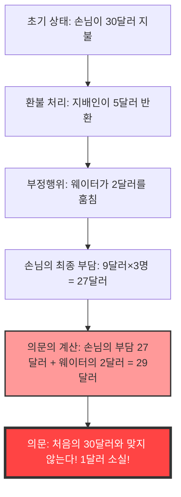
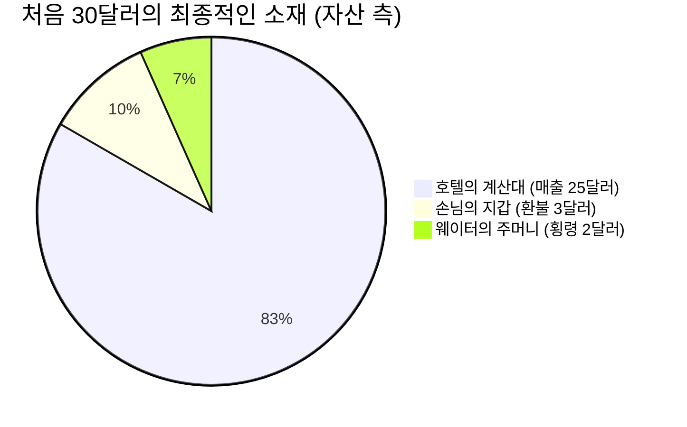

## 1. 서론: 왜 우리는 간단한 덧셈에 속는가?

세상에는 고도의 미분적분이나 난해한 위상수학을 사용하지 않아도, 초등학교 저학년 수준의 '덧셈'과 '뺄셈'만으로 인간의 뇌를 완전히 고장 내버리는 신기한 문제가 존재합니다. 그중에서도 세계에서 가장 유명하고, 수많은 사람들을 괴롭혀 온 것이 바로 **'사라진 1달러의 수수께끼(The Missing Dollar Riddle)'**입니다.

언뜻 보기에는 아무런 변함없는 일상의 풍경, 레스토랑에서의 계산 문제 이야기로 생각될 수 있습니다. 하지만 조금만 계산을 따라가 보면, 세상에서 '1달러'가 홀연히 자취를 감추고 맙니다.

본 기사에서는 이 유명한 수학의 역설(정확히는 역설풍의 함정 문제)을 다루며, 왜 우리의 직관은 속고 마는지, 어디에 논리의 함정이 있는지를 수학, 인지심리학, 그리고 복식부기(회계학)의 세 가지 관점에서 철저하게 해부해 보겠습니다.

---

## 2. 문제 제기: 사라진 1달러의 수수께끼

먼저 다음의 스토리를 읽어보세요. 그리고 수중에 종이와 펜이 있다면 함께 계산을 따라가 보시기 바랍니다.

> [!QUESTION] 사라진 1달러의 수수께끼 (스토리)
> 어느 날, 3명의 여행자가 작은 호텔에 왔습니다.
> 접수처의 프런트 직원은 "3인실은 하룻밤에 총 30달러입니다"라고 알렸습니다.
> 3명의 여행자는 지갑에서 각각 10달러씩 꺼내, 총 30달러를 프런트 직원에게 지불하고 방으로 향했습니다.
> 
> 잠시 후, 호텔 지배인이 와서 프런트 직원에게 말했습니다.
> "오늘은 캠페인 날이니까 그 방은 25달러면 돼. 당장 5달러를 돌려주고 오게."
> 
> 프런트 직원은 5달러 지폐를 들고 객실로 향했습니다. 하지만 그는 도중에 문득 생각했습니다.
> "5달러를 3명에게 균등하게 나누는 건 어렵군. 내가 몰래 2달러를 챙기고, 남은 3달러만 돌려주면 1인당 1달러씩 계산이 딱 맞겠어."
> 
> 그래서 프런트 직원은 자기 주머니에 2달러를 숨기고, 여행자들에게는 "캠페인으로 3달러가 환불되었습니다"라고 거짓말을 하여 1인당 1달러씩 반환했습니다.
> 
> **자, 여기서부터가 문제입니다.**
> 
> 1. 여행자들은 처음에 10달러씩 지불했고 나중에 1달러씩 돌려받았으므로, 실제로 지불한 금액은 **10달러 - 1달러 = 9달러**입니다.
> 2. 3명의 여행자가 지불한 총 금액은 **9달러 × 3명 = 27달러**가 됩니다.
> 3. 한편, 프런트 직원의 주머니에는 몰래 챙긴 **2달러**가 들어 있습니다.
> 4. 여행자가 지불한 **27달러**와 프런트 직원이 가진 **2달러**를 더하면 **27 + 2 = 29달러**가 됩니다.
> 
> 처음에 여행자들은 분명히 "30달러"를 지불했습니다.
> 하지만 지금 계산으로는 "29달러"밖에 없습니다.
> 
> **나머지 1달러는 도대체 어디로 사라져 버린 것일까요?**

어떠신가요.
읽으면 읽을수록 "확실히 1달러가 부족하다!"라며 뇌가 혼란스러워지지 않나요? 계산식 자체는 `9 × 3 = 27`, `27 + 2 = 29`로 초등학생도 알 수 있는 간단한 것들뿐입니다. 그런데도 왠지 모르게 처음의 30달러와 앞뒤가 맞지 않게 되어 버립니다.

다음 장부터 이 기묘한 현상의 속임수를 파헤쳐 보겠습니다.

---

## 3. 직관과 정답의 괴리: 왜 뇌는 버그를 일으키는가?

이 문제를 들었을 때, 많은 사람이 빠지는 사고 회로는 다음과 같습니다.

이 역설의 정체는 '더해서는 안 되는 것을 더하고 있다'는 교묘한 **말장난(Framing Effect: 프레이밍 효과)**에 있습니다.

### 오류의 핵심: '27 + 2'라는 무의미한 계산
문제문 마지막에 있는 다음 부분을 다시 한번 잘 봐주세요.

> 여행자가 지불한 **27달러**와 프런트 직원이 가진 **2달러**를 더하면 **27 + 2 = 29달러**가 됩니다.

사실 이 '27 + 2'라는 계산 자체가 논리적으로 전혀 의미 없는 계산입니다.
왜냐하면 **'여행자가 지불한 최종적인 금액(27달러)' 안에는 이미 '프런트 직원이 챙긴 금액(2달러)'이 포함되어 있기 때문**입니다.

여행자가 지불한 27달러의 내역은 다음과 같습니다.
*   **호텔 계산대에 들어간 금액**: 25달러
*   **프런트 직원이 챙긴 금액**: 2달러
*   합계: 27달러

즉, 27달러에 프런트 직원의 2달러를 다시 더한다는 것은 **프런트 직원의 2달러를 '이중으로 계산(Double Counting)'하고 있는 것**이 됩니다.

올바르게 처음의 '30달러'와 아귀를 맞추고 싶다면, '손님이 지불한 금액'과 '손님에게 돌아온 금액'을 더해야 합니다.
*   손님이 최종적으로 지불한 금액: 27달러 (계산대 25달러 + 프런트 직원 2달러)
*   손님의 수중에 돌아온 금액: 3달러
*   합계: 27 + 3 = 30달러

이렇게 계산하면 단 1달러도 사라지지 않았다는 것이 명백해집니다.

---

## 4. 수학적 해명: 방정식을 통한 엄밀한 증명

말을 통한 설명만으로는 미심쩍은 분들을 위해 엄밀한 수식을 사용하여 돈의 흐름(캐시플로우)을 증명해 보겠습니다.

전체 돈의 움직임을 변수로 정의합니다.

*   $ P_{initial} $ : 손님이 처음에 지불한 총액 (30)
*   $ C_{hotel} $ : 호텔(지배인)이 최종적으로 받은 금액 (25)
*   $ R_{total} $ : 지배인이 프런트 직원에게 건넨 환불액 (5)
*   $ R_{guest} $ : 손님이 최종적으로 받은 환불액 (3)
*   $ S_{waiter} $ : 프런트 직원이 챙긴 금액 (2)

초기의 돈 흐름으로부터 다음 방정식이 성립합니다.
$$ P_{initial} = C_{hotel} + R_{total} \quad \cdots (1) $$
(30달러 = 25달러 + 5달러)

지배인이 돌려준 5달러는 손님의 수중과 프런트 직원의 주머니로 나뉩니다.
$$ R_{total} = R_{guest} + S_{waiter} \quad \cdots (2) $$
(5달러 = 3달러 + 2달러)

식(2)를 식(1)에 대입합니다.
$$ P_{initial} = C_{hotel} + (R_{guest} + S_{waiter}) \quad \cdots (3) $$
(30달러 = 25달러 + 3달러 + 2달러)

여기서 문제문에 있는 '손님이 최종적으로 지불한 금액'을 $ P_{final} $로 정의합니다. 이것은 초기 지불액에서 손님 수중에 돌아온 금액을 뺀 것입니다.
$$ P_{final} = P_{initial} - R_{guest} \quad \cdots (4) $$
(27달러 = 30달러 - 3달러)

식(3)에서 $ R_{guest} $를 좌변으로 이항해 보겠습니다.
$$ P_{initial} - R_{guest} = C_{hotel} + S_{waiter} \quad \cdots (5) $$

식(4)와 식(5)에 의해 다음과 같은 진실이 도출됩니다.
$$ P_{final} = C_{hotel} + S_{waiter} \quad \cdots (6) $$
(손님의 최종 지불액 27달러 = 호텔의 매출 25달러 + 프런트 직원의 도둑질 2달러)

문제문의 속임수는 **좌변에 있는 $ P_{final} $ (27달러)에 대하여 우변에 포함되어 있어야 할 $ S_{waiter} $ (2달러)를 다시 한번 더하려고 한** 점에 있습니다.
즉, 문제문이 유도한 계산식은 다음과 같습니다.
$$ P_{final} + S_{waiter} = (C_{hotel} + S_{waiter}) + S_{waiter} $$
$$ 27 + 2 = (25 + 2) + 2 = 29 $$

이 '29'라는 숫자는 단순한 '호텔의 매출 + 프런트 직원의 도둑질 × 2'라는, 물리적으로도 경제적으로도 전혀 의미를 갖지 않는 가공의 수치입니다. 이것이 '1달러가 사라진' 것처럼 보이는 착각의 수학적 정체입니다.

---

## 5. 회계학의 관점: 복식부기로 역설을 분쇄하다

수학적인 방정식을 사용해도 여전히 납득이 가지 않거나 (또는 직관적으로 개운치 않다면), 비즈니스 세계에서 500년 이상 사용되어 온 **'복식부기(Double-Entry Bookkeeping)'**의 개념을 사용하면 이 수수께끼를 완벽하게 시각화할 수 있습니다.

복식부기의 기본 원칙은 '차변(Debit)'과 '대변(Credit)'이 항상 일치한다는 것입니다. 이를 사용하여 돈의 이동을 분개(Journal Entry)해 봅시다.

### 거래 1: 손님이 30달러를 지불하다
호텔 측에서 본 초기 상태입니다.

| 차변 (자산의 증가) | 대변 (부채/순자산의 증가) |
| :--- | :--- |
| 현금 (Cash): $30 | 예수금 (또는 매출): $30 |

### 거래 2: 지배인이 5달러를 프런트 직원에게 건네고, 25달러를 매출로 잡다
방값이 25달러로 변경되었기 때문에 5달러를 '환불용'으로 프런트 직원에게 쥐어줍니다.

| 차변 | 대변 |
| :--- | :--- |
| 예수금: $30 | 매출 (Sales): $25 프런트 직원 (현금): $5 |

### 거래 3: 프런트 직원의 행동 (3달러의 환불과 2달러의 횡령)
여기가 가장 중요합니다. 프런트 직원이 가지고 있는 5달러 현금의 행방을 기장합니다.

| 차변 | 대변 |
| :--- | :--- |
| 손님에 대한 환불: $3 횡령 손실 (Loss): $2 | 프런트 직원 (현금): $5 |

### 최종적인 대차대조표(B/S)와 손익(P/L)의 통합 상태
전체 과정을 거친 결과, 현금이 어디에 있으며 어떤 명목으로 되어 있는지를 정리합니다.

**【최종 상태 확인】**
*   **자금의 출처 (손님의 지출)**: 30달러
*   **자금의 소재 (결과)**: 
    *   호텔의 계산대에 25달러
    *   웨이터의 주머니에 2달러
    *   손님의 수중에 3달러
    *   합계 = 25 + 2 + 3 = 30달러

회계의 '대차평균의 원리(T자 계정)'로 보면, '손님이 지불한 금액 27달러(지출)'는 '자산 측의 감소'이며, 여기에 '웨이터가 훔친 2달러(자산 측의 이동)'를 더하는 행위는 회계 기준에서 **'차변과 대변을 혼동하여 더하는' 있을 수 없는 실수**에 다름 아닙니다.
비즈니스 세계에서 만약 경리 담당자가 "27 + 2 = 29"라는 계산을 경영진에게 보고한다면, 즉각 해고되거나 분식회계를 의심받을 수준의 논리적 파탄입니다.

---

## 6. 인지심리학의 관점: 왜 우리는 '27+2=29'를 받아들이는가?

수학적으로도 회계적으로도 틀린 계산식을 왜 많은 인간은 "음음, 과연 그렇군" 하며 무의식적으로 받아들이게 되는 것일까요? 거기에는 인간의 뇌에 내장된 강력한 **인지 편향**이 관련되어 있습니다.

### 1. 심적 회계(마음의 가계부)의 버그
행동경제학자인 리처드 탈러(노벨 경제학상 수상)는 인간이 머릿속에서 무의식적으로 '돈의 카테고리화(심적 회계, Mental Accounting)'를 하고 있다고 제창했습니다.
문제문 마지막에서는 '손님의 지출(27달러)'과 '웨이터가 얻은 돈(2달러)'이 동일한 '돈'이라는 카테고리로 제시됩니다. 뇌는 '금액의 숫자(27과 2)'만을 떼어내어, 그것이 '지불한 돈(마이너스)'인지 '가지고 있는 돈(플러스)'인지 하는 벡터의 방향을 무시하고 안일하게 덧셈을 실행해 버립니다.

### 2. 프레이밍 효과 (정보의 틀)
정보가 어떻게 제시되는가에 따라 사람들의 의사 결정이나 판단이 바뀌는 효과입니다.
이 문제의 교묘한 점은 **'처음의 30달러라는 숫자를 목표로 설정하고 있다는 것'**입니다.
'27 + 2 = 29달러'라는 계산을 보여준 후, 뇌는 무의식적으로 '원래의 30달러가 되어야 한다'는 목표(앵커링)와 억지로 연결 지으려 합니다. 본래 비교해서는 안 될 숫자들을 비교하게 만들어 거기에 '1'이라는 오차가 생김으로써 강렬한 인지 부조화(불쾌감이나 혼란)를 일으키도록 디자인된 것입니다.

### 3. 스토리텔링의 마력
인간은 수식보다 '이야기(스토리)'를 이해하는 능력에 뛰어납니다. 등장인물(손님, 지배인, 웨이터)의 움직임을 머릿속에서 시뮬레이션하는 동안 작업 기억(단기 기억)이 가득 차게 되어, 마지막 방정식의 논리적 타당성을 검증할 인지 자원이 고갈되어 버립니다. 마술사가 관객의 시선을 유도하여 트릭을 성공시키는 '미스디렉션'과 똑같은 수법이 이 문장제에 사용되고 있는 것입니다.

---

## 7. '사라진 1달러의 수수께끼'의 역사와 유사 문제

이런 종류의 역설은 예로부터 존재해 왔으며 시대와 국경을 넘어 다양한 변형으로 전해져 내려오고 있습니다.

### 역설의 기원
이 문제의 정확한 기원은 불분명하지만 1930년대 미국에서 널리 알려지게 되었습니다. 당시는 '벨보이의 역설(Bellboy paradox)'이라고 불렸으며, 금액 설정도 다양했습니다. 대공황 시대 미국에서 단돈 '1달러'의 행방이 큰 관심사였던 대중 심리를 반영하고 있다고도 일컬어집니다.

### 유사 문제: 사라진 10엔의 수수께끼
일본에서는 "3명이 100엔씩 내서 300엔짜리 물건을 사고, 거스름돈이 50엔이라서..." 하는 식으로 금액을 엔으로 바꾼 버전이 유명합니다. 아이들을 위한 퀴즈 책이나 인터넷 게시판의 고전적인 복붙 글로도 주기적으로 화제가 됩니다.

### 더욱 고도화된 파생형: 사라진 정사각형의 수수께끼
이 '말을 통한 속임수'를 '도형(기하학)'에 응용한 것이, 본 블로그의 다른 기사에서도 소개하고 있는 **'사라진 정사각형의 수수께끼(Missing square puzzle)'**입니다.
면적이 같아야 할 도형 부품을 재배치하면 어째서인지 1칸 분량의 구멍(면적)이 사라져 버린다는 직관의 버그인데, 이것 역시 '인간의 눈은 미세한 직선의 왜곡(기울기의 차이)을 간파할 수 없다'는 인지의 한계를 이용한 것입니다.

---

## 8. 현실 세계에 주는 교훈: 역설에서 무엇을 배워야 하는가?

'사라진 1달러의 수수께끼'는 단순한 술자리의 이야깃거리나 아이들 장난 같은 퀴즈로 끝내기에는 아까운 깊은 교훈을 가지고 있습니다.

1. **'주어진 틀(전제)'을 의심하는 힘**
   우리가 일상적인 비즈니스나 투자에서 의사결정을 내릴 때, 누군가가 제시한 "이 숫자와 이 숫자를 더하면 이렇게 됩니다"라는 프레젠테이션 자료나 영업 멘트를 곧이곧대로 믿고 있지는 않나요?
   계산 결과가 맞는다('27 + 2'는 확실히 29이다)고 하더라도 **'애초에 그 식 세우는 것 자체에 논리적인 의미가 있는가?'**를 묻는 비판적 사고(크리티컬 씽킹)가 필수적입니다.
2. **캐시플로우의 절대성**
   기업 회계에서의 분식회계나 복잡한 금융파생상품(파생상품)의 손실 은폐는 극도로 고도화된 '사라진 1달러의 수수께끼'라고 할 수 있습니다. 실체가 없는 숫자를 더하고 빼서 이익이 나고 있는 것처럼 꾸며도 '현금의 움직임(캐시플로우)'을 근본부터 추적하면 반드시 모순이 드러납니다. 상황을 복잡하게 느낄 때일수록 기본인 '돈은 어디서 와서 어디로 갔는가'로 되돌아갈 필요가 있습니다.

---

## 9. 결론: 1달러는 처음부터 사라지지 않았다

마지막으로 이 역설에 대한 가장 간결하고 강력한 답변을 제시하며 마무리하고자 합니다.

> **"손님은 총 27달러를 지불했고 호텔 계산대에 25달러, 웨이터 주머니에 2달러가 들어갔다. 계산은 완벽하게 맞는다. 처음의 30달러로 억지로 되돌리려는 계산식 자체가 모든 혼란의 원흉이다."**

우리의 뇌는 아무리 진화해도 '그럴듯한 스토리'와 '간단한 덧셈'의 조합에 너무나도 쉽게 속아 넘어갑니다.
하지만 수학이나 논리학이라는 강력한 도구(방정식이나 복식부기)를 사용함으로써 그 착각을 끊어내고 진실을 꿰뚫어 볼 수 있습니다.

다음에 만약 친구가 의기양양한 표정으로 '사라진 1달러의 수수께끼'를 낸다면, 부디 이 깊은 지식을 바탕으로 "더해야 할 숫자와 빼야 할 숫자의 벡터가 틀렸어"라고 멋지게 대답해 보세요!
