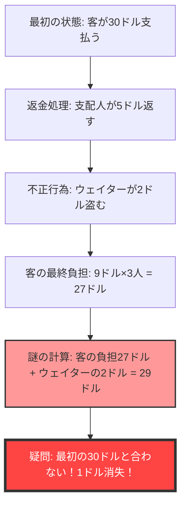
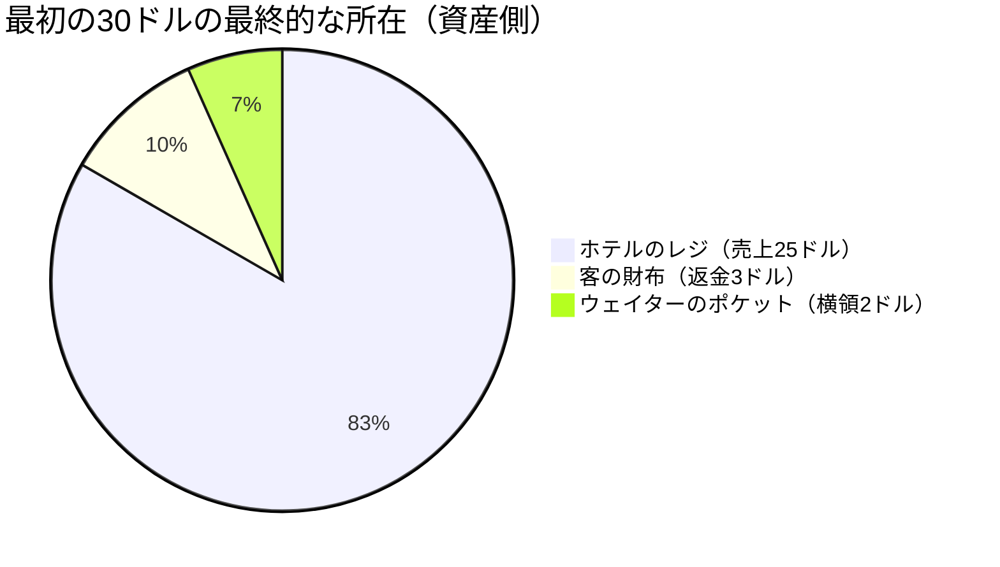

## 1. はじめに：なぜ私たちは簡単な足し算に騙されるのか？

世の中には、高度な微分積分や難解なトポロジーを使わなくとも、小学校低学年レベルの「足し算」と「引き算」だけで人間の脳を完全にバグらせてしまう不思議な問題が存在します。その中でも世界で最も有名で、かつ多くの人々を悩ませてきたのが**「消えた1ドルの謎（The Missing Dollar Riddle）」**です。

一見すると何の変哲もない日常の風景、レストランでの会計トラブルの話に思えます。しかし、少し計算を追いかけてみるだけで、世界から「1ドル」が忽然と姿を消してしまうのです。

本記事では、この有名な数学のパラドックス（正確にはパラドックス風の引っかけ問題）を取り上げ、なぜ私たちの直感は騙されるのか、どこに論理の落とし穴があるのかを、数学、認知心理学、そして複式簿記（会計学）の3つの視点から徹底的に解剖していきます。

---

## 2. 問題提起：消えた1ドルの謎

まずは、以下のストーリーを読んでみてください。そして、手元に紙とペンがある方は、一緒に計算を追いかけてみてください。

> [!QUESTION] 消えた1ドルの謎（ストーリー）
> ある日、3人の旅行者が小さなホテルにやってきました。
> 受付のフロント係は「3人部屋は一晩で合計30ドルです」と告げました。
> 3人の旅行者は財布からそれぞれ10ドルずつを取り出し、合計30ドルをフロント係に支払って部屋へ向かいました。
> 
> しばらくして、ホテルの支配人がやってきてフロント係に言いました。
> 「今日はキャンペーンの日だから、あの部屋は25ドルでいいんだ。すぐに5ドルを返してきなさい。」
> 
> フロント係は5ドルの紙幣を持って客室に向かいました。しかし、彼は道中でふと考えました。
> 「5ドルを3人で均等に分けるのは難しいな。私がこっそり2ドルをもらって、残り3ドルを返せば、1人1ドルずつで計算がぴったり合うぞ。」
> 
> そこでフロント係は自分のポケットに2ドルを隠し、旅行者たちには「キャンペーンで3ドル返金されました」と嘘をついて、1人1ドルずつ返却しました。
> 
> **さて、ここからが問題です。**
> 
> 1. 旅行者たちは最初に10ドルずつ支払い、後から1ドルずつ返してもらったので、実際に支払った金額は **10ドル - 1ドル = 9ドル** です。
> 2. 3人の旅行者が支払った合計金額は **9ドル × 3人 = 27ドル** となります。
> 3. 一方、フロント係のポケットには、こっそりくすねた **2ドル** が入っています。
> 4. 旅行者が支払った **27ドル** と、フロント係が持っている **2ドル** を足すと、**27 + 2 = 29ドル** になります。
> 
> 最初、旅行者たちは確かに「30ドル」を支払いました。
> しかし、今の計算だと「29ドル」しかありません。
> 
> **残りの1ドルは、一体どこへ消えてしまったのでしょうか？**

いかがでしょうか。
読めば読むほど、「確かに1ドル足りない！」と脳が混乱してくるのではないでしょうか。計算式自体は `9 × 3 = 27`、`27 + 2 = 29` と、小学生でもわかる簡単なものばかりです。それなのに、なぜか最初の30ドルと辻褄が合わなくなってしまいます。

次章以降で、この奇妙な現象のカラクリを解き明かしていきましょう。

---

## 3. 直感と正解のズレ：なぜ脳はバグるのか？

この問題を聞いたとき、多くの人が陥る思考回路は次のようなものです。

このパラドックスの正体は、「足してはいけないものを足している」という巧妙な**言葉のトリック（Framing Effect: フレーミング効果）**にあります。

### 誤謬の核心：「27 + 2」という無意味な計算
問題文の最後にある、以下の部分をもう一度よく見てください。

> 旅行者が支払った **27ドル** と、フロント係が持っている **2ドル** を足すと、**27 + 2 = 29ドル** になります。

実は、この「27 + 2」という計算そのものが、論理的に全く無意味な計算なのです。
なぜなら、**「旅行者が支払った最終的な金額（27ドル）」の中には、すでに「フロント係がくすねた金額（2ドル）」が含まれているから**です。

旅行者が支払った27ドルの内訳は以下のようになっています。
*   **ホテルのレジに入っている金額**：25ドル
*   **フロント係がくすねた金額**：2ドル
*   合計：27ドル

つまり、27ドルにさらにフロント係の2ドルを足すということは、**フロント係の2ドルを「二重にカウント（Double Counting）」している**ことになるのです。

正しく最初の「30ドル」と辻褄を合わせたいのであれば、「客が支払った金額」と「客の元に戻ってきた金額」を足し合わせる必要があります。
*   客が最終的に支払った金額：27ドル（レジ25ドル ＋ フロント係2ドル）
*   客の手元に戻ってきた金額：3ドル
*   合計：27 + 3 = 30ドル

このように計算すれば、1ドルたりとも消えていないことが明白になります。

---

## 4. 数学的解明：方程式による厳密な証明

言葉による説明だけでは釈然としない方のために、厳密な数式を用いてお金の流れ（キャッシュフロー）を証明してみましょう。

全体のお金の動きを変数で定義します。

*   $ P_{initial} $ : 客が初期に支払った総額 (30)
*   $ C_{hotel} $ : ホテル（支配人）が最終的に受け取った金額 (25)
*   $ R_{total} $ : 支配人がフロント係に渡した返金額 (5)
*   $ R_{guest} $ : 客が最終的に受け取った返金額 (3)
*   $ S_{waiter} $ : フロント係がくすねた金額 (2)

初期の金の流れから、以下の方程式が成り立ちます。
$$ P_{initial} = C_{hotel} + R_{total} \quad \cdots (1) $$
（30ドル ＝ 25ドル ＋ 5ドル）

支配人が返した5ドルは、客の手元とフロント係のポケットに分かれます。
$$ R_{total} = R_{guest} + S_{waiter} \quad \cdots (2) $$
（5ドル ＝ 3ドル ＋ 2ドル）

式(2)を式(1)に代入します。
$$ P_{initial} = C_{hotel} + (R_{guest} + S_{waiter}) \quad \cdots (3) $$
（30ドル ＝ 25ドル ＋ 3ドル ＋ 2ドル）

ここで、問題文にある「客が最終的に支払った金額」を $ P_{final} $ と定義します。これは、初期の支払額から客の手元に戻ってきた金額を引いたものです。
$$ P_{final} = P_{initial} - R_{guest} \quad \cdots (4) $$
（27ドル ＝ 30ドル － 3ドル）

式(3)から $ R_{guest} $ を左辺に移項してみましょう。
$$ P_{initial} - R_{guest} = C_{hotel} + S_{waiter} \quad \cdots (5) $$

式(4)と式(5)より、以下の真実が導き出されます。
$$ P_{final} = C_{hotel} + S_{waiter} \quad \cdots (6) $$
（客の最終支払額27ドル ＝ ホテルの売上25ドル ＋ フロント係の盗み2ドル）

問題文のトリックは、**左辺にある $ P_{final} $ (27ドル) に対して、右辺に含まれているはずの $ S_{waiter} $ (2ドル) をもう一度足し合わせようとしている**点にあります。
つまり、問題文が誘導した計算式は以下のようになります。
$$ P_{final} + S_{waiter} = (C_{hotel} + S_{waiter}) + S_{waiter} $$
$$ 27 + 2 = (25 + 2) + 2 = 29 $$

この「29」という数字は、単なる「ホテルの売上＋フロント係の盗み×2」という、物理的にも経済的にも全く意味を持たない架空の数値なのです。これが「1ドル消えた」ように見える錯覚の数学的な正体です。

---

## 5. 会計学の視点：複式簿記でパラドックスを粉砕する

数学的な方程式を使ってもまだ納得できない（あるいは直感的にモヤモヤする）という方は、ビジネスの世界で500年以上使われている**「複式簿記（Double-Entry Bookkeeping）」**の概念を用いると、この謎を完璧に視覚化できます。

複式簿記の基本原則は、「借方（Debit）」と「貸方（Credit）」が常に一致する、というものです。これを用いてお金の移動を仕訳（Journal Entry）してみましょう。

### 取引1: 客が30ドルを支払う
ホテル側から見た最初の状態です。

| 借方（資産の増加） | 貸方（負債/純資産の増加） |
| :--- | :--- |
| 現金（Cash）: $30 | 預り金（あるいは売上）: $30 |

### 取引2: 支配人が5ドルをフロント係に渡し、25ドルを売上とする
部屋代が25ドルに変更されたため、5ドルを「返金用」としてフロント係に持たせます。

| 借方 | 貸方 |
| :--- | :--- |
| 預り金: $30 | 売上（Sales）: $25 フロント係（現金）: $5 |

### 取引3: フロント係の行動（3ドルの返金と2ドルの横領）
ここが最も重要です。フロント係が持っている5ドルの現金の行方を記帳します。

| 借方 | 貸方 |
| :--- | :--- |
| 客への返金: $3 横領損失（Loss）: $2 | フロント係（現金）: $5 |

### 最終的なバランスシート（B/S）と損益（P/L）の統合状態
全体を通した結果、現金がどこにあり、どのような名目になっているかをまとめます。

**【最終状態の確認】**
*   **資金の出所（客の支出）**: 30ドル
*   **資金の所在（結果）**: 
    *   ホテルのレジに 25ドル
    *   ウェイターのポケットに 2ドル
    *   客の手元に 3ドル
    *   合計 = 25 + 2 + 3 = 30ドル

会計の「貸借一致の原則（T字勘定）」で見れば、「客の支払った金額27ドル（支出）」は「資産側の減少」であり、それに「ウェイターの盗んだ2ドル（資産側の移動）」を足す行為は、会計基準において**「借方と貸方を混同して足す」というあり得ないミス**に他なりません。
ビジネスの世界において、もし経理担当者が「27 + 2 = 29」という計算を経営陣に報告すれば、即座にクビになるか、粉飾決算を疑われるレベルの論理的破綻なのです。

---

## 6. 認知心理学の視点：なぜ私たちは「27+2=29」を受け入れてしまうのか？

数学的にも会計学的にも間違っている計算式を、なぜ多くの人間は「ふむふむ、なるほど」と無意識に受け入れてしまうのでしょうか？そこには、人間の脳に組み込まれた強力な**認知バイアス**が関わっています。

### 1. メンタルアカウンティング（心の家計簿）のバグ
行動経済学者のリチャード・セイラー（ノーベル経済学賞受賞）は、人間は頭の中で無意識に「お金のカテゴリ分け（メンタルアカウンティング）」をしていると提唱しました。
問題文の最後では、「客の支出（27ドル）」と「ウェイターの得た金（2ドル）」が、同じ「お金」というカテゴリとして提示されます。脳は「金額の数字（27と2）」だけを切り取り、それが「払ったお金（マイナス）」なのか「持っているお金（プラス）」なのかというベクトルの向きを無視して、安易に足し算を実行してしまいます。

### 2. フレーミング効果（情報の枠組み）
情報がどのように提示されるかによって、人々の意思決定や判断が変わる効果です。
問題文の巧みなところは、**「最初の30ドルという数字をゴールに設定していること」**です。
「27 + 2 = 29ドル」という計算を見せられた後、脳は無意識に「元々の30ドルになるはずだ」というゴール（アンカリング）と無理やり結びつけようとします。本来比較すべきでない数字同士を比較させられ、そこに「1」という誤差が生じることで強烈な認知不協和（不快感や混乱）を引き起こすようデザインされているのです。

### 3. ストーリーテリングの魔力
人間は数式よりも「物語（ストーリー）」を理解する能力に長けています。登場人物（客、支配人、ウェイター）の動きを頭の中でシミュレーションしているうちに、ワーキングメモリ（短期記憶）がいっぱいになり、最後の方程式の論理的妥当性を検証する認知リソースが枯渇してしまいます。マジシャンが観客の視線を誘導してトリックを成功させる「ミスディレクション」と全く同じ手法が、この文章題には使われているのです。

---

## 7. 「消えた1ドルの謎」の歴史と類題

この種のパラドックスは古くから存在し、時代や国境を越えて様々なバリエーションで語り継がれています。

### パラドックスの起源
この問題の正確な起源は不明ですが、1930年代のアメリカで広く知られるようになりました。当時は「ベルボーイのパラドックス（Bellboy paradox）」と呼ばれており、金額の設定も様々でした。大恐慌時代のアメリカにおいて、わずか「1ドル」の行方が大きな関心事であった大衆心理を反映しているとも言われています。

### 類題：消えた10円の謎
日本においては、「3人が100円ずつ出して300円の品物を買い、お釣りが50円で…」という形で、金額を円に置き換えたバージョンが有名です。子供向けのクイズ本や、インターネット掲示板の古典的なコピペとしても定期的に話題になります。

### さらに高度な派生形：消えた正方形の謎
この「言葉によるごまかし」を「図形（幾何学）」に応用したのが、本ブログの別記事でも紹介している**「消えた正方形の謎（Missing square puzzle）」**です。
面積が同じはずの図形パーツを並べ替えると、なぜか1マス分の穴（面積）が消えてしまうという直感のバグですが、これも「人間の目はわずかな直線の歪み（傾きの違い）を見抜けない」という認知の限界を利用したものです。

---

## 8. 現実世界への教訓：パラドックスから何を学ぶべきか？

「消えた1ドルの謎」は、単なる飲み会の小ネタや子供騙しのクイズで終わらせるには惜しい、深い教訓を持っています。

1. **「与えられた枠組み（前提）」を疑う力**
   私たちが日常のビジネスや投資で意思決定を行う際、誰かが提示した「この数字とこの数字を足すとこうなります」というプレゼン資料や営業トークを鵜呑みにしていないでしょうか？
   計算結果が合っている（27 + 2 は確かに 29 である）としても、**「そもそもその式を立てること自体に論理的な意味があるのか？」**を問う批判的思考（クリティカルシンキング）が不可欠です。
2. **キャッシュフローの絶対性**
   企業会計における粉飾決算や、複雑な金融派生商品（デリバティブ）の損失隠しは、極めて高度化された「消えた1ドルの謎」だと言えます。実体のない数字を足し引きして利益が出ているように見せかけても、「現金の動き（キャッシュフロー）」を根本から辿れば、必ず矛盾が露呈します。物事を複雑に感じたときこそ、基本の「お金はどこから来て、どこへ行ったのか」に立ち返る必要があります。

---

## 9. まとめ：1ドルは最初から消えていなかった

最後に、このパラドックスに対する最も簡潔で強力なアンサーを提示して締めくくりたいと思います。

> **「客は合計27ドルを払い、ホテルのレジに25ドル、ウェイターのポケットに2ドルが収まった。計算は完璧に合っている。最初の30ドルに無理やり戻そうとする計算式こそが、すべての混乱の元凶である。」**

私たちの脳は、どれほど進化しても「もっともらしいストーリー」と「簡単な足し算」の組み合わせにいとも簡単に騙されてしまいます。
しかし、数学や論理学という強力なツール（方程式や複式簿記）を用いることで、その錯覚を断ち切り、真実を見抜くことができます。

次回、もし友人がドヤ顔で「消えた1ドルの謎」を出題してきたら、ぜひこの深い知識を背景に、「足すべき数字と引くべき数字のベクトルが間違っているよ」とクールに返答してみてください！
