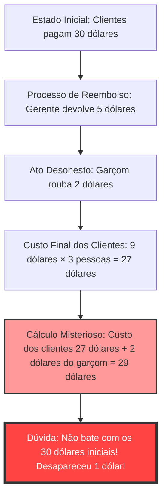
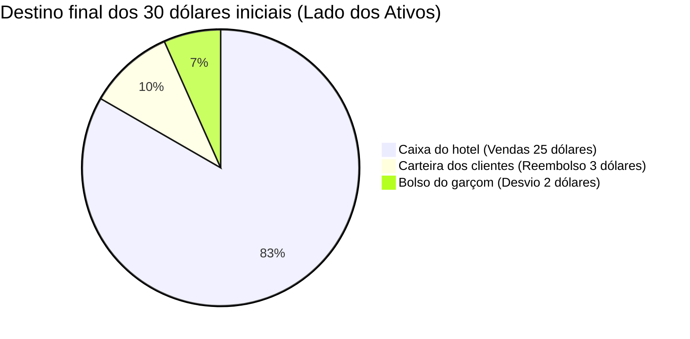

## 1. Introdução: Por que somos enganados por uma simples adição?

Existem problemas no mundo que, sem usar cálculo avançado ou topologia complexa, conseguem bugar completamente o cérebro humano apenas com a "adição" e "subtração" do nível das primeiras séries do ensino fundamental. Entre eles, o mais famoso e que tem confundido muitas pessoas ao redor do mundo é **"O Mistério do 1 Dólar Desaparecido" (The Missing Dollar Riddle)**.

À primeira vista, parece uma situação cotidiana comum, uma história sobre problemas de conta em um restaurante. No entanto, apenas tentando acompanhar os cálculos, "1 dólar" desaparece repentinamente do mundo.

Neste artigo, abordaremos este famoso paradoxo matemático (mais precisamente, uma pegadinha com ares de paradoxo) e analisaremos minuciosamente por que nossa intuição é enganada e onde estão as armadilhas lógicas, a partir de três perspectivas: matemática, psicologia cognitiva e contabilidade de dupla entrada (ciências contábeis).

---

## 2. O Problema: O Mistério do 1 Dólar Desaparecido

Primeiro, leia a história a seguir. E se você tiver papel e caneta à mão, tente acompanhar os cálculos junto.

> [!QUESTION] O Mistério do 1 Dólar Desaparecido (A História)
> Certo dia, três viajantes chegaram a um pequeno hotel.
> O recepcionista disse: "Um quarto para três pessoas custa 30 dólares a noite."
> Os três viajantes pegaram 10 dólares cada um de suas carteiras, pagaram um total de 30 dólares ao recepcionista e foram para o quarto.
> 
> Depois de um tempo, o gerente do hotel apareceu e disse ao recepcionista:
> "Hoje temos uma promoção, então aquele quarto custa apenas 25 dólares. Vá devolver 5 dólares a eles imediatamente."
> 
> O recepcionista pegou as notas de 5 dólares e foi em direção ao quarto. Mas no caminho, ele pensou:
> "É difícil dividir 5 dólares igualmente entre três pessoas. Se eu pegar 2 dólares escondido e devolver os 3 dólares restantes, dará 1 dólar para cada um e a conta fechará perfeitamente."
> 
> Então o recepcionista escondeu 2 dólares em seu bolso, mentiu aos viajantes dizendo que "foram reembolsados 3 dólares devido a uma promoção" e devolveu 1 dólar para cada um.
> 
> **Agora vem o problema.**
> 
> 1. Os viajantes pagaram inicialmente 10 dólares cada e, como receberam 1 dólar de volta, o valor real pago foi **10 dólares - 1 dólar = 9 dólares**.
> 2. O valor total pago pelos 3 viajantes é **9 dólares × 3 pessoas = 27 dólares**.
> 3. Por outro lado, no bolso do recepcionista estão os **2 dólares** que ele embolsou secretamente.
> 4. Se somarmos os **27 dólares** pagos pelos viajantes com os **2 dólares** que o recepcionista tem, teremos **27 + 2 = 29 dólares**.
> 
> Inicialmente, os viajantes certamente pagaram "30 dólares".
> No entanto, com os cálculos atuais, temos apenas "29 dólares".
> 
> **Para onde desapareceu o 1 dólar restante?**

E então?
Quanto mais você lê, mais o seu cérebro fica confuso pensando: "Realmente falta 1 dólar!". Os cálculos em si são simples, `9 × 3 = 27`, `27 + 2 = 29`, que até uma criança no ensino fundamental entende. E mesmo assim, por algum motivo não bate com os 30 dólares iniciais.

No próximo capítulo em diante, vamos desvendar o truque por trás desse fenômeno bizarro.

---

## 3. A Discrepância entre Intuição e Resposta Certa: Por que o cérebro buga?

Quando ouvem esse problema, o raciocínio em que a maioria das pessoas cai é o seguinte:

A verdadeira identidade deste paradoxo reside em um engenhoso **truque de palavras (Efeito de Enquadramento: Framing Effect)** que nos faz "somar o que não deve ser somado".

### O Cerne da Falácia: O cálculo sem sentido de "27 + 2"
Observe atentamente mais uma vez a seguinte parte no final do texto do problema.

> Se somarmos os **27 dólares** pagos pelos viajantes com os **2 dólares** que o recepcionista tem, teremos **27 + 2 = 29 dólares**.

Na verdade, esse próprio cálculo de "27 + 2" é logicamente totalmente sem sentido.
Porque, **dentro do "valor final pago pelos viajantes (27 dólares)", já está incluído o "valor embolsado pelo recepcionista (2 dólares)"**.

O detalhamento dos 27 dólares pagos pelos viajantes é o seguinte:
*   **Valor no caixa do hotel**: 25 dólares
*   **Valor embolsado pelo recepcionista**: 2 dólares
*   Total: 27 dólares

Ou seja, adicionar os 2 dólares do recepcionista aos 27 dólares significa que você está fazendo uma **"Dupla Contagem" (Double Counting)** dos 2 dólares do recepcionista.

Se você quiser combinar corretamente com os "30 dólares" iniciais, precisa somar o "valor pago pelos clientes" e o "valor que retornou para os clientes".
*   Valor final pago pelos clientes: 27 dólares (caixa 25 dólares + recepcionista 2 dólares)
*   Valor que retornou às mãos dos clientes: 3 dólares
*   Total: 27 + 3 = 30 dólares

Se calculado desta forma, fica claro que nem mesmo um único dólar desapareceu.

---

## 4. Esclarecimento Matemático: Prova rigorosa por meio de equações

Para aqueles que não estão convencidos apenas com a explicação em palavras, vamos provar o fluxo do dinheiro (fluxo de caixa) usando fórmulas matemáticas rigorosas.

Definiremos todo o movimento do dinheiro com variáveis.

*   $ P_{initial} $ : Valor total pago inicialmente pelos clientes (30)
*   $ C_{hotel} $ : Valor finalmente recebido pelo hotel (gerente) (25)
*   $ R_{total} $ : Valor de reembolso entregue pelo gerente ao recepcionista (5)
*   $ R_{guest} $ : Valor de reembolso finalmente recebido pelos clientes (3)
*   $ S_{waiter} $ : Valor embolsado pelo recepcionista (2)

A partir do fluxo de dinheiro inicial, a seguinte equação é estabelecida:
$$ P_{initial} = C_{hotel} + R_{total} \quad \cdots (1) $$
(30 dólares = 25 dólares + 5 dólares)

Os 5 dólares devolvidos pelo gerente são divididos entre as mãos dos clientes e o bolso do recepcionista:
$$ R_{total} = R_{guest} + S_{waiter} \quad \cdots (2) $$
(5 dólares = 3 dólares + 2 dólares)

Substituímos a Equação (2) na Equação (1):
$$ P_{initial} = C_{hotel} + (R_{guest} + S_{waiter}) \quad \cdots (3) $$
(30 dólares = 25 dólares + 3 dólares + 2 dólares)

Aqui, definimos o "valor final pago pelos clientes" mencionado no texto do problema como $ P_{final} $. Isso é o valor do pagamento inicial subtraído do valor que retornou às mãos dos clientes.
$$ P_{final} = P_{initial} - R_{guest} \quad \cdots (4) $$
(27 dólares = 30 dólares - 3 dólares)

Vamos mover $ R_{guest} $ da Equação (3) para o lado esquerdo:
$$ P_{initial} - R_{guest} = C_{hotel} + S_{waiter} \quad \cdots (5) $$

A partir das Equações (4) e (5), a seguinte verdade é deduzida:
$$ P_{final} = C_{hotel} + S_{waiter} \quad \cdots (6) $$
(Pagamento final dos clientes 27 dólares = Receita do hotel 25 dólares + Roubo do recepcionista 2 dólares)

O truque do texto do problema está em **tentar somar novamente $ S_{waiter} $ (2 dólares), que já deveria estar incluído no lado direito, ao $ P_{final} $ (27 dólares) do lado esquerdo**.
Em outras palavras, a fórmula matemática que o texto do problema nos induz a fazer é a seguinte:
$$ P_{final} + S_{waiter} = (C_{hotel} + S_{waiter}) + S_{waiter} $$
$$ 27 + 2 = (25 + 2) + 2 = 29 $$

Este número "29" é simplesmente uma figura imaginária sem nenhum significado físico ou econômico: "Receita do hotel + roubo do recepcionista × 2". Esta é a verdadeira identidade matemática da ilusão de que "1 dólar desapareceu".

---

## 5. Perspectiva da Contabilidade: Esmagando o paradoxo com as partidas dobradas

Para aqueles que ainda não estão convencidos mesmo com o uso de equações matemáticas (ou que intuitivamente sentem que algo não está certo), o uso do conceito de **"Contabilidade de Partidas Dobradas" (Double-Entry Bookkeeping)**, utilizado no mundo dos negócios há mais de 500 anos, permite visualizar este mistério de forma perfeita.

O princípio básico das partidas dobradas é que o "Débito" (Debit) e o "Crédito" (Credit) devem sempre coincidir. Vamos usar isso para registrar o movimento do dinheiro (Journal Entry).

### Transação 1: Os clientes pagam 30 dólares
Este é o estado inicial visto a partir do hotel.

| Débito (Aumento de Ativos) | Crédito (Aumento de Passivos/Patrimônio Líquido) |
| :--- | :--- |
| Caixa (Cash): $30 | Adiantamento (ou Receita de Vendas): $30 |

### Transação 2: O gerente entrega 5 dólares ao recepcionista e registra 25 dólares como venda
Como o custo do quarto foi alterado para 25 dólares, ele dá ao recepcionista 5 dólares como "para devolução".

| Débito | Crédito |
| :--- | :--- |
| Adiantamento: $30 | Receita de Vendas (Sales): $25 Recepcionista (Caixa): $5 |

### Transação 3: Ação do recepcionista (devolução de 3 dólares e desvio de 2 dólares)
Esta é a parte mais importante. Registramos o destino do dinheiro de 5 dólares que o recepcionista possui.

| Débito | Crédito |
| :--- | :--- |
| Reembolso aos clientes: $3 Perda por desvio (Loss): $2 | Recepcionista (Caixa): $5 |

### Balanço Patrimonial (B/S) Final e Estado Integrado de Lucros e Perdas (P/L)
Após passar por tudo isso, resumiremos onde o dinheiro está e sob qual título.

**[Confirmação do Estado Final]**
*   **Origem dos fundos (Despesa dos clientes)**: 30 dólares
*   **Localização dos fundos (Resultado)**: 
    *   No caixa do hotel: 25 dólares
    *   No bolso do garçom: 2 dólares
    *   Nas mãos dos clientes: 3 dólares
    *   Total = 25 + 2 + 3 = 30 dólares

Olhando pelo "Princípio de correspondência entre débitos e créditos (Conta T)" da contabilidade, a "quantia paga pelos clientes de 27 dólares (despesa)" é uma "diminuição no lado dos ativos", e o ato de somar a isso os "2 dólares roubados pelo garçom (movimentação no lado dos ativos)" não é nada mais que **um erro impossível de "confundir débitos e créditos para somar"** nos padrões contábeis.
No mundo dos negócios, se o encarregado da contabilidade reportasse o cálculo "27 + 2 = 29" aos executivos, seria um colapso lógico do nível de ser demitido imediatamente ou suspeito de fraude contábil.

---

## 6. Perspectiva da Psicologia Cognitiva: Por que aceitamos que "27+2=29"?

Por que muitos humanos inconscientemente aceitam fórmulas matemáticas que estão erradas, tanto matemática quanto contabilisticamente, pensando "humm, entendi"? O poderoso **viés cognitivo** embutido em nossos cérebros tem relação com isso.

### 1. O bug da contabilidade mental (Mental Accounting)
O economista comportamental Richard Thaler (ganhador do Prêmio Nobel de Economia) propôs que os seres humanos subconscientemente "categorizam o dinheiro (Contabilidade Mental)" em suas cabeças.
No final do problema, o "gasto dos clientes (27 dólares)" e o "dinheiro obtido pelo garçom (2 dólares)" são apresentados como sendo a mesma categoria de "dinheiro". O cérebro recorta apenas "os valores numéricos (27 e 2)" e, ignorando a direção do vetor, se é "dinheiro pago (menos)" ou "dinheiro que se tem (mais)", simplesmente executa a adição.

### 2. O efeito de enquadramento (Framing Effect)
É o efeito em que as decisões e julgamentos das pessoas mudam dependendo de como as informações são apresentadas.
O mais engenhoso do texto do problema é **"ter definido o número inicial de 30 dólares como objetivo"**.
Depois de ver o cálculo "27 + 2 = 29 dólares", o cérebro tenta inconscientemente forçar uma ligação com o objetivo de que "deve ser os 30 dólares originais" (Ancoragem). Fomos forçados a comparar números que, em princípio, não deveriam ser comparados, e está desenhado para causar uma intensa dissonância cognitiva (desconforto ou confusão) pelo fato de ocorrer uma diferença de "1".

### 3. A magia do storytelling
Os humanos são muito melhores em entender "histórias" do que fórmulas matemáticas. Enquanto simulamos mentalmente as ações dos personagens (clientes, gerente, garçom), a memória de trabalho (memória de curto prazo) se enche, e os recursos cognitivos para verificar a validade lógica da equação final se esgotam. Exatamente a mesma técnica de "misdirection" (desorientação), onde mágicos guiam o olhar da audiência para ter sucesso em um truque, é utilizada neste problema em texto.

---

## 7. A História do "Mistério do 1 Dólar Desaparecido" e Problemas Similares

Paradoxos deste tipo existem desde os tempos antigos e foram transmitidos além das épocas e fronteiras através de várias variações.

### A Origem do Paradoxo
A origem exata deste problema é desconhecida, mas tornou-se amplamente conhecido nos Estados Unidos na década de 1930. Na época, era chamado de "O Paradoxo do Mensageiro (Bellboy paradox)", e as quantias de dinheiro também variavam. É dito que isso reflete a psicologia das massas da era da Grande Depressão na América, onde o paradeiro de meramente "1 dólar" era motivo de grande preocupação.

### Problema Similar: O Mistério dos 10 Ienes Desaparecidos
No Japão, a versão que substitui os valores por Ienes na forma de "3 pessoas deram 100 ienes cada uma, compram algo de 300 ienes, e o troco é 50 ienes..." é famosa. Regularmente se torna um tópico como copypaste clássico em livros de quiz para crianças ou fóruns na internet.

### Variante Mais Avançada: O Mistério do Quadrado Desaparecido
A aplicação deste "engano através de palavras" em "figuras (geometria)" é "O Mistério do Quadrado Desaparecido (Missing square puzzle)", também introduzido em outro artigo deste blog.
Reordenando as partes da figura, cujas áreas deveriam ser idênticas, um buraco (área) de uma célula desaparece misteriosamente; um bug na intuição. No entanto, isto também utiliza o limite cognitivo de que "o olho humano não consegue detectar ligeiras distorções em linhas retas (diferenças de inclinação)".

---

## 8. Lições para o Mundo Real: O que devemos aprender com o paradoxo?

O "Mistério do 1 Dólar Desaparecido" possui lições muito profundas que é um desperdício tratar como uma mera charada em uma festa ou um quiz infantil.

1. **A habilidade de duvidar do "enquadramento (premissa) fornecido"**
   Quando tomamos decisões em nossos negócios diários ou investimentos, será que estamos engolindo as apresentações e falas de vendas que dizem: "se você somar esse número com aquele número, o resultado será assim"?
   Mesmo que o resultado do cálculo esteja correto (27 + 2 é certamente 29), **"Faz sequer algum sentido lógico montar esta equação em primeiro lugar?"** - esse questionamento aprofundado e pensamento crítico são indispensáveis.
2. **A absolutidade do fluxo de caixa**
   Fraudes contábeis em contabilidade corporativa e esconder perdas em derivativos financeiros complexos podem ser considerados versões altamente sofisticadas do "Mistério do 1 Dólar Desaparecido". Mesmo que pareça gerar lucro manipulando adições e subtrações de números sem substância física, se você traçar as raízes dos "movimentos de dinheiro (fluxo de caixa)", as contradições sempre virão à tona. Justamente quando algo parecer complexo, é necessário retornar à base de "de onde o dinheiro veio e para onde o dinheiro foi".

---

## 9. Conclusão: O 1 Dólar Nunca Desapareceu Desde o Início

Por fim, eu gostaria de concluir apresentando a resposta mais sucinta e forte para este paradoxo.

> **"Os clientes pagaram um total de 27 dólares, 25 dólares foram para a caixa do hotel, e 2 dólares foram para o bolso do garçom. O cálculo bate perfeitamente. A equação que tenta forçosamente retornar aos 30 dólares originais é exatamente a raiz de toda a confusão."**

Por mais evoluído que nosso cérebro seja, é incrivelmente fácil de ser enganado por uma combinação de "histórias plausíveis" e "adição simples".
No entanto, usando poderosas ferramentas como a matemática ou lógica (equações e contabilidade de partidas dobradas), podemos quebrar essa ilusão e descobrir a verdade.

Da próxima vez, se um amigo vier exibindo uma pergunta com "O Mistério do 1 Dólar Desaparecido", com este profundo conhecimento como embasamento, por favor responda com frieza: "A direção do vetor dos números que você deveria somar e subtrair está errada!".
