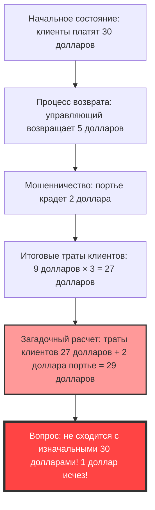
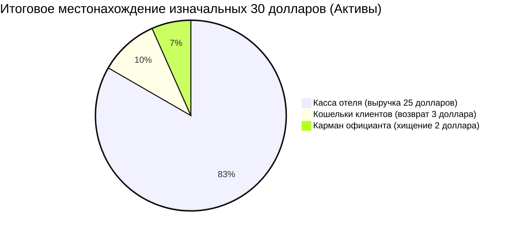

## 1. Введение: почему мы ошибаемся в простом сложении?

В мире существуют удивительные задачи, которые способны полностью "сломать" наш мозг, используя лишь сложение и вычитание на уровне начальной школы, без сложных дифференциалов, интегралов или сложной топологии. Одна из самых известных таких задач, заставившая многих ломать голову — это **«Загадка исчезнувшего доллара» (The Missing Dollar Riddle)**.

На первый взгляд, это обычная повседневная ситуация, история об ошибке при оплате счета в ресторане или отеле. Однако, стоит немного проследить за вычислениями, как из этого мира бесследно исчезает «один доллар».

В этой статье мы разберем этот известный математический парадокс (а точнее, задачу с подвохом, стилизованную под парадокс) и подробно проанализируем, почему наша интуиция дает сбой и где кроется логическая ловушка, рассмотрев ее с трех точек зрения: математики, когнитивной психологии и двойной записи (бухгалтерского учета).

---

## 2. Постановка проблемы: Загадка исчезнувшего доллара

Для начала, прочитайте следующую историю. А если у вас под рукой есть бумага и ручка, попробуйте производить вычисления вместе с нами.

> [!QUESTION] Загадка исчезнувшего доллара (история)
> Однажды трое путешественников приехали в небольшую гостиницу.
> Портье на ресепшене сообщил им: «Трехместный номер стоит 30 долларов за ночь».
> Трое путешественников достали из кошельков по 10 долларов, заплатили в сумме 30 долларов портье и отправились в свой номер.
> 
> Через некоторое время пришел управляющий отелем и сказал портье:
> «Сегодня у нас день скидок, так что этот номер стоит 25 долларов. Немедленно верни им 5 долларов».
> 
> Портье взял 5-долларовую купюру и направился к номеру. Но по пути он задумался:
> «Разделить 5 долларов на троих поровну будет сложно. Если я втайне заберу 2 доллара себе, а им верну оставшиеся 3 доллара, то получится ровно по 1 доллару на каждого, и все сойдется».
> 
> Итак, портье спрятал 2 доллара в свой карман, соврал путешественникам, что «по акции возвращается 3 доллара», и раздал каждому по 1 доллару.
> 
> **А теперь, внимание, вопрос.**
> 
> 1. Путешественники изначально заплатили по 10 долларов, а потом им вернули по 1 доллару, значит, фактически они заплатили **10 долларов - 1 доллар = 9 долларов**.
> 2. Общая сумма, которую заплатили трое путешественников, составляет **9 долларов × 3 человека = 27 долларов**.
> 3. С другой стороны, в кармане у портье лежат те самые **2 доллара**, которые он тайком прикарманил.
> 4. Если сложить **27 долларов**, заплаченные путешественниками, и **2 доллара**, находящиеся у портье, получится **27 + 2 = 29 долларов**.
> 
> Изначально путешественники точно заплатили «30 долларов».
> Однако в нынешних расчетах выходит всего «29 долларов».
> 
> **Куда же бесследно исчез оставшийся 1 доллар?**

Ну как?
Чем больше читаешь, тем больше мозг приходит в замешательство: «Действительно, не хватает 1 доллара!». Сами по себе расчеты `9 × 3 = 27` и `27 + 2 = 29` настолько просты, что понятны даже младшекласснику. Но почему-то они никак не сходятся с первоначальными 30 долларами.

В следующих главах мы раскроем секрет этого странного феномена.

---

## 3. Расхождение между интуицией и правильным ответом: почему мозг «багует»?

Когда большинство людей слышат эту задачу, их ход мыслей выглядит примерно так:

Суть этого парадокса кроется в хитром **словесном трюке (Эффект фрейминга: Framing Effect)**: мы складываем то, что складывать нельзя.

### Ядро заблуждения: бессмысленное вычисление «27 + 2»
Давайте еще раз внимательно посмотрим на следующую фразу в конце задачи:

> Если сложить **27 долларов**, заплаченные путешественниками, и **2 доллара**, находящиеся у портье, получится **27 + 2 = 29 долларов**.

На самом деле, само по себе вычисление «27 + 2» логически абсолютно бессмысленно.
Причина в том, что **в «итоговую сумму, уплаченную путешественниками (27 долларов)», уже включены «деньги, которые прикарманил портье (2 доллара)»**.

Сумма в 27 долларов, которую заплатили путешественники, распределяется следующим образом:
*   **Сумма, находящаяся в кассе отеля**: 25 долларов
*   **Сумма, которую прикарманил портье**: 2 доллара
*   Итого: 27 долларов

То есть, прибавлять к 27 долларам еще 2 доллара портье означает **считать 2 доллара портье дважды (Двойной счет: Double Counting)**.

Если мы хотим правильно свести баланс с изначальными «30 долларами», нам нужно сложить «сумму, которую заплатили клиенты» и «сумму, которая вернулась клиентам».
*   Сумма, которая в итоге была заплачена клиентами: 27 долларов (25 долларов в кассе + 2 доллара у портье)
*   Сумма, которая вернулась клиентам: 3 доллара
*   Итого: 27 + 3 = 30 долларов

При таком расчете становится очевидно, что ни один доллар никуда не исчез.

---

## 4. Математическое разъяснение: строгое доказательство с помощью уравнений

Для тех, кому словесные объяснения кажутся неубедительными, давайте докажем движение денег (денежный поток) строго с помощью математических формул.

Обозначим все денежные потоки через переменные:

*   $ P_{initial} $ : общая сумма, изначально уплаченная клиентами (30)
*   $ C_{hotel} $ : сумма, которую отель (управляющий) в итоге получил (25)
*   $ R_{total} $ : общая сумма возврата, которую управляющий передал портье (5)
*   $ R_{guest} $ : сумма возврата, которую клиенты в итоге получили (3)
*   $ S_{waiter} $ : сумма, которую прикарманил портье (2)

Из первоначального потока денег можно составить следующее уравнение:
$$ P_{initial} = C_{hotel} + R_{total} \quad \cdots (1) $$
(30 долларов = 25 долларов + 5 долларов)

5 долларов, возвращенные управляющим, разделяются на деньги, попавшие в руки клиентов, и деньги в кармане портье.
$$ R_{total} = R_{guest} + S_{waiter} \quad \cdots (2) $$
(5 долларов = 3 доллара + 2 доллара)

Подставим уравнение (2) в уравнение (1).
$$ P_{initial} = C_{hotel} + (R_{guest} + S_{waiter}) \quad \cdots (3) $$
(30 долларов = 25 долларов + 3 доллара + 2 доллара)

Теперь определим «итоговую сумму, уплаченную клиентами» из задачи как $ P_{final} $. Это начальная уплаченная сумма минус сумма, которая вернулась клиентам.
$$ P_{final} = P_{initial} - R_{guest} \quad \cdots (4) $$
(27 долларов = 30 долларов - 3 доллара)

Давайте перенесем $ R_{guest} $ из уравнения (3) в левую часть.
$$ P_{initial} - R_{guest} = C_{hotel} + S_{waiter} \quad \cdots (5) $$

Из уравнений (4) и (5) выводится следующая истина:
$$ P_{final} = C_{hotel} + S_{waiter} \quad \cdots (6) $$
(Итоговая уплаченная клиентами сумма 27 долларов = выручка отеля 25 долларов + кража портье 2 доллара)

Трюк в тексте задачи заключается в том, что **к $ P_{final} $ (27 долларов) в левой части пытаются еще раз прибавить $ S_{waiter} $ (2 доллара), который уже должен быть включен в правую часть**.
То есть формула расчета, к которой нас подводит задача, выглядит так:
$$ P_{final} + S_{waiter} = (C_{hotel} + S_{waiter}) + S_{waiter} $$
$$ 27 + 2 = (25 + 2) + 2 = 29 $$

Это число «29» — просто выдуманное значение, «выручка отеля + кража портье × 2», которое физически и экономически не имеет абсолютно никакого смысла. В этом и заключается математическая природа иллюзии, из-за которой кажется, что «1 доллар исчез».

---

## 5. Точка зрения бухгалтерского учета: разрушение парадокса с помощью двойной записи

Для тех, кого по-прежнему не убеждают (или заставляют интуитивно сомневаться) математические формулы, мы можем идеально визуализировать эту загадку, используя концепцию **«двойной записи» (Double-Entry Bookkeeping)**, которая применяется в мире бизнеса уже более 500 лет.

Основной принцип двойной записи заключается в том, что «Дебет» (Debit) и «Кредит» (Credit) всегда должны совпадать. Давайте используем это для составления бухгалтерских проводок (Journal Entry) перемещения денег.

### Операция 1: Клиенты платят 30 долларов
Начальное состояние с точки зрения отеля.

| Дебет (Увеличение активов) | Кредит (Увеличение обязательств / капитала) |
| :--- | :--- |
| Наличные (Cash): $30 | Депозиты (или Выручка): $30 |

### Операция 2: Управляющий передает портье 5 долларов, а 25 долларов проводит как выручку
Так как цена номера изменилась на 25 долларов, портье выдается 5 долларов для «возврата».

| Дебет | Кредит |
| :--- | :--- |
| Депозиты: $30 | Выручка (Sales): $25 Портье (Наличные): $5 |

### Операция 3: Действия портье (возврат 3 долларов и присвоение 2 долларов)
Это самый важный момент. Запишем, куда делись 5 долларов наличными, которые были у портье.

| Дебет | Кредит |
| :--- | :--- |
| Возврат клиентам: $3 Убыток от хищения (Loss): $2 | Портье (Наличные): $5 |

### Итоговое состояние консолидированного баланса (B/S) и отчета о прибылях и убытках (P/L)
Подведем итог того, где в конечном итоге находятся наличные деньги и под каким наименованием.

**【Проверка итогового состояния】**
*   **Источник средств (расходы клиентов)**: 30 долларов
*   **Местонахождение средств (результат)**: 
    *   В кассе отеля 25 долларов
    *   В кармане официанта 2 доллара
    *   На руках у клиентов 3 доллара
    *   Итого = 25 + 2 + 3 = 30 долларов

Если посмотреть через призму бухгалтерского «принципа двойной записи (Т-образный счет)», то «27 долларов, уплаченных клиентами (расходы)» — это «уменьшение активов», а прибавление к ним «2 долларов, украденных официантом (перемещение активов)» является, по стандартам бухгалтерского учета, **абсурдной ошибкой, когда путают и складывают дебет с кредитом**.
В деловом мире, если бы бухгалтер представил руководству расчет «27 + 2 = 29», это был бы логический провал такого уровня, за который либо сразу увольняют, либо подозревают в фальсификации финансовой отчетности.

---

## 6. Точка зрения когнитивной психологии: почему мы принимаем «27+2=29»?

Почему же многие люди бессознательно принимают и соглашаются («Ага, понятно») с формулой, которая неверна ни с математической, ни с бухгалтерской точки зрения? Дело в мощных **когнитивных искажениях**, заложенных в человеческом мозге.

### 1. Ошибка ментальной бухгалтерии (Mental Accounting)
Поведенческий экономист Ричард Талер (лауреат Нобелевской премии по экономике) предположил, что люди бессознательно «категоризируют деньги» (ментальная бухгалтерия) в своей голове.
В конце задачи «расходы клиентов (27 долларов)» и «деньги, полученные официантом (2 доллара)» представлены как одна и та же категория — «деньги». Мозг выхватывает только «цифры сумм (27 и 2)» и легкомысленно выполняет сложение, игнорируя направление вектора: являются ли они «потраченными деньгами (минус)» или «имеющимися деньгами (плюс)».

### 2. Эффект фрейминга (Эффект обрамления)
Это эффект, при котором то, как представлена информация, влияет на принятие решений и суждения людей.
Хитрость задачи заключается в том, что **«первоначальная цифра в 30 долларов устанавливается как цель»**.
Увидев вычисление «27 + 2 = 29 долларов», мозг бессознательно пытается подогнать его под цель (якорение): «Должно получиться первоначальные 30 долларов». Нас заставляют сравнивать цифры, которые не должны сравниваться, и возникающая при этом погрешность в «1» вызывает сильнейший когнитивный диссонанс (дискомфорт и замешательство) — именно так и было задумано.

### 3. Магия сторителлинга (Storytelling)
Люди гораздо лучше понимают «истории», чем математические формулы. Пока мы мысленно моделируем действия персонажей (клиентов, управляющего, официанта), наша рабочая (кратковременная) память переполняется, и когнитивные ресурсы для проверки логической обоснованности последнего уравнения истощаются. В этой текстовой задаче используется в точности тот же метод, что и «мисдирекшн» (отвлечение внимания), с помощью которого иллюзионисты направляют взгляд зрителей для успешного выполнения фокуса.

---

## 7. История «Загадки исчезнувшего доллара» и аналогичные задачи

Подобные парадоксы существуют с давних времен и передаются из поколения в поколение в различных вариациях, пересекая эпохи и границы.

### Происхождение парадокса
Точное происхождение этой задачи неизвестно, но она стала широко известна в США в 1930-х годах. В то время ее называли «Парадоксом коридорного» (Bellboy paradox), и суммы в задаче варьировались. Говорят, что она отражала психологию масс в Америке времен Великой депрессии, когда судьба даже «1 доллара» вызывала огромный интерес.

### Аналогичная задача: Загадка исчезнувших 10 йен
В Японии известна версия, в которой суммы переведены в иены: «Трое скинулись по 100 иен, чтобы купить вещь за 300 иен, сдача составила 50 иен...». Она регулярно всплывает в качестве классической «копипасты» на интернет-форумах и в детских книгах с загадками.

### Более сложная производная: Загадка исчезнувшего квадрата
Этот «словесный обман», примененный к «фигурам (геометрии)», представляет собой **«Загадку исчезнувшего квадрата» (Missing square puzzle)**, о которой мы рассказывали в другой статье этого блога.
Это ошибка интуиции, когда при перестановке частей фигур, которые должны иметь одинаковую площадь, почему-то исчезает одно поле (площадь). Она основана на тех же когнитивных ограничениях: «человеческий глаз не может заметить крошечные искажения прямых линий (разницу в наклоне)».

---

## 8. Уроки для реального мира: чему нас учит парадокс?

«Загадка исчезнувшего доллара» содержит в себе слишком глубокий урок, чтобы оставаться лишь забавной шуткой для вечеринок или детской загадкой.

1. **Способность подвергать сомнению «заданные рамки (предпосылки)»**
   Принимая решения в повседневном бизнесе или инвестировании, не принимаем ли мы на веру презентационные материалы и рекламные речи тех, кто утверждает: «Если сложить эту цифру с этой, получится так»?
   Даже если результаты вычислений верны (27 + 2 действительно равно 29), необходимо критическое мышление (Critical Thinking), чтобы задать вопрос: **«А имеет ли вообще логический смысл составление такой формулы?»**.
2. **Абсолютность денежного потока**
   Фальсификацию финансовой отчетности в корпоративном учете и сокрытие убытков по сложным финансовым деривативам можно назвать чрезвычайно изощренной версией «загадки исчезнувшего доллара». Как бы ни прибавляли и ни вычитали несуществующие цифры, чтобы создать видимость прибыли, если проследить базовое «движение наличных средств (денежный поток)», противоречия обязательно всплывут. Именно тогда, когда вещи кажутся запутанными, нужно возвращаться к основам: «Откуда пришли деньги и куда они ушли?».

---

## 9. Заключение: 1 доллар никуда и не исчезал

В заключение, давайте дадим самый краткий и мощный ответ на этот парадокс.

> **«Клиенты заплатили в общей сложности 27 долларов: 25 долларов попали в кассу отеля, а 2 доллара осели в кармане официанта. Расчеты сходятся идеально. Формула, которая пытается насильно вернуть нас к изначальным 30 долларам — вот главный источник путаницы».**

Как бы ни эволюционировал наш мозг, он все равно легко поддается обману комбинацией «правдоподобной истории» и «простого сложения».
Однако, используя мощные инструменты математики и логики (уравнения и двойную запись), мы можем разрушить эту иллюзию и увидеть истину.

В следующий раз, когда ваш друг с умным видом загадает вам «Загадку исчезнувшего доллара», обязательно используйте эти глубокие знания и хладнокровно ответьте: «Вектор чисел, которые нужно сложить, и чисел, которые нужно вычесть, перепутан!».
