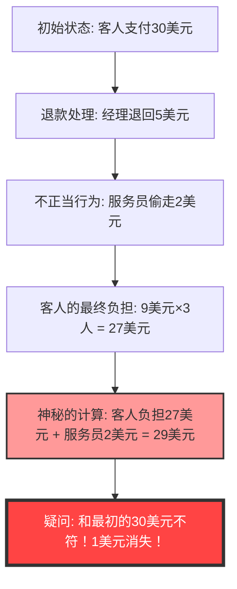
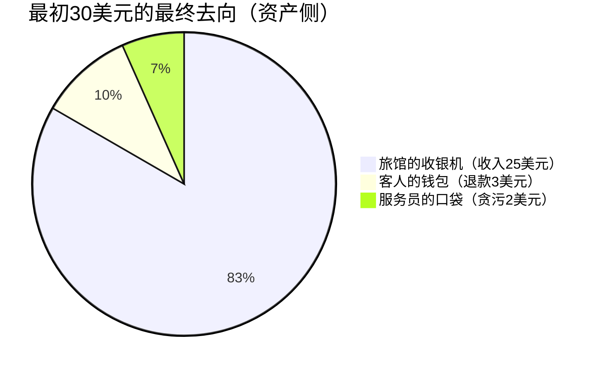

## 1. 引言：为什么我们会轻易被简单的加法欺骗？

在这个世界上，存在一些不需要使用高级微积分或深奥拓扑学，仅仅依靠小学低年级水平的“加法”和“减法”就能让人的大脑彻底崩溃的奇妙问题。其中世界上最著名的、并且让无数人困惑不已的，就是**“消失的1美元之谜（The Missing Dollar Riddle）”**。

乍看之下，这只是一个平凡无奇的日常场景，像是发生在餐厅里关于结账的纠纷。然而，只要稍微跟着计算一下，这“1美元”就从世界上离奇消失了。

本文将探讨这个著名的数学悖论（准确地说，是伪装成悖论的陷阱题），从数学、认知心理学以及复式记账（会计学）这三个视角，深度剖析为什么我们的直觉会被欺骗，以及逻辑的陷阱究竟在哪里。

---

## 2. 提出问题：消失的1美元之谜

首先，请阅读下面的故事。如果手边有纸和笔，请试着一起计算一下。

> [!QUESTION] 消失的1美元之谜（故事）
> 某天，有3位旅行者来到了一家小旅馆。
> 前台接待员告诉他们：“三人间一晚的住宿费总共是30美元。”
> 于是，这3位旅行者每人从钱包里拿出10美元，将总计30美元交给了前台接待员，然后走向房间。
> 
> 过了一会儿，旅馆经理走过来对前台接待员说：
> “今天是促销日，那个房间只需要25美元。你赶紧去把5美元退给他们。”
> 
> 前台接待员拿着5美元纸币走向客房。然而，在路上他心想：
> “把5美元平分给3个人太难了。不如我偷偷拿走2美元，把剩下的3美元退给他们，这样每人刚好分到1美元，计算上就完美了。”
> 
> 于是，前台接待员把2美元藏进自己的口袋，并对旅行者们撒谎说：“因为促销，退还给你们3美元”，然后退给每人1美元。
> 
> **那么，问题来了。**
> 
> 1. 旅行者们起初每人支付了10美元，后来每人收回了1美元，所以他们实际支付的金额是 **10美元 - 1美元 = 9美元**。
> 2. 3位旅行者支付的总金额是 **9美元 × 3人 = 27美元**。
> 3. 另一方面，前台接待员的口袋里有偷偷私吞的 **2美元**。
> 4. 将旅行者支付的 **27美元** 和前台接待员拥有的 **2美元** 加起来，**27 + 2 = 29美元**。
> 
> 最初，旅行者们确实支付了“30美元”。
> 但是，按照现在的计算却只有“29美元”。
> 
> **剩下的1美元，到底去哪儿了？**

你觉得呢？
是不是越读越觉得“确实少了1美元！”，大脑开始变得混乱了？计算公式本身不过是 `9 × 3 = 27`，`27 + 2 = 29`，这些全都是连小学生都能看懂的简单算式。然而，不知为何，却与最初的30美元对不上账了。

在接下来的章节中，我们将揭开这个奇妙现象的谜底。

---

## 3. 直觉与正解的偏差：为什么大脑会崩溃？

在听到这个问题时，许多人陷入的思维回路如下：

这个悖论的真相，在于一个巧妙的**文字诡计（Framing Effect: 框架效应）**，即“把不该加的东西加在一起”。

### 谬误的核心：“27 + 2”这个毫无意义的计算
请再次仔细看看题目最后面的这段话：

> 将旅行者支付的 **27美元** 和前台接待员拥有的 **2美元** 加起来，**27 + 2 = 29美元**。

事实上，这个“27 + 2”的计算本身在逻辑上就是毫无意义的。
因为，**“旅行者最终支付的金额（27美元）”中，已经包含了“前台接待员私吞的金额（2美元）”**。

旅行者支付的27美元明细如下：
*   **旅馆收银机里的金额**：25美元
*   **前台接待员私吞的金额**：2美元
*   合计：27美元

也就是说，在27美元的基础上再加前台接待员的2美元，就意味着**将前台接待员的2美元进行了“重复计算（Double Counting）”**。

如果想正确地和最初的“30美元”对账，我们需要将“客人支付的金额”与“客人收回的金额”相加：
*   客人最终支付的金额：27美元（收银机25美元 ＋ 前台接待员2美元）
*   客人收回手里的金额：3美元
*   合计：27 + 3 = 30美元

像这样计算的话，很明显连1美元都没有消失。

---

## 4. 数学视角的解析：通过方程式进行严密证明

对于那些觉得仅凭文字解释还不够清楚的人，让我们用严密的数学公式来证明资金的流动（现金流）吧。

我们将整体的资金流动定义为变量：

*   $ P_{initial} $ : 客人初期支付的总额 (30)
*   $ C_{hotel} $ : 旅馆（经理）最终收到的金额 (25)
*   $ R_{total} $ : 经理交给前台接待员的退款总额 (5)
*   $ R_{guest} $ : 客人最终收到的退款金额 (3)
*   $ S_{waiter} $ : 前台接待员私吞的金额 (2)

根据初期的资金流动，可以得出以下方程式：
$$ P_{initial} = C_{hotel} + R_{total} \quad \cdots (1) $$
（30美元 ＝ 25美元 ＋ 5美元）

经理退回的5美元，分成了客人手里的钱和前台接待员口袋里的钱：
$$ R_{total} = R_{guest} + S_{waiter} \quad \cdots (2) $$
（5美元 ＝ 3美元 ＋ 2美元）

将式(2)代入式(1)中：
$$ P_{initial} = C_{hotel} + (R_{guest} + S_{waiter}) \quad \cdots (3) $$
（30美元 ＝ 25美元 ＋ 3美元 ＋ 2美元）

在这里，我们将题目中的“客人最终支付的金额”定义为 $ P_{final} $。这是从初期支付金额中减去客人收回金额后的数值：
$$ P_{final} = P_{initial} - R_{guest} \quad \cdots (4) $$
（27美元 ＝ 30美元 － 3美元）

让我们将式(3)中的 $ R_{guest} $ 移项到左边：
$$ P_{initial} - R_{guest} = C_{hotel} + S_{waiter} \quad \cdots (5) $$

由式(4)和式(5)，我们可以得出以下真相：
$$ P_{final} = C_{hotel} + S_{waiter} \quad \cdots (6) $$
（客人最终支付额27美元 ＝ 旅馆收入25美元 ＋ 前台接待员偷窃2美元）

题目的诡计就在于，**试图将本应包含在右边的 $ S_{waiter} $ (2美元)，再次加到左边的 $ P_{final} $ (27美元) 上**。
换言之，题目诱导的计算公式变成了这样：
$$ P_{final} + S_{waiter} = (C_{hotel} + S_{waiter}) + S_{waiter} $$
$$ 27 + 2 = (25 + 2) + 2 = 29 $$

这个“29”的数字，纯粹只是“旅馆收入 ＋ 前台接待员偷窃 × 2”，是一个在物理和经济学上都完全没有任何意义的虚构数值。这就是造成“1美元消失”错觉的数学真相。

---

## 5. 会计学视角：用复式记账粉碎悖论

如果使用数学方程式仍然觉得无法信服（或者直觉上还是觉得有些不对劲），那么通过商业世界中使用了500多年的**“复式记账（Double-Entry Bookkeeping）”**概念，就能完美地将这个谜题可视化。

复式记账的基本原则是“借方（Debit）”和“贷方（Credit）”必须始终保持平衡。让我们用它来记录资金转移的会计分录（Journal Entry）。

### 交易1: 客人支付30美元
从旅馆方的角度来看初始状态：

| 借方（资产增加） | 贷方（负债/所有者权益增加） |
| :--- | :--- |
| 现金（Cash）: $30 | 预收款（或营业收入）: $30 |

### 交易2: 经理将5美元交给前台接待员，将25美元记为营业收入
由于房费更改为25美元，所以让前台接待员拿着5美元用于“退款”。

| 借方 | 贷方 |
| :--- | :--- |
| 预收款: $30 | 营业收入（Sales）: $25 前台接待员（现金）: $5 |

### 交易3: 前台接待员的行动（退款3美元和贪污2美元）
这是最关键的一步。记录前台接待员手中5美元现金的去向。

| 借方 | 贷方 |
| :--- | :--- |
| 给客人的退款: $3 贪污损失（Loss）: $2 | 前台接待员（现金）: $5 |

### 最终的资产负债表（B/S）与利润表（P/L）综合状态
纵观整个过程，我们来总结现金究竟在哪里，以及它属于什么名目。

**【确认最终状态】**
*   **资金来源（客人的支出）**: 30美元
*   **资金去向（结果）**: 
    *   旅馆收银机里 25美元
    *   服务员口袋里 2美元
    *   客人手里 3美元
    *   合计 = 25 + 2 + 3 = 30美元

从会计的“借贷必相等原则（T型账户）”来看，“客人支付的金额27美元（支出）”是“资产侧的减少”，而将它加上“服务员偷走的2美元（资产侧的转移）”的行为，在会计准则中不过是**“混淆了借方和贷方并相加”的荒唐错误**。
在商业世界里，如果财务人员向管理层报告“27 + 2 = 29”这样的计算，这绝对是会被立刻解雇或被怀疑做假账的逻辑崩溃级别。

---

## 6. 认知心理学视角：为什么我们会接受“27+2=29”？

即使这个计算公式在数学和会计学上都是错误的，为什么大多数人还是会在无意识中“嗯嗯，原来如此”地接受它呢？这与人类大脑中根深蒂固的强大**认知偏差**有关。

### 1. 心理账户（心理账本）的Bug
行为经济学家理查德·泰勒（诺贝尔经济学奖得主）提出，人类在头脑中会无意识地进行“资金的分类（心理账户）”。
在题目的最后，“客人的支出（27美元）”和“服务员得到的钱（2美元）”被作为相同的“钱”这一类别呈现出来。大脑只截取了“金额的数字（27和2）”，却忽略了它是“支付出去的钱（负数）”还是“拥有的钱（正数）”的方向性，草率地执行了加法。

### 2. 框架效应（信息的框架）
根据信息的呈现方式不同，人们的决策和判断也会发生改变的效应。
这道题的高明之处在于，**“将最初的30美元这个数字设定为了目标”**。
在看到“27 + 2 = 29美元”的计算后，大脑会无意识地试图将其与“本来应该是30美元”的目标（锚定效应）强行联系起来。被迫比较原本不该比较的数字，并由此产生“1”的误差，这种设计就是为了引发强烈的认知失调（不适感或混乱）。

### 3. 讲故事的魔力
相比于数学公式，人类更擅长理解“故事”。在脑海中模拟登场人物（客人、经理、服务员）的行动时，工作记忆（短期记忆）就已经被塞满了，用来验证最后方程式逻辑合理性的认知资源就被耗尽了。魔术师引导观众视线以成功完成戏法的“误导（Misdirection）”手法，和这道应用题中使用的手法完全一样。

---

## 7. “消失的1美元之谜”的历史与同类问题

这类悖论自古以来就存在，跨越了时代和国界，以各种不同的版本流传至今。

### 悖论的起源
这个问题的确切起源尚不清楚，但在20世纪30年代的美国被广泛知晓。当时被称为“门童悖论（Bellboy paradox）”，金额的设定也各不相同。有人认为，这反映了在美国大萧条时期，哪怕区区“1美元”的去向也是大众极其关心的事情。

### 同类问题：消失的10日元之谜
在日本，著名的版本将金额换成了日元：“3个人各出100日元买了300日元的物品，找零50日元……”。作为儿童益智问答书的内容，或是网络论坛上的经典复制粘贴文，也会定期成为话题。

### 更高级的衍生形式：消失的正方形之谜
将这种“文字上的诡辩”应用到“图形（几何学）”上的，就是本博客另一篇文章中介绍的**“消失的正方形之谜（Missing square puzzle）”**。
将面积本应相同的图形部件重新排列后，不知为何却消失了1个方格的漏洞（面积），这也是一种直觉的Bug。它同样利用了“人类的眼睛无法看穿微小直线的扭曲（倾斜度的差异）”这一认知极限。

---

## 8. 对现实世界的教训：我们该从悖论中学到什么？

“消失的1美元之谜”不仅适合作为酒会上的小谈资或骗小孩的谜题，它还蕴含着深刻的教训。

1. **质疑“给定框架（前提）”的能力**
   我们在日常的商业活动或投资中做决策时，是否轻信了别人提供的“把这个数字和那个数字加起来就是这样”的演示资料或推销话术？
   即使计算结果是对的（27 + 2 确实等于 29），但**“列出这个算式本身在逻辑上是否有意义？”**——这种批判性思维（Critical Thinking）是不可或缺的。
2. **现金流的绝对性**
   企业会计中的财务造假，或者复杂的金融衍生品的损失隐瞒，可以说是极其高度复杂化的“消失的1美元之谜”。即使通过加减毫无实质意义的数字来制造出盈利的假象，只要从根本上追溯“现金流的动向”，矛盾就必定会暴露。越是觉得事物复杂的时候，越有必要回归“钱从哪里来，又到了哪里去”的基本面。

---

## 9. 总结：1美元从一开始就没有消失

最后，我想为这个悖论提供一个最简洁有力的答案作为结束。

> **“客人总共支付了27美元，旅馆收银机里有25美元，服务员口袋里有2美元。账目完全对得上。硬要把它加回最初的30美元的那个计算公式，才是所有混乱的罪魁祸首。”**

人类的大脑，无论进化到什么程度，都还是会轻易地被“似是而非的故事”和“简单的加法”的组合所欺骗。
然而，通过使用数学或逻辑学这样强大的工具（方程式或复式记账），我们就能斩断这种错觉，看穿真相。

下次，如果你的朋友得意洋洋地拿出“消失的1美元之谜”来考你，请务必结合这些深厚的知识储备，冷静地回答一句：“你该加和该减的数字方向搞反了哦！”
