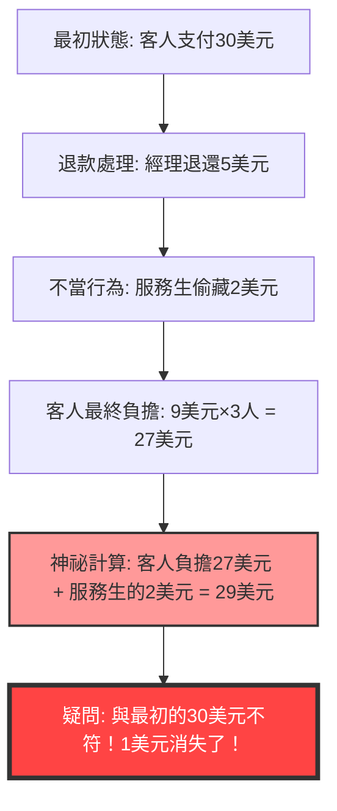
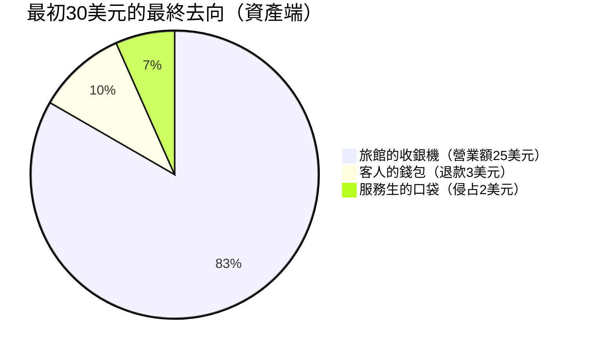

## 1. 前言：為什麼我們會被簡單的加法欺騙？

世界上存在著一種神奇的問題，不需要使用高深的微積分或艱澀的拓樸學，單靠小學低年級程度的「加法」與「減法」，就能讓人類的大腦完全當機。其中，世界上最著名且讓無數人苦惱的，就是**「消失的1美元之謎（The Missing Dollar Riddle）」**。

乍看之下，這似乎只是個稀鬆平常的日常場景，一個發生在餐廳的結帳糾紛。然而，只要稍微跟著計算一下，就會發現世界上的「1美元」竟然憑空消失了。

本文將探討這個著名的數學悖論（準確來說是類似悖論的陷阱題），從數學、認知心理學以及複式簿記（會計學）三個角度，徹底剖析為什麼我們的直覺會被欺騙，以及邏輯的陷阱究竟藏在哪裡。

---

## 2. 提出問題：消失的1美元之謎

首先，請閱讀以下的故事。如果手邊有紙筆，不妨跟著一起計算看看。

> [!QUESTION] 消失的1美元之謎（故事）
> 某天，有3位旅客來到一家小旅館。
> 櫃檯接待員告訴他們：「三人房一晚總共是30美元。」
> 3位旅客各自從錢包裡拿出10美元，湊齊30美元交給接待員後便前往房間。
> 
> 過了一會兒，旅館經理走過來對接待員說：
> 「今天有促銷活動，那個房間只要25美元就好。趕快把5美元退還給他們。」
> 
> 接待員拿著5美元紙鈔走向客房。但在路上他心想：
> 「5美元要平均分給3個人實在太難了。不如我偷偷暗槓2美元，剩下的3美元退還給他們，這樣每個人剛好拿回1美元，數字就完美了。」
> 
> 於是，接待員將2美元藏進自己的口袋，並對旅客們撒謊說：「因為促銷活動，退還3美元給各位」，然後退給每人1美元。
> 
> **那麼，問題來了。**
> 
> 1. 旅客們最初每人支付了10美元，後來每人拿回1美元，所以他們實際支付的金額是 **10美元 - 1美元 = 9美元**。
> 2. 3位旅客支付的總金額為 **9美元 × 3人 = 27美元**。
> 3. 另一方面，接待員的口袋裡有他偷偷藏起來的 **2美元**。
> 4. 將旅客支付的 **27美元** 與接待員身上的 **2美元** 相加，會得到 **27 + 2 = 29美元**。
> 
> 最初，旅客們確實支付了「30美元」。
> 但是，依照現在的計算卻只有「29美元」。
> 
> **剩下的1美元，究竟消失到哪裡去了呢？**

覺得如何呢？
是不是越讀越覺得「確實少了1美元！」，大腦也跟著混亂起來了呢？其實計算公式本身只是 `9 × 3 = 27`、`27 + 2 = 29`，全都是連小學生都懂的簡單算式。儘管如此，卻不知為何與最初的30美元對不上帳。

在接下來的章節中，我們將為您揭開這個奇妙現象的機關。

---

## 3. 直覺與正確答案的落差：為什麼大腦會當機？

當聽到這個問題時，大多數人會陷入的思考迴路如下：

這個悖論的真面目，在於利用了「把不該加的東西加在一起」這種巧妙的**文字遊戲（Framing Effect：框架效應）**。

### 謬誤的核心：「27 + 2」這個毫無意義的計算
請再仔細看看題目最後的這一段文字：

> 將旅客支付的 **27美元** 與接待員身上的 **2美元** 相加，會得到 **27 + 2 = 29美元**。

事實上，「27 + 2」這個計算本身在邏輯上是毫無意義的。
為什麼呢？因為**「旅客最終支付的金額（27美元）」裡面，已經包含了「接待員私吞的金額（2美元）」**。

旅客支付的27美元明細如下：
*   **旅館收銀機裡的金額**：25美元
*   **接待員私吞的金額**：2美元
*   合計：27美元

也就是說，在27美元上再加接待員的2美元，就等於是**將接待員的2美元「重複計算（Double Counting）」了**。

如果想正確地與最初的「30美元」對帳，我們需要將「客人支付的金額」與「退還給客人的金額」相加：
*   客人最終支付的金額：27美元（收銀機25美元 ＋ 接待員2美元）
*   退還給客人的金額：3美元
*   合計：27 + 3 = 30美元

只要像這樣計算，就可以清楚明白連1美元都沒有消失。

---

## 4. 數學解析：用方程式進行嚴謹的證明

如果光聽文字解釋還是覺得難以釋懷，我們就用嚴謹的數學公式來證明資金的流向（現金流）吧。

我們用變數來定義整體的資金流動：

*   $ P_{initial} $ : 客人最初支付的總額 (30)
*   $ C_{hotel} $ : 旅館（經理）最終收到的金額 (25)
*   $ R_{total} $ : 經理交給接待員的退款總額 (5)
*   $ R_{guest} $ : 客人最終收到的退款金額 (3)
*   $ S_{waiter} $ : 接待員私吞的金額 (2)

從最初的資金流動，可以得出以下方程式：
$$ P_{initial} = C_{hotel} + R_{total} \quad \cdots (1) $$
（30美元 ＝ 25美元 ＋ 5美元）

經理退還的5美元，分成了客人手上的錢和接待員口袋裡的錢：
$$ R_{total} = R_{guest} + S_{waiter} \quad \cdots (2) $$
（5美元 ＝ 3美元 ＋ 2美元）

將公式(2)代入公式(1)：
$$ P_{initial} = C_{hotel} + (R_{guest} + S_{waiter}) \quad \cdots (3) $$
（30美元 ＝ 25美元 ＋ 3美元 ＋ 2美元）

在此，我們將題目中提到的「客人最終支付的金額」定義為 $ P_{final} $。這是從最初的支付額中減去退還給客人的金額：
$$ P_{final} = P_{initial} - R_{guest} \quad \cdots (4) $$
（27美元 ＝ 30美元 － 3美元）

讓我們從公式(3)將 $ R_{guest} $ 移項到等號左邊：
$$ P_{initial} - R_{guest} = C_{hotel} + S_{waiter} \quad \cdots (5) $$

由公式(4)與公式(5)，可以導出以下真相：
$$ P_{final} = C_{hotel} + S_{waiter} \quad \cdots (6) $$
（客人最終支付額27美元 ＝ 旅館營業額25美元 ＋ 接待員偷走的2美元）

題目的陷阱就在於，**試圖把等式左邊的 $ P_{final} $ (27美元) 與本來就包含在右邊裡的 $ S_{waiter} $ (2美元) 再次相加**。
也就是說，題目誘導我們進行了以下的算式：
$$ P_{final} + S_{waiter} = (C_{hotel} + S_{waiter}) + S_{waiter} $$
$$ 27 + 2 = (25 + 2) + 2 = 29 $$

這「29」這個數字，單純只是「旅館營業額＋接待員偷走的錢×2」，在物理上和經濟上都是毫無意義的虛構數值。這就是看起來「消失了1美元」這種錯覺的數學真相。

---

## 5. 會計學視角：用複式簿記粉碎悖論

如果使用了數學方程式仍無法讓您信服（或者直覺上還是覺得有些不對勁），只要運用商業世界中使用了500年以上的**「複式簿記（Double-Entry Bookkeeping）」**概念，就能完美地將這個謎題視覺化。

複式簿記的基本原則是「借方（Debit）」與「貸方（Credit）」必須永遠相等。讓我們用這個原則來記錄資金移動的日誌（Journal Entry）吧。

### 交易1: 客人支付30美元
這是從旅館方看到的最初狀態。

| 借方（資產的增加） | 貸方（負債/淨資產的增加） |
| :--- | :--- |
| 現金（Cash）: $30 | 預收款項（或營業收入）: $30 |

### 交易2: 經理將5美元交給接待員，並將25美元計為營業收入
由於房價更改為25美元，經理拿出5美元作為「退款用」交給接待員。

| 借方 | 貸方 |
| :--- | :--- |
| 預收款項: $30 | 營業收入（Sales）: $25 接待員（現金）: $5 |

### 交易3: 接待員的行為（退還3美元與侵占2美元）
這裡是關鍵。我們要記錄接待員持有的5美元現金的去向。

| 借方 | 貸方 |
| :--- | :--- |
| 退還給客人: $3 侵占損失（Loss）: $2 | 接待員（現金）: $5 |

### 最終的資產負債表（B/S）與損益表（P/L）整合狀態
統整整個過程後，我們來總結現金的所在位置以及其對應的名目。

**【最終狀態確認】**
*   **資金來源（客人的支出）**: 30美元
*   **資金去向（結果）**: 
    *   旅館的收銀機裡有 25美元
    *   服務生的口袋裡有 2美元
    *   客人手上有 3美元
    *   合計 = 25 + 2 + 3 = 30美元

從會計的「借貸平衡原則（T字帳戶）」來看，「客人支付的金額27美元（支出）」屬於「資產端的減少」，而把它跟「服務生偷走的2美元（資產端的轉移）」加在一起的行為，在會計準則中無異於是**「將借方與貸方混淆相加」這種荒謬至極的錯誤**。
在商業世界中，如果會計人員向管理層報告「27 + 2 = 29」的計算結果，這絕對是會被立刻開除，或是被懷疑是在做假帳的邏輯崩潰程度。

---

## 6. 認知心理學視角：為什麼我們會接受「27+2=29」？

為什麼許多人在面對這個在數學上和會計學上都錯誤的算式時，會無意識地說出「嗯嗯，原來如此」並接受它呢？這與人類大腦中根深蒂固的強大**認知偏誤**有關。

### 1. 心理帳戶（Mental Accounting）的Bug
行為經濟學家理察·塞勒（諾貝爾經濟學獎得主）提出，人類會在腦中無意識地進行「金錢的分類（心理帳戶）」。
在題目最後，「客人的支出（27美元）」和「服務生獲得的錢（2美元）」被當作同一個「金錢」類別呈現。大腦只截取了「金額的數字（27和2）」，卻忽略了這些數字的向量方向——也就是它究竟是「付出的錢（負數）」還是「擁有的錢（正數）」，進而草率地執行了加法。

### 2. 框架效應（Framing Effect）
這是指資訊呈現的框架會改變人們決策與判斷的效應。
這個題目的巧妙之處在於，**「將最初的30美元設定為目標數字」**。
在看到「27 + 2 = 29美元」的算式後，大腦會無意識地試圖將結果與「原本應該要是30美元」這個目標（錨定效應）強行連結。它讓我們去比較原本不該比較的數字，並因為產生了「1」的誤差，進而引發強烈的認知失調（不適感與混亂），這正是這個題目被設計出來的目的。

### 3. 說故事的魔力（Storytelling）
人類比起數學公式，更擅長理解「故事」。當我們在腦海中模擬登場人物（客人、經理、服務生）的動作時，工作記憶（短期記憶）就會被佔滿，導致用來驗證最後一個方程式邏輯正確性的認知資源枯竭。魔術師引導觀眾視線以成功完成戲法的「錯誤引導（Misdirection）」，與這個應用題所使用的手法如出一轍。

---

## 7. 「消失的1美元之謎」的歷史與類似題目

這類悖論自古以來便已存在，跨越了時代與國界，並以各種版本流傳至今。

### 悖論的起源
這個問題的確切起源不明，但在1930年代的美國變得廣為人知。當時被稱為「門僮悖論（Bellboy paradox）」，金額的設定也各有不同。有人說，在大蕭條時期的美國，區區「1美元」的去向也是人們非常關心的事，這反映了當時的大眾心理。

### 類似題目：消失的10日圓之謎
在日本，最著名的是將金額換成日圓的版本：「3個人各出100日圓買了300日圓的商品，找零50日圓…」。這也經常作為兒童益智書或網路論壇的經典轉貼文定期引起話題。

### 更進階的衍生型：消失的正方形之謎
將這種「文字上的詭辯」應用到「圖形（幾何學）」上的，就是本部落格其他文章也有介紹過的**「消失的正方形之謎（Missing square puzzle）」**。
明明是面積相同的圖形零件，重新排列後不知為何卻會消失一格（面積）的直覺Bug，這也是利用了「人類的眼睛無法看穿微小直線扭曲（傾斜差異）」的認知極限。

---

## 8. 現實世界的教訓：我們該從悖論中學到什麼？

「消失的1美元之謎」蘊含著深刻的教訓，如果只把它當成聚會上的笑話或騙小孩的謎題就太可惜了。

1. **質疑「既定框架（前提）」的能力**
   當我們在日常商業活動或投資中做決策時，是否也全盤接受了別人提出的「這個數字加上那個數字就會變成這樣」的簡報資料或推銷話術呢？
   即使計算結果是正確的（27 + 2 確實是 29），我們也必須具備批判性思考（Critical Thinking），去質問**「建立這個算式本身在邏輯上有意義嗎？」**。
2. **現金流的絕對性**
   企業會計中的假帳，或是複雜金融衍生性商品的隱匿損失，可以說都是極度複雜化的「消失的1美元之謎」。即使透過加減虛無縹緲的數字來製造獲利的假象，只要從根本去追溯「現金的流動（現金流）」，矛盾必定會暴露無遺。越是覺得事情複雜的時候，就越需要回歸基本，去探究「錢從哪裡來，又到哪裡去了」。

---

## 9. 總結：1美元從一開始就沒有消失

最後，我想用對這個悖論最簡潔有力的答案來作結。

> **「客人總共支付了27美元，其中25美元進了旅館收銀機，2美元進了服務生的口袋。帳目完全吻合。試圖硬湊回最初30美元的計算公式，才是所有混亂的罪魁禍首。」**

無論人類的大腦如何進化，都還是很容易被「看似合理的故事」與「簡單的加法」的組合所欺騙。
然而，只要運用數學或邏輯學這種強大的工具（方程式或複式簿記），我們就能斬斷錯覺，看穿真相。

下次如果有朋友一臉得意地對您出這道「消失的1美元之謎」，請務必運用這份深厚的知識背景，冷靜地回擊他：「該加的數字和該減的數字，向量方向搞錯了喔！」
