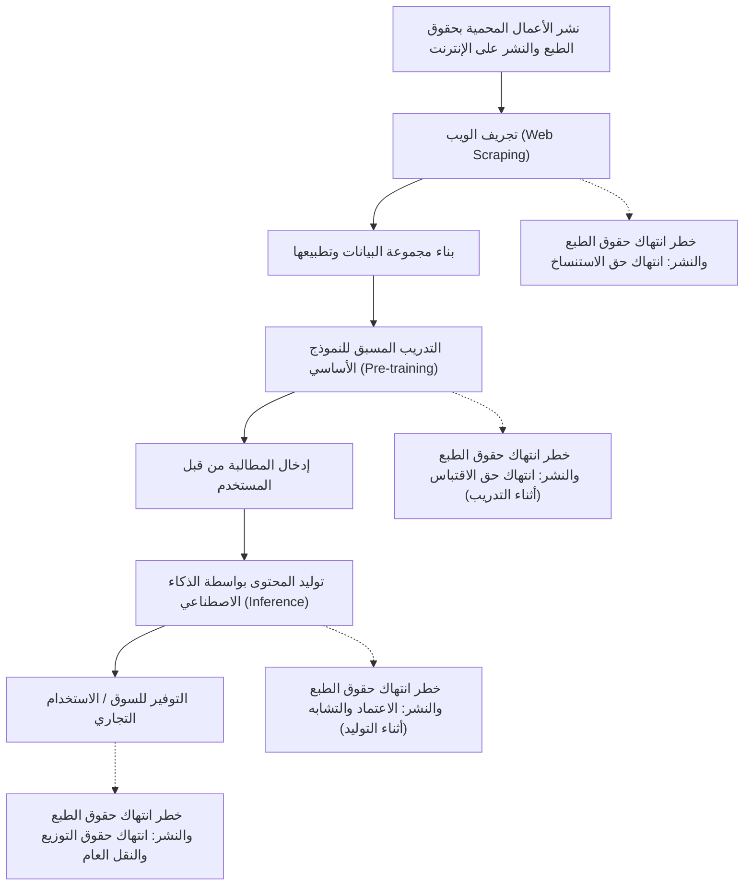
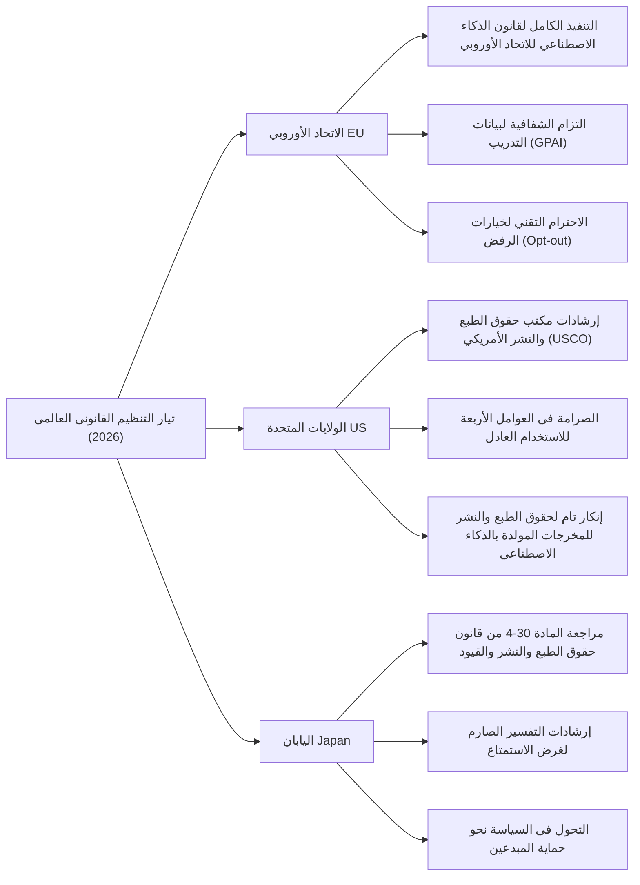
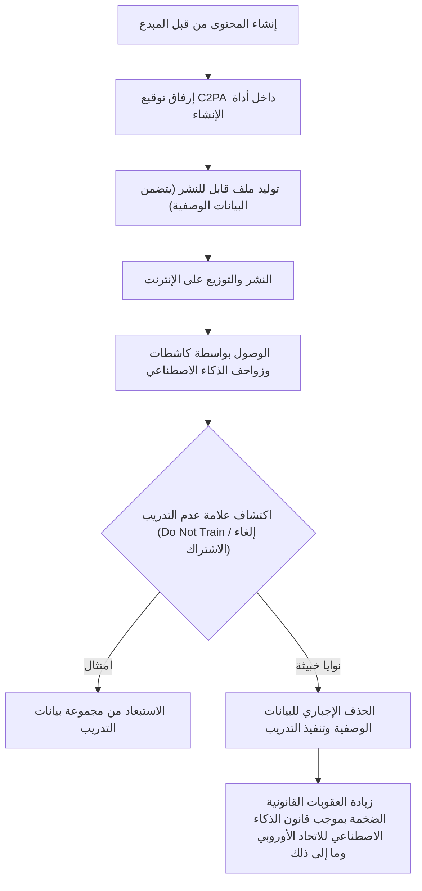

## 1. مقدمة: عام 2026، نقلة نوعية جديدة في الذكاء الاصطناعي التوليدي وحقوق الطبع والنشر

اعتبارًا من عام 2026، وصل التطور التقني للذكاء الاصطناعي التوليدي (Generative AI) إلى مستوى يقلب العملية الإبداعية البشرية من جذورها، بدءًا من إنشاء النصوص، الصور، الصوت، ومقاطع الفيديو، وصولاً إلى التوليد التلقائي للنماذج ثلاثية الأبعاد وأكواد البرمجيات المعقدة. وفي حين أصبحت نماذج اللغة الكبيرة (LLM) من فئة GPT-5 ونماذج الانتشار (Diffusion Models) من الجيل القادم راسخة كبنية تحتية اجتماعية، فإن النقاش حول قانونية "بيانات التدريب (Training Data)" التي تدعم نماذج الذكاء الاصطناعي هذه، وملكية حقوق "المحتوى المولد (Generated Content)" بواسطة الذكاء الاصطناعي، قد انتقل أخيرًا من النزاعات الفردية في المحاكم إلى مرحلة التنظيم القانوني على المستوى الوطني والتوحيد القياسي الدولي.

أدت الدعاوى الجماعية (Class Actions) المتكررة التي رفعها المبدعون وشركات الإعلام الكبرى ضد شركات تطوير الذكاء الاصطناعي الرائدة بين عامي 2022 و2024 إلى بعض الأحكام القضائية المهمة وأطر التسوية بحلول عام 2026. وفي الوقت نفسه، بدأت الهيئات التشريعية في مختلف البلدان في فرض شبكات تنظيمية جديدة لمواكبة سرعة التطور التكنولوجي. في العصر الحالي، حيث تتصادم قيمتان متعارضتان وجهًا لوجه: الفوائد الاقتصادية الهائلة (زيادة الإنتاجية) التي تجلبها تكنولوجيا الذكاء الاصطناعي، وحماية حقوق المبدعين الذين رعوا الثقافة حتى الآن، من المهم للغاية للممارسين في الشركات، والمهندسين، والمبدعين أنفسهم الفهم الدقيق للمشهد القانوني.

في هذا المقال، سنشرح بالتفصيل الشديد الاتجاهات التنظيمية القانونية العالمية المتعلقة بالذكاء الاصطناعي التوليدي وحقوق الطبع والنشر اعتبارًا من عام 2026، والتدابير الدفاعية التقنية من جانب المبدعين (تسميم البيانات وإثبات المصدر)، والآفاق المستقبلية من وجهات نظر قانونية وتقنية.

---

## 2. آلية انتهاك حقوق الطبع والنشر: التفسير القانوني والمخاطر في ثلاث مراحل

من أجل التنظيم الدقيق لقضايا الذكاء الاصطناعي التوليدي وحقوق الطبع والنشر، من الضروري تقسيم دورة حياة الذكاء الاصطناعي بأكملها إلى ثلاث مراحل: "التدريب (Training)"، "التوليد (Generation)"، و"الاستغلال (Exploitation)". في النظام القانوني لعام 2026، تم توضيح طبيعة الحقوق المعنية في كل مرحلة.

### 2.1. "حق الاستنساخ" و"حق الاقتباس" في مرحلة التدريب (المدخلات)
لبناء نموذج أساسي، من الضروري جمع كميات هائلة من النصوص، الصور، وبيانات الأكواد من الإنترنت (تجريف الويب) واستخدامها لتدريب الذكاء الاصطناعي. في عملية بناء مجموعة البيانات هذه، يتم نسخ الأعمال المحمية بحقوق الطبع والنشر إلى الذاكرة المؤقتة للخادم ومساحة التخزين، وبالتالي، من حيث المبدأ، يصبح انتهاك "حق الاستنساخ" مشكلة.

تقليدياً، ادعت شركات تطوير الذكاء الاصطناعي أن "هذا الاستنساخ هو لأغراض تحليل المعلومات، وبما أنه مجرد معالجة آلية، فهو قانوني" أو "يندرج تحت الاستخدام العادل (Fair Use)". ومع ذلك، في أحدث السوابق القضائية والمناقشات الأكاديمية القانونية في عام 2026، ينصب التركيز على طبيعة "تعبيرات الخصائص" التي تستخرجها نماذج الذكاء الاصطناعي من البيانات.
إذا كان نموذج الذكاء الاصطناعي يستوعب "الخصائص الأساسية التعبيرية" لعمل محمي بحقوق الطبع والنشر معين كأوزان للشبكة (معلمات)، ويكون في حالة يمكن استخراجها كما هي لاحقاً (ما يسمى "التركيز المفرط (Overfitting)" أو "الحفظ عن ظهر قلب (Memorization)")، فإن هناك وجهة نظر قوية تقول إن هذا يندرج تحت "الاقتباس (Adaptation)" الذي يتجاوز مجرد تحليل المعلومات الآلي.

### 2.2. "الاعتماد" و"التشابه" في مرحلة التوليد (المخرجات)
هذه هي مرحلة الاستدلال حيث يدخل المستخدم مطالبة، ويولد الذكاء الاصطناعي المحتوى. إذا كانت الصور أو النصوص المولدة هنا تشبه إلى حد كبير عملاً موجوداً محمياً بحقوق الطبع والنشر، فهناك احتمال لإثبات انتهاك حقوق الطبع والنشر.

المتطلبان الرئيسيان لإثبات انتهاك حقوق الطبع والنشر هما "الاعتماد (سواء كان العمل المعني معروفاً وتم إنشاؤه بالاعتماد عليه)" و"التشابه (سواء كان يمكن إدراك الخصائص الأساسية التعبيرية بشكل مباشر)".
في حالة الذكاء الاصطناعي، على عكس المبدعين البشريين، كانت كيفية الحكم على المطلب الذاتي المتمثل في "ما إذا كان الذكاء الاصطناعي يعرف العمل" تحدياً لفترة طويلة. في الأحكام القضائية لعام 2026، أصبح النهج القائل بأنه "إذا ثبت حقيقة أن نموذج الذكاء الاصطناعي قد قرأ العمل المعني كبيانات تدريب، فسيتم استنتاج الاعتماد بقوة (تحول فعلي في عبء الإثبات)" راسخاً. ونتيجة لذلك، أصبحت الشفافية فيما يتعلق "بأي مجموعات البيانات قامت شركة الذكاء الاصطناعي بالتدريب عليها" ذات أهمية بالغة في تحديد الانتهاك.

### 2.3. مرحلة الاستخدام (مسؤولية المستخدم وتعويض الشركات)
هذه هي المرحلة التي يقوم فيها المستخدمون بنشر المحتوى المولد وبيعها واستخدامها تجارياً. في الحالات التي تُستخدم فيها أداة الذكاء الاصطناعي كمجرد "أداة"، يكون الموضوع المباشر لانتهاك حقوق الطبع والنشر هو المستخدم الذي أدخل المطالبة ونشر المخرجات.
في خدمات الذكاء الاصطناعي للمؤسسات لعام 2026 (مثل Copilot وإصدارات المؤسسات من الذكاء الاصطناعي لتوليد الصور)، أصبح المعيار الصناعي هو أن تتضمن شركات الذكاء الاصطناعي "شرط التعويض (Indemnity)" الذي يعوض مخاطر انتهاك حقوق الطبع والنشر للمستخدمين. ومع ذلك، هذا مجرد نقل للمخاطر التعاقدية بين الشركات (B2B)، ولا يعني إضفاء الشرعية على فعل الانتهاك نفسه بموجب قانون حقوق الطبع والنشر. أصبح من الضروري للشركات المستخدمة بناء نظام حوكمة داخلي لفحص ما إذا كانت المنتجات المولدة تنتهك حقوق الآخرين.

---

## 3. اتجاهات التنظيم القانوني في الدول والمناطق الرئيسية لعام 2026

تتبنى البلدان حول العالم مناهج مختلفة تماماً لموازنة المصالح الوطنية المتضاربة: تعزيز القدرة التنافسية الوطنية من خلال تعزيز ابتكار الذكاء الاصطناعي، وحماية المبدعين وأصحاب حقوق الطبع والنشر. سنقوم بمقارنة وتحليل مفصل للوضع الحالي للوائح القانونية في أوروبا، والولايات المتحدة، واليابان في عام 2026.

### 3.1. الاتحاد الأوروبي (EU): التنفيذ الكامل لقانون الذكاء الاصطناعي وتأثير متطلبات الشفافية
يعتبر "قانون الذكاء الاصطناعي للاتحاد الأوروبي (EU AI Act)"، الذي صدر في عام 2024 ودخل مرحلة التنفيذ الكامل في عام 2026 بعد فترة انتقالية تدريجية، الإطار التنظيمي الأكثر صرامة للذكاء الاصطناعي في العالم. التاثير الأكبر في سياق حقوق الطبع والنشر هو **"التزام الشفافية"** و**"التزام الامتثال لقانون حقوق الطبع والنشر للاتحاد الأوروبي"** المفروض على مطوري نماذج الذكاء الاصطناعي للأغراض العامة (GPAI: General Purpose AI).

بموجب قانون الذكاء الاصطناعي للاتحاد الأوروبي، يلتزم مزودو GPAI بنشر "ملخص مفصل بشكل كافٍ (Sufficiently detailed summary)" للمحتوى المستخدم في تدريب الذكاء الاصطناعي. اعتبارًا من عام 2026، تم توضيح المستوى القانوني من التفاصيل لهذا "الملخص المفصل بشكل كافٍ" في إرشادات محكمة العدل الأوروبية ومكتب الذكاء الاصطناعي الأوروبي (AI Office)، وأصبحت الأوصاف المجردة مثل "تم استخدام Common Crawl كمجموعة بيانات عامة" تعتبر غير قانونية. يُطلب بصرامة الكشف عن قوائم URL المحددة لمجموعات البيانات، وقوائم النطاقات الرئيسية المكتظة بأصحاب حقوق الطبع والنشر، وعملية استبعاد البيانات (حالة معالجة خيارات الرفض).

علاوة على ذلك، وفقًا لـ "استثناء التنقيب في النصوص والبيانات (TDM)" بموجب المادة 4 من توجيه حقوق الطبع والنشر في السوق الرقمية الموحدة (DSM) للاتحاد الأوروبي، إذا قام أصحاب الحقوق بإلغاء الاشتراك (Opt-out) من استخدام بيانات التدريب بطريقة قابلة للقراءة آليًا (مثل robots.txt أو C2PA، الموضحة لاحقًا)، فقد تم النص بوضوح على التزام شركات الذكاء الاصطناعي باحترام هذه النية تقنيًا ونظاميًا واستبعادها من مجموعات البيانات. في حالة انتهاك ذلك، هناك خطر فرض غرامات ضخمة تعادل نسبة مئوية معينة من المبيعات العالمية.

### 3.2. الولايات المتحدة (US): إعادة تعريف الاستخدام العادل والموقف الصارم لمكتب USCO
في الولايات المتحدة، مركز صناعة الذكاء الاصطناعي، بدلاً من التنظيم المباشر للذكاء الاصطناعي من خلال التشريعات، أصبح مبدأ "الاستخدام العادل (Fair Use)" المنصوص عليه في المادة 107 من قانون حقوق الطبع والنشر الحالي هو ساحة المعركة لتحديد شرعية تدريب الذكاء الاصطناعي.
بسبب قرار المحكمة العليا لعام 2023 في "مؤسسة آندي وارهول ضد غولدسميث"، أصبحت معايير تحديد الاستخدام العادل في الولايات المتحدة، وخاصة تفسير العامل الأول "الغرض وطبيعة الاستخدام (ما إذا كان استخداماً تحويلياً أم لا)" صارمة للغاية.

في السوابق القضائية الهامة على مستوى المحاكم الفيدرالية المتراكمة حتى عام 2026 (على سبيل المثال: الأحكام الموضوعية والتسويات في قضايا مثل نيويورك تايمز ضد OpenAI)، بدأت المحاكم في إظهار المعايير التالية:
"إذا تعلم الذكاء الاصطناعي من العمل الأصلي المحمي بحقوق الطبع والنشر ولديه القدرة على توليد بدائل تتنافس مباشرة مع العمل الأصلي في السوق (على سبيل المثال، ملخص إخباري متطابق مع مقال NYT، أو صورة مخزون تشبه إلى حد كبير صورة Getty)، فإن فعل التدريب يسبب تأثيراً سلبياً مباشراً على السوق (العامل الرابع للاستخدام العادل)، وبالتالي لن يكون محمياً كاستخدام عادل في مجمله."

بالإضافة إلى ذلك، يواصل مكتب حقوق الطبع والنشر الأمريكي (USCO) الالتزام بسياسة عدم الاعتراف مطلقاً بتسجيل حقوق الطبع والنشر للمحتوى المولد ذاتياً بواسطة الذكاء الاصطناعي، لعدم وجود "تأليف إبداعي (Creative Authorship)" من قبل البشر. في أحدث إرشادات التشغيل لعام 2026، أصبح من الواضح أنه حتى مع ادعاء "الاستخدام المكثف لهندسة المطالبات المتقدمة"، فإن هذا يعتبر مجرد "إعطاء تعليمات للأفكار (التكليف)"، ولا يُعترف به كتعبير إبداعي بموجب قانون حقوق الطبع والنشر. من أجل المطالبة بحقوق الطبع والنشر لمخرجات الذكاء الاصطناعي، من الضروري إثبات أن الإنسان قد أجرى "تعديلاً كبيراً وإبداعياً (مثل التنقيح الكبير في Photoshop، أو إعادة تكوين التراكيب المعقدة)" على تلك المخرجات.

### 3.3. اليابان (Japan): نهاية "حقبة الركوب المجاني" للمادة 30-4 من قانون حقوق الطبع والنشر
سُميت اليابان "أكثر دولة ملاءمة لتطوير الذكاء الاصطناعي في العالم" بفضل المادة 30-4 (الاستنساخ من أجل تحليل المعلومات وما إلى ذلك) التي تم تقديمها بموجب تعديل قانون حقوق الطبع والنشر في عام 2018. كان هذا البند عبارة عن حكم قوي للغاية يحد من الحقوق ويسمح على نطاق واسع بالاستنساخ لغرض تدريب الذكاء الاصطناعي، طالما أنه لم يكن بهدف "الاستمتاع" بالأفكار أو المشاعر المعبر عنها في العمل، بغض النظر عما إذا كان لأغراض تجارية أو غير تجارية، وبغض النظر عما إذا كانت بيانات المصدر المنسوخة تم تحميلها بشكل قانوني أو غير قانوني (*على الرغم من إضافة قيود لاحقًا على التعلم من النسخ المقرصنة).

ومع ذلك، منذ عام 2024، كان هناك رد فعل عنيف من مجموعات المبدعين بسبب المخاوف من أن الذكاء الاصطناعي التوليدي قد يسلب الأسواق بشكل مباشر من الرسامين والممثلين الصوتيين والكتاب الحاليين، وقد تم دفع تفسير صارم لـ "غرض الاستمتاع" إلى الأمام في وكالة الشؤون الثقافية واللجنة الفرعية لحقوق الطبع والنشر.

اعتبارًا من عام 2026، تشير أحدث الإرشادات القانونية الصادرة عن وكالة الشؤون الثقافية بوضوح إلى أن الإجراءات التالية تُعتبر "مختلطة بغرض الاستمتاع" ومن المرجح أن تكون خارج نطاق تطبيق المادة 30-4 (= من حيث المبدأ، يلزم إذن من صاحب حقوق الطبع والنشر، والقيام بذلك دون إذن يشكل انتهاكًا لحقوق الطبع والنشر).
- فعل تجريف الأعمال الخاصة بمبدع معين بشكل مكثف وتدريب الذكاء الاصطناعي عليها من أجل تقليد أسلوب الفن أو جودة الصوت لذلك المبدع عمداً (بطرق مثل الضبط الدقيق (Fine-tuning)، LoRA، أو التعلم الإضافي).
- فعل التسجيل في قواعد البيانات لنظام RAG (التوليد المعزز بالاسترجاع) المصمم بقصد إخراج الخصائص التعبيرية للعمل الأصلي كما هي.

بهذا التغيير في التفسير، انتهت فعلياً حقبة "الركوب المجاني للتدريب غير المصرح به على أي بيانات" في اليابان. تتجه الشركات اليابانية أيضاً، مثل تلك الموجودة في أوروبا والولايات المتحدة، نحو شراء بيانات نظيفة تم تصفية حقوقها.

---

## 4. الأهمية التاريخية للدعاوى الدولية البارزة بين 2024 و 2026

نلخص الوضع الحالي اعتبارًا من عام 2026 للدعاوى القضائية الكبرى التي كان لها تأثير هائل على تشكيل اللوائح القانونية.

1. **نيويورك تايمز ضد OpenAI / مايكروسوفت (The New York Times v. OpenAI / Microsoft)**
   أصبحت هذه القضية، التي رُفعت في أواخر عام 2023، أكبر دعوى قضائية ترمز إلى "الذكاء الاصطناعي التوليدي وحقوق الطبع والنشر". قدمت NYT أدلة على أنه تم التدريب على ملايين المقالات الخاصة بها دون إذن، وأن ChatGPT يخرج مقالات NYT تقريبًا من خلال الحفظ عن ظهر قلب (Memorization). في عام 2026، أصدرت المحكمة حكماً مؤقتاً بأن "الاستنساخ الكامل للمقالات بواسطة الذكاء الاصطناعي لا يشكل استخداماً عادلاً"، وتوصلت الشركتان إلى تسوية جوهرية من خلال إبرام اتفاقية ترخيص ضخمة. وقد أرسى هذا المعيار الصناعي المتمثل في أن "تدريب الذكاء الاصطناعي على المحتوى الإخباري يجب أن يكون مدفوع الأجر".

2. **صور غيتي ضد Stability AI (Getty Images v. Stability AI)**
   دعوى قضائية ضد مطوري الذكاء الاصطناعي لتوليد الصور "Stable Diffusion". تم تقديم حقيقة أن العلامة المائية (Watermark) الخاصة بـ Getty ظهرت كما هي في الصور المولدة بالذكاء الاصطناعي كدليل قاطع على التدريب غير المصرح به. نتيجة للدعاوى القضائية الموازية في المملكة المتحدة والولايات المتحدة، تم إصدار حكم رائد في عام 2026 ينص على أن "فعل التدريب عن طريق إزالة أو التحايل على العلامات المائية عمداً يندرج تحت التحايل على تدابير الحماية التقنية في قانون الألفية للملكية الرقمية (DMCA)"، وتم فرض عقوبات صارمة على شركة الذكاء الاصطناعي.

3. **دعوى GitHub Copilot (Doe v. GitHub)**
   دعوى قضائية ضد Copilot، الذي تم تدريبه على أكواد برمجيات مفتوحة المصدر (OSS). كان النزاع يدور حول تجاهل أداة الذكاء الاصطناعي لـ "التزام نسب حقوق الطبع والنشر (Attribution)" المطلوب بموجب تراخيص OSS (مثل MIT و GPL) عند إخراج الأكواد. اعتبارًا من عام 2026، هناك اتجاه لإلزام أدوات تطوير الذكاء الاصطناعي قانونيًا بتضمين وظائف (أنظمة التصفية والنسب) تكتشف في الوقت الفعلي ما إذا كان الكود المخرج يتطابق مع كود OSS موجود وتوفر معلومات الترخيص.

---

## 5. وسائل الدفاع الذاتي للمؤلفين: تقنيات إلغاء الاشتراك وتطور C2PA

يستغرق تطوير اللوائح القانونية وقتًا، ومن الصعب التحكم بالكامل في أنشطة شركات الذكاء الاصطناعي العابرة للحدود. لذلك، يقوم المبدعون والناشرون بتسريع التحركات لحماية أعمالهم المحمية بحقوق الطبع والنشر بنشاط باستخدام الوسائل التقنية.

### 5.1. ملف robots.txt وبروتوكولات إلغاء الاشتراك في TDM
ملف `robots.txt` الموجود في الدليل الجذري لمواقع الويب هو في الأصل بروتوكول للتحكم في زواحف محركات البحث، ولكنه أصبح راسخاً في عام 2026 كوسيلة قياسية لحظر زواحف التدريب للذكاء الاصطناعي (مثل `GPTBot` لشركة OpenAI، و `Google-Extended` لشركة Google، و `ClaudeBot` لشركة Anthropic) بشكل موحد.
ومع ذلك، ليس لملف `robots.txt` أي قوة ملزمة قانونًا، ولديه عيب أساسي يتمثل في سهولة تجاهله من قبل الكاشطات الخبيثة. لذلك، انتشر التوحيد القياسي (مثل W3C TDM Rep) عالميًا لتضمين نية إلغاء الاشتراك من التنقيب في النصوص والبيانات (TDM) مباشرة في رؤوس HTTP أو علامات التعريف في HTML (مثل `<meta name="tdm-reservation" content="1">`) لإعطائها تأثيرًا قانونيًا في شكل يمكن قراءته آليًا. بموجب قانون الذكاء الاصطناعي للاتحاد الأوروبي، يعتبر التجريف مع تجاهل علامة التعريف هذه عملاً غير قانوني بشكل واضح.

### 5.2. التنفيذ الأصلي لـ C2PA والمصادقة على مصدر المحتوى
يعد **C2PA (التحالف من أجل أصالة ومصدر المحتوى)** معيارًا تقنيًا يرفق "بيانات وصفية للمصدر" مشفرة وموقعة وغير قابلة للتلاعب للمحتوى الرقمي مثل الصور ومقاطع الفيديو والصوت. في عام 2026، تم تنفيذ C2PA بشكل أصلي في الكاميرات الرقمية الرئيسية (مثل Sony و Leica و Nikon)، وبرامج تحرير الصور (مثل Adobe Photoshop)، وحتى تطبيقات الكاميرا الافتراضية على أنظمة iOS و Android.

يمكن أن يتضمن بيان C2PA (معلومات المصدر) علامة واضحة تفيد بأنه "يجب عدم استخدام هذه الصورة كبيانات تدريب للذكاء الاصطناعي (Do Not Train: DNT)". وعلى العكس من ذلك، يتم إرفاق علامة تم إنشاؤها بواسطة الذكاء الاصطناعي تفيد بأن "هذه الصورة تم إنشاؤها بواسطة الذكاء الاصطناعي"، مما يجعلها تعمل كمحرك مزدوج لكل من التدابير المضادة للتزييف العميق (Deepfakes) وحماية حقوق الطبع والنشر. يخضع الإجراء المتعمد المتمثل في تجريد (إزالة) البيانات الوصفية للعقوبة كـ "إزالة معلومات إدارة الحقوق" في قوانين حقوق الطبع والنشر حول العالم.

---

## 6. التدابير التقنية المضادة: آلية تسميم البيانات (Glaze، Nightshade)

اعتبارًا من عام 2026، أصبحت تقنية "تسميم البيانات (Data Poisoning)" منتشرة على نطاق واسع كـ "الإجراء المضاد الجسدي والأكثر قوة" للمبدعين ضد شركات الذكاء الاصطناعي التي تتجاهل حتى اللوائح القانونية وإعلانات إلغاء الاشتراك. تعتبر هذه التقنيات، التي تمثلها **Glaze** و **Nightshade** التي طورها فريق بحثي في جامعة شيكاغو، أساليب دفاعية هجومية ونشطة تدمر رياضيًا عملية تدريب الذكاء الاصطناعي نفسها.

### 6.1. النموذج الرياضي للاضطراب العدائي (Adversarial Perturbation)
نماذج الذكاء الاصطناعي (خاصة شبكات CNN في التعرف على الصور، ونماذج الانتشار في التوليد) لا تنظر إلى الصور "بصريًا" بنفس طريقة البشر، بل تعالجها كمتجهات رقمية في مساحة كامنة عالية الأبعاد (Latent Space). يعمل تسميم البيانات على خداع تشفير نموذج الذكاء الاصطناعي عن قصد من خلال إضافة ضوضاء دقيقة (اضطراب عدائي) غير محسوسة تمامًا للعين البشرية إلى الصورة على مستوى البكسل.

مع التعبير عن هذا رياضياً، يتم تعريفه كمشكلة تحسين على النحو التالي:

$$ \min_{\delta} \mathcal{L}(f(x+\delta), y_{target}) $$

$$ \text{subject to } ||\delta||_p < \epsilon $$

حيث:
- $x$ هي الصورة الأصلية النظيفة (مثال: صورة "منظر طبيعي جميل")
- $\delta$ هي الضوضاء الدقيقة (متجه الاضطراب) المضافة إلى الصورة
- $f$ هو مستخرج الميزات (المشفر) للذكاء الاصطناعي
- $y_{target}$ هو المفهوم المستهدف الذي نريد أن يخطئ فيه الذكاء الاصطناعي (مثال: "قمامة مليئة بالضوضاء" أو "جسم مختلف تمامًا")
- $\mathcal{L}$ هي دالة الخسارة
- $\epsilon$ هو الحد الأقصى العتبة التي تضمن عدم إدراك الضوضاء بالرؤية البشرية (معيار L-p)

تحل أداة التسميم مشكلة التحسين هذه على جهاز الكمبيوتر الخاص بالمبدع، وتقوم بـ "تسميم" الصورة، ثم تخرجها.

### 6.2. أداة Glaze (حماية الأسلوب ونمط الرسم)
Glaze هي أداة لحماية "الأسلوب (Style)" الفريد للمبدع. على سبيل المثال، إذا تم تطبيق Glaze على رسم توضيحي بأسلوب الألوان المائية الدقيق، فإنه يبدو كلوحة مائية للعين البشرية. ومع ذلك، بسبب تأثير الاضطراب المضاف $\delta$، سيتعرف المشفر $f$ الخاص بالذكاء الاصطناعي على الصورة كمتجه لـ "لوحة زيتية كثيفة" أو "تكعيبية تجريدية" ويتعلمها على هذا الأساس.
ونتيجة لذلك، حتى لو أعطيت مطالبة "بالتوليد بأسلوب (هذا المبدع)" لنموذج ذكاء اصطناعي تم تدريبه على هذه الصورة المسممة، فإن التعيين في المساحة الكامنة يكون مشوهًا، مما يؤدي إلى إخراج أسلوب فني فوضوي ومختلف تمامًا. هذا يبطل بشكل جسدي إنشاء "نماذج منسوخة لأسلوب مبدع معين (مثل LoRA)" من قبل شركات الذكاء الاصطناعي.

### 6.3. أداة Nightshade (تدمير المفاهيم وانهيار النموذج)
تعتبر أداة Nightshade أكثر هجومية من Glaze، وتهدف إلى تلويث وتدمير "المفهوم (Concept)" نفسه الخاص بنماذج الذكاء الاصطناعي.
على سبيل المثال، يتم تطبيق Nightshade على صورة "كلب"، مما يجعل الذكاء الاصطناعي يتعلمها كـ "قطة". لقد ثبت أنه بمجرد مزج بضع مئات إلى بضعة آلاف من الصور المعرضة لمثل هذا التسميم الخاص بالمطالبة (Prompt-Specific Poisoning) في مجموعة بيانات، فإن محاذاة المفاهيم لنموذج أساسي واسع النطاق بأكمله ستنهار.
في نموذج ملوث بواسطة Nightshade، حتى لو أصدر المستخدم تعليمات للذكاء الاصطناعي بـ "توليد صورة لكلب لطيف"، سيخرج الذكاء الاصطناعي صورة لقطة غريبة بأربعة أرجل، أو قوامات لا معنى لها على الإطلاق.

في عام 2026، أصبح من القياسي أن تتم عمليات التسميم هذه تلقائيًا في الخلفية من خلال إضافات المتصفح أو البروتوكولات اللامركزية عندما يقوم المبدعون بتحميل صورهم إلى وسائل التواصل الاجتماعي أو مواقع محافظ أعمالهم. ونتيجة لذلك، أصبحت المخاطر التقنية المتمثلة في قيام شركات الذكاء الاصطناعي "بتجريف الصور بشكل عشوائي من الإنترنت" (خطر انهيار النماذج التي كلفت ملايين الدولارات لتدريبها في لحظة) عالية للغاية، وبالتالي تعمل كرادع قوي ضد التدريب غير المصرح به.

---

## 7. التحول الاستراتيجي لشركات الذكاء الاصطناعي التوليدي: البيانات النظيفة، التراخيص، والبيانات التركيبية

في مواجهة تشديد اللوائح القانونية، وخطر خسارة دعاوى انتهاك حقوق الطبع والنشر، وتهديد تقنيات تسميم البيانات مثل Nightshade، تضطر شركات تطوير الذكاء الاصطناعي، اعتبارًا من عام 2026، إلى إجراء تحولات واسعة النطاق في نموذج تطوير الذكاء الاصطناعي ونماذج الأعمال.

### 7.1. العودة إلى مجموعات البيانات النظيفة والصراع على الهيمنة
لقد وصل النهج السابق الذي اتبعته وادي السيليكون والمتمثل في "التحرك بسرعة وتحطيم الأشياء (Move fast and break things)" من خلال تجريف جميع البيانات الموجودة على الإنترنت دون إذن لإنشاء مجموعات بيانات ضخمة (مجموعات بيانات غير خاضعة للقانون مثل LAION-5B) إلى حده الأقصى.
وبدلاً من ذلك، ارتفعت قيمة "مجموعات البيانات النظيفة" التي خضعت لتصفية حقوق الطبع والنشر بشكل كامل واكتملت معالجة خيارات الرفض بشكل فلكي. رسخت شركات مثل Adobe (Firefly)، و Getty Images، و Shutterstock، التي تمتلك كميات هائلة من المحتوى المرخص الخاص بها، هيمنة ساحقة في سوق المؤسسات من خلال الترويج لـ "عدم وجود خطر انتهاك حقوق الطبع والنشر".

### 7.2. اتفاقيات الترخيص الضخمة ونماذج مشاركة الإيرادات
أصبح من الشائع لموردي الذكاء الاصطناعي الرئيسيين (مثل OpenAI، و Google، و Anthropic، و Meta) الدخول في اتفاقيات ترخيص بيانات ضخمة بمئات الملايين من الدولارات سنويًا مع شركات الإعلام (مثل The New York Times، و Reddit، و News Corp)، وخدمات الصور المخزنة، وكبار الناشرين، وحتى شركات التسجيلات الموسيقية.
علاوة على ذلك، يتقدم بناء "نماذج مشاركة الإيرادات" حيث يتم إعادة توزيع إيرادات الاشتراكات ورسوم استخدام واجهة برمجة التطبيقات (API) المكتسبة من المحتوى المولد بواسطة الذكاء الاصطناعي إلى المبدعين الأصليين الذين قدموا بيانات التدريب. من خلال العقود الذكية التي تجمع بين تقنية البلوكتشين / Web3 ومعيار C2PA، يتم إجراء تجارب تنفيذ اجتماعي نشطة لأنظمة تحسب بيانات المبدع التي "اعتمد" عليها الذكاء الاصطناعي لإنتاج المخرجات بناءً على مساهمتهم، وتوزع المكافآت تلقائيًا عبر المدفوعات الصغيرة.

### 7.3. الاعتماد على البيانات التركيبية (Synthetic Data) ومعضلة "انهيار النموذج"
في مواجهة الظاهرة التي تستنفد فيها البيانات البشرية قانونيًا أو جسديًا (من خلال التسميم)، وهو ما يُسمى بـ "جدار البيانات (Data Wall)"، بدأت شركات الذكاء الاصطناعي بجدية في اتباع نهج التدريب الذاتي لنماذج الذكاء الاصطناعي من الجيل القادم باستخدام البيانات المولدة بواسطة الذكاء الاصطناعي نفسه (البيانات التركيبية: Synthetic Data).
ومع ذلك، فقد ثبت أنه إذا تم تكرار التدريب بشكل متكرر باستخدام البيانات التركيبية فقط، فإن تنوع البيانات يُفقد، ويتم التخلص من ميزات الأقليات، مما يؤدي في النهاية إلى تدهور جودة إخراج النموذج بشكل قاتل، وهي ظاهرة رياضية وإحصائية تسمى "انهيار النموذج (Model Collapse)".
في النهاية، أصبح من الواضح أنه لكي يستمر الذكاء الاصطناعي في التطور، فإن الإمداد المستمر بـ "بيانات أصلية عالية الجودة تم إنشاؤها حديثًا بواسطة البشر" أمر ضروري، وظهرت المفارقة بأنه إذا تم استغلال المبدعين ودفعهم للانقراض، فإن تقنية الذكاء الاصطناعي نفسها ستقع في طريق مسدود من حيث التطور.

---

## 8. التوقعات لعام 2030 والملخص

سيُذكر عام 2026 في التاريخ كعام تاريخي أعلن فيه الانتهاء الكامل لـ "فترة استكشاف المنطقة الخارجة عن القانون" للذكاء الاصطناعي التوليدي، ودخل "فترة بناء عقد اجتماعي جديد (Social Contract)" لتعايش القانون، والتكنولوجيا، والإبداع البشري.

### جداول الأعمال الهامة التي يجب حلها في المستقبل
1. **تحقيق التنسيق القانوني الدولي**: كيفية دمج المناهج التنظيمية المختلفة للاتحاد الأوروبي (الشفافية الصارمة)، والولايات المتحدة (التركيز على تأثير السوق بناءً على الاستخدام العادل)، واليابان (الصرامة في غرض الاستمتاع)، وضمان اليقين القانوني لأعمال الذكاء الاصطناعي العالمية. من الضروري إجراء تحديثات على مستوى المعاهدات الدولية.
2. **إنشاء "حقوق جديدة" في عصر الذكاء الاصطناعي**: نقاش حول ما إذا كان ينبغي إنشاء حقوق جديدة خاصة بالتعلم الآلي (على سبيل المثال، "حقوق الوصول إلى البيانات واستيعابها" أو "الحق في المطالبة بمكافآت التدريب") لعملية التعلم الآلي للذكاء الاصطناعي، والتي لا يمكن التقاطها بواسطة المفاهيم التقليدية لـ "الاستنساخ والاقتباس".
3. **إعادة تعريف الإبداع البشري و "إثبات الإنسانية (Proof of Humanity)"**: في العصر الذي يمكن للذكاء الاصطناعي فيه إنتاج أي شيء بشكل فوري بجودة تتفوق على البشر، ما هو القدر من العلاوة الاقتصادية والثقافية التي سترتبط بحقيقة أن "شيئًا ما قد صنعه إنسان، ووضع فيه روحه البشرية (إثبات الإنسانية)" بحد ذاته. مثلما زادت قيمة الحرف اليدوية في العصر الصناعي، يتم حالياً إعادة تعريف قيمة العلامة التجارية للفن البشري.

من المستحيل إعادة عقارب الساعة إلى الوراء فيما يتعلق بتطور تكنولوجيا الذكاء الاصطناعي. ومع ذلك، فإن ترويض هذه التكنولوجيا الجبارة والتحكم فيها حتى لا تدمر النظام البيئي للمبدعين الذين رعوا الثقافة والفن البشري لآلاف السنين يعتمد على حكمة القانون، وعلوم الكمبيوتر، والمجتمع ككل.

نحو عام 2030، وبدلاً من أن يعادي الذكاء الاصطناعي والمبدعون بعضهم البعض ويتنازعون على الكعكة، أصبحت الحاجة الآن ملحة لإنشاء "منطقة اقتصادية رقمية جديدة" حيث يمكنهم الإبداع المشترك بتعويض عادل واحترام، مما يوسع الإبداع البشري.
