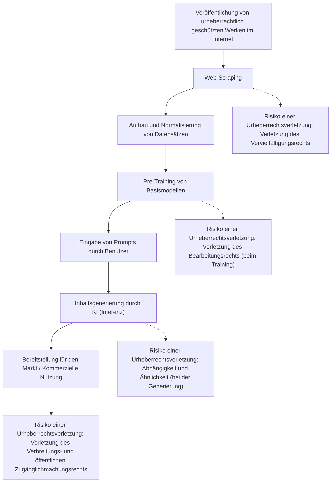
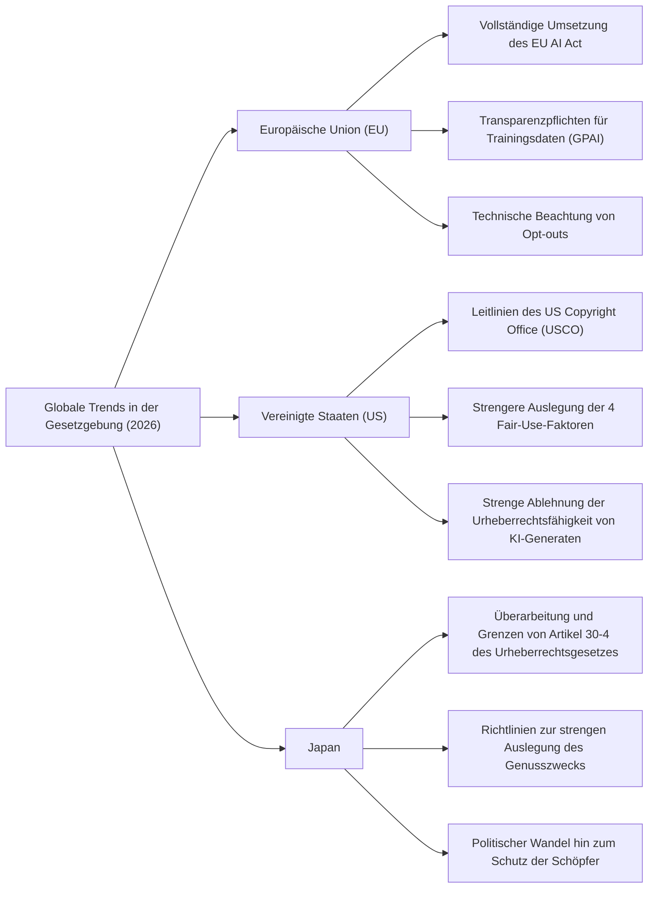
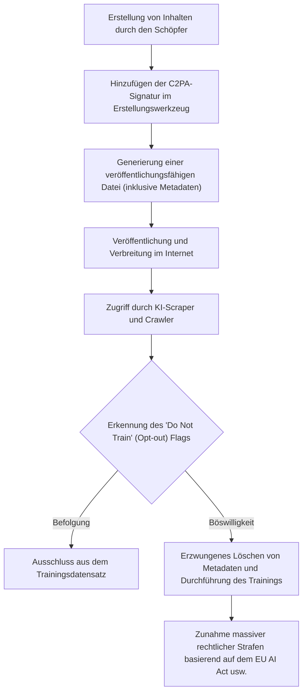

## 1. Einführung: 2026, ein neuer Paradigmenwechsel für generative KI und Urheberrecht

Im Jahr 2026 hat die technologische Entwicklung der generativen KI (Generative AI) ein Niveau erreicht, das menschliche kreative Prozesse grundlegend verändert – von Text, Bild, Audio und Video bis hin zur automatischen Generierung von 3D-Modellen und komplexem Softwarecode. Während sich Large Language Models (LLMs) der GPT-5-Klasse und Diffusion-Modelle der nächsten Generation als soziale Infrastruktur etablieren, hat sich die Debatte über die Rechtmäßigkeit der "Trainingsdaten" (Training Data), die diese KI-Modelle unterstützen, und die Rechte an den von der KI ausgegebenen "generierten Inhalten" (Generated Content) von individuellen Gerichtsstreitigkeiten zu einer Phase der rechtlichen Regulierung und internationalen Standardisierung auf nationaler Ebene verlagert.

Die Sammelklagen (Class Actions), die zwischen 2022 und 2024 von Schöpfern und großen Medienunternehmen gegen führende KI-Entwicklungsunternehmen eingereicht wurden, haben bis 2026 einige wichtige gerichtliche Entscheidungen und Vergleichsrahmen hervorgebracht. Gleichzeitig haben die Gesetzgeber verschiedener Länder begonnen, neue regulatorische Netze auszuwerfen, um mit der Geschwindigkeit der technologischen Entwicklung Schritt zu halten. In einer modernen Welt, in der zwei gegensätzliche Werte – die überwältigenden wirtschaftlichen Vorteile (Produktivitätssteigerung) der KI-Technologie und der Schutz der Rechte der Schöpfer, die die Kultur bisher gepflegt haben – direkt aufeinanderprallen, ist es für Praktiker in Unternehmen, Ingenieure und die Schöpfer selbst äußerst wichtig, die rechtliche Landschaft genau zu verstehen.

Dieser Artikel bietet eine äußerst detaillierte Erklärung der weltweiten rechtlichen Regulierungstrends bezüglich generativer KI und Urheberrecht ab 2026, der technischen Abwehrmaßnahmen auf Seiten der Schöpfer (Data Poisoning und Herkunftsnachweise) sowie der Zukunftsaussichten aus rechtlicher und technischer Sicht.

---

## 2. Der Mechanismus der Urheberrechtsverletzung: Rechtliche Auslegung und Risiken in 3 Phasen

Um das Problem der generativen KI und des Urheberrechts genau einzuordnen, ist es notwendig, den gesamten Lebenszyklus der KI in drei Phasen zu unterteilen: "Training" (Lernen), "Generation" (Generierung) und "Exploitation" (Nutzung). Im Rechtssystem des Jahres 2026 wurde die Art der in jeder Phase in Frage gestellten Rechte geklärt.

### 2.1. "Vervielfältigungsrecht" und "Bearbeitungsrecht" in der Trainingsphase (Input)
Um ein Basismodell aufzubauen, müssen riesige Mengen an Text-, Bild- und Codedaten aus dem Internet gesammelt (Web-Scraping) und für das KI-Training verwendet werden. Bei diesem Prozess des Datensatzaufbaus werden Werke in den temporären Speicher oder auf Festplatten von Servern kopiert, was grundsätzlich das Problem der Verletzung des "Vervielfältigungsrechts" aufwirft.

In der Vergangenheit argumentierten KI-Entwicklungsunternehmen, dass "diese Vervielfältigung zum Zwecke der Informationsanalyse erfolgt und da es sich nur um eine mechanische Verarbeitung handelt, diese rechtmäßig ist" oder dass sie unter "Fair Use" fällt. In den neuesten Gerichtsentscheidungen und Diskussionen in der Rechtswissenschaft im Jahr 2026 steht jedoch die Art der "Merkmalsrepräsentationen", die das KI-Modell aus den Daten extrahiert, im Mittelpunkt.
Wenn ein KI-Modell die "wesentlichen Merkmale der Darstellung" eines bestimmten urheberrechtlich geschützten Werkes als Netzwerkgewichte (Parameter) internalisiert und sich in einem Zustand befindet, in dem es später genau so extrahiert werden kann (sogenanntes "Overfitting" (Überanpassung) oder "Memorization" (Auswendiglernen)), wird zunehmend die Ansicht vertreten, dass dies über eine bloße mechanische Informationsanalyse hinausgeht und eine "Bearbeitung" (Adaptation) darstellt.

### 2.2. "Abhängigkeit" und "Ähnlichkeit" in der Generierungsphase (Output)
Dies ist die Inferenzphase, in der der Benutzer einen Prompt eingibt und die KI Inhalte generiert. Wenn die hier generierten Bilder oder Texte einem bestimmten bestehenden Werk stark ähneln, kann eine Urheberrechtsverletzung vorliegen.

Die zwei Hauptvoraussetzungen für eine Urheberrechtsverletzung sind "Abhängigkeit" (Kann die Erstellung darauf zurückgeführt werden, dass das betroffene Werk bekannt war und man sich darauf verlassen hat?) und "Ähnlichkeit" (Sind die wesentlichen Merkmale der Darstellung direkt wahrnehmbar?).
Bei KI war es im Gegensatz zu menschlichen Schöpfern lange Zeit ein Problem, wie die subjektive Voraussetzung "Wusste die KI von diesem Werk?" zu beurteilen ist. In der Rechtsprechung von 2026 hat sich der Ansatz etabliert: "Wenn bewiesen ist, dass das KI-Modell das betreffende Werk als Trainingsdaten eingelesen hat, wird die Abhängigkeit stark vermutet (faktische Umkehr der Beweislast)". Dadurch hat die Transparenz der KI-Unternehmen darüber, "mit welchen Datensätzen trainiert wurde", für die Beurteilung von Verletzungen eine extrem wichtige Bedeutung erlangt.

### 2.3. Nutzungsphase (Verantwortung der Benutzer und Entschädigung durch Unternehmen)
Dies ist die Phase, in der Benutzer die generierten Inhalte veröffentlichen, verkaufen oder kommerziell nutzen. Wenn das KI-Tool lediglich als "Werkzeug" verwendet wird, ist das direkte Subjekt der Urheberrechtsverletzung der Benutzer, der den Prompt eingibt und die Ausgabe veröffentlicht.
Bei KI-Diensten für Unternehmen im Jahr 2026 (wie Copilot oder Unternehmensversionen von Bildgenerierungs-KI) ist es zum Branchenstandard geworden, dass KI-Unternehmen "Entschädigungsklauseln" (Indemnity) einbauen, um die Benutzer von Urheberrechtsverletzungsrisiken freizustellen. Dies ist jedoch lediglich eine vertragliche Risikoübertragung im B2B-Bereich; die urheberrechtliche Verletzungshandlung selbst wird dadurch nicht legalisiert. Nutzende Unternehmen sind verpflichtet, interne Governance-Strukturen aufzubauen, um zu prüfen, ob die generierten Produkte die Rechte anderer verletzen.

---

## 3. Gesetzgebungstrends in wichtigen Ländern und Regionen 2026

Verschiedene Länder weltweit verfolgen völlig unterschiedliche Ansätze, um ein Gleichgewicht zwischen den gegensätzlichen nationalen Interessen – der Stärkung der nationalen Wettbewerbsfähigkeit durch die Förderung von KI-Innovationen einerseits und dem Schutz von Schöpfern und Urheberrechtsinhabern andererseits – herzustellen. Im Folgenden werden die aktuellen regulatorischen Rahmenbedingungen für Europa, die USA und Japan im Jahr 2026 detailliert verglichen und analysiert.

### 3.1. Europäische Union (EU): Vollständige Umsetzung des EU AI Act und der Biss der Transparenzanforderungen
Das "EU-KI-Gesetz" (EU AI Act), das 2024 verabschiedet wurde und nach einer schrittweisen Übergangsphase 2026 vollständig in Kraft getreten ist, stellt den weltweit strengsten Rahmen für die KI-Regulierung dar. Im Kontext des Urheberrechts haben die **"Transparenzpflicht"** und die **"Pflicht zur Einhaltung des EU-Urheberrechts"**, die den Anbietern von universellen KI-Modellen (GPAI: General Purpose AI) auferlegt werden, die größten Auswirkungen.

Unter dem EU-KI-Gesetz sind GPAI-Anbieter verpflichtet, eine "ausreichend detaillierte Zusammenfassung" (Sufficiently detailed summary) der für das KI-Training verwendeten Inhalte zu veröffentlichen. Im Jahr 2026 wurde die rechtliche Granularität dieser "ausreichend detaillierten Zusammenfassung" durch Richtlinien des Europäischen Gerichtshofs und des Europäischen KI-Büros (AI Office) präzisiert. Eine abstrakte Beschreibung wie "Wir haben den öffentlichen Datensatz Common Crawl verwendet" wird nun als illegal angesehen. Eine detaillierte Liste von Datensatz-URLs, eine Liste der wichtigsten Domains mit einer hohen Konzentration von Urheberrechtsinhabern sowie die Offenlegung des Datenausschlussverfahrens (Status der Opt-out-Verarbeitung) werden strengstens gefordert.

Gemäß der "TDM-Ausnahme" (Text and Data Mining) nach Artikel 4 der EU-Richtlinie über das Urheberrecht im digitalen Binnenmarkt (DSM-Richtlinie) wurde zudem gesetzlich festgeschrieben, dass KI-Unternehmen diese Entscheidung technisch und systematisch respektieren und die Daten aus ihren Datensätzen ausschließen müssen, wenn Rechteinhaber die Nutzung ihrer Daten für das Training in maschinenlesbarer Form (wie die später beschriebenen robots.txt oder C2PA) ablehnen (Opt-out). Bei Verstößen drohen hohe Geldbußen, die einem bestimmten Prozentsatz des weltweiten Umsatzes entsprechen.

### 3.2. Vereinigte Staaten (US): Neudefinition von Fair Use und die strenge Haltung des USCO
In den Vereinigten Staaten, dem Zentrum der KI-Industrie, gibt es keine direkte KI-Regulierung durch geschriebenes Recht; stattdessen ist die Rechtsdoktrin des "Fair Use" (Angemessene Verwendung), die in Artikel 107 des bestehenden Urheberrechtsgesetzes verankert ist, zum Schlachtfeld für die Rechtmäßigkeit des KI-Trainings geworden.
Ausgehend vom Urteil des Supreme Courts im Fall "Andy Warhol Foundation v. Goldsmith" im Jahr 2023 haben sich die Kriterien für die Beurteilung von Fair Use in den USA, insbesondere die Auslegung des ersten Faktors ("Zweck und Charakter der Nutzung", z.B. ob sie transformativ ist), extrem verschärft.

In wichtigen Präzedenzfällen auf der Ebene der Bundesbezirksgerichte, die sich bis 2026 angesammelt haben (z. B. substantielle Urteile und Vergleiche in Fällen wie The New York Times gegen OpenAI), beginnen die Gerichte folgende Kriterien aufzustellen:
"Wenn eine KI aus dem Originalwerk lernt und die Fähigkeit besitzt, Ersatzprodukte zu generieren, die direkt mit dem Originalwerk auf dem Markt konkurrieren (z. B. eine Nachrichtenzusammenfassung, die genau wie ein NYT-Artikel aussieht, oder ein Stockfoto, das einem Getty-Bild sehr ähnlich ist), verursacht das Trainingsverhalten direkte negative Auswirkungen auf den Markt (der vierte Fair-Use-Faktor) und ist daher insgesamt nicht als Fair Use geschützt."

Darüber hinaus behält das US Copyright Office (USCO) seine Politik bei, die Registrierung von Urheberrechten für autonom von KI generierte Inhalte strikt abzulehnen, da ihnen die menschliche "kreative Autorschaft" (Creative Authorship) fehle. In den neuesten operativen Richtlinien für 2026 wurde weiter klargestellt, dass selbst die Behauptung, man habe "fortschrittliches Prompt-Engineering eingesetzt", lediglich als "Erteilen von Anweisungen für Ideen" (Auftragserteilung) gilt und keine kreative Ausdrucksform im Sinne des Urheberrechts darstellt. Um Urheberrechte an einer KI-Ausgabe geltend machen zu können, muss der Nachweis erbracht werden, dass ein Mensch der Ausgabe "wesentliche und kreative Änderungen" hinzugefügt hat (z. B. umfangreiche Retuschen in Photoshop oder eine wesentliche Umgestaltung komplexer Kompositionen).

### 3.3. Japan: Das Ende der "Freifahrtsära" von Artikel 30-4 des Urheberrechtsgesetzes
Japan wurde aufgrund von Artikel 30-4 (Vervielfältigungen usw. für Informationsanalysen), der durch die Änderung des Urheberrechtsgesetzes im Jahr 2018 eingeführt wurde, oft als "das Land, das für die KI-Entwicklung weltweit am vorteilhaftesten ist" bezeichnet. Diese Bestimmung war eine extrem weitreichende Schrankenregelung, die die Vervielfältigung zum Zwecke des KI-Trainings im Allgemeinen erlaubte, solange der Zweck nicht der "Genuss" der in dem urheberrechtlich geschützten Werk ausgedrückten Gedanken oder Gefühle war, unabhängig davon, ob dies gewerblich oder nicht-gewerblich geschah und unabhängig davon, ob die Originaldaten legal oder illegal hochgeladen wurden (※später wurden jedoch Einschränkungen für das Lernen aus Raubkopien eingeführt).

Seit 2024 gab es jedoch starken Widerstand von Schöpferverbänden, die befürchteten, dass generative KI den bestehenden Illustratoren, Synchronsprechern und Autoren direkt den Markt wegnehmen könnte. Dies führte in der Agentur für kulturelle Angelegenheiten (Bunka-cho) und ihrem Unterausschuss für Urheberrecht zu einer strengeren Auslegung des "Genusszwecks".

Nach den neuesten rechtlichen Richtlinien, die 2026 von der Agentur für kulturelle Angelegenheiten herausgegeben wurden, wird bei den folgenden Handlungen nun davon ausgegangen, dass ein "gemischter Genusszweck" vorliegt, was bedeutet, dass Artikel 30-4 höchstwahrscheinlich nicht anwendbar ist (= grundsätzlich ist die Erlaubnis des Urheberrechtsinhabers erforderlich, andernfalls liegt eine Urheberrechtsverletzung vor):
- Handlungen, bei denen gezielt nur die Werke eines bestimmten Schöpfers gescrapt und für das Training verwendet werden, um dessen Kunststil oder Stimmqualität absichtlich zu imitieren (Methoden wie Fine-Tuning, LoRA, zusätzliches Training usw.).
- Handlungen zur Registrierung in Datenbanken für RAG-Systeme (Retrieval-Augmented Generation), die darauf ausgelegt sind, die expressiven Merkmale des Originalwerks genau so auszugeben.

Mit dieser Änderung der Auslegung ist die Ära in Japan, in der "jede Art von Daten ohne Erlaubnis zum Training verwendet werden durfte (Freifahrt)", faktisch beendet. Japanische Unternehmen haben, ähnlich wie im Westen, Kurs auf die Beschaffung von "Clean Data" mit geklärten Rechten genommen.

---

## 4. Die historische Bedeutung bemerkenswerter internationaler Klagen von 2024 bis 2026

Wir fassen den aktuellen Stand der wichtigsten Klagen, die die Regulierung stark beeinflusst haben, im Jahr 2026 zusammen.

1. **The New York Times v. OpenAI / Microsoft**
   Dieser Ende 2023 eingereichte Fall wurde zur symbolträchtigsten Klage bezüglich "Generativer KI und Urheberrecht". Die NYT legte Beweise dafür vor, dass Millionen ihrer Artikel ohne Erlaubnis für das Training verwendet wurden und dass ChatGPT die Artikel der NYT fast auswendig gelernt und ausgegeben hatte (Memorization). Im Jahr 2026 fällte das Gericht ein Zwischenurteil, dass "die vollständige Reproduktion und Ausgabe von Artikeln durch KI kein Fair Use darstellt", was zu einem substanziellen Vergleich in Form eines massiven Lizenzvertrags zwischen den beiden Unternehmen führte. Dies zementierte den Branchenstandard, dass "das KI-Training mit Nachrichteninhalten kostenpflichtig sein sollte".

2. **Getty Images v. Stability AI**
   Eine Klage gegen den Entwickler der Bildgenerierungs-KI "Stable Diffusion". Die Tatsache, dass das Wasserzeichen (Watermark) von Getty genau so in KI-generierten Bildern ausgegeben wurde, wurde als entscheidender Beweis für unbefugtes Training vorgelegt. Als Ergebnis paralleler Rechtsstreitigkeiten in Großbritannien und den USA erging 2026 ein bahnbrechendes Urteil: "Das absichtliche Entfernen oder Umgehen von Wasserzeichen zu Trainingszwecken stellt eine Umgehung technischer Schutzmaßnahmen nach dem Digital Millennium Copyright Act (DMCA) dar", was zu strengen Strafen für KI-Unternehmen führte.

3. **GitHub Copilot Litigation (Doe v. GitHub)**
   Eine Klage gegen Copilot, der auf Open-Source-Software (OSS) Code trainiert wurde. Streitpunkt war die Tatsache, dass Code ausgegeben wurde, ohne die "Verpflichtung zur Nennung des Urhebers" (Attribution) zu beachten, die von OSS-Lizenzen (wie MIT oder GPL) gefordert wird. Bis zum Jahr 2026 ist es eine rechtliche Anforderung für KI-Entwicklungswerkzeuge, eine Funktion (Filter- und Zuordnungssystem) zu implementieren, die in Echtzeit erkennt, ob der ausgegebene Code mit vorhandenem OSS-Code übereinstimmt, und die entsprechenden Lizenzinformationen bereitstellt.

---

## 5. Selbstverteidigungsmaßnahmen von Urhebern: Die Evolution der Opt-out-Technologien und C2PA

Die Entwicklung von Gesetzen braucht Zeit, und es ist schwierig, die Aktivitäten multinationaler KI-Unternehmen vollständig zu kontrollieren. Daher beschleunigen Schöpfer und Herausgeber die Bemühungen, ihre eigenen Werke durch den Einsatz technischer Mittel proaktiv zu schützen.

### 5.1. robots.txt und das TDM-Opt-out-Protokoll
Die `robots.txt`, die sich im Stammverzeichnis einer Website befindet, ist ursprünglich ein Protokoll zur Steuerung von Suchmaschinen-Crawlern, hat sich aber 2026 als Standardmethode etabliert, um Crawler für das KI-Training (z.B. OpenAIs `GPTBot`, Googles `Google-Extended`, Anthropics `ClaudeBot`) pauschal zu blockieren.
`robots.txt` hat jedoch keine rechtliche Bindungswirkung und den grundlegenden Fehler, dass es von bösartigen "Wilden Scrapern" leicht ignoriert werden kann. Aus diesem Grund hat sich eine Standardisierung (wie W3C TDM Rep) weltweit durchgesetzt, um die TDM (Text and Data Mining) Opt-out-Absicht direkt in HTTP-Header oder HTML-Meta-Tags (z.B. `<meta name="tdm-reservation" content="1">`) einzubetten und ihr in maschinenlesbarer Form Rechtswirksamkeit zu verleihen. Unter dem EU-KI-Gesetz wird das Ignorieren dieser Meta-Tags beim Scraping nun als eindeutig illegale Handlung behandelt.

### 5.2. C2PA und die native Implementierung von Inhaltsherkunftsnachweisen
**C2PA (Coalition for Content Provenance and Authenticity)** ist ein technischer Standard zum Anhängen kryptografisch signierter, manipulationssicherer "Herkunfts-Metadaten" an digitale Inhalte wie Bilder, Videos und Audio. Im Jahr 2026 ist C2PA nativ in großen Digitalkameras (Sony, Leica, Nikon usw.), Bildbearbeitungssoftware (Adobe Photoshop usw.) und sogar in den Standardkamera-Apps von iOS und Android implementiert.

Das C2PA-Manifest (Herkunftsinformationen) kann ein explizites Flag enthalten, das besagt: "Dieses Bild darf nicht als Trainingsdaten für KI verwendet werden" (Do Not Train: DNT). Umgekehrt ist auch eine KI-generierte Markierung angebracht, die besagt: "Dieses Bild wurde von einer KI generiert", was als doppelter Mechanismus gegen Deepfakes und zum Schutz des Urheberrechts fungiert. Das absichtliche "Strippen" (Entfernen) von Metadaten wird in den Urheberrechtsgesetzen vieler Länder weltweit als "Entfernung von Rechteverwaltungsinformationen" bestraft.

---

## 6. Technische Gegenmaßnahmen: Mechanismen des Data Poisoning (Glaze, Nightshade)

Die in der Praxis am weitesten verbreitete "mächtigste und physischste Gegenmaßnahme" der Schöpfer im Jahr 2026 gegen KI-Unternehmen, die selbst Gesetze und Opt-out-Absichten ignorieren, ist die Technologie des "Data Poisoning" (Datenvergiftung). Diese Technologien, vertreten durch **Glaze** und **Nightshade**, die von einem Forscherteam der University of Chicago entwickelt wurden, sind offensive und aktive Verteidigungsmethoden, die den Lernprozess der KI selbst mathematisch zerstören.

### 6.1. Das mathematische Modell der gegnerischen Störung (Adversarial Perturbation)
KI-Modelle (insbesondere CNNs zur Bilderkennung und Diffusionsmodelle zur Generierung) betrachten Bilder nicht "visuell" wie Menschen, sondern verarbeiten sie als numerische Vektoren in einem hochdimensionalen latenten Raum (Latent Space). Beim Data Poisoning wird dem Bild auf Pixelebene ein winziges Rauschen (adversarial perturbation) hinzugefügt, das für das menschliche Auge völlig unsichtbar ist, um den Encoder des KI-Modells absichtlich in die Irre zu führen.

Mathematisch lässt sich dies als folgendes Optimierungsproblem definieren:

$$ \min_{\delta} \mathcal{L}(f(x+\delta), y_{target}) $$

$$ \text{subject to } ||\delta||_p < \epsilon $$

Hierbei ist:
- $x$ das ursprüngliche, saubere Bild (z. B. ein Bild einer "schönen Landschaft")
- $\delta$ das winzige Rauschen (Störungsvektor), das dem Bild hinzugefügt wird
- $f$ der Merkmalsextraktor (Encoder) der KI
- $y_{target}$ das Zielkonzept, das die KI fälschlicherweise erkennen soll (z. B. "verrauschter Müll" oder ein "völlig anderes Objekt")
- $\mathcal{L}$ die Verlustfunktion (Loss Function)
- $\epsilon$ der obere Schwellenwert (L-p Norm), der sicherstellt, dass das Rauschen für die menschliche Wahrnehmung nicht erkennbar ist

Poisoning-Tools lösen dieses Optimierungsproblem auf dem PC des Schöpfers und geben das "vergiftete" Bild aus.

### 6.2. Glaze (Schutz des Stils)
Glaze ist ein Tool zum Schutz des einzigartigen "Stils" (Style) eines Schöpfers. Wenn Sie beispielsweise Glaze auf eine Illustration im Stil eines zarten Aquarells anwenden, sieht es für das menschliche Auge immer noch wie ein Aquarell aus. Aufgrund der hinzugefügten Störung $\delta$ erkennt und lernt der Encoder $f$ der KI das Bild jedoch fälschlicherweise als Vektor eines "dicken Ölgemäldes" oder von "abstraktem Kubismus".
Wenn Sie einem KI-Modell, das auf diesem vergifteten Bild trainiert wurde, den Prompt "Generiere im Stil von (diesem Schöpfer)" geben, wird das Mapping im latenten Raum durcheinandergebracht, was zu völlig anderen und chaotischen Kunststilen führt. Es macht die Erstellung von "Kopiemodellen des Stils eines bestimmten Schöpfers (LoRA usw.)" durch KI-Unternehmen physisch unwirksam.

### 6.3. Nightshade (Zerstörung von Konzepten und Modellkollaps)
Nightshade ist noch aggressiver als Glaze und zielt darauf ab, das "Konzept" (Concept) des KI-Modells selbst zu kontaminieren und zu zerstören.
Beispielsweise wendet man Nightshade auf das Bild eines "Hundes" an und lässt die KI es als "Katze" lernen. Es hat sich gezeigt, dass selbst wenn nur einige hundert bis wenige tausend Bilder mit einem solchen Prompt-spezifischen Poisoning (Prompt-Specific Poisoning) in einen Datensatz gemischt werden, das konzeptionelle Alignment des gesamten großen Basismodells zusammenbricht.
Bei Modellen, die mit Nightshade kontaminiert sind, gibt die KI, selbst wenn der Benutzer die Anweisung "Generiere das Bild eines süßen Hundes" gibt, das Bild einer seltsamen Katze mit vier Beinen oder völlig bedeutungslose Texturen aus.

Im Jahr 2026 ist es zum Standard geworden, dass diese Vergiftungsprozesse automatisch im Hintergrund über Browsererweiterungen oder dezentrale Protokolle ablaufen, wenn Schöpfer Bilder auf soziale Netzwerke oder Portfolio-Websites hochladen. Dadurch ist das technische Risiko für KI-Unternehmen beim "willkürlichen Scraping von Bildern aus dem Internet" extrem hoch geworden (das Risiko, dass ein Modell, dessen Training Hunderte Millionen Yen gekostet hat, in einem Augenblick zusammenbricht). Infolgedessen fungiert dies als eine starke Abschreckung gegen unbefugtes Training.

---

## 7. Strategiewechsel der Generativen-KI-Unternehmen: Clean Data, Lizenzen und synthetische Daten

Konfrontiert mit strengeren Vorschriften, dem Risiko, Urheberrechtsverletzungsklagen zu verlieren, und der Bedrohung durch Data-Poisoning-Technologien wie Nightshade, sind KI-Entwicklungsunternehmen im Jahr 2026 gezwungen, ihr Paradigma der KI-Entwicklung und ihre Geschäftsmodelle massiv umzustellen.

### 7.1. Rückkehr zu sauberen Datensätzen (Clean Data) und der Kampf um die Vorherrschaft
Der frühere "Move fast and break things"-Ansatz (schnell handeln und Dinge zerstören) des Silicon Valley, bei dem alle Daten im Internet ohne Erlaubnis gescrapt wurden, um gigantische Datensätze zu erstellen (rechtsfreie Datensätze wie LAION-5B), ist an seine Grenzen gestoßen.
Stattdessen ist der Wert von "Clean Data-Sets", die vollständig urheberrechtlich geklärt sind und über ein komplettes Opt-out-Verfahren verfügen, astronomisch in die Höhe geschnellt. Unternehmen, die selbst über riesige Mengen lizenzierter Inhalte verfügen, wie Adobe (Firefly), Getty Images und Shutterstock, haben durch ihr Versprechen von "null Urheberrechtsrisiko" eine überwältigende Vormachtstellung auf dem Enterprise-Markt etabliert.

### 7.2. Riesige Lizenzverträge und Revenue-Share-Modelle
Es ist zur Norm geworden, dass die wichtigsten KI-Anbieter (OpenAI, Google, Anthropic, Meta usw.) Datenlizenzverträge im Wert von zig Milliarden Yen pro Jahr mit Medienunternehmen (The New York Times, Reddit, News Corp usw.), Stockfoto-Diensten, großen Verlagen und sogar Musiklabels abschließen.
Darüber hinaus wird der Aufbau von "Revenue-Share-Modellen" (Umsatzbeteiligungsmodellen) vorangetrieben, die Abonnement-Einnahmen und API-Nutzungsgebühren, die durch KI-generierte Inhalte erzielt werden, an die ursprünglichen Schöpfer zurückgeben, die die Trainingsdaten bereitgestellt haben. Experimente zur gesellschaftlichen Implementierung von Systemen laufen auf Hochtouren, bei denen Smart Contracts, die Blockchain-/Web3-Technologie und C2PA kombinieren, basierend auf dem Beitrag berechnen, auf welche Schöpferdaten sich die KI bei ihrer Ausgabe "verlassen" hat, und die Vergütung automatisch über Mikrozahlungen (Micropayments) verteilen.

### 7.3. Abhängigkeit von synthetischen Daten und das Dilemma des "Modellkollapses"
Angesichts des "Data Wall" (Datenmauer) – einem Phänomen, bei dem menschliche Daten rechtlich oder physisch (durch Vergiftung) aufgebraucht sind – haben KI-Unternehmen ernsthaft den Ansatz verfolgt, KI-Modelle der nächsten Generation durch von der KI selbst generierte Daten (synthetische Daten: Synthetic Data) selbst lernen zu lassen.
Es wurde jedoch mathematisch und statistisch nachgewiesen, dass wiederholtes, rekursives Training ausschließlich mit synthetischen Daten zu einem Phänomen namens "Model Collapse" (Modellkollaps) führt, bei dem die Datenvielfalt verloren geht, Minderheitsmerkmale abgeschnitten werden und die Ausgabqualität des Modells letztendlich fatal verschlechtert wird.
Letztendlich wurde das Paradoxon deutlich, dass für die kontinuierliche Weiterentwicklung der KI eine stetige Zufuhr von "hochwertigen, originellen, von Menschen neu geschaffenen Daten" unerlässlich ist. Wenn die Schöpfer ausgebeutet und zum Aussterben gebracht werden, wird auch die KI-Technologie selbst in eine evolutionäre Sackgasse geraten.

---

## 8. Ausblick auf 2030 und Fazit

Das Jahr 2026 wird in die Geschichte als ein monumentales Jahr eingehen, in dem die "Pionierzeit der Gesetzlosigkeit" in der generativen KI endgültig zu Ende ging und die "Ära des Aufbaus eines neuen Gesellschaftsvertrags" (Social Contract) begann, in dem Recht, Technologie und menschliche Kreativität koexistieren können.

### Wichtige Agenda für zukünftige Lösungen
1. **Verwirklichung einer internationalen rechtlichen Harmonisierung**: Wie können die unterschiedlichen regulatorischen Ansätze der EU (strenge Transparenz), der USA (Marktauswirkungen basierend auf Fair Use) und Japans (strenger Genusszweck) integriert werden, um rechtliche Sicherheit für globale KI-Geschäfte zu gewährleisten? Eine Aktualisierung auf Ebene internationaler Verträge ist dringend erforderlich.
2. **Schaffung "neuer Rechte" im KI-Zeitalter**: Eine Diskussion darüber, ob für den maschinellen Lernprozess der KI, der mit den traditionellen Konzepten der "Vervielfältigung und Bearbeitung" nicht erfasst werden kann, neue Rechte speziell für maschinelles Lernen (z. B. ein "Datenzugriffs- und Ingest-Recht" oder ein "Anspruch auf Lernvergütung") geschaffen werden sollten.
3. **Neudefinition menschlicher Kreativität und "Proof of Humanity"**: In einem Zeitalter, in dem KI alles sofort und mit einer Qualität generieren kann, die den Menschen übertrifft, stellt sich die Frage, wie viel wirtschaftlicher und kultureller Aufpreis allein auf die Tatsache entfällt, dass etwas "von einem Menschen mit menschlicher Seele geschaffen wurde" (Proof of Humanity). So wie handgemachtes Kunsthandwerk im Industriezeitalter an Wert gewann, wird der Markenwert menschlicher Kunst derzeit neu definiert.

Es ist unmöglich, die Uhr der technologischen Entwicklung von KI zurückzudrehen. Es liegt jedoch an der Weisheit der Rechtswissenschaften, der Informatik und der gesamten Gesellschaft, diese mächtige Technologie zu zähmen und zu kontrollieren, ohne das Ökosystem der Schöpfer zu zerstören, das die menschliche Kultur und Kunst über Jahrtausende genährt hat.

Auf dem Weg zum Jahr 2030 wird dringend der Aufbau einer "neuen digitalen Wirtschaftszone" gefordert, in der KI und Schöpfer nicht feindlich gegeneinander antreten und um den Kuchen kämpfen, sondern mit angemessener Vergütung und Respekt gemeinsam Neues schaffen (Co-Creation) und die menschliche Kreativität erweitern können.
