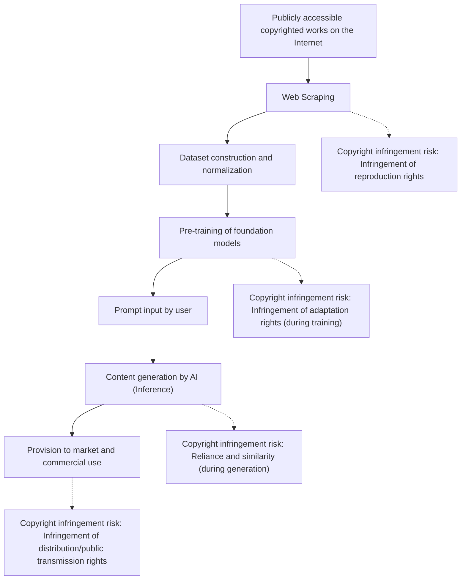
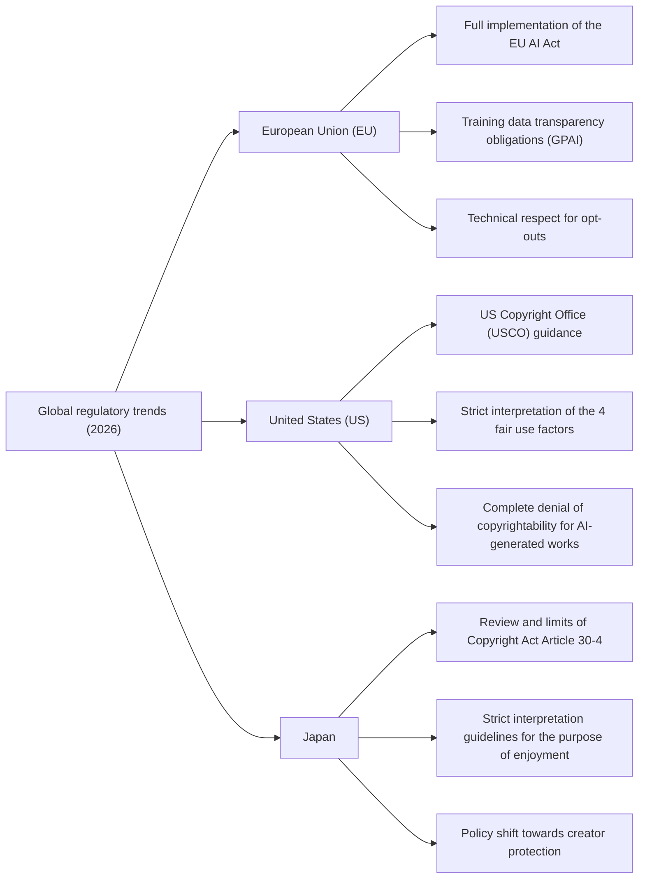
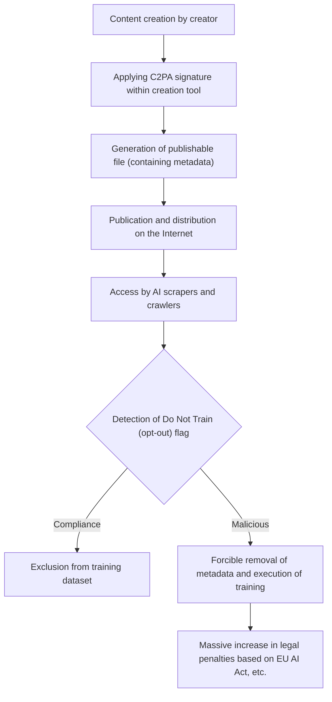

## 1. Introduction: 2026, A New Paradigm Shift in Generative AI and Copyright

As of 2026, the technical evolution of Generative AI has reached a level that fundamentally overturns human creative processes—from text, images, audio, and video, to the automatic generation of 3D models and complex software code. While large language models (LLMs) of the GPT-5 class and next-generation Diffusion models have become established as social infrastructure, debates over the legality of the "Training Data" that supports these AI models and the ownership of rights to the "Generated Content" output by AI have finally transitioned from individual court battles to a phase of national-level legal regulation and international standardization.

Class action lawsuits frequently filed between 2022 and 2024 by creators and major media companies against leading AI development companies are, reaching 2026, beginning to yield some important judicial decisions and settlement frameworks. At the same time, national legislatures have begun casting new regulatory nets to keep pace with the speed of technological evolution. In the modern era, where two conflicting values—the overwhelming economic benefits (productivity improvements) brought by AI technology and the protection of the rights of creators who have nurtured culture until now—clash head-on, it is extremely important for corporate practitioners, engineers, and creators themselves to accurately grasp the legal landscape.

This article provides an extremely detailed explanation from legal and technical perspectives on the global regulatory trends regarding generative AI and copyright as of 2026, technical defense measures on the creator side (data poisoning and provenance proof), and future prospects.

---

## 2. Mechanics of Copyright Infringement: Legal Interpretation and Risks in 3 Phases

To accurately sort out the issues of generative AI and copyright, it is necessary to divide the entire AI lifecycle into three phases: "Training," "Generation," and "Exploitation." In the 2026 legal system, the nature of the rights questioned in each phase has become clarified.

### 2.1. "Reproduction Rights" and "Adaptation Rights" in the Training Phase (Input)
To build a foundation model, it is necessary to collect vast amounts of text, image, and code data on the Internet (web scraping) and use it for AI training. Because copyrighted works are copied to temporary server memory or storage during this dataset construction process, the infringement of "reproduction rights" becomes an issue in principle.

Previously, AI development companies have argued that "this reproduction is for information analysis purposes and is merely mechanical processing, thus legal," or that it "constitutes fair use." However, in the latest court cases and legal academic debates of 2026, the focus is on the nature of the "characteristic expressions" that the AI model extracts from the data.
If an AI model internalizes the "essential characteristics of the expression" of a specific copyrighted work as network weights (parameters) and becomes capable of directly extracting them later (so-called "Overfitting" or "Memorization"), the prevailing view is that this may constitute "Adaptation" beyond mere mechanical information analysis.

### 2.2. "Reliance" and "Similarity" in the Generation Phase (Output)
This is the inference phase where a user inputs a prompt and the AI generates content. If the generated image or text is closely similar to a specific existing copyrighted work, copyright infringement may be established.

The two major requirements for establishing copyright infringement are "reliance" (whether the creator knew of the target copyrighted work and created it relying upon it) and "similarity" (whether the essential characteristics of the expression can be directly perceived).
In the case of AI, unlike human creators, determining the subjective requirement of "whether the AI knew of the work" has long been a challenge. In 2026 judicial decisions, an approach is becoming established whereby "if the fact that the AI model had read the copyrighted work as training data is proven, reliance is strongly inferred (a de facto shift in the burden of proof)." As a result, transparency regarding "what kind of dataset an AI company trained on" now carries extremely important meaning in determining infringement.

### 2.3. Exploitation Phase (User Responsibility and Corporate Indemnity)
This is the phase where users publish, sell, or commercially use generated content. If an AI tool is merely used as a "tool," the direct party committing the copyright infringement is the user who inputted the prompt and published the output.
For enterprise-facing AI services in 2026 (such as Copilot or enterprise versions of image generation AI), it has become an industry standard for AI companies to include "indemnity" (exemption/compensation) clauses that compensate for the user's risk of copyright infringement. However, this is ultimately nothing more than a transfer of risk under a B2B contract, and the act of copyright infringement itself under copyright law is not legalized. It has become essential for user companies to establish internal governance structures to screen whether generated products infringe on the rights of others.

---

## 3. Legal and Regulatory Trends in Major Countries and Regions 2026

Countries around the world are adopting completely different approaches to balance the conflicting national interests of strengthening national competitiveness through AI innovation promotion and protecting creators and copyright holders. Here, we detail and compare the current state of legal regulations in Europe, the US, and Japan as of 2026.

### 3.1. European Union (EU): Full Implementation of the EU AI Act and the Bite of Transparency Requirements
Enacted in 2024 and reaching its full implementation phase in 2026 after a phased transition period, the "EU AI Act" is the world's strictest AI regulatory framework. In the context of copyright, the most significant impacts are the **"transparency obligations"** and **"obligations to comply with EU copyright law"** imposed on providers of General Purpose AI (GPAI) models.

Under the EU AI Act, GPAI providers bear the obligation to publicly release a "sufficiently detailed summary" of the content used to train the AI. As of 2026, the legal granularity of this "sufficiently detailed summary" has been clarified by the Court of Justice of the EU and the European AI Office's guidelines, and abstract descriptions simply stating "We used the public dataset Common Crawl" are now deemed illegal. Strict disclosure is required of a URL list of specific datasets, a list of major domains densely populated with rightsholders, and the data exclusion process (the processing status of opt-outs).

Furthermore, in accordance with the "TDM (Text and Data Mining) Exception" under Article 4 of the Directive on Copyright in the Digital Single Market (DSM Directive) in the EU, if rightsholders opt out of the use of their data for training in a machine-readable manner (such as robots.txt or C2PA, discussed later), AI companies are explicitly obligated to respect this intention technically and systematically, and exclude it from their datasets. If this is violated, there is a risk of massive fines equivalent to a certain percentage of global sales.

### 3.2. United States (US): Redefinition of Fair Use and USCO's Strict Stance
In the United States, the center of the AI industry, the battlefield determining the legality of AI training is not direct AI regulation by statutory law, but rather the doctrine of "Fair Use" defined in Section 107 of the existing Copyright Act.
Triggered by the Supreme Court ruling in the 2023 "Andy Warhol Foundation v. Goldsmith" case, the criteria for determining fair use in the US, particularly the interpretation of the first factor, "the purpose and character of the use (whether it is transformative or not)," have become extremely strict.

In important precedents accumulated at the federal district court level by 2026 (e.g., substantive rulings and settlements in lawsuits like The New York Times v. OpenAI), courts are beginning to show criteria such as:
"If an AI trains from original copyrighted works and has the ability to generate substitutes that directly compete in the market with the original works (for example, news summaries identical to NYT articles or stock photos closely resembling Getty's images), that training behavior causes a direct negative impact on the market (the 4th factor of fair use), and therefore is not protected as fair use overall."

Additionally, the US Copyright Office (USCO) continues to maintain its policy of denying any copyright registration for content autonomously generated by AI, as there is no human "Creative Authorship" present. The latest operational guidance of 2026 has made it clearer that even claims of "utilizing advanced prompt engineering" are nothing more than "giving instructions for an idea (commissioning)" and are not recognized as creative expression under copyright law. To claim copyright for AI output, one must prove that a human added "substantial and creative modifications" to that output (such as extensive retouching in Photoshop or restructuring of a complex composition).

### 3.3. Japan: The End of the "Free Ride Era" of Copyright Act Article 30-4
Japan had been called the "most advantageous country in the world for AI development" due to Article 30-4 (Reproduction, etc., for Information Analysis) introduced by the 2018 amendment to the Copyright Act. This provision was an extremely powerful rights limitation that broadly permitted reproduction for AI training, regardless of whether for-profit or non-profit, and regardless of whether the source data was legally or illegally uploaded (※ however, restrictions on training from pirated versions were added later), as long as it was not for the purpose of "enjoying" the thoughts or sentiments expressed in the work.

However, since 2024, strong backlash arose from creator organizations out of fear that generative AI could directly steal the markets of existing illustrators, voice actors, and authors. Consequently, the Agency for Cultural Affairs and the Copyright Subdivision proceeded with a stricter interpretation of "the purpose of enjoyment."

As of 2026, the latest legal guidelines issued by the Agency for Cultural Affairs present a clear view that the following acts are highly likely to be considered as having "mixed purposes of enjoyment" and thus fall outside the application of Article 30-4 (= in principle, requiring the permission of the copyright holder, and constituting copyright infringement if done without permission):
- The act of intensively scraping and training only on the works of a specific creator to intentionally imitate their art style or voice quality (methods like fine-tuning, LoRA, and additional training).
- The act of registering data into an RAG (Retrieval-Augmented Generation) system designed with the intention of outputting the expressive characteristics of the original copyrighted work as they are.

With this change in interpretation, the era in Japan where "unauthorized learning and free-riding on any data is possible" has virtually come to an end. Japanese companies, like those in the US and Europe, are steering toward procuring clean data with cleared rights.

---

## 4. Historical Significance of Notable International Lawsuits 2024-2026

We organize the current state as of 2026 of major lawsuits that have greatly influenced the formation of legal regulations.

1. **The New York Times v. OpenAI / Microsoft**
   Filed in late 2023, this case became the largest lawsuit symbolizing "Generative AI and Copyright." NYT presented evidence that millions of its articles were trained on without permission and that ChatGPT was outputting nearly memorized versions of NYT articles (Memorization). In 2026, the court issued an interim judgment stating that "the complete reproduction and output of articles by AI does not constitute fair use," and both companies reached a substantive settlement in the form of a massive licensing agreement. This definitively established the industry standard that "news content AI training should be paid."

2. **Getty Images v. Stability AI**
   A lawsuit against the developer of the image generation AI "Stable Diffusion." The fact that Getty's watermarks were output directly onto AI-generated images was presented as decisive evidence of unauthorized training. As a result of parallel lawsuits in the UK and the US, a landmark ruling was handed down in 2026 stating that "the act of intentionally removing or circumventing watermarks for training constitutes circumvention of technological protection measures under the Digital Millennium Copyright Act (DMCA)," and severe penalties were imposed on the AI company.

3. **GitHub Copilot Litigation (Doe v. GitHub)**
   A lawsuit against Copilot, which was trained on open-source software (OSS) code. The point of contention was that it outputted code while ignoring the "Attribution" obligation required by OSS licenses (like MIT and GPL). As of 2026, AI development tools are legally required to be equipped with a function (filtering and attribution system) that detects in real-time whether the outputted code matches existing OSS code and attaches license information.

---

## 5. Self-Defense Measures for Authors: The Evolution of Opt-out Technology and C2PA

It takes time to establish legal regulations, and it is difficult to completely control the activities of AI companies crossing national borders. Therefore, creators and publishers are accelerating movements to proactively protect their own copyrighted works using technological means.

### 5.1. robots.txt and TDM Opt-out Protocols
The `robots.txt` file, placed in the root directory of a website, is originally a protocol for controlling search engine crawlers, but in 2026, it has become established as a standard means to uniformly block AI training crawlers (e.g., OpenAI's `GPTBot`, Google's `Google-Extended`, Anthropic's `ClaudeBot`).
However, `robots.txt` has no legal binding force and has a fundamental flaw in that it can be easily ignored by malicious rogue scrapers. Therefore, standardization (such as W3C TDM Rep) has spread globally to embed the intention of TDM (Text and Data Mining) opt-out directly into HTTP headers or HTML meta tags (e.g., `<meta name="tdm-reservation" content="1">`) to give it legal effect in a machine-readable form. Under the EU AI Act, scraping that ignores this meta tag is treated as a clear illegal act.

### 5.2. C2PA and Native Implementation of Content Provenance Authentication
**C2PA (Coalition for Content Provenance and Authenticity)** is a technical standard that attaches cryptographically signed, tamper-proof "provenance metadata" to digital content such as images, videos, and audio. In 2026, C2PA is natively implemented in major digital cameras (Sony, Leica, Nikon, etc.), image editing software (such as Adobe Photoshop), and even standard camera apps on iOS and Android.

A C2PA manifest (provenance information) can include a clear flag stating "This image must not be used as training data for AI (Do Not Train: DNT)." Conversely, an AI-generated mark stating "This image was generated by AI" is also attached, thus functioning as both a countermeasure against deepfakes and copyright protection. The intentional act of stripping metadata is subject to penalties under copyright laws around the world as the "removal of rights management information."

---

## 6. Technical Countermeasures: The Mechanics of Data Poisoning (Glaze, Nightshade)

The most widely adopted "powerful and physical countermeasure" by creators in 2026 against AI companies that ignore even legal regulations and opt-out declarations is "Data Poisoning" technology. These technologies, typified by **Glaze** and **Nightshade** developed by a research team at the University of Chicago, are aggressive and active defense methods that mathematically destroy the AI training process itself.

### 6.1. Mathematical Model of Adversarial Perturbation
AI models (especially CNNs in image recognition and Diffusion models in generation) do not view images "visually" in the same way humans do, but process them as numerical vectors in a high-dimensional Latent Space. Data poisoning intentionally misleads the AI model's encoder by adding minute noise (adversarial perturbation) at the pixel level that goes completely unnoticed by the human eye.

Expressed as a formula, this is defined as the following optimization problem:

$$ \min_{\delta} \mathcal{L}(f(x+\delta), y_{target}) $$

$$ \text{subject to } ||\delta||_p < \epsilon $$

Where:
- $x$ is the original clean image (e.g., an image of a "beautiful landscape")
- $\delta$ is the minute noise (perturbation vector) added to the image
- $f$ is the AI's feature extractor (encoder)
- $y_{target}$ is the target concept to mislead the AI into recognizing (e.g., "noisy garbage" or a "completely different object")
- $\mathcal{L}$ is the loss function
- $\epsilon$ is the upper limit threshold (L-p norm) to ensure the noise is not perceived by human vision

The poisoning tool solves this optimization problem on the creator's PC, "poisons" the image, and then outputs it.

### 6.2. Glaze (Protection of Style and Art Style)
Glaze is a tool designed to protect a creator's unique "Style." For example, if Glaze is applied to a delicate watercolor illustration, it will still look like a watercolor to the human eye. However, the AI's encoder $f$, due to the effect of the added perturbation $\delta$, will perceive and learn that image as a vector of a "thickly painted oil painting" or "abstract cubism."
As a result, even if you give a prompt to an AI model trained on these poisoned images asking it to "generate in the style of (that creator)," the mapping in the latent space is distorted, and it will output a completely different, garbled style. This physically neutralizes the creation of "copy models of a specific creator's style (such as LoRA)" by AI companies.

### 6.3. Nightshade (Destruction of Concepts and Model Collapse)
Nightshade is even more aggressive than Glaze, aiming to contaminate and destroy the "Concepts" themselves within the AI model.
For example, Nightshade is applied to an image of a "dog," causing the AI to learn it as a "cat." It has been proven that if only a few hundred to a few thousand images with such Prompt-Specific Poisoning are mixed into a dataset, the concept alignment of an entire large foundation model will collapse.
In a model contaminated by Nightshade, when a user instructs the AI to "generate a cute picture of a dog," the AI will output an image of a bizarre cat with four legs or a completely meaningless texture.

In 2026, it has become standardized that when creators upload images to social media or portfolio sites, these poisoning processes are automatically performed in the background via browser extensions or decentralized protocols. This makes the technical risk of AI companies "indiscriminately scraping images from the Internet" (the risk of a model that cost millions of dollars to train collapsing in an instant) extremely high, powerfully acting as a deterrent to unauthorized training.

---

## 7. Strategic Shift of Generative AI Companies: Clean Data, Licenses, and Synthetic Data

Faced with stricter legal regulations, the risk of losing copyright infringement lawsuits, and the threat of data poisoning technologies like Nightshade, AI development companies as of 2026 are being forced to undergo a massive shift in their AI development paradigms and business models.

### 7.1. Return to Clean Datasets and the Struggle for Hegemony
The past Silicon Valley approach of "Move fast and break things" — scraping all data on the Internet without permission to create massive datasets (lawless datasets like LAION-5B) — has reached its limit.
Instead, the value of "clean datasets" where copyrights have been completely cleared and opt-out processing is perfected has skyrocketed astronomically. Companies like Adobe (Firefly), Getty Images, and Shutterstock, which possess vast amounts of licensed content in-house, have established an overwhelming dominance in the enterprise market by touting "zero copyright infringement risk."

### 7.2. Massive Licensing Deals and Revenue Share Models
It has become commonplace for major AI vendors (OpenAI, Google, Anthropic, Meta, etc.) to sign data licensing agreements worth tens of millions of dollars annually with media companies (The New York Times, Reddit, News Corp, etc.), stock photo services, major publishers, and even music labels.
Furthermore, the construction of "revenue share models" is progressing, where subscription revenues and API usage fees obtained from AI-generated content are returned to the original creators who provided the training data. Through smart contracts combining blockchain/Web3 technologies and C2PA, social implementation experiments are actively taking place for systems that calculate which creator's data the AI "relied on" for its output based on their contribution, and automatically distribute rewards via micropayments.

### 7.3. Reliance on Synthetic Data and the Dilemma of "Model Collapse"
Facing a phenomenon where human data is legally or physically (via poisoning) exhausted—the so-called "Data Wall"—AI companies have intensified their approach of self-training next-generation AI models using data generated by the AI itself (Synthetic Data).
However, it has been mathematically and statistically proven that repeating recursive training solely on synthetic data leads to a loss of data diversity, truncation of minority characteristics, and eventually a phenomenon called "Model Collapse" where the final output quality of the model degrades fatally.
Ultimately, the paradox became clear: the continuous supply of "high-quality, original data newly created by humans" is indispensable for AI to continue evolving, and if creators are exploited and driven to extinction, AI technology itself will fall into an evolutionary dead end.

---

## 8. Outlook for 2030 and Conclusion

The year 2026 will be remembered in history as a monumental year marking the complete end of the "frontier period of lawlessness" for generative AI, and the entry into the "construction period of a new Social Contract" for law, technology, and human creativity to coexist.

### Important Agendas to Solve in the Future
1. **Achieving International Legal Harmonization**: How to integrate the differing regulatory approaches of the EU (strict transparency), the US (focus on market impact based on fair use), and Japan (strictness regarding the purpose of enjoyment) to ensure legal certainty for global AI business. Updates at the international treaty level are urgently needed.
2. **Creation of "New Rights" in the AI Era**: The debate over whether to create new rights specific to machine learning (e.g., "data access/ingest rights" or "training remuneration claim rights") for AI machine learning processes that cannot be fully captured by the traditional concepts of "reproduction and adaptation."
3. **Redefining Human Creativity and "Proof of Humanity"**: In an era where AI can instantaneously create anything with quality surpassing humans, how much economic and cultural premium will be attached to the very fact that "a human created it with human soul (Proof of Humanity)"? Just as handmade crafts increased in value during the industrial age, the brand value of human art is being redefined.

It is impossible to turn back the clock on the evolution of AI technology. However, taming this mighty technology and controlling it so as not to destroy the ecosystem of creators who have nurtured human culture and art for thousands of years depends on the wisdom of law, computer science, and society as a whole.

Towards 2030, instead of AI and creators being hostile and fighting over the pie, the establishment of a "new digital economy" where they can co-create with fair compensation and respect, expanding human creativity, is now strongly demanded.
