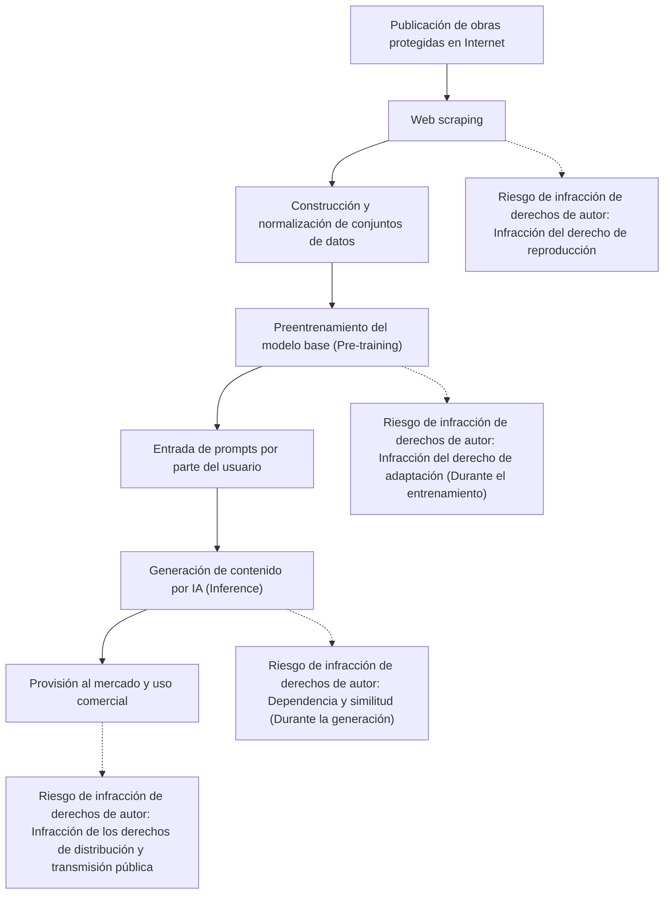
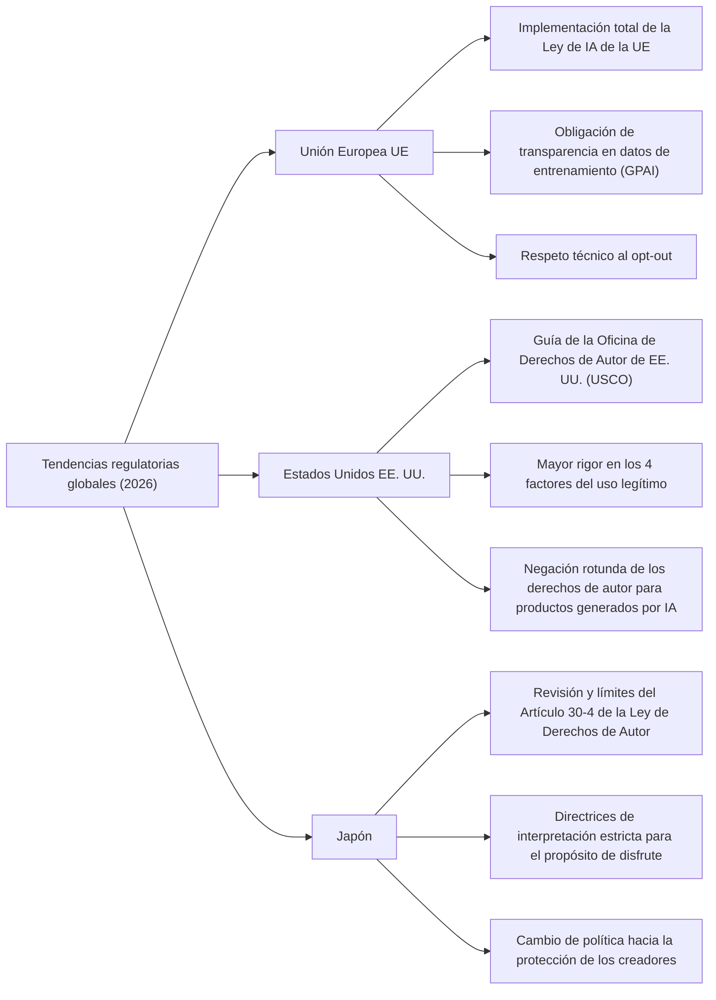
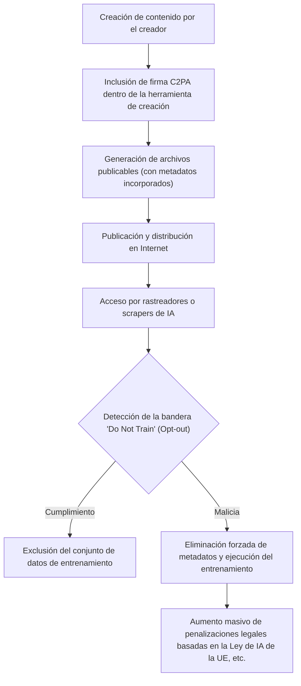

## 1. Introducción: 2026, un nuevo cambio de paradigma en la IA generativa y los derechos de autor

En 2026, la evolución técnica de la IA generativa (Generative AI) ha alcanzado un nivel que altera fundamentalmente los procesos creativos de la humanidad, desde la generación automática de texto, imágenes, audio y video, hasta modelos 3D y códigos de software complejos. Mientras que los grandes modelos de lenguaje (LLM) de la clase GPT-5 y los modelos de difusión de próxima generación se han consolidado como infraestructura social, el debate sobre la legalidad de los "datos de entrenamiento" (Training Data) que sustentan estos modelos de IA, y la titularidad de los derechos del "contenido generado" (Generated Content) producido por la IA, ha pasado finalmente de las disputas individuales en los tribunales a una fase de regulación legal a nivel nacional y estandarización internacional.

Las demandas colectivas (class actions) presentadas por creadores y grandes empresas de medios contra las principales empresas de desarrollo de IA, que fueron frecuentes entre 2022 y 2024, están comenzando a generar decisiones judiciales importantes y marcos de acuerdo para el año 2026. Al mismo tiempo, las legislaturas de varios países han comenzado a establecer nuevas redes regulatorias para mantenerse al día con la velocidad de evolución de la tecnología. En la era actual, donde los abrumadores beneficios económicos (mejora de la productividad) que trae la tecnología de IA chocan frontalmente con la protección de los derechos de los creadores que han fomentado la cultura hasta ahora, es extremadamente importante que los profesionales de las empresas, los ingenieros y los propios creadores comprendan con precisión el panorama legal.

En este artículo, explicaremos con gran detalle desde perspectivas legales y técnicas, las tendencias mundiales en regulación legal sobre la IA generativa y los derechos de autor a partir de 2026, las medidas técnicas de defensa del lado de los creadores (envenenamiento de datos y prueba de procedencia), y las perspectivas futuras.

---

## 2. El mecanismo de la infracción de derechos de autor: interpretación legal y riesgos en 3 fases

Para organizar con precisión el problema de la IA generativa y los derechos de autor, es necesario dividir todo el ciclo de vida de la IA en tres fases: "Entrenamiento" (Training), "Generación" (Generation) y "Explotación" (Exploitation). En el sistema legal de 2026, se ha aclarado la naturaleza de los derechos en cuestión en cada fase.

### 2.1. El "derecho de reproducción" y el "derecho de adaptación" en la fase de entrenamiento (input)
Para construir un modelo base, es necesario recopilar cantidades masivas de datos de texto, imágenes y código en Internet (web scraping) y utilizarlos para entrenar a la IA. Dado que las obras protegidas por derechos de autor se copian en la memoria temporal y el almacenamiento del servidor durante este proceso de construcción del conjunto de datos, la infracción del "derecho de reproducción" se convierte en un problema en principio.

Tradicionalmente, las empresas de desarrollo de IA han argumentado que "esta reproducción tiene el propósito de análisis de información y es legal porque es simplemente un procesamiento mecánico" o que "está sujeta al uso legítimo (fair use)". Sin embargo, en la jurisprudencia más reciente y en los debates de la comunidad jurídica de 2026, la atención se centra en la naturaleza de las "representaciones de características" que los modelos de IA extraen de los datos.
Existe una opinión cada vez más fuerte de que si un modelo de IA internaliza las "características esenciales expresivas" de una obra específica como pesos de red (parámetros) en un estado en el que pueden extraerse intactas posteriormente (el llamado "sobreajuste" (Overfitting) o "memorización" (Memorization)), esto excede el mero análisis mecánico de información y podría considerarse una "adaptación" (Adaptation).

### 2.2. "Dependencia" y "similitud" en la fase de generación (output)
Esta es la fase de inferencia en la que el usuario introduce un prompt y la IA genera el contenido. Si la imagen o el texto generado aquí es extremadamente similar a una obra protegida específica existente, podría constituir una infracción de los derechos de autor.

Los dos requisitos principales para que se establezca una infracción de los derechos de autor son la "dependencia" (si el creador conocía la obra objetivo y se basó en ella para crearla) y la "similitud" (si las características esenciales de la expresión se pueden percibir directamente).
En el caso de la IA, a diferencia de los creadores humanos, determinar el requisito subjetivo de "si la IA conocía esa obra" fue un desafío durante mucho tiempo. En las decisiones judiciales de 2026, se está arraigando el enfoque de que "si se demuestra el hecho de que el modelo de IA había leído la obra en cuestión como datos de entrenamiento, se presume fuertemente la dependencia (una inversión de facto de la carga de la prueba)". Como resultado, la transparencia sobre "con qué conjuntos de datos se entrenó" por parte de las empresas de IA ha cobrado un significado sumamente importante a la hora de determinar las infracciones.

### 2.3. Fase de uso (responsabilidad del usuario e indemnización empresarial)
Esta es la fase en la que los usuarios publican, venden y hacen uso comercial del contenido generado. Si la herramienta de IA se utilizó simplemente como una "herramienta", el sujeto directo de la infracción de los derechos de autor es el usuario que introdujo el prompt y publicó el resultado.
En los servicios de IA orientados a empresas en 2026 (como Copilot o las versiones empresariales de IA generativa de imágenes), se ha convertido en un estándar de la industria que las empresas de IA incluyan cláusulas de "indemnidad" (exención de responsabilidad y compensación) para cubrir los riesgos de infracción de derechos de autor de los usuarios. Sin embargo, esto es meramente una transferencia de riesgo contractual B2B y no legaliza el acto de infracción en sí bajo la ley de derechos de autor. Es obligatorio que las empresas usuarias establezcan sistemas de gobernanza interna para evaluar si el contenido generado infringe los derechos de terceros.

---

## 3. Tendencias de regulación legal en los principales países y regiones en 2026

Países de todo el mundo han adoptado enfoques completamente diferentes para equilibrar los intereses nacionales en conflicto: el fortalecimiento de la competitividad nacional a través de la promoción de la innovación en IA y la protección de los creadores y titulares de derechos de autor. Aquí comparamos y analizamos en detalle el estado actual de la regulación legal en Europa, EE. UU. y Japón en 2026.

### 3.1. Unión Europea (UE): Implementación total de la Ley de IA de la UE y los colmillos de los requisitos de transparencia
La "Ley de IA de la UE" (EU AI Act), aprobada en 2024 y que ha alcanzado la fase de implementación total en 2026 tras un período de transición gradual, es el marco regulatorio de IA más estricto del mundo. En el contexto de los derechos de autor, el impacto más significativo proviene de la **"obligación de transparencia"** y la **"obligación de cumplir con la ley de derechos de autor de la UE"** impuestas a los desarrolladores de modelos de IA de propósito general (GPAI: General Purpose AI).

Bajo la Ley de IA de la UE, los proveedores de GPAI están obligados a publicar públicamente un "resumen suficientemente detallado" (Sufficiently detailed summary) del contenido utilizado para entrenar la IA. A partir de 2026, la granularidad legal de este "resumen suficientemente detallado" ha sido clarificada por el Tribunal de Justicia de la UE y las directrices de la Oficina Europea de IA (AI Office), y las descripciones abstractas como "usamos Common Crawl, un conjunto de datos público" ahora se consideran ilegales. Se exige estrictamente la divulgación de una lista específica de URLs de conjuntos de datos, una lista de dominios principales con alta densidad de titulares de derechos de autor y el proceso de exclusión de datos (estado de procesamiento del opt-out).

Además, de conformidad con la "Excepción de TDM (Minería de Textos y Datos)" establecida en el Artículo 4 de la Directiva de Derechos de Autor en el Mercado Único Digital de la UE (Directiva DSM), si los titulares de derechos optan por excluir el uso de sus datos de entrenamiento de manera legible por máquina (como robots.txt y C2PA, que se discutirán más adelante), se ha estipulado expresamente la obligación de las empresas de IA de respetar esta voluntad técnica y sistemáticamente, y excluirlos de los conjuntos de datos. La violación de esto conlleva el riesgo de multas masivas equivalentes a un cierto porcentaje de los ingresos globales.

### 3.2. Estados Unidos (EE. UU.): Redefinición del uso legítimo (fair use) y la postura estricta de la USCO
En Estados Unidos, el centro de la industria de la IA, el campo de batalla que determina la legalidad del entrenamiento de IA no es la regulación directa de IA por ley estatutaria, sino la doctrina del "uso legítimo" (Fair Use) establecida en la Sección 107 de la ley de derechos de autor existente.
A raíz de la decisión de la Corte Suprema en el caso "Andy Warhol Foundation v. Goldsmith" en 2023, los criterios para determinar el uso legítimo en EE. UU., especialmente la interpretación del primer factor sobre "el propósito y carácter del uso (si es un uso transformativo o no)", se han vuelto extremadamente estrictos.

En importantes precedentes a nivel de tribunales federales de distrito acumulados hasta 2026 (por ejemplo, veredictos sustanciales y acuerdos como la demanda de The New York Times contra OpenAI), los tribunales han comenzado a establecer los siguientes estándares:
"Si una IA aprende de una obra original y posee la capacidad de generar un sustituto que compita directamente con la obra original en el mercado (por ejemplo, resúmenes de noticias idénticos a los artículos del NYT, o fotos de archivo extremadamente similares a las imágenes de Getty), el acto de entrenamiento causa un impacto adverso directo en el mercado (cuarto factor del uso legítimo) y, por lo tanto, no está protegido como uso legítimo en su totalidad."

Además, la Oficina de Derechos de Autor de los Estados Unidos (USCO) ha mantenido su política de no permitir el registro de derechos de autor para el contenido generado autónomamente por IA, ya que carece de "autoría creativa" (Creative Authorship) por parte de un humano. En la guía operativa más reciente de 2026, se aclaró aún más que incluso afirmaciones de "usar ingeniería de prompts avanzada" son simplemente "dar instrucciones para una idea (encargo)" y no se reconocen como expresión creativa bajo la ley de derechos de autor. Para reclamar derechos de autor sobre una salida de IA, es necesario demostrar que un humano agregó una "modificación sustancial y creativa (como un retoque extenso en Photoshop o la reestructuración de una composición compleja)" a esa salida.

### 3.3. Japón: El fin de la "era del viaje gratis" (free ride) del Artículo 30-4 de la Ley de Derechos de Autor
Japón ha sido llamado "el país más favorable del mundo para el desarrollo de la IA" debido al Artículo 30-4 (Reproducción, etc. para el Análisis de Información), introducido por la revisión de la Ley de Derechos de Autor de 2018. Esta disposición era una limitación de derechos extremadamente poderosa que permitía ampliamente la reproducción para el entrenamiento de IA, independientemente de si el propósito era comercial o no, e independientemente de si los datos de origen de la reproducción se cargaron legal o ilegalmente (*sin embargo, más tarde se añadieron restricciones al entrenamiento con versiones piratas*), siempre y cuando el propósito no fuera el "disfrute" de los pensamientos o sentimientos expresados en la obra.

Sin embargo, desde 2024, surgió una fuerte reacción por parte de organizaciones de creadores debido al temor de que la IA generativa pudiera usurpar directamente los mercados de ilustradores, actores de doblaje y escritores existentes, y la Agencia de Asuntos Culturales y el Subcomité de Derechos de Autor procedieron a hacer más estricta la interpretación del "propósito de disfrute".

A partir de 2026, las últimas directrices legales emitidas por la Agencia de Asuntos Culturales presentan una opinión clara de que las siguientes acciones se consideran que tienen "propósitos de disfrute mezclados", y es muy probable que queden fuera de la aplicación del Artículo 30-4 (= en principio se requiere el permiso del titular de los derechos de autor, y realizarlo sin permiso es una infracción de los derechos de autor):
- El acto de raspar (scraping) y entrenar intensivamente solo con las obras de un creador específico con el fin de imitar intencionalmente el estilo de arte o las características de la voz de ese creador (métodos como ajuste fino (fine-tuning), LoRA, entrenamiento adicional).
- El acto de registrar bases de datos en un sistema RAG (Generación Aumentada por Recuperación) diseñado con la intención de emitir las características expresivas de la obra original tal como están.

Con este cambio de interpretación, la era en Japón en la que "el viaje gratis (free ride) del entrenamiento no autorizado es posible con cualquier dato" ha llegado de facto a su fin. Las empresas japonesas, al igual que las de Europa y EE. UU., han cambiado el rumbo hacia la adquisición de datos limpios con derechos procesados.

---

## 4. El significado histórico de las demandas internacionales destacadas entre 2024 y 2026

Resumimos el estado actual a 2026 de las principales demandas que han tenido un profundo impacto en la formación de la regulación legal.

1. **The New York Times v. OpenAI / Microsoft**
   Este caso, presentado a finales de 2023, se ha convertido en la demanda más grande que simboliza la "IA generativa y los derechos de autor". El NYT presentó pruebas de que millones de sus artículos fueron entrenados sin permiso y que ChatGPT estaba generando artículos del NYT de memoria casi exacta (Memorization). En 2026, el tribunal emitió una decisión provisional declarando que "la reproducción y generación completa de artículos por parte de la IA no constituye uso legítimo", y ambas partes llegaron a un acuerdo sustancial mediante la firma de un masivo contrato de licencia. Esto determinó el estándar de la industria de que "el entrenamiento de IA en contenido de noticias debe ser remunerado".

2. **Getty Images v. Stability AI**
   Una demanda contra el desarrollador de la IA generativa de imágenes "Stable Diffusion". El hecho de que la marca de agua de Getty saliera tal cual en imágenes generadas por IA se presentó como prueba concluyente de entrenamiento no autorizado. Como resultado de demandas paralelas en el Reino Unido y los EE. UU., se dictó un fallo histórico en 2026 afirmando que "el acto de eliminar o eludir intencionalmente marcas de agua para entrenar se clasifica como una elusión de medidas tecnológicas de protección bajo la Ley de Derechos de Autor del Milenio Digital (DMCA)", y se impusieron penas severas a la empresa de IA.

3. **GitHub Copilot Litigation (Doe v. GitHub)**
   Una demanda contra Copilot, que fue entrenado con código de software de código abierto (OSS). El punto de disputa fue que emitía código ignorando la "obligación de atribución de derechos de autor" requerida por las licencias OSS (como MIT o GPL). A partir de 2026, existe una tendencia a exigir legalmente que las herramientas de desarrollo de IA incorporen funciones (sistemas de filtrado y atribución) que detecten en tiempo real si el código emitido coincide con el código OSS existente y adjunten la información de la licencia correspondiente.

---

## 5. Medios de autodefensa del autor: La evolución de las tecnologías de opt-out y C2PA

La creación de normativas legales lleva tiempo y es difícil controlar completamente las actividades de las empresas de IA que cruzan fronteras. Por lo tanto, los creadores y editores están acelerando el movimiento para proteger proactivamente sus propias obras mediante medios técnicos.

### 5.1. robots.txt y el protocolo de opt-out de TDM
El archivo `robots.txt` colocado en el directorio raíz de un sitio web es originalmente un protocolo para controlar los rastreadores de motores de búsqueda, pero en 2026 se ha consolidado como un medio estándar para bloquear uniformemente los rastreadores de entrenamiento de IA (por ejemplo, `GPTBot` de OpenAI, `Google-Extended` de Google, `ClaudeBot` de Anthropic).
Sin embargo, `robots.txt` carece de fuerza vinculante legal y tiene un defecto fundamental: los rastreadores maliciosos pueden ignorarlo fácilmente. Por esta razón, se ha extendido globalmente la estandarización (como W3C TDM Rep) para incrustar la intención de opt-out de TDM (Text and Data Mining) directamente en los encabezados HTTP o en etiquetas meta HTML (por ejemplo, `<meta name="tdm-reservation" content="1">`) para darle validez legal de una manera legible por máquina. Bajo la Ley de IA de la UE, si se realiza un web scraping ignorando esta etiqueta meta, se trata como un acto explícitamente ilegal.

### 5.2. C2PA y la implementación nativa de la autenticación de procedencia del contenido
**C2PA (Coalition for Content Provenance and Authenticity)** es un estándar técnico para adjuntar "metadatos de procedencia" inalterables firmados criptográficamente a contenido digital como imágenes, videos y audio. En 2026, C2PA se ha implementado de forma nativa en las principales cámaras digitales (Sony, Leica, Nikon, etc.), software de edición de imágenes (Adobe Photoshop, etc.), e incluso en aplicaciones de cámara estándar de iOS y Android.

El manifiesto de C2PA (información de procedencia) puede incluir una bandera clara que indique "Esta imagen no debe usarse como datos de entrenamiento para la IA (Do Not Train: DNT)". Además, y por el contrario, también se añade una marca de generación por IA que indica "Esta imagen fue generada por IA", sirviendo de este modo como doble propósito para la lucha contra las falsificaciones profundas (deepfakes) y la protección de los derechos de autor. El acto de despojar (stripping) intencionalmente de metadatos está sujeto a sanciones como "eliminación de información de gestión de derechos" bajo las leyes de derechos de autor de varios países.

---

## 6. Medidas técnicas de contrarresto: El mecanismo de envenenamiento de datos (Glaze, Nightshade)

La tecnología de "envenenamiento de datos" (Data Poisoning) se ha extendido ampliamente en 2026 como la "contramedida física más poderosa" de los creadores contra las empresas de IA que ignoran la regulación legal e incluso las intenciones de opt-out. Estas tecnologías, representadas por **Glaze** y **Nightshade**, desarrolladas por el equipo de investigación de la Universidad de Chicago, son métodos de defensa ofensivos y proactivos que destruyen matemáticamente el propio proceso de entrenamiento de la IA.

### 6.1. El modelo matemático de la perturbación adversaria (Adversarial Perturbation)
Los modelos de IA (especialmente las CNN en reconocimiento de imágenes y los modelos de difusión en generación) no observan "visualmente" las imágenes como lo hacen los humanos, sino que las procesan como vectores numéricos en un espacio latente (Latent Space) de alta dimensión. El envenenamiento de datos añade una pequeña cantidad de ruido (perturbación adversaria) a nivel de píxeles en una imagen, el cual es completamente indetectable para el ojo humano, para inducir intencionalmente un error en el codificador (encoder) del modelo de IA.

Matemáticamente, se define como un problema de optimización como el siguiente:

$$ \min_{\delta} \mathcal{L}(f(x+\delta), y_{target}) $$

$$ \text{subject to } ||\delta||_p < \epsilon $$

Donde:
- $x$ es la imagen limpia original (por ejemplo, una imagen de un "hermoso paisaje")
- $\delta$ es el pequeño ruido (vector de perturbación) que se agregará a la imagen
- $f$ es el extractor de características (codificador) de la IA
- $y_{target}$ es el concepto objetivo que queremos que la IA perciba erróneamente (por ejemplo, "basura llena de ruido" o "un objeto completamente diferente")
- $\mathcal{L}$ es la función de pérdida
- $\epsilon$ es el umbral superior para que el ruido no sea perceptible por la visión humana (Norma L-p)

La herramienta de envenenamiento resuelve este problema de optimización en el PC del creador, y genera la imagen "envenenada".

### 6.2. Glaze (Protección del estilo y técnica artística)
Glaze es una herramienta para proteger el "estilo artístico" (Style) único del creador. Por ejemplo, si aplicamos Glaze a una delicada ilustración con estilo de acuarela, a los ojos humanos seguirá pareciendo una pintura en acuarela. Sin embargo, debido a la influencia de la perturbación $\delta$ aplicada, el codificador de IA $f$ reconocerá la imagen como un vector de "pintura al óleo con empaste grueso" o de "cubismo abstracto" y aprenderá de ella.
Como resultado, si proporcionas un prompt diciendo "genera algo en el estilo de (ese creador)" al modelo de IA entrenado con estas imágenes envenenadas, el mapeo en el espacio latente estará distorsionado, causando que se generen estilos caóticos completamente diferentes. Así, se desactiva físicamente la capacidad de las empresas de IA para crear "modelos que copien el estilo de un creador específico (como LoRA)".

### 6.3. Nightshade (Destrucción de conceptos y colapso del modelo)
Nightshade es aún más ofensivo que Glaze, con el objetivo de contaminar y destruir los propios "conceptos" (Concepts) del modelo de IA.
Por ejemplo, se aplica Nightshade a una imagen de un "perro" y se obliga a la IA a aprenderla como un "gato". Se ha demostrado que basta con la mezcla de solo unos cientos a unos miles de imágenes sometidas a este tipo de envenenamiento específico de prompt (Prompt-Specific Poisoning) dentro de un conjunto de datos para que colapse por completo el alineamiento conceptual de todo un modelo base a gran escala.
En un modelo contaminado por Nightshade, si un usuario indica a la IA que "genere la imagen de un lindo perro", la IA producirá la imagen de un gato extraño de cuatro patas o texturas completamente incomprensibles.

En 2026, se ha estandarizado que cuando los creadores cargan imágenes a las redes sociales o sitios de portafolios, el procesamiento de envenenamiento se realice automáticamente en segundo plano a través de extensiones de navegador o protocolos descentralizados. Esto hace que el riesgo técnico de que las empresas de IA "raspen imágenes indiscriminadamente en Internet" sea abrumadoramente alto (el riesgo de que los modelos que han costado millones de dólares entrenar colapsen al instante) y, en consecuencia, funciona con fuerza como disuasivo contra el entrenamiento no autorizado.

---

## 7. El cambio estratégico de las empresas de IA generativa: Datos limpios, licencias y datos sintéticos

Al enfrentarse al endurecimiento de las regulaciones legales, el riesgo de perder litigios por infracción de derechos de autor y la amenaza de las tecnologías de envenenamiento de datos como Nightshade, las empresas de desarrollo de IA a partir de 2026 se han visto forzadas a realizar un cambio a gran escala en los paradigmas y modelos de negocio de desarrollo de IA.

### 7.1. El retorno a los conjuntos de datos limpios y la lucha por la hegemonía
El enfoque tipo Silicon Valley del pasado, "Muévete rápido y rompe cosas" (Move fast and break things), es decir, raspar todos los datos de Internet sin permiso para construir conjuntos de datos masivos (conjuntos de datos de zonas sin ley como LAION-5B), ya ha alcanzado su límite.
En su lugar, el valor de los "conjuntos de datos limpios", cuyos derechos de autor están completamente aclarados y donde el proceso de opt-out se ha completado perfectamente, se ha disparado astronómicamente. Empresas que poseen grandes cantidades de contenido licenciado internamente, como Adobe (Firefly), Getty Images y Shutterstock, han establecido una abrumadora superioridad en el mercado empresarial al promocionar el "riesgo cero de infracción de derechos de autor".

### 7.2. Contratos de licencias masivos y el modelo de reparto de ingresos (revenue share)
Se ha vuelto común que los principales proveedores de IA (OpenAI, Google, Anthropic, Meta, etc.) firmen contratos de licencias de datos valorados en cientos de millones de dólares al año con empresas de medios (The New York Times, Reddit, News Corp, etc.), servicios de fotografías de archivo, importantes editoriales e incluso sellos musicales.
Además, está progresando la construcción de un "modelo de reparto de ingresos", en el que los ingresos por suscripción o tarifas de uso de API obtenidos a través del contenido generado por IA se devuelven a los creadores originales que proporcionaron los datos de entrenamiento. Se están realizando activamente experimentos de implementación social de sistemas que utilizan contratos inteligentes combinando tecnología blockchain/Web3 y C2PA para calcular en base a la contribución de qué datos de creadores ha "dependido" la IA para su salida, distribuyendo recompensas automáticamente a través de micropagos.

### 7.3. La dependencia de los datos sintéticos (Synthetic Data) y el dilema del "colapso del modelo"
Al enfrentarse al agotamiento legal o físico (a través del envenenamiento) de datos humanos, un fenómeno conocido como la "pared de datos" (Data Wall), las empresas de IA han impulsado seriamente enfoques en los que los modelos de IA de próxima generación se autoentrenan utilizando datos generados por la propia IA (datos sintéticos: Synthetic Data).
Sin embargo, se ha demostrado que si el entrenamiento recursivo se repite solo con datos sintéticos, ocurre un fenómeno matemático y estadístico conocido como "Colapso del Modelo" (Model Collapse), donde la calidad de la salida del modelo se deteriora fatalmente porque se pierde la diversidad de los datos y se descartan las características minoritarias.
Al final, para que la IA siga evolucionando, es indispensable el suministro continuo de "datos originales y de alta calidad creados recientemente por humanos". Ha quedado claro que si se explota a los creadores hasta su extinción, la propia tecnología de IA se encontraría en un callejón sin salida evolutivo, revelando así una gran paradoja.

---

## 8. Perspectivas hacia 2030 y resumen

El año 2026 será recordado en la historia como un año monumental en el que el "período de colonización de las zonas sin ley" de la IA generativa llegó completamente a su fin, dando paso al "período de construcción de un nuevo contrato social" (Social Contract) para que la ley, la tecnología y la creatividad humana puedan coexistir.

### Agendas importantes que se deben resolver en el futuro
1. **Lograr la armonización legal internacional**: ¿Cómo integrar los diferentes enfoques regulatorios de la UE (estricta transparencia), los EE. UU. (énfasis en el impacto de mercado bajo el uso legítimo) y Japón (endurecimiento del propósito de disfrute) para asegurar la certidumbre legal para los negocios globales de IA? Las actualizaciones a nivel de tratados internacionales son urgentemente necesarias.
2. **Creación de "nuevos derechos" en la era de la IA**: El debate sobre si se deben crear nuevos derechos específicamente adaptados al aprendizaje automático (por ejemplo, "derechos de acceso/ingestión de datos" o "derechos a reclamar remuneración por entrenamiento") para los procesos de aprendizaje automático de la IA que no pueden abarcarse con los conceptos tradicionales de "reproducción y adaptación".
3. **Redefinición de la creatividad humana y "Prueba de Humanidad" (Proof of Humanity)**: En una era en la que la IA puede crear cualquier cosa en un instante con una calidad que supera la humana, ¿cuánta prima económica y cultural se adjuntará al mero hecho de que "un humano lo creó con el alma humana" (Proof of Humanity)? Así como las artesanías hechas a mano aumentaron de valor en la era industrial, el valor de marca del arte humano está siendo redefinido.

Es imposible retroceder las manecillas del reloj en la evolución de la tecnología de la IA. Sin embargo, domar esa poderosa tecnología y controlarla para no destruir el ecosistema de los creadores, quienes han fomentado la cultura y el arte de la humanidad durante miles de años, depende de la jurisprudencia, las ciencias de la computación y la sabiduría de toda la sociedad.

De cara a 2030, existe actualmente una fuerte demanda por el establecimiento de una "nueva esfera económica digital" donde la IA y los creadores no sean adversarios que compitan por el mismo pastel, sino que cocreen con remuneración justa y respeto, logrando así ampliar la creatividad de la humanidad.
