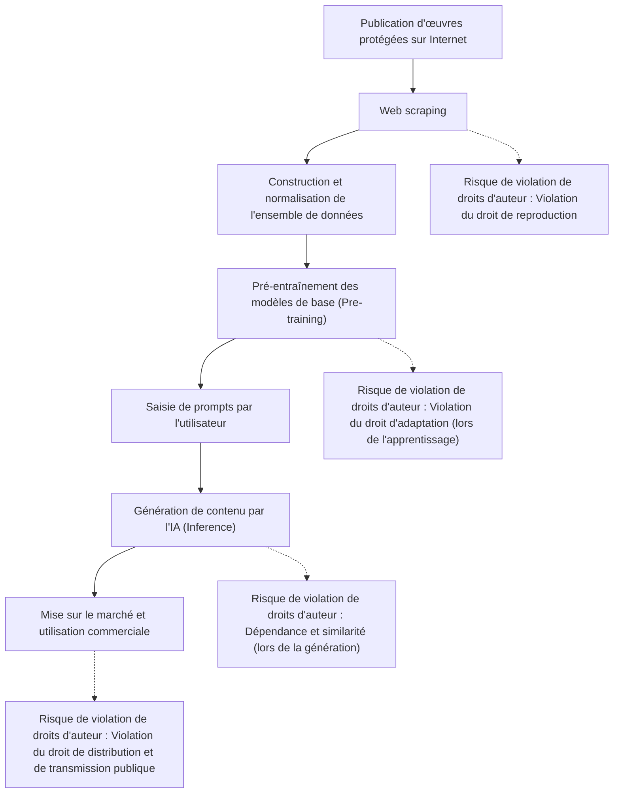
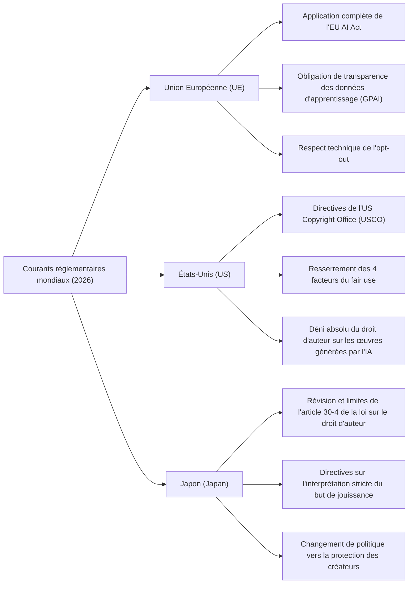
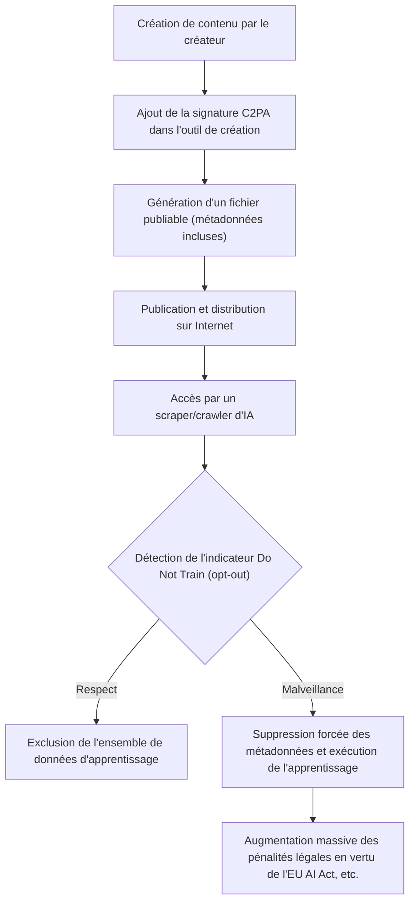

## 1. Introduction : L'IA générative et le nouveau changement de paradigme du droit d'auteur en 2026

En 2026, l'évolution technologique de l'IA générative (Generative AI) a atteint un niveau qui bouleverse fondamentalement le processus créatif humain, allant de la génération automatique de textes, d'images, de voix et de vidéos, jusqu'aux modèles 3D et aux codes logiciels complexes. Alors que les grands modèles linguistiques (LLM) de la classe GPT-5 et la prochaine génération de modèles de diffusion (Diffusion models) s'établissent comme des infrastructures sociales, le débat sur la légalité des « données d'entraînement (Training Data) » qui soutiennent ces modèles d'IA, ainsi que sur l'attribution des droits des « contenus générés (Generated Content) » par l'IA, est finalement passé du stade des litiges individuels devant les tribunaux à celui de la réglementation légale au niveau national et de la normalisation internationale.

Les recours collectifs (class actions) intentés fréquemment entre 2022 et 2024 par des créateurs et de grandes entreprises de médias contre les principales sociétés de développement d'IA commencent, en 2026, à produire plusieurs décisions judiciaires importantes et des cadres de règlement à l'amiable. Simultanément, les organes législatifs de divers pays ont commencé à tisser un nouveau réseau de réglementations pour suivre la vitesse d'évolution de la technologie. À l'heure actuelle, où deux valeurs opposées s'affrontent de front — d'une part, les avantages économiques écrasants (amélioration de la productivité) apportés par la technologie de l'IA, et d'autre part, la protection des droits des créateurs qui ont nourri la culture jusqu'à présent —, il est extrêmement important que les praticiens en entreprise, les ingénieurs et les créateurs eux-mêmes comprennent avec précision le paysage juridique.

Cet article explique de manière extrêmement détaillée, tant d'un point de vue juridique que technique, les tendances mondiales en matière de réglementation concernant l'IA générative et les droits d'auteur en 2026, les mesures de défense technique du côté des créateurs (empoisonnement des données et certification de provenance), ainsi que les perspectives d'avenir.

---

## 2. Mécanisme de violation des droits d'auteur : Interprétation juridique et risques dans 3 phases

Pour organiser avec précision les problèmes de l'IA générative et des droits d'auteur, il est nécessaire de diviser l'ensemble du cycle de vie de l'IA en trois phases : « Apprentissage (Training) », « Génération (Generation) » et « Utilisation (Exploitation) ». Dans le système juridique de 2026, la nature des droits remis en question dans chaque phase a été clarifiée.

### 2.1. « Droit de reproduction » et « droit d'adaptation » dans la phase d'apprentissage (Input)
Pour construire un modèle de base, il est nécessaire de collecter (web scraping) d'énormes quantités de données de texte, d'images et de code sur Internet et de les utiliser pour l'entraînement de l'IA. Dans ce processus de construction de l'ensemble de données, les œuvres étant copiées dans la mémoire temporaire ou le stockage des serveurs, la violation du « droit de reproduction » est en principe un problème.

Auparavant, les sociétés de développement d'IA ont fait valoir que « cette reproduction est à des fins d'analyse d'informations et n'est qu'un traitement mécanique, ce qui la rend légale » ou qu'elle « relève du fair use (usage loyal) ». Cependant, dans la jurisprudence récente et les débats de la doctrine juridique de 2026, la nature des « caractéristiques expressives » extraites des données par les modèles d'IA est au centre de l'attention.
Si un modèle d'IA intériorise les « caractéristiques essentielles de l'expression » d'une œuvre spécifique sous forme de poids (paramètres) du réseau, le rendant capable de les extraire telles quelles ultérieurement (ce que l'on appelle le « surapprentissage (Overfitting) » ou la « mémorisation (Memorization) »), il est fortement considéré que cela dépasse la simple analyse mécanique des informations et correspond à une « adaptation (Adaptation) ».

### 2.2. « Dépendance » et « similarité » dans la phase de génération (Output)
Il s'agit de la phase d'inférence où l'utilisateur saisit un prompt et l'IA génère le contenu. Si l'image ou le texte généré ressemble fortement à une œuvre spécifique existante, une violation du droit d'auteur peut être caractérisée.

Les deux conditions majeures pour caractériser une violation du droit d'auteur sont la « dépendance » (le fait de connaître l'œuvre ciblée et de s'être appuyé sur elle pour la création) et la « similarité » (le fait de pouvoir percevoir directement les caractéristiques essentielles de l'expression).
Dans le cas de l'IA, contrairement à un créateur humain, la façon de juger la condition subjective de savoir « si l'IA connaissait cette œuvre » a longtemps été un défi. Dans les décisions judiciaires de 2026, l'approche selon laquelle « si le fait que le modèle d'IA a lu l'œuvre en question comme donnée d'apprentissage est prouvé, la dépendance est fortement présumée (inversion de fait de la charge de la preuve) » s'est établie. De ce fait, la transparence des entreprises d'IA sur « les ensembles de données avec lesquels elles se sont entraînées » a pris une importance extrêmement cruciale dans le jugement des violations.

### 2.3. Phase d'utilisation (Responsabilité de l'utilisateur et indemnité des entreprises)
Il s'agit de la phase où l'utilisateur publie, vend ou utilise commercialement le contenu généré. Si l'outil d'IA n'a été utilisé que comme un simple « outil », le sujet direct de la violation des droits d'auteur est l'utilisateur qui a saisi le prompt et publié la sortie.
Dans les services d'IA destinés aux entreprises en 2026 (Copilot, IA génératrice d'images version entreprise, etc.), il est devenu une norme de l'industrie pour les entreprises d'IA d'établir des « clauses d'indemnité (exonération/compensation) » pour compenser le risque de violation des droits d'auteur des utilisateurs. Cependant, il ne s'agit que d'un transfert de risque contractuel B2B, et cela ne légalise pas en soi l'acte de violation au regard du droit d'auteur. Les entreprises utilisatrices sont dans l'obligation de construire un système de gouvernance interne pour vérifier si les éléments générés ne portent pas atteinte aux droits d'autrui.

---

## 3. Tendances réglementaires des principaux pays et régions en 2026

Les pays du monde entier adoptent des approches complètement différentes pour trouver un équilibre entre des intérêts nationaux contradictoires : renforcer la compétitivité nationale en favorisant l'innovation en matière d'IA et protéger les créateurs et les détenteurs de droits d'auteur. Nous analyserons et comparerons en détail la situation actuelle des réglementations en Europe, aux États-Unis et au Japon en 2026.

### 3.1. Union Européenne (UE) : Application complète de l'EU AI Act et morsure des exigences de transparence
La « loi européenne sur l'IA (EU AI Act) », adoptée en 2024 et entrée dans sa phase de pleine application en 2026 après une période de transition progressive, est le cadre réglementaire de l'IA le plus strict au monde. Ce qui a le plus grand impact dans le contexte des droits d'auteur, ce sont les **« obligations de transparence »** et les **« obligations de se conformer à la législation européenne sur le droit d'auteur »** imposées aux développeurs de modèles d'IA à usage général (GPAI : General Purpose AI).

En vertu de l'EU AI Act, les fournisseurs de GPAI sont tenus de publier un « résumé suffisamment détaillé (Sufficiently detailed summary) » du contenu utilisé pour l'entraînement de l'IA. En 2026, la granularité juridique de ce « résumé suffisamment détaillé » a été clarifiée par les directives de la Cour de justice de l'Union européenne et du Bureau européen de l'IA (AI Office), et les descriptions abstraites telles que « nous avons utilisé le jeu de données public Common Crawl » sont désormais considérées comme illégales. Une divulgation stricte de la liste des URL spécifiques des ensembles de données, de la liste des domaines principaux où les titulaires de droits sont concentrés, et du processus d'exclusion des données (état du traitement des opt-out) est exigée.

De plus, conformément à l'« exception de TDM (Text and Data Mining) » en vertu de l'article 4 de la directive sur le droit d'auteur dans le marché unique numérique de l'UE (directive DSM), il a été stipulé que si les détenteurs de droits refusent (opt-out) l'utilisation de données d'apprentissage par une méthode lisible par machine (telle que robots.txt ou C2PA, décrits plus loin), les entreprises d'IA sont dans l'obligation de respecter cette volonté sur le plan technique et systémique et de les exclure de l'ensemble de données. En cas de violation de cette règle, il existe un risque de se voir infliger d'énormes amendes équivalant à un certain pourcentage de leurs ventes mondiales.

### 3.2. États-Unis (US) : Redéfinition du fair use et position stricte de l'USCO
Aux États-Unis, berceau de l'industrie de l'IA, la légalité de l'entraînement de l'IA ne se décide pas par une réglementation directe de l'IA par le droit écrit, mais sur le champ de bataille de la doctrine juridique du « Fair Use » (usage loyal) stipulée à l'article 107 de la loi sur le droit d'auteur existante.
Suite à la décision de la Cour suprême dans l'affaire « Andy Warhol Foundation v. Goldsmith » en 2023, les critères de jugement du fair use aux États-Unis, en particulier l'interprétation du premier facteur « le but et le caractère de l'utilisation (s'il s'agit d'une utilisation transformatrice ou non) », sont devenus extrêmement stricts.

Dans la jurisprudence majeure au niveau des tribunaux de district fédéraux accumulée jusqu'en 2026 (par exemple, les décisions de fond et les règlements dans le procès du New York Times contre OpenAI), les tribunaux commencent à établir les critères suivants :
« Lorsqu'une IA apprend d'une œuvre originale et a la capacité de générer un substitut qui concurrence directement cette œuvre sur le marché (par exemple, un résumé d'actualités identique à un article du NYT, ou des photos de banque d'images extrêmement similaires à des images Getty), cet acte d'apprentissage provoque un impact négatif direct sur le marché (le 4ème facteur du fair use) et, par conséquent, n'est pas protégé par le fair use dans son ensemble. »

En outre, l'US Copyright Office (USCO) maintient fermement sa politique de ne pas autoriser l'enregistrement des droits d'auteur pour les contenus générés de manière autonome par l'IA, car il n'y a pas de « contribution créative (Creative Authorship) » humaine. Dans les dernières directives opérationnelles de 2026, il a été clarifié qu'une affirmation telle que « j'ai utilisé une ingénierie de prompt avancée (Prompt Engineering) » n'est qu'une simple « instruction d'idées (commission) » et n'est pas reconnue comme une expression créative au sens de la loi sur le droit d'auteur. Pour revendiquer un droit d'auteur sur la sortie d'une IA, il faut prouver qu'un être humain a apporté « des modifications substantielles et créatives » (retouche importante dans Photoshop, reconstruction complexe de la composition, etc.) à cette sortie.

### 3.3. Japon (Japan) : La fin de l'« ère du passager clandestin » de l'article 30-4 de la loi sur le droit d'auteur
Le Japon a été qualifié de « pays le plus favorable au développement de l'IA au monde » grâce à l'article 30-4 (Reproduction, etc., à des fins d'analyse d'informations) introduit lors de la révision de la loi sur le droit d'auteur en 2018. Cet article était une disposition de limitation des droits extrêmement puissante qui autorisait largement la reproduction pour l'apprentissage de l'IA, à condition que l'objectif ne soit pas la « jouissance » des idées ou des émotions exprimées dans l'œuvre, que ce soit à des fins lucratives ou non lucratives, et que les données sources originales aient été téléchargées légalement ou illégalement (※ cependant, des restrictions ont été ajoutées par la suite pour l'apprentissage à partir de copies piratées).

Cependant, à partir de 2024, face aux vives réactions des groupes de créateurs craignant que l'IA générative ne s'empare directement des marchés des illustrateurs, acteurs vocaux et écrivains existants, l'Agence pour les affaires culturelles et la sous-commission sur le droit d'auteur ont procédé à une interprétation plus stricte du « but de jouissance ».

En 2026, dans les dernières directives juridiques publiées par l'Agence pour les affaires culturelles, il a été clairement indiqué que les actes suivants sont considérés comme « ayant des objectifs de jouissance mixtes » et qu'il est fort probable qu'ils ne relèvent pas de l'application de l'article 30-4 (= nécessitent en principe l'autorisation du titulaire du droit d'auteur, et constitueront une violation du droit d'auteur s'ils sont effectués sans autorisation).
- L'acte de collecter de manière concentrée (scraping) les œuvres d'un créateur spécifique et de les faire apprendre dans le but d'imiter intentionnellement le style de dessin ou la qualité vocale de ce créateur (techniques telles que Fine-tuning, LoRA, apprentissage supplémentaire).
- L'acte d'enregistrement dans la base de données d'un système RAG (Retrieval-Augmented Generation) conçu dans l'intention de faire produire telles quelles les caractéristiques expressives de l'œuvre originale.

Avec ce changement d'interprétation, l'ère où « l'apprentissage gratuit (freeride) non autorisé était possible avec n'importe quelles données » au Japon a pratiquement pris fin. Les entreprises japonaises, comme celles d'Europe et des États-Unis, ont pris le virage de l'approvisionnement en données propres (clean data) dont les droits ont été réglés.

---

## 4. Importance historique des litiges internationaux notables de 2024 à 2026

Nous résumons la situation actuelle en 2026 des principales poursuites judiciaires qui ont eu un impact majeur sur la formation des réglementations légales.

1. **The New York Times v. OpenAI / Microsoft**
   Déposée à la fin de 2023, cette affaire est devenue le procès le plus important symbolisant le conflit entre « l'IA générative et le droit d'auteur ». Le NYT a présenté des preuves que des millions de ses articles avaient été appris sans autorisation, et que ChatGPT générait les articles du NYT en les mémorisant presque entièrement (Memorization). En 2026, le tribunal a rendu une décision interlocutoire stipulant que « la reproduction parfaite d'un article générée par l'IA ne constitue pas un fair use », et les deux sociétés sont parvenues à un règlement à l'amiable substantiel sous la forme de la signature d'un énorme contrat de licence. Cela a déterminé la norme de l'industrie selon laquelle « l'apprentissage par l'IA de contenu d'actualités doit être rémunéré ».

2. **Getty Images v. Stability AI**
   Poursuite contre le développeur de l'IA générative d'images « Stable Diffusion ». Le fait que le filigrane (watermark) de Getty ait été affiché tel quel sur les images générées par l'IA a été présenté comme la preuve concluante d'un apprentissage non autorisé. À la suite de procès parallèles au Royaume-Uni et aux États-Unis, une décision historique a été rendue en 2026 selon laquelle « l'acte d'apprentissage en supprimant ou en contournant intentionnellement un filigrane relève du contournement des mesures techniques de protection du Digital Millennium Copyright Act (DMCA) », et de lourdes pénalités ont été infligées aux entreprises d'IA.

3. **Litige concernant GitHub Copilot (Doe v. GitHub)**
   Poursuite contre Copilot, qui a appris des codes de logiciels open source (OSS). Le point de discorde était qu'il générait du code en ignorant l'« obligation d'attribution du droit d'auteur (Attribution) » requise par les licences OSS (telles que MIT et GPL). En 2026, les outils de développement d'IA ont désormais l'obligation légale d'intégrer une fonctionnalité (système de filtrage et d'attribution) permettant de détecter en temps réel si le code généré correspond au code OSS existant et d'ajouter les informations de licence.

---

## 5. Moyens d'autodéfense des auteurs : Évolution des technologies d'opt-out et de C2PA

Le développement de réglementations légales prend du temps et il est difficile de contrôler pleinement les activités transfrontalières des entreprises d'IA. Par conséquent, les créateurs et les éditeurs accélèrent leurs efforts pour protéger de manière proactive leurs propres œuvres en utilisant des moyens techniques.

### 5.1. robots.txt et protocole d'opt-out TDM
Le fichier `robots.txt` placé dans le répertoire racine d'un site Web est à l'origine un protocole permettant de contrôler les robots d'exploration (crawlers) des moteurs de recherche. Cependant, en 2026, il est devenu le moyen standard de bloquer de manière uniforme les robots d'exploration dédiés à l'apprentissage de l'IA (ex. : `GPTBot` d'OpenAI, `Google-Extended` de Google, `ClaudeBot` d'Anthropic).
Toutefois, le fichier `robots.txt` n'a pas de force contraignante légale et présente un défaut fondamental : il est facilement ignoré par les web scrapers malveillants de type « sauvage ». Ainsi, la normalisation de l'intégration de l'intention d'opt-out du TDM (Text and Data Mining) directement dans les en-têtes HTTP ou les balises meta HTML (ex. : `<meta name="tdm-reservation" content="1">`) pour lui donner une force légale sous une forme lisible par machine (comme W3C TDM Rep) s'est répandue dans le monde entier. En vertu de l'EU AI Act, si le scraping est effectué en ignorant cette balise meta, il est traité comme un acte clairement illégal.

### 5.2. Implémentation native de C2PA et certification de provenance des contenus
**C2PA (Coalition for Content Provenance and Authenticity)** est une norme technique qui attache des « métadonnées de provenance » infalsifiables, signées par chiffrement, aux contenus numériques tels que les images, vidéos et fichiers audio. En 2026, C2PA est implémenté de manière native sur la plupart des appareils photo numériques majeurs (Sony, Leica, Nikon, etc.), des logiciels de retouche d'images (Adobe Photoshop, etc.), ainsi que sur les applications d'appareil photo standard d'iOS et d'Android.

Le manifeste C2PA (informations de provenance) peut inclure un indicateur clair stipulant que « cette image ne doit pas être utilisée comme donnée d'apprentissage pour l'IA (Do Not Train : DNT) ». À l'inverse, il comporte également une marque générée par l'IA indiquant que « cette image a été générée par l'IA », fonctionnant ainsi comme un mécanisme de protection à la fois contre les deepfakes et pour le droit d'auteur. L'acte de suppression intentionnelle (stripping) de ces métadonnées fait l'objet de sanctions en tant que « suppression des informations de gestion des droits » dans les lois sur le droit d'auteur de nombreux pays.

---

## 6. Contre-mesures techniques : Mécanismes d'empoisonnement des données (Glaze, Nightshade)

Pour contrer les entreprises d'IA qui ignorent même les réglementations et les expressions d'intention d'opt-out, la technologie de l'« empoisonnement des données (Data Poisoning) » est devenue largement répandue en 2026 en tant que « moyen de défense le plus puissant et physique » des créateurs. Représentées par **Glaze** et **Nightshade**, développées par l'équipe de recherche de l'Université de Chicago, ces technologies constituent une méthode de défense offensive et active qui perturbe mathématiquement le processus d'apprentissage de l'IA lui-même.

### 6.1. Modèle mathématique de perturbation antagoniste (Adversarial Perturbation)
Les modèles d'IA (en particulier les réseaux de neurones convolutifs ou CNN dans la reconnaissance d'images, et les modèles de diffusion dans la génération) ne « voient » pas les images visuellement comme les humains, mais les traitent comme des vecteurs numériques dans un espace latent de haute dimension (Latent Space). L'empoisonnement des données introduit au niveau du pixel un bruit infime (perturbation antagoniste) tout à fait invisible à l'œil humain, induisant intentionnellement en erreur l'encodeur du modèle d'IA.

Mathématiquement, cela se définit comme un problème d'optimisation suivant :

$$ \min_{\delta} \mathcal{L}(f(x+\delta), y_{target}) $$

$$ \text{subject to } ||\delta||_p < \epsilon $$

Où :
- $x$ est l'image propre d'origine (par exemple, une image d'un « beau paysage »)
- $\delta$ est le bruit infime ajouté à l'image (vecteur de perturbation)
- $f$ est l'extracteur de caractéristiques (encodeur) de l'IA
- $y_{target}$ est le concept cible que l'IA doit mal identifier (par exemple, « des déchets pleins de bruit » ou « un objet complètement différent »)
- $\mathcal{L}$ est la fonction de perte
- $\epsilon$ est le seuil supérieur pour que le bruit reste imperceptible à la vision humaine (norme L-p)

L'outil d'empoisonnement résout ce problème d'optimisation sur l'ordinateur du créateur, « empoisonne » l'image et l'exporte.

### 6.2. Glaze (Protection du style et du style de dessin)
Glaze est un outil conçu pour protéger le « style (Style) » unique d'un créateur. Par exemple, si l'on applique Glaze sur une illustration au style d'aquarelle délicat, l'œil humain y verra toujours une aquarelle. Cependant, en raison de l'impact de la perturbation $\delta$ ajoutée, l'encodeur $f$ de l'IA percevra cette image comme un vecteur de « peinture à l'huile épaisse » ou de « cubisme abstrait » et l'apprendra comme telle.
En conséquence, si l'on donne un prompt tel que « génère dans le style de (ce créateur) » à un modèle d'IA ayant appris avec cette image empoisonnée, il produira un style complètement différent et incohérent, car sa cartographie dans l'espace latent est perturbée. Cela annule physiquement la création de « modèles copiant le style de créateurs spécifiques (comme LoRA) » par les entreprises d'IA.

### 6.3. Nightshade (Destruction de concepts et effondrement de modèles)
Nightshade est encore plus offensif que Glaze, ayant pour but de polluer et de détruire les « concepts (Concept) » eux-mêmes au sein du modèle d'IA.
Par exemple, en appliquant Nightshade à l'image d'un « chien », on oblige l'IA à l'apprendre en tant que « chat ». Il a été prouvé que l'introduction de quelques centaines ou milliers de ces images avec un empoisonnement spécifique au prompt (Prompt-Specific Poisoning) dans un ensemble de données suffit à faire s'effondrer l'alignement conceptuel d'un modèle de base entier.
Avec un modèle pollué par Nightshade, si l'utilisateur demande à l'IA de « générer l'image d'un chien mignon », l'IA produira l'image d'un étrange chat à quatre pattes ou une texture totalement dénuée de sens.

En 2026, il est devenu standard que ces processus d'empoisonnement s'exécutent automatiquement en arrière-plan (via des extensions de navigateur ou des protocoles décentralisés) lorsque les créateurs téléchargent des images sur des réseaux sociaux ou des sites de portfolio. De ce fait, le risque technique pour les entreprises d'IA de « scrapper des images d'Internet sans discernement » (le risque de voir un modèle dont l'entraînement a coûté des centaines de millions d'euros s'effondrer en un instant) a considérablement augmenté, fonctionnant par conséquent comme un puissant moyen de dissuasion contre l'apprentissage non autorisé.

---

## 7. Changement de stratégie des entreprises d'IA générative : Données propres, licences et données synthétiques

Confrontées au renforcement des réglementations légales, au risque de perdre des procès pour violation de droits d'auteur, et à la menace des technologies d'empoisonnement de données telles que Nightshade, les entreprises de développement d'IA sont désormais, en 2026, contraintes d'opérer un changement massif de leurs paradigmes de développement d'IA et de leurs modèles commerciaux.

### 7.1. Retour aux ensembles de données propres et guerre de l'hégémonie
L'approche passée de la Silicon Valley qui consistait à agir selon l'adage « Move fast and break things » (Agir vite et casser des choses) en collectant toutes les données d'Internet sans autorisation pour créer d'énormes ensembles de données (comme l'ensemble de données anarchique LAION-5B) a atteint ses limites.
Au lieu de cela, la valeur des « ensembles de données propres » (Clean Datasets) dont les droits d'auteur sont entièrement libérés et où le processus d'opt-out est parfait, a augmenté de manière astronomique. Des entreprises telles qu'Adobe (Firefly), Getty Images et Shutterstock, qui détiennent elles-mêmes d'énormes quantités de contenu sous licence, ont établi une position extrêmement dominante sur le marché des entreprises en offrant un « risque zéro de violation de droits d'auteur ».

### 7.2. Contrats de licence massifs et modèle de partage des revenus
Il est devenu courant pour les principaux fournisseurs d'IA (OpenAI, Google, Anthropic, Meta, etc.) de conclure des contrats de licence de données de l'ordre de dizaines de milliards de yens par an avec des entreprises de médias (The New York Times, Reddit, News Corp, etc.), des services d'images d'archives, de grandes maisons d'édition, et même des labels de musique.
De plus, on observe la construction de « modèles de partage des revenus » (Revenue Share Models) qui redistribuent aux créateurs originaux ayant fourni les données d'apprentissage les revenus des abonnements et les frais d'utilisation des API générés par le contenu de l'IA. En combinant la technologie blockchain/Web3 et C2PA, des expériences concrètes de déploiement social sont activement menées pour des systèmes qui calculent la part de contribution des données de chaque créateur sur lesquelles l'IA s'est « appuyée » pour produire son résultat, et distribuent automatiquement la rémunération via des micropaiements (smart contracts).

### 7.3. Dépendance aux données synthétiques (Synthetic Data) et le dilemme de l'« effondrement des modèles »
Confrontées au phénomène où les données humaines s'épuisent légalement ou physiquement (à cause de l'empoisonnement), ce que l'on appelle le « mur de données (Data Wall) », les entreprises d'IA ont véritablement adopté l'approche consistant à faire auto-apprendre les modèles d'IA de la prochaine génération en utilisant des données générées par l'IA elle-même (données synthétiques : Synthetic Data).
Cependant, il a été mathématiquement et statistiquement prouvé que répéter de manière récursive l'apprentissage en utilisant uniquement des données synthétiques entraîne une perte de diversité des données, les caractéristiques minoritaires étant rejetées, ce qui aboutit finalement à une dégradation fatale de la qualité des sorties du modèle : un phénomène appelé « l'effondrement du modèle » (Model Collapse).
En fin de compte, il est apparu que pour que l'IA puisse continuer à évoluer, l'approvisionnement continu en « données nouvelles, de haute qualité et originales produites par l'homme » est indispensable, soulignant le paradoxe selon lequel si les créateurs étaient exploités et menés à l'extinction, la technologie de l'IA elle-même tomberait dans une impasse évolutive.

---

## 8. Perspectives vers 2030 et conclusion

L'année 2026 restera gravée dans l'histoire comme l'année monumentale où la « période de frontière anarchique » de l'IA générative a complètement pris fin, marquant l'entrée dans une « période de construction d'un nouveau contrat social » (Social Contract) pour que la loi, la technologie et la créativité humaine puissent coexister.

### Principaux points à résoudre à l'avenir
1. **Réalisation d'une harmonisation juridique internationale** : Comment intégrer les différentes approches réglementaires de l'UE (transparence stricte), des États-Unis (priorité à l'impact sur le marché en fonction du fair use) et du Japon (interprétation plus stricte des objectifs de jouissance), et garantir la sécurité juridique des activités mondiales d'IA. Une mise à jour au niveau des traités internationaux est urgente.
2. **Création de « nouveaux droits » à l'ère de l'IA** : Un débat sur la nécessité de créer de nouveaux droits spécifiquement pour l'apprentissage automatique (tels que le « droit d'accès/ingestion des données » ou le « droit à rémunération pour l'apprentissage ») qui ne peuvent être englobés par les concepts traditionnels de « reproduction et adaptation » appliqués aux processus d'apprentissage par l'IA.
3. **Redéfinition de la créativité humaine et « Proof of Humanity »** : À une époque où l'IA peut créer instantanément n'importe quoi avec une qualité supérieure à celle des humains, quelle prime économique et culturelle sera attachée au fait même qu'une œuvre ait été « créée par un humain, avec une âme humaine (Proof of Humanity) » ? Tout comme les produits artisanaux faits à la main ont accru leur valeur à l'ère industrielle, la valeur de la marque de l'art humain est en train d'être redéfinie.

Il est impossible de faire reculer l'horloge de l'évolution de la technologie de l'IA. Cependant, apprivoiser cette technologie puissante et la contrôler afin qu'elle ne détruise pas l'écosystème des créateurs qui ont nourri la culture et l'art humains pendant des millénaires repose sur la sagesse du droit, de l'informatique et de la société dans son ensemble.

À l'horizon 2030, il est vivement demandé de ne pas laisser l'IA et les créateurs s'affronter et se disputer le gâteau, mais d'établir une « nouvelle zone économique numérique » où ils peuvent co-créer avec une rémunération équitable et un respect mutuel, permettant ainsi d'étendre la créativité de l'humanité.
