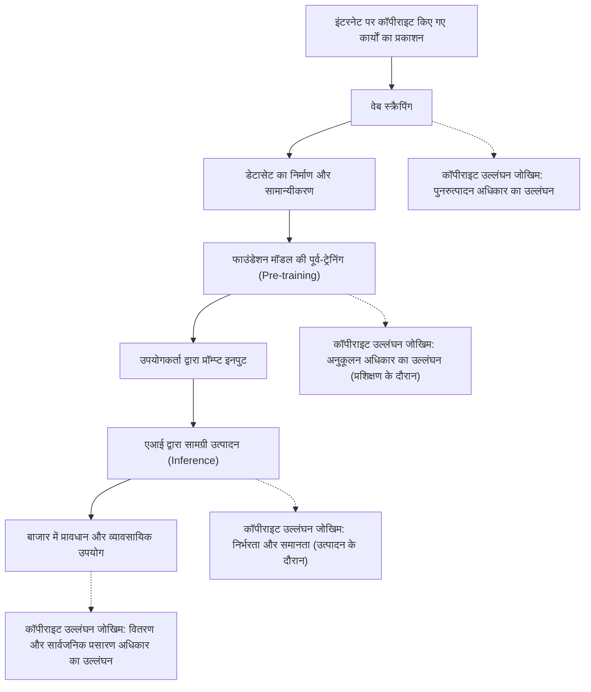
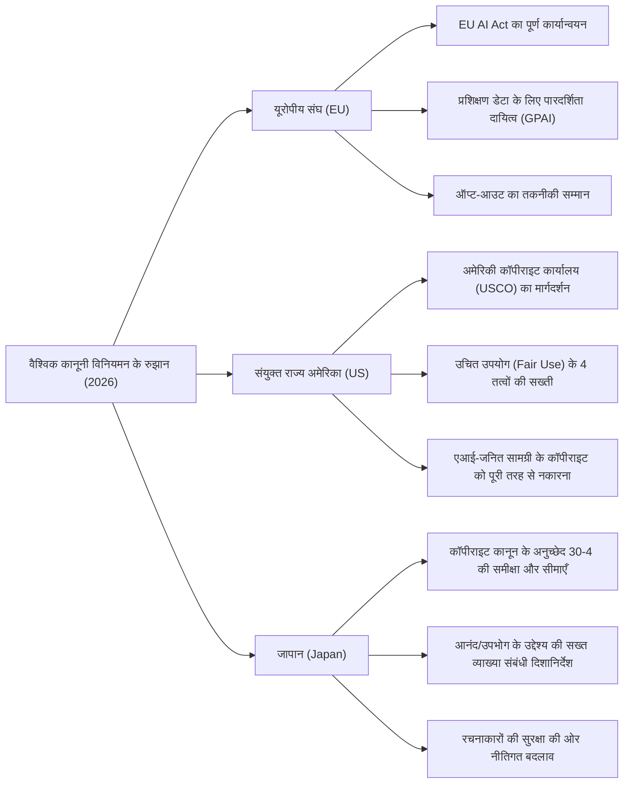
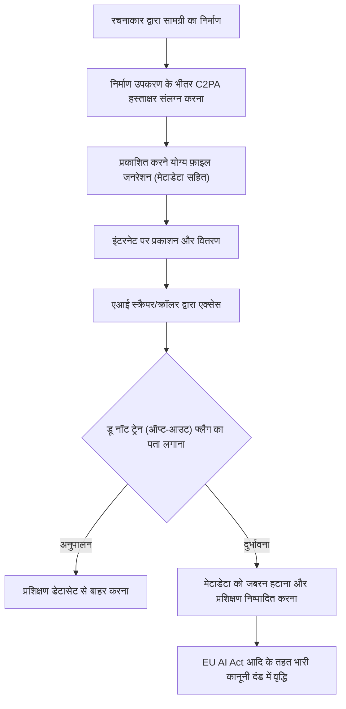

## 1. प्रस्तावना: 2026 में जनरेटिव एआई और कॉपीराइट का नया प्रतिमान बदलाव (Paradigm Shift)

2026 तक, जनरेटिव एआई (Generative AI) का तकनीकी विकास उस स्तर पर पहुंच गया है जो पाठ, चित्र, ऑडियो, वीडियो से लेकर 3D मॉडल और जटिल सॉफ्टवेयर कोड के स्वचालित निर्माण तक मानव की रचनात्मक प्रक्रिया को पूरी तरह से बदल रहा है। जहाँ GPT-5 श्रेणी के लार्ज लैंग्वेज मॉडल (LLM) और अगली पीढ़ी के डिफ्यूजन मॉडल (Diffusion Models) सामाजिक बुनियादी ढांचे के रूप में स्थापित हो गए हैं, वहीं इन एआई मॉडलों का समर्थन करने वाले 'प्रशिक्षण डेटा (Training Data)' की वैधता और एआई द्वारा उत्पन्न 'सामग्री (Generated Content)' के अधिकारों के स्वामित्व पर बहस अब न्यायालयों के व्यक्तिगत विवादों से हटकर राष्ट्रीय स्तर के कानूनी विनियमन और अंतर्राष्ट्रीय मानकीकरण के चरण में प्रवेश कर गई है।

2022 से 2024 के बीच रचनाकारों और प्रमुख मीडिया कंपनियों द्वारा मुख्य एआई विकास कंपनियों के खिलाफ किए गए कई क्लास-एक्शन मुकदमों (Class Actions) ने 2026 तक कुछ महत्वपूर्ण न्यायिक निर्णयों और समझौतों के ढांचे को जन्म दिया है। साथ ही, विभिन्न देशों की विधायिकाएं तकनीक के विकास की गति के साथ तालमेल बिठाने के लिए नए नियमों का जाल बिछाना शुरू कर चुकी हैं। आज के युग में, जहां एआई तकनीक द्वारा लाए गए भारी आर्थिक लाभ (उत्पादकता में वृद्धि) और संस्कृति को पोषित करने वाले रचनाकारों के अधिकारों की सुरक्षा जैसे दो विरोधी मूल्य सीधे तौर पर टकराते हैं, कंपनियों के अधिकारियों, इंजीनियरों और स्वयं रचनाकारों के लिए कानूनी परिदृश्य को सटीक रूप से समझना अत्यंत महत्वपूर्ण है।

इस लेख में, हम 2026 तक जनरेटिव एआई और कॉपीराइट से संबंधित वैश्विक कानूनी विनियमन रुझानों, रचनाकारों के तकनीकी रक्षा उपायों (डेटा पॉइज़निंग और उत्पत्ति प्रमाण), और भविष्य की संभावनाओं के बारे में कानूनी और तकनीकी दृष्टिकोण से अत्यधिक विस्तार से चर्चा करेंगे।

---

## 2. कॉपीराइट उल्लंघन का तंत्र: 3 चरणों में कानूनी व्याख्या और जोखिम

जनरेटिव एआई और कॉपीराइट के मुद्दे को सटीक रूप से समझने के लिए, एआई के पूरे जीवनचक्र को 'प्रशिक्षण (Training)', 'उत्पादन (Generation)' और 'उपयोग (Exploitation)' के तीन चरणों में विभाजित करके सोचना आवश्यक है। 2026 की कानूनी प्रणाली में, प्रत्येक चरण में पूछे जाने वाले अधिकारों की प्रकृति स्पष्ट हो गई है।

### 2.1. प्रशिक्षण चरण (इनपुट) में "पुनरुत्पादन अधिकार" और "अनुकूलन अधिकार"
फाउंडेशन मॉडल बनाने के लिए, इंटरनेट से भारी मात्रा में टेक्स्ट, इमेज और कोड डेटा एकत्र (वेब स्क्रैपिंग) करना और इसे एआई प्रशिक्षण के लिए उपयोग करना आवश्यक है। इस डेटासेट निर्माण प्रक्रिया में, सर्वर की अस्थायी मेमोरी या स्टोरेज में कॉपीराइट किए गए कार्यों की प्रतिलिपि बनाई जाती है, इसलिए सिद्धांत रूप में 'पुनरुत्पादन अधिकार' के उल्लंघन की समस्या उत्पन्न होती है।

पारंपरिक रूप से, एआई विकास कंपनियों ने यह तर्क दिया है कि "यह प्रतिलिपि केवल सूचना विश्लेषण उद्देश्यों के लिए है और महज एक यांत्रिक प्रक्रिया होने के कारण वैध है" या "यह उचित उपयोग (Fair Use) के अंतर्गत आता है"। हालाँकि, 2026 के नवीनतम अदालती मामलों और कानूनी हलकों की बहसों में, एआई मॉडल द्वारा डेटा से निकाले गए "विशेषता अभिव्यक्ति" की प्रकृति मुख्य फोकस बन गई है।
यदि एआई मॉडल किसी विशिष्ट कॉपीराइट किए गए कार्य की "अभिव्यक्ति की आवश्यक विशेषताओं" को नेटवर्क वज़न (पैरामीटर) के रूप में आंतरिक करता है, और यह बाद में उसी रूप में निकाले जाने की स्थिति में होता है (तथाकथित "ओवरफिटिंग (Overfitting)" या "मेमोराइजेशन (Memorization)"), तो यह दृष्टिकोण प्रमुखता प्राप्त कर रहा है कि क्या यह केवल यांत्रिक सूचना विश्लेषण से परे एक "अनुकूलन (Adaptation)" के रूप में योग्य है।

### 2.2. उत्पादन चरण (आउटपुट) में "निर्भरता" और "समानता"
यह अनुमान (Inference) चरण है जहां उपयोगकर्ता एक प्रॉम्प्ट इनपुट करता है और एआई सामग्री उत्पन्न करता है। यदि यहां उत्पन्न चित्र या पाठ मौजूदा विशिष्ट कॉपीराइट किए गए कार्यों के बहुत समान हैं, तो कॉपीराइट उल्लंघन स्थापित होने की संभावना है।

कॉपीराइट उल्लंघन स्थापित करने के लिए दो प्रमुख आवश्यकताएं "निर्भरता (क्या रचना लक्षित कार्य को जानकर और उस पर निर्भर होकर बनाई गई है)" और "समानता (क्या अभिव्यक्ति की आवश्यक विशेषताओं को सीधे महसूस किया जा सकता है)" हैं।
एआई के मामले में, मानव रचनाकारों के विपरीत, "क्या एआई उस कार्य को जानता था" जैसी व्यक्तिपरक आवश्यकता का न्याय कैसे किया जाए, यह लंबे समय से एक चुनौती रही है। 2026 के न्यायिक निर्णयों में, यह दृष्टिकोण स्थापित हो रहा है कि "यदि यह साबित हो जाता है कि एआई मॉडल ने विचाराधीन कार्य को प्रशिक्षण डेटा के रूप में पढ़ा था, तो निर्भरता का दृढ़ता से अनुमान लगाया जाता है (प्रभावी रूप से प्रमाण के भार का उलटाव)"। इसके परिणामस्वरूप, एआई कंपनियों ने "किस डेटासेट के साथ प्रशिक्षण लिया" की पारदर्शिता उल्लंघन के निर्धारण में अत्यंत महत्वपूर्ण हो गई है।

### 2.3. उपयोग चरण (उपयोगकर्ता की जिम्मेदारी और कॉर्पोरेट क्षतिपूर्ति/Indemnity)
यह वह चरण है जहां उपयोगकर्ता उत्पन्न सामग्री को प्रकाशित, बेचता या व्यावसायिक रूप से उपयोग करता है। यदि एआई टूल का उपयोग केवल एक "उपकरण" के रूप में किया जाता है, तो कॉपीराइट उल्लंघन का सीधा विषय वह उपयोगकर्ता होता है जिसने प्रॉम्प्ट दर्ज किया और आउटपुट प्रकाशित किया।
2026 की एंटरप्राइज़-ग्रेड एआई सेवाओं (जैसे Copilot या एंटरप्राइज़ छवि जनरेशन एआई) में, एआई कंपनियों के लिए उपयोगकर्ताओं के कॉपीराइट उल्लंघन के जोखिम की भरपाई करने के लिए "क्षतिपूर्ति (Indemnity)" खंड प्रदान करना उद्योग का मानक बन गया है। हालाँकि, यह केवल B2B अनुबंधों के तहत जोखिम का हस्तांतरण है, और कॉपीराइट कानून के तहत उल्लंघन के कार्य को वैध नहीं बनाता है। उपयोगकर्ता कंपनियों के लिए एक आंतरिक शासन प्रणाली स्थापित करना अनिवार्य हो गया है जो यह जांच करे कि उत्पन्न सामग्री दूसरों के अधिकारों का उल्लंघन तो नहीं करती है।

---

## 3. प्रमुख देशों और क्षेत्रों के कानूनी विनियमन रुझान 2026

दुनिया भर के देश एआई नवाचार को बढ़ावा देकर राष्ट्रीय प्रतिस्पर्धात्मकता को मजबूत करने और रचनाकारों एवं कॉपीराइट धारकों की सुरक्षा के परस्पर विरोधी राष्ट्रीय हितों को संतुलित करने के लिए पूरी तरह से अलग-अलग दृष्टिकोण अपना रहे हैं। हम 2026 में यूरोप, अमेरिका और जापान की वर्तमान कानूनी नियामक स्थिति की विस्तार से तुलना और विश्लेषण करेंगे।

### 3.1. यूरोपीय संघ (EU): EU AI Act का पूर्ण कार्यान्वयन और पारदर्शिता आवश्यकताओं की सख्ती
2024 में पारित और चरणबद्ध संक्रमण अवधि के बाद 2026 में पूर्ण कार्यान्वयन के चरण में प्रवेश कर चुका 'EU AI Act' दुनिया का सबसे सख्त एआई नियामक ढांचा है। कॉपीराइट के संदर्भ में सबसे बड़ा प्रभाव जनरल-पर्पज एआई (GPAI) मॉडल के डेवलपर्स पर लगाए गए **"पारदर्शिता दायित्व"** और **"यूरोपीय संघ के कॉपीराइट कानून का अनुपालन दायित्व"** हैं।

EU AI अधिनियम के तहत, GPAI प्रदाताओं का यह दायित्व है कि वे एआई प्रशिक्षण में प्रयुक्त सामग्री का "पर्याप्त रूप से विस्तृत सारांश (Sufficiently detailed summary)" जनता के सामने प्रकट करें। 2026 तक, इस "पर्याप्त रूप से विस्तृत सारांश" की कानूनी बारीकियों को यूरोपीय न्यायालय और यूरोपीय एआई कार्यालय (AI Office) के दिशानिर्देशों द्वारा स्पष्ट कर दिया गया है, और अब केवल यह अमूर्त विवरण देना कि "सार्वजनिक डेटासेट Common Crawl का उपयोग किया गया था" अवैध माना जाता है। विशिष्ट डेटासेट की URL सूची, प्रमुख डोमेन की सूची जहाँ कॉपीराइट धारक केंद्रित हैं, और डेटा बहिष्करण प्रक्रिया (ऑप्ट-आउट की प्रसंस्करण स्थिति) के प्रकटीकरण की सख्ती से मांग की जाती है।

इसके अतिरिक्त, EU के डिजिटल सिंगल मार्केट में कॉपीराइट निर्देश (DSM Directive) के अनुच्छेद 4 के आधार पर "TDM (टेक्स्ट और डेटा माइनिंग) अपवाद" के अनुसार, यदि कोई अधिकार धारक मशीन-पठनीय तरीके (जैसे robots.txt या C2PA, जिनकी चर्चा बाद में की गई है) का उपयोग करके प्रशिक्षण डेटा के उपयोग से ऑप्ट-आउट करता है, तो एआई कंपनियों को तकनीकी और व्यवस्थित रूप से उस निर्णय का सम्मान करना चाहिए और इसे डेटासेट से बाहर करना चाहिए, यह दायित्व स्पष्ट रूप से लिखा गया है। इसका उल्लंघन करने पर, वैश्विक बिक्री के एक निश्चित प्रतिशत के बराबर भारी जुर्माना लगाए जाने का जोखिम है।

### 3.2. संयुक्त राज्य अमेरिका (US): उचित उपयोग (Fair Use) की पुनर्परिभाषा और USCO का सख्त रुख
एआई उद्योग के केंद्र अमेरिका में, वैधानिक कानून के माध्यम से प्रत्यक्ष एआई विनियमन के बजाय, मौजूदा कॉपीराइट कानून की धारा 107 के तहत "उचित उपयोग (Fair Use)" का कानूनी सिद्धांत एआई प्रशिक्षण की वैधता तय करने का मुख्य अखाड़ा बन गया है।
2023 के 'एंडी वारहोल फाउंडेशन बनाम गोल्डस्मिथ मामले' (Andy Warhol Foundation v. Goldsmith) में सर्वोच्च न्यायालय के फैसले के बाद, अमेरिका में उचित उपयोग के मानदंड, विशेष रूप से पहले तत्व "उपयोग का उद्देश्य और चरित्र (क्या यह परिवर्तनकारी उपयोग है या नहीं)" की व्याख्या अत्यधिक सख्त हो गई है।

2026 तक संचित संघीय जिला न्यायालय-स्तरीय महत्वपूर्ण मिसालों (उदाहरण के लिए: द न्यूयॉर्क टाइम्स बनाम OpenAI मुकदमे जैसे वास्तविक निर्णय या समझौते) में, न्यायालयों ने निम्नलिखित मानदंड दिखाना शुरू कर दिया है:
"यदि एआई मूल कार्य से सीखता है और विकल्प उत्पन्न करने की क्षमता रखता है जो सीधे बाजार में मूल कार्य के साथ प्रतिस्पर्धा करते हैं (उदाहरण के लिए, NYT लेखों के समान समाचार सारांश, या Getty छवियों के समान स्टॉक तस्वीरें), तो वह प्रशिक्षण कार्य सीधे बाजार पर नकारात्मक प्रभाव (उचित उपयोग का चौथा तत्व) डालता है, इसलिए इसे समग्र रूप से उचित उपयोग के रूप में संरक्षित नहीं किया जाता है।"

इसके अलावा, अमेरिकी कॉपीराइट कार्यालय (USCO) अपनी उस नीति पर कायम है जिसके अनुसार एआई द्वारा स्वायत्त रूप से उत्पन्न सामग्री में मानव का "रचनात्मक योगदान (Creative Authorship)" न होने के कारण उसे किसी भी प्रकार के कॉपीराइट पंजीकरण की अनुमति नहीं है। 2026 के नवीनतम परिचालन दिशानिर्देशों में, यह और अधिक स्पष्ट किया गया है कि "उन्नत प्रॉम्प्ट इंजीनियरिंग का उपयोग किया गया है" जैसे दावों के बावजूद, इसे केवल "विचारों को निर्देशित करने (कमीशन)" से अधिक नहीं माना जाता है, और इसे कॉपीराइट कानून के तहत रचनात्मक अभिव्यक्ति के रूप में मान्यता नहीं दी जाती है। एआई आउटपुट के लिए कॉपीराइट का दावा करने के लिए, यह साबित करना आवश्यक है कि किसी मनुष्य ने आउटपुट में "पर्याप्त और रचनात्मक परिवर्तन (जैसे फ़ोटोशॉप में महत्वपूर्ण रीटचिंग या जटिल रचना का पुनर्गठन)" किए हैं।

### 3.3. जापान (Japan): कॉपीराइट कानून के अनुच्छेद 30-4 के तहत "फ्री राइड युग" का अंत
जापान को 2018 के कॉपीराइट कानून संशोधन द्वारा लागू किए गए अनुच्छेद 30-4 (सूचना विश्लेषण आदि के लिए पुनरुत्पादन) के कारण "एआई विकास के लिए दुनिया का सबसे अनुकूल देश" कहा जाता था। यह खंड एक अत्यंत शक्तिशाली अधिकार परिसीमन प्रावधान था, जो एआई प्रशिक्षण के लिए पुनरुत्पादन की व्यापक अनुमति देता था, चाहे वह वाणिज्यिक हो या गैर-वाणिज्यिक, और चाहे स्रोत डेटा कानूनी रूप से अपलोड किया गया हो या अवैध रूप से (हालाँकि बाद में पायरेटेड प्रतियों से सीखने पर प्रतिबंध लगा दिए गए थे), जब तक कि उद्देश्य कॉपीराइट किए गए कार्यों में व्यक्त विचारों या भावनाओं का "आनंद (Enjoyment)" लेना न हो।

हालाँकि, 2024 के बाद, इस चिंता के कारण कि जनरेटिव एआई सीधे मौजूदा चित्रकारों, वॉयस अभिनेताओं और लेखकों के बाजार को छीन सकता है, रचनाकारों के संगठनों से तीव्र प्रतिक्रिया हुई, और सांस्कृतिक मामलों की एजेंसी (Agency for Cultural Affairs) और कॉपीराइट उपसमिति द्वारा "आनंद के उद्देश्य" की व्याख्या को सख्त किया गया।

2026 तक, सांस्कृतिक मामलों की एजेंसी द्वारा जारी नवीनतम कानूनी दिशानिर्देश स्पष्ट रूप से बताते हैं कि निम्नलिखित कार्यों को "आनंद के उद्देश्य का मिश्रण" माना जाता है, और अत्यधिक संभावना है कि वे अनुच्छेद 30-4 के अपवाद के दायरे से बाहर होंगे (= सिद्धांत रूप में, कॉपीराइट धारक की अनुमति आवश्यक है, और बिना अनुमति के ऐसा करना कॉपीराइट उल्लंघन है)।
- किसी विशिष्ट रचनाकार की कला शैली या आवाज़ की गुणवत्ता की जानबूझकर नकल करने (फाइन-ट्यूनिंग, LoRA, अतिरिक्त प्रशिक्षण आदि तकनीकों के माध्यम से) के उद्देश्य से, केवल उसी रचनाकार के कार्यों को गहन रूप से स्क्रैप और प्रशिक्षित करने का कार्य।
- मूल कार्य की अभिव्यंजक विशेषताओं को वैसे ही आउटपुट करने के इरादे से डिज़ाइन किए गए RAG (Retrieval-Augmented Generation) सिस्टम में डेटाबेस पंजीकरण का कार्य।

इस व्याख्यात्मक परिवर्तन के कारण, जापान में "किसी भी डेटा पर बिना अनुमति के प्रशिक्षण (फ्री राइड) संभव है" का युग प्रभावी रूप से समाप्त हो गया है। जापानी कंपनियों ने भी, अमेरिका और यूरोप की तरह, अधिकारों-निकाले गए (rights-cleared) स्वच्छ डेटा की खरीद की ओर रुख किया है।

---

## 4. 2024-2026 के उल्लेखनीय अंतरराष्ट्रीय मुकदमों का ऐतिहासिक महत्व

हम कानूनी नियमों के निर्माण को बहुत अधिक प्रभावित करने वाले प्रमुख मुकदमों की 2026 तक की वर्तमान स्थिति को संक्षेप में प्रस्तुत करते हैं।

1. **द न्यूयॉर्क टाइम्स बनाम OpenAI / Microsoft**
   2023 के अंत में दायर किया गया यह मामला "जनरेटिव एआई और कॉपीराइट" का प्रतीक बनने वाला सबसे बड़ा मुकदमा बन गया। NYT ने सबूत पेश किए कि उसके लाखों लेखों का बिना अनुमति के प्रशिक्षण के लिए उपयोग किया गया, और ChatGPT लगभग NYT के लेखों को याद करके (Memorization) उनका आउटपुट दे रहा था। 2026 में, अदालत ने एक अंतरिम निर्णय जारी किया कि "एआई द्वारा किसी लेख का पूर्ण पुनरुत्पादन उचित उपयोग का गठन नहीं करता है", और दोनों कंपनियों ने एक विशाल लाइसेंसिंग समझौते पर हस्ताक्षर करके प्रभावी रूप से समझौता कर लिया। इसने उद्योग के इस मानक को स्थापित किया कि "समाचार सामग्री पर एआई का प्रशिक्षण सशुल्क होना चाहिए।"

2. **गेटी इमेजेज (Getty Images) बनाम स्टेबिलिटी एआई (Stability AI)**
   इमेज जनरेशन एआई "Stable Diffusion" के डेवलपर के खिलाफ मुकदमा। यह तथ्य कि गेटी (Getty) के वॉटरमार्क सीधे एआई-जनित छवियों में दिखाई दिए, बिना अनुमति प्रशिक्षण के निर्णायक सबूत के रूप में प्रस्तुत किया गया। यूके और अमेरिका में समानांतर मुकदमों के परिणामस्वरूप, 2026 में एक अभूतपूर्व फैसला सुनाया गया कि "वॉटरमार्क को जानबूझकर हटाने या उनसे बचने और प्रशिक्षण लेने का कार्य डिजिटल मिलेनियम कॉपीराइट एक्ट (DMCA) के तहत तकनीकी सुरक्षा उपायों से बचने के बराबर है", और एआई कंपनियों पर गंभीर दंड लगाए गए।

3. **गिटहब कोपायलट (GitHub Copilot) मुकदमा (Doe v. GitHub)**
   ओपन-सोर्स सॉफ्टवेयर (OSS) कोड पर प्रशिक्षित Copilot के खिलाफ मुकदमा। इस बिंदु पर विवाद था कि यह OSS लाइसेंस (जैसे MIT और GPL) द्वारा आवश्यक "कॉपीराइट एट्रिब्यूशन (Attribution) दायित्वों" को अनदेखा करके कोड उत्पन्न करता है। 2026 तक, कानूनी रुझान यह है कि एआई विकास उपकरणों के लिए ऐसी सुविधाओं (फ़िल्टरिंग और एट्रिब्यूशन सिस्टम) को शामिल करना अनिवार्य हो रहा है जो वास्तविक समय में यह पता लगाते हैं कि क्या आउटपुट कोड मौजूदा ओएसएस कोड से मेल खाता है, और तदनुसार लाइसेंस जानकारी संलग्न悉 करते हैं।

---

## 5. लेखकों के आत्मरक्षा के साधन: ऑप्ट-आउट तकनीक और C2PA का विकास

कानूनी नियमों को स्थापित करने में समय लगता है, और सीमाओं के पार एआई कंपनियों की गतिविधियों को पूरी तरह से नियंत्रित करना मुश्किल है। इसलिए, रचनाकारों और प्रकाशकों ने तकनीकी साधनों का उपयोग करके अपने कार्यों की सक्रिय रूप से रक्षा करने के प्रयासों को तेज कर दिया है।

### 5.1. robots.txt और TDM ऑप्ट-आउट प्रोटोकॉल
वेबसाइटों की रूट डायरेक्टरी में रखा गया `robots.txt` मूल रूप से खोज इंजन क्रॉलर को नियंत्रित करने के लिए एक प्रोटोकॉल है, लेकिन 2026 में, यह एआई प्रशिक्षण क्रॉलर (उदाहरण के लिए: OpenAI का `GPTBot`, Google का `Google-Extended`, Anthropic का `ClaudeBot`) को समान रूप से ब्लॉक करने के लिए एक मानक विधि के रूप में स्थापित हो गया है।
हालाँकि, `robots.txt` में कानूनी बाध्यता का अभाव होने और दुर्भावनापूर्ण स्क्रैपर्स द्वारा इसे आसानी से अनदेखा किए जाने जैसी मूलभूत खामियां हैं। इसलिए, TDM (टेक्स्ट और डेटा माइनिंग) ऑप्ट-आउट के इरादे को सीधे HTTP हेडर या HTML मेटा टैग (उदाहरण के लिए: `<meta name="tdm-reservation" content="1">`) में एम्बेड करने और इसे मशीन-पठनीय प्रारूप में कानूनी रूप से बाध्यकारी बनाने का मानकीकरण (जैसे W3C TDM Rep) विश्व स्तर पर व्यापक हो गया है। EU AI अधिनियम के तहत, इस मेटा टैग को अनदेखा करके स्क्रैप करना एक स्पष्ट अवैध कार्य माना जाता है।

### 5.2. C2PA और सामग्री उत्पत्ति प्रमाणीकरण (Content Provenance) का मूल कार्यान्वयन
**C2PA (Coalition for Content Provenance and Authenticity)** एक तकनीकी मानक है जो डिजिटल सामग्री जैसे चित्र, वीडियो और ऑडियो में क्रिप्टोग्राफ़िक रूप से हस्ताक्षरित, छेड़छाड़-प्रूफ "उत्पत्ति मेटाडेटा (Provenance Metadata)" जोड़ता है। 2026 में, प्रमुख डिजिटल कैमरों (जैसे Sony, Leica, Nikon) और इमेज एडिटिंग सॉफ्टवेयर (जैसे Adobe Photoshop), साथ ही iOS और Android के डिफ़ॉल्ट कैमरा ऐप में C2PA को मूल (native) रूप से लागू किया गया है।

C2PA मेनिफेस्टो (उत्पत्ति की जानकारी) में "इस छवि को एआई के प्रशिक्षण डेटा के रूप में उपयोग नहीं किया जाना चाहिए (Do Not Train: DNT)" का स्पष्ट ध्वज (Flag) शामिल किया जा सकता है। इसके विपरीत, चूंकि एआई जनित चिह्न यह भी दर्शाता है कि "यह छवि एआई द्वारा उत्पन्न की गई थी", यह डीपफेक के खिलाफ लड़ाई और कॉपीराइट सुरक्षा दोनों के रूप में कार्य करता है। जानबूझकर मेटाडेटा को हटाने (स्ट्रिपिंग) के कार्य को दुनिया भर के कॉपीराइट कानूनों के तहत "अधिकार प्रबंधन जानकारी हटाने" के रूप में दंडित किया जा सकता है।

---

## 6. तकनीकी प्रतिवाद: डेटा पॉइज़निंग (Glaze, Nightshade) का तंत्र

कानूनी नियमों और यहां तक कि ऑप्ट-आउट के इरादे को नज़रअंदाज़ करने वाली एआई कंपनियों के खिलाफ, 2026 में रचनाकारों के "सबसे शक्तिशाली और भौतिक प्रतिवाद (Countermeasure)" के रूप में "डेटा पॉइज़निंग (Data Poisoning)" तकनीक व्यापक हो गई है। शिकागो विश्वविद्यालय की शोध टीम द्वारा विकसित **गलेज़ (Glaze)** और **नाइटशेड (Nightshade)** जैसी ये प्रौद्योगिकियां आक्रामक और सक्रिय रक्षा विधियां हैं जो गणितीय रूप से एआई की सीखने की प्रक्रिया को ही नष्ट कर देती हैं।

### 6.1. प्रतिकूल विक्षोभ (Adversarial Perturbation) का गणितीय मॉडल
एआई मॉडल (विशेष रूप से छवि पहचान में CNN और पीढ़ी में डिफ्यूजन मॉडल) छवियों को मनुष्यों की तरह "दृश्यात्मक" रूप से नहीं देखते हैं, बल्कि उन्हें उच्च-आयामी गुप्त स्थान (Latent Space) में संख्यात्मक वैक्टर के रूप में संसाधित करते हैं। डेटा पॉइज़निंग पिक्सेल स्तर पर छवि में सूक्ष्म शोर (प्रतिकूल विक्षोभ/Adversarial Perturbation) जोड़कर जानबूझकर एआई मॉडल के एनकोडर को गुमराह करता है, जो मानवीय आंखों के लिए पूरी तरह से अदृश्य है।

गणितीय रूप से, इसे निम्नलिखित अनुकूलन समस्या के रूप में परिभाषित किया गया है:

$$ \min_{\delta} \mathcal{L}(f(x+\delta), y_{target}) $$

$$ \text{subject to } ||\delta||_p < \epsilon $$

यहाँ:
- $x$ मूल स्वच्छ छवि है (उदाहरण के लिए: "सुंदर दृश्य" की छवि)
- $\delta$ छवि में जोड़ा जाने वाला सूक्ष्म शोर (विक्षोभ वेक्टर) है
- $f$ एआई का फीचर एक्सट्रैक्टर (एनकोडर) है
- $y_{target}$ वह लक्षित अवधारणा है जिसे एआई द्वारा गलत पहचाना जाना चाहिए (उदाहरण के लिए: "शोर से भरा कचरा" या "पूरी तरह से अलग वस्तु")
- $\mathcal{L}$ हानि फलन (Loss function) है
- $\epsilon$ मानव दृष्टि द्वारा शोर को न पहचाने जाने की ऊपरी सीमा (L-p नॉर्म) है

पॉइज़निंग टूल निर्माता के पीसी पर इस अनुकूलन समस्या को हल करता है और छवि को आउटपुट करने से पहले उसे "जहरीला (Poisoned)" कर देता है।

### 6.2. Glaze (शैली और कला शैली की सुरक्षा)
Glaze रचनाकार की अनूठी "कला शैली (Style)" की रक्षा के लिए एक उपकरण है। उदाहरण के लिए, यदि आप एक नाजुक वॉटरकलर शैली के चित्र पर Glaze लागू करते हैं, तो वह मानव आँख को वॉटरकलर जैसा ही दिखेगा। हालाँकि, एआई का एनकोडर $f$, जोड़े गए विक्षोभ $\delta$ के प्रभाव के कारण, उस छवि को "मोटी तेल चित्रकला" या "अमूर्त क्यूबिज़्म (Cubism)" के वेक्टर के रूप में पहचान लेगा और उसी रूप में सीखेगा।
नतीजतन, यदि आप इस जहरीली छवि को सीखने वाले एआई मॉडल को प्रॉम्प्ट देते हैं, "उस रचनाकार की कला शैली में उत्पन्न करें", तो गुप्त स्थान में मैपिंग खराब होने के कारण पूरी तरह से अलग और गड़बड़ कला शैली आउटपुट होगी। यह एआई कंपनियों द्वारा "किसी विशिष्ट निर्माता की शैली के कॉपी मॉडल (जैसे LoRA)" के निर्माण को भौतिक रूप से अमान्य कर देता है।

### 6.3. Nightshade (अवधारणा का विनाश और मॉडल का पतन)
Nightshade, Glaze से भी अधिक आक्रामक है, और इसका उद्देश्य एआई मॉडल की "अवधारणाओं (Concepts)" को ही प्रदूषित और नष्ट करना है।
उदाहरण के लिए, "कुत्ते" की छवि पर Nightshade लागू करना और एआई को इसे "बिल्ली" के रूप में सिखाना। यह प्रदर्शित किया गया है कि यदि इस तरह के प्रॉम्प्ट-विशिष्ट पॉइज़निंग (Prompt-Specific Poisoning) वाली केवल कुछ सौ से कुछ हजार छवियां डेटासेट में मिश्रित की जाती हैं, तो पूरे बड़े पैमाने के फाउंडेशन मॉडल का अवधारणात्मक संरेखण (Conceptual Alignment) ढह जाएगा।
Nightshade-प्रदूषित मॉडल में, भले ही उपयोगकर्ता एआई को "एक प्यारे कुत्ते की छवि उत्पन्न करने" का निर्देश दे, एआई चार पैरों वाली एक अजीब बिल्ली की छवि या पूरी तरह से अर्थहीन बनावट आउटपुट करने लगेगा।

2026 में, जब रचनाकार SNS या पोर्टफोलियो साइटों पर चित्र अपलोड करते हैं, तो यह मानकीकृत हो गया है कि ये पॉइज़निंग प्रक्रियाएँ ब्राउज़र एक्सटेंशन या विकेन्द्रीकृत प्रोटोकॉल के माध्यम से स्वचालित रूप से पृष्ठभूमि में होती हैं। नतीजतन, एआई कंपनियों द्वारा "इंटरनेट से अंधाधुंध छवियों को स्क्रैप करने" का तकनीकी जोखिम (लाखों डॉलर खर्च करके प्रशिक्षित मॉडल के एक पल में ढहने का जोखिम) बहुत अधिक हो गया है, और परिणामस्वरूप यह बिना अनुमति के प्रशिक्षण के लिए एक शक्तिशाली निवारक के रूप में कार्य कर रहा है।

---

## 7. जनरेटिव एआई कंपनियों का रणनीतिक बदलाव: स्वच्छ डेटा, लाइसेंसिंग, और सिंथेटिक डेटा

सख्त कानूनी नियमों, कॉपीराइट उल्लंघन मुकदमों को हारने के जोखिम और Nightshade जैसी डेटा पॉइज़निंग तकनीकों के खतरे का सामना करते हुए, एआई विकास कंपनियों को 2026 तक एआई विकास प्रतिमानों और व्यवसाय मॉडल में बड़े पैमाने पर बदलाव के लिए मजबूर होना पड़ा है।

### 7.1. स्वच्छ डेटासेट की ओर वापसी और आधिपत्य के लिए संघर्ष
बिना अनुमति के इंटरनेट पर सभी डेटा को स्क्रैप करके बड़े पैमाने पर डेटासेट (LAION-5B जैसे कानूनविहीन डेटासेट) बनाने का पिछला सिलिकॉन वैली का दृष्टिकोण, "तेजी से आगे बढ़ें और चीजें तोड़ें (Move fast and break things)", अपनी सीमा तक पहुंच गया है।
इसके बजाय, "स्वच्छ डेटासेट" का मूल्य, जो पूरी तरह से कॉपीराइट मुक्त (कॉपीराइट-क्लियर) हैं और पूरी तरह से ऑप्ट-आउट संसाधित हैं, खगोलीय रूप से आसमान छू रहा है। Adobe (Firefly), Getty Images, और Shutterstock जैसी कंपनियां, जिनके पास विशाल मात्रा में लाइसेंस प्राप्त सामग्री है, ने एंटरप्राइज़ बाज़ार में "शून्य कॉपीराइट उल्लंघन जोखिम" का दावा करके एक भारी लाभ स्थापित किया है।

### 7.2. भारी लाइसेंसिंग अनुबंध और राजस्व-साझाकरण (Revenue Share) मॉडल
प्रमुख एआई विक्रेताओं (OpenAI, Google, Anthropic, Meta आदि) के लिए मीडिया कंपनियों (The New York Times, Reddit, News Corp आदि), स्टॉक फोटो सेवाओं, प्रमुख प्रकाशकों और यहां तक कि संगीत लेबलों के साथ सालाना दसियों करोड़ डॉलर के डेटा लाइसेंसिंग समझौतों पर हस्ताक्षर करना आम हो गया है।
इसके अलावा, एक "राजस्व साझाकरण (Revenue Share) मॉडल" का निर्माण प्रगति पर है, जो एआई द्वारा उत्पन्न सामग्री से प्राप्त सदस्यता राजस्व और एपीआई उपयोग शुल्क को उन मूल रचनाकारों को वापस कर देगा जिन्होंने प्रशिक्षण डेटा प्रदान किया था। ब्लॉकचेन/Web3 तकनीक और C2PA के संयोजन वाले स्मार्ट कॉन्ट्रैक्ट का उपयोग करके, एक ऐसी प्रणाली के सामाजिक कार्यान्वयन प्रयोग सक्रिय रूप से किए जा रहे हैं जो योगदान के आधार पर गणना करती है कि एआई ने किस रचनाकार के डेटा पर "निर्भर" होकर आउटपुट दिया है, और स्वचालित रूप से माइक्रो-पेमेंट के माध्यम से पुरस्कार वितरित करती है।

### 7.3. सिंथेटिक डेटा (Synthetic Data) पर निर्भरता और "मॉडल पतन (Model Collapse)" की दुविधा
कानूनी या भौतिक रूप से (पॉइज़निंग के कारण) मानव डेटा की कमी की घटना, जिसे तथाकथित "डेटा वॉल (Data Wall)" कहा जाता है, का सामना करते हुए, एआई कंपनियों ने स्वयं एआई द्वारा उत्पन्न डेटा (सिंथेटिक डेटा: Synthetic Data) का उपयोग करके अगली पीढ़ी के एआई मॉडल को स्व-प्रशिक्षित करने के दृष्टिकोण को गंभीरता से आगे बढ़ाया है।
हालाँकि, यह साबित हो चुका है कि यदि बार-बार केवल सिंथेटिक डेटा के साथ पुनरावर्ती (Recursive) रूप से प्रशिक्षण दिया जाता है, तो डेटा की विविधता खो जाती है और अल्पसंख्यक विशेषताएं कट जाती हैं, जिसके परिणामस्वरूप एक गणितीय और सांख्यिकीय घटना होती है जिसे "मॉडल पतन (Model Collapse)" कहा जाता है, जहां मॉडल की आउटपुट गुणवत्ता अंततः घातक रूप से कम हो जाती है।
अंततः, यह विरोधाभास स्पष्ट हो गया है कि एआई के निरंतर विकास के लिए, "मनुष्यों द्वारा बनाए गए उच्च गुणवत्ता वाले और मूल नए डेटा" की निरंतर आपूर्ति अपरिहार्य है, और यदि रचनाकारों का शोषण करके उन्हें विलुप्त कर दिया जाता है, तो स्वयं एआई तकनीक भी विकास के एक मृत अंत (Dead end) में फंस जाएगी।

---

## 8. 2030 की ओर दृष्टिकोण और निष्कर्ष

वर्ष 2026 को इतिहास में एक ऐसे स्मारकीय वर्ष के रूप में याद किया जाएगा जब जनरेटिव एआई का "कानूनविहीन अन्वेषण युग" पूरी तरह से समाप्त हो गया और हम कानून, प्रौद्योगिकी और मानव रचनात्मकता के सह-अस्तित्व के लिए "नए सामाजिक अनुबंध (Social Contract) के निर्माण युग" में प्रवेश कर गए।

### भविष्य में हल किए जाने वाले महत्वपूर्ण एजेंडे
1. **अंतर्राष्ट्रीय कानूनी सामंजस्य का अहसास**: यूरोपीय संघ (सख्त पारदर्शिता), अमेरिका (उचित उपयोग के आधार पर बाजार प्रभाव पर जोर) और जापान (आनंद के उद्देश्यों की सख्त व्याख्या) जैसे विभिन्न नियामक दृष्टिकोणों को कैसे एकीकृत किया जाए, और वैश्विक एआई व्यवसायों के लिए कानूनी निश्चितता की गारंटी कैसे दी जाए। अंतर्राष्ट्रीय संधि स्तर पर अद्यतन की तत्काल आवश्यकता है।
2. **एआई युग में "नए अधिकारों" का निर्माण**: इस बात पर बहस कि क्या एआई मशीन लर्निंग प्रक्रियाओं के लिए मशीन लर्निंग के लिए विशिष्ट नए अधिकार (जैसे "डेटा एक्सेस/इंजेस्ट अधिकार" या "प्रशिक्षण इनाम का दावा करने का अधिकार") बनाए जाने चाहिए, जिन्हें पारंपरिक "पुनरुत्पादन/अनुकूलन" अवधारणाओं द्वारा कवर नहीं किया जा सकता है।
3. **मानव रचनात्मकता की पुनर्परिभाषा और "मानवता का प्रमाण (Proof of Humanity)"**: ऐसे युग में जहां एआई तुरंत किसी भी चीज़ को ऐसी गुणवत्ता के साथ बना सकता है जो मनुष्यों से आगे निकल जाती है, "यह तथ्य कि यह एक इंसान द्वारा मानवीय आत्मा के साथ बनाया गया था (Proof of Humanity)" अपने आप में कितना आर्थिक और सांस्कृतिक प्रीमियम जोड़ेगा? जिस तरह औद्योगिकीकरण के युग में हस्तशिल्प का मूल्य बढ़ा, उसी तरह मानव कला के ब्रांड मूल्य को फिर से परिभाषित किया जा रहा है।

एआई तकनीक के विकास की घड़ी को पीछे मोड़ना असंभव है। हालांकि, इस शक्तिशाली तकनीक को वश में करना और इसे नियंत्रित करना ताकि यह उस निर्माता पारिस्थितिकी तंत्र को नष्ट न करे जिसने हजारों वर्षों से मानव संस्कृति और कला का पोषण किया है, न्यायशास्त्र, कंप्यूटर विज्ञान और समग्र रूप से समाज के ज्ञान पर निर्भर करता है।

2030 की ओर देखते हुए, बजाय इसके कि एआई और रचनाकार एक-दूसरे के विरोधी बनें और पाई (Pie) के लिए प्रतिस्पर्धा करें, एक "नए डिजिटल आर्थिक क्षेत्र" की स्थापना की आज सख्त आवश्यकता है जो उन्हें उचित मुआवजे और सम्मान के साथ सह-निर्माण करने और मानव रचनात्मकता का विस्तार करने में सक्षम बनाएगा।
