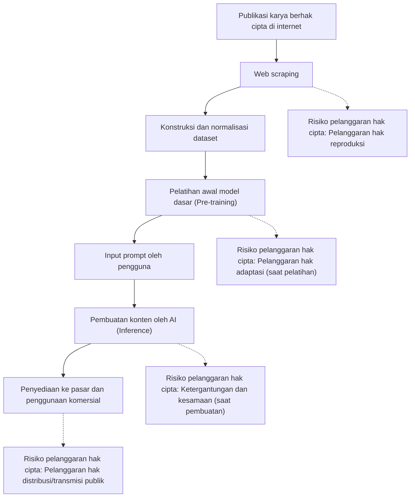
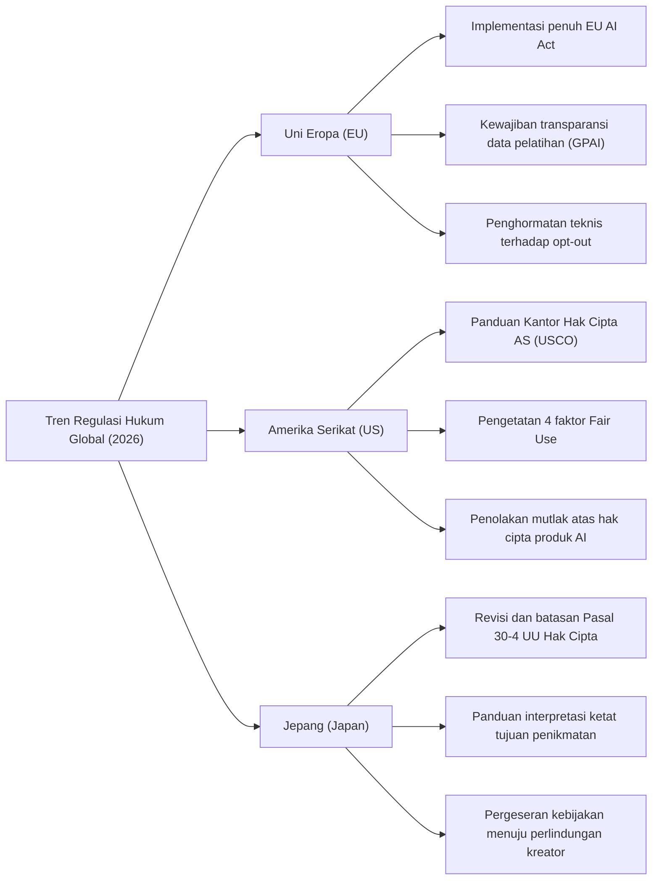
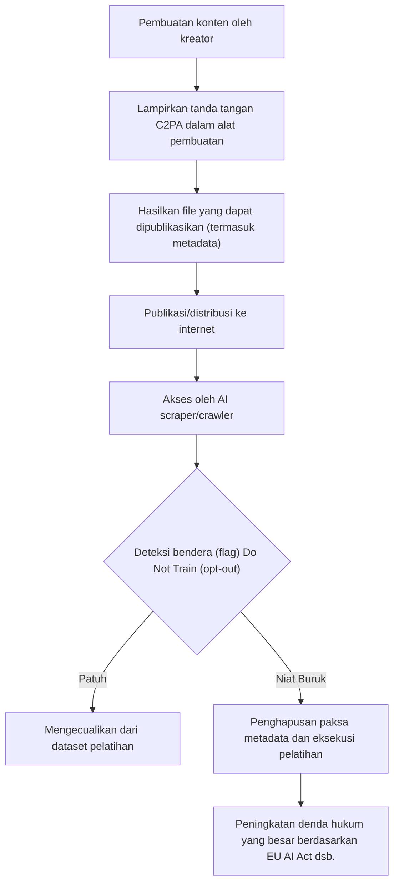

## 1. Pendahuluan: Pergeseran Paradigma Baru AI Generatif dan Hak Cipta di Tahun 2026

Pada tahun 2026, evolusi teknologi AI Generatif telah mencapai tingkat yang secara fundamental mengubah proses kreatif umat manusia, mencakup pembuatan otomatis dari teks, gambar, audio, video, hingga model 3D dan kode perangkat lunak yang kompleks. Sementara Large Language Models (LLM) kelas GPT-5 dan model difusi generasi berikutnya telah memantapkan diri sebagai infrastruktur sosial, perdebatan seputar legalitas "Data Pelatihan" yang mendukung model AI ini, serta kepemilikan hak atas "Konten yang Dihasilkan" oleh AI, akhirnya beralih dari sengketa individu di pengadilan ke fase regulasi hukum tingkat nasional dan standardisasi internasional.

Gugatan perwakilan kelompok (class action) oleh kreator dan perusahaan media besar terhadap perusahaan pengembangan AI utama yang sering terjadi antara tahun 2022 dan 2024, kini mulai menghasilkan beberapa keputusan pengadilan dan kerangka penyelesaian yang penting pada tahun 2026. Pada saat yang sama, badan legislatif di berbagai negara mulai menerapkan regulasi baru untuk mengimbangi kecepatan evolusi teknologi. Di era saat ini, di mana dua nilai yang saling bertentangan berbenturan secara langsung—manfaat ekonomi yang luar biasa (peningkatan produktivitas) yang dibawa oleh teknologi AI dan perlindungan hak-hak kreator yang telah memelihara budaya—sangatlah penting bagi praktisi perusahaan, insinyur, dan kreator itu sendiri untuk secara akurat memahami lanskap hukumnya.

Artikel ini akan memberikan penjelasan yang sangat rinci dari sudut pandang hukum dan teknis mengenai tren regulasi global mengenai AI generatif dan hak cipta per tahun 2026, langkah pertahanan teknis untuk kreator (data poisoning dan bukti asal-usul), serta prospek di masa depan.

---

## 2. Mekanisme Pelanggaran Hak Cipta: Penafsiran Hukum dan Risiko dalam 3 Fase

Untuk menyusun masalah hak cipta dan AI generatif dengan akurat, kita perlu membagi keseluruhan siklus hidup AI menjadi tiga fase: "Pelatihan", "Pembuatan", dan "Pemanfaatan". Dalam sistem hukum tahun 2026, sifat hak yang dipertanyakan pada masing-masing fase telah menjadi lebih jelas.

### 2.1. "Hak Reproduksi" dan "Hak Adaptasi" dalam Fase Pelatihan (Input)
Untuk membangun model dasar, data teks, gambar, dan kode yang sangat besar di internet harus dikumpulkan (Web scraping) dan digunakan untuk melatih AI. Dalam proses konstruksi dataset ini, karya-karya yang dilindungi hak cipta disalin ke memori sementara atau penyimpanan server, sehingga pada prinsipnya, pelanggaran "hak reproduksi" menjadi sebuah masalah.

Secara tradisional, perusahaan pengembangan AI berargumen bahwa "reproduksi ini untuk tujuan analisis informasi dan hanya pemrosesan mekanis, sehingga ini sah" atau "termasuk dalam penggunaan wajar". Namun, dalam yurisprudensi dan diskusi hukum terbaru tahun 2026, sifat dari "ekspresi fitur" yang diekstraksi model AI dari data menjadi fokus utamanya.
Jika sebuah model AI menginternalisasi "ciri-ciri esensial dari ekspresi" sebuah karya berhak cipta tertentu sebagai bobot jaringan (parameter), dan model tersebut kemudian mampu mengekstraksinya seperti aslinya (yang disebut "Overfitting" atau "Memorization"), pandangan yang menguat adalah bahwa hal itu lebih dari sekadar analisis informasi mekanis dan dianggap sebagai "Adaptasi".

### 2.2. "Ketergantungan" dan "Kesamaan" dalam Fase Pembuatan (Output)
Ini adalah fase inferensi di mana pengguna memasukkan prompt dan AI menghasilkan konten. Jika gambar atau teks yang dihasilkan sangat mirip dengan karya berhak cipta tertentu yang sudah ada, ini berpotensi menjadi pelanggaran hak cipta.

Dua elemen utama untuk menetapkan pelanggaran hak cipta adalah "ketergantungan (apakah ia mengetahui karya target dan membuatnya berdasarkan karya tersebut)" dan "kesamaan (apakah fitur esensial dari ekspresi tersebut dapat dirasakan secara langsung)".
Dalam kasus AI, berbeda dengan kreator manusia, menilai persyaratan subjektif dari "apakah AI mengetahui karya tersebut" telah lama menjadi tantangan. Dalam putusan yudisial tahun 2026, pendekatan di mana "jika fakta bahwa model AI telah membaca karya tersebut sebagai data pelatihan terbukti, maka ketergantungan sangat disimpulkan (pembalikan beban pembuktian secara de facto)" mulai diakui. Akibatnya, transparansi mengenai "dataset seperti apa yang digunakan perusahaan AI untuk pelatihannya" telah menjadi hal yang sangat penting dalam menilai pelanggaran.

### 2.3. Fase Pemanfaatan (Tanggung Jawab Pengguna dan Ganti Rugi Perusahaan)
Ini adalah fase di mana pengguna mempublikasikan, menjual, atau secara komersial menggunakan konten yang dihasilkan. Jika alat AI hanya digunakan sebagai sebuah "alat", pihak utama yang bertanggung jawab langsung atas pelanggaran hak cipta adalah pengguna yang memasukkan prompt dan mempublikasikan output-nya.
Untuk layanan AI tingkat perusahaan (seperti Copilot dan AI penghasil gambar versi perusahaan) pada tahun 2026, menyediakan "klausul ganti rugi (indemnity)"—di mana perusahaan AI mengkompensasi pengguna atas risiko pelanggaran hak cipta—telah menjadi standar industri. Namun, ini hanyalah pemindahan risiko secara kontraktual dalam konteks B2B, dan tidak melegalkan tindakan pelanggaran di bawah undang-undang hak cipta. Sangat penting bagi perusahaan yang menggunakannya untuk membangun sistem tata kelola internal untuk memeriksa apakah konten yang dihasilkan melanggar hak cipta pihak lain.

---

## 3. Tren Regulasi Hukum di Negara dan Wilayah Utama Tahun 2026

Berbagai negara di dunia mengadopsi pendekatan yang sama sekali berbeda untuk menyeimbangkan kepentingan nasional yang bertentangan: memperkuat daya saing nasional dengan mendorong inovasi AI dan melindungi kreator serta pemegang hak cipta. Di sini kita membandingkan dan menganalisis posisi regulasi hukum saat ini di Eropa, Amerika Serikat, dan Jepang pada tahun 2026.

### 3.1. Uni Eropa (EU): Implementasi Penuh EU AI Act dan Ketegasan Persyaratan Transparansi
Disahkan pada tahun 2024, dan mencapai tahap implementasi penuh pada tahun 2026 melalui masa transisi bertahap, "UU AI Uni Eropa (EU AI Act)" merupakan kerangka regulasi AI paling ketat di dunia. Dampak terbesarnya pada konteks hak cipta adalah pengenaan **"kewajiban transparansi"** dan **"kewajiban kepatuhan hukum hak cipta Uni Eropa"** bagi para pengembang model AI Tujuan Umum (GPAI: General Purpose AI).

Di bawah UU AI Uni Eropa, penyedia GPAI diwajibkan untuk mempublikasikan "ringkasan yang cukup terperinci" dari konten yang digunakan untuk melatih AI-nya. Per 2026, tingkat kerincian hukum dari "ringkasan yang cukup terperinci" ini telah diperjelas oleh Pengadilan Keadilan Uni Eropa dan pedoman dari Kantor AI Eropa, yang mana deskripsi abstrak seperti "Kami menggunakan dataset publik Common Crawl" kini dianggap ilegal. Pengungkapan daftar URL dataset yang spesifik, daftar domain utama yang padat akan materi berhak cipta, dan proses pengecualian data (status pemrosesan opt-out) diwajibkan secara ketat.

Selanjutnya, sesuai dengan "pengecualian TDM (Text and Data Mining)" di bawah Pasal 4 Pedoman Hak Cipta di Pasar Tunggal Digital Eropa (DSM Directive), ketika pemegang hak menyisihkan (opt-out) penggunaan data pelatihannya dengan cara yang dapat dibaca mesin (seperti robots.txt dan C2PA yang akan dijelaskan nanti), tertulis jelas bahwa perusahaan AI diwajibkan secara teknis dan sistematis untuk menghormati keinginan ini dan mengecualikannya dari dataset mereka. Pelanggaran terhadap hal ini membawa risiko penalti finansial dalam jumlah besar yang proporsional dengan persentase penjualan global mereka.

### 3.2. Amerika Serikat (US): Redefinisi Fair Use dan Sikap Ketat USCO
Di AS, pusat industri AI, prinsip "Penggunaan Wajar (Fair Use)" dalam Bagian 107 Undang-Undang Hak Cipta yang ada, dan bukan regulasi AI langsung yang ditetapkan melalui undang-undang tertulis, telah menjadi medan pertempuran untuk menentukan legalitas pelatihan AI.
Didorong oleh keputusan Mahkamah Agung dalam "Andy Warhol Foundation v. Goldsmith" tahun 2023, kriteria penentuan Penggunaan Wajar di AS menjadi sangat ketat, terutama interpretasi elemen pertama, "tujuan dan karakter penggunaan (apakah bersifat transformatif)".

Dalam preseden penting di tingkat pengadilan distrik federal yang terakumulasi hingga 2026 (seperti penyelesaian dan keputusan substansial dalam gugatan New York Times vs. OpenAI), pengadilan telah mulai menunjukkan kriteria berikut:
"Jika sebuah AI belajar dari karya aslinya dan memiliki kemampuan untuk menghasilkan pengganti yang bersaing secara langsung di pasar dengan karya asli (misalnya, ringkasan berita yang persis sama dengan artikel NYT, atau foto stok yang sangat mirip dengan gambar Getty), tindakan pelatihan tersebut akan menyebabkan efek merugikan langsung di pasar (elemen ke-4 dari Penggunaan Wajar), dan dengan demikian tidak dilindungi sebagai penggunaan wajar secara keseluruhan."

Selain itu, Kantor Hak Cipta Amerika Serikat (USCO) terus mempertahankan kebijakan untuk tidak menerima pendaftaran hak cipta untuk konten yang dibuat secara mandiri oleh AI, karena di sana tidak ada unsur "kepenulisan kreatif" oleh manusia. Dalam panduan operasional terbaru 2026, hal ini telah dibuat lebih jelas bahwa klaim sekalipun seperti "memanfaatkan prompt engineering tingkat lanjut", hanyalah dianggap sekadar "memberikan instruksi ide" dan tidak dianggap sebagai ekspresi kreatif di bawah hukum hak cipta. Untuk mengklaim hak cipta atas karya yang dihasilkan AI, harus dibuktikan bahwa manusia tersebut telah melakukan "modifikasi substansial dan kreatif (seperti retouching ekstensif di Photoshop, rekonstruksi komposisi kompleks, dll.)" terhadap output tersebut.

### 3.3. Jepang (Japan): Akhir dari "Era Free-Ride" di Bawah Pasal 30-4 Undang-Undang Hak Cipta
Jepang pernah disebut "negara yang paling menguntungkan untuk pengembangan AI di dunia" karena adanya Pasal 30-4 (Reproduksi dll., untuk Analisis Informasi), yang diperkenalkan oleh amandemen Undang-Undang Hak Cipta tahun 2018. Ketentuan ini merupakan pembatasan hak yang sangat kuat dengan membolehkan secara luas reproduksi untuk pelatihan AI, asalkan itu bukan untuk tujuan "menikmati" ide atau emosi yang diekspresikan dalam karya, tidak memandang komersial atau non-komersial, dan terlepas dari apakah data yang direproduksi diunggah secara legal atau ilegal (*meskipun nanti ada batasan mengenai belajar dari sumber bajakan).

Namun, sejak tahun 2024, dikarenakan adanya ketakutan bahwa AI generatif dapat merampas secara langsung pasar bagi ilustrator, pengisi suara, dan penulis yang sudah ada, telah terjadi penolakan kuat dari organisasi kreator. Badan Urusan Kebudayaan dan Subkomite Hak Cipta mulai membuat interpretasi mengenai "tujuan untuk menikmati" dengan lebih ketat.

Per tahun 2026, panduan hukum terbaru yang diterbitkan oleh Badan Urusan Kebudayaan memberikan pandangan yang jelas, bahwa tindakan berikut ini cenderung akan dianggap "memiliki tujuan penikmatan campuran", dan karenanya tidak tercakup oleh Pasal 30-4 (= pada prinsipnya memerlukan izin pemegang hak cipta, dan melakukannya tanpa izin akan melanggar hak cipta):
- Tindakan melakukan scraping secara intensif dan melatih AI hanya dengan karya dari kreator tertentu untuk secara sengaja meniru gaya seni atau karakter suaranya (seperti Fine-tuning, LoRA, metode pembelajaran tambahan).
- Tindakan pendaftaran database pada sistem RAG (Retrieval-Augmented Generation) yang dirancang secara spesifik dengan niat menghasilkan karakter fitur dari ekspresi karya asli apa adanya.

Dengan perubahan penafsiran ini, era "belajar dari segala data secara gratis tanpa izin" di Jepang secara otomatis berakhir. Perusahaan Jepang, seperti yang ada di Barat, juga telah beralih haluan menuju penyediaan data bersih yang hak ciptanya telah diselesaikan.

---

## 4. Signifikansi Sejarah Gugatan Internasional yang Patut Diperhatikan (2024-2026)

Mari kita ringkas status terkini pada tahun 2026 dari berbagai tuntutan hukum besar yang sangat memengaruhi pembentukan regulasi.

1. **The New York Times v. OpenAI / Microsoft**
   Kasus ini, yang diajukan pada akhir 2023, telah menjadi gugatan hukum terbesar yang melambangkan "AI Generatif dan Hak Cipta". NYT menyajikan bukti bahwa jutaan artikelnya telah dipelajari tanpa izin, dan bahwa ChatGPT secara harfiah menghafal dan memunculkan kembali artikel NYT tersebut (Memorization). Pada tahun 2026, pengadilan membuat putusan sementara bahwa "output reproduksi artikel yang sempurna oleh AI bukan merupakan penggunaan wajar", dan kedua perusahaan mencapai penyelesaian substansial dalam bentuk kontrak lisensi berskala besar. Hal ini menetapkan standar industri bahwa "pembelajaran AI atas konten berita harus dikenakan biaya kompensasi".

2. **Getty Images v. Stability AI**
   Gugatan hukum terhadap pengembang AI pembuat gambar "Stable Diffusion". Fakta bahwa tanda air (watermark) Getty Images tercetak persis pada gambar hasil AI ditampilkan sebagai bukti meyakinkan akan pelatihan ilegal. Dari hasil gugatan paralel di Inggris dan AS, pada tahun 2026, diputuskan keputusan penting bahwa "tindakan dengan sengaja menghapus atau menghindari tanda air dalam proses pelatihan sama dengan menghindari tindakan perlindungan teknis di bawah DMCA," yang mengakibatkan sanksi keras bagi perusahaan AI.

3. **GitHub Copilot Litigation (Doe v. GitHub)**
   Gugatan terhadap Copilot, yang dilatih menggunakan kode Open Source Software (OSS). Hal ini dipermasalahkan karena ia mengeluarkan kode dengan mengabaikan "kewajiban atribusi hak cipta" yang diwajibkan oleh lisensi OSS (seperti MIT dan GPL). Saat ini di tahun 2026, alat pengembangan AI secara hukum diwajibkan untuk dilengkapi dengan kemampuan (sistem pemfilteran dan atribusi) untuk mendeteksi secara real-time apakah kode yang dihasilkan tersebut cocok dengan kode OSS yang ada, dan untuk menyertakan informasi lisensinya.

---

## 5. Alat Perlindungan Diri Kreator: Teknologi Opt-Out dan Evolusi C2PA

Membangun regulasi hukum membutuhkan waktu, dan akan sulit untuk mengontrol secara penuh aktivitas lintas batas dari perusahaan AI. Karena itu, kreator dan penerbit mempercepat langkah untuk secara proaktif melindungi karya mereka menggunakan alat teknologi.

### 5.1. robots.txt dan Protokol Opt-Out TDM
Meskipun pada dasarnya `robots.txt` yang ditempatkan di direktori root situs web ditujukan untuk mengontrol perayap mesin pencari (crawlers), pada tahun 2026 hal tersebut telah menjadi sarana standar untuk secara seragam memblokir perayap pelatihan AI (misalnya `GPTBot` dari OpenAI, `Google-Extended` dari Google, `ClaudeBot` dari Anthropic).
Namun, `robots.txt` tidak mengikat secara hukum, dan memiliki kelemahan mendasar yaitu mudah diabaikan oleh peretas atau penelusur yang berbahaya. Oleh karena itu, standardisasi penanaman niat opt-out TDM (Text and Data Mining) secara langsung ke dalam header HTTP atau meta tag HTML (misalnya: `<meta name="tdm-reservation" content="1">`) dalam format yang dapat dibaca oleh mesin untuk memberikan validitas hukum (seperti W3C TDM Rep) telah diadopsi secara luas di seluruh dunia. Di bawah EU AI Act, pengabaian tag meta ini dan tetap melakukan pembaruan/scraping akan ditangani sebagai pelanggaran yang jelas.

### 5.2. C2PA dan Implementasi Asli untuk Otentikasi Asal-usul Konten
**C2PA (Coalition for Content Provenance and Authenticity)** adalah standar teknologi untuk memberikan "metadata asal-usul" yang ditandatangani secara kriptografi pada konten digital seperti gambar, video, dan audio agar tidak dapat diubah. Pada tahun 2026, kamera digital utama (Sony, Leica, Nikon, dll.), perangkat lunak pengedit gambar (Adobe Photoshop, dll.), dan bahkan aplikasi kamera bawaan di iOS dan Android, telah memiliki implementasi C2PA bawaan.

Manifest C2PA (informasi asal-usul) dapat menyertakan bendera eksplisit yang menyatakan "Gambar ini tidak boleh digunakan sebagai data pelatihan AI (Do Not Train: DNT)". Sebaliknya, ini juga dapat memasukkan tanda pembuatan AI dengan status "Gambar ini dihasilkan oleh AI", sehingga ini berfungsi baik dalam penanggulangan deepfake maupun perlindungan hak cipta. Tindakan menghilangkan metadata dengan sengaja adalah subjek hukuman sebagai "penghapusan informasi manajemen hak" di bawah undang-undang hak cipta di berbagai negara di seluruh dunia.

---

## 6. Tindakan Perlawanan Teknis: Mekanisme Keracunan Data (Glaze, Nightshade)

Sebagai "cara serangan fisik dan paling kuat" oleh para kreator terhadap perusahaan AI yang mengabaikan regulasi maupun status opt-out, apa yang telah menyebar secara meluas pada tahun 2026 adalah teknologi "Keracunan Data (Data Poisoning)". Teknologi-teknologi ini, seperti yang dicontohkan oleh **Glaze** dan **Nightshade** yang dikembangkan oleh tim peneliti Universitas Chicago, adalah pendekatan pertahanan agresif dan proaktif yang secara otomatis merusak proses pembelajaran dari AI itu sendiri secara matematis.

### 6.1. Model Matematis dari Perturbasi Permusuhan (Adversarial Perturbation)
Model AI (khususnya CNN dalam pengenalan gambar, dan model difusi dalam pembuatan gambar) tidak melihat gambar "secara visual" layaknya manusia, melainkan memprosesnya sebagai vektor numerik dalam ruang laten dimensi tinggi (Latent Space). Data poisoning adalah proses di mana noise kecil (perturbasi permusuhan) yang tidak akan diperhatikan oleh mata manusia ditambahkan ke sebuah gambar pada tingkat piksel, secara sadar dan sengaja mengecoh enkoder dari model AI tersebut.

Jika diekspresikan sebagai rumus matematika, ini didefinisikan sebagai masalah optimasi berikut:

$$ \min_{\delta} \mathcal{L}(f(x+\delta), y_{target}) $$

$$ \text{subject to } ||\delta||_p < \epsilon $$

Di mana:
- $x$ adalah gambar bersih asli (misalnya, gambar "pemandangan indah")
- $\delta$ adalah noise kecil yang ditambahkan ke gambar (vektor perturbasi)
- $f$ adalah ekstraktor fitur dari AI (enkoder)
- $y_{target}$ adalah konsep target yang dimaksudkan untuk menyalahartikan AI (misalnya, "sampah bernoise" atau "objek yang sama sekali berbeda")
- $\mathcal{L}$ adalah fungsi kerugian
- $\epsilon$ adalah ambang batas atas untuk mencegah noise tertangkap oleh penglihatan manusia (L-p norm)

Alat peracunan (poisoning tool) menyelesaikan permasalahan optimasi ini pada PC milik kreator, "meracuni" gambar tersebut, dan kemudian mengeluarkannya.

### 6.2. Glaze (Perlindungan Gaya / Aliran Seni)
Glaze adalah alat untuk melindungi "Gaya/Aliran Seni" orisinil kreator. Misalnya, ketika Anda menggunakan Glaze pada sebuah gambar ilustrasi gaya cat air yang lembut, itu akan terlihat seperti lukisan cat air bagi mata manusia. Namun, karena efek perturbasi yang diaplikasikan ($\delta$), enkoder AI $f$ akan mengenali dan mempelajari gambar tersebut sebagai vektor "lukisan cat minyak tebal" atau "kubisme abstrak".
Sebagai hasilnya, bahkan ketika prompt diberikan ke model AI yang telah melatih gambar beracun ini dengan instruksi "hasilkan dalam gaya (kreator tertentu)", hasil keluaran dari gayanya akan berbeda dan membingungkan, karena pemetaannya di dalam ruang laten telah terganggu. Hal ini secara fisik menonaktifkan kemampuan perusahaan AI untuk membuat "model salinan yang sesuai dengan gaya artis tertentu (seperti LoRA)".

### 6.3. Nightshade (Penghancuran Konsep dan Kolaps Model)
Nightshade bahkan lebih agresif daripada Glaze dan bertujuan untuk mencemari serta menghancurkan "Konsep" pada model AI itu sendiri.
Contohnya, jika kita menerapkan Nightshade pada gambar "anjing" dan mengajari AI untuk mengakuinya sebagai "kucing". Terbukti bahwa jika hanya beberapa ratus atau ribu gambar dengan peracunan khusus (Prompt-Specific Poisoning) bercampur dalam dataset, seluruh perataan konsep pada model dasar berskala besar akan hancur.
Dalam model yang tercemar oleh Nightshade, ketika pengguna meminta AI untuk "menghasilkan gambar anjing yang lucu", AI akan menghasilkan gambar aneh berupa kucing berkaki empat, atau tekstur yang sama sekali tidak masuk akal.

Pada tahun 2026, telah menjadi standar bahwa ketika kreator mengunggah gambar ke media sosial atau situs portofolio, proses peracunan ini secara otomatis dieksekusi di latar belakang melalui ekstensi peramban atau protokol desentralisasi. Oleh karenanya, karena risiko teknis yang dihadapi perusahaan AI untuk "menyalin gambar secara serampangan dari Internet" (risiko model yang dilatih dengan jutaan dolar akan hancur seketika) kini menjadi sangat tinggi, hal ini pun bekerja dengan begitu kuat sebagai pencegah tindakan pembelajaran model tanpa izin.

---

## 7. Pergeseran Strategi Perusahaan AI Generatif: Data Bersih, Lisensi, dan Data Sintetis

Dihadapkan pada regulasi hukum yang lebih ketat, risiko kalah dalam tuntutan pelanggaran hak cipta, dan ancaman terhadap teknologi keracunan data seperti Nightshade, perusahaan pengembang AI per tahun 2026 telah dipaksa untuk mengubah paradigma dan model bisnis pengembangan AI berskala besar mereka.

### 7.1. Kembali ke Dataset Bersih dan Perjuangan untuk Hegemoni
Pendekatan Silicon Valley dari masa lalu untuk "Bergerak cepat dan pecahkan berbagai hal" yang ditujukan untuk membuat dataset sangat besar dengan mengambil data internet tanpa izin (seperti dataset di wilayah tanpa hukum semacam LAION-5B), kini telah mencapai batasnya.
Sebagai gantinya, nilai dari "dataset bersih" di mana hak cipta telah sepenuhnya diselesaikan dan proses opt-out telah dilaksanakan dengan sempurna telah meroket ke angka astronomis. Perusahaan-perusahaan dengan sejumlah besar konten berlisensi internal mereka sendiri, seperti Adobe (Firefly), Getty Images, dan Shutterstock, telah membangun dominasi besar di pasar korporat dengan menyatakan bahwa mereka "bebas risiko pelanggaran hak cipta".

### 7.2. Kontrak Lisensi Besar dan Model Berbagi Pendapatan (Revenue-Share)
Telah menjadi hal yang lumrah bagi vendor AI utama (OpenAI, Google, Anthropic, Meta, dll.) untuk menyimpulkan kontrak lisensi data bernilai ratusan juta dolar setiap tahun dengan perusahaan media (The New York Times, Reddit, News Corp, dll.), layanan stok foto, penerbit besar, dan bahkan label musik.
Selain itu, kemajuan telah dicapai dalam membangun "model berbagi pendapatan" yang mengembalikan biaya langganan dan penggunaan API yang diperoleh dari konten AI generatif, kepada para kreator asli yang menyediakan data pelatihannya. Menggabungkan teknologi blockchain dan Web3 dengan C2PA, eksperimen implementasi sosial sedang aktif dilakukan menggunakan smart contract untuk secara otomatis membagikan imbalan dengan pembayaran mikro dengan menghitung seberapa jauh AI telah "mengandalkan" data pada seorang kreator berdasarkan sistem kontribusi.

### 7.3. Ketergantungan terhadap Data Sintetis dan Dilema "Kolaps Model"
Dihadapkan pada fenomena di mana data dari manusia berkurang baik secara hukum maupun fisik, yang disebut "Tembok Data (Data Wall)", perusahaan-perusahaan AI mulai secara bertahap mengajarkan sendiri model AI generasi berikutnya dengan menggunakan data yang dihasilkan oleh AI tersebut sendiri (Data Sintetis).
Namun, telah terbukti bahwa pembelajaran rekursif berulang-ulang menggunakan data sintetis semata-mata akan menyebabkan hilangnya keanekaragaman dan pembuangan atas fitur minoritas, yang pada akhirnya memicu sebuah fenomena statistik/matematis yang dikenal sebagai "Kolaps Model (Model Collapse)" yang di mana ini menurunkan kualitas output sebuah model secara fatal.
Pada akhirnya, untuk dapat terus berevolusi, AI memerlukan asupan berkelanjutan dari "data baru, berkualitas tinggi, dan orisinal yang diciptakan oleh manusia". Jika para kreator dieksploitasi sampai musnah pun, sebuah paradoks menjadi jelas: bahwa teknologi AI itu sendiri akan mencapai jalan buntu dalam evolusinya.

---

## 8. Prospek dan Rangkuman Menuju 2030

Tahun 2026 ini akan dikenang dalam sejarah sebagai tonggak peringatan ketika "periode tanpa hukum yang merintis perbatasan" dalam ranah AI Generatif akhirnya telah usai, dan kita telah masuk ke dalam "fase untuk membangun Kontrak Sosial Baru" guna memperbolehkan hukum, teknologi, serta kreativitas umat manusia secara bersama untuk dapat berdampingan.

### Agenda Penting yang Harus Diselesaikan ke Depan
1. **Mewujudkan harmonisasi hukum internasional**: Bagaimana cara mengintegrasikan pendekatan regulasi yang berbeda dari Uni Eropa (transparansi ketat), Amerika Serikat (penekanan dampak pasar berdasarkan Fair Use), dan Jepang (pengetatan kriteria dari tujuan penikmatan), untuk memastikan kepastian hukum bagi bisnis AI di tingkat global. Pembaruan di tingkat perjanjian internasional sangat mendesak diperlukan.
2. **Penciptaan "hak baru" di era AI**: Diskusi tentang apakah akan menciptakan hak baru khusus untuk pembelajaran mesin (misalnya "hak akses dan proses data" atau "hak mengklaim imbalan pembelajaran") untuk proses pembelajaran mesin AI yang tidak dapat ditangkap oleh konsep tradisional dari "reproduksi dan adaptasi".
3. **Mendefinisikan ulang kreativitas manusia dan "Bukti Kemanusiaan (Proof of Humanity)"**: Pada era ketika AI mampu menciptakan apapun dalam waktu instan dengan kualitas yang lebih unggul dibandingkan manusia, seberapa besar nilai tambah baik dalam lingkup ekonomi serta budaya bagi sebuah karya hanya dengan mencantumkan "dibuat oleh manusia dengan mencurahkan segenap jiwa raganya"? Sama seperti barang kerajinan buatan tangan yang nilainya meningkat pada era industrialisasi, nilai merek untuk karya seni buatan manusia sedang didefinisikan kembali.

Sangat tidak mungkin memundurkan kembali jam evolusi atas teknologi AI. Namun, diperlukan sebuah kombinasi kebijaksanaan dari yurisprudensi, ilmu komputer, dan masyarakat secara keseluruhan dalam melatih teknologi besar ini agar menjadi lebih baik, sekaligus menjaganya agar tidak merusak ekosistem kreator yang telah merawat berbagai nilai budaya dan seni untuk umat manusia sepanjang ribuan tahun ini.

Melihat ke arah tahun 2030, terdapat sebuah permintaan kuat tentang penciptaan "zona ekonomi digital baru" yang mana dapat mengembangkan kreativitas umat manusia secara luas dengan hidup secara ko-kreatif dalam sebuah kompensasi dan penghargaan satu sama lainnya, dibandingkan melihat para AI dan kreator tersebut menjadi bermusuhan saat mereka saling berjuang memperebutkan bagian mereka.
