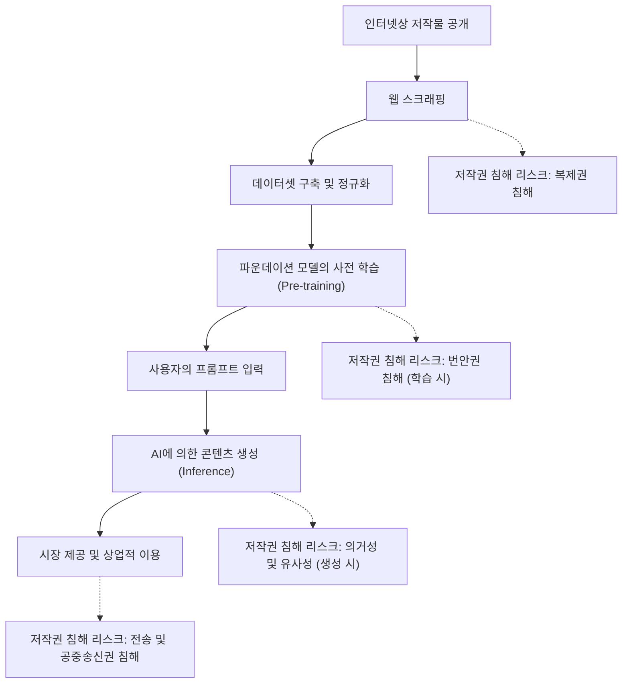
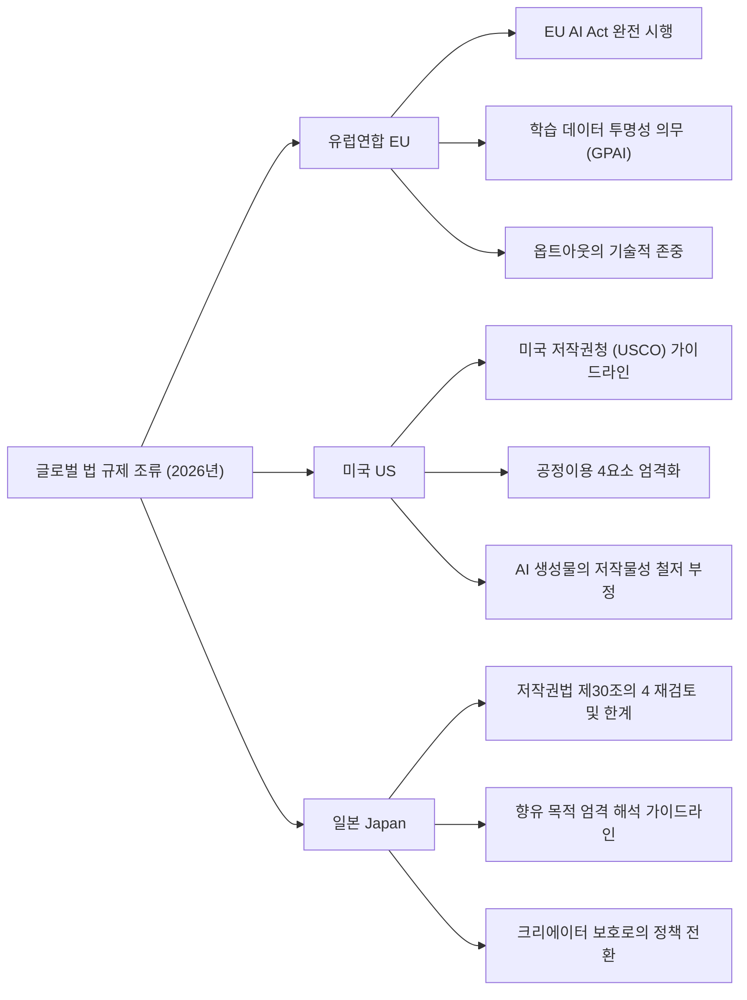
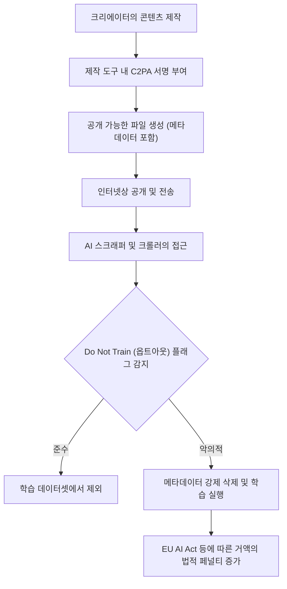

## 1. 시작하며: 2026년, 생성형 AI와 저작권의 새로운 패러다임 시프트

2026년 현재, 생성형 AI(Generative AI)의 기술적 진화는 텍스트, 이미지, 음성, 동영상, 나아가 3D 모델이나 복잡한 소프트웨어 코드의 자동 생성에 이르기까지 인류의 창조적 프로세스를 근본적으로 뒤집는 수준에 도달했습니다. GPT-5급 대규모 언어 모델(LLM)이나 차세대 Diffusion 모델(확산 모델)이 사회 인프라로 정착하는 한편, 이러한 AI 모델을 뒷받침하는 '학습 데이터(Training Data)'의 적법성, 그리고 AI가 출력한 '생성물(Generated Content)'의 권리 귀속을 둘러싼 논의는 드디어 법정에서의 개별적 다툼을 넘어 국가 수준의 법 규제 및 국제적 표준화 단계로 이행했습니다.

2022년부터 2024년까지 빈발했던 크리에이터와 대형 미디어 기업의 주요 AI 개발 기업을 향한 집단 소송(클래스 액션)은 2026년에 이르러 몇 가지 중요한 사법 판단과 화해의 틀을 만들어내고 있습니다. 동시에 각국의 입법부는 기술의 진화 속도를 따라잡기 위해 새로운 규제망을 구축하기 시작했습니다. AI 기술이 가져다주는 압도적인 경제적 혜택(생산성 향상)과 그동안 문화를 육성해 온 크리에이터의 권리 보호라는 상반된 두 가치관이 정면으로 충돌하는 현대에서, 기업의 실무 담당자와 엔지니어, 그리고 크리에이터 자신이 법적 랜드스케이프를 정확히 파악하는 것은 매우 중요합니다.

본 기사에서는 2026년 시점의 생성형 AI와 저작권에 관한 전 세계적인 법 규제 트렌드, 크리에이터 측의 기술적 방어책(데이터 포이즈닝 및 출처 증명), 그리고 향후 전망에 대해 법적·기술적 관점에서 매우 상세하게 해설합니다.

---

## 2. 저작권 침해의 메커니즘: 3가지 단계에서의 법적 해석과 리스크

생성형 AI와 저작권 문제를 정확하게 정리하기 위해서는 AI의 라이프사이클 전체를 '학습(Training)', '생성(Generation)', '이용(Exploitation)'의 3가지 단계로 나누어 생각할 필요가 있습니다. 2026년의 법 체계에서는 각 단계에서 제기되는 권리의 성질이 명확해졌습니다.

### 2.1. 학습 단계(인풋)에서의 '복제권'과 '번안권'
파운데이션 모델을 구축하기 위해서는 인터넷상의 방대한 텍스트, 이미지, 코드 데이터를 수집(웹 스크래핑)하여 AI 학습에 사용해야 합니다. 이 데이터셋 구축 프로세스에서 서버의 임시 메모리나 스토리지에 저작물이 복사되기 때문에 원칙적으로 '복제권' 침해가 문제가 됩니다.

기존에 AI 개발 기업은 "이 복제는 정보 해석 목적이며, 기계적인 처리에 불과하므로 적법하다" 혹은 "공정이용(Fair Use)에 해당한다"고 주장해 왔습니다. 그러나 2026년 최신 판례나 법학계의 논의에서는 AI 모델이 데이터에서 추출하는 '특징 표현'의 성질이 초점이 되고 있습니다.
만약 AI 모델이 특정 저작물의 '표현상 본질적인 특징'을 네트워크의 가중치(파라미터)로서 내재화시키고, 이를 나중에 그대로 추출 가능한 상태(이른바 '과적합(Overfitting)'이나 '암기(Memorization)')가 된 경우, 이는 단순한 기계적 정보 해석을 넘어선 '번안(Adaptation)'에 해당하는 것이 아닌가 하는 견해가 유력하게 대두되고 있습니다.

### 2.2. 생성 단계(아웃풋)에서의 '의거성'과 '유사성'
사용자가 프롬프트를 입력하고, AI가 콘텐츠를 생성하는 추론 단계입니다. 여기서 생성된 이미지나 문장이 기존의 특정 저작물과 흡사한 경우 저작권 침해가 성립될 가능성이 있습니다.

저작권 침해가 성립하기 위한 두 가지 주요 요건은 '의거성(대상이 되는 저작물을 알고, 이에 의거하여 작성했는가)'과 '유사성(표현상 본질적인 특징을 직접 감지할 수 있는가)'입니다.
AI의 경우 인간 크리에이터와 달리 'AI가 그 작품을 알고 있었는가'라는 주관적인 요건을 어떻게 판단할지가 오랫동안 과제였습니다. 2026년의 사법 판단에서는 "AI 모델이 학습 데이터로서 해당 저작물을 읽어 들인 사실이 증명되면 의거성은 강하게 추정된다(사실상의 입증 책임 전환)"는 접근 방식이 정착되고 있습니다. 이로 인해 AI 기업이 '어떤 데이터셋으로 학습했는가'라는 투명성이 침해 판단에서 매우 중요한 의미를 갖게 되었습니다.

### 2.3. 이용 단계(사용자의 책임과 기업의 면책·보상)
생성된 콘텐츠를 사용자가 공개·판매·상업적으로 이용하는 단계입니다. AI 도구를 단순한 '도구'로 사용한 것에 불과할 경우, 저작권 침해의 직접적인 주체는 프롬프트를 입력하고 출력물을 공개한 사용자가 됩니다.
2026년의 기업용 AI 서비스(Copilot이나 기업용 이미지 생성 AI 등)에서는 AI 기업이 사용자의 저작권 침해 리스크를 보상하는 '면책·보상(Indemnity) 조항'을 두는 것이 업계 표준이 되었습니다. 그러나 이는 어디까지나 B2B 계약상 리스크를 이전하는 것에 불과하며, 저작권법상 침해 행위 자체가 합법화되는 것은 아닙니다. 이용 기업은 생성물이 타인의 권리를 침해하지 않는지 스크리닝하는 내부 거버넌스 체제의 구축이 필수가 되었습니다.

---

## 3. 주요 국가 및 지역의 법 규제 트렌드 2026

세계 각국은 AI 혁신 촉진을 통한 국가 경쟁력 강화와 크리에이터·저작권자 보호라는 상반된 국익의 균형을 맞추기 위해 각각 전혀 다른 접근 방식을 채택하고 있습니다. 2026년 유럽, 미국, 일본의 법 규제 현주소를 상세히 비교 및 분석합니다.

### 3.1. 유럽연합(EU): EU AI Act 완전 시행과 투명성 요건의 압박
2024년에 성립되어 단계적인 이행 기간을 거쳐 2026년에 완전 시행 단계에 접어든 'EU AI법(EU AI Act)'은 세계에서 가장 엄격한 AI 규제 프레임워크입니다. 저작권의 맥락에서 가장 큰 영향을 미치고 있는 것이 범용 AI(GPAI: General Purpose AI) 모델 개발자에게 부과되는 **'투명성 의무'**와 **'EU 저작권법 준수 의무'**입니다.

EU AI법 하에서 GPAI 제공자는 AI 학습에 사용된 콘텐츠의 '충분히 상세한 요약(Sufficiently detailed summary)'을 일반에 공개할 의무를 집니다. 2026년 현재, 이 '충분히 상세한 요약'의 법적 입도(Granularity)가 EU 사법재판소나 유럽 AI청(AI Office) 가이드라인을 통해 명확해져, 단순히 "공개 데이터셋인 Common Crawl을 사용했습니다"와 같은 추상적인 기술은 위법으로 간주되게 되었습니다. 구체적인 데이터셋의 URL 목록, 저작권자가 밀집한 주요 도메인 목록, 그리고 데이터 제외 프로세스(옵트아웃 처리 상황)의 공개가 엄격히 요구되고 있습니다.

더욱이, EU 디지털 단일 시장에서의 저작권 지침(DSM 지침) 제4조에 따른 'TDM(텍스트 및 데이터 마이닝) 예외'에 따라, 권리자가 기계가 판독 가능한 방법(후술할 robots.txt나 C2PA 등)으로 학습 데이터 이용을 옵트아웃한 경우, AI 기업은 그 의사를 기술적·시스템적으로 존중하여 데이터셋에서 제외해야 할 의무가 명문화되었습니다. 이를 위반할 경우 전 세계 매출의 일정 비율에 해당하는 거액의 제재금을 부과받을 위험이 있습니다.

### 3.2. 미국(US): 공정이용의 재정의와 USCO의 엄격한 자세
AI 산업의 중심지인 미국에서는 성문법에 의한 직접적인 AI 규제가 아니라 기존 저작권법 제107조에 규정된 '공정이용(Fair Use)'의 법리가 AI 학습의 적법성을 결정하는 전장이 되고 있습니다.
2023년 '앤디 워홀 재단 대 골드스미스 사건(Andy Warhol Foundation v. Goldsmith)' 대법원 판결을 계기로, 미국 내 공정이용 판단 기준, 특히 제1요소인 '이용 목적과 성격(변형적 이용인지 여부)'에 대한 해석이 매우 엄격해졌습니다.

2026년까지 쌓인 연방지법 수준의 중요 판례(예: 뉴욕타임스 대 OpenAI 소송 등의 실질적 판결이나 화해)에서 법정은 다음과 같은 기준을 제시하기 시작했습니다.
"AI가 원저작물로부터 학습하여 원저작물과 시장에서 직접적으로 경합하는 대체품(예를 들어, NYT 기사와 똑 닮은 뉴스 요약이나 Getty의 이미지와 흡사한 스톡 사진)을 생성할 능력을 갖춘 경우, 그 학습 행위는 시장에 직접적인 악영향(공정이용 제4요소) 초래하므로 전체적으로 공정이용으로서 보호받지 못한다."

또한, 미국 저작권청(USCO)은 AI가 자율적으로 생성한 콘텐츠에는 인간에 의한 '창조적 기여(Creative Authorship)'가 존재하지 않으므로 저작권 등록을 일절 인정하지 않겠다는 방침을 계속 견지하고 있습니다. 2026년 최신 운영 가이드라인에서는 "고도화된 프롬프트 엔지니어링을 구사했다"는 주장이라 할지라도 그것은 단순한 '아이디어 지시(커미션)'에 불과하며, 저작권법상 창작적 표현으로 인정받을 수 없음이 더욱 명확해졌습니다. AI 출력물에 대한 저작권을 주장하기 위해서는 인간이 그 출력물에 대해 '실질적이고 창조적인 개변(Photoshop을 통한 대폭적인 리터치나 복잡한 구도의 재구성 등)'을 가했음을 증명해야 합니다.

### 3.3. 일본(Japan): 저작권법 제30조의 4에 따른 '무임승차 시대'의 종언
일본은 2018년 저작권법 개정에 의해 도입된 제30조의 4(정보 해석을 위한 복제 등)에 따라 '세계에서 가장 AI 개발에 유리한 국가'로 불려왔습니다. 이 조문은 저작물에 표현된 사상 또는 감정의 '향유'를 목적으로 하지 않는 한, 영리·비영리를 불문하고, 또한 복제 원본 데이터가 적법하게 혹은 위법하게 업로드된 것인지를 불문하고(※단, 해적판을 통한 학습에는 나중에 제한이 추가되었습니다) AI 학습을 위한 복제를 널리 인정하는 매우 강력한 권리 제한 규정이었습니다.

그러나 2024년 이후, 생성형 AI가 기존의 일러스트레이터, 성우, 작가의 시장을 직접적으로 빼앗을 수 있다는 우려로 크리에이터 단체의 거센 반발이 일어났고, 문화청 및 저작권 분과회에서 '향유 목적' 해석을 엄격히 하는 작업이 진행되었습니다.

2026년 현재 문화청이 발행한 최신 법적 가이드라인에서는 아래의 행위가 '향유 목적이 혼재되어 있다'고 간주되어 제30조의 4 적용 대상에서 제외(=원칙적으로 저작권자의 허락이 필요하며, 무단으로 행하면 저작권 침해)될 가능성이 높다는 명확한 견해를 제시하고 있습니다.
- 특정 크리에이터의 화풍이나 목소리를 의도적으로 모방하기 위해(파인튜닝, LoRA, 추가 학습 등의 기법) 그 크리에이터의 작품만을 집중적으로 스크래핑하여 학습시키는 행위.
- 원저작물의 표현상 특징을 그대로 출력시킬 의도로 설계된 RAG(검색 증강 생성) 시스템의 데이터베이스 등록 행위.

이러한 해석 변경으로 인해 일본 국내에서 '어떤 데이터든 무단 학습을 통한 무임승차가 가능'하던 시대는 사실상 종언을 고했습니다. 일본 기업들도 구미권과 마찬가지로 권리 처리가 완료된 클린 데이터의 조달로 방향을 틀고 있습니다.

---

## 4. 2024~2026년 주목해야 할 국제 소송의 역사적 의의

법 규제 형성에 지대한 영향을 미친 주요 소송의 2026년 시점 현주소를 정리합니다.

1. **The New York Times v. OpenAI / Microsoft**
   2023년 말 제소된 이 사건은 '생성형 AI와 저작권'을 상징하는 최대 소송이 되었습니다. NYT는 자사의 수백만 건의 기사가 무단으로 학습되어, ChatGPT가 NYT 기사를 거의 통째로 암기하여 출력(Memorization)하고 있다는 증거를 제시했습니다. 2026년 법원은 "AI에 의한 기사의 완벽한 재현 출력은 공정이용을 구성하지 않는다"는 중간 판단을 내렸고, 양사는 거액의 라이선스 계약을 맺는 형태로 실질적인 화해에 이르렀습니다. 이는 "뉴스 콘텐츠의 AI 학습은 유상이어야 한다"는 업계 표준을 결정지었습니다.

2. **Getty Images v. Stability AI**
   이미지 생성 AI 'Stable Diffusion' 개발사에 대한 소송. Getty의 워터마크가 그대로 AI 생성 이미지에 출력된 것이 무단 학습의 결정적인 증거로 제시되었습니다. 영국과 미국에서 병행된 소송 결과, 2026년에는 "워터마크를 의도적으로 제거 및 회피하여 학습하는 행위는 디지털 밀레니엄 저작권법(DMCA)상 기술적 보호 조치 우회에 해당한다"는 획기적인 판단이 내려져 AI 기업에 엄격한 페널티가 부과되었습니다.

3. **GitHub Copilot Litigation (Doe v. GitHub)**
   오픈소스 소프트웨어(OSS) 코드를 학습한 Copilot에 대한 소송. OSS 라이선스(MIT나 GPL 등)가 요구하는 '저작권 표시 의무(Attribution)'를 무시하고 코드를 출력하는 점이 쟁점이 되었습니다. 2026년 현재, AI 개발 도구에는 출력된 코드가 기존 OSS 코드와 일치하는지 여부를 실시간으로 감지하고 라이선스 정보를 부여하는 기능(필터링 및 출처 표기 시스템)의 탑재가 법적으로 의무화되는 추세입니다.

---

## 5. 저작자의 자기 방어 수단: 옵트아웃 기술과 C2PA의 진화

법 규제 정비에는 시간이 걸리며, 국경을 넘나드는 AI 기업의 활동을 완전히 통제하는 것은 어렵습니다. 이 때문에 크리에이터나 퍼블리셔는 기술적 수단을 이용하여 자신의 저작물을 주체적으로 보호하려는 움직임을 가속화하고 있습니다.

### 5.1. robots.txt와 TDM 옵트아웃 프로토콜
웹 사이트의 루트 디렉토리에 배치되는 `robots.txt`는 본래 검색 엔진 크롤러를 제어하기 위한 프로토콜이지만, 2026년에는 AI 학습용 크롤러(예: OpenAI의 `GPTBot`, Google의 `Google-Extended`, Anthropic의 `ClaudeBot`)를 일괄적으로 차단하기 위한 표준적인 수단으로 자리 잡았습니다.
그러나 `robots.txt`에는 법적 구속력이 없어 악의적인 스크래퍼에게는 쉽게 무시된다는 근본적인 결함이 있습니다. 이 때문에 TDM(Text and Data Mining) 옵트아웃 의사를 HTTP 헤더나 HTML 메타 태그(예: `<meta name="tdm-reservation" content="1">`)에 직접 내장하여 기계가 판독 가능한 형태로 법적 효력을 갖게 하는 표준화(W3C TDM Rep 등)가 전 세계적으로 보급되었습니다. EU AI Act 하에서는 이 메타 태그를 무시하고 스크래핑을 할 경우 명확한 위법 행위로 취급됩니다.

### 5.2. C2PA와 콘텐츠 출처 인증의 네이티브 구현
**C2PA(Coalition for Content Provenance and Authenticity)**는 이미지나 동영상, 음성 등의 디지털 콘텐츠에 암호학적으로 서명된 위변조가 불가능한 '출처 메타데이터'를 부여하는 기술 표준입니다. 2026년에는 주요 디지털 카메라(Sony, Leica, Nikon 등)나 이미지 편집 소프트웨어(Adobe Photoshop 등), 나아가 iOS와 Android의 기본 카메라 앱에 C2PA가 네이티브로 구현되어 있습니다.

C2PA 매니페스트(출처 정보)에는 "이 이미지는 AI 학습 데이터로 사용해서는 안 된다(Do Not Train: DNT)"는 명확한 플래그를 포함할 수 있습니다. 또한 반대로 "이 이미지는 AI에 의해 생성된 것이다"라는 AI 생성 마크도 부여되기 때문에 딥페이크 대책과 저작권 보호라는 두 바퀴의 역할을 하고 있습니다. 메타데이터를 의도적으로 스트리핑(제거)하는 행위는 전 세계 각국의 저작권법에서 '권리 관리 정보 제거'로 분류되어 처벌 대상이 됩니다.

---

## 6. 기술적 대항 조치: 데이터 포이즈닝(Glaze, Nightshade)의 메커니즘

법 규제나 옵트아웃 의사 표시조차 무시하는 AI 기업에 대해 크리에이터의 "가장 강력하고 물리적인 대항 수단"으로서 2026년에 널리 보급되고 있는 것이 '데이터 포이즈닝(Data Poisoning)' 기술입니다. 시카고 대학 연구팀이 개발한 **Glaze(글레이즈)**나 **Nightshade(나이트셰이드)**로 대표되는 이 기술들은 AI 학습 프로세스 자체를 수학적으로 파괴하는 공격적이고 능동적인 방어 수단입니다.

### 6.1. 적대적 섭동(Adversarial Perturbation)의 수리 모델
AI 모델(특히 이미지 인식의 CNN이나 생성에서의 Diffusion 모델)은 이미지를 인간과 동일하게 '시각적'으로 보는 것이 아니라 고차원 잠재 공간(Latent Space)에서의 수치 벡터로 처리하고 있습니다. 데이터 포이즈닝은 인간의 눈으로는 전혀 알아차릴 수 없는 미세한 노이즈(적대적 섭동)를 픽셀 단위로 이미지에 부여함으로써 AI 모델의 인코더가 의도적으로 오인하게 만듭니다.

이를 수식으로 나타내면 다음과 같은 최적화 문제로 정의됩니다.

$$ \min_{\delta} \mathcal{L}(f(x+\delta), y_{target}) $$

$$ \text{subject to } ||\delta||_p < \epsilon $$

여기서:
- $x$는 원본 클린 이미지(예: '아름다운 풍경' 이미지)
- $\delta$는 이미지에 더하는 미세한 노이즈(섭동 벡터)
- $f$는 AI의 특징 추출기(인코더)
- $y_{target}$은 AI가 오인하게 만들 타깃 개념(예: '노이즈투성이 쓰레기'나 '완전히 다른 물체')
- $\mathcal{L}$은 손실 함수
- $\epsilon$은 인간의 시각으로 노이즈가 지각되지 않기 위한 상한 임계값(L-p 노름)

포이즈닝 도구는 크리에이터의 PC에서 이 최적화 문제를 풀고, 이미지를 '독화(Poisoning)'한 후 출력합니다.

### 6.2. Glaze(스타일 및 화풍 보호)
Glaze는 크리에이터 고유의 '화풍(Style)'을 보호하기 위한 도구입니다. 예를 들어 섬세한 수채화풍 일러스트에 Glaze를 적용하면 인간의 눈에는 그대로 수채화로 보입니다. 그러나 AI 인코더 $f$는 부여된 섭동 $\delta$의 영향으로 그 이미지를 '두껍게 칠해진 유화'나 '추상적인 입체파'의 벡터로 인식하고 학습해 버립니다.
그 결과, 이 독화 이미지를 학습한 AI 모델에 대해 "(해당 크리에이터)의 화풍으로 생성해 줘"라고 프롬프트를 주어도 잠재 공간의 매핑이 엉망이 되어 전혀 다른 엉뚱한 화풍이 출력되게 됩니다. AI 기업의 '특정 크리에이터 작풍의 복제 모델(LoRA 등)' 제작을 물리적으로 무효화합니다.

### 6.3. Nightshade(개념 파괴와 모델 붕괴)
Nightshade는 Glaze보다 한층 더 공격적이며, AI 모델의 '개념(Concept)' 그 자체를 오염시키고 파괴하는 것을 목적으로 합니다.
예를 들어, '개' 이미지에 Nightshade를 적용하여 AI에게 '고양이'로 학습시킵니다. 이러한 프롬프트 고유의 포이즈닝(Prompt-Specific Poisoning)이 처리된 이미지가 데이터셋 내 단 수백~수천 장 섞이는 것만으로도 대규모 파운데이션 모델 전체의 개념 정렬(Alignment)이 붕괴된다는 사실이 입증되었습니다.
Nightshade에 오염된 모델에서는 사용자가 "귀여운 강아지 이미지를 생성해 줘"라고 AI에 지시해도 AI는 다리가 네 개 달린 기괴한 고양이 이미지나 전혀 의미를 알 수 없는 텍스처를 출력하게 됩니다.

2026년에는 크리에이터가 이미지를 SNS나 포트폴리오 사이트에 업로드할 때 브라우저 확장 기능이나 분산형 프로토콜을 통해 이러한 포이즈닝 처리가 자동으로 백그라운드에서 진행되는 것이 표준화되었습니다. 이로 인해 AI 기업이 '인터넷에서 무차별적으로 이미지를 스크래핑하는' 기술적 리스크(수십억 원을 들여 학습한 모델이 한순간에 붕괴될 리스크)가 매우 높아졌고, 결과적으로 무단 학습 억지력으로 강력하게 작용하고 있습니다.

---

## 7. 생성형 AI 기업의 전략 전환: 클린 데이터, 라이선스, 그리고 합성 데이터

법 규제 강화, 저작권 침해 소송 패소 리스크, 그리고 Nightshade와 같은 데이터 포이즈닝 기술의 위협에 직면한 AI 개발 기업들은 2026년 현재 AI 개발의 패러다임과 비즈니스 모델을 대규모로 전환할 수밖에 없는 상황에 이르렀습니다.

### 7.1. 클린 데이터셋으로의 회귀와 패권 경쟁
더 이상 인터넷상의 모든 데이터를 무단으로 스크래핑하여 거대한 데이터셋(LAION-5B 등 무법지대 데이터셋)을 구축한다는 과거의 'Move fast and break things(빠르게 움직이고 파괴하라)'라는 실리콘밸리식 접근법은 한계에 다다랐습니다.
대신 완벽하게 저작권이 해결되고 옵트아웃 처리가 완비된 '클린 데이터셋'의 가치가 천문학적으로 치솟고 있습니다. Adobe(Firefly)나 Getty Images, Shutterstock처럼 자체적으로 방대한 라이선스 취득 콘텐츠를 보유한 기업들이 '저작권 침해 리스크 제로'를 내세워 기업용(엔터프라이즈) 시장에서 압도적인 우위를 확립했습니다.

### 7.2. 거액의 라이선스 계약과 수익 분배(Revenue Share) 모델
주요 AI 벤더(OpenAI, Google, Anthropic, Meta 등)가 미디어 기업(The New York Times, Reddit, News Corp 등)이나 스톡 사진 서비스, 대형 출판사, 나아가 음반사와 연간 수천억 원 규모의 데이터 라이선스 계약을 체결하는 것이 일반화되었습니다.
또한, AI가 생성한 콘텐츠로 얻은 구독 수익이나 API 이용료를 학습 데이터를 제공한 원작 크리에이터에게 환원하는 '수익 분배(Revenue Share) 모델' 구축이 진행되고 있습니다. 블록체인·Web3 기술과 C2PA를 결합한 스마트 컨트랙트를 통해 AI가 어떤 크리에이터의 데이터에 '의거'하여 출력했는지를 기여도 기반으로 산출하고 마이크로 페이먼트로 자동 보상을 분배하는 시스템의 사회 구현 실험이 활발히 이루어지고 있습니다.

### 7.3. 합성 데이터(Synthetic Data)에 대한 의존과 '모델 붕괴'의 딜레마
인간의 데이터가 법적으로, 혹은 물리적으로(포이즈닝에 의해) 고갈되는 현상, 이른바 '데이터 월(Data Wall)'에 직면한 AI 기업은 AI 스스로 생성한 데이터(합성 데이터: Synthetic Data)를 사용하여 차세대 AI 모델을 자가 학습시키는 접근을 본격화했습니다.
그러나 합성 데이터만으로 재귀적인 학습을 반복하면 데이터 다양성이 사라지고 소수자적 특성이 버려지면서 최종적으로 모델의 출력 품질이 치명적으로 열화되는 'Model Collapse(모델 붕괴)'라는 수학적·통계적 현상이 발생한다는 사실이 입증되었습니다.
결국 AI가 계속해서 진화하기 위해서는 '인간이 새롭게 만들어낸 고품질의 오리지널 데이터'의 지속적인 공급이 필수적이며, 크리에이터를 착취하여 멸종시켜 버리면 AI 기술 자체도 진화의 막다른 길에 빠지고 마는 역설이 분명해졌습니다.

---

## 8. 2030년을 향한 전망 및 요약

2026년이라는 해는 생성형 AI의 '무법지대 개척기'가 완전히 끝을 고하고, 법과 기술, 그리고 인간의 창조성이 공존하기 위한 '새로운 사회 계약(Social Contract) 구축기'에 들어선 기념비적인 해로 역사에 기억될 것입니다.

### 향후 해결해야 할 중요한 과제(아젠다)
1. **국제적인 법 조화 실현**: EU(엄격한 투명성), 미국(공정이용에 기반한 시장 영향 중시), 일본(향유 목적 엄격화)이라는 상이한 규제 접근법을 어떻게 통합하여 글로벌 AI 비즈니스의 법적 확실성을 담보할 것인가. 국제 조약 수준에서의 업데이트가 시급합니다.
2. **AI 시대의 '새로운 권리' 창설**: 기존의 '복제·번안'이라는 개념으로는 다 포괄할 수 없는 AI 기계 학습 프로세스에 대해 기계 학습에 특화된 새로운 권리(예를 들어 '데이터 액세스·인제스트 권리'나 '학습 보상 청구권')를 창설해야 할지 여부에 대한 논의.
3. **인간 창조성의 재정의와 'Proof of Humanity'**: AI가 인간을 능가하는 품질로 무엇이든 순식간에 만들어낼 수 있는 시대에서, "인간이 인간의 혼을 담아 창작했다는 것(Proof of Humanity)" 자체에 얼만큼의 경제적·문화적 프리미엄이 붙을 것인가. 수제 공예품이 산업화 시대에 가치를 높였듯 인간 예술의 브랜드 가치는 재정의되고 있습니다.

AI 기술 진화의 시곗바늘을 되돌리는 것은 불가능합니다. 그러나 그 강대한 기술을 길들이고 수천 년에 걸쳐 인류의 문화와 예술을 키워온 크리에이터의 생태계를 파괴하지 않도록 제어하는 것은 법학, 컴퓨터 과학, 그리고 사회 전체의 지혜에 달려 있습니다.

2030년을 향해, AI와 크리에이터가 적대하며 파이를 뺏고 뺏기는 것이 아니라 정당한 대가와 존중을 바탕으로 공창(共創)하며 인류의 창조성을 확장할 수 있는 '새로운 디지털 경제권' 확립이 지금 바로 강하게 요구되고 있습니다.
