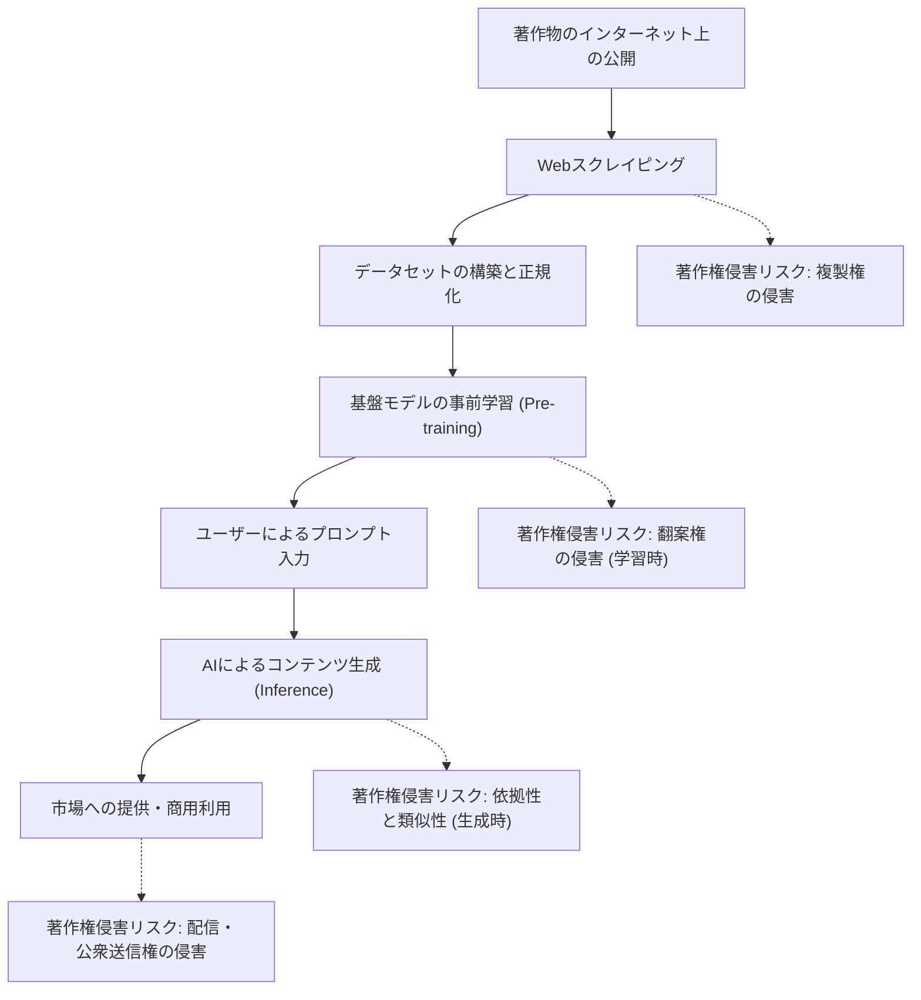
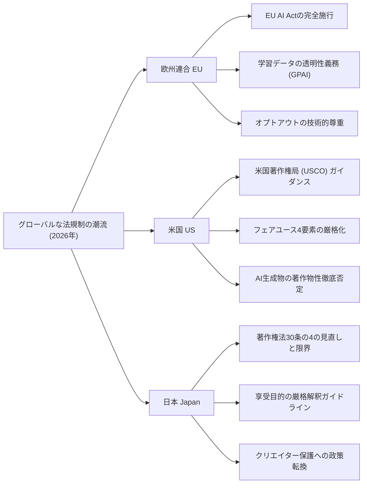
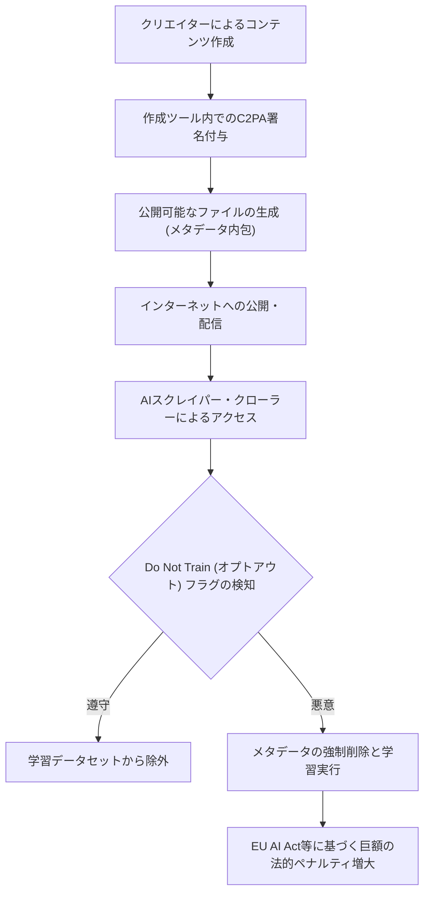

## 1. はじめに：2026年、生成AIと著作権の新たなパラダイムシフト

2026年現在、生成AI（Generative AI）の技術的進化は、テキスト、画像、音声、動画、さらには3Dモデルや複雑なソフトウェアコードの自動生成に至るまで、人類の創造的プロセスを根底から覆すレベルに到達しています。GPT-5クラスの大規模言語モデル（LLM）や、次世代のDiffusionモデル（拡散モデル）が社会インフラとして定着する一方で、これらのAIモデルを支える「学習データ（Training Data）」の適法性、そしてAIによって出力された「生成物（Generated Content）」の権利帰属を巡る議論は、いよいよ法廷での個別争いから、国家レベルの法規制・国際的な標準化のフェーズへと移行しました。

2022年から2024年にかけて頻発した、クリエイターや大手メディア企業による主要なAI開発企業への集団訴訟（クラスアクション）は、2026年に至っていくつかの重要な司法判断と和解の枠組みを生み出しつつあります。同時に、各国の立法府は技術の進化スピードに追いつくべく、新たな規制の網を掛け始めました。AI技術がもたらす圧倒的な経済的恩恵（生産性の向上）と、これまで文化を育んできたクリエイターの権利保護という、相反する二つの価値観が正面から衝突する現代において、企業の実務担当者やエンジニア、そしてクリエイター自身が法的なランドスケープを正確に把握することは極めて重要です。

本記事では、2026年時点での生成AIと著作権に関する世界的な法規制トレンド、クリエイター側の技術的な防衛策（データポイズニングや来歴証明）、そして今後の展望について、法的・技術的観点から極めて詳細に解説します。

---

## 2. 著作権侵害のメカニズム：3つのフェーズにおける法的解釈とリスク

生成AIと著作権の問題を正確に整理するためには、AIのライフサイクル全体を「学習（Training）」「生成（Generation）」「利用（Exploitation）」の3つのフェーズに分けて考える必要があります。2026年の法体系においては、それぞれのフェーズで問われる権利の性質が明確化されてきました。

### 2.1. 学習フェーズ（インプット）における「複製権」と「翻案権」
基盤モデルを構築するためには、インターネット上の膨大なテキスト、画像、コードデータを収集（Webスクレイピング）し、AIの学習に用いる必要があります。このデータセット構築プロセスにおいて、サーバーの一時メモリやストレージに著作物がコピーされるため、原則として「複製権」の侵害が問題となります。

従来、AI開発企業は「この複製は情報解析目的であり、機械的な処理に過ぎないため適法である」あるいは「フェアユースに該当する」と主張してきました。しかし、2026年の最新の裁判例や法学界の議論では、AIモデルがデータから抽出する「特徴表現」の性質が焦点となっています。
もしAIモデルが、特定の著作物の「表現上の本質的な特徴」をネットワークの重み（パラメータ）として内在化させ、それを後からそのまま抽出可能な状態（いわゆる「過学習（Overfitting）」や「丸暗記（Memorization）」）になっている場合、それは単なる機械的な情報解析を超えた「翻案（Adaptation）」に該当するのではないか、という見解が有力視されています。

### 2.2. 生成フェーズ（アウトプット）における「依拠性」と「類似性」
ユーザーがプロンプトを入力し、AIがコンテンツを生成する推論フェーズです。ここで生成された画像や文章が、既存の特定の著作物と酷似している場合、著作権侵害が成立する可能性があります。

著作権侵害が成立するための二大要件は「依拠性（対象となる著作物を知っていて、それに依拠して作成したか）」と「類似性（表現上の本質的な特徴が直接感得できるか）」です。
AIの場合、人間のクリエイターとは異なり「AIがその作品を知っていたか」という主観的な要件をどう判断するかが長らく課題でした。2026年の司法判断では、「AIモデルが学習データとして当該著作物を読み込んでいた事実が証明されれば、依拠性は強く推認される（事実上の立証責任の転換）」というアプローチが定着しつつあります。これにより、AI企業が「どのようなデータセットで学習したか」という透明性が、侵害判断において極めて重要な意味を持つようになりました。

### 2.3. 利用フェーズ（ユーザーの責任と企業のインデムニティ）
生成されたコンテンツをユーザーが公開・販売・商用利用するフェーズです。AIツールを単なる「道具」として使用したに過ぎない場合、著作権侵害の直接的な主体はプロンプトを入力し、出力を公開したユーザーとなります。
2026年のエンタープライズ向けAIサービス（Copilotやエンタープライズ版画像生成AIなど）では、AI企業がユーザーの著作権侵害リスクを補償する「インデムニティ（免責・補償）条項」を設けることが業界標準となりました。しかし、これはあくまでB2Bの契約上のリスク移転に過ぎず、著作権法上の侵害行為自体が合法化されるわけではありません。利用企業は、生成物が他者の権利を侵害していないかをスクリーニングする内部ガバナンス体制の構築が必須となっています。

---

## 3. 主要国・地域の法規制トレンド2026

世界各国は、AIのイノベーション促進による国家競争力の強化と、クリエイター・著作権者保護という相反する国益のバランスを取るため、それぞれ全く異なるアプローチを採用しています。2026年における欧州、米国、日本の法規制の現在地を詳細に比較・分析します。

### 3.1. 欧州連合（EU）：EU AI Actの完全施行と透明性要件の牙
2024年に成立し、段階的な移行期間を経て2026年に完全施行の段階を迎えた「EU AI法（EU AI Act）」は、世界で最も厳格なAI規制フレームワークです。著作権の文脈で最も大きな影響を与えているのが、汎用AI（GPAI: General Purpose AI）モデルの開発者に対して課される**「透明性義務」**と**「EU著作権法の遵守義務」**です。

EU AI法のもとでは、GPAIのプロバイダーは、AIの学習に使用されたコンテンツの「十分に詳細な要約（Sufficiently detailed summary）」を一般公開する義務を負います。2026年現在、この「十分に詳細な要約」の法的粒度がEU司法裁判所や欧州AI局（AI Office）のガイドラインで明確化され、単に「公開データセットであるCommon Crawlを使用しました」という抽象的な記述は違法とみなされるようになりました。具体的なデータセットのURLリスト、著作権者が密集する主要ドメインのリスト、そしてデータ除外プロセス（オプトアウトの処理状況）の開示が厳格に求められています。

さらに、EUのデジタル単一市場における著作権指令（DSM指令）第4条に基づく「TDM（テキスト・アンド・データ・マイニング）例外」に従い、権利者が機械可読な方法（後述するrobots.txtやC2PA等）で学習データの利用をオプトアウトした場合、AI企業はその意思を技術的・システム的に尊重し、データセットから除外しなければならない義務が明文化されました。これに違反した場合、全世界売上の一定割合に相当する巨額の制裁金が科されるリスクがあります。

### 3.2. 米国（US）：フェアユースの再定義とUSCOの厳格な姿勢
AI産業の中心地である米国では、成文法による直接的なAI規制ではなく、既存の著作権法第107条に定める「フェアユース（Fair Use）」の法理がAI学習の適法性を決する戦場となっています。
2023年の「Andy Warhol Foundation v. Goldsmith事件」最高裁判決を契機として、米国におけるフェアユースの判断基準、特に第1要素である「利用の目的と性格（変形的利用か否か）」の解釈が極めて厳格化しました。

2026年までに積み重なった連邦地裁レベルの重要判例（例：ニューヨーク・タイムズ対OpenAI訴訟などの実質的判決や和解）において、法廷は以下のような基準を示し始めています。
「AIが元の著作物から学習し、元の著作物と市場で直接的に競合する代替品（例えば、NYTの記事とそっくりなニュース要約や、Gettyの画像に酷似したストックフォト）を生成する能力を持つ場合、その学習行為は市場への直接的な悪影響（フェアユース第4要素）を引き起こすため、全体としてフェアユースとしては保護されない。」

また、米国著作権局（USCO）は、AIが自律的に生成したコンテンツには人間による「創造的寄与（Creative Authorship）」が存在しないため、著作権登録を一切認めないという方針を堅持し続けています。2026年の最新の運用ガイダンスでは、「高度なプロンプト・エンジニアリングを駆使した」という主張であっても、それは単なる「アイデアの指示出し（コミッション）」に過ぎず、著作権法上の創作的表現とは認められないことがより明確化されました。AI出力に対する著作権を主張するためには、人間がその出力に対して「実質的かつ創造的な改変（Photoshopでの大幅なレタッチや、複雑な構図の再構成など）」を加えたことを証明する必要があります。

### 3.3. 日本（Japan）：著作権法第30条の4の「フリーライド時代」の終焉
日本は、2018年の著作権法改正によって導入された第30条の4（情報解析のための複製等）により、「世界で最もAI開発に有利な国」と呼ばれてきました。この条文は、著作物に表現された思想又は感情の「享受」を目的としない限り、営利・非営利を問わず、また複製元のデータが適法・違法にアップロードされたものを問わず（※ただし海賊版からの学習には後に制限が加えられました）、AIの学習のための複製を広く認めるという極めて強力な権利制限規定でした。

しかし、2024年以降、生成AIが既存のイラストレーター、声優、作家の市場を直接的に奪いかねないという危惧からクリエイター団体からの猛反発が起き、文化庁および著作権分科会において「享受目的」の解釈の厳格化が進められました。

2026年現在、文化庁が発行した最新の法的ガイドラインでは、以下の行為は「享受目的が混在している」とみなされ、第30条の4の適用外（＝原則として著作権者の許諾が必要であり、無断で行えば著作権侵害）となる可能性が高いという明確な見解が示されています。
- 特定のクリエイターの画風や声質を意図的に模倣するため（ファインチューニング、LoRA、追加学習等の手法）に、そのクリエイターの作品のみを集中的にスクレイピングして学習させる行為。
- 元の著作物の表現上の特徴をそのまま出力させることを意図して設計されたRAG（検索拡張生成）システムへのデータベース登録行為。

この解釈変更により、日本国内における「どのようなデータでも無断学習フリーライドが可能」という時代は事実上終焉を迎えました。日本企業も欧米と同様に、権利処理済みのクリーンデータの調達へと舵を切っています。

---

## 4. 2024〜2026年の注目すべき国際訴訟の歴史的意義

法規制の形成に多大な影響を与えた主要な訴訟の2026年時点での現在地を整理します。

1. **The New York Times v. OpenAI / Microsoft**
   2023年末に提訴されたこの事件は、「生成AIと著作権」を象徴する最大の訴訟となりました。NYTは、自社の数百万件の記事が無断で学習され、ChatGPTがNYTの記事をほぼ丸暗記して出力（Memorization）している証拠を提示しました。2026年、裁判所は「AIによる記事の完全な再現出力はフェアユースを構成しない」との中間判断を下し、両社は巨額のライセンス契約を結ぶ形で実質的な和解に至りました。これは「ニュースコンテンツのAI学習は有償であるべき」という業界標準を決定づけました。

2. **Getty Images v. Stability AI**
   画像生成AI「Stable Diffusion」の開発元に対する訴訟。Gettyのウォーターマーク（透かし）がそのままAI生成画像に出力されたことが、無断学習の決定的な証拠として提示されました。英国および米国での並行訴訟の結果、2026年には「ウォーターマークを意図的に除去・回避して学習する行為は、デジタルミレニアム著作権法（DMCA）における技術的保護手段の回避に該当する」という画期的な判断が下され、AI企業への厳しいペナルティが課されました。

3. **GitHub Copilot Litigation (Doe v. GitHub)**
   オープンソースソフトウェア（OSS）のコードを学習したCopilotに対する訴訟。OSSライセンス（MITやGPLなど）が要求する「著作権表示の義務（Attribution）」を無視してコードを出力する点が争われました。2026年現在、AI開発ツールには、出力されたコードが既存のOSSコードと一致するかどうかをリアルタイムで検知し、ライセンス情報を付与する機能（フィルタリング・帰属システム）の搭載が法的に義務付けられる流れとなっています。

---

## 5. 著作者の自己防衛手段：オプトアウト技術とC2PAの進化

法規制の整備には時間がかかり、また国境を越えるAI企業の活動を完全にコントロールすることは困難です。そのため、クリエイターやパブリッシャーは技術的な手段を用いて自己の著作物を主体的に守る動きを加速させています。

### 5.1. robots.txt と TDMオプトアウトプロトコル
Webサイトのルートディレクトリに配置される `robots.txt` は、本来検索エンジンのクローラーを制御するためのプロトコルですが、2026年にはAI学習用のクローラー（例：OpenAIの `GPTBot`、Googleの `Google-Extended`、Anthropicの `ClaudeBot`）を一律にブロックするための標準的な手段として定着しています。
しかし、`robots.txt` には法的拘束力がなく、悪意のある野良スクレイパーには容易に無視されるという根本的な欠陥があります。そのため、TDM（Text and Data Mining）オプトアウトの意思をHTTPヘッダーやHTMLのメタタグ（例：`<meta name="tdm-reservation" content="1">`）に直接埋め込み、機械可読な形で法的効力を持たせる標準化（W3C TDM Rep等）が世界的に普及しました。EU AI Act下では、このメタタグを無視してスクレイピングを行った場合、明確な違法行為として扱われます。

### 5.2. C2PAとコンテンツ来歴認証のネイティブ実装
**C2PA（Coalition for Content Provenance and Authenticity）** は、画像や動画、音声などのデジタルコンテンツに、暗号学的に署名された改ざん不可能な「来歴メタデータ」を付与する技術標準です。2026年には、主要なデジタルカメラ（Sony, Leica, Nikon等）や画像編集ソフト（Adobe Photoshop等）、さらにはiOSやAndroidの標準カメラアプリにC2PAがネイティブ実装されています。

C2PAマニフェスト（来歴情報）には、「この画像はAIの学習データとして使用してはならない（Do Not Train: DNT）」という明確なフラグを含めることができます。また、逆に「この画像はAIによって生成されたものである」というAI生成マークも付与されるため、ディープフェイク対策と著作権保護の両輪として機能しています。メタデータを意図的にストリッピング（剥がす）行為は、世界各国の著作権法における「権利管理情報の削除」として罰則の対象となります。

---

## 6. 技術的対抗措置：データポイズニング（Glaze, Nightshade）のメカニズム

法規制やオプトアウトの意思表示すら無視するAI企業に対する、クリエイターの「最も強力で物理的な対抗手段」として2026年に広く普及しているのが、「データポイズニング（Data Poisoning）」技術です。シカゴ大学の研究チームが開発した **Glaze（グレーズ）** や **Nightshade（ナイトシェード）** に代表されるこれらの技術は、AIの学習プロセスそのものを数学的に破壊する攻撃的・能動的な防衛手法です。

### 6.1. 敵対的摂動（Adversarial Perturbation）の数理モデル
AIモデル（特に画像認識におけるCNNや、生成におけるDiffusionモデル）は、画像を人間と同じように「視覚的」に見ているわけではなく、高次元の潜在空間（Latent Space）における数値ベクトルとして処理しています。データポイズニングは、人間の目には全く気づかない微小なノイズ（敵対的摂動）をピクセルレベルで画像に付与することで、AIモデルのエンコーダーを意図的に誤認させます。

これを数式で表すと、以下のような最適化問題として定義されます。

$$ \min_{\delta} \mathcal{L}(f(x+\delta), y_{target}) $$

$$ \text{subject to } ||\delta||_p < \epsilon $$

ここで：
- $x$ は元のクリーンな画像（例：「美しい風景」の画像）
- $\delta$ は画像に加える微小なノイズ（摂動ベクトル）
- $f$ はAIの特徴抽出器（エンコーダー）
- $y_{target}$ はAIに誤認させたいターゲットの概念（例：「ノイズだらけのゴミ」や「全く別の物体」）
- $\mathcal{L}$ は損失関数
- $\epsilon$ は人間の視覚でノイズが知覚されないための上限閾値（L-pノルム）

ポイズニングツールは、クリエイターのPC上でこの最適化問題を解き、画像を「毒化」してから出力します。

### 6.2. Glaze（スタイル・画風の保護）
Glazeは、クリエイター独自の「画風（Style）」を保護するためのツールです。例えば、繊細な水彩画風のイラストにGlazeをかけると、人間の目にはそのまま水彩画に見えます。しかし、AIのエンコーダー $f$ は、付与された摂動 $\delta$ の影響により、その画像を「厚塗りの油絵」や「抽象的なキュビスム」のベクトルとして認識し、学習してしまいます。
その結果、この毒化画像を学習したAIモデルに対して、「（そのクリエイター）の画風で生成して」とプロンプトを与えても、潜在空間でのマッピングが狂っているため、全く異なるめちゃくちゃな画風が出力されるようになります。AI企業による「特定クリエイターの作風のコピーモデル（LoRA等）」の作成を物理的に無効化します。

### 6.3. Nightshade（概念の破壊とモデル崩壊）
NightshadeはGlazeよりもさらに攻撃的であり、AIモデルの「概念（Concept）」そのものを汚染・破壊することを目的としています。
例えば、「犬」の画像にNightshadeを適用し、AIには「猫」として学習させます。このようなプロンプト固有のポイズニング（Prompt-Specific Poisoning）が施された画像が、データセット内にわずか数百〜数千枚混入するだけで、大規模な基盤モデル全体の概念アライメントが崩壊することが実証されています。
Nightshadeに汚染されたモデルでは、ユーザーが「可愛い犬の画像を生成して」とAIに指示しても、AIは足が4本ある奇妙な猫の画像や、全く意味不明なテクスチャを出力するようになります。

2026年には、クリエイターが画像をSNSやポートフォリオサイトにアップロードする際、ブラウザの拡張機能や分散型プロトコルを通じて、これらのポイズニング処理が自動的にバックグラウンドで行われることが標準化されました。これにより、AI企業が「インターネットから無差別に画像をスクレイピングする」ことの技術的リスク（数億円かけて学習したモデルが一瞬で崩壊するリスク）が極めて高くなり、結果として無断学習の抑止力として強烈に機能しています。

---

## 7. 生成AI企業の戦略転換：クリーンデータ、ライセンス、そして合成データ

法規制の強化、著作権侵害訴訟の敗訴リスク、そしてNightshadeのようなデータポイズニング技術の脅威に直面したAI開発企業は、2026年現在、AI開発のパラダイムとビジネスモデルの大規模な転換を余儀なくされています。

### 7.1. クリーンデータセットへの回帰と覇権争い
もはやインターネット上のすべてのデータを無断でスクレイピングして巨大なデータセット（LAION-5Bなどの無法地帯データセット）を作るという、過去の「Move fast and break things（素早く動き、破壊せよ）」というシリコンバレー的アプローチは限界を迎えました。
代わりに、完全に著作権がクリアされ、オプトアウト処理が完備された「クリーンデータセット」の価値が天文学的に高騰しています。Adobe（Firefly）やGetty Images、Shutterstockのような、自社で膨大なライセンス済みコンテンツを保有する企業が、「著作権侵害リスクゼロ」を謳うことでエンタープライズ市場において圧倒的な優位性を確立しました。

### 7.2. 巨額のライセンス契約とレベニューシェアモデル
主要AIベンダー（OpenAI, Google, Anthropic, Meta等）は、メディア企業（The New York Times, Reddit, News Corp等）やストックフォトサービス、大手出版社、さらには音楽レーベルとの間で、年間数百億円規模のデータライセンス契約を締結することが一般化しました。
また、AIが生成したコンテンツによって得られたサブスクリプション収益やAPI利用料を、学習データを提供した元のクリエイターに還元する「レベニューシェア・モデル」の構築が進んでいます。ブロックチェーン・Web3技術とC2PAを組み合わせたスマートコントラクトにより、AIがどのクリエイターのデータに「依拠」して出力を行ったかを貢献度ベースで算出し、マイクロペイメントで自動的に報酬を分配するシステムの社会実装実験が活発に行われています。

### 7.3. 合成データ（Synthetic Data）への依存と「モデル崩壊」のジレンマ
人間のデータが法的に、あるいは物理的（ポイズニングにより）枯渇する現象、いわゆる「データウォール（Data Wall）」に直面したAI企業は、AI自身が生成したデータ（合成データ：Synthetic Data）を用いて次世代のAIモデルを自己学習させるアプローチを本格化させました。
しかし、合成データのみで再帰的に学習を繰り返すと、データの多様性が失われ、マイノリティな特徴が切り捨てられることで、最終的にモデルの出力品質が致命的に劣化する「Model Collapse（モデル崩壊）」という数学的・統計的現象が発生することが証明されています。
結局のところ、AIが進化し続けるためには「人間が新たに生み出した、高品質でオリジナルなデータ」の継続的な供給が不可欠であり、クリエイターを搾取して絶滅させてしまえば、AI技術自体も進化の袋小路に陥るというパラドックスが明らかになりました。

---

## 8. 2030年に向けた展望とまとめ

2026年という年は、生成AIの「無法地帯の開拓期」が完全に終わりを告げ、法とテクノロジー、そして人間の創造性が共存するための「新しい社会契約（Social Contract）の構築期」に入った記念碑的な年として歴史に記憶されるでしょう。

### 今後解決すべき重要なアジェンダ
1. **国際的な法調和の実現**：EU（厳格な透明性）、米国（フェアユースに基づく市場影響重視）、日本（享受目的の厳格化）という異なる規制アプローチをいかに統合し、グローバルなAIビジネスの法的確実性を担保するか。国際条約レベルでのアップデートが急務です。
2. **AI時代の「新しい権利」の創設**：従来の「複製・翻案」という概念では捉えきれない、AIの機械学習プロセスに対して、機械学習に特化した新たな権利（例えば「データアクセス・インジェスト権」や「学習報酬請求権」）を創設すべきか否かの議論。
3. **人間の創造性の再定義と「Proof of Humanity」**：AIが人間を凌駕する品質で何でも瞬時に作れる時代において、「人間が、人間の魂を込めて創ったこと（Proof of Humanity）」自体にどれだけの経済的・文化的プレミアムが付くのか。手作りの工芸品が工業化時代に価値を高めたように、人間のアートのブランド価値は再定義されつつあります。

AI技術の進化の時計の針を後戻りさせることは不可能です。しかし、その強大な技術を飼い慣らし、何千年にもわたって人類の文化と芸術を育んできたクリエイターのエコシステムを破壊しないように制御することは、法学、コンピュータサイエンス、そして社会全体の叡智にかかっています。

2030年に向けて、AIとクリエイターが敵対しパイを奪い合うのではなく、正当な対価と敬意をもって共創し、人類の創造性を拡張できる「新しいデジタル経済圏」の確立が、今まさに強く求められています。
