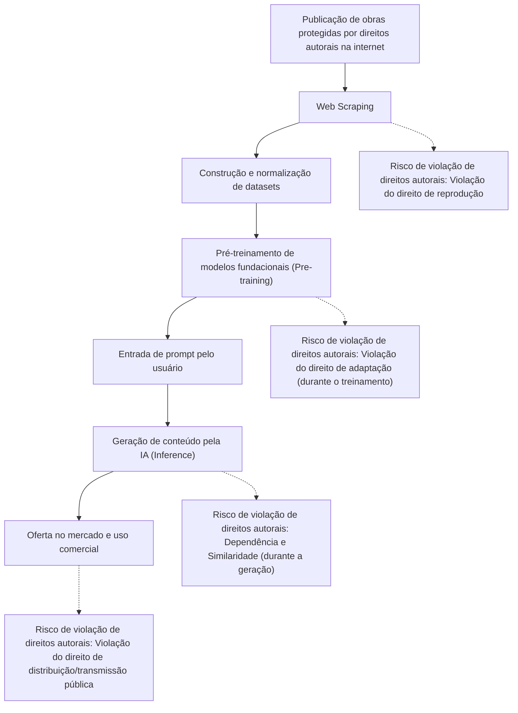
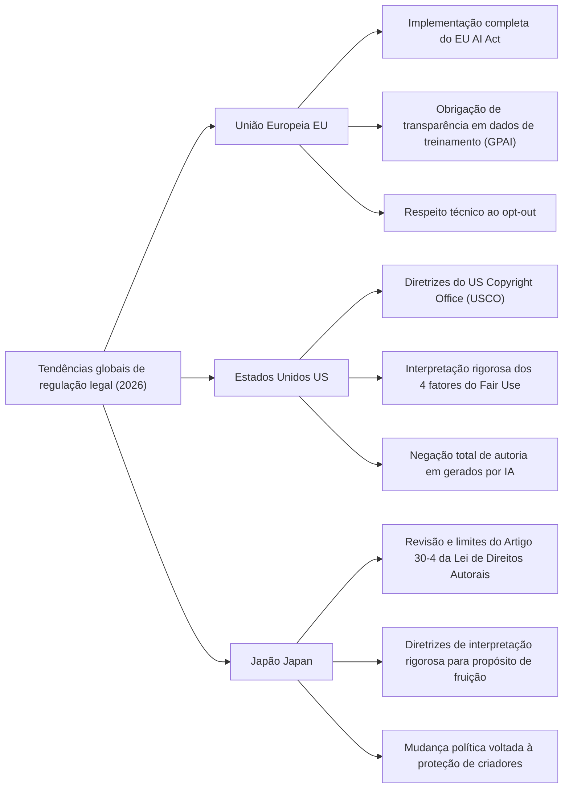
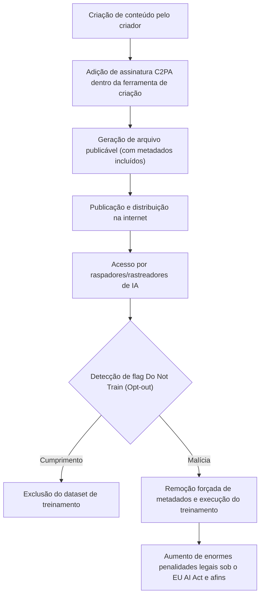

## 1. Introdução: O Novo Mudança de Paradigma na IA Generativa e Direitos Autorais em 2026

A partir de 2026, a evolução tecnológica da IA Generativa (Generative AI) atingiu um nível que transforma fundamentalmente o processo criativo humano, englobando a geração automática de textos, imagens, áudio, vídeos e até modelos 3D e códigos de software complexos. Enquanto Modelos de Linguagem de Grande Escala (LLMs) da classe GPT-5 e a próxima geração de modelos de Difusão (Diffusion models) se consolidam como infraestrutura social, as discussões em torno da legalidade dos "Dados de Treinamento" (Training Data) que sustentam esses modelos de IA e a propriedade dos direitos do "Conteúdo Gerado" (Generated Content) saíram de disputas judiciais individuais para entrar em uma fase de regulação legal nacional e padronização internacional.

As ações judiciais coletivas (class actions) movidas por criadores e grandes empresas de mídia contra as principais empresas de desenvolvimento de IA, que ocorreram com frequência entre 2022 e 2024, começam a produzir importantes decisões judiciais e marcos de acordo em 2026. Ao mesmo tempo, os poderes legislativos de vários países começaram a implementar novas regulamentações para acompanhar o ritmo da evolução tecnológica. Em uma era em que os esmagadores benefícios econômicos (aumento de produtividade) trazidos pela tecnologia da IA entram em conflito direto com a proteção dos direitos dos criadores que, historicamente, cultivaram a cultura, é extremamente importante que profissionais, engenheiros e os próprios criadores compreendam com precisão o cenário jurídico.

Este artigo explicará em detalhes, sob as perspectivas técnica e jurídica, as tendências globais da regulação legal de direitos autorais e IA generativa em 2026, as medidas técnicas de defesa por parte dos criadores (envenenamento de dados e prova de proveniência) e as perspectivas futuras.

---

## 2. O Mecanismo da Violação de Direitos Autorais: Interpretação Legal e Riscos em 3 Fases

Para organizar com precisão as questões entre a IA generativa e os direitos autorais, é necessário dividir o ciclo de vida da IA em três fases: "Treinamento" (Training), "Geração" (Generation) e "Exploração" (Exploitation). No sistema jurídico de 2026, a natureza dos direitos questionados em cada fase tornou-se mais clara.

### 2.1. "Direito de Reprodução" e "Direito de Adaptação" na Fase de Treinamento (Input)
Para construir um modelo fundacional, é necessário coletar enormes quantidades de texto, imagem e código da internet (Web Scraping) para o treinamento da IA. Nesse processo de construção do dataset, as obras são copiadas para a memória temporária ou armazenamento dos servidores, e, como regra geral, a violação do "direito de reprodução" torna-se um problema.

Anteriormente, empresas de IA argumentavam que "essa reprodução tem a finalidade de análise de informações e, sendo apenas um processamento mecânico, é lícita" ou que "se enquadra no uso aceitável (fair use)". No entanto, em precedentes e debates jurídicos recentes de 2026, o foco mudou para a natureza da "representação de características" que o modelo de IA extrai dos dados.
Se o modelo de IA internaliza as "características essenciais expressivas" de uma obra específica como pesos da rede (parâmetros) e atinge um estado em que pode ser diretamente extraída (o que chamamos de "Sobreajuste" (Overfitting) ou "Memorização" (Memorization)), ganha força a visão de que isso vai além de uma simples análise mecânica de informações e se qualifica como uma "Adaptação" (Adaptation).

### 2.2. "Dependência" e "Similaridade" na Fase de Geração (Output)
Esta é a fase de inferência, em que o usuário insere um prompt e a IA gera o conteúdo. Se as imagens ou textos gerados aqui forem idênticos ou extremamente semelhantes a uma obra autoral específica existente, a violação de direitos autorais pode ser configurada.

Os dois principais requisitos para se estabelecer uma violação de direitos autorais são "Dependência" (se foi criado com conhecimento e baseando-se na obra em questão) e "Similaridade" (se as características expressivas essenciais podem ser diretamente percebidas).
No caso da IA, ao contrário dos criadores humanos, avaliar o requisito subjetivo de "se a IA conhecia a obra" foi um desafio por muito tempo. Nas decisões judiciais de 2026, tem se consolidado a abordagem de que "se for provado que o modelo de IA leu a obra em questão como dado de treinamento, a dependência é fortemente presumida (uma inversão prática do ônus da prova)". Com isso, a transparência de "com quais datasets as empresas de IA treinaram" tornou-se criticamente importante nos julgamentos de violação.

### 2.3. Fase de Exploração (Responsabilidade do Usuário e Indenização Corporativa)
Esta é a fase em que os usuários publicam, vendem ou usam comercialmente os conteúdos gerados. Se a ferramenta de IA foi usada apenas como um mero "instrumento", o sujeito direto da violação de direitos autorais será o usuário que inseriu o prompt e publicou o resultado.
Nos serviços de IA empresariais de 2026 (como Copilot e IAs de geração de imagens para empresas), tornou-se padrão da indústria que as empresas de IA ofereçam cláusulas de "indenização" (indemnity), compensando o risco de violação de direitos autorais dos usuários. No entanto, isso é apenas uma transferência de risco contratual B2B; não legaliza o próprio ato de violação dos direitos autorais. Empresas usuárias agora precisam obrigatoriamente construir estruturas de governança interna para verificar se os conteúdos gerados não violam os direitos de terceiros.

---

## 3. Tendências de Regulação Legal nas Principais Nações/Regiões em 2026

Os países de todo o mundo estão adotando abordagens completamente diferentes para equilibrar os interesses nacionais conflitantes entre aumentar a competitividade por meio da inovação em IA e proteger os direitos de criadores/detentores de direitos autorais. O cenário das regulamentações na Europa, nos Estados Unidos e no Japão em 2026 é detalhadamente comparado e analisado.

### 3.1. União Europeia (UE): A Plena Implementação do "EU AI Act" e a Força dos Requisitos de Transparência
Aprovada em 2024 e chegando à fase de plena aplicação em 2026, após períodos de transição progressiva, a "Lei de IA da UE" (EU AI Act) é a estrutura de regulação de IA mais rigorosa do mundo. O que mais afeta o contexto de direitos autorais é a **"obrigação de transparência"** e a **"obrigação de cumprir as leis de direitos autorais da UE"** impostas aos desenvolvedores de modelos de IA de Propósito Geral (GPAI).

Sob o EU AI Act, fornecedores de GPAI têm a obrigação de publicar um "resumo suficientemente detalhado" (Sufficiently detailed summary) do conteúdo usado para treinar a IA. A partir de 2026, a granularidade legal desse "resumo suficientemente detalhado" foi esclarecida em diretrizes pelo Tribunal de Justiça da UE e pelo Escritório de IA (AI Office), e descrições vagas como "usamos o dataset público Common Crawl" agora são consideradas ilegais. Exige-se estritamente a divulgação de listas de URLs específicos de conjuntos de dados, listas de domínios principais densos em detentores de direitos e o processo de exclusão de dados (status do processamento de opt-out).

Além disso, de acordo com a exceção "TDM" (Text and Data Mining) do Artigo 4 da Diretiva de Direitos Autorais no Mercado Único Digital (Diretiva DSM) da UE, se os detentores de direitos fizerem opt-out do uso de seus dados de treinamento de forma legível por máquina (como via robots.txt ou C2PA, discutidos posteriormente), as empresas de IA agora têm a obrigação explícita de respeitar essa intenção em nível técnico e sistêmico, excluindo-os de seus conjuntos de dados. Violar esta regra acarreta o risco de multas enormes equivalentes a um percentual do faturamento global da empresa.

### 3.2. Estados Unidos (EUA): Redefinição do "Fair Use" e a Postura Rigorosa do USCO
Nos EUA, centro da indústria de IA, o campo de batalha para decidir a legalidade do treinamento de IA não é uma regulação direta e estatutária de IA, mas sim a doutrina jurídica do "Fair Use" (Uso Aceitável) definida na Seção 107 da Lei de Direitos Autorais existente.
Começando com a decisão da Suprema Corte de 2023 no caso "Andy Warhol Foundation v. Goldsmith", os critérios para determinar o Fair Use nos EUA — especificamente a interpretação do primeiro fator: "o propósito e o caráter do uso (se é transformativo ou não)" — tornaram-se extremamente rigorosos.

Em precedentes importantes em tribunais federais acumulados até 2026 (por exemplo, decisões substantivas e acordos no processo New York Times v. OpenAI), os tribunais começaram a estabelecer normas como as seguintes:
"Se uma IA aprende de uma obra original e tem a capacidade de gerar um substituto concorrente direto no mercado (por exemplo, um resumo de notícias idêntico a um artigo do NYT, ou fotos de arquivo muito parecidas com imagens da Getty), esse treinamento causa um efeito negativo direto no mercado (o quarto fator do Fair Use) e, portanto, não é protegido como Fair Use no geral."

Além disso, o Escritório de Direitos Autorais dos EUA (USCO) manteve firme sua política de negar completamente registros de direitos autorais para conteúdo gerado autonomamente por IA, devido à ausência de "Autoria Criativa" (Creative Authorship) humana. Em suas diretrizes operacionais mais recentes de 2026, ficou ainda mais claro que mesmo a alegação de "uso avançado de prompt engineering" é apenas um mero "direcionamento de ideias" (commissioning) e não é reconhecido como expressão criativa sob a lei de direitos autorais. Para reivindicar direitos autorais sobre a saída da IA, o humano deve provar que adicionou "modificações substanciais e criativas" à saída (como grandes retoques no Photoshop, ou a reestruturação de composições complexas).

### 3.3. Japão (Japan): O Fim da "Era do Free Ride" do Artigo 30-4 da Lei de Direitos Autorais
O Japão costumava ser chamado de "o país mais favorável para o desenvolvimento da IA no mundo" devido ao Artigo 30-4 (Reprodução etc., para fins de Análise de Informações), introduzido na reforma da Lei de Direitos Autorais de 2018. Esta cláusula era uma provisão de limitação de direitos extremamente poderosa: contanto que o propósito não fosse a "fruição" das ideias ou emoções expressas na obra, ela permitia a reprodução de dados para treinamento de IA de forma ampla, independentemente de ser comercial ou não, e independentemente de os dados originais terem sido enviados legal ou ilegalmente (embora limitações sobre o aprendizado a partir de versões piratas tenham sido adicionadas posteriormente).

No entanto, desde 2024, após forte oposição de organizações de criadores, que temiam que a IA generativa pudesse tomar diretamente o mercado de ilustradores, dubladores e autores existentes, a Agência de Assuntos Culturais e o Subcomitê de Direitos Autorais começaram a apertar a interpretação de "propósito de fruição" (enjoyment purpose).

Atualmente, em 2026, as últimas diretrizes legais emitidas pela Agência de Assuntos Culturais indicam claramente que os seguintes atos muito provavelmente serão vistos como contendo "propósitos mistos de fruição", e consequentemente isentos da aplicação do Artigo 30-4 (isto é, exigiriam em princípio a permissão do detentor dos direitos, e fazê-lo sem consentimento seria violação de direitos autorais):
- Fazer raspagem (scraping) intensiva de obras apenas de um criador específico para imitar intencionalmente o seu estilo de arte ou voz (métodos como Fine-Tuning, LoRA ou treinamento adicional).
- O ato de registrar em uma base de dados um sistema RAG (Geração Aumentada de Recuperação) projetado para extrair diretamente as características expressivas da obra original.

Devido a essa mudança de interpretação, a era do "passe livre (free ride) para treinamento não autorizado com quaisquer dados" chegou efetivamente ao fim no Japão. Empresas japonesas, assim como as do Ocidente, estão agora se voltando para a aquisição de dados "limpos" (clean data) que tenham os direitos resolvidos.

---

## 4. O Significado Histórico de Casos Internacionais Notáveis de 2024 a 2026

Vamos resumir a situação atual em 2026 das principais ações judiciais que influenciaram enormemente a formação das regulamentações.

1. **The New York Times v. OpenAI / Microsoft**
   Movida no final de 2023, tornou-se a maior ação judicial que simboliza "IA Generativa e Direitos Autorais". O NYT apresentou evidências de que milhões de seus artigos foram usados para treinamento sem permissão, e o ChatGPT memorizou e os cuspiu (Memorization). Em 2026, o tribunal emitiu uma decisão provisória de que "a reprodução completa de um artigo pela IA não constitui Fair Use", e as partes chegaram a um acordo na forma de enormes contratos de licenciamento. Isso definiu um padrão da indústria de que "o treinamento de IA em conteúdo de notícias deve ser compensado".

2. **Getty Images v. Stability AI**
   Processo contra o desenvolvedor da IA geradora de imagens "Stable Diffusion". Marcas d'água da Getty aparecendo diretamente nas imagens geradas pela IA foram oferecidas como prova definitiva de treinamento não autorizado. Como resultado de litígios paralelos no Reino Unido e nos EUA, em 2026, uma decisão histórica declarou que "o ato de treinar a IA evitando e removendo intencionalmente marcas d'água qualifica-se como elusão de medidas tecnológicas de proteção sob o Digital Millennium Copyright Act (DMCA)", resultando em penalidades severas contra as empresas de IA.

3. **Litígio GitHub Copilot (Doe v. GitHub)**
   Um processo contra o Copilot, que foi treinado em códigos de Software de Código Aberto (OSS). O principal ponto de discussão foi a saída de códigos ignorando a "obrigação de atribuição" exigida pelas licenças de OSS (como MIT ou GPL). Em 2026, ferramentas de desenvolvimento de IA agora são legalmente obrigadas a ter sistemas internos (sistemas de filtragem e atribuição) que detectam em tempo real se o código de saída corresponde a um código de OSS existente e anexam informações de licença a ele.

---

## 5. Meios de Autodefesa para Autores: Tecnologia de Opt-out e a Evolução do C2PA

A criação de marcos regulatórios leva tempo, e controlar completamente as atividades de empresas transnacionais de IA é difícil. Consequentemente, criadores e editoras estão acelerando seu uso de meios tecnológicos para proteger proativamente suas obras.

### 5.1. robots.txt e o Protocolo de Opt-out TDM
Colocado no diretório raiz de um site, o `robots.txt` é um protocolo originalmente destinado a controlar os rastreadores de mecanismos de busca, mas até 2026 estabeleceu-se como um meio padrão de bloquear indiscriminadamente os rastreadores de aprendizado de IA (por exemplo, `GPTBot` da OpenAI, `Google-Extended` do Google, `ClaudeBot` da Anthropic).
No entanto, o `robots.txt` não tem efeito legal e tem uma falha fundamental em que pode ser facilmente ignorado por raspadores maliciosos e "selvagens". Portanto, a padronização mundial de incorporar intenções de opt-out em TDM (Text and Data Mining) diretamente no cabeçalho HTTP ou tags meta HTML (por exemplo, `<meta name="tdm-reservation" content="1">`) e dar a isso poder legal num formato legível por máquina (como W3C TDM Rep) espalhou-se. Sob o EU AI Act, se o scraping (raspagem) é feito ignorando esta tag meta, é tratado como uma atividade flagrantemente ilegal.

### 5.2. C2PA e a Implementação Nativa de Autenticação de Proveniência de Conteúdo
A **C2PA (Coalition for Content Provenance and Authenticity)** é um padrão técnico que anexa "metadados de proveniência" (provenance metadata) protegidos criptograficamente e à prova de violações em conteúdos digitais, como imagens, vídeos e áudio. Em 2026, a principal tecnologia de câmeras digitais (Sony, Leica, Nikon etc.), softwares de edição de imagens (Adobe Photoshop etc.) e até os aplicativos de câmera padrão no iOS e Android têm a C2PA implementada de forma nativa.

Os manifestos da C2PA (informações de proveniência) podem incluir explicitamente a flag: "Esta imagem não deve ser usada como dado de treinamento de IA" (Do Not Train: DNT). Reciprocamente, marcações mostrando "Isto foi gerado por IA" também são anexadas, servindo com um propósito duplo: medidas antifalsificação (deepfakes) e proteção de direitos autorais. A extração (remoção) intencional desses metadados sujeitará a entidade a penalidades como "remoção de informações de gestão de direitos", presente nas leis de direitos autorais pelo mundo.

---

## 6. Contramedidas Técnicas: Os Mecanismos do Envenenamento de Dados (Glaze, Nightshade)

Frente às empresas de IA que ignoram regulamentos legais ou manifestações de opt-out, o "meio de retaliação mais poderoso e físico" amplamente difundido para criadores em 2026 é a tecnologia de "Envenenamento de Dados" (Data Poisoning). Técnicas agressivas e ativas de defesa que destroem matematicamente o próprio processo de aprendizado da IA, encabeçadas pelo **Glaze** e o **Nightshade**, desenvolvidas por equipes de pesquisadores da Universidade de Chicago.

### 6.1. O Modelo Matemático de Perturbação Adversária (Adversarial Perturbation)
Os modelos de IA (especialmente CNNs no reconhecimento de imagem e modelos de Diffusion na geração de imagem) não visualizam imagens "visualmente" da mesma forma que os humanos, mas como vetores numéricos em espaços latentes altamente dimensionais (Latent Space). O envenenamento de dados introduz pequenos ruídos imperceptíveis aos olhos humanos (perturbações adversárias) na imagem, ao nível de pixel, e confunde propositadamente o encoder do modelo de IA.

Isso é expresso matematicamente como um problema de otimização:

$$ \min_{\delta} \mathcal{L}(f(x+\delta), y_{target}) $$

$$ \text{subject to } ||\delta||_p < \epsilon $$

Onde:
- $x$ é a imagem limpa original (por exemplo: imagem de uma "paisagem bonita").
- $\delta$ é o pequeno ruído adicionado à imagem (vetor de perturbação).
- $f$ é o extrator de características (encoder) da IA.
- $y_{target}$ é o conceito-alvo no qual você quer fazer a IA interpretar incorretamente (por exemplo: "lixo barulhento" ou um "objeto completamente diferente").
- $\mathcal{L}$ é a função de perda (loss function).
- $\epsilon$ é o limite superior pelo qual o ruído não pode ser percebido pela visão humana (Norma L-p).

Ferramentas de envenenamento resolvem esse problema de otimização nos PCs dos criadores e então exibem imagens "envenenadas".

### 6.2. Glaze (Proteção de Estilo e Pintura)
O Glaze é uma ferramenta projetada para proteger o "estilo" particular (Style) do criador. Por exemplo, ao aplicar o Glaze a uma ilustração delicada em estilo de aquarela, aos olhos humanos ainda parece exatamente uma aquarela. No entanto, o codificador de IA (encoder) $f$, sob o efeito da perturbação $\delta$ adicionada, lê essa imagem como um vetor indicando uma "pintura a óleo com impasto denso" ou "cubismo abstrato" e os aprende dessa forma.
Como resultado, se você der o prompt "Gere no estilo de (esse criador)" para o modelo de IA que foi treinado com essa imagem envenenada, já que o mapeamento no espaço latente foi deformado, a IA irá desenhar imagens em estilos completamente caóticos e não relacionados. Ele desabilita fisicamente as empresas de IA de criar "modelos de cópia (como LoRAs) dos estilos de artistas em particular".

### 6.3. Nightshade (Destruição de Conceitos e Colapso do Modelo)
O Nightshade é ainda mais agressivo que o Glaze, almejando poluir e destruir os próprios "Conceitos" (Concepts) no modelo de IA.
Por exemplo, aplicar Nightshade em uma imagem de um "cachorro" ensinará a IA que é um "gato". Está provado que até mesmo misturar meras centenas ou milhares dessas imagens alvo de "Envenenamento Específico de Prompt" (Prompt-Specific Poisoning) dentro de um dataset fará com que o alinhamento de conceito de todo um modelo fundacional em grande escala desmorone.
Em modelos poluídos com Nightshade, mesmo se um usuário disser "gere uma imagem de um cachorro fofo", a IA passará a gerar imagens de gatos estranhos com quatro pernas (nota: gatos normais têm 4 pernas, mas o sentido aqui é gerar algo grotesco) ou texturas que não fazem absolutamente nenhum sentido.

Em 2026, tornou-se padronizado que processos de envenenamento como esse ocorram automaticamente em segundo plano por meio de extensões de navegador ou protocolos descentralizados no momento em que criadores carregam suas imagens nas mídias sociais ou em portfólios online. Consequentemente, o risco técnico para empresas de IA fazer "scraping aleatório de imagens da internet" (o risco do qual os modelos em que gastaram milhões desabem instantaneamente) ficou drasticamente elevado, servindo ferozmente como um inibidor forte em deter o aprendizado não autorizado.

---

## 7. Mudança Estratégica em Empresas de IA Generativa: Dados Limpos, Licenças e Dados Sintéticos

Confrontadas com o fortalecimento das obrigações legais, litígios perdedores por violação de direitos autorais e as ameaças das tecnologias de envenenamento de dados como o Nightshade, as empresas desenvolvedoras de IA se viram forçadas a passar por uma mudança gigantesca de paradigma e mudança de modelos de negócios em 2026.

### 7.1. O Retorno aos Datasets Limpos e a Guerra pela Hegemonia
A era do velho Vale do Silício do "Mova-se rápido e quebre coisas" (Move fast and break things) — em que você meramente raspava todos os dados não autorizados para criar bancos de dados massivos de "faroeste" (como o LAION-5B) — encontrou o seu limite.
Em contrapartida, os "datasets limpos" completamente transparentes de direitos autorais, processados com sistemas adequados de opt-out, dispararam a níveis de valor astronômicos. Gigantes que possuem vastos repertórios de mídia licenciada em casa, como a Adobe (Firefly), Getty Images e Shutterstock, assumiram a dominância absoluta dos mercados corporativos com a premissa de um apelo de "Risco Zero de Violação de Direitos Autorais".

### 7.2. Modelos de Compartilhamento de Receita e Acordos de Licenças Multimilionários
Acordos anuais de licenciamento de dados atingindo centenas de milhões de dólares tornaram-se ocorrências cotidianas entre grandes players de IA (OpenAI, Google, Anthropic, Meta, etc.) e corporações de mídia (The New York Times, Reddit, News Corp, etc.), além de agências de fotos de bancos de imagens, gigantes das editoras e selos musicais.
Adicionalmente, estamos presenciando o surgimento de "Modelos de Compartilhamento de Receita" (Revenue Share Models) que redistribuem lucros de assinaturas ou de uso de API da criação gerada por IA aos criadores originais, cujos dados participaram da fase de treinamento. Usando infraestruturas web3 ou blockchain amarradas a Contratos Inteligentes (Smart Contracts) com os metadados do C2PA, novos experimentos foram implantados onde é verificado em que obras a geração se "Apoiou" na contribuição fracional, compensando aos participantes via micropagamentos de forma completamente automática.

### 7.3. A Dependência em Dados Sintéticos (Synthetic Data) e o Dilema do "Colapso do Modelo"
Diante de uma barreira chamada de "Muralha de Dados" (Data Wall), em que a fonte humana de dados se seca — seja porque a lei a restringiu, seja porque os criadores estão envenenando esses dados —, a comunidade de IA deu um passo para forçar um aprendizado recursivo e autônomo nas próximas gerações de seus modelos de IA, usando dados gerados por uma IA (Dados Sintéticos: Synthetic Data).
No entanto, quando apenas dados sintéticos são ingeridos repetidamente de forma recursiva, as variâncias se perdem e atributos mais distantes e únicos são ceifados, e evidências estatísticas e matemáticas comprovaram que a longo prazo o modelo se depara com o "Colapso do Modelo" (Model Collapse), resultando na degradação fatal da qualidade na geração.
Em última análise, o paradoxo provou por si mesmo que, sem "novos dados de alta qualidade e com origem humana originais", a IA baterá em uma parede em direção a um beco sem saída; ao parasitar a espécie dos criadores a ponto de exterminá-los, a revolução e o modelo da IA irão secar também.

---

## 8. Perspectivas para 2030 e Conclusão

O ano de 2026 ficará gravado na história não só como o ano em que os dias de exploração da IA no estilo "faroeste" terminaram completamente, mas um ano com um marco de virada, à medida em que fomos atraídos para a "Fase de Reconstrução do Contrato Social" em que leis, tecnologia e originalidade devem existir de forma viável em coexistência mútua.

### Importantes Agendas Pendentes para o Futuro:
1. **Perseguir a Harmonia em Direitos e Regulações Globais**: Como podemos costurar os fios que compõem abordagens tão diversamente rígidas de Transparência (EU), a doutrina guiada pelos mercados do Fair Use (US), e a "interpretação rigorosa do Propósito de Fruição" do Japão? Existe uma necessidade premente de garantir firmeza e certezas jurídicas internacionais. A atualização dos tratados mundiais continua atrasada de forma lamentável e deve ser impulsionada.
2. **Desenvolver o "Novo Status de Direitos" na Era da IA**: Além das antigas formas de direitos limitados, devemos debater para ver se uma provisão adaptativa separada, como "Direitos contra Indução de Treinamento/Acesso a Ingestões" e "Direito a Royalties de Treinamento e Extração de Metadados", deve emergir.
3. **Redefinição da Originalidade Humana e a "Prova de Humanidade" (Proof of Humanity)**: Onde as IAs podem invocar qualquer visual a uma velocidade vertiginosa excedendo o desempenho humano e as qualidades fotográficas, "Aquilo pelo qual lutamos, feito pela alma humana" possuirá seu próprio selo superior como uma "Prova de Humanidade" com seu prêmio embutido. Assim como a invenção da era industrial permitiu que a cultura de fabricação artesanal em massa elevasse as identidades das marcas do artesanato humano, os valores tradicionais enraizados na autoria em si verão as definições sendo reformuladas.

Tentar voltar as mãos e os relógios do avanço da inovação na IA é praticamente impensável e indubitavelmente um movimento para trás. Embora devamos subjugar esses saltos assustadoramente poderosos e contê-los para que nossa humanidade global (que cultivou ecossistemas artísticos ao longo de milênios) não desmorone, seu manejo apoia-se e repousa no avanço cooperativo unificado não apenas da lei, mas da ciência da computação combinada com as faculdades combinadas de sabedoria em nossa sociedade global hoje.

A caminho de 2030, somos desafiados e ansiosamente solicitados a substituir nossa apropriação agressiva da terra por uma estrutura mutuamente unificada não competitiva (uma que não sugue lucros em hostilidades), pavimentando um modo pacífico em colaboração recíproca compensada. Uma vez estabelecido esse pilar em uma Nova Zona Econômica Digital com um respeito harmonioso pelo design cognitivo humano inerente, nós e os criadores impulsionaremos sem limites os potenciais do progresso para todos.
