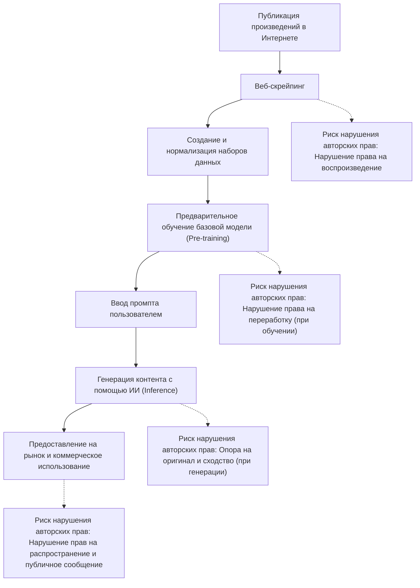
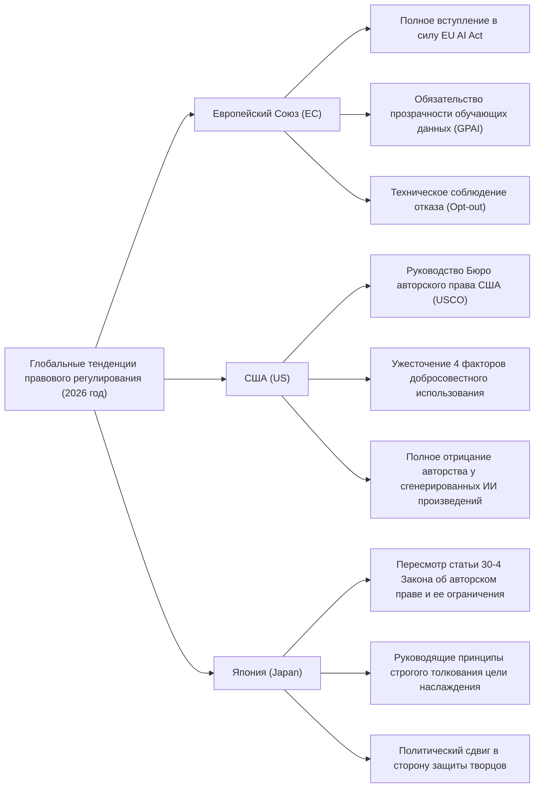
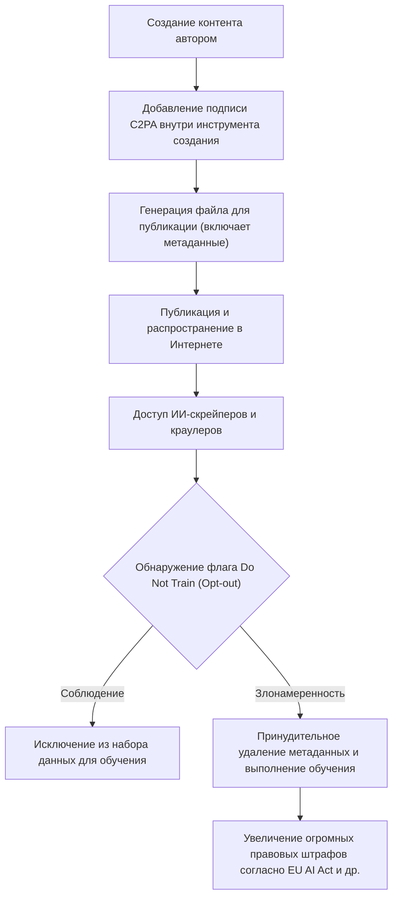

## 1. Введение: Новая смена парадигмы генеративного ИИ и авторского права в 2026 году

По состоянию на 2026 год, технологическая эволюция генеративного ИИ (Generative AI) достигла уровня, который в корне меняет творческий процесс человечества, начиная от автоматической генерации текста, изображений, аудио, видео и заканчивая 3D-моделями и сложным программным кодом. В то время как большие языковые модели (LLM) класса GPT-5 и диффузионные модели (Diffusion models) следующего поколения укоренились в качестве социальной инфраструктуры, дискуссии о законности «обучающих данных (Training Data)», поддерживающих эти модели ИИ, и о принадлежности прав на «сгенерированный контент (Generated Content)» перешли от индивидуальных судебных споров к этапу государственного регулирования и международной стандартизации.

Коллективные иски (class action), поданные авторами и крупными медиа-компаниями против основных разработчиков ИИ, которые часто происходили в период с 2022 по 2024 год, к 2026 году начали приводить к появлению ряда важных судебных решений и мировых соглашений. В то же время законодательные органы разных стран начали вводить новые системы регулирования, чтобы успевать за скоростью развития технологий. В современную эпоху, когда две противоположные ценности сталкиваются лицом к лицу: огромные экономические выгоды (повышение производительности), приносимые технологиями ИИ, и защита прав создателей, которые до сих пор способствовали развитию культуры, для корпоративных практиков, инженеров и самих творцов крайне важно точно понимать правовой ландшафт.

В этой статье будет дан чрезвычайно подробный анализ глобальных тенденций правового регулирования генеративного ИИ и авторского права по состоянию на 2026 год, технических мер защиты со стороны авторов (таких как отравление данных и подтверждение происхождения), а также будущих перспектив с правовой и технической точек зрения.

---

## 2. Механизм нарушения авторских прав: Правовое толкование и риски на 3-х этапах

Для того чтобы точно систематизировать проблемы генеративного ИИ и авторского права, необходимо разделить весь жизненный цикл ИИ на три этапа: «Обучение (Training)», «Генерация (Generation)» и «Использование (Exploitation)». В правовой системе 2026 года была четко определена природа прав, рассматриваемых на каждом этапе.

### 2.1. Этап обучения (Ввод): «Право на воспроизведение» и «Право на переработку»
Для создания базовой модели необходимо собирать огромные объемы текстовых, графических и программных данных в Интернете (веб-скрейпинг) и использовать их для обучения ИИ. Поскольку в этом процессе создания набора данных произведения копируются во временную память сервера или хранилище, как правило, возникает проблема нарушения «права на воспроизведение».

Традиционно компании-разработчики ИИ утверждали, что «это воспроизведение предназначено для целей анализа информации и является лишь механической обработкой, поэтому оно законно» или «подпадает под добросовестное использование (fair use)». Однако в последних судебных прецедентах и юридических дискуссиях в 2026 году в центре внимания оказалась природа «выразительных характеристик», которые модели ИИ извлекают из данных.
Если модель ИИ усваивает «существенные характеристики выражения» конкретного произведения в качестве весов сети (параметров) и находится в состоянии, когда их можно извлечь как есть позже (так называемое «переобучение (Overfitting)» или «запоминание (Memorization)»), преобладает мнение, что это выходит за рамки простого механического анализа информации и подпадает под «переработку (Adaptation)».

### 2.2. Этап генерации (Вывод): «Опора на оригинал» и «Сходство»
Это этап вывода (inference), на котором пользователь вводит промпт (запрос), а ИИ генерирует контент. Если сгенерированное здесь изображение или текст очень похожи на конкретное существующее произведение, может быть установлено нарушение авторских прав.

Двумя основными требованиями для установления нарушения авторских прав являются «опора на оригинал (знал ли автор о целевом произведении и создавал ли свое на его основе)» и «сходство (можно ли непосредственно воспринять существенные характеристики выражения)».
В случае с ИИ, в отличие от создателей-людей, долгое время было проблемой, как судить о субъективном требовании «знал ли ИИ об этом произведении». В судебных решениях 2026 года все больше укореняется подход: «если доказан факт того, что модель ИИ считывала данное произведение в качестве обучающих данных, опора на оригинал будет убедительно предполагаться (фактическое перераспределение бремени доказывания)». В результате, прозрачность того, «на каких наборах данных ИИ-компании обучали свои модели», приобрела чрезвычайно важное значение при определении нарушения.

### 2.3. Этап использования (Ответственность пользователя и гарантии компаний)
Это этап, на котором пользователи публикуют, продают и коммерчески используют сгенерированный контент. В случаях, когда инструмент ИИ использовался лишь как простой «инструмент», непосредственным субъектом нарушения авторских прав является пользователь, который ввел промпт и опубликовал результат.
В корпоративных ИИ-сервисах 2026 года (таких как Copilot и корпоративные версии ИИ для генерации изображений) отраслевым стандартом стало включение «оговорки о гарантиях возмещения ущерба (Indemnity)», согласно которой ИИ-компания компенсирует пользователям риски нарушения авторских прав. Однако это всего лишь перенос рисков по B2B-контракту, и само нарушение по закону об авторском праве не становится законным. Компании-пользователи обязаны выстраивать систему внутреннего управления (гавернанс) для проверки того, не нарушают ли сгенерированные материалы права других лиц.

---

## 3. Тренды правового регулирования в основных странах и регионах в 2026 году

Страны по всему миру применяют совершенно разные подходы для достижения баланса между противоречивыми национальными интересами: укреплением национальной конкурентоспособности путем стимулирования инноваций в сфере ИИ и защитой авторов и правообладателей. Подробно сравним и проанализируем текущее состояние правового регулирования в Европе, США и Японии по состоянию на 2026 год.

### 3.1. Европейский Союз (ЕС): Полное вступление в силу EU AI Act и клыки требований прозрачности
«Закон ЕС об искусственном интеллекте (EU AI Act)», который был принят в 2024 году и после поэтапного переходного периода достиг стадии полного вступления в силу в 2026 году, является самой строгой в мире системой регулирования ИИ. Наибольшее влияние в контексте авторского права оказывают **«Обязательство прозрачности»** и **«Обязательство соблюдать закон об авторском праве ЕС»**, налагаемые на разработчиков моделей ИИ общего назначения (GPAI: General Purpose AI).

В соответствии с EU AI Act, провайдеры GPAI обязаны публиковать «достаточно подробное резюме (Sufficiently detailed summary)» контента, использованного для обучения ИИ. По состоянию на 2026 год правовая детализация этого «достаточно подробного резюме» была уточнена в руководящих принципах Суда ЕС и Европейского бюро по ИИ (AI Office), и абстрактные формулировки вроде «Мы использовали открытый набор данных Common Crawl» теперь считаются незаконными. Строго требуется раскрытие конкретных списков URL-адресов наборов данных, списков основных доменов с высокой концентрацией правообладателей, а также процессов исключения данных (статус обработки запросов на opt-out).

Кроме того, в соответствии с «Исключением для интеллектуального анализа текста и данных (TDM)», основанном на статье 4 Директивы об авторском праве на едином цифровом рынке ЕС (DSM Directive), если правообладатель машиночитаемым способом (с помощью robots.txt, C2PA и т.д., описанных ниже) отказывается (opt-out) от использования своих данных для обучения, ИИ-компании обязаны технически и системно уважать это намерение и исключать их из набора данных. Нарушение этого требования влечет за собой риск наложения огромных штрафов, эквивалентных определенному проценту от мировых продаж.

### 3.2. США (US): Переопределение добросовестного использования и строгая позиция USCO
В США, являющихся центром индустрии ИИ, полем битвы, определяющим законность обучения ИИ, является не прямое регулирование ИИ с помощью писаного права, а доктрина «добросовестного использования (Fair Use)», закрепленная в разделе 107 действующего Закона об авторском праве.
После решения Верховного суда в 2023 году по делу «Фонд Энди Уорхола против Голдсмит», критерии определения добросовестного использования в США, в частности интерпретация первого фактора «цель и характер использования (является ли использование трансформативным)», стали чрезвычайно строгими.

В важных судебных прецедентах на уровне федеральных окружных судов, накопившихся к 2026 году (например, судебные решения по существу или мировые соглашения в иске New York Times против OpenAI), суды начали применять следующие стандарты:
«Если ИИ обучается на оригинальных произведениях и обладает способностью генерировать заменители, которые напрямую конкурируют с оригинальными произведениями на рынке (например, новостные сводки, почти идентичные статьям NYT, или стоковые фотографии, очень похожие на изображения Getty), такое обучение вызывает прямое негативное влияние на рынок (4-й фактор добросовестного использования), и поэтому в целом не защищается как добросовестное использование».

Кроме того, Бюро авторского права США (USCO) продолжает придерживаться политики полного отказа в регистрации авторских прав на контент, автономно сгенерированный ИИ, поскольку в нем отсутствует человеческий «творческий вклад (Creative Authorship)». В последнем оперативном руководстве 2026 года стало еще более ясно, что даже заявления об «использовании продвинутого промпт-инжиниринга» расцениваются лишь как «выдача инструкций по идее (заказ)» и не признаются творческим выражением в соответствии с законом об авторском праве. Чтобы заявить авторские права на результаты работы ИИ, необходимо доказать, что человек внес в эти результаты «существенные и творческие изменения (значительная ретушь в Photoshop, перестройка сложной композиции и т.д.)».

### 3.3. Япония (Japan): Конец эпохи «безбилетников» согласно статье 30-4 Закона об авторском праве
Японию называли «самой благоприятной страной для разработки ИИ в мире» благодаря статье 30-4 (Воспроизведение и т.д. для анализа информации), которая была введена поправкой к Закону об авторском праве в 2018 году. Это положение представляло собой чрезвычайно мощное ограничение прав, которое широко разрешало воспроизведение для обучения ИИ независимо от того, осуществляется ли оно в коммерческих или некоммерческих целях, и независимо от того, были ли исходные данные загружены законно или незаконно (※однако позже были введены ограничения на обучение на пиратских копиях), при условии, что это не делается с целью «наслаждения (enjoyment)» мыслями или чувствами, выраженными в произведении.

Однако с 2024 года, из-за опасений, что генеративный ИИ может напрямую отобрать рынок у существующих иллюстраторов, актеров озвучивания и писателей, возникло сильное противодействие со стороны ассоциаций творцов. Агентство по делам культуры (Bunkacho) и Подкомитет по авторскому праву продвинулись в ужесточении толкования «цели наслаждения».

По состоянию на 2026 год, в последних правовых руководящих принципах, выпущенных Агентством по делам культуры, четко указано, что следующие действия, скорее всего, будут расцениваться как «имеющие смешанную цель наслаждения» и не подпадающие под статью 30-4 (т.е., как правило, требующие разрешения правообладателя, а их выполнение без разрешения является нарушением авторских прав):
- Действия по интенсивному скрейпингу и обучению исключительно на работах конкретного автора с целью намеренной имитации его стиля рисования или голоса (методы тонкой настройки (fine-tuning), LoRA, дополнительное обучение и т.д.).
- Действия по регистрации в базе данных для систем RAG (поисковая генерация), разработанных с намерением напрямую выводить выразительные характеристики оригинального произведения.

В связи с этим изменением в толковании, эпоха, когда «было возможно обучение (фрирайдинг) без разрешения на любых данных» в Японии фактически подошла к концу. Японские компании, как и их западные коллеги, переориентировались на закупку чистых данных (clean data) с урегулированными правами.

---

## 4. Историческое значение ключевых международных судебных процессов 2024–2026 годов

Резюмируем текущий статус по состоянию на 2026 год основных судебных процессов, оказавших огромное влияние на формирование правового регулирования.

1. **The New York Times v. OpenAI / Microsoft**
   Этот иск, поданный в конце 2023 года, стал крупнейшим судебным делом, символизирующим проблему «генеративный ИИ и авторское право». NYT представила доказательства того, что миллионы её статей были использованы для обучения без разрешения, а ChatGPT почти полностью заучил их и выдает в ответах (Memorization). В 2026 году суд вынес промежуточное решение о том, что «полное воспроизведение статьи искусственным интеллектом не является добросовестным использованием», и обе компании фактически достигли мирового соглашения, заключив крупное лицензионное соглашение. Это утвердило отраслевой стандарт: «обучение ИИ на новостном контенте должно быть платным».

2. **Getty Images v. Stability AI**
   Иск против разработчиков ИИ для генерации изображений Stable Diffusion. Тот факт, что водяные знаки (watermarks) Getty выводились как есть на сгенерированных ИИ изображениях, был представлен в качестве убедительного доказательства обучения без разрешения. В результате параллельных судебных разбирательств в Великобритании и США в 2026 году было принято эпохальное решение о том, что «действия по намеренному удалению или обходу водяных знаков для обучения подпадают под обход технических средств защиты согласно Закону об авторском праве в цифровую эпоху (DMCA)», и на ИИ-компании были наложены строгие штрафы.

3. **GitHub Copilot Litigation (Doe v. GitHub)**
   Иск против Copilot, который обучался на коде программного обеспечения с открытым исходным кодом (OSS). Предметом спора стал тот факт, что он выдает код, игнорируя «обязательство указывать авторство (Attribution)», требуемое лицензиями OSS (MIT, GPL и др.). По состоянию на 2026 год юридически обязательным трендом стало включение в инструменты разработки ИИ функций (систем фильтрации и атрибуции), которые в реальном времени определяют, совпадает ли сгенерированный код с существующим кодом OSS, и добавляют информацию о лицензии.

---

## 5. Средства самозащиты авторов: Технологии Opt-out и эволюция C2PA

Разработка правового регулирования требует времени, а полностью контролировать деятельность ИИ-компаний, пересекающую границы, сложно. Поэтому создатели и издатели ускоряют процесс самостоятельной защиты своих произведений с помощью технических средств.

### 5.1. robots.txt и протокол TDM Opt-out
Файл `robots.txt`, размещаемый в корневой директории веб-сайтов, изначально являлся протоколом для управления поисковыми роботами (краулерами), но в 2026 году он укоренился как стандартное средство для всеобщей блокировки краулеров, собирающих данные для обучения ИИ (например, `GPTBot` от OpenAI, `Google-Extended` от Google, `ClaudeBot` от Anthropic).
Однако у `robots.txt` есть фундаментальный недостаток: он не имеет юридической силы и легко игнорируется недобросовестными "дикими" скрейперами. Поэтому во всем мире получила распространение стандартизация (такая как W3C TDM Rep), при которой намерение отказаться (opt-out) от TDM (Text and Data Mining) встраивается непосредственно в HTTP-заголовки или метатеги HTML (например, `<meta name="tdm-reservation" content="1">`), придавая ему юридическую силу в машиночитаемом формате. В рамках EU AI Act скрейпинг с игнорированием этого метатега расценивается как явное незаконное действие.

### 5.2. C2PA и нативная реализация подтверждения происхождения контента
**C2PA (Coalition for Content Provenance and Authenticity)** — это технический стандарт, который добавляет криптографически подписанные, защищенные от несанкционированного изменения «метаданные о происхождении» к цифровому контенту, такому как изображения, видео и аудио. В 2026 году C2PA был нативно реализован в основных цифровых камерах (Sony, Leica, Nikon и др.), программном обеспечении для редактирования изображений (Adobe Photoshop и др.), а также в стандартных приложениях камер для iOS и Android.

В манифест C2PA (информацию о происхождении) можно включить четкий флаг: «Это изображение нельзя использовать в качестве обучающих данных для ИИ (Do Not Train: DNT)». И наоборот, к нему также прикрепляется знак генерации ИИ, гласящий «Это изображение было сгенерировано ИИ», что позволяет ему работать в качестве обоюдного механизма: как меры противодействия дипфейкам (deepfake) и как защиты авторских прав. Намеренное удаление (стриппинг) метаданных подлежит наказанию как «удаление информации об управлении правами» в соответствии с законами об авторском праве большинства стран мира.

---

## 6. Технические меры противодействия: Механизм отравления данных (Glaze, Nightshade)

В 2026 году в качестве «наиболее мощной и физической меры противодействия» со стороны творцов против ИИ-компаний, которые игнорируют даже законы и явные заявления об opt-out, широкое распространение получили технологии «отравления данных (Data Poisoning)». Эти технологии, такие как **Glaze** и **Nightshade**, разработанные исследовательской группой Чикагского университета, представляют собой наступательные и активные методы защиты, которые математически разрушают сам процесс обучения ИИ.

### 6.1. Математическая модель состязательного возмущения (Adversarial Perturbation)
Модели ИИ (особенно CNN в распознавании изображений и Diffusion-модели при генерации) не видят изображения «визуально» так же, как люди, а обрабатывают их как числовые векторы в многомерном скрытом пространстве (Latent Space). Отравление данных намеренно вводит в заблуждение кодировщик (encoder) модели ИИ путем добавления к изображению на пиксельном уровне крошечного шума (состязательного возмущения), совершенно незаметного для человеческого глаза.

В математическом виде это определяется как следующая задача оптимизации:

$$ \min_{\delta} \mathcal{L}(f(x+\delta), y_{target}) $$

$$ \text{subject to } ||\delta||_p < \epsilon $$

Где:
- $x$ — исходное чистое изображение (например, изображение «красивого пейзажа»)
- $\delta$ — микрошум (вектор возмущения), добавляемый к изображению
- $f$ — экстрактор признаков (кодировщик) ИИ
- $y_{target}$ — целевая концепция, которую ИИ должен ошибочно распознать (например, «мусор, полный шума» или «совершенно другой объект»)
- $\mathcal{L}$ — функция потерь
- $\epsilon$ — верхний порог (L-p норма), гарантирующий, что шум не будет воспринят человеческим зрением

Инструмент отравления решает эту задачу оптимизации на ПК автора, «отравляет» изображение и затем выводит его.

### 6.2. Glaze (Защита стиля и манеры рисования)
Glaze — это инструмент для защиты уникального «стиля рисования (Style)» автора. Например, если применить Glaze к тонкой иллюстрации в стиле акварели, для человеческого глаза она по-прежнему будет выглядеть как акварель. Однако кодировщик ИИ $f$ из-за влияния добавленного возмущения $\delta$ распознает и изучит это изображение как вектор «картины маслом толстым слоем (импасто)» или «абстрактного кубизма».
В результате, даже если вы дадите модели ИИ, обученной на этих отравленных изображениях, промпт «сгенерируй в стиле (такого-то автора)», отображение в скрытом пространстве будет нарушено, и ИИ выдаст совершенно другой, испорченный стиль. Это физически аннулирует создание ИИ-компаниями «моделей, копирующих стиль конкретного автора (LoRA и т.д.)».

### 6.3. Nightshade (Разрушение концепций и коллапс модели)
Nightshade еще более агрессивен, чем Glaze, и направлен на загрязнение и уничтожение самой «концепции (Concept)» модели ИИ.
Например, он применяет Nightshade к изображению «собаки», заставляя ИИ обучаться на нем как на «кошке». Было доказано, что если всего от нескольких сотен до нескольких тысяч изображений, подвергшихся такому специфическому для промпта отравлению (Prompt-Specific Poisoning), попадут в набор данных, понятийное выравнивание (alignment) всей крупномасштабной базовой модели разрушится.
В модели, зараженной Nightshade, даже если пользователь даст ИИ команду «сгенерируй изображение милой собаки», ИИ выдаст изображение странной кошки с 4 лапами или совершенно бессмысленную текстуру.

В 2026 году стало стандартом, что, когда авторы загружают изображения в социальные сети или на сайты-портфолио, эти процессы отравления автоматически выполняются в фоновом режиме через расширения браузера или децентрализованные протоколы. В результате технические риски для ИИ-компаний «без разбора скрейпить изображения из Интернета» (риск того, что модель, на обучение которой были потрачены сотни миллионов иен, мгновенно разрушится) стали чрезвычайно высокими, что в итоге служит мощным сдерживающим фактором против обучения без разрешения.

---

## 7. Стратегический сдвиг компаний-разработчиков генеративного ИИ: Чистые данные, лицензии и синтетические данные

Столкнувшись с ужесточением правового регулирования, риском проигрыша исков о нарушении авторских прав и угрозой технологий отравления данных, таких как Nightshade, компании-разработчики ИИ по состоянию на 2026 год вынуждены осуществить масштабный сдвиг в парадигме разработки ИИ и бизнес-моделях.

### 7.1. Возврат к чистым наборам данных и борьба за господство
Силиконово-долинный подход прошлого «Move fast and break things (Двигайся быстро и ломай вещи)», заключавшийся в скрейпинге всех данных в Интернете без разрешения для создания гигантских наборов данных (беззаконные наборы данных, такие как LAION-5B), уже достиг своего предела.
Вместо этого астрономически возросла ценность «чистых наборов данных (Clean Datasets)», в которых авторские права полностью урегулированы, а процессы opt-out безупречны. Компании, располагающие огромными объемами лицензированного контента, такие как Adobe (Firefly), Getty Images и Shutterstock, установили подавляющее превосходство на корпоративном рынке, предлагая «нулевой риск нарушения авторских прав».

### 7.2. Крупные лицензионные соглашения и модель распределения доходов (Revenue Share)
Для крупных ИИ-вендоров (OpenAI, Google, Anthropic, Meta и др.) стало обычной практикой заключение лицензионных соглашений на использование данных на сумму в десятки миллиардов иен в год с медиа-компаниями (The New York Times, Reddit, News Corp и др.), сервисами стоковых фотографий, крупными издательствами и даже музыкальными лейблами.
Также продвигается создание «модели распределения доходов (Revenue Share Model)», при которой доходы от подписки и плата за использование API, полученные за счет контента, сгенерированного ИИ, возвращаются первоначальным авторам, предоставившим обучающие данные. Активно проводятся эксперименты по социальному внедрению систем, которые сочетают технологии блокчейна/Web3 с C2PA для расчета того, в какой степени ИИ «опирался» на данные того или иного автора при выводе, на основе его вклада, и автоматического распределения вознаграждения с помощью микроплатежей посредством смарт-контрактов.

### 7.3. Зависимость от синтетических данных (Synthetic Data) и дилемма «Коллапса модели»
Столкнувшись с явлением, когда человеческие данные исчерпываются юридически или физически (из-за отравления) — так называемой «стеной данных (Data Wall)», — ИИ-компании всерьез взялись за подход, при котором ИИ обучается на данных, сгенерированных самим ИИ (синтетические данные: Synthetic Data), для создания моделей ИИ следующего поколения.
Однако было доказано, что если рекурсивное обучение многократно проводится только на синтетических данных, разнообразие данных теряется, признаки меньшинства (миноритарные черты) отбрасываются, и, в конечном итоге, возникает математическое и статистическое явление, называемое «коллапсом модели (Model Collapse)», при котором качество вывода модели фатально ухудшается.
В конечном счете, стало очевидно, что для продолжения развития ИИ необходимо постоянное снабжение «новыми, высококачественными и оригинальными данными, создаваемыми людьми», и парадокс заключается в том, что если эксплуатировать и уничтожить авторов, сама технология ИИ также зайдет в тупик в своем развитии.

---

## 8. Перспективы до 2030 года и заключение

2026 год запомнится в истории как знаменательный год, когда полностью завершился «период освоения беззаконных территорий» генеративного ИИ, и начался «период построения нового социального контракта (Social Contract)», в котором право, технологии и человеческое творчество смогут сосуществовать.

### Важные вопросы повестки дня, которые необходимо решить в будущем
1. **Достижение международной правовой гармонизации**: Как интегрировать различные подходы к регулированию в ЕС (строгая прозрачность), США (акцент на влияние на рынок на основе добросовестного использования) и Японии (ужесточение «цели наслаждения») для обеспечения правовой определенности глобального ИИ-бизнеса? Существует настоятельная необходимость в обновлении на уровне международных договоров.
2. **Создание «новых прав» в эпоху ИИ**: Дискуссия о том, следует ли создавать новые права, специфичные для машинного обучения (например, «право доступа к данным и их поглощения (ingest)» или «право требования вознаграждения за обучение»), для процессов машинного обучения ИИ, которые не могут быть охвачены традиционными концепциями «воспроизведения и переработки».
3. **Переопределение человеческого творчества и «Доказательство человечности (Proof of Humanity)»**: В эпоху, когда ИИ может мгновенно создать что угодно с качеством, превосходящим человеческое, какую экономическую и культурную премию получит сам факт того, что «это было создано человеком, вложившим свою человеческую душу (Proof of Humanity)»? Подобно тому, как ценность изделий ручной работы выросла в индустриальную эпоху, ценность бренда человеческого искусства подвергается переопределению.

Невозможно повернуть стрелки часов эволюции технологий ИИ вспять. Однако способность приручить эту могущественную технологию и контролировать ее так, чтобы не разрушить экосистему творцов, которые тысячелетиями развивали человеческую культуру и искусство, зависит от мудрости юриспруденции, компьютерных наук и общества в целом.

В преддверии 2030 года настоятельно требуется создание «новой цифровой экономики», в которой ИИ и творцы не будут враждовать и отбирать пирог друг у друга, а будут совместно творить со справедливым вознаграждением и уважением, расширяя границы человеческого творчества.
