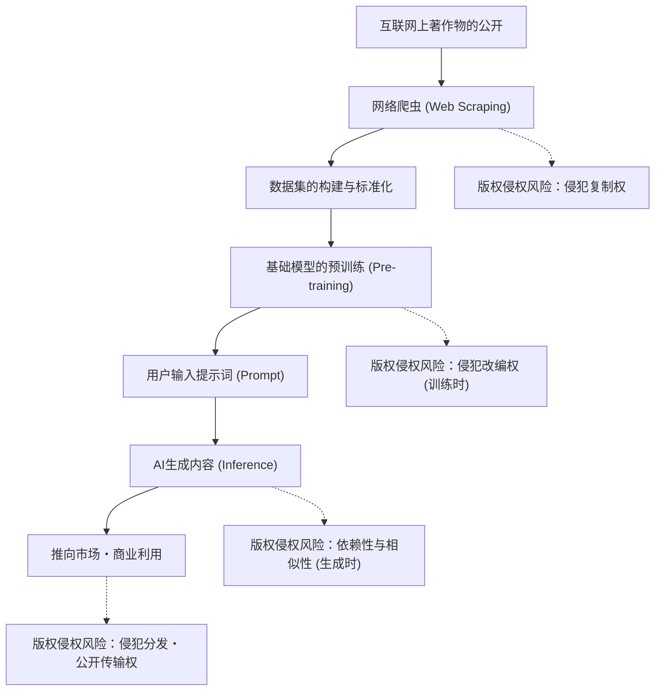
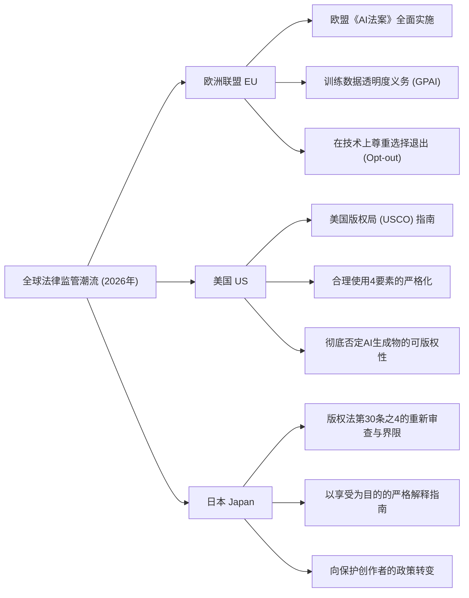
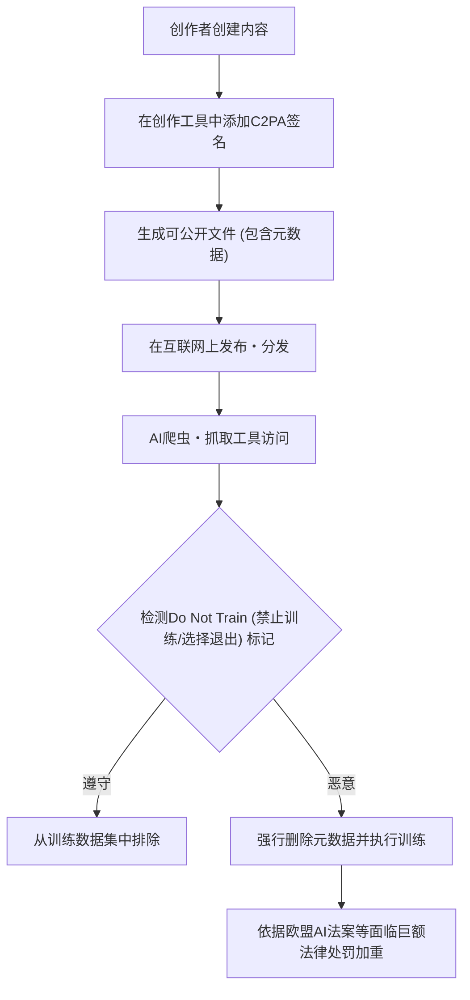

## 1. 引言：2026年，生成式AI与版权的全新范式转变

截至2026年，生成式AI（Generative AI）的技术演进在文本、图像、音频、视频，甚至3D模型和复杂的软件代码的自动生成方面，已经达到了从根本上颠覆人类创作过程的水平。GPT-5级别的大型语言模型（LLM）以及下一代扩散模型（Diffusion Model）正作为社会基础设施扎根，而关于支撑这些AI模型的“训练数据（Training Data）”的合法性，以及由AI生成的“生成内容（Generated Content）”的权利归属的争论，终于从法庭上的个案争议转变为国家层面的法律法规和国际标准化阶段。

2022年至2024年期间频繁发生的、由创作者和大型媒体公司针对主要AI开发企业发起的集体诉讼（Class Action），在2026年已经开始催生一些重要的司法判决和和解框架。与此同时，各国的大型立法机构为了跟上技术进化的速度，已经开始撒下新的监管之网。在AI技术带来的压倒性经济利益（生产力提升）与长期以来培育文化的创作者的权利保护这两种截然相反的价值观正面冲突的今天，企业的实务操作人员、工程师以及创作者自身准确把握法律全貌显得尤为重要。

本文将从法律和技术角度，极其详细地解析2026年全球关于生成式AI和版权的法律法规趋势、创作者方面的技术防御措施（数据投毒和出处证明），以及未来的展望。

---

## 2. 版权侵权机制：三个阶段的法律解释与风险

为了准确理清生成式AI与版权的问题，有必要将AI的整个生命周期划分为“训练（Training）”、“生成（Generation）”和“利用（Exploitation）”三个阶段。在2026年的法律体系中，每个阶段所涉及的权利性质已被明确界定。

### 2.1. 训练阶段（输入）中的“复制权”与“改编权”
为了构建基础模型，需要收集（网络抓取）互联网上庞大的文本、图像和代码数据，并用于AI的训练。在这个构建数据集的过程中，著作物会被复制到服务器的临时内存或存储中，因此原则上会引发“复制权”的侵权问题。

过去，AI开发企业一直主张“这种复制是为了信息分析目的，仅仅是机械处理，因此是合法的”或者“符合合理使用（Fair Use）”。然而，在2026年最新的法院判例和法学界的讨论中，AI模型从数据中提取的“特征表达”的性质成为了焦点。
如果AI模型将特定著作物的“表达上的本质特征”作为网络的权重（参数）内在化，并达到事后可以直接原样提取的状态（即所谓的“过拟合（Overfitting）”或“死记硬背（Memorization）”），这种行为可能超越了单纯的机械信息分析，而被有力地认为是构成“改编（Adaptation）”。

### 2.2. 生成阶段（输出）中的“依赖性”与“相似性”
这是用户输入提示词、AI生成内容的推理阶段。如果这里生成的图像或文章与现有的特定著作物极为相似，则有可能构成版权侵权。

构成版权侵权的两大要素是“依赖性（是否知道目标著作物，并依赖它进行创作）”和“相似性（是否能直接感受到表达上的本质特征）”。
在AI的情况下，与人类创作者不同，“AI是否知道该作品”这一主观要素如何判断，长期以来一直是个难题。在2026年的司法判决中，“只要证明AI模型已经读取了该著作物作为训练数据，就能强烈推定其依赖性（事实上的举证责任倒置）”这种方法正在被确立。因此，AI企业“使用了什么样的数据集进行训练”这种透明度，在判断侵权时具有极其重要的意义。

### 2.3. 利用阶段（用户责任与企业赔偿）
这是用户公开、销售或商业利用生成内容的阶段。如果仅仅是将AI工具作为“道具”使用，直接的版权侵权主体将是输入提示词并公开输出结果的用户。
在2026年的企业级AI服务（如Copilot或企业版图像生成AI）中，AI企业设定补偿用户版权侵权风险的“赔偿（免责・补偿）条款（Indemnity）”已成为行业标准。然而，这仅仅是B2B合同上的风险转移，并不意味着版权法上的侵权行为本身被合法化。使用AI的企业必须建立内部治理体系，以筛选生成物是否侵犯了他人的权利。

---

## 3. 主要国家/地区的法律法规趋势2026

世界各国为了在通过促进AI创新强化国家竞争力和保护创作者・版权所有者之间取得平衡，各自采取了截然不同的方法。我们将详细比较和分析2026年欧洲、美国和日本的法律监管现状。

### 3.1. 欧洲联盟（EU）：欧盟《AI法案》的全面实施与透明度要求的利齿
于2024年通过，经过阶段性的过渡期后在2026年迎来全面实施阶段的“欧盟《AI法案》（EU AI Act）”，是世界上最严格的AI监管框架。在版权语境下影响最大的是对通用AI（GPAI: General Purpose AI）模型开发者施加的**“透明度义务”**和**“遵守欧盟版权法的义务”**。

在欧盟《AI法案》下，GPAI的提供者负有公开AI训练所用内容的“足够详细的摘要（Sufficiently detailed summary）”的义务。截至2026年，这一“足够详细的摘要”的法律颗粒度已由欧洲法院和欧洲AI局（AI Office）的指南明确界定，单纯描述“使用了公开数据集Common Crawl”等抽象表述已被视为违法。法案严格要求披露具体的数据集URL列表、版权所有者密集的主要域名列表以及数据排除流程（选择退出处理状态）。

此外，根据欧盟《数字单一市场版权指令》（DSM指令）第4条基于“TDM（文本和数据挖掘）例外”的规定，当权利人以机器可读的方式（如后文所述的robots.txt或C2PA等）选择退出训练数据的使用时，AI企业有在技术和系统上予以尊重并将其从数据集中排除的明文义务。若违反此规定，将面临相当于其全球营业额一定比例的巨额罚款风险。

### 3.2. 美国（US）：合理使用的重新定义与USCO的严格立场
在AI产业中心美国，决定AI训练合法性的战场并非成文法的直接AI监管，而是现有版权法第107条规定的“合理使用（Fair Use）”法理。
以2023年最高法院的“Andy Warhol Foundation v. Goldsmith案”判决为契机，美国合理使用的判断标准，特别是第一要素“使用的目的和性质（是否为转化性使用）”的解释变得极其严格。

在截至2026年积累的联邦地方法院级别的重要判例（例如：纽约时报诉OpenAI案的实质性判决及和解）中，法院已经开始展示以下标准：
“如果AI从原始著作物中学习，并具有生成在市场上直接竞争的替代品（例如，与NYT文章极为相似的新闻摘要，或与Getty图像酷似的图库照片）的能力，该学习行为会对市场造成直接的负面影响（合理使用第四要素），因此整体上不受合理使用保护。”

此外，美国版权局（USCO）一直坚持由于AI自主生成的内容缺乏人类的“创造性贡献（Creative Authorship）”，故完全不承认其版权登记的方针。在2026年的最新操作指南中更加明确了一点：即使主张“运用了高级的提示工程（Prompt Engineering）”，这也仅仅是“对想法的指示（Commission）”，不能被认定为版权法上的创造性表达。为了主张对AI输出的版权，必须证明人类对该输出进行了“实质性且具有创造性的修改（例如在Photoshop中进行大幅修饰，或重新构建复杂的构图等）”。

### 3.3. 日本（Japan）：版权法第30条之4的“免费搭车时代”终结
日本因2018年版权法修订引入的第30条之4（为信息分析目的的复制等），曾被称为“世界上最有利于AI开发的国家”。该条文规定，只要不是为了“享受”著作物中所表达的思想或情感，无论是否营利，无论复制源数据是合法还是非法上传（※不过后来对从盗版中学习加以了限制），都广泛允许为了AI训练而进行复制，这是一项极其强大的权利限制规定。

然而，2024年以后，由于担心生成式AI可能直接夺走现有插画师、声优、作家的市场，创作者团体爆发了强烈反对，文化厅和著作权分科会开始对“以享受为目的”的解释进行严格化。

截至2026年，文化厅发布的最新法律指南中明确指出，以下行为会被视为“混合了享受目的”，极有可能不再适用第30条之4（=原则上需要版权所有者许可，未经许可即构成侵权）：
- 为了刻意模仿特定创作者的画风或声音特质（如微调Fine-tuning、LoRA、追加训练等方法），集中抓取该创作者的作品进行训练的行为。
- 为了让AI原样输出原始著作物的表达特征而设计的RAG（检索增强生成）系统的数据库录入行为。

这种解释的改变实际上宣告了日本国内“可以未经许可从任何数据中免费搭车训练”时代的终结。日本企业也和欧美企业一样，转向采购已经处理好权利的干净数据。

---

## 4. 2024〜2026年备受关注的国际诉讼的历史意义

梳理截至2026年对法规范形成产生重大影响的主要诉讼的现状。

1. **纽约时报诉 OpenAI / Microsoft (The New York Times v. OpenAI / Microsoft)**
   这起于2023年底提起的案件，成为了象征“生成式AI与版权”的最大诉讼。NYT提供了证据，证明其数百万篇文章被未经许可用于训练，并且ChatGPT几乎原样背诵并输出了NYT的文章（Memorization）。2026年，法院作出了“AI完整再现文章输出不构成合理使用”的中间裁决，最终双方通过签署巨额许可协议达成了实质性和解。这确立了“新闻内容用于AI训练应该是有偿的”行业标准。

2. **Getty Images v. Stability AI**
   针对图像生成AI“Stable Diffusion”开发商的诉讼。Getty的水印原样出现在AI生成的图像中，被作为未经许可进行训练的决定性证据。在英国和美国的平行诉讼中，2026年作出了具有里程碑意义的裁决：“故意去除或避开水印进行训练的行为，属于规避《数字千年版权法》（DMCA）中的技术保护措施”，并对AI企业实施了严厉的惩罚。

3. **GitHub Copilot 集体诉讼 (Doe v. GitHub)**
   针对学习了开源软件（OSS）代码的Copilot的诉讼。争议的焦点在于Copilot无视OSS许可证（如MIT或GPL）要求的“版权声明义务（Attribution）”就输出代码。截至2026年，AI开发工具已在法律上被强制要求搭载“实时检测输出代码是否与现有OSS代码一致，并附加许可证信息”的功能（过滤与归属系统）。

---

## 5. 创作者的自我防卫手段：Opt-out技术与C2PA的进化

法律法规的完善需要时间，而且要完全控制跨国AI企业的活动也是困难的。因此，创作者和出版商正在加速利用技术手段主动保护自己的著作物。

### 5.1. robots.txt 与 TDM Opt-out 协议
放置在网站根目录的 `robots.txt` 本来是控制搜索引擎爬虫的协议，但在2026年，它已经成为统一拦截AI训练爬虫（例如：OpenAI的 `GPTBot`、Google的 `Google-Extended`、Anthropic的 `ClaudeBot`）的标准手段。
但是，`robots.txt` 没有法律约束力，存在容易被恶意野生爬虫无视的根本缺陷。因此，将文本和数据挖掘（TDM）退出的意图直接嵌入HTTP标头或HTML的meta标签（例如：`<meta name="tdm-reservation" content="1">`）中，并使其具有机器可读法律效力的标准化做法（如W3C TDM Rep等）在世界范围内普及开来。在欧盟《AI法案》下，无视此meta标签进行爬取的行为将被明确视为违法行为。

### 5.2. C2PA与内容出处认证的原生实现
**C2PA (Coalition for Content Provenance and Authenticity)** 是一项在图像、视频和音频等数字内容上附加经过加密签名的、不可篡改的“出处元数据”的技术标准。到2026年，主要数码相机（Sony、Leica、Nikon等）和图像编辑软件（Adobe Photoshop等），甚至iOS和Android的默认相机应用都已经原生实现了C2PA。

C2PA清单（出处信息）可以包含一个明确的标记：“该图像不得用作AI训练数据（Do Not Train: DNT）”。反过来，它也会附带一个“这是由AI生成的”的AI生成标记，从而作为反深度伪造和版权保护的双重机制发挥作用。故意剥离（Stripping）元数据的行为，将作为“删除权利管理信息”而成为世界各国版权法的处罚对象。

---

## 6. 技术对抗措施：数据投毒（Glaze, Nightshade）的机制

在2026年，对于无视法律法规甚至选择退出意愿的AI企业，作为创作者“最强大、物理级别的对抗手段”得到广泛普及的，是“数据投毒（Data Poisoning）”技术。以芝加哥大学研究团队开发的 **Glaze** 和 **Nightshade** 为代表的这些技术，是在数学上从根本上破坏AI训练过程的攻击性、主动性防御手段。

### 6.1. 对抗性扰动（Adversarial Perturbation）的数学模型
AI模型（特别是图像识别中的CNN，以及生成中的Diffusion模型）并不是像人类一样在“视觉上”看待图像，而是将它们作为高维潜在空间（Latent Space）中的数值向量来处理。数据投毒通过在像素级别向图像添加人类眼睛完全无法察觉的微小噪声（对抗性扰动），故意让AI模型的编码器产生误认。

如果用数学公式表达，可以定义为如下的优化问题：

$$ \min_{\delta} \mathcal{L}(f(x+\delta), y_{target}) $$

$$ \text{subject to } ||\delta||_p < \epsilon $$

其中：
- $x$ 是原始干净图像（例如：“美丽的风景”图像）
- $\delta$ 是添加到图像中的微小噪声（扰动向量）
- $f$ 是AI特征提取器（编码器）
- $y_{target}$ 是想让AI误认的目标概念（例如：“充满噪音的垃圾”或“完全不同的物体”）
- $\mathcal{L}$ 是损失函数
- $\epsilon$ 是人类视觉无法察觉噪声的上限阈值（L-p范数）

投毒工具会在创作者的PC上解开这个优化问题，将图像“毒化”后再输出。

### 6.2. Glaze（风格・画风的保护）
Glaze是旨在保护创作者独特“画风（Style）”的工具。例如，如果对一幅精致的水彩画风格插画使用Glaze，它在人眼中依然是水彩画。但是，由于附加了扰动 $\delta$，AI的编码器 $f$ 会将该图像识别为“厚涂油画”或“抽象立体派”的向量并进行学习。
结果是，如果对学习了这张毒化图像的AI模型输入提示词“用（该创作者）的画风生成”，由于它在潜在空间的映射已经错乱，它将输出完全不同且乱七八糟的画风。这在物理上使得AI企业制作“特定创作者画风的复制模型（如LoRA等）”的行为失效。

### 6.3. Nightshade（概念破坏与模型崩溃）
Nightshade比Glaze更具攻击性，其目的是直接污染和破坏AI模型的“概念（Concept）”本身。
例如，对“狗”的图像应用Nightshade，并让AI作为“猫”去学习。只要在数据集中混入区区几百到几千张施加了这种特定提示词投毒（Prompt-Specific Poisoning）的图像，就已证实足以导致整个大型基础模型的概念对齐崩溃。
在被Nightshade污染的模型中，即使用户指示AI“生成一张可爱小狗的图片”，AI也会输出长着四条腿的怪猫，或者完全莫名其妙的纹理。

在2026年，当创作者将图像上传至社交网络或作品集网站时，通过浏览器扩展或去中心化协议在后台自动进行这些投毒处理已成为标准做法。这样一来，AI企业“从互联网上无差别抓取图像”的技术风险（耗资数亿美元训练的模型可能瞬间崩溃的风险）变得极高，结果作为防止未经许可进行训练的威慑力发挥了强效。

---

## 7. 生成式AI企业的战略转变：干净数据、授权许可与合成数据

面对加强的法律法规、败诉版权侵权的风险，以及诸如Nightshade等数据投毒技术的威胁，AI开发企业在2026年被迫进行了AI开发范式和商业模式的大规模转变。

### 7.1. 回归干净数据集与霸权争夺
过去那种无视授权抓取互联网上所有数据以构建巨大数据集（如LAION-5B等法外之地数据集）的“快速行动，打破常规（Move fast and break things）”的硅谷式做法已经走到了尽头。
取而代之的是，版权已完全理清并具备完善的Opt-out处理机制的“干净数据集”价值呈现天文数字般的飙升。像Adobe（Firefly）以及Getty Images、Shutterstock等自身拥有庞大已获许可内容的企业，通过标榜“零版权侵权风险”，在企业级市场确立了压倒性的优势。

### 7.2. 巨额许可协议与收入分成模式
主流AI供应商（OpenAI, Google, Anthropic, Meta等）与媒体公司（如纽约时报、Reddit、新闻集团等）、图库服务商、大型出版商甚至是音乐厂牌签订每年数千万甚至数亿美元规模的数据许可协议，已成为普遍现象。
此外，一种“收入分成模式（Revenue Share Model）”正在加速构建，即把由AI生成内容获得的订阅收入或API使用费返还给提供训练数据的原创作者。将区块链/Web3技术与C2PA相结合的智能合约，能基于贡献度计算出AI输出了多少依赖于哪些创作者的数据，并通过微支付（Micropayment）自动分配报酬，这种系统的社会化应用实验正在活跃进行中。

### 7.3. 依赖合成数据（Synthetic Data）与“模型崩溃”的困境
当面临人类数据在法律上或物理上（由于投毒）枯竭的现象，即所谓的“数据墙（Data Wall）”时，AI企业开始认真转向利用AI自身生成的数据（合成数据：Synthetic Data）来进行下一代AI模型的自我训练。
然而，数学和统计学研究已经证明，如果仅靠合成数据进行递归式的重复学习，会导致数据多样性丧失、少数特征被舍弃，最终引发模型输出质量致命劣化的“模型崩溃（Model Collapse）”现象。
归根结底，为了让AI不断进化，持续提供“由人类新创造的高质量、原创数据”是不可或缺的。如果榨取创作者并导致其灭绝，那么AI技术本身也会陷入进化的死胡同，这一悖论已然清晰显现。

---

## 8. 展望2030年与总结

2026年将作为生成式AI“法外之地拓荒期”彻底宣告结束，并进入法律、技术与人类创造力共存的“新社会契约（Social Contract）构建期”的里程碑式年份被载入史册。

### 未来亟待解决的重要议题
1. **实现国际法律协调**：如何将欧盟（严格透明度）、美国（注重基于合理使用的市场影响）和日本（享受目的的严格化）这三种不同的监管方式整合起来，以保障全球AI商业的法律确定性。在国际条约层面进行更新已是当务之急。
2. **AI时代“新权利”的创设**：面对传统的“复制・改编”概念无法涵盖的AI机器学习过程，是否应创设专门针对机器学习的新权利（例如“数据访问・摄取权”或“训练报酬请求权”），这方面的讨论仍在继续。
3. **人类创造力的重新定义与“人类证明（Proof of Humanity）”**：在一个AI能以超越人类的质量瞬间创造任何东西的时代，仅仅是“由人类注入灵魂创造出来（Proof of Humanity）”这一点本身，能获得多大的经济与文化溢价？正如手工工艺品在工业化时代提升了价值一样，人类艺术的品牌价值正在被重新定义。

要将AI技术进化的时钟倒转是不可能的。然而，如何驯服这股强大的技术力量，并使其受到控制而不破坏孕育了人类几千年文化与艺术的创作者生态系统，这取决于法学、计算机科学以及全社会的智慧。

面向2030年，我们比以往任何时候都更需要确立一个AI与创作者不再对立抢夺蛋糕，而是带着正当报酬和敬意共同创造，能够拓展人类创造力的“新数字经济圈”。
