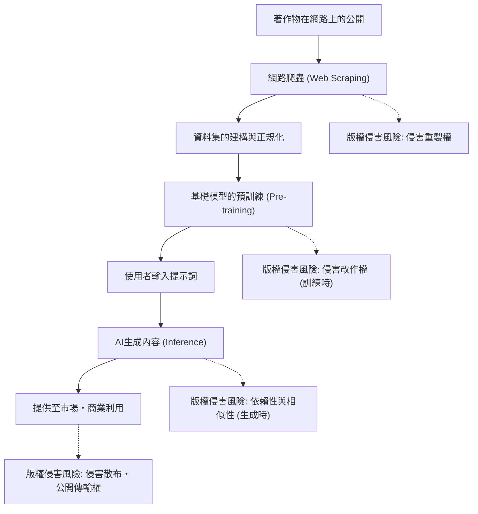
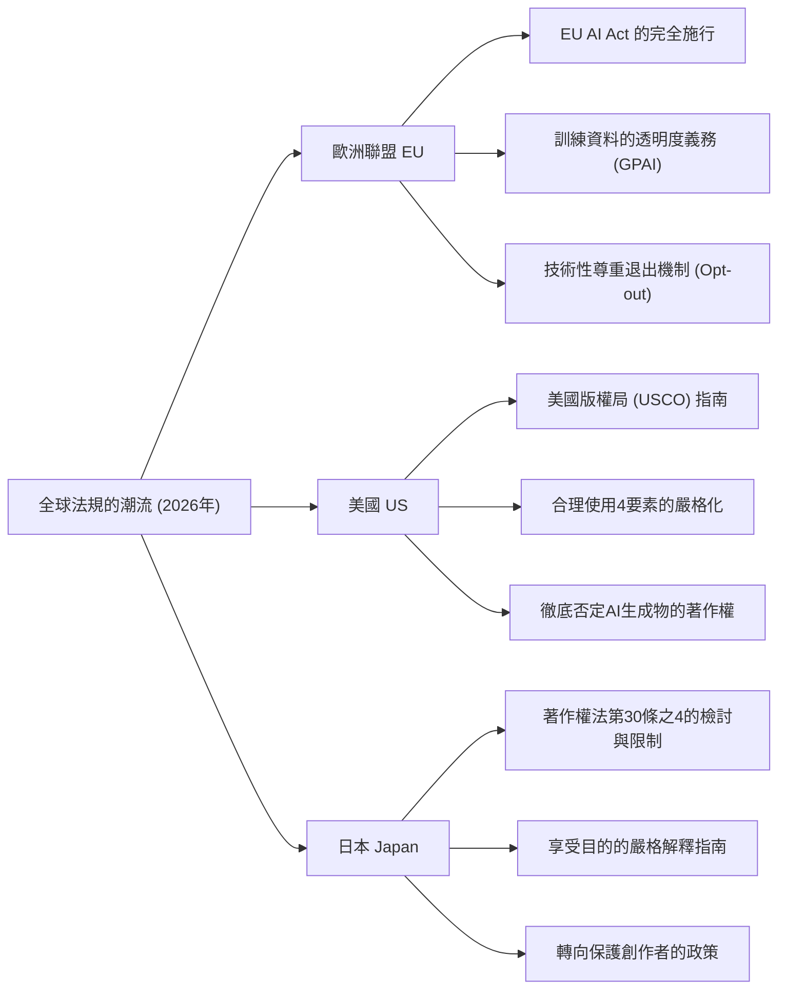
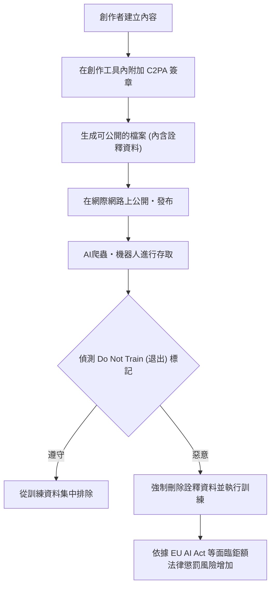

## 1. 前言：2026年，生成AI與版權的全新典範轉移

截至2026年，生成AI（Generative AI）的技術進化，從文字、圖像、語音、影片，甚至是3D模型與複雜軟體程式碼的自動生成，已經達到了從根本上顛覆人類創造過程的境界。在GPT-5等級的大型語言模型（LLM）與次世代擴散模型（Diffusion Model）逐漸成為社會基礎設施的同時，支撐這些AI模型的「訓練資料（Training Data）」的合法性，以及AI輸出的「生成物（Generated Content）」的權利歸屬問題，終於從法庭上的個別爭議，邁向了國家層級的法規與國際標準化階段。

從2022年到2024年間，創作者與大型媒體公司對主要AI開發企業頻繁發起的集體訴訟（Class Action），在2026年逐漸催生出數個重要的司法判決與和解框架。同時，各國立法機構為了追上技術的進化速度，也開始撒下新的管制網。在這個AI技術帶來的壓倒性經濟利益（生產力提升）與保護孕育文化的創作者權利這兩種相反價值觀正面衝突的現代，企業的實務負責人、工程師以及創作者本身，準確掌握法律的全貌已變得至關重要。

本文將從法律與技術的觀點，極為詳細地解說2026年時點關於生成AI與版權的全球法規趨勢、創作者端的技術防禦措施（資料中毒與來源證明），以及未來的展望。

---

## 2. 版權侵害的機制：三個階段的法律解釋與風險

為了正確釐清生成AI與版權的問題，必須將AI的整體生命週期分為「訓練（Training）」、「生成（Generation）」與「利用（Exploitation）」三個階段來思考。在2026年的法律體系中，各個階段所涉及的權利性質已變得明確。

### 2.1. 訓練階段（輸入）的「重製權」與「改作權」
為了建構基礎模型，必須收集（網路爬蟲）網路上龐大的文字、圖像與程式碼資料，並用於AI的訓練。在這個資料集建構的過程中，由於著作物會被複製到伺服器的暫存記憶體或儲存空間中，原則上會衍生出侵害「重製權」的問題。

過去，AI開發企業主張「這種複製是為了資訊分析目的，僅為機械性處理，因此是合法的」或是「符合合理使用（Fair Use）」。然而，在2026年最新的法院判例與法學界的討論中，AI模型從資料中提取的「表現特徵」的性質成為了焦點。
如果AI模型將特定著作物的「表現上的本質特徵」作為網路權重（參數）內化，並呈現出事後可直接提取的狀態（即所謂的「過度擬合（Overfitting）」或「死記硬背（Memorization）」），那麼這將超越單純的機械性資訊分析，有力觀點認為這可能構成「改作（Adaptation）」。

### 2.2. 生成階段（輸出）的「依賴性」與「相似性」
這是使用者輸入提示詞，由AI生成內容的推論階段。如果在這邊生成的圖像或文章，與現有特定的著作物極為相似，就有可能構成版權侵害。

構成版權侵害的兩大要件為「依賴性（是否知曉目標著作物，並依賴其創作）」與「相似性（是否能直接感受到表現上的本質特徵）」。
在AI的情況下，與人類創作者不同，如何判斷「AI是否知曉該作品」這種主觀要件，長久以來是一大課題。在2026年的司法判決中，「若能證明AI模型曾讀取該著作物作為訓練資料，即可強烈推斷具有依賴性（實質上的舉證責任倒置）」這種方法已逐漸成為定局。這使得AI企業「使用了什麼樣的資料集進行訓練」的透明度，在侵害判斷中具有極其重要的意義。

### 2.3. 利用階段（使用者的責任與企業的賠償補償）
這是使用者公開、販售、商業利用生成內容的階段。如果僅是將AI工具作為單純的「道具」使用，版權侵害的直接主體將是輸入提示詞並公開輸出的使用者。
在2026年的企業級AI服務（如Copilot或企業版圖像生成AI等）中，由AI企業補償使用者版權侵害風險的「免責・補償（Indemnity）條款」已成為業界標準。然而，這終究只是B2B合約上的風險轉移，並不會讓著作權法上的侵權行為本身合法化。使用企業必須建立內部治理體制，以篩選生成物是否侵害他人權利。

---

## 3. 主要國家與地區的法規趨勢2026

世界各國為了在促進AI創新以強化國家競爭力，與保護創作者及版權所有者這兩種相互衝突的國家利益之間取得平衡，採取了完全不同的方法。以下詳細比較並分析2026年歐洲、美國與日本在法規上的現狀。

### 3.1. 歐洲聯盟（EU）：EU AI Act 的完全施行與透明度要求的利刃
2024年成立，經過階段性過渡期後於2026年邁入完全施行階段的「歐盟AI法案（EU AI Act）」，是世界上最嚴格的AI監管框架。在版權的脈絡下，影響最大的是對通用AI（GPAI: General Purpose AI）模型的開發者所課徵的**「透明度義務」**與**「遵守歐盟著作權法義務」**。

在歐盟AI法案的規範下，GPAI的提供者有義務公開用於AI訓練的內容的「足夠詳細的摘要（Sufficiently detailed summary）」。截至2026年，這個「足夠詳細的摘要」的法律粒度已經由歐盟法院與歐洲AI局（AI Office）的指南予以明確化，單純描述「使用了公開資料集Common Crawl」這種抽象的寫法已被視為違法。嚴格要求揭露具體的資料集URL清單、版權擁有者密集的的主要網域清單，以及資料排除流程（Opt-out的處理狀況）。

此外，根據歐盟數位單一市場著作權指令（DSM指令）第4條的「TDM（文字與資料探勘）例外」規定，如果權利人以機器可讀的方法（後述的robots.txt或C2PA等）選擇退出（Opt-out）訓練資料的使用，AI企業有義務在技術與系統上尊重其意願，並將其從資料集中排除，此義務已被明文化。如果違反此規定，將面臨相當於全球營收一定比例的鉅額罰款風險。

### 3.2. 美國（US）：合理使用的重新定義與 USCO 的嚴格立場
身為AI產業中心的美國，並未透過成文法進行直接的AI管制，而是將現有著作權法第107條所規定的「合理使用（Fair Use）」法理，作為決定AI訓練合法性的戰場。
以2023年的「Andy Warhol Foundation v. Goldsmith 案件」最高法院判決為契機，美國關於合理使用的判斷基準，特別是針對第一要素「使用的目的與性質（是否為轉化性使用）」的解釋變得極度嚴格。

在截至2026年累積的聯邦地方法院層級的重要判例（例如：紐約時報訴OpenAI等案件的實質判決或和解）中，法庭開始展現出如下的基準：
「如果AI從原始著作物中學習，並具備生成在市場上與原始著作物直接競爭的替代品（例如與紐約時報報導極為相似的新聞摘要，或與Getty圖片酷似的圖庫照片）的能力，這種學習行為將對市場造成直接的負面影響（合理使用第四要素），因此整體而言不受合理使用保護。」

另外，美國版權局（USCO）持續堅持一項方針，即AI自主生成的內容不存在人類的「創造性貢獻（Creative Authorship）」，因此一律不認可其版權註冊。在2026年最新的實務指南中進一步明確指出，即使主張「運用了高階的提示詞工程（Prompt Engineering）」，那也只不過是單純的「下達點子指示（Commission）」，無法被認定為版權法上的創作表現。為了主張AI輸出的版權，必須證明人類對該輸出進行了「實質且具創造性的修改（例如在Photoshop進行大幅度修圖，或重新建構複雜的構圖等）」。

### 3.3. 日本（Japan）：著作權法第30條之4「免費搭車時代」的終結
日本因為2018年著作權法修法導入的第30條之4（為了資訊分析之重製等），曾被稱為「世界上對AI開發最有利的國家」。該條文是一項極為強大的權利限制規定，只要不是為了「享受」著作物中所表現的思想或情感，不論營利或非營利，也不論作為重製來源的資料是合法或非法上傳（※不過後來針對從盜版學習增加了限制），皆廣泛允許為了AI訓練而進行重製。

然而，2024年之後，由於擔憂生成AI可能直接奪走現有插畫家、聲優、作家的市場，創作者團體發起了強烈的反彈，文化廳與著作權分科委員會開始推動對「享受目的」的嚴格解釋。

截至2026年，文化廳發布的最新法律指南中提出明確見解，認為以下行為很可能被視為「混雜了享受目的」，從而不適用第30條之4（＝原則上需要版權所有者的許可，未經許可進行即構成版權侵害）：
- 為了刻意模仿特定創作者的畫風或聲線（如微調(Fine-tuning)、LoRA、追加學習等手法），而集中爬取該創作者的作品進行訓練的行為。
- 為了讓系統直接輸出原始著作物的表現特徵而設計的RAG（檢索增強生成）系統，將資料登錄到資料庫的行為。

隨著這項解釋的改變，日本國內「不論什麼資料都能無斷學習、免費搭車」的時代實際上宣告終結。日本企業也與歐美一樣，轉向採購已處理權利問題的乾淨資料。

---

## 4. 2024〜2026年備受矚目的國際訴訟之歷史意義

整理對法規形成產生重大影響的主要訴訟在2026年的現狀。

1. **The New York Times v. OpenAI / Microsoft**
   2023年底提起的這起案件，成為象徵「生成AI與版權」的最大訴訟。紐約時報（NYT）提出了自家數百萬篇報導被未經許可進行學習，且ChatGPT幾乎死記硬背地輸出（Memorization）紐約時報報導的證據。2026年，法院下達了「AI完全重現並輸出報導不構成合理使用」的中間判決，兩家公司最終以簽訂鉅額授權合約的形式達成了實質和解。這確立了「新聞內容的AI訓練應當付費」的業界標準。

2. **Getty Images v. Stability AI**
   這是針對圖像生成AI「Stable Diffusion」開發商的訴訟。Getty的浮水印（Watermark）被原封不動地輸出到AI生成圖像中，成為未經授權學習的決定性證據。作為在英國與美國並行訴訟的結果，2026年做出了「刻意移除或規避浮水印以進行學習的行為，構成數位千禧年著作權法（DMCA）中對技術保護措施的規避」這項劃時代的判決，並對AI企業處以嚴厲的懲罰。

3. **GitHub Copilot Litigation (Doe v. GitHub)**
   這是針對學習了開源軟體（OSS）程式碼的Copilot所發起的訴訟。爭議點在於其輸出的程式碼無視了OSS授權（如MIT或GPL等）所要求的「版權標示義務（Attribution）」。截至2026年，AI開發工具被法律強制要求搭載能夠即時偵測輸出的程式碼是否與現有OSS程式碼一致，並附加授權資訊的功能（過濾與歸屬系統）。

---

## 5. 創作者的自我防衛手段：退出技術 (Opt-out) 與 C2PA 的進化

法規的完善需要時間，且要完全控制跨國AI企業的活動也非常困難。因此，創作者與發布者正加速運用技術手段主動保護自身著作物的趨勢。

### 5.1. robots.txt 與 TDM 退出協議
放置在網站根目錄下的 `robots.txt`，原本是控制搜尋引擎爬蟲的協議，但在2026年已經成為統一阻擋AI訓練用爬蟲（例如：OpenAI的 `GPTBot`、Google的 `Google-Extended`、Anthropic的 `ClaudeBot`）的標準手段。
然而，`robots.txt` 不具法律約束力，且存在容易被惡意野生爬蟲無視的根本性缺陷。因此，將拒絕 TDM（Text and Data Mining）的意思直接嵌入HTTP標頭或HTML的meta標籤（例如：`<meta name="tdm-reservation" content="1">`）中，使其具備機器可讀性且具有法律效力的標準化作法（如 W3C TDM Rep 等）在全球普及開來。在歐盟AI法案下，無視這種meta標籤進行爬蟲行為，將被視為明確的違法行為。

### 5.2. C2PA 與內容來源認證的原生實作
**C2PA（Coalition for Content Provenance and Authenticity）** 是一項技術標準，它賦予圖像、影片、語音等數位內容帶有密碼學簽章、不可篡改的「來源詮釋資料（Provenance Metadata）」。到了2026年，主流的數位相機（如 Sony, Leica, Nikon 等）與影像編輯軟體（如 Adobe Photoshop 等），甚至是 iOS 和 Android 的內建相機應用程式，都已原生支援 C2PA。

C2PA 清單（來源資訊）中，可以包含一個明確的標記「此圖像不得作為 AI 的訓練資料使用（Do Not Train: DNT）」。反之，也會附上「此圖像為 AI 生成」的 AI 生成標記，發揮了防範深偽技術（Deepfake）與保護版權的雙重作用。刻意剝除（Stripping）詮釋資料的行為，在世界各國的著作權法中都會被視為「刪除權利管理資訊」而成為懲罰對象。

---

## 6. 技術對抗措施：資料中毒（Glaze, Nightshade）的機制

對於無視法規甚至無視退出意願的 AI 企業，在 2026 年廣泛普及、被視為創作者「最強烈且具物理性的對抗手段」，即是「資料中毒（Data Poisoning）」技術。以芝加哥大學研究團隊開發的 **Glaze** 與 **Nightshade** 為代表的這些技術，是從數學層面破壞 AI 學習過程本身的攻擊性・主動性防禦手法。

### 6.1. 對抗性擾動（Adversarial Perturbation）的數學模型
AI 模型（尤其是圖像識別中的 CNN，或生成中的 Diffusion 模型），並不是像人類一樣「視覺性地」看著圖像，而是將其作為高維度潛在空間（Latent Space）中的數值向量來處理。資料中毒在像素層面上，為圖像加上人類眼睛完全無法察覺的微小雜訊（對抗性擾動），刻意讓 AI 模型的編碼器（Encoder）產生誤認。

用數學式來表示，這可定義為以下的最佳化問題：

$$ \min_{\delta} \mathcal{L}(f(x+\delta), y_{target}) $$

$$ \text{subject to } ||\delta||_p < \epsilon $$

其中：
- $x$ 是原始乾淨的圖像（例：「美麗風景」的圖像）
- $\delta$ 是加在圖像上的微小雜訊（擾動向量）
- $f$ 是 AI 的特徵提取器（編碼器）
- $y_{target}$ 是希望讓 AI 誤認的目標概念（例：「充滿雜訊的垃圾」或「完全不同的物體」）
- $\mathcal{L}$ 是損失函數
- $\epsilon$ 是為了不讓人類視覺察覺到雜訊的上限閾值（L-p 範數）

中毒工具會在創作者的電腦上解開這個最佳化問題，將圖像「毒化」後再輸出。

### 6.2. Glaze（風格・畫風的保護）
Glaze 是一個用來保護創作者獨特「畫風（Style）」的工具。例如，將一幅精緻水彩畫風的插畫用 Glaze 處理後，在人類眼中它依然是水彩畫。但是，AI 的編碼器 $f$ 因為受到附加擾動 $\delta$ 的影響，會將該圖像識別為「厚塗油畫」或「抽象立體派」的向量，並以此進行學習。
結果，面對學習了這些毒化圖像的 AI 模型，即使輸入「用（該創作者）的畫風生成」的提示詞，由於潛在空間的映射已經錯亂，只會輸出完全不同且亂七八糟的畫風。這能在物理上讓 AI 企業製作「特定創作者畫風的複製模型（如 LoRA 等）」的企圖失效。

### 6.3. Nightshade（概念的破壞與模型崩潰）
Nightshade 比 Glaze 更具攻擊性，其目的在於污染・破壞 AI 模型本身的「概念（Concept）」。
例如，對「狗」的圖像套用 Nightshade，讓 AI 學習成「貓」。實證顯示，只要資料集中混入數百至數千張這種施加了針對特定提示詞中毒（Prompt-Specific Poisoning）的圖像，就足以讓大型基礎模型整體的概念對齊（Alignment）崩潰。
在受到 Nightshade 污染的模型中，即使使用者指示 AI「生成可愛狗的圖像」，AI 也會輸出有四條腿的奇怪貓咪圖像，或是完全不知所云的材質。

在 2026 年，創作者將圖像上傳至社群媒體或作品集網站時，透過瀏覽器擴充功能或去中心化協議，在背景自動進行這些中毒處理已經成為標準。這使得 AI 企業「從網路上無差別爬取圖像」的技術風險（花費數億元訓練的模型可能瞬間崩潰的風險）變得極高，結果作為防止未經授權學習的嚇阻力發揮了強烈作用。

---

## 7. 生成 AI 企業的策略轉變：乾淨資料、授權與合成資料

面對法規強化的壓力、版權侵害訴訟的敗訴風險，以及如 Nightshade 等資料中毒技術的威脅，AI 開發企業在 2026 年的今天，被迫進行 AI 開發典範與商業模式的大規模轉型。

### 7.1. 回歸乾淨資料集與霸權爭奪
過去那種未經許可爬取網路上所有資料，以建立巨大資料集（如 LAION-5B 等無法地帶資料集）的矽谷式「快速行動並打破陳規（Move fast and break things）」做法已經走到盡頭。
取而代之的是，版權完全釐清、且具備完善退出（Opt-out）機制的「乾淨資料集」價值出現天文數字般的飆升。如 Adobe（Firefly）、Getty Images、Shutterstock 等自身擁有龐大已授權內容的企業，藉由標榜「版權侵害零風險」，在企業級市場確立了壓倒性的優勢。

### 7.2. 鉅額授權合約與分潤模式
主要 AI 供應商（OpenAI, Google, Anthropic, Meta 等）與媒體企業（紐約時報, Reddit, News Corp 等）、圖庫服務、大型出版社，甚至音樂廠牌之間，簽訂每年數百億日圓規模的資料授權合約已成為常態。
此外，將 AI 生成內容帶來的訂閱收益或 API 使用費，回饋給提供訓練資料的原創作者的「分潤模式（Revenue Share Model）」建構也正在推進。結合區塊鏈・Web3 技術與 C2PA 的智慧合約，能夠計算 AI 在輸出時「依賴」了哪些創作者的資料及其貢獻度，並自動透過微型支付分配報酬，這種系統的社會實踐實驗正活躍地進行中。

### 7.3. 對合成資料（Synthetic Data）的依賴與「模型崩潰」的兩難
面對人類資料在法律上或物理上（因中毒）枯竭的現象，即所謂的「資料牆（Data Wall）」，AI 企業開始正式採用讓 AI 使用自己生成的資料（合成資料：Synthetic Data）來自我訓練次世代 AI 模型的方法。
然而，證明指出，如果僅依賴合成資料反覆遞迴訓練，資料的多樣性將會喪失，少數特徵會被捨棄，最終導致模型輸出品質發生致命劣化的「模型崩潰（Model Collapse）」這一數學與統計學現象。
到頭來，AI 若要持續進化，就必須要有「人類新創造的、高品質且原創的資料」持續供應，如果剝削創作者導致其滅絕，AI 技術本身也將陷入進化的死胡同，這個悖論已經變得清晰可見。

---

## 8. 邁向 2030 年的展望與總結

2026 年這一年，生成 AI 的「無法地帶開拓期」已徹底告終，將作為人類社會進入法律、科技與人類創造力共存的「新社會契約（Social Contract）建構期」之紀念碑年份被銘記於歷史。

### 未來必須解決的重要議題
1. **實現國際法規協調**：如何整合歐盟（嚴格透明度）、美國（基於合理使用重視市場影響）、日本（享受目的嚴格化）等不同的監管方法，以確保全球 AI 商業的法律確定性。在國際條約層級進行更新是當務之急。
2. **AI 時代「新權利」的創設**：針對傳統「重製・改作」概念無法涵蓋的 AI 機器學習過程，是否應該創設專門針對機器學習的新權利（例如「資料存取・匯入權」或「訓練報酬請求權」）的討論。
3. **人類創造力的重新定義與「人性證明（Proof of Humanity）」**：在 AI 能夠以超越人類的品質瞬間製作任何東西的時代，「由人類傾注靈魂創作（Proof of Humanity）」本身能帶來多少經濟與文化溢價。就像手工藝品在工業化時代提升了價值一樣，人類藝術的品牌價值正在被重新定義。

將 AI 技術進化的時鐘倒轉是不可能的。但是，如何馴服這項強大的技術，並加以控制以免破壞數千年來孕育人類文化與藝術的創作者生態系，有賴於法學、電腦科學以及整體社會的智慧。

邁向 2030 年，強烈要求建立一個 AI 與創作者不是互相敵對、爭奪大餅，而是以合理的報酬與尊重共同創作，並能擴展人類創造力的「新數位經濟圈」。
