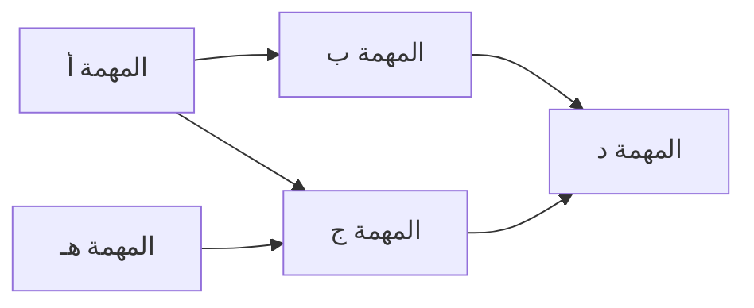
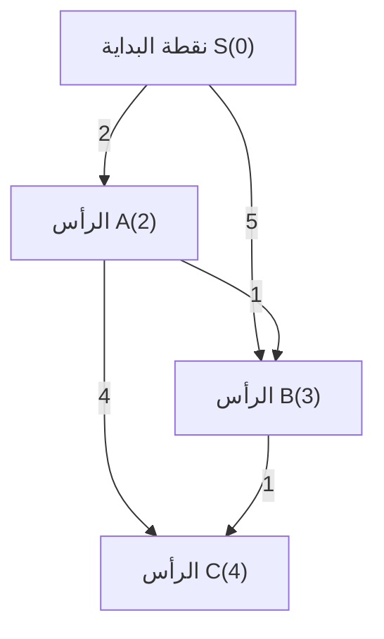
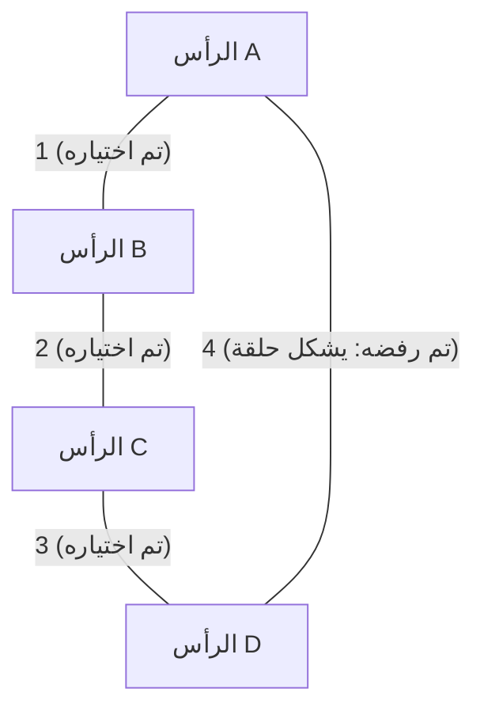
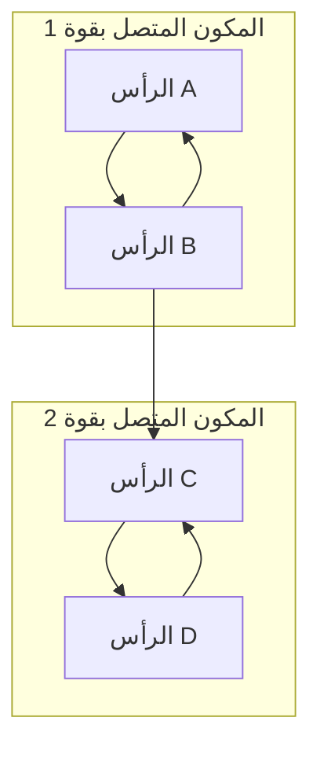

في البرمجة التنافسية، تعتبر نظرية الرسوم البيانية (Graph Theory) وخوارزمياتها من أهم المواضيع التي لا يمكن تجنبها. العديد من المسائل المطروحة في مسابقات مثل AtCoder، Codeforces، و TopCoder تحتوي على هيكل رسم بياني في خلفيتها. إنها تمثل سلاحاً قوياً لتجريد وحل المشكلات الواقعية، مثل أقصر مسار في شبكة الطرق، وتقليل تكلفة الاتصال في الشبكات، وحل تبعيات المهام.

في هذا المقال، سنغطي بشكل شامل خوارزميات الرسوم البيانية الرئيسية المتكررة في البرمجة التنافسية (الفرز الطوبولوجي، خوارزمية ديكسترا، خوارزمية بيلمان-فورد، خوارزمية فلويد-وارشال، خوارزمية كروسكال، خوارزمية بريم، وتحليل المكونات المتصلة بقوة)، مع خلفيتها النظرية، وتقييم التعقيد الحسابي باستخدام الصيغ الرياضية، وأمثلة تطبيقية محسنة بشكل كبير باستخدام لغة C++ الحديثة (C++17/20). نقدم لكم هذا الدليل الشامل في مقال ضخم، ليكون دليلك المثالي للـ "احتراف الكامل".

---

## 1. أساسيات وقيود خوارزميات الرسوم البيانية

قبل تعلم الخوارزميات، من المهم فهم القيود العامة وتقديرات التعقيد الحسابي لمسائل الرسوم البيانية في البرمجة التنافسية. يتم تمثيل الرسم البياني بعدد الرؤوس (النقاط) $V$ (Vertices) وعدد الحواف $E$ (Edges).

*   $O(V + E)$ : هذا هو التعقيد الحسابي المطلوب للمسائل التي يكون فيها عدد الرؤوس $V, E \le 10^5 \sim 10^6$. ينطبق هذا على البحث في العمق (DFS) والبحث في العرض (BFS).
*   $O((V + E) \log V)$ : يتكرر كثيراً في المسائل التي تكون فيها $V, E \le 10^5 \sim 2 \cdot 10^5$. هذا هو التعقيد الحسابي عند استخدام طابور الأولوية في خوارزميات مثل ديكسترا وبريم.
*   $O(V^2)$ : مسموح به في الرسوم البيانية الكثيفة (حيث $E \approx V^2$) التي يصل فيها عدد الرؤوس إلى $V \le 2000 \sim 3000$.
*   $O(V^3)$ : للمسائل التي يكون فيها $V \le 400 \sim 500$. خوارزمية فلويد-وارشال هي مثال تمثيلي لذلك.

في البرمجة التنافسية، من الشائع استخدام **قائمة الجوار (Adjacency List)** لتمثيل الرسوم البيانية. تستهلك مصفوفة الجوار ذاكرة بحجم $O(V^2)$، مما قد يؤدي إلى تجاوز حد الذاكرة (Memory Limit Exceeded) في المسائل التي تحتوي على عدد كبير من الرؤوس.

---

## 2. استكشاف وترتيب الرسوم البيانية

### الفرز الطوبولوجي (Topological Sort)

الفرز الطوبولوجي هو خوارزمية لترتيب رؤوس الرسم البياني الموجه الخالي من الحلقات (DAG: Directed Acyclic Graph) في خط واحد بحيث تتجه جميع الحواف الموجهة من الرؤوس الأمامية إلى الرؤوس الخلفية. يتم استخدامه لحل تبعيات المهام (مثال: لا يمكن بدء المهمة ب قبل انتهاء المهمة أ) ولتحديد ترتيب العمليات الحسابية في البرمجة الديناميكية (DP) على الـ DAG.

التعقيد الحسابي هو $O(V + E)$. هناك نوعان من التطبيقات: خوارزمية Kahn (تعتمد على BFS باستخدام درجات الدخول) والنهج المعتمد على DFS باستخدام ترتيب العودة. سنستعرض هنا خوارزمية Kahn، والتي تسهل أيضاً إيجاد الفرز الطوبولوجي الأصغر معجمياً.



#### مثال تطبيقي بـ C++ (خوارزمية Kahn)

```cpp
#include <iostream>
#include <vector>
#include <queue>

using namespace std;

// دالة لإجراء الفرز الطوبولوجي
// ترجع مصفوفة فارغة إذا كان هناك حلقة
vector<int> topological_sort(int V, const vector<vector<int>>& graph) {
    vector<int> in_degree(V, 0);
    // حساب درجات الدخول
    for (int u = 0; u < V; ++u) {
        for (int v : graph[u]) {
            in_degree[v]++;
        }
    }

    // إضافة الرؤوس التي درجة دخولها 0 إلى الطابور (إذا كنت تريد الترتيب الأصغر معجمياً، استخدم priority_queue<int, vector<int>, greater<int>>)
    queue<int> q;
    for (int i = 0; i < V; ++i) {
        if (in_degree[i] == 0) {
            q.push(i);
        }
    }

    vector<int> res;
    while (!q.empty()) {
        int u = q.front();
        q.pop();
        res.push_back(u);

        // تقليل درجة دخول الرؤوس المجاورة
        for (int v : graph[u]) {
            in_degree[v]--;
            if (in_degree[v] == 0) {
                q.push(v);
            }
        }
    }

    // التحقق مما إذا كان الرسم البياني يحتوي على حلقة
    if (res.size() != V) {
        return {}; // توجد حلقة
    }
    return res;
}
```

---

## 3. مشكلة أقصر مسار من مصدر واحد (SSSP: Single Source Shortest Path)

إنها مشكلة إيجاد أقصر مسار من نقطة بداية (مصدر) واحدة إلى جميع الرؤوس الأخرى. تختلف الخوارزمية القابلة للتطبيق بناءً على ما إذا كانت أوزان الحواف غير سالبة أو إذا كانت هناك أوزان سالبة.

### خوارزمية ديكسترا (Dijkstra's Algorithm)

خوارزمية ديكسترا هي خوارزمية سريعة لإيجاد أقصر مسار، ويمكن تطبيقها فقط عندما تكون **جميع أوزان الحواف غير سالبة**. تعتمد على المنهج الجشع (Greedy): "تحديد الرأس ذي أقصر مسافة معروفة حالياً كقيمة نهائية، ثم تحديث المسافات للرؤوس المجاورة له (عملية التخفيف - Relaxation)".

#### صيغة التخفيف (Relaxation)
لنفترض أن نقطة البداية هي $s$، وأقصر مسافة إلى الرأس $u$ هي $d[u]$، ووزن الحافة $(u, v)$ هو $w(u, v)$.
ستكون معادلة التحديث كالتالي:
$$ d[v] = \min(d[v], d[u] + w(u, v)) $$

باستخدام طابور الأولوية (`std::priority_queue`)، يمكن استخراج الرأس غير المؤكد ذي المسافة الأقل في زمن قدره $O(\log V)$، وبذلك يكون التعقيد الزمني الإجمالي هو $O((V + E) \log V)$. التعقيد المكاني هو $O(V + E)$.


كما يظهر في الشكل أعلاه، التكلفة المباشرة للذهاب من S إلى B هي 5، ولكن بالمرور عبر A يمكن الوصول بتكلفة 3. تقوم خوارزمية ديكسترا بإجراء التحسينات بهذه الطريقة.

#### مثال تطبيقي بـ C++

```cpp
#include <iostream>
#include <vector>
#include <queue>

using namespace std;

const long long INF = 1e18; // قيمة كبيرة كفاية

struct Edge {
    int to;
    long long weight;
};

// خوارزمية ديكسترا
// ترجع مصفوفة أقصر المسافات من المصدر s إلى كل الرؤوس
vector<long long> dijkstra(int V, const vector<vector<Edge>>& graph, int s) {
    vector<long long> dist(V, INF);
    dist[s] = 0;
    
    // طابور أولوية يدير {المسافة، الرأس} (مرتب تصاعدياً حسب المسافة)
    using P = pair<long long, int>;
    priority_queue<P, vector<P>, greater<P>> pq;
    pq.push({0, s});
    
    while (!pq.empty()) {
        auto [d, u] = pq.top();
        pq.pop();
        
        // تجاوز إذا كان قد تم إيجاد مسار أقصر مسبقاً (تجاهل المعلومات القديمة)
        if (dist[u] < d) continue;
        
        // عملية التخفيف
        for (const auto& edge : graph[u]) {
            int v = edge.to;
            long long cost = edge.weight;
            if (dist[v] > dist[u] + cost) {
                dist[v] = dist[u] + cost;
                pq.push({dist[v], v});
            }
        }
    }
    return dist;
}
```
العبارة `if (dist[u] < d) continue;` مهمة للغاية. في خوارزمية ديكسترا، قد يتم دفع نفس الرأس إلى الطابور عدة مرات، ولكن هذا التحقق يمنع عمليات البحث غير الضرورية (تشذيب الفروع - Pruning).

### خوارزمية بيلمان-فورد (Bellman-Ford Algorithm)

عندما تتضمن أوزان الحواف قيماً سالبة، لن تتمكن خوارزمية ديكسترا من تقديم الإجابات الصحيحة. هنا يأتي دور خوارزمية بيلمان-فورد. من خلال تكرار عملية التخفيف على جميع الحواف $V - 1$ مرة، فإنها تحسب أقصر مسار بشكل صحيح حتى مع وجود أوزان سالبة.

إذا حدث تحديث حتى في التكرار رقم $V$، فهذا يعني وجود **حلقة سالبة (Negative Cycle)**. في البرمجة التنافسية، غالباً ما تظهر مسائل تتطلب "اكتشاف الحلقات السالبة"، وتعتبر خوارزمية بيلمان-فورد ممتازة في ذلك.

التعقيد الزمني هو $O(V \times E)$، وهي أبطأ من خوارزمية ديكسترا، لذلك يجب ملاحظة أنها قابلة للتطبيق فقط ضمن قيود تصل إلى حوالي $V \le 2000, E \le 5000$.

#### مثال تطبيقي بـ C++

```cpp
#include <iostream>
#include <vector>

using namespace std;

const long long INF = 1e18;

struct Edge {
    int from;
    int to;
    long long weight;
};

// خوارزمية بيلمان-فورد
// القيمة المرجعة: {مصفوفة أقصر المسافات، هل توجد حلقة سالبة؟}
pair<vector<long long>, bool> bellman_ford(int V, const vector<Edge>& edges, int s) {
    vector<long long> dist(V, INF);
    dist[s] = 0;
    bool negative_cycle = false;

    // تكرار الحلقة V مرات
    for (int i = 0; i < V; ++i) {
        bool updated = false;
        for (const auto& edge : edges) {
            if (dist[edge.from] != INF && dist[edge.to] > dist[edge.from] + edge.weight) {
                dist[edge.to] = dist[edge.from] + edge.weight;
                updated = true;
                // إذا حدث التحديث في المرة رقم V، إذن توجد حلقة سالبة
                if (i == V - 1) {
                    negative_cycle = true;
                }
            }
        }
        // الإنهاء المبكر إذا لم يكن هناك تحديث (تحسين)
        if (!updated) break;
    }
    
    return {dist, negative_cycle};
}
```

---

## 4. مشكلة أقصر مسار بين كل أزواج النقاط (APSP: All-Pairs Shortest Path)

### خوارزمية فلويد-وارشال (Floyd-Warshall Algorithm)

إنها خوارزمية لإيجاد أقصر مسافة بين جميع أزواج الرؤوس في الرسم البياني. تعتمد الخوارزمية على البرمجة الديناميكية (DP). وتتميز بكونها مبسطة للغاية وسهلة التطبيق بشكل كبير.

معادلة انتقال الحالة هي كما يلي: نختار المسافة الأقصر بين المسار الذي يمر عبر الرأس $k$ والمسار الذي لا يمر به.
$$ d[i][j] = \min(d[i][j], d[i][k] + d[k][j]) $$

نظراً لاستخدام ثلاث حلقات متداخلة، يكون التعقيد الزمني هو $O(V^3)$ والتعقيد المكاني هو $O(V^2)$. إذا كان عدد الرؤوس في حدود $V \le 400$، فيمكن تنفيذها ضمن الحد الزمني المسموح (عادةً ثانيتان).

#### مثال تطبيقي بـ C++

```cpp
#include <iostream>
#include <vector>
#include <algorithm>

using namespace std;

const long long INF = 1e18;

// خوارزمية فلويد-وارشال
// dist[i][j] تمثل مبدئياً وزن الحافة من i إلى j (إذا لم توجد حافة فهي INF، وإذا كانت i==j فهي 0)
void floyd_warshall(int V, vector<vector<long long>>& dist) {
    // الرأس الوسيط k
    for (int k = 0; k < V; ++k) {
        // نقطة البداية i
        for (int i = 0; i < V; ++i) {
            // نقطة النهاية j
            for (int j = 0; j < V; ++j) {
                // التحقق من أنها ليست INF لتجنب تجاوز الحد الأعلى (Overflow)
                if (dist[i][k] != INF && dist[k][j] != INF) {
                    dist[i][j] = min(dist[i][j], dist[i][k] + dist[k][j]);
                }
            }
        }
    }
}
```

يمكن أيضاً اكتشاف الحلقات السالبة باستخدام خوارزمية فلويد-وارشال. بعد انتهاء الحلقات، إذا وجد رأس `i` بحيث `dist[i][i] < 0`، فهذا يعني أن الرسم البياني يحتوي على حلقة سالبة.

---

## 5. الشجرة الممتدة الصغرى (MST: Minimum Spanning Tree)

في الرسم البياني غير الموجه والمتصل، يُطلق على الشجرة (رسم بياني فرعي لا يحتوي على حلقات) التي تربط جميع الرؤوس بحيث يكون مجموع أوزان حوافها هو الحد الأدنى اسم **الشجرة الممتدة الصغرى (MST)**. تُطرح هذه المشكلة بشكل مباشر في تطبيقات مثل تقليل تكلفة تمديد الشبكات.

### خوارزمية كروسكال (Kruskal's Algorithm)

تعتمد على المنهج الجشع، حيث يتم فرز جميع الحواف ترتيباً تصاعدياً بناءً على أوزانها، ثم اختيارها بالترتيب بشرط ألا تشكل حلقة. يمكن إجراء فحص الحلقات بسرعة باستخدام **بنية بيانات المجموعات المنفصلة (Union-Find, Disjoint Set)**.

التعقيد الزمني يعتمد بشكل أساسي على عملية فرز الحواف وهو $O(E \log E)$. إنها الخوارزمية الأكثر استخداماً لبناء MST في البرمجة التنافسية.



#### مثال تطبيقي بـ C++

```cpp
#include <iostream>
#include <vector>
#include <algorithm>

using namespace std;

// بنية المجموعات المنفصلة (Union-Find)
struct UnionFind {
    vector<int> parent, rank, size;
    UnionFind(int n) : parent(n), rank(n, 0), size(n, 1) {
        for (int i = 0; i < n; i++) parent[i] = i;
    }
    int find(int x) {
        if (parent[x] == x) return x;
        // ضغط المسار
        return parent[x] = find(parent[x]);
    }
    bool unite(int x, int y) {
        int root_x = find(x);
        int root_y = find(y);
        if (root_x == root_y) return false;
        
        // الدمج بناءً على الرتبة (Rank)
        if (rank[root_x] < rank[root_y]) swap(root_x, root_y);
        parent[root_y] = root_x;
        if (rank[root_x] == rank[root_y]) rank[root_x]++;
        size[root_x] += size[root_y];
        return true;
    }
    bool same(int x, int y) { return find(x) == find(y); }
};

struct Edge {
    int u, v;
    long long weight;
    // دالة المقارنة للفرز
    bool operator<(const Edge& other) const {
        return weight < other.weight;
    }
};

// خوارزمية كروسكال
long long kruskal(int V, vector<Edge>& edges) {
    // فرز الحواف تصاعدياً حسب الوزن
    sort(edges.begin(), edges.end());
    
    UnionFind uf(V);
    long long mst_cost = 0;
    int edge_count = 0;
    
    for (const auto& edge : edges) {
        if (uf.unite(edge.u, edge.v)) {
            mst_cost += edge.weight;
            edge_count++;
            // الانتهاء مبكراً عند اختيار V-1 حافة (تحسين)
            if (edge_count == V - 1) break;
        }
    }
    return mst_cost;
}
```

### خوارزمية بريم (Prim's Algorithm)

تتبع نهجاً شبيهاً جداً بخوارزمية ديكسترا. تبدأ من رأس واحد، وتستمر في اختيار الحافة ذات الوزن الأقل التي تتصل مباشرة بالشجرة المبنية حالياً، وذلك لتنمية الشجرة تدريجياً.

عند استخدام طابور الأولوية، يكون التعقيد الزمني هو $O((V + E) \log V)$. في الرسوم البيانية الكثيفة (التي تحتوي على عدد كبير من الحواف)، قد يكون التطبيق المعتمد على المصفوفات لخوارزمية بريم بـ $O(V^2)$ أسرع من خوارزمية كروسكال.

#### مثال تطبيقي بـ C++

```cpp
#include <iostream>
#include <vector>
#include <queue>

using namespace std;

struct Edge {
    int to;
    long long weight;
};

// خوارزمية بريم
long long prim(int V, const vector<vector<Edge>>& graph) {
    vector<bool> used(V, false);
    // {الوزن، الرأس}
    using P = pair<long long, int>;
    priority_queue<P, vector<P>, greater<P>> pq;
    
    long long mst_cost = 0;
    // نختار الرأس 0 كنقطة بداية
    pq.push({0, 0});
    
    while (!pq.empty()) {
        auto [cost, u] = pq.top();
        pq.pop();
        
        if (used[u]) continue;
        used[u] = true;
        mst_cost += cost;
        
        for (const auto& edge : graph[u]) {
            if (!used[edge.to]) {
                pq.push({edge.weight, edge.to});
            }
        }
    }
    return mst_cost;
}
```

---

## 6. موضوع متقدم: تحليل المكونات المتصلة بقوة (SCC: Strongly Connected Components)

في الرسم البياني الموجه، تُسمى "مجموعة الرؤوس التي يمكن التنقل بينها بشكل متبادل" بالمكونات المتصلة بقوة (SCC). عند تجميع أي رسم بياني موجه بناءً على المكونات المتصلة بقوة، فإن الشكل الناتج سيكون دائماً DAG (رسم بياني موجه خالٍ من الحلقات). يُطلق على هذا اسم **تحليل المكونات المتصلة بقوة**. إنها عملية معالجة مسبقة هامة للغاية لتبسيط بنية الرسم البياني وتسهيل حل المسائل.

في البرمجة التنافسية، تُستخدم بكثرة لحل مشكلات 2-SAT، ولتقليص الرسوم البيانية التي تحتوي على حلقات إلى DAG لإجراء البرمجة الديناميكية (DP) عليها.

### خوارزمية كوساراجو (Kosaraju's Algorithm)

خوارزمية كوساراجو هي طريقة أنيقة وفعالة لبناء الـ SCC من خلال تنفيذ DFS (البحث في العمق) مرتين فقط. التعقيد الزمني الخاص بها هو $O(V + E)$، وتعمل بوقت خطي.

خطوات الخوارزمية:
1. قم بإجراء DFS على الرسم البياني الأصلي وسجل الرؤوس في مصفوفة وفقاً لترتيب العودة (post-order).
2. أنشئ **رسماً بيانياً معكوساً** بحيث يتم عكس اتجاه جميع الحواف.
3. بالتتبع من **نهاية المصفوفة** المسجلة في الخطوة 1 (بترتيب العودة المتأخر أولاً)، قم بإجراء DFS من الرؤوس غير المزورة على الرسم البياني المعكوس. مجموعة الرؤوس التي يمكن الوصول إليها في كل جولة من الـ DFS تمثل SCC واحداً.



#### مثال تطبيقي بـ C++

```cpp
#include <iostream>
#include <vector>
#include <algorithm>

using namespace std;

struct SCC {
    int V;
    vector<vector<int>> graph, rev_graph;
    vector<int> order, comp;
    vector<bool> used;

    SCC(int n) : V(n), graph(n), rev_graph(n), comp(n, -1), used(n, false) {}

    void add_edge(int from, int to) {
        graph[from].push_back(to);
        rev_graph[to].push_back(from);
    }

    // البحث في العمق الأول (تسجيل ترتيب العودة)
    void dfs1(int u) {
        used[u] = true;
        for (int v : graph[u]) {
            if (!used[v]) dfs1(v);
        }
        order.push_back(u);
    }

    // البحث في العمق الثاني (الاستكشاف على الرسم البياني المعكوس)
    void dfs2(int u, int id) {
        used[u] = true;
        comp[u] = id;
        for (int v : rev_graph[u]) {
            if (!used[v]) dfs2(v, id);
        }
    }

    // عملية بناء المكونات المتصلة بقوة. القيمة المرجعة هي عدد مجموعات الـ SCC
    int build() {
        // البحث في العمق الأول
        for (int i = 0; i < V; ++i) {
            if (!used[i]) dfs1(i);
        }

        fill(used.begin(), used.end(), false);
        int group_id = 0;

        // البحث في العمق الثاني (بترتيب عكسي لـ order)
        for (int i = V - 1; i >= 0; --i) {
            int u = order[i];
            if (!used[u]) {
                dfs2(u, group_id++);
            }
        }
        return group_id;
    }
};
```

تحتوي المصفوفة `comp` على مُعرّف (ID) المكون المتصل بقوة الذي ينتمي إليه كل رأس. يمتلك هذا المُعرّف خاصية مفيدة جداً وهي أنه يتم تعيينه بترتيب الفرز الطوبولوجي. بعبارة أخرى، بمجرد النظر إلى قيم `comp`، يمكنك فوراً فهم العلاقات والتبعيات بعد تقليص الرسم إلى DAG.

---

## 7. الخاتمة ونصائح للتعلم

في هذا المقال، استعرضنا بشكل شامل خوارزميات الرسوم البيانية التي تظهر بكثرة في البرمجة التنافسية.
سر التطور في مسائل الرسوم البيانية هو **"تكرار التطبيق حتى يصبح مألوفاً كالعادة"** و **"التدرب على التفكير في كيفية تحويل المسألة إلى رسم بياني (تحديد ما هي الرؤوس، وما هي الحواف)"**.

1. أولاً، تأكد من قدرتك على كتابة DFS و BFS بسرعة وبدون أخطاء.
2. ثانياً، تمكن من كتابة خوارزميتي ديكسترا وكروسكال من الذاكرة (ضرورية لمستويات AtCoder البني إلى الأخضر).
3. أخيراً، قم بزيادة ذخيرتك بخوارزميات بيلمان-فورد، فلويد-وارشال، الفرز الطوبولوجي، والـ SCC (ستكون أسلحة قوية في مستويات AtCoder السماوي إلى الأزرق).

نوصي بشدة بإنشاء مكتبة من القصاصات البرمجية (Code Snippets) (حفظها في أداة قصاصات أو في مستودع GitHub الخاص بك) بحيث تكون مستعداً لاستدعائها دون تردد أثناء المسابقة الحقيقية.

تعتبر خوارزميات الرسوم البيانية في البرمجة التنافسية من أكثر المجالات التي يمكنك من خلالها تجربة جمال وقوة الخوارزميات. لا تتردد في كتابة الأكواد الموجودة في هذا المقال وتحدي نفسك في حل المسائل السابقة على أنظمة التحكيم عبر الإنترنت (Online Judges)!
