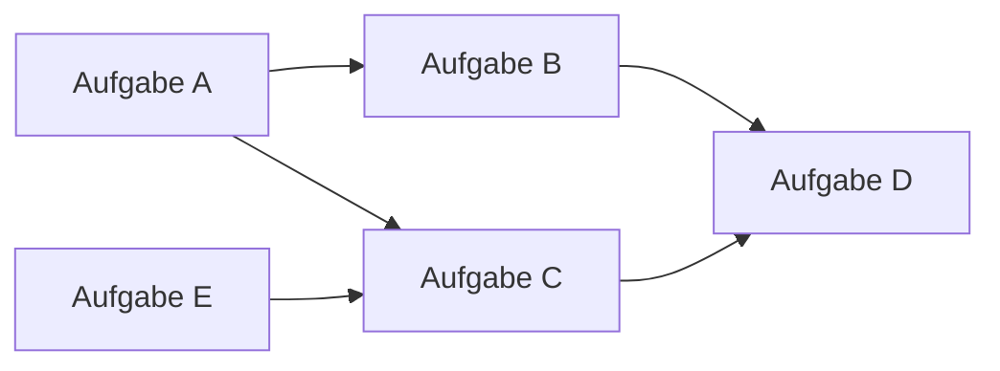
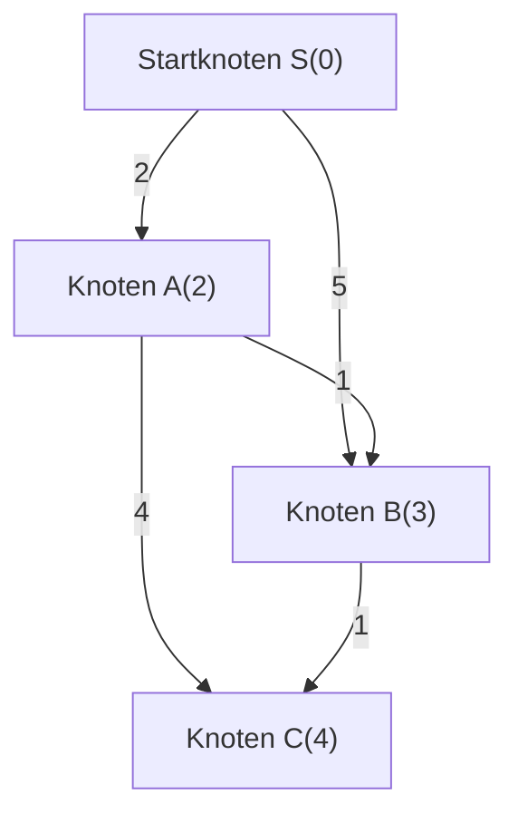
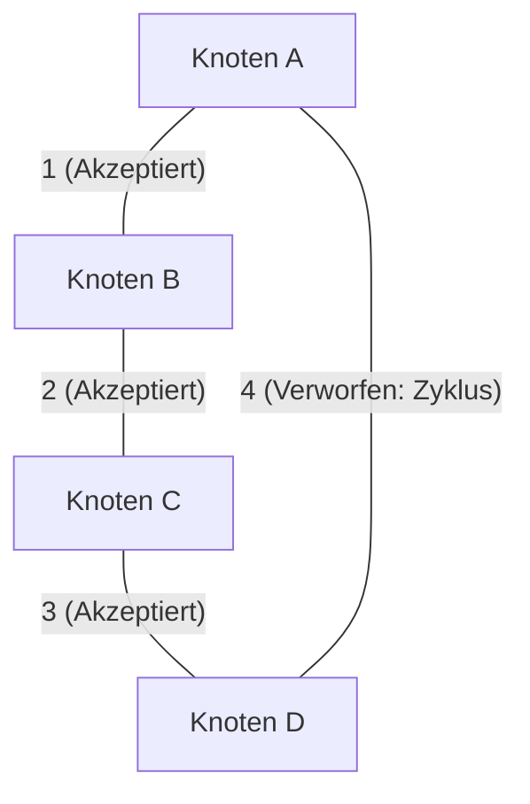
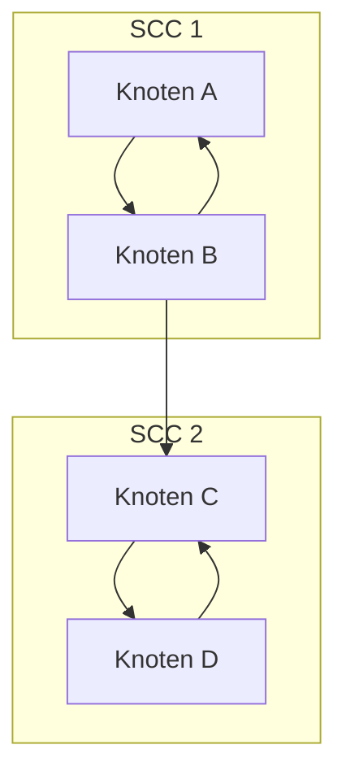

In der kompetitiven Programmierung (CP) sind die Graphentheorie und ihre Algorithmen eines der wichtigsten Themen, denen man nicht ausweichen kann. Viele Probleme in Wettbewerben wie AtCoder, Codeforces und TopCoder haben eine Graphenstruktur im Hintergrund. Sie sind eine mächtige Waffe zur Abstraktion und Lösung realer Probleme, wie z.B. kürzeste Wege in Straßennetzen, Minimierung der Kommunikationskosten in Netzwerken und Auflösung von Aufgabenabhängigkeiten.

In diesem Artikel behandeln wir umfassend die wichtigsten Graphenalgorithmen, die in der kompetitiven Programmierung häufig vorkommen (Topologische Sortierung, Dijkstra-Algorithmus, Bellman-Ford-Algorithmus, Floyd-Warshall-Algorithmus, Kruskal-Algorithmus, Prim-Algorithmus, Zerlegung in stark zusammenhängende Komponenten). Wir werden ihren theoretischen Hintergrund, die Bewertung der Zeitkomplexität mit mathematischen Formeln und hochoptimierte Implementierungsbeispiele in modernem C++ (C++17/20) erläutern. Dies ist ein echter "kompletter Leitfaden" mit großem Volumen.

---

## 1. Grundlagen und Einschränkungen von Graphenalgorithmen

Bevor wir Algorithmen lernen, ist es wichtig, die allgemeinen Einschränkungen und Richtwerte für die Zeitkomplexität von Graphenproblemen in der kompetitiven Programmierung zu verstehen. Ein Graph wird durch die Anzahl der Knoten $V$ (Vertices) und Kanten $E$ (Edges) dargestellt.

*   $O(V + E)$ : Die erforderliche Zeitkomplexität für Probleme mit Knoten $V, E \le 10^5 \sim 10^6$. Dies gilt für Tiefensuche (DFS) und Breitensuche (BFS).
*   $O((V + E) \log V)$ : Häufig in Problemen mit $V, E \le 10^5 \sim 2 \cdot 10^5$. Dies ist die Zeitkomplexität bei Verwendung einer Prioritätswarteschlange (Priority Queue) in Algorithmen wie Dijkstra oder Prim.
*   $O(V^2)$ : Zulässig für dichte Graphen ($E \approx V^2$) mit $V \le 2000 \sim 3000$.
*   $O(V^3)$ : Probleme mit $V \le 400 \sim 500$. Der Floyd-Warshall-Algorithmus ist ein typisches Beispiel.

In der kompetitiven Programmierung ist es üblich, eine **Adjazenzliste (Adjacency List)** zur Darstellung von Graphen zu verwenden. Eine Adjazenzmatrix verbraucht $O(V^2)$ Speicherplatz, was bei Problemen mit vielen Knoten zu einer Überschreitung des Speicherlimits (Memory Limit Exceeded) führt.

---

## 2. Traversierung und Ordnung von Graphen

### Topologische Sortierung (Topological Sort)

Die topologische Sortierung ist ein Algorithmus, der die Knoten eines gerichteten azyklischen Graphen (DAG: Directed Acyclic Graph) so in einer Linie anordnet, dass alle gerichteten Kanten von Knoten weiter vorne zu Knoten weiter hinten zeigen. Er wird verwendet, um Aufgabenabhängigkeiten aufzulösen (z.B. Aufgabe B kann nicht gestartet werden, bevor Aufgabe A beendet ist) oder um die Berechnungsreihenfolge in der dynamischen Programmierung (DP) auf einem DAG zu bestimmen.

Die Zeitkomplexität beträgt $O(V + E)$. Es gibt zwei Implementierungsarten: Kahns Algorithmus (basierend auf BFS mit Eingangsgrad) und eine DFS-basierte Methode mit Post-Order. Hier stellen wir Kahns Algorithmus vor, der es auch leicht macht, die lexikographisch kleinste topologische Sortierung zu finden.



#### C++ Implementierungsbeispiel (Kahns Algorithmus)

```cpp
#include <iostream>
#include <vector>
#include <queue>

using namespace std;

// Funktion zur Durchführung der topologischen Sortierung
// Gibt ein leeres Array zurück, wenn ein Zyklus vorhanden ist
vector<int> topological_sort(int V, const vector<vector<int>>& graph) {
    vector<int> in_degree(V, 0);
    // Berechnung des Eingangsgrades
    for (int u = 0; u < V; ++u) {
        for (int v : graph[u]) {
            in_degree[v]++;
        }
    }

    // Füge Knoten mit Eingangsgrad 0 zur Warteschlange hinzu (für lexikographisch kleinste verwende priority_queue<int, vector<int>, greater<int>>)
    queue<int> q;
    for (int i = 0; i < V; ++i) {
        if (in_degree[i] == 0) {
            q.push(i);
        }
    }

    vector<int> res;
    while (!q.empty()) {
        int u = q.front();
        q.pop();
        res.push_back(u);

        // Verringere den Eingangsgrad benachbarter Knoten
        for (int v : graph[u]) {
            in_degree[v]--;
            if (in_degree[v] == 0) {
                q.push(v);
            }
        }
    }

    // Überprüfe, ob der Graph einen Zyklus enthält
    if (res.size() != V) {
        return {}; // Zyklus vorhanden
    }
    return res;
}
```

---

## 3. Kürzeste Pfade von einem einzigen Startknoten (SSSP: Single Source Shortest Path)

Ein Problem, bei dem der kürzeste Weg von einem Startknoten zu allen anderen Knoten gefunden wird. Der anwendbare Algorithmus hängt davon ab, ob die Kantengewichte nicht negativ sind oder ob negative Gewichte existieren.

### Dijkstra-Algorithmus (Dijkstra's Algorithm)

Der Dijkstra-Algorithmus ist ein schneller Algorithmus für kürzeste Pfade, der anwendbar ist, wenn **alle Kantengewichte nicht negativ** sind. Er basiert auf einem Greedy-Ansatz: "Bestimme den Knoten mit dem kürzesten bekannten Abstand und aktualisiere die Abstände zu den benachbarten Knoten dieses Knotens (Relaxation)".

#### Formel für die Relaxation
Sei $s$ der Startknoten, der kürzeste Abstand zum Knoten $u$ sei $d[u]$ und das Gewicht der Kante $(u, v)$ sei $w(u, v)$.
Die Aktualisierungsformel lautet wie folgt:
$$ d[v] = \min(d[v], d[u] + w(u, v)) $$

Durch die Verwendung einer Prioritätswarteschlange (`std::priority_queue`) kann der unbestimmte Knoten mit der geringsten Entfernung in $O(\log V)$ extrahiert werden, wodurch die gesamte Zeitkomplexität $O((V + E) \log V)$ beträgt. Die Raumkomplexität beträgt $O(V + E)$.


Wie in der Abbildung oben gezeigt, betragen die direkten Kosten von S nach B 5, aber durch A können wir B mit den Kosten 3 erreichen. Der Dijkstra-Algorithmus führt Optimierungen auf diese Weise durch.

#### C++ Implementierungsbeispiel

```cpp
#include <iostream>
#include <vector>
#include <queue>

using namespace std;

const long long INF = 1e18; // Ausreichend großer Wert

struct Edge {
    int to;
    long long weight;
};

// Dijkstra-Algorithmus
// Gibt ein Array der kürzesten Entfernungen vom Startknoten s zu jedem Knoten zurück
vector<long long> dijkstra(int V, const vector<vector<Edge>>& graph, int s) {
    vector<long long> dist(V, INF);
    dist[s] = 0;
    
    // Prioritätswarteschlange zur Verwaltung von {Entfernung, Knoten} (aufsteigend nach Entfernung)
    using P = pair<long long, int>;
    priority_queue<P, vector<P>, greater<P>> pq;
    pq.push({0, s});
    
    while (!pq.empty()) {
        auto [d, u] = pq.top();
        pq.pop();
        
        // Überspringen, wenn bereits ein kürzerer Pfad gefunden wurde (Verwerfen veralteter Informationen)
        if (dist[u] < d) continue;
        
        // Relaxationsprozess
        for (const auto& edge : graph[u]) {
            int v = edge.to;
            long long cost = edge.weight;
            if (dist[v] > dist[u] + cost) {
                dist[v] = dist[u] + cost;
                pq.push({dist[v], v});
            }
        }
    }
    return dist;
}
```
Die Zeile `if (dist[u] < d) continue;` ist sehr wichtig. Beim Dijkstra-Algorithmus kann derselbe Knoten mehrmals in die Warteschlange geschoben werden; diese Überprüfung schneidet unnötige Suchen ab.

### Bellman-Ford-Algorithmus (Bellman-Ford Algorithm)

Wenn Kantengewichte negative Werte enthalten, kann der Dijkstra-Algorithmus nicht die richtige Antwort finden. In diesem Fall kommt der Bellman-Ford-Algorithmus ins Spiel. Durch die Wiederholung des Relaxationsprozesses für alle Kanten $V - 1$ Mal berechnet er den kürzesten Pfad korrekt, auch wenn negative Gewichte existieren.

Wenn auch in der $V$-ten Iteration eine Aktualisierung auftritt, bedeutet dies, dass ein **negativer Zyklus (Negative Cycle)** existiert. Probleme, die das "Erkennen negativer Zyklen" fordern, sind in der kompetitiven Programmierung sehr häufig, und der Bellman-Ford-Algorithmus ist auch als Erkennungsalgorithmus dafür hervorragend geeignet.

Die Zeitkomplexität beträgt $O(V \times E)$ und ist langsamer als der Dijkstra-Algorithmus. Beachten Sie, dass er nur unter Einschränkungen wie $V \le 2000, E \le 5000$ angewendet werden kann.

#### C++ Implementierungsbeispiel

```cpp
#include <iostream>
#include <vector>

using namespace std;

const long long INF = 1e18;

struct Edge {
    int from;
    int to;
    long long weight;
};

// Bellman-Ford-Algorithmus
// Rückgabewert: {Array der kürzesten Entfernungen, ob ein negativer Zyklus existiert}
pair<vector<long long>, bool> bellman_ford(int V, const vector<Edge>& edges, int s) {
    vector<long long> dist(V, INF);
    dist[s] = 0;
    bool negative_cycle = false;

    // Schleife V-mal ausführen
    for (int i = 0; i < V; ++i) {
        bool updated = false;
        for (const auto& edge : edges) {
            if (dist[edge.from] != INF && dist[edge.to] > dist[edge.from] + edge.weight) {
                dist[edge.to] = dist[edge.from] + edge.weight;
                updated = true;
                // Wenn in der V-ten Iteration eine Aktualisierung auftritt, existiert ein negativer Zyklus
                if (i == V - 1) {
                    negative_cycle = true;
                }
            }
        }
        // Vorzeitiger Abbruch, wenn keine Aktualisierungen erfolgen (Optimierung)
        if (!updated) break;
    }
    
    return {dist, negative_cycle};
}
```

---

## 4. Kürzeste Pfade für alle Knotenpaare (APSP: All-Pairs Shortest Path)

### Floyd-Warshall-Algorithmus (Floyd-Warshall Algorithm)

Dies ist ein Algorithmus zum Finden der kürzesten Entfernungen zwischen allen Knotenpaaren in einem Graphen. Er basiert auf dynamischer Programmierung (DP). Er ist attraktiv, weil der Algorithmus sehr einfach und extrem leicht zu implementieren ist.

Die Zustandsübergangsgleichung lautet wie folgt. Er verwendet den kürzeren Pfad entweder durch den Knoten $k$ oder nicht:
$$ d[i][j] = \min(d[i][j], d[i][k] + d[k][j]) $$

Da er drei verschachtelte Schleifen verwendet, beträgt die Zeitkomplexität $O(V^3)$ und die Raumkomplexität $O(V^2)$. Bei einer Knotenanzahl von etwa $V \le 400$ bleibt er innerhalb des Zeitlimits (normalerweise 2 Sekunden).

#### C++ Implementierungsbeispiel

```cpp
#include <iostream>
#include <vector>
#include <algorithm>

using namespace std;

const long long INF = 1e18;

// Floyd-Warshall-Algorithmus
// dist[i][j] ist anfänglich das Kantengewicht von i nach j (INF, wenn keine Kante vorhanden ist, 0 für i==j)
void floyd_warshall(int V, vector<vector<long long>>& dist) {
    // Zwischenknoten k
    for (int k = 0; k < V; ++k) {
        // Startknoten i
        for (int i = 0; i < V; ++i) {
            // Zielknoten j
            for (int j = 0; j < V; ++j) {
                // Überprüfen auf INF, um Überlauf zu vermeiden
                if (dist[i][k] != INF && dist[k][j] != INF) {
                    dist[i][j] = min(dist[i][j], dist[i][k] + dist[k][j]);
                }
            }
        }
    }
}
```

Der Floyd-Warshall-Algorithmus kann auch negative Zyklen erkennen. Wenn nach Abschluss der Schleifen auch nur ein Knoten `i` existiert, für den `dist[i][i] < 0` gilt, dann enthält der Graph einen negativen Zyklus.

---

## 5. Minimaler Spannbaum (MST: Minimum Spanning Tree)

In einem zusammenhängenden ungerichteten Graphen wird ein Baum (ein Teilgraph ohne Zyklen), der alle Knoten verbindet und die Summe der Kantengewichte minimiert, als **Minimaler Spannbaum (MST)** bezeichnet. Dies wird häufig in Problemen wie der Minimierung der Verlegungskosten eines Netzwerks direkt gefragt.

### Kruskal-Algorithmus (Kruskal's Algorithm)

Dies ist ein Greedy-Algorithmus, der alle Kanten aufsteigend nach Gewicht sortiert und Kanten der Reihe nach auswählt, ohne Zyklen zu bilden. Die Zykluserkennung kann durch die Verwendung einer **Disjunkten Mengen-Datenstruktur (Union-Find, Disjoint Set)** schnell durchgeführt werden.

Die Sortierung der Kanten bildet den Flaschenhals für die Zeitkomplexität, die $O(E \log E)$ beträgt. Es ist der in der kompetitiven Programmierung am häufigsten verwendete Algorithmus zur Konstruktion von MST.



#### C++ Implementierungsbeispiel

```cpp
#include <iostream>
#include <vector>
#include <algorithm>

using namespace std;

// Union-Find (Disjunkte Mengen-Datenstruktur)
struct UnionFind {
    vector<int> parent, rank, size;
    UnionFind(int n) : parent(n), rank(n, 0), size(n, 1) {
        for (int i = 0; i < n; i++) parent[i] = i;
    }
    int find(int x) {
        if (parent[x] == x) return x;
        // Pfadkompression
        return parent[x] = find(parent[x]);
    }
    bool unite(int x, int y) {
        int root_x = find(x);
        int root_y = find(y);
        if (root_x == root_y) return false;
        
        // Verschmelzung nach Rang
        if (rank[root_x] < rank[root_y]) swap(root_x, root_y);
        parent[root_y] = root_x;
        if (rank[root_x] == rank[root_y]) rank[root_x]++;
        size[root_x] += size[root_y];
        return true;
    }
    bool same(int x, int y) { return find(x) == find(y); }
};

struct Edge {
    int u, v;
    long long weight;
    // Vergleichsfunktion zum Sortieren
    bool operator<(const Edge& other) const {
        return weight < other.weight;
    }
};

// Kruskal-Algorithmus
long long kruskal(int V, vector<Edge>& edges) {
    // Kanten aufsteigend nach Gewicht sortieren
    sort(edges.begin(), edges.end());
    
    UnionFind uf(V);
    long long mst_cost = 0;
    int edge_count = 0;
    
    for (const auto& edge : edges) {
        if (uf.unite(edge.u, edge.v)) {
            mst_cost += edge.weight;
            edge_count++;
            // Beenden, wenn V-1 Kanten ausgewählt wurden (Optimierung)
            if (edge_count == V - 1) break;
        }
    }
    return mst_cost;
}
```

### Prim-Algorithmus (Prim's Algorithm)

Es verfolgt einen Ansatz, der dem Dijkstra-Algorithmus sehr ähnlich ist. Ausgehend von einem einzigen Knoten wächst der Baum, indem sukzessive die Kante mit dem geringsten Gewicht unter den direkt mit dem bereits gebildeten Baum verbundenen Kanten ausgewählt wird.

Die Zeitkomplexität bei Verwendung einer Prioritätswarteschlange beträgt $O((V + E) \log V)$. Bei dichten Graphen (Graphen mit vielen Kanten) kann eine arraybasierte Implementierung des Prim-Algorithmus in $O(V^2)$ schneller sein als der Kruskal-Algorithmus.

#### C++ Implementierungsbeispiel

```cpp
#include <iostream>
#include <vector>
#include <queue>

using namespace std;

struct Edge {
    int to;
    long long weight;
};

// Prim-Algorithmus
long long prim(int V, const vector<vector<Edge>>& graph) {
    vector<bool> used(V, false);
    // {Gewicht, Knoten}
    using P = pair<long long, int>;
    priority_queue<P, vector<P>, greater<P>> pq;
    
    long long mst_cost = 0;
    // Verwende Knoten 0 als Startknoten
    pq.push({0, 0});
    
    while (!pq.empty()) {
        auto [cost, u] = pq.top();
        pq.pop();
        
        if (used[u]) continue;
        used[u] = true;
        mst_cost += cost;
        
        for (const auto& edge : graph[u]) {
            if (!used[edge.to]) {
                pq.push({edge.weight, edge.to});
            }
        }
    }
    return mst_cost;
}
```

---

## 6. Fortgeschritten: Zerlegung in stark zusammenhängende Komponenten (SCC: Strongly Connected Components)

In einem gerichteten Graphen wird eine "Menge von Knoten, die voneinander erreichbar sind" als stark zusammenhängende Komponente (SCC) bezeichnet. Wenn man einen beliebigen gerichteten Graphen in seine stark zusammenhängenden Komponenten gruppiert, wird das Ganze unweigerlich zu einem DAG (gerichteter azyklischer Graph). Dies wird als **Zerlegung in stark zusammenhängende Komponenten** bezeichnet. Es ist ein sehr wichtiger Vorverarbeitungsschritt, um die Graphenstruktur zu vereinfachen und das Problem leichter lösbar zu machen.

In der kompetitiven Programmierung wird dies häufig zur Lösung von 2-SAT-Problemen verwendet, oder wenn ein Graph mit Zyklen zu einem DAG komprimiert wird, um dynamische Programmierung durchzuführen.

### Kosarajus Algorithmus (Kosaraju's Algorithm)

Kosarajus Algorithmus ist eine schöne und effiziente Methode zur Konstruktion von SCCs durch nur zweimaliges Ausführen von DFS (Tiefensuche). Die Zeitkomplexität beträgt $O(V + E)$ und arbeitet somit in linearer Zeit.

Algorithmus-Schritte:
1. Führe eine DFS im ursprünglichen Graphen durch und speichere die Knoten in Post-Order-Reihenfolge in einem Array.
2. Erstelle einen **umgekehrten Graphen**, bei dem die Richtung aller Kanten umgekehrt ist.
3. Führe eine DFS auf dem umgekehrten Graphen von nicht besuchten Knoten aus durch, in der Reihenfolge von **hinten nach vorne** (späteste Post-Order zuerst) des in Schritt 1 aufgezeichneten Arrays. Die Menge der Knoten, die in dieser einen DFS erreicht werden können, bildet eine SCC.



#### C++ Implementierungsbeispiel

```cpp
#include <iostream>
#include <vector>
#include <algorithm>

using namespace std;

struct SCC {
    int V;
    vector<vector<int>> graph, rev_graph;
    vector<int> order, comp;
    vector<bool> used;

    SCC(int n) : V(n), graph(n), rev_graph(n), comp(n, -1), used(n, false) {}

    void add_edge(int from, int to) {
        graph[from].push_back(to);
        rev_graph[to].push_back(from);
    }

    // 1. DFS (Aufzeichnung der Post-Order-Reihenfolge)
    void dfs1(int u) {
        used[u] = true;
        for (int v : graph[u]) {
            if (!used[v]) dfs1(v);
        }
        order.push_back(u);
    }

    // 2. DFS (Suche im umgekehrten Graphen)
    void dfs2(int u, int id) {
        used[u] = true;
        comp[u] = id;
        for (int v : rev_graph[u]) {
            if (!used[v]) dfs2(v, id);
        }
    }

    // SCC-Konstruktionsprozess. Der Rückgabewert ist die Anzahl der SCC-Gruppen
    int build() {
        // 1. DFS
        for (int i = 0; i < V; ++i) {
            if (!used[i]) dfs1(i);
        }

        fill(used.begin(), used.end(), false);
        int group_id = 0;

        // 2. DFS (umgekehrte Reihenfolge von order)
        for (int i = V - 1; i >= 0; --i) {
            int u = order[i];
            if (!used[u]) {
                dfs2(u, group_id++);
            }
        }
        return group_id;
    }
};
```

Das Array `comp` speichert die ID der SCC, zu der jeder Knoten gehört. Diese ID hat die sehr nützliche Eigenschaft, dass sie tatsächlich in topologischer Sortierreihenfolge zugewiesen wird. Das heißt, durch Betrachten des Wertes in `comp` können die Abhängigkeiten nach der Komprimierung zu einem DAG sofort verstanden werden.

---

## 7. Zusammenfassung und Lernratschläge

In diesem Artikel haben wir die häufigsten Graphenalgorithmen in der kompetitiven Programmierung überprüft.
Das Geheimnis zur Verbesserung bei Graphenproblemen besteht darin, **"sie immer wieder zu implementieren, bis sie zur Gewohnheit werden"** und **"zu trainieren, auf welchen Graphen das Problem reduziert werden kann (was sind die Knoten, was sind die Kanten)"**.

1. Lernen Sie zunächst, DFS / BFS schnell und fehlerfrei zu schreiben.
2. Lernen Sie als Nächstes, den Dijkstra- und Kruskal-Algorithmus aus dem Gedächtnis zu schreiben (Pflicht für die braunen bis grünen Ränge bei AtCoder).
3. Erweitern Sie schließlich Ihr Repertoire um Bellman-Ford, Floyd-Warshall, topologische Sortierung, SCC usw. (eine Waffe in den hellblauen bis blauen Rängen bei AtCoder).

Es wird dringend empfohlen, diese als Code-Snippets in einer Bibliothek zu organisieren (in einem Snippet-Tool oder Ihrem eigenen GitHub-Repository zu speichern), damit Sie sie bei echten Wettbewerben ohne Zögern abrufen können.

Graphenalgorithmen in der kompetitiven Programmierung sind der Bereich, in dem Sie die Schönheit und Macht von Algorithmen am besten erleben können. Bitte tippen Sie den Code aus diesem Artikel ab und versuchen Sie sich an vergangenen Problemen in Online-Judges!
