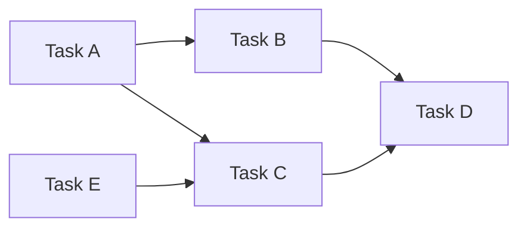
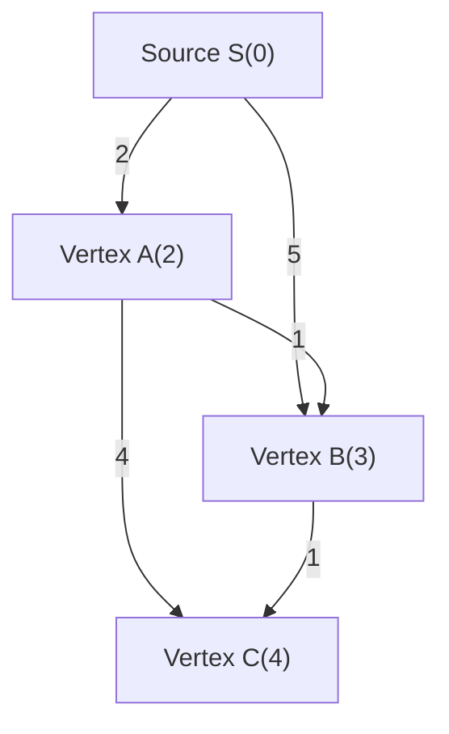
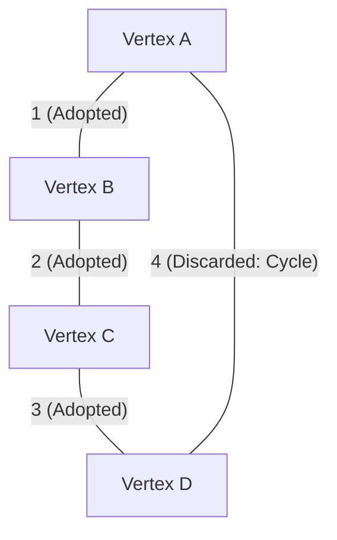
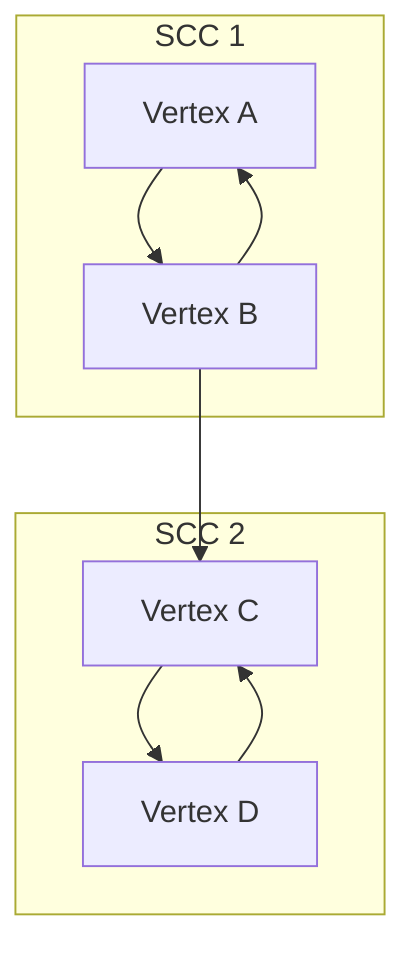

In competitive programming, graph theory and its algorithms are some of the most important themes that cannot be avoided. Many of the problems presented in contests like AtCoder, Codeforces, and TopCoder have a graph structure behind them. They serve as a powerful weapon for abstracting and solving real-world problems, such as finding the shortest path in a road network, minimizing communication costs in a network, and resolving task dependencies.

In this article, we will completely cover the major graph algorithms that frequently appear in competitive programming (Topological Sort, Dijkstra's Algorithm, Bellman-Ford Algorithm, Floyd-Warshall Algorithm, Kruskal's Algorithm, Prim's Algorithm, and Strongly Connected Component Decomposition), including their theoretical backgrounds, computational complexity evaluations using mathematical formulas, and highly optimized implementation examples in modern C++ (C++17/20). Delivered in a massive volume of about 10,000 characters, this is truly a "complete guide".

---

## 1. Basics and Constraints of Graph Algorithms

Before learning the algorithms, it is important to grasp the general constraints and computational complexity guidelines for graph problems in competitive programming. A graph is represented by the number of vertices $V$ (Vertices) and the number of edges $E$ (Edges).

*   $O(V + E)$ : The computational complexity required for problems with a number of vertices $V, E \le 10^5 \sim 10^6$. Depth-First Search (DFS) and Breadth-First Search (BFS) fall into this category.
*   $O((V + E) \log V)$ : Frequently appears in problems with $V, E \le 10^5 \sim 2 \cdot 10^5$. This is the computational complexity when using a priority queue in Dijkstra's algorithm or Prim's algorithm.
*   $O(V^2)$ : Allowed for dense graphs ($E \approx V^2$) where $V \le 2000 \sim 3000$.
*   $O(V^3)$ : Problems where $V \le 400 \sim 500$. The Floyd-Warshall algorithm is a typical example.

In competitive programming, it is common to use an **Adjacency List** to represent a graph. Since an adjacency matrix consumes $O(V^2)$ memory, it will hit the Memory Limit Exceeded error in problems with a large number of vertices.

---

## 2. Graph Traversal and Ordering

### Topological Sort

Topological sort is an algorithm that arranges the vertices of a Directed Acyclic Graph (DAG) in a line such that all directed edges point from earlier vertices to later vertices. It is used when resolving task dependencies (e.g., Task B cannot start until Task A is finished) and for determining the calculation order of Dynamic Programming (DP) on a DAG.

The computational complexity is $O(V + E)$. There are two types of implementations: Kahn's algorithm (BFS-based using in-degrees) and DFS-based using post-order traversal. Here, we introduce Kahn's algorithm, which can easily find the lexicographically smallest topological sort.



#### C++ Implementation Example (Kahn's Algorithm)

```cpp
#include <iostream>
#include <vector>
#include <queue>

using namespace std;

// Function to perform topological sort
// Returns an empty array if a cycle exists
vector<int> topological_sort(int V, const vector<vector<int>>& graph) {
    vector<int> in_degree(V, 0);
    // Calculate in-degrees
    for (int u = 0; u < V; ++u) {
        for (int v : graph[u]) {
            in_degree[v]++;
        }
    }

    // Add vertices with in-degree 0 to the queue (use priority_queue<int, vector<int>, greater<int>> for lexicographically smallest)
    queue<int> q;
    for (int i = 0; i < V; ++i) {
        if (in_degree[i] == 0) {
            q.push(i);
        }
    }

    vector<int> res;
    while (!q.empty()) {
        int u = q.front();
        q.pop();
        res.push_back(u);

        // Decrease the in-degree of adjacent vertices
        for (int v : graph[u]) {
            in_degree[v]--;
            if (in_degree[v] == 0) {
                q.push(v);
            }
        }
    }

    // Check if the graph contains a cycle
    if (res.size() != V) {
        return {}; // Cycle exists
    }
    return res;
}
```

---

## 3. Single Source Shortest Path (SSSP)

This is the problem of finding the shortest paths from a given source vertex to all other vertices. The applicable algorithms differ depending on whether the edge weights are non-negative or if negative weights exist.

### Dijkstra's Algorithm

Dijkstra's algorithm is a fast shortest path algorithm that can be applied when **all edge weights are non-negative**. It is based on a greedy approach: "finalize the vertex with the shortest currently known distance, and update (relax) the distances to its adjacent vertices from that vertex."

#### Mathematical Formula for Relaxation
Let the source be $s$, the shortest distance to vertex $u$ be $d[u]$, and the weight of edge $(u, v)$ be $w(u, v)$.
The update equation is as follows:
$$ d[v] = \min(d[v], d[u] + w(u, v)) $$

By using a priority queue (`std::priority_queue`), the unfinalized vertex with the minimum distance can be extracted in $O(\log V)$, making the overall time complexity $O((V + E) \log V)$. The space complexity is $O(V + E)$.


As shown in the figure above, the cost to go directly from S to B is 5, but going via A allows reaching it with a cost of 3. Dijkstra's algorithm performs optimizations in this way.

#### C++ Implementation Example

```cpp
#include <iostream>
#include <vector>
#include <queue>

using namespace std;

const long long INF = 1e18; // A sufficiently large value

struct Edge {
    int to;
    long long weight;
};

// Dijkstra's algorithm
// Returns an array of shortest distances from the source s to each vertex
vector<long long> dijkstra(int V, const vector<vector<Edge>>& graph, int s) {
    vector<long long> dist(V, INF);
    dist[s] = 0;
    
    // Priority queue to manage {distance, vertex} (in ascending order of distance)
    using P = pair<long long, int>;
    priority_queue<P, vector<P>, greater<P>> pq;
    pq.push({0, s});
    
    while (!pq.empty()) {
        auto [d, u] = pq.top();
        pq.pop();
        
        // Skip if a shorter path has already been found (discard outdated information)
        if (dist[u] < d) continue;
        
        // Relaxation process
        for (const auto& edge : graph[u]) {
            int v = edge.to;
            long long cost = edge.weight;
            if (dist[v] > dist[u] + cost) {
                dist[v] = dist[u] + cost;
                pq.push({dist[v], v});
            }
        }
    }
    return dist;
}
```
The statement `if (dist[u] < d) continue;` is very important. In Dijkstra's algorithm, the same vertex might be pushed to the queue multiple times, but this check prunes unnecessary explorations.

### Bellman-Ford Algorithm

When edge weights include negative values, Dijkstra's algorithm cannot deduce the correct answer. This is where the Bellman-Ford algorithm comes into play. By repeating the relaxation process for all edges $V - 1$ times, it correctly calculates the shortest path even if there are negative weights.

If an update occurs even on the $V$-th iteration, it means a **Negative Cycle** exists. In competitive programming, problems asking to "detect a negative cycle" are frequent, and the Bellman-Ford algorithm is also excellent as a detection algorithm for this.

Note that the time complexity is $O(V \times E)$, which is slower than Dijkstra's algorithm, so it can only be applied under constraints of about $V \le 2000, E \le 5000$.

#### C++ Implementation Example

```cpp
#include <iostream>
#include <vector>

using namespace std;

const long long INF = 1e18;

struct Edge {
    int from;
    int to;
    long long weight;
};

// Bellman-Ford algorithm
// Returns: {array of shortest distances, whether a negative cycle exists}
pair<vector<long long>, bool> bellman_ford(int V, const vector<Edge>& edges, int s) {
    vector<long long> dist(V, INF);
    dist[s] = 0;
    bool negative_cycle = false;

    // Loop V times
    for (int i = 0; i < V; ++i) {
        bool updated = false;
        for (const auto& edge : edges) {
            if (dist[edge.from] != INF && dist[edge.to] > dist[edge.from] + edge.weight) {
                dist[edge.to] = dist[edge.from] + edge.weight;
                updated = true;
                // If an update occurs on the V-th time, a negative cycle exists
                if (i == V - 1) {
                    negative_cycle = true;
                }
            }
        }
        // Early termination if no updates occurred (optimization)
        if (!updated) break;
    }
    
    return {dist, negative_cycle};
}
```

---

## 4. All-Pairs Shortest Path (APSP)

### Floyd-Warshall Algorithm

This is an algorithm to find the shortest distances between all pairs of vertices in a graph. It is based on Dynamic Programming (DP). It is attractive because the algorithm is very concise and extremely easy to implement.

The state transition equation is as follows. We adopt the shorter of the path going through vertex $k$ and the path not going through it.
$$ d[i][j] = \min(d[i][j], d[i][k] + d[k][j]) $$

Since it uses a triple loop, the time complexity is $O(V^3)$ and the space complexity is $O(V^2)$. If the number of vertices is around $V \le 400$, it will be in time for the execution time limit (usually 2 seconds).

#### C++ Implementation Example

```cpp
#include <iostream>
#include <vector>
#include <algorithm>

using namespace std;

const long long INF = 1e18;

// Floyd-Warshall algorithm
// In the initial state, dist[i][j] is the weight of the edge from i to j (INF if no edge, 0 if i==j)
void floyd_warshall(int V, vector<vector<long long>>& dist) {
    // Intermediate vertex k
    for (int k = 0; k < V; ++k) {
        // Source i
        for (int i = 0; i < V; ++i) {
            // Destination j
            for (int j = 0; j < V; ++j) {
                // Check for INF to prevent overflow
                if (dist[i][k] != INF && dist[k][j] != INF) {
                    dist[i][j] = min(dist[i][j], dist[i][k] + dist[k][j]);
                }
            }
        }
    }
}
```

The Floyd-Warshall algorithm can also detect negative cycles. After the loop ends, if there is even one vertex `i` where `dist[i][i] < 0`, the graph contains a negative cycle.

---

## 5. Minimum Spanning Tree (MST)

In a connected undirected graph, a tree that connects all vertices (a subgraph without cycles) and minimizes the total sum of edge weights is called a **Minimum Spanning Tree (MST)**. It is directly asked in scenarios like minimizing network construction costs.

### Kruskal's Algorithm

This is a greedy algorithm that sorts all edges in ascending order of their weights and successively adopts them, making sure not to form cycles. By using a **Union-Find (Disjoint Set)** data structure to check for cycles, it can be processed quickly.

The time complexity is $O(E \log E)$, as sorting the edges becomes the bottleneck. This is the most frequently used MST construction algorithm in competitive programming.



#### C++ Implementation Example

```cpp
#include <iostream>
#include <vector>
#include <algorithm>

using namespace std;

// Union-Find (Disjoint Set data structure)
struct UnionFind {
    vector<int> parent, rank, size;
    UnionFind(int n) : parent(n), rank(n, 0), size(n, 1) {
        for (int i = 0; i < n; i++) parent[i] = i;
    }
    int find(int x) {
        if (parent[x] == x) return x;
        // Path compression
        return parent[x] = find(parent[x]);
    }
    bool unite(int x, int y) {
        int root_x = find(x);
        int root_y = find(y);
        if (root_x == root_y) return false;
        
        // Merge by rank
        if (rank[root_x] < rank[root_y]) swap(root_x, root_y);
        parent[root_y] = root_x;
        if (rank[root_x] == rank[root_y]) rank[root_x]++;
        size[root_x] += size[root_y];
        return true;
    }
    bool same(int x, int y) { return find(x) == find(y); }
};

struct Edge {
    int u, v;
    long long weight;
    // Comparison function for sorting
    bool operator<(const Edge& other) const {
        return weight < other.weight;
    }
};

// Kruskal's algorithm
long long kruskal(int V, vector<Edge>& edges) {
    // Sort edges in ascending order of weight
    sort(edges.begin(), edges.end());
    
    UnionFind uf(V);
    long long mst_cost = 0;
    int edge_count = 0;
    
    for (const auto& edge : edges) {
        if (uf.unite(edge.u, edge.v)) {
            mst_cost += edge.weight;
            edge_count++;
            // Terminate when V-1 edges are selected (optimization)
            if (edge_count == V - 1) break;
        }
    }
    return mst_cost;
}
```

### Prim's Algorithm

It takes a very similar approach to Dijkstra's algorithm. Starting from one vertex, it successively selects the edge with the smallest weight among those directly connected to the already formed tree, growing the tree.

The computational complexity when using a priority queue is $O((V + E) \log V)$. For dense graphs (graphs with a large number of edges), an array-based implementation of Prim's algorithm in $O(V^2)$ can be faster than Kruskal's algorithm.

#### C++ Implementation Example

```cpp
#include <iostream>
#include <vector>
#include <queue>

using namespace std;

struct Edge {
    int to;
    long long weight;
};

// Prim's algorithm
long long prim(int V, const vector<vector<Edge>>& graph) {
    vector<bool> used(V, false);
    // {weight, vertex}
    using P = pair<long long, int>;
    priority_queue<P, vector<P>, greater<P>> pq;
    
    long long mst_cost = 0;
    // Set vertex 0 as the source
    pq.push({0, 0});
    
    while (!pq.empty()) {
        auto [cost, u] = pq.top();
        pq.pop();
        
        if (used[u]) continue;
        used[u] = true;
        mst_cost += cost;
        
        for (const auto& edge : graph[u]) {
            if (!used[edge.to]) {
                pq.push({edge.weight, edge.to});
            }
        }
    }
    return mst_cost;
}
```

---

## 6. Advanced: Strongly Connected Components (SCC)

In a directed graph, a set of vertices that can mutually reach each other is called a Strongly Connected Component (SCC). If any directed graph is grouped by its strongly connected components, the entire graph will always become a DAG (Directed Acyclic Graph). This is called **Strongly Connected Component Decomposition**. It is a very important preprocessing step to simplify graph structures and make problems easier to solve.

In competitive programming, it is heavily used in scenarios like solving 2-SAT problems or reducing a graph with cycles into a DAG to perform DP.

### Kosaraju's Algorithm

Kosaraju's algorithm is an elegant and efficient method that can construct an SCC with just two passes of DFS (Depth-First Search). The computational complexity operates in linear time, $O(V + E)$.

Algorithm steps:
1. Perform DFS on the original graph and record the vertices in an array in post-order.
2. Create a **reversed graph** where the directions of all edges are inverted.
3. Perform DFS on the unvisited vertices in the reversed graph, proceeding in the **reverse order** of the array recorded in step 1 (from the latest post-order to the earliest). The set of vertices reachable in a single DFS pass forms one SCC.



#### C++ Implementation Example

```cpp
#include <iostream>
#include <vector>
#include <algorithm>

using namespace std;

struct SCC {
    int V;
    vector<vector<int>> graph, rev_graph;
    vector<int> order, comp;
    vector<bool> used;

    SCC(int n) : V(n), graph(n), rev_graph(n), comp(n, -1), used(n, false) {}

    void add_edge(int from, int to) {
        graph[from].push_back(to);
        rev_graph[to].push_back(from);
    }

    // First DFS (recording post-order)
    void dfs1(int u) {
        used[u] = true;
        for (int v : graph[u]) {
            if (!used[v]) dfs1(v);
        }
        order.push_back(u);
    }

    // Second DFS (traversing the reversed graph)
    void dfs2(int u, int id) {
        used[u] = true;
        comp[u] = id;
        for (int v : rev_graph[u]) {
            if (!used[v]) dfs2(v, id);
        }
    }

    // SCC construction process. Returns the number of SCC groups
    int build() {
        // First DFS
        for (int i = 0; i < V; ++i) {
            if (!used[i]) dfs1(i);
        }

        fill(used.begin(), used.end(), false);
        int group_id = 0;

        // Second DFS (in reverse order of `order`)
        for (int i = V - 1; i >= 0; --i) {
            int u = order[i];
            if (!used[u]) {
                dfs2(u, group_id++);
            }
        }
        return group_id;
    }
};
```

The `comp` array stores the ID of the SCC each vertex belongs to. This ID actually has the very convenient property of being assigned in topological sort order. In other words, by looking at the values of `comp`, you can immediately understand the dependencies after reducing the graph to a DAG.

---

## 7. Conclusion and Study Advice

In this article, we comprehensively reviewed the graph algorithms that frequently appear in competitive programming.
The key to improving in graph problems is **"implementing them repeatedly until they become muscle memory"** and **"training yourself to think about what kind of graph a problem can be reduced to (what are the vertices, and what are the edges)."**

1. First, make sure you can quickly write DFS / BFS without making mistakes.
2. Next, be able to write Dijkstra's algorithm and Kruskal's algorithm from memory (essential for AtCoder Brown to Green tiers).
3. Finally, expand your repertoire with Bellman-Ford, Floyd-Warshall, Topological Sort, SCC, etc. (these become powerful weapons in AtCoder Cyan to Blue tiers).

We highly recommend modularizing them as code snippets (saving them in a snippet tool or your own GitHub repository) so that you can call them without hesitation during a real contest.

Graph algorithms in competitive programming are a field where you can most feel the beauty and power of algorithms. Please try copying the code in this article by hand and tackling past problems on online judges!
