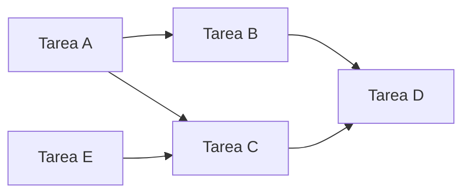
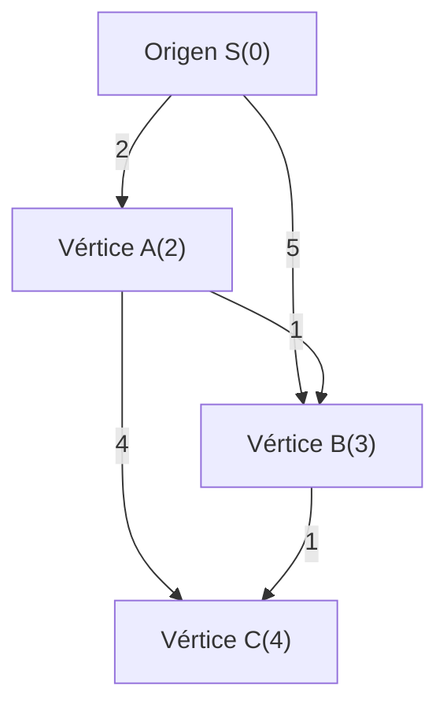
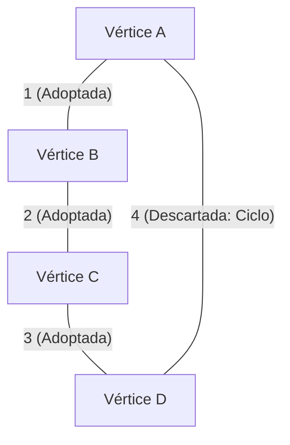
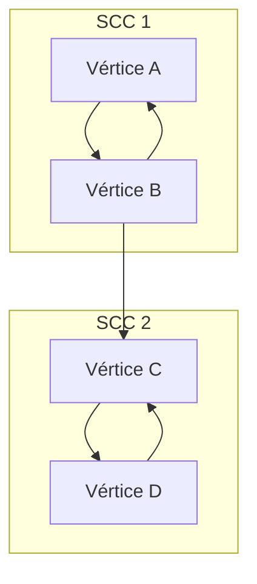

En la programación competitiva, la teoría de grafos y sus algoritmos son uno de los temas más importantes que no se pueden evitar. Muchos de los problemas que aparecen en concursos como AtCoder, Codeforces y TopCoder tienen una estructura de grafo subyacente. Se convierten en una poderosa arma para abstraer y resolver problemas del mundo real, como el camino más corto en una red de carreteras, la minimización del costo de comunicación en una red y la resolución de dependencias de tareas.

En este artículo, cubriremos por completo los principales algoritmos de grafos que aparecen con frecuencia en la programación competitiva (ordenamiento topológico, algoritmo de Dijkstra, algoritmo de Bellman-Ford, algoritmo de Floyd-Warshall, algoritmo de Kruskal, algoritmo de Prim, descomposición en componentes fuertemente conexas), incluyendo su base teórica, evaluación de la complejidad computacional usando fórmulas matemáticas, y ejemplos de implementación altamente optimizados en C++ moderno (C++17/20). ¡Es una verdadera guía de "conquista total" entregada en un gran volumen de aproximadamente 10,000 caracteres!

---

## 1. Fundamentos y restricciones de los algoritmos de grafos

Antes de aprender los algoritmos, es importante comprender las restricciones generales y los estándares de complejidad computacional de los problemas de grafos en la programación competitiva. Un grafo se representa por el número de vértices $V$ (Vertices) y el número de aristas $E$ (Edges).

*   $O(V + E)$ : Es la complejidad computacional requerida para problemas con un número de vértices $V, E \le 10^5 \sim 10^6$. La búsqueda en profundidad (DFS) y la búsqueda en anchura (BFS) entran en esta categoría.
*   $O((V + E) \log V)$ : Frecuente en problemas con $V, E \le 10^5 \sim 2 \cdot 10^5$. Es la complejidad computacional cuando se usa una cola de prioridad en algoritmos como Dijkstra o Prim.
*   $O(V^2)$ : Permitido en grafos densos ($E \approx V^2$) con $V \le 2000 \sim 3000$.
*   $O(V^3)$ : Problemas con $V \le 400 \sim 500$. El algoritmo de Floyd-Warshall es representativo.

En la programación competitiva, es común usar **listas de adyacencia (Adjacency List)** para representar grafos. Dado que una matriz de adyacencia consume memoria $O(V^2)$, causaría un error de límite de memoria (Memory Limit Exceeded) en problemas con un gran número de vértices.

---

## 2. Búsqueda y ordenamiento de grafos

### Ordenamiento topológico (Topological Sort)

El ordenamiento topológico es un algoritmo que organiza los vértices de un grafo dirigido acíclico (DAG: Directed Acyclic Graph) en una línea de manera que todas las aristas dirigidas vayan de los vértices anteriores a los posteriores. Se utiliza para resolver dependencias de tareas (por ejemplo, la tarea B no puede comenzar hasta que termine la tarea A) o para determinar el orden de cálculo en la programación dinámica (DP) sobre un DAG.

La complejidad computacional es $O(V + E)$. Existen dos tipos de implementación: el algoritmo de Kahn (basado en BFS usando los grados de entrada) y el basado en DFS usando el tiempo de finalización. Aquí presentaremos el algoritmo de Kahn, que también permite encontrar fácilmente el ordenamiento topológico mínimo lexicográficamente.



#### Ejemplo de implementación en C++ (Algoritmo de Kahn)

```cpp
#include <iostream>
#include <vector>
#include <queue>

using namespace std;

// Función para realizar el ordenamiento topológico
// Si existe un ciclo, devuelve un arreglo vacío
vector<int> topological_sort(int V, const vector<vector<int>>& graph) {
    vector<int> in_degree(V, 0);
    // Calcular los grados de entrada
    for (int u = 0; u < V; ++u) {
        for (int v : graph[u]) {
            in_degree[v]++;
        }
    }

    // Agregar vértices con grado de entrada 0 a la cola (si se desea el menor lexicográficamente, usar priority_queue<int, vector<int>, greater<int>>)
    queue<int> q;
    for (int i = 0; i < V; ++i) {
        if (in_degree[i] == 0) {
            q.push(i);
        }
    }

    vector<int> res;
    while (!q.empty()) {
        int u = q.front();
        q.pop();
        res.push_back(u);

        // Disminuir el grado de entrada de los vértices adyacentes
        for (int v : graph[u]) {
            in_degree[v]--;
            if (in_degree[v] == 0) {
                q.push(v);
            }
        }
    }

    // Comprobar si el grafo contiene un ciclo
    if (res.size() != V) {
        return {}; // Ciclo detectado
    }
    return res;
}
```

---

## 3. Problema del camino más corto desde un solo origen (SSSP: Single Source Shortest Path)

Es el problema de encontrar los caminos más cortos desde un vértice de origen a todos los demás vértices. El algoritmo aplicable varía dependiendo de si los pesos de las aristas son no negativos o si existen pesos negativos.

### Algoritmo de Dijkstra (Dijkstra's Algorithm)

El algoritmo de Dijkstra es un algoritmo rápido de camino más corto que se puede aplicar cuando **todos los pesos de las aristas son no negativos**. Se basa en un enfoque codicioso (greedy): "fijar el vértice con la distancia más corta conocida actualmente, y actualizar la distancia a sus vértices adyacentes (relajación)".

#### Fórmula de relajación (Relaxation)
Sea $s$ el vértice de origen, $d[u]$ la distancia más corta al vértice $u$, y $w(u, v)$ el peso de la arista $(u, v)$.
La fórmula de actualización es la siguiente:
$$ d[v] = \min(d[v], d[u] + w(u, v)) $$

Usando una cola de prioridad (`std::priority_queue`), el vértice no fijado con la distancia mínima se puede extraer en $O(\log V)$, y la complejidad temporal total es $O((V + E) \log V)$. La complejidad espacial es $O(V + E)$.


Como se muestra en la figura anterior, el costo de ir directamente de S a B es 5, pero pasando por A, se puede llegar con un costo de 3. El algoritmo de Dijkstra realiza optimizaciones de esta manera.

#### Ejemplo de implementación en C++

```cpp
#include <iostream>
#include <vector>
#include <queue>

using namespace std;

const long long INF = 1e18; // Un valor lo suficientemente grande

struct Edge {
    int to;
    long long weight;
};

// Algoritmo de Dijkstra
// Devuelve el arreglo de distancias más cortas desde el origen s a cada vértice
vector<long long> dijkstra(int V, const vector<vector<Edge>>& graph, int s) {
    vector<long long> dist(V, INF);
    dist[s] = 0;
    
    // Cola de prioridad que gestiona {distancia, vértice} (en orden ascendente de distancia)
    using P = pair<long long, int>;
    priority_queue<P, vector<P>, greater<P>> pq;
    pq.push({0, s});
    
    while (!pq.empty()) {
        auto [d, u] = pq.top();
        pq.pop();
        
        // Si ya se ha encontrado un camino más corto, omitir (descartar información obsoleta)
        if (dist[u] < d) continue;
        
        // Proceso de relajación
        for (const auto& edge : graph[u]) {
            int v = edge.to;
            long long cost = edge.weight;
            if (dist[v] > dist[u] + cost) {
                dist[v] = dist[u] + cost;
                pq.push({dist[v], v});
            }
        }
    }
    return dist;
}
```
La línea `if (dist[u] < d) continue;` es muy importante. En el algoritmo de Dijkstra, el mismo vértice puede ser empujado a la cola varias veces, pero esta verificación poda la búsqueda innecesaria.

### Algoritmo de Bellman-Ford (Bellman-Ford Algorithm)

Cuando los pesos de las aristas incluyen valores negativos, el algoritmo de Dijkstra no puede encontrar la respuesta correcta. En este caso, el algoritmo de Bellman-Ford es muy útil. Repitiendo el proceso de relajación para todas las aristas $V - 1$ veces, calcula correctamente los caminos más cortos incluso si hay pesos negativos.

Si ocurre una actualización en la iteración $V$-ésima, significa que existe un **ciclo negativo (Negative Cycle)**. En programación competitiva, el problema de "detectar ciclos negativos" es frecuente, y el algoritmo de Bellman-Ford también es excelente como algoritmo de detección.

La complejidad temporal es $O(V \times E)$, por lo que es más lento que el algoritmo de Dijkstra, ten en cuenta que solo se puede aplicar a restricciones de alrededor de $V \le 2000, E \le 5000$.

#### Ejemplo de implementación en C++

```cpp
#include <iostream>
#include <vector>

using namespace std;

const long long INF = 1e18;

struct Edge {
    int from;
    int to;
    long long weight;
};

// Algoritmo de Bellman-Ford
// Valor de retorno: {arreglo de distancias más cortas, si existe o no un ciclo negativo}
pair<vector<long long>, bool> bellman_ford(int V, const vector<Edge>& edges, int s) {
    vector<long long> dist(V, INF);
    dist[s] = 0;
    bool negative_cycle = false;

    // Repetir el bucle V veces
    for (int i = 0; i < V; ++i) {
        bool updated = false;
        for (const auto& edge : edges) {
            if (dist[edge.from] != INF && dist[edge.to] > dist[edge.from] + edge.weight) {
                dist[edge.to] = dist[edge.from] + edge.weight;
                updated = true;
                // Si ocurre una actualización en la iteración V, existe un ciclo negativo
                if (i == V - 1) {
                    negative_cycle = true;
                }
            }
        }
        // Si no hay actualizaciones, terminar anticipadamente (optimización)
        if (!updated) break;
    }
    
    return {dist, negative_cycle};
}
```

---

## 4. Problema de caminos más cortos entre todos los pares (APSP: All-Pairs Shortest Path)

### Algoritmo de Floyd-Warshall (Floyd-Warshall Algorithm)

Es un algoritmo para encontrar la distancia más corta entre todos los pares de vértices de un grafo. Se basa en la programación dinámica (DP). Su gran atractivo es que el algoritmo es muy conciso y la implementación es extremadamente sencilla.

La ecuación de transición de estado es la siguiente. Toma el más corto entre el camino que pasa por el vértice $k$ y el camino que no lo hace:
$$ d[i][j] = \min(d[i][j], d[i][k] + d[k][j]) $$

Debido a que utiliza tres bucles anidados, la complejidad temporal es $O(V^3)$ y la complejidad espacial es $O(V^2)$. Si el número de vértices es alrededor de $V \le 400$, estará dentro del límite de tiempo de ejecución (generalmente 2 segundos).

#### Ejemplo de implementación en C++

```cpp
#include <iostream>
#include <vector>
#include <algorithm>

using namespace std;

const long long INF = 1e18;

// Algoritmo de Floyd-Warshall
// dist[i][j] es inicialmente el peso de la arista de i a j (si no hay arista es INF, si i==j es 0)
void floyd_warshall(int V, vector<vector<long long>>& dist) {
    // Vértice intermedio k
    for (int k = 0; k < V; ++k) {
        // Vértice de origen i
        for (int i = 0; i < V; ++i) {
            // Vértice de destino j
            for (int j = 0; j < V; ++j) {
                // Comprobar si es INF para evitar desbordamiento (overflow)
                if (dist[i][k] != INF && dist[k][j] != INF) {
                    dist[i][j] = min(dist[i][j], dist[i][k] + dist[k][j]);
                }
            }
        }
    }
}
```

El algoritmo de Floyd-Warshall también puede detectar ciclos negativos. Después de que finalice el bucle, si existe al menos un vértice `i` donde `dist[i][i] < 0`, entonces el grafo contiene un ciclo negativo.

---

## 5. Árbol de expansión mínima (MST: Minimum Spanning Tree)

En un grafo no dirigido conexo, un árbol (subgrafo sin ciclos) que conecta todos los vértices y cuya suma de los pesos de las aristas es la mínima, se llama **árbol de expansión mínima (MST)**. A menudo se pregunta directamente en problemas como minimizar el costo de instalación de una red.

### Algoritmo de Kruskal (Kruskal's Algorithm)

Es un método codicioso que ordena todas las aristas en orden ascendente de su peso y las selecciona una por una asegurándose de que no formen ciclos. La detección de ciclos se puede realizar rápidamente utilizando una **estructura de datos de conjuntos disjuntos (Union-Find, Disjoint Set)**.

La complejidad temporal está dominada por el ordenamiento de las aristas y es $O(E \log E)$. Es el algoritmo de construcción de MST que se utiliza con más frecuencia en la programación competitiva.



#### Ejemplo de implementación en C++

```cpp
#include <iostream>
#include <vector>
#include <algorithm>

using namespace std;

// Union-Find (Estructura de datos de conjuntos disjuntos)
struct UnionFind {
    vector<int> parent, rank, size;
    UnionFind(int n) : parent(n), rank(n, 0), size(n, 1) {
        for (int i = 0; i < n; i++) parent[i] = i;
    }
    int find(int x) {
        if (parent[x] == x) return x;
        // Compresión de caminos
        return parent[x] = find(parent[x]);
    }
    bool unite(int x, int y) {
        int root_x = find(x);
        int root_y = find(y);
        if (root_x == root_y) return false;
        
        // Unión por rango
        if (rank[root_x] < rank[root_y]) swap(root_x, root_y);
        parent[root_y] = root_x;
        if (rank[root_x] == rank[root_y]) rank[root_x]++;
        size[root_x] += size[root_y];
        return true;
    }
    bool same(int x, int y) { return find(x) == find(y); }
};

struct Edge {
    int u, v;
    long long weight;
    // Función de comparación para ordenar
    bool operator<(const Edge& other) const {
        return weight < other.weight;
    }
};

// Algoritmo de Kruskal
long long kruskal(int V, vector<Edge>& edges) {
    // Ordenar aristas por peso de forma ascendente
    sort(edges.begin(), edges.end());
    
    UnionFind uf(V);
    long long mst_cost = 0;
    int edge_count = 0;
    
    for (const auto& edge : edges) {
        if (uf.unite(edge.u, edge.v)) {
            mst_cost += edge.weight;
            edge_count++;
            // Finaliza cuando se han seleccionado V-1 aristas (optimización)
            if (edge_count == V - 1) break;
        }
    }
    return mst_cost;
}
```

### Algoritmo de Prim (Prim's Algorithm)

Toma un enfoque muy similar al algoritmo de Dijkstra. Comenzando desde un vértice, hace crecer el árbol secuencialmente eligiendo la arista de menor peso que conecta directamente el árbol ya construido con los vértices restantes.

Cuando se utiliza una cola de prioridad, la complejidad computacional es $O((V + E) \log V)$. En el caso de grafos densos (grafos con muchas aristas), la implementación basada en arreglos del algoritmo de Prim, que es $O(V^2)$, puede ser más rápida que el algoritmo de Kruskal.

#### Ejemplo de implementación en C++

```cpp
#include <iostream>
#include <vector>
#include <queue>

using namespace std;

struct Edge {
    int to;
    long long weight;
};

// Algoritmo de Prim
long long prim(int V, const vector<vector<Edge>>& graph) {
    vector<bool> used(V, false);
    // {peso, vértice}
    using P = pair<long long, int>;
    priority_queue<P, vector<P>, greater<P>> pq;
    
    long long mst_cost = 0;
    // Comenzar desde el vértice 0
    pq.push({0, 0});
    
    while (!pq.empty()) {
        auto [cost, u] = pq.top();
        pq.pop();
        
        if (used[u]) continue;
        used[u] = true;
        mst_cost += cost;
        
        for (const auto& edge : graph[u]) {
            if (!used[edge.to]) {
                pq.push({edge.weight, edge.to});
            }
        }
    }
    return mst_cost;
}
```

---

## 6. Avanzado: Descomposición en componentes fuertemente conexas (SCC: Strongly Connected Components)

En un grafo dirigido, un "conjunto de vértices que pueden alcanzarse entre sí" se llama componente fuertemente conexa (SCC). Al agrupar un grafo dirigido arbitrario por sus SCC, el grafo general siempre se convierte en un DAG (grafo dirigido acíclico). A esto se le llama **descomposición en componentes fuertemente conexas**. Es un preprocesamiento muy importante para simplificar la estructura del grafo y facilitar la resolución del problema.

En la programación competitiva, se utiliza ampliamente para resolver problemas 2-SAT y para realizar DP al reducir grafos con ciclos a DAGs.

### Algoritmo de Kosaraju (Kosaraju's Algorithm)

El algoritmo de Kosaraju es un método elegante y eficiente para construir SCC utilizando solo dos búsquedas en profundidad (DFS). Funciona en tiempo lineal con una complejidad de $O(V + E)$.

Pasos del algoritmo:
1. Realizar un DFS en el grafo original y registrar los vértices en un arreglo en orden posterior (post-order).
2. Crear un **grafo transpuesto (inverso)** invirtiendo la dirección de todas las aristas.
3. Desde el **final del arreglo** registrado en el paso 1 (es decir, los de último tiempo de finalización), realizar DFS desde los vértices no visitados en el grafo inverso. El conjunto de vértices alcanzados en cada DFS forma una SCC.



#### Ejemplo de implementación en C++

```cpp
#include <iostream>
#include <vector>
#include <algorithm>

using namespace std;

struct SCC {
    int V;
    vector<vector<int>> graph, rev_graph;
    vector<int> order, comp;
    vector<bool> used;

    SCC(int n) : V(n), graph(n), rev_graph(n), comp(n, -1), used(n, false) {}

    void add_edge(int from, int to) {
        graph[from].push_back(to);
        rev_graph[to].push_back(from);
    }

    // Primer DFS (registro en post-order)
    void dfs1(int u) {
        used[u] = true;
        for (int v : graph[u]) {
            if (!used[v]) dfs1(v);
        }
        order.push_back(u);
    }

    // Segundo DFS (búsqueda en el grafo inverso)
    void dfs2(int u, int id) {
        used[u] = true;
        comp[u] = id;
        for (int v : rev_graph[u]) {
            if (!used[v]) dfs2(v, id);
        }
    }

    // Proceso de construcción de SCC. Devuelve el número de grupos de SCC
    int build() {
        // Primer DFS
        for (int i = 0; i < V; ++i) {
            if (!used[i]) dfs1(i);
        }

        fill(used.begin(), used.end(), false);
        int group_id = 0;

        // Segundo DFS (en orden inverso de order)
        for (int i = V - 1; i >= 0; --i) {
            int u = order[i];
            if (!used[u]) {
                dfs2(u, group_id++);
            }
        }
        return group_id;
    }
};
```

El arreglo `comp` almacenará el ID de la SCC a la que pertenece cada vértice. De hecho, este ID tiene la característica muy útil de estar asignado en orden topológico. En otras palabras, al observar los valores de `comp`, se pueden conocer inmediatamente las dependencias después de reducir a un DAG.

---

## 7. Resumen y consejos para el aprendizaje

En este artículo, hemos revisado los algoritmos de grafos que aparecen con frecuencia en la programación competitiva.
La clave para mejorar en los problemas de grafos es **"implementarlos una y otra vez hasta que se convierta en un hábito"** y **"entrenarse para pensar a qué modelo de grafo se puede reducir este problema (cuáles son los vértices y cuáles son las aristas)"**.

1. Primero, asegúrate de poder escribir DFS / BFS rápido y sin errores.
2. A continuación, asegúrate de poder escribir los algoritmos de Dijkstra y Kruskal de memoria (imprescindible en las categorías marrón a verde de AtCoder).
3. Por último, aumenta tus recursos aprendiendo algoritmos como Bellman-Ford, Floyd-Warshall, ordenamiento topológico y SCC (se convierten en un arma en las categorías celeste a azul de AtCoder).

Es altamente recomendable guardar tu código como una biblioteca de fragmentos (en una herramienta de fragmentos o en tu repositorio de GitHub) para poder utilizarlo sin dudar durante las competiciones.

Los algoritmos de grafos en la programación competitiva son el área donde más se puede experimentar la belleza y el poder de los algoritmos. ¡Te animamos a copiar el código de este artículo y a desafiar preguntas pasadas en jueces en línea!
