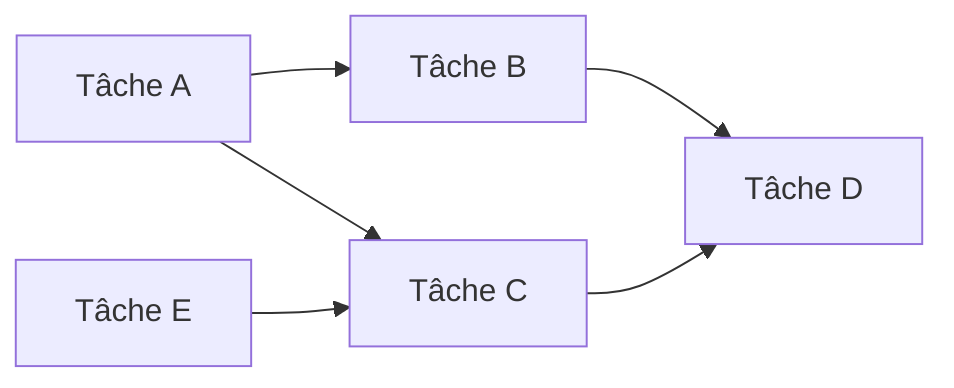
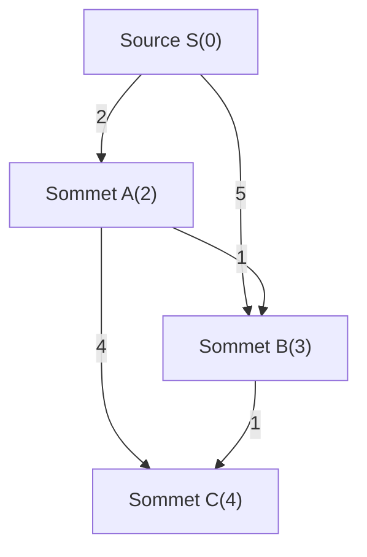
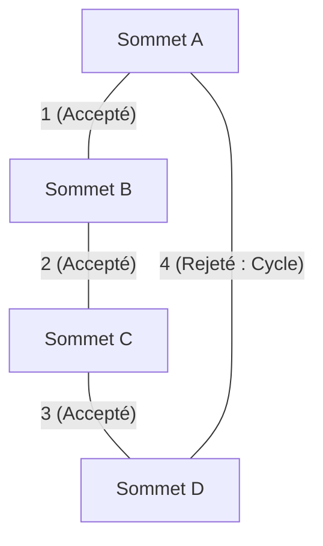
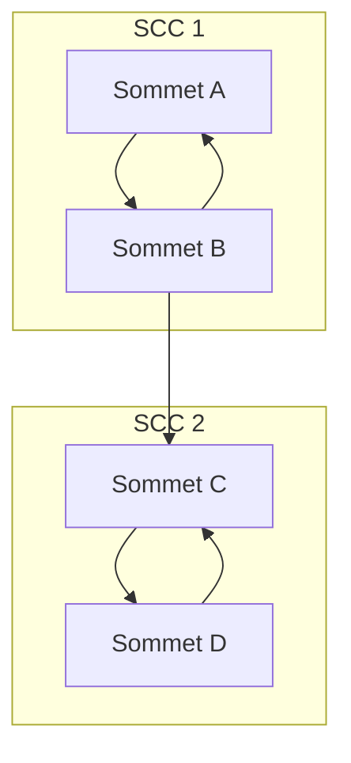

En programmation compétitive (CP), la théorie des graphes et ses algorithmes constituent l'un des thèmes les plus importants et incontournables. De nombreux problèmes posés lors de concours sur AtCoder, Codeforces ou TopCoder possèdent une structure de graphe en arrière-plan. Que ce soit pour trouver le chemin le plus court dans un réseau routier, minimiser les coûts de communication d'un réseau ou résoudre les dépendances entre tâches, ils constituent une arme puissante pour abstraire et résoudre des problèmes du monde réel.

Dans cet article, nous couvrirons de manière exhaustive les principaux algorithmes de graphes fréquemment rencontrés en programmation compétitive (tri topologique, algorithme de Dijkstra, algorithme de Bellman-Ford, algorithme de Floyd-Warshall, algorithme de Kruskal, algorithme de Prim et décomposition en composantes fortement connexes). Nous aborderons leur contexte théorique, l'évaluation de leur complexité à l'aide de formules mathématiques, ainsi que des exemples d'implémentation hautement optimisés en C++ moderne (C++17/20). Il s'agit d'un véritable guide "complet" que nous vous proposons.

---

## 1. Les bases et les contraintes des algorithmes de graphes

Avant d'étudier les algorithmes, il est important de comprendre les contraintes générales et les ordres de grandeur de la complexité temporelle pour les problèmes de graphes en programmation compétitive. Un graphe est représenté par son nombre de sommets $V$ (Vertices) et son nombre d'arêtes $E$ (Edges).

*   $O(V + E)$ : Complexité requise pour des problèmes où $V, E \le 10^5 \sim 10^6$. Cela correspond au parcours en profondeur (DFS) et au parcours en largeur (BFS).
*   $O((V + E) \log V)$ : Fréquent pour des problèmes où $V, E \le 10^5 \sim 2 \cdot 10^5$. C'est la complexité de l'algorithme de Dijkstra ou de Prim lorsqu'une file de priorité est utilisée.
*   $O(V^2)$ : Acceptable pour des graphes denses ($E \approx V^2$) où $V \le 2000 \sim 3000$.
*   $O(V^3)$ : Pour des problèmes où $V \le 400 \sim 500$. L'algorithme de Floyd-Warshall en est un exemple représentatif.

En programmation compétitive, il est courant d'utiliser une **liste d'adjacence (Adjacency List)** pour représenter un graphe. Comme la matrice d'adjacence consomme $O(V^2)$ en mémoire, elle entraînera un dépassement de la limite de mémoire (Memory Limit Exceeded) pour les problèmes comportant un grand nombre de sommets.

---

## 2. Exploration et ordonnancement des graphes

### Tri topologique (Topological Sort)

Le tri topologique est un algorithme qui aligne les sommets d'un graphe orienté acyclique (DAG : Directed Acyclic Graph) de sorte que chaque arête orientée aille d'un sommet précédent vers un sommet suivant. Il est utilisé pour résoudre les dépendances entre les tâches (par exemple : la tâche B ne peut commencer que lorsque la tâche A est terminée) ou pour déterminer l'ordre de calcul de la programmation dynamique (DP) sur un DAG.

La complexité est de $O(V + E)$. Il existe deux implémentations : l'algorithme de Kahn (basé sur le parcours en largeur BFS en utilisant les degrés entrants) et celui basé sur le parcours en profondeur DFS avec post-ordre. Nous présenterons ici l'algorithme de Kahn, qui permet également de trouver facilement l'ordre topologique lexicographique minimal.



#### Exemple d'implémentation en C++ (Algorithme de Kahn)

```cpp
#include <iostream>
#include <vector>
#include <queue>

using namespace std;

// Fonction pour effectuer le tri topologique
// Renvoie un tableau vide si un cycle existe
vector<int> topological_sort(int V, const vector<vector<int>>& graph) {
    vector<int> in_degree(V, 0);
    // Calcul des degrés entrants
    for (int u = 0; u < V; ++u) {
        for (int v : graph[u]) {
            in_degree[v]++;
        }
    }

    // Ajout des sommets de degré entrant 0 à la file (utiliser priority_queue<int, vector<int>, greater<int>> pour un ordre lexicographique minimal)
    queue<int> q;
    for (int i = 0; i < V; ++i) {
        if (in_degree[i] == 0) {
            q.push(i);
        }
    }

    vector<int> res;
    while (!q.empty()) {
        int u = q.front();
        q.pop();
        res.push_back(u);

        // Décrémenter le degré entrant des sommets adjacents
        for (int v : graph[u]) {
            in_degree[v]--;
            if (in_degree[v] == 0) {
                q.push(v);
            }
        }
    }

    // Vérifier si le graphe contient un cycle
    if (res.size() != V) {
        return {}; // Cycle présent
    }
    return res;
}
```

---

## 3. Problème du plus court chemin à source unique (SSSP : Single Source Shortest Path)

Il s'agit du problème consistant à trouver le chemin le plus court depuis un sommet source vers tous les autres sommets. L'algorithme applicable diffère selon que les poids des arêtes sont tous positifs ou s'il existe des poids négatifs.

### Algorithme de Dijkstra

L'algorithme de Dijkstra est un algorithme rapide de plus court chemin applicable lorsque **tous les poids des arêtes sont non négatifs**. Il est basé sur une approche gloutonne : « figer le sommet pour lequel la distance la plus courte est actuellement connue, et mettre à jour (relâcher) la distance vers les sommets adjacents à partir de ce sommet ».

#### Formule de relâchement (Relaxation)
Soit $s$ le sommet source, $d[u]$ la distance la plus courte jusqu'au sommet $u$, et $w(u, v)$ le poids de l'arête $(u, v)$.
La formule de mise à jour est la suivante :
$$ d[v] = \min(d[v], d[u] + w(u, v)) $$

En utilisant une file de priorité (`std::priority_queue`), le sommet non visité avec la distance minimale peut être extrait en $O(\log V)$, donnant une complexité temporelle globale de $O((V + E) \log V)$. La complexité spatiale est de $O(V + E)$.


Comme illustré ci-dessus, le coût pour aller directement de S à B est de 5, mais en passant par A, on peut l'atteindre avec un coût de 3. L'algorithme de Dijkstra effectue cette optimisation.

#### Exemple d'implémentation en C++

```cpp
#include <iostream>
#include <vector>
#include <queue>

using namespace std;

const long long INF = 1e18; // Valeur suffisamment grande

struct Edge {
    int to;
    long long weight;
};

// Algorithme de Dijkstra
// Renvoie un tableau des distances les plus courtes de la source s vers chaque sommet
vector<long long> dijkstra(int V, const vector<vector<Edge>>& graph, int s) {
    vector<long long> dist(V, INF);
    dist[s] = 0;
    
    // File de priorité pour gérer {distance, sommet} (dans l'ordre croissant des distances)
    using P = pair<long long, int>;
    priority_queue<P, vector<P>, greater<P>> pq;
    pq.push({0, s});
    
    while (!pq.empty()) {
        auto [d, u] = pq.top();
        pq.pop();
        
        // Ignorer si un chemin plus court a déjà été trouvé (suppression des informations obsolètes)
        if (dist[u] < d) continue;
        
        // Processus de relâchement
        for (const auto& edge : graph[u]) {
            int v = edge.to;
            long long cost = edge.weight;
            if (dist[v] > dist[u] + cost) {
                dist[v] = dist[u] + cost;
                pq.push({dist[v], v});
            }
        }
    }
    return dist;
}
```
L'instruction `if (dist[u] < d) continue;` est très importante. Dans l'algorithme de Dijkstra, le même sommet peut être inséré plusieurs fois dans la file, mais cette vérification permet d'élaguer les recherches inutiles.

### Algorithme de Bellman-Ford

Si les poids des arêtes incluent des valeurs négatives, l'algorithme de Dijkstra ne peut pas déduire la bonne réponse. C'est là qu'intervient l'algorithme de Bellman-Ford. En répétant le processus de relâchement pour toutes les arêtes $V - 1$ fois, il calcule correctement le chemin le plus court même s'il y a des poids négatifs.

Si une mise à jour se produit lors de la $V$-ème itération, cela signifie qu'il existe un **cycle négatif (Negative Cycle)**. En programmation compétitive, le problème "Détecter un cycle négatif" est très fréquent, et l'algorithme de Bellman-Ford est excellent pour cela.

La complexité temporelle est de $O(V \times E)$, ce qui est plus lent que l'algorithme de Dijkstra. Notez qu'il ne peut être appliqué que sous des contraintes telles que $V \le 2000, E \le 5000$.

#### Exemple d'implémentation en C++

```cpp
#include <iostream>
#include <vector>

using namespace std;

const long long INF = 1e18;

struct Edge {
    int from;
    int to;
    long long weight;
};

// Algorithme de Bellman-Ford
// Valeur de retour : {tableau des distances les plus courtes, booléen indiquant la présence d'un cycle négatif}
pair<vector<long long>, bool> bellman_ford(int V, const vector<Edge>& edges, int s) {
    vector<long long> dist(V, INF);
    dist[s] = 0;
    bool negative_cycle = false;

    // Boucle exécutée V fois
    for (int i = 0; i < V; ++i) {
        bool updated = false;
        for (const auto& edge : edges) {
            if (dist[edge.from] != INF && dist[edge.to] > dist[edge.from] + edge.weight) {
                dist[edge.to] = dist[edge.from] + edge.weight;
                updated = true;
                // Si une mise à jour survient à la V-ème itération, un cycle négatif existe
                if (i == V - 1) {
                    negative_cycle = true;
                }
            }
        }
        // Arrêt anticipé s'il n'y a pas eu de mise à jour (optimisation)
        if (!updated) break;
    }
    
    return {dist, negative_cycle};
}
```

---

## 4. Problème du plus court chemin entre toutes paires de sommets (APSP : All-Pairs Shortest Path)

### Algorithme de Floyd-Warshall

Il s'agit d'un algorithme permettant de trouver la plus courte distance entre toutes les paires de sommets d'un graphe. Il est basé sur la programmation dynamique (DP). Son attrait réside dans le fait qu'il est très concis et extrêmement facile à implémenter.

L'équation de transition d'état est la suivante. On choisit le plus court entre le chemin qui passe par le sommet $k$ et celui qui n'y passe pas :
$$ d[i][j] = \min(d[i][j], d[i][k] + d[k][j]) $$

Puisqu'il exécute une triple boucle, la complexité temporelle est de $O(V^3)$ et la complexité spatiale est de $O(V^2)$. Si le nombre de sommets est de $V \le 400$ environ, cela respectera la limite de temps d'exécution (généralement 2 secondes).

#### Exemple d'implémentation en C++

```cpp
#include <iostream>
#include <vector>
#include <algorithm>

using namespace std;

const long long INF = 1e18;

// Algorithme de Floyd-Warshall
// dist[i][j] est initialement le poids de l'arête de i vers j (INF s'il n'y a pas d'arête, 0 si i==j)
void floyd_warshall(int V, vector<vector<long long>>& dist) {
    // Sommet intermédiaire k
    for (int k = 0; k < V; ++k) {
        // Sommet de départ i
        for (int i = 0; i < V; ++i) {
            // Sommet d'arrivée j
            for (int j = 0; j < V; ++j) {
                // Vérifier la présence de INF pour éviter tout débordement
                if (dist[i][k] != INF && dist[k][j] != INF) {
                    dist[i][j] = min(dist[i][j], dist[i][k] + dist[k][j]);
                }
            }
        }
    }
}
```

L'algorithme de Floyd-Warshall peut également détecter les cycles négatifs. Après la boucle, s'il existe au moins un sommet `i` pour lequel `dist[i][i] < 0`, alors le graphe contient un cycle négatif.

---

## 5. Arbre couvrant de poids minimum (MST : Minimum Spanning Tree)

Dans un graphe non orienté connexe, on appelle **arbre couvrant de poids minimum (MST)** un arbre (sous-graphe sans cycle) reliant tous les sommets tel que la somme des poids de ses arêtes est minimale. Il est souvent demandé directement dans des problèmes de minimisation des coûts de construction de réseaux.

### Algorithme de Kruskal

Il s'agit d'une approche gloutonne où toutes les arêtes sont triées par ordre croissant de poids, puis sélectionnées une par une sans former de cycle. La détection de cycle peut être traitée rapidement à l'aide d'une **structure de données d'ensembles disjoints (Union-Find, Disjoint Set)**.

La complexité temporelle est dominée par le tri des arêtes, atteignant $O(E \log E)$. C'est l'algorithme de construction de MST le plus fréquemment utilisé en programmation compétitive.



#### Exemple d'implémentation en C++

```cpp
#include <iostream>
#include <vector>
#include <algorithm>

using namespace std;

// Union-Find (Structure de données d'ensembles disjoints)
struct UnionFind {
    vector<int> parent, rank, size;
    UnionFind(int n) : parent(n), rank(n, 0), size(n, 1) {
        for (int i = 0; i < n; i++) parent[i] = i;
    }
    int find(int x) {
        if (parent[x] == x) return x;
        // Compression de chemin
        return parent[x] = find(parent[x]);
    }
    bool unite(int x, int y) {
        int root_x = find(x);
        int root_y = find(y);
        if (root_x == root_y) return false;
        
        // Fusion par rang
        if (rank[root_x] < rank[root_y]) swap(root_x, root_y);
        parent[root_y] = root_x;
        if (rank[root_x] == rank[root_y]) rank[root_x]++;
        size[root_x] += size[root_y];
        return true;
    }
    bool same(int x, int y) { return find(x) == find(y); }
};

struct Edge {
    int u, v;
    long long weight;
    // Fonction de comparaison pour le tri
    bool operator<(const Edge& other) const {
        return weight < other.weight;
    }
};

// Algorithme de Kruskal
long long kruskal(int V, vector<Edge>& edges) {
    // Trier les arêtes par ordre croissant de poids
    sort(edges.begin(), edges.end());
    
    UnionFind uf(V);
    long long mst_cost = 0;
    int edge_count = 0;
    
    for (const auto& edge : edges) {
        if (uf.unite(edge.u, edge.v)) {
            mst_cost += edge.weight;
            edge_count++;
            // S'arrêter si V-1 arêtes ont été choisies (optimisation)
            if (edge_count == V - 1) break;
        }
    }
    return mst_cost;
}
```

### Algorithme de Prim

L'approche est très similaire à celle de l'algorithme de Dijkstra. En partant d'un sommet donné, on fait croître l'arbre en choisissant successivement l'arête de plus faible poids connectée directement à l'arbre déjà formé.

La complexité est de $O((V + E) \log V)$ lorsqu'une file de priorité est utilisée. Pour les graphes denses (avec beaucoup d'arêtes), l'implémentation de Prim basée sur des tableaux en $O(V^2)$ peut être plus rapide que l'algorithme de Kruskal.

#### Exemple d'implémentation en C++

```cpp
#include <iostream>
#include <vector>
#include <queue>

using namespace std;

struct Edge {
    int to;
    long long weight;
};

// Algorithme de Prim
long long prim(int V, const vector<vector<Edge>>& graph) {
    vector<bool> used(V, false);
    // {poids, sommet}
    using P = pair<long long, int>;
    priority_queue<P, vector<P>, greater<P>> pq;
    
    long long mst_cost = 0;
    // Prendre le sommet 0 comme origine
    pq.push({0, 0});
    
    while (!pq.empty()) {
        auto [cost, u] = pq.top();
        pq.pop();
        
        if (used[u]) continue;
        used[u] = true;
        mst_cost += cost;
        
        for (const auto& edge : graph[u]) {
            if (!used[edge.to]) {
                pq.push({edge.weight, edge.to});
            }
        }
    }
    return mst_cost;
}
```

---

## 6. Avancé : Décomposition en composantes fortement connexes (SCC : Strongly Connected Components)

Dans un graphe orienté, un ensemble de sommets qui peuvent s'atteindre mutuellement est appelé composante fortement connexe (SCC). Si l'on regroupe chaque composante fortement connexe d'un graphe orienté quelconque, l'ensemble devient toujours un DAG (graphe orienté acyclique). C'est ce qu'on appelle la **décomposition en composantes fortement connexes**. Il s'agit d'un prétraitement très important pour simplifier la structure du graphe et faciliter la résolution de problèmes.

En programmation compétitive, cette méthode est souvent utilisée pour résoudre le problème 2-SAT ou pour contracter des graphes contenant des cycles en DAG afin d'appliquer la programmation dynamique (DP).

### Algorithme de Kosaraju

L'algorithme de Kosaraju est une méthode élégante et efficace qui permet de construire des SCC en n'effectuant que deux parcours en profondeur (DFS). Il fonctionne en temps linéaire avec une complexité de $O(V + E)$.

Étapes de l'algorithme :
1. Effectuer un DFS sur le graphe d'origine et enregistrer les sommets dans un tableau dans l'ordre de post-visite (post-order).
2. Créer un **graphe inversé** en inversant la direction de toutes les arêtes.
3. En parcourant le tableau enregistré à l'étape 1 **de l'arrière vers l'avant** (ordre de post-visite décroissant), effectuer un DFS sur le graphe inversé depuis les sommets non visités. L'ensemble des sommets atteints lors de ce seul DFS forme une SCC.



#### Exemple d'implémentation en C++

```cpp
#include <iostream>
#include <vector>
#include <algorithm>

using namespace std;

struct SCC {
    int V;
    vector<vector<int>> graph, rev_graph;
    vector<int> order, comp;
    vector<bool> used;

    SCC(int n) : V(n), graph(n), rev_graph(n), comp(n, -1), used(n, false) {}

    void add_edge(int from, int to) {
        graph[from].push_back(to);
        rev_graph[to].push_back(from);
    }

    // 1er DFS (Enregistrement du post-ordre)
    void dfs1(int u) {
        used[u] = true;
        for (int v : graph[u]) {
            if (!used[v]) dfs1(v);
        }
        order.push_back(u);
    }

    // 2ème DFS (Exploration du graphe inversé)
    void dfs2(int u, int id) {
        used[u] = true;
        comp[u] = id;
        for (int v : rev_graph[u]) {
            if (!used[v]) dfs2(v, id);
        }
    }

    // Processus de construction des SCC. La valeur de retour est le nombre de groupes SCC
    int build() {
        // 1er DFS
        for (int i = 0; i < V; ++i) {
            if (!used[i]) dfs1(i);
        }

        fill(used.begin(), used.end(), false);
        int group_id = 0;

        // 2ème DFS (dans l'ordre inverse de "order")
        for (int i = V - 1; i >= 0; --i) {
            int u = order[i];
            if (!used[u]) {
                dfs2(u, group_id++);
            }
        }
        return group_id;
    }
};
```

Le tableau `comp` stocke l'ID de la SCC à laquelle appartient chaque sommet. Cet ID possède en réalité une propriété très pratique : il est attribué dans l'ordre du tri topologique. Ainsi, en regardant les valeurs de `comp`, on peut déterminer immédiatement les dépendances après contraction en DAG.

---

## 7. Conclusion et conseils d'apprentissage

Dans cet article, nous avons passé en revue les algorithmes de graphes fréquemment rencontrés en programmation compétitive.
Les clés pour s'améliorer sur les problèmes de graphes sont : **« implémenter l'algorithme à plusieurs reprises jusqu'à ce que cela devienne un réflexe »** et **« s'entraîner à réfléchir à quel type de graphe un problème peut être réduit (que représentent les sommets, que représentent les arêtes) »**.

1. Tout d'abord, soyez capable d'écrire rapidement et sans erreur les algorithmes DFS / BFS.
2. Ensuite, apprenez à coder de mémoire l'algorithme de Dijkstra et l'algorithme de Kruskal (indispensable pour les rangs marron-vert sur AtCoder).
3. Enfin, élargissez vos connaissances avec Bellman-Ford, Floyd-Warshall, le tri topologique et les SCC (ce qui constituera une arme pour les rangs cyan-bleu sur AtCoder).

Nous vous recommandons fortement de les ajouter sous forme de snippets dans votre propre bibliothèque (en utilisant des outils de snippets ou en les sauvegardant sur votre dépôt GitHub) afin d'être prêt à les utiliser sans hésitation lors des compétitions réelles.

Les algorithmes de graphes en programmation compétitive constituent le domaine où l'on ressent le plus la beauté et la puissance de l'algorithmique. N'hésitez pas à recopier le code de cet article et à vous mesurer à d'anciens problèmes sur les juges en ligne (Online Judges) !
