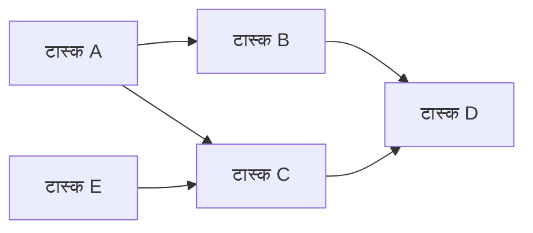
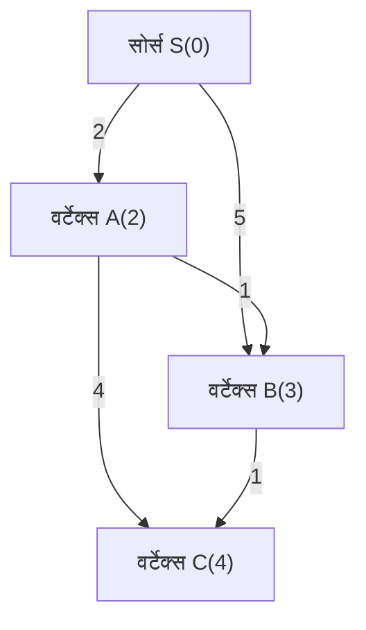
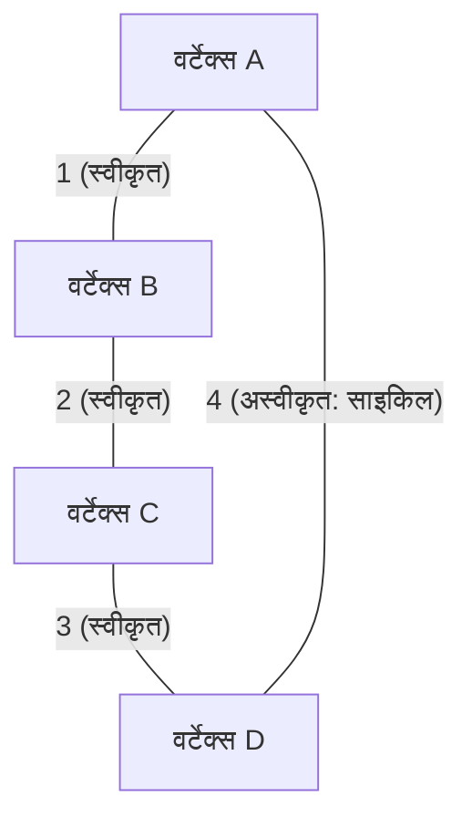
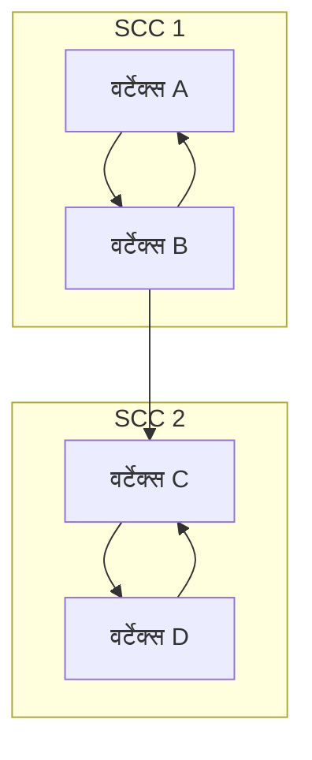

कॉम्पिटिटिव प्रोग्रामिंग (CP) में, ग्राफ़ थ्योरी और इसके एल्गोरिदम सबसे महत्वपूर्ण विषयों में से एक हैं जिन्हें टाला नहीं जा सकता। AtCoder, Codeforces और TopCoder जैसी प्रतियोगिताओं में पूछे जाने वाले कई सवालों के पीछे ग्राफ़ स्ट्रक्चर होता है। यह वास्तविक दुनिया की समस्याओं को हल करने के लिए एक शक्तिशाली हथियार है, जैसे कि सड़क नेटवर्क पर सबसे छोटा रास्ता खोजना, नेटवर्क कम्युनिकेशन कॉस्ट को कम करना, और टास्क डिपेंडेंसी को हल करना।

इस लेख में, हम कॉम्पिटिटिव प्रोग्रामिंग में अक्सर उपयोग किए जाने वाले प्रमुख ग्राफ़ एल्गोरिदम (Topological Sort, Dijkstra's Algorithm, Bellman-Ford Algorithm, Floyd-Warshall Algorithm, Kruskal's Algorithm, Prim's Algorithm, Strongly Connected Components) को पूरी तरह से कवर करेंगे। इसमें उनके सैद्धांतिक बैकग्राउंड, गणितीय सूत्रों का उपयोग करके टाइम कॉम्प्लेक्सिटी (Time Complexity) का मूल्यांकन, और आधुनिक C++ (C++17/20) में अत्यधिक अनुकूलित (optimized) इम्प्लीमेंटेशन उदाहरण शामिल हैं। लगभग 10,000 शब्दों का यह विशाल लेख वास्तव में एक "पूरी गाइड (Complete Guide)" है।

---

## 1. ग्राफ़ एल्गोरिदम के बेसिक्स और कंस्ट्रेंट्स (Constraints)

एल्गोरिदम सीखने से पहले, CP में ग्राफ़ की समस्याओं के सामान्य कंस्ट्रेंट्स (Constraints) और कॉम्प्लेक्सिटी (Complexity) का अनुमान समझना महत्वपूर्ण है। ग्राफ़ को वर्टिसेस (Vertices) की संख्या $V$ और एजेस (Edges) की संख्या $E$ द्वारा दर्शाया जाता है।

*   $O(V + E)$ : यह वर्टिसेस $V, E \le 10^5 \sim 10^6$ वाली समस्याओं के लिए आवश्यक कॉम्प्लेक्सिटी है। डेप्थ-फर्स्ट सर्च (DFS) और ब्रेड्थ-फर्स्ट सर्च (BFS) इसके अंतर्गत आते हैं।
*   $O((V + E) \log V)$ : यह $V, E \le 10^5 \sim 2 \cdot 10^5$ वाली समस्याओं में अक्सर देखा जाता है। यह Dijkstra या Prim के एल्गोरिदम में प्रायोरिटी क्यू (Priority Queue) का उपयोग करने पर टाइम कॉम्प्लेक्सिटी है।
*   $O(V^2)$ : यह $V \le 2000 \sim 3000$ के डेंस ग्राफ़ (Dense Graph) ($E \approx V^2$) के लिए स्वीकार्य है।
*   $O(V^3)$ : यह $V \le 400 \sim 500$ वाली समस्याओं के लिए है। Floyd-Warshall एल्गोरिदम इसका एक विशिष्ट उदाहरण है।

कॉम्पिटिटिव प्रोग्रामिंग में, ग्राफ़ को दर्शाने के लिए आमतौर पर **एडजसेंसी लिस्ट (Adjacency List)** का उपयोग किया जाता है। एडजसेंसी मैट्रिक्स (Adjacency Matrix) $O(V^2)$ मेमोरी की खपत करता है, इसलिए अधिक वर्टिसेस वाली समस्याओं में यह मेमोरी लिमिट (Memory Limit Exceeded) को पार कर सकता है।

---

## 2. ग्राफ़ ट्रैवर्सल और सॉर्टिंग

### टोपोलॉजिकल सॉर्ट (Topological Sort)

टोपोलॉजिकल सॉर्ट एक एल्गोरिदम है जो डायरेक्टेड एसाइक्लिक ग्राफ़ (DAG: Directed Acyclic Graph) के वर्टिसेस को एक पंक्ति में इस तरह से व्यवस्थित करता है कि सभी डायरेक्टेड एजेस आगे वाले वर्टेक्स से पीछे वाले वर्टेक्स की ओर पॉइंट करते हैं। इसका उपयोग टास्क डिपेंडेंसी को हल करने (जैसे: टास्क A के खत्म होने तक टास्क B शुरू नहीं किया जा सकता) और DAG पर डायनामिक प्रोग्रामिंग (DP) के निष्पादन के क्रम को तय करने के लिए किया जाता है।

इसकी टाइम कॉम्प्लेक्सिटी $O(V + E)$ है। इसके दो मुख्य इम्प्लीमेंटेशन हैं: Kahn का एल्गोरिदम (इन-डिग्री का उपयोग करके BFS पर आधारित) और DFS पर आधारित जो पोस्ट-ऑर्डर का उपयोग करता है। यहाँ हम Kahn का एल्गोरिदम प्रस्तुत कर रहे हैं, जिससे लेक्सिकोग्राफिकली (lexicographically) सबसे छोटे टोपोलॉजिकल सॉर्ट को खोजना भी आसान हो जाता है।



#### C++ इम्प्लीमेंटेशन का उदाहरण (Kahn का एल्गोरिदम)

```cpp
#include <iostream>
#include <vector>
#include <queue>

using namespace std;

// टोपोलॉजिकल सॉर्ट करने के लिए फंक्शन
// यदि कोई साइकिल (cycle) मौजूद है तो एक खाली एरे (array) लौटाता है
vector<int> topological_sort(int V, const vector<vector<int>>& graph) {
    vector<int> in_degree(V, 0);
    // इन-डिग्री (in-degree) की गणना
    for (int u = 0; u < V; ++u) {
        for (int v : graph[u]) {
            in_degree[v]++;
        }
    }

    // 0 इन-डिग्री वाले वर्टिसेस को कतार (queue) में जोड़ें (यदि लेक्सिकोग्राफिक रूप से सबसे छोटा चाहिए, तो priority_queue<int, vector<int>, greater<int>> का उपयोग करें)
    queue<int> q;
    for (int i = 0; i < V; ++i) {
        if (in_degree[i] == 0) {
            q.push(i);
        }
    }

    vector<int> res;
    while (!q.empty()) {
        int u = q.front();
        q.pop();
        res.push_back(u);

        // एडजसेंट (adjacent) वर्टिसेस की इन-डिग्री कम करें
        for (int v : graph[u]) {
            in_degree[v]--;
            if (in_degree[v] == 0) {
                q.push(v);
            }
        }
    }

    // जाँचें कि क्या ग्राफ़ में कोई साइकिल (cycle) है
    if (res.size() != V) {
        return {}; // साइकिल मौजूद है
    }
    return res;
}
```

---

## 3. सिंगल-सोर्स शॉर्टेस्ट पाथ (SSSP: Single Source Shortest Path) प्रॉब्लम

यह एक शुरुआती बिंदु (source) से अन्य सभी वर्टिसेस तक के सबसे छोटे रास्ते को खोजने की समस्या है। लागू किए जा सकने वाले एल्गोरिदम इस बात पर निर्भर करते हैं कि एजेस (edges) के वेट्स (weights) नॉन-नेगेटिव (non-negative) हैं या उनमें नेगेटिव (negative) वेट्स भी मौजूद हैं।

### डिजक्स्ट्रा का एल्गोरिदम (Dijkstra's Algorithm)

डिजक्स्ट्रा का एल्गोरिदम एक तेज़ शॉर्टेस्ट पाथ एल्गोरिदम है जिसे तब लागू किया जा सकता है जब **सभी एजेस के वेट्स नॉन-नेगेटिव** हों। यह इस लालची (greedy) दृष्टिकोण पर आधारित है कि "वर्तमान में ज्ञात सबसे कम दूरी वाले वर्टेक्स को लॉक करें, और उस वर्टेक्स से उसके एडजसेंट वर्टिसेस की दूरी को अपडेट करें (रिलैक्सेशन)।"

#### रिलैक्सेशन (Relaxation) का सूत्र
मान लें कि सोर्स वर्टेक्स $s$ है, वर्टेक्स $u$ तक की सबसे कम दूरी $d[u]$ है, और एज $(u, v)$ का वेट $w(u, v)$ है।
अपडेट करने का सूत्र इस प्रकार है:
$$ d[v] = \min(d[v], d[u] + w(u, v)) $$

प्रायोरिटी क्यू (`std::priority_queue`) का उपयोग करके, हम सबसे छोटी दूरी वाले अनसुलझे (unvisited) वर्टेक्स को $O(\log V)$ में निकाल सकते हैं, जिससे समग्र टाइम कॉम्प्लेक्सिटी $O((V + E) \log V)$ हो जाती है। स्पेस कॉम्प्लेक्सिटी $O(V + E)$ है।


जैसा कि ऊपर दिए गए चित्र में दिखाया गया है, S से सीधे B तक जाने की कॉस्ट 5 है, लेकिन A के माध्यम से जाने पर कॉस्ट 3 में पहुँचा जा सकता है। डिजक्स्ट्रा का एल्गोरिदम इस तरह से ऑप्टिमाइज़ेशन करता है।

#### C++ इम्प्लीमेंटेशन का उदाहरण

```cpp
#include <iostream>
#include <vector>
#include <queue>

using namespace std;

const long long INF = 1e18; // एक काफी बड़ा मान (value)

struct Edge {
    int to;
    long long weight;
};

// डिजक्स्ट्रा का एल्गोरिदम
// सोर्स s से प्रत्येक वर्टेक्स तक की सबसे कम दूरी का एरे लौटाता है
vector<long long> dijkstra(int V, const vector<vector<Edge>>& graph, int s) {
    vector<long long> dist(V, INF);
    dist[s] = 0;
    
    // {दूरी, वर्टेक्स} का प्रबंधन करने के लिए प्रायोरिटी क्यू (बढ़ते हुए क्रम में)
    using P = pair<long long, int>;
    priority_queue<P, vector<P>, greater<P>> pq;
    pq.push({0, s});
    
    while (!pq.empty()) {
        auto [d, u] = pq.top();
        pq.pop();
        
        // यदि इससे छोटा रास्ता पहले ही मिल चुका है तो छोड़ दें (पुरानी जानकारी को हटाना)
        if (dist[u] < d) continue;
        
        // रिलैक्सेशन प्रक्रिया
        for (const auto& edge : graph[u]) {
            int v = edge.to;
            long long cost = edge.weight;
            if (dist[v] > dist[u] + cost) {
                dist[v] = dist[u] + cost;
                pq.push({dist[v], v});
            }
        }
    }
    return dist;
}
```

वाक्य `if (dist[u] < d) continue;` बहुत महत्वपूर्ण है। डिजक्स्ट्रा के एल्गोरिदम में, एक ही वर्टेक्स को कई बार कतार में डाला जा सकता है, लेकिन यह जाँच अनावश्यक खोजों को रोकती (prune) है।

### बेलमैन-फोर्ड एल्गोरिदम (Bellman-Ford Algorithm)

यदि एजेस के वेट्स में नेगेटिव वैल्यूज़ शामिल हैं, तो डिजक्स्ट्रा का एल्गोरिदम सही उत्तर नहीं दे सकता है। ऐसी स्थिति में बेलमैन-फोर्ड एल्गोरिदम काम आता है। सभी एजेस पर $V - 1$ बार रिलैक्सेशन (relaxation) प्रक्रिया दोहराने से, यह नेगेटिव वेट्स होने पर भी सही ढंग से सबसे छोटे रास्ते की गणना करता है।

यदि $V$-वें इटरेशन (iteration) में भी कोई अपडेट होता है, तो इसका अर्थ है कि **नेगेटिव साइकिल (Negative Cycle)** मौजूद है। CP में, "नेगेटिव साइकिल का पता लगाएँ" जैसे सवाल अक्सर पूछे जाते हैं, और बेलमैन-फोर्ड एल्गोरिदम इसके लिए एक बेहतरीन डिटेक्शन एल्गोरिदम है।

इसकी टाइम कॉम्प्लेक्सिटी $O(V \times E)$ है, जो डिजक्स्ट्रा के एल्गोरिदम की तुलना में धीमी है, इसलिए यह ध्यान रखें कि इसे केवल $V \le 2000, E \le 5000$ जैसे कंस्ट्रेंट्स वाले मामलों में ही लागू किया जा सकता है।

#### C++ इम्प्लीमेंटेशन का उदाहरण

```cpp
#include <iostream>
#include <vector>

using namespace std;

const long long INF = 1e18;

struct Edge {
    int from;
    int to;
    long long weight;
};

// बेलमैन-फोर्ड एल्गोरिदम
// रिटर्न वैल्यू: {सबसे छोटी दूरी का एरे, क्या कोई नेगेटिव साइकिल मौजूद है}
pair<vector<long long>, bool> bellman_ford(int V, const vector<Edge>& edges, int s) {
    vector<long long> dist(V, INF);
    dist[s] = 0;
    bool negative_cycle = false;

    // V बार लूप चलाएँ
    for (int i = 0; i < V; ++i) {
        bool updated = false;
        for (const auto& edge : edges) {
            if (dist[edge.from] != INF && dist[edge.to] > dist[edge.from] + edge.weight) {
                dist[edge.to] = dist[edge.from] + edge.weight;
                updated = true;
                // यदि V-वीं बार अपडेट होता है, तो नेगेटिव साइकिल मौजूद है
                if (i == V - 1) {
                    negative_cycle = true;
                }
            }
        }
        // यदि कोई अपडेट नहीं है, तो जल्दी समाप्त करें (ऑप्टिमाइज़ेशन)
        if (!updated) break;
    }
    
    return {dist, negative_cycle};
}
```

---

## 4. ऑल-पेयर्स शॉर्टेस्ट पाथ प्रॉब्लम (APSP: All-Pairs Shortest Path)

### फ्लॉयड-वॉर्शल एल्गोरिदम (Floyd-Warshall Algorithm)

यह एल्गोरिदम ग्राफ़ में वर्टिसेस के सभी पेयर्स (जोड़ों) के बीच की सबसे कम दूरी का पता लगाता है। यह डायनामिक प्रोग्रामिंग (DP) पर आधारित है। यह एल्गोरिदम बहुत सरल है, और इसे इम्प्लीमेंट करना भी बेहद आसान है, जो इसकी एक बड़ी खासियत है।

स्टेट ट्रांज़िशन (State transition) का समीकरण इस प्रकार है। हम वर्टेक्स $k$ से होकर जाने वाले या न जाने वाले रास्ते में से छोटे रास्ते को चुनते हैं:
$$ d[i][j] = \min(d[i][j], d[i][k] + d[k][j]) $$

चूँकि इसमें तीन लूप्स (triple loop) होते हैं, इसलिए टाइम कॉम्प्लेक्सिटी $O(V^3)$ और स्पेस कॉम्प्लेक्सिटी $O(V^2)$ होती है। यदि वर्टिसेस की संख्या $V \le 400$ के आसपास है, तो यह टाइम लिमिट (आमतौर पर 2 सेकंड) के भीतर एग्जीक्यूट हो सकता है।

#### C++ इम्प्लीमेंटेशन का उदाहरण

```cpp
#include <iostream>
#include <vector>
#include <algorithm>

using namespace std;

const long long INF = 1e18;

// फ्लॉयड-वॉर्शल एल्गोरिदम
// dist[i][j] शुरुआत में i से j तक की एज का वेट है (यदि कोई एज नहीं है तो INF, और यदि i==j है तो 0)
void floyd_warshall(int V, vector<vector<long long>>& dist) {
    // मध्यवर्ती (Intermediate) वर्टेक्स k
    for (int k = 0; k < V; ++k) {
        // सोर्स वर्टेक्स i
        for (int i = 0; i < V; ++i) {
            // डेस्टिनेशन वर्टेक्स j
            for (int j = 0; j < V; ++j) {
                // ओवरफ़्लो से बचने के लिए INF की जाँच करें
                if (dist[i][k] != INF && dist[k][j] != INF) {
                    dist[i][j] = min(dist[i][j], dist[i][k] + dist[k][j]);
                }
            }
        }
    }
}
```

फ्लॉयड-वॉर्शल एल्गोरिदम से भी नेगेटिव साइकिल का पता लगाया जा सकता है। लूप खत्म होने के बाद, यदि कोई भी ऐसा वर्टेक्स `i` मौजूद है जहाँ `dist[i][i] < 0` है, तो ग्राफ़ में नेगेटिव साइकिल मौजूद है।

---

## 5. मिनिमम स्पैनिंग ट्री (MST: Minimum Spanning Tree)

एक कनेक्टेड अनडायरेक्टेड (connected undirected) ग्राफ़ में, एक ऐसा ट्री (बिना साइकिल वाला सबग्राफ़) जो सभी वर्टिसेस को जोड़ता है और जिसके एजेस के वेट्स का कुल योग न्यूनतम (minimum) होता है, उसे **मिनिमम स्पैनिंग ट्री (MST)** कहा जाता है। अक्सर ऐसे सवाल पूछे जाते हैं जिनमें नेटवर्क बिछाने की लागत को कम करने की बात होती है।

### क्रुस्कल का एल्गोरिदम (Kruskal's Algorithm)

यह एक लालची (greedy) दृष्टिकोण है जिसमें सभी एजेस को उनके वेट्स के बढ़ते क्रम में सॉर्ट किया जाता है, और फिर उन्हें एक-एक करके इस तरह चुना जाता है कि कोई साइकिल न बने। साइकिल का पता लगाने के लिए **डिसजॉइंट सेट (Disjoint Set या Union-Find)** डेटा स्ट्रक्चर का उपयोग करके इसे तेज़ी से प्रोसेस किया जा सकता है।

इसमें टाइम कॉम्प्लेक्सिटी मुख्य रूप से एजेस को सॉर्ट करने में लगती है, जो $O(E \log E)$ होती है। यह CP में सबसे ज़्यादा इस्तेमाल किया जाने वाला MST बनाने का एल्गोरिदम है।



#### C++ इम्प्लीमेंटेशन का उदाहरण

```cpp
#include <iostream>
#include <vector>
#include <algorithm>

using namespace std;

// Union-Find (डिसजॉइंट सेट डेटा स्ट्रक्चर)
struct UnionFind {
    vector<int> parent, rank, size;
    UnionFind(int n) : parent(n), rank(n, 0), size(n, 1) {
        for (int i = 0; i < n; i++) parent[i] = i;
    }
    int find(int x) {
        if (parent[x] == x) return x;
        // पाथ कम्प्रेशन (Path compression)
        return parent[x] = find(parent[x]);
    }
    bool unite(int x, int y) {
        int root_x = find(x);
        int root_y = find(y);
        if (root_x == root_y) return false;
        
        // रैंक के अनुसार मर्ज करें
        if (rank[root_x] < rank[root_y]) swap(root_x, root_y);
        parent[root_y] = root_x;
        if (rank[root_x] == rank[root_y]) rank[root_x]++;
        size[root_x] += size[root_y];
        return true;
    }
    bool same(int x, int y) { return find(x) == find(y); }
};

struct Edge {
    int u, v;
    long long weight;
    // सॉर्ट करने के लिए तुलना फंक्शन
    bool operator<(const Edge& other) const {
        return weight < other.weight;
    }
};

// क्रुस्कल का एल्गोरिदम
long long kruskal(int V, vector<Edge>& edges) {
    // एजेस को वेट के बढ़ते क्रम में सॉर्ट करें
    sort(edges.begin(), edges.end());
    
    UnionFind uf(V);
    long long mst_cost = 0;
    int edge_count = 0;
    
    for (const auto& edge : edges) {
        if (uf.unite(edge.u, edge.v)) {
            mst_cost += edge.weight;
            edge_count++;
            // यदि V-1 एजेस चुन ली जाती हैं तो समाप्त करें (ऑप्टिमाइज़ेशन)
            if (edge_count == V - 1) break;
        }
    }
    return mst_cost;
}
```

### प्रिम का एल्गोरिदम (Prim's Algorithm)

यह डिजक्स्ट्रा के एल्गोरिदम के काफी समान है। यह किसी एक वर्टेक्स से शुरू होता है और फिर पहले से बन चुके ट्री से सीधे जुड़ी हुई एजेस में से सबसे छोटे वेट वाली एज को चुन-चुनकर ट्री को बढ़ाता जाता है।

प्रायोरिटी क्यू का उपयोग करने पर इसकी टाइम कॉम्प्लेक्सिटी $O((V + E) \log V)$ होती है। डेंस ग्राफ़ (जिसमें एजेस की संख्या बहुत अधिक हो) के मामले में, प्रिम के एल्गोरिदम का एरे-आधारित (array-based) इम्प्लीमेंटेशन $O(V^2)$ क्रुस्कल के एल्गोरिदम की तुलना में तेज़ हो सकता है।

#### C++ इम्प्लीमेंटेशन का उदाहरण

```cpp
#include <iostream>
#include <vector>
#include <queue>

using namespace std;

struct Edge {
    int to;
    long long weight;
};

// प्रिम का एल्गोरिदम
long long prim(int V, const vector<vector<Edge>>& graph) {
    vector<bool> used(V, false);
    // {वेट, वर्टेक्स}
    using P = pair<long long, int>;
    priority_queue<P, vector<P>, greater<P>> pq;
    
    long long mst_cost = 0;
    // वर्टेक्स 0 से शुरू करें
    pq.push({0, 0});
    
    while (!pq.empty()) {
        auto [cost, u] = pq.top();
        pq.pop();
        
        if (used[u]) continue;
        used[u] = true;
        mst_cost += cost;
        
        for (const auto& edge : graph[u]) {
            if (!used[edge.to]) {
                pq.push({edge.weight, edge.to});
            }
        }
    }
    return mst_cost;
}
```

---

## 6. एडवांस: स्ट्रॉन्गली कनेक्टेड कम्पोनेंट्स (SCC: Strongly Connected Components)

किसी डायरेक्टेड ग्राफ़ में, "वर्टिसेस का वह सेट जहाँ हर वर्टेक्स से किसी भी अन्य वर्टेक्स तक पहुँचा जा सकता है," उसे स्ट्रॉन्गली कनेक्टेड कम्पोनेंट (SCC) कहा जाता है। यदि आप किसी भी डायरेक्टेड ग्राफ़ को उसके SCC के आधार पर समूहीकृत (group) करते हैं, तो पूरा ग्राफ़ हमेशा एक DAG (डायरेक्टेड एसाइक्लिक ग्राफ़) बन जाता है। इस प्रक्रिया को **SCC डिकम्पोज़िशन (Strongly Connected Components Decomposition)** कहा जाता है। ग्राफ़ के स्ट्रक्चर को सरल बनाने और समस्याओं को आसानी से हल करने के लिए यह एक बहुत ही महत्वपूर्ण प्री-प्रोसेसिंग (pre-processing) चरण है।

CP में, इसका उपयोग अक्सर 2-SAT समस्याओं को हल करने, या साइकिल वाले ग्राफ़ को DAG में सिकोड़ने (condense) और फिर उस पर DP लगाने के लिए किया जाता है।

### कोसारजू का एल्गोरिदम (Kosaraju's Algorithm)

कोसारजू का एल्गोरिदम एक सुंदर और कुशल तरीका है जो केवल दो बार DFS (डेप्थ-फर्स्ट सर्च) करके SCC का निर्माण कर सकता है। इसकी टाइम कॉम्प्लेक्सिटी $O(V + E)$ है और यह लीनियर टाइम (linear time) में काम करता है।

एल्गोरिदम के चरण:
1. मूल ग्राफ़ पर DFS चलाएँ, और वर्टिसेस को पोस्ट-ऑर्डर (post-order) में एक एरे में रिकॉर्ड करें।
2. सभी एजेस की दिशा को पलटकर एक **रिवर्स ग्राफ़ (Reverse Graph)** बनाएँ।
3. चरण 1 में रिकॉर्ड किए गए एरे में **पीछे से** (यानी सबसे बाद में पोस्ट-ऑर्डर वाले वर्टेक्स से) रिवर्स ग्राफ़ पर अनविज़िटेड (unvisited) वर्टिसेस से DFS चलाएँ। इस एक DFS के दौरान जितने वर्टिसेस तक पहुँचा जा सकेगा, वे सभी मिलकर एक SCC बनाएँगे।



#### C++ इम्प्लीमेंटेशन का उदाहरण

```cpp
#include <iostream>
#include <vector>
#include <algorithm>

using namespace std;

struct SCC {
    int V;
    vector<vector<int>> graph, rev_graph;
    vector<int> order, comp;
    vector<bool> used;

    SCC(int n) : V(n), graph(n), rev_graph(n), comp(n, -1), used(n, false) {}

    void add_edge(int from, int to) {
        graph[from].push_back(to);
        rev_graph[to].push_back(from);
    }

    // पहली DFS (पोस्ट-ऑर्डर रिकॉर्ड करना)
    void dfs1(int u) {
        used[u] = true;
        for (int v : graph[u]) {
            if (!used[v]) dfs1(v);
        }
        order.push_back(u);
    }

    // दूसरी DFS (रिवर्स ग्राफ़ पर खोजना)
    void dfs2(int u, int id) {
        used[u] = true;
        comp[u] = id;
        for (int v : rev_graph[u]) {
            if (!used[v]) dfs2(v, id);
        }
    }

    // SCC निर्माण प्रक्रिया। रिटर्न वैल्यू SCC समूहों की संख्या है।
    int build() {
        // पहली DFS
        for (int i = 0; i < V; ++i) {
            if (!used[i]) dfs1(i);
        }

        fill(used.begin(), used.end(), false);
        int group_id = 0;

        // दूसरी DFS (order के विपरीत क्रम में)
        for (int i = V - 1; i >= 0; --i) {
            int u = order[i];
            if (!used[u]) {
                dfs2(u, group_id++);
            }
        }
        return group_id;
    }
};
```

`comp` एरे में प्रत्येक वर्टेक्स के उस SCC की ID स्टोर होती है जिससे वह संबंधित है। इस ID की एक बहुत ही उपयोगी विशेषता यह है कि यह वास्तव में टोपोलॉजिकल सॉर्ट के क्रम में असाइन की जाती है। इसका मतलब है कि आप `comp` के मान को देखकर तुरंत DAG में सिकोड़े जाने के बाद की डिपेंडेंसी (निर्भरता) को समझ सकते हैं।

---

## 7. निष्कर्ष और सीखने के लिए सुझाव

इस लेख में, हमने कॉम्पिटिटिव प्रोग्रामिंग में अक्सर उपयोग किए जाने वाले ग्राफ़ एल्गोरिदम का पूरी तरह से अवलोकन किया।
ग्राफ़ की समस्याओं में बेहतर होने का रहस्य है, **"इन्हें तब तक बार-बार इम्प्लीमेंट करना जब तक यह आपकी आदत न बन जाए"** और **"यह सोचना सीखना कि समस्या को किस ग्राफ़ में बदला जा सकता है (वर्टिसेस क्या हैं, और एजेस क्या हैं)"**।

1. सबसे पहले, बिना किसी गलती के DFS / BFS तेज़ी से लिखना सीखें।
2. इसके बाद, डिजक्स्ट्रा और क्रुस्कल के एल्गोरिदम को बिना देखे लिखना सीखें (AtCoder के Brown से Green रैंक के लिए आवश्यक)।
3. अंत में, बेलमैन-फोर्ड, फ्लॉयड-वॉर्शल, टोपोलॉजिकल सॉर्ट और SCC जैसे अन्य एल्गोरिदम को अपने तरकश में शामिल करें (AtCoder के Cyan से Blue रैंक में यह आपका बेहतरीन हथियार बनेगा)।

हम आपको दृढ़ता से सलाह देते हैं कि आप इन्हें कोड स्निपेट्स के रूप में लाइब्रेरी (snippet tools या अपने GitHub रिपॉजिटरी में) में सेव करें, ताकि प्रतियोगिता के दौरान बिना किसी भ्रम के आप उन्हें इस्तेमाल कर सकें।

कॉम्पिटिटिव प्रोग्रामिंग में ग्राफ़ एल्गोरिदम एक ऐसा क्षेत्र है जहाँ आप एल्गोरिदम की सुंदरता और शक्ति का सबसे अच्छे तरीके से अनुभव कर सकते हैं। इस लेख के कोड को लिखकर अभ्यास करें और ऑनलाइन जजों पर पिछले प्रश्नों को हल करने की कोशिश करें!
