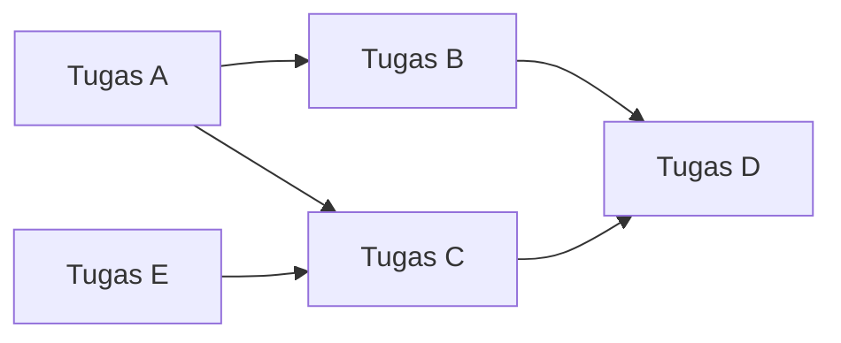
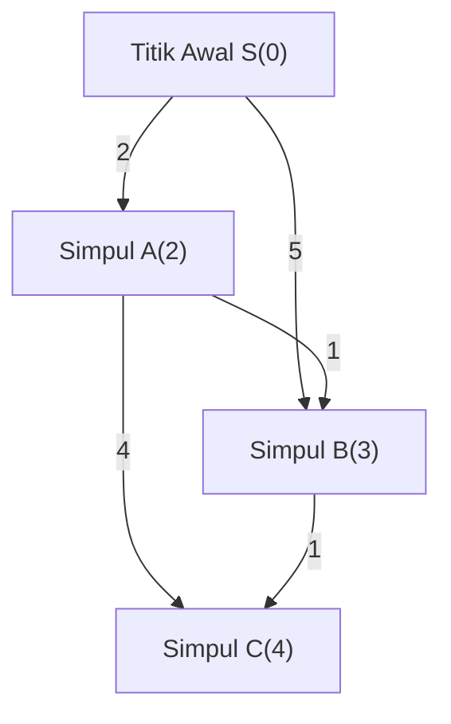
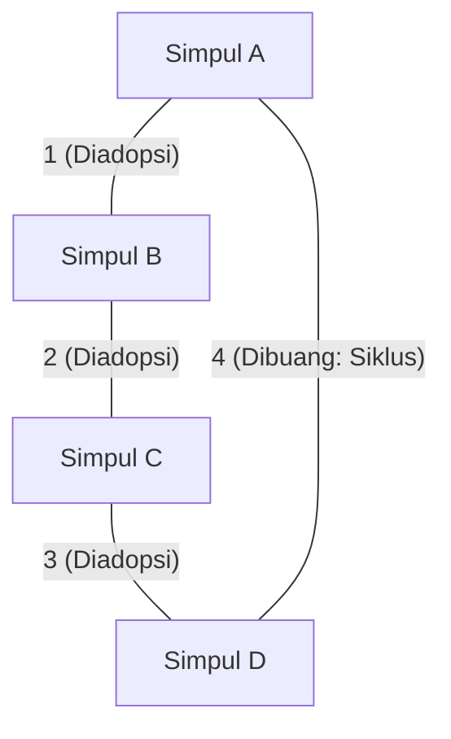
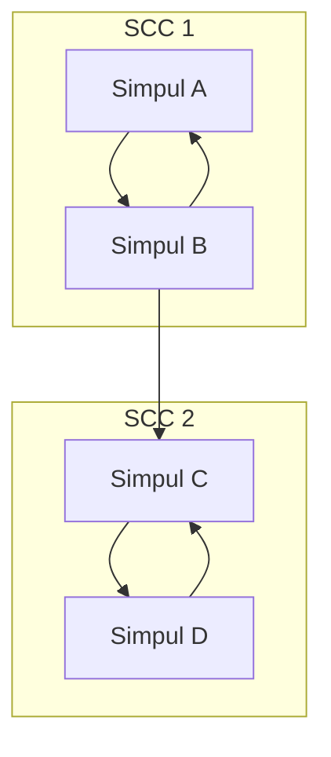

Dalam pemrograman kompetitif (competitive programming), teori graf beserta algoritmanya adalah salah satu tema terpenting yang tidak bisa dihindari. Banyak masalah yang diujikan dalam kontes seperti AtCoder, Codeforces, maupun TopCoder, memiliki struktur graf di baliknya. Baik itu pencarian rute terpendek pada jaringan jalan, meminimalkan biaya komunikasi jaringan, maupun menyelesaikan dependensi tugas, graf menjadi senjata ampuh untuk memecahkan masalah dunia nyata secara abstrak.

Pada artikel ini, kita akan membahas secara lengkap algoritma graf utama yang sering muncul dalam pemrograman kompetitif (Topological Sort, Dijkstra, Bellman-Ford, Floyd-Warshall, Kruskal, Prim, dan Strongly Connected Components), meliputi latar belakang teoretisnya, evaluasi kompleksitas dengan rumus matematika, serta contoh implementasi yang sangat dioptimalkan menggunakan C++ modern (C++17/20). Kami menyajikan panduan yang benar-benar "lengkap" ini dalam volume besar.

---

## 1. Dasar dan Batasan Algoritma Graf

Sebelum mempelajari algoritma, penting untuk memahami batasan umum dan perkiraan kompleksitas masalah graf dalam pemrograman kompetitif. Sebuah graf direpresentasikan dengan jumlah simpul $V$ (Vertices) dan jumlah sisi $E$ (Edges).

*   $O(V + E)$ : Kompleksitas yang diperlukan untuk masalah dengan jumlah simpul $V, E \le 10^5 \sim 10^6$. Depth-First Search (DFS) dan Breadth-First Search (BFS) termasuk dalam kategori ini.
*   $O((V + E) \log V)$ : Sering muncul pada masalah dengan $V, E \le 10^5 \sim 2 \cdot 10^5$. Ini merupakan kompleksitas algoritma Dijkstra atau Prim ketika menggunakan antrean prioritas (priority queue).
*   $O(V^2)$ : Diizinkan untuk graf padat (dense graph, $E \approx V^2$) dengan $V \le 2000 \sim 3000$.
*   $O(V^3)$ : Masalah dengan $V \le 400 \sim 500$. Algoritma Floyd-Warshall adalah contoh paling umum.

Dalam pemrograman kompetitif, representasi graf yang umum digunakan adalah **Daftar Ketetanggaan (Adjacency List)**. Matriks ketetanggaan mengonsumsi memori sebesar $O(V^2)$, sehingga dapat menyebabkan batas memori terlampaui (Memory Limit Exceeded) pada masalah dengan jumlah simpul yang banyak.

---

## 2. Eksplorasi dan Pengurutan Graf

### Topological Sort

Topological Sort adalah algoritma untuk mengurutkan simpul-simpul pada Directed Acyclic Graph (DAG) secara linear sedemikian rupa sehingga semua sisi berarah menunjuk dari simpul depan ke simpul belakang. Ini digunakan untuk menyelesaikan dependensi tugas (contoh: Tugas B tidak dapat dimulai sebelum Tugas A selesai), atau menentukan urutan perhitungan pemrograman dinamis (DP) pada sebuah DAG.

Kompleksitasnya adalah $O(V + E)$. Terdapat dua jenis implementasi: algoritma Kahn (berbasis BFS dengan in-degree) dan berbasis DFS menggunakan urutan kembali (post-order). Di sini, kami akan memperkenalkan algoritma Kahn yang juga dapat dengan mudah menentukan pengurutan topologis terkecil secara leksikografis.



#### Contoh Implementasi C++ (Algoritma Kahn)

```cpp
#include <iostream>
#include <vector>
#include <queue>

using namespace std;

// Fungsi untuk melakukan topological sort
// Mengembalikan array kosong jika terdapat siklus
vector<int> topological_sort(int V, const vector<vector<int>>& graph) {
    vector<int> in_degree(V, 0);
    // Menghitung derajat masuk (in-degree)
    for (int u = 0; u < V; ++u) {
        for (int v : graph[u]) {
            in_degree[v]++;
        }
    }

    // Menambahkan simpul dengan in-degree 0 ke dalam antrean (Gunakan priority_queue<int, vector<int>, greater<int>> jika menginginkan leksikografis terkecil)
    queue<int> q;
    for (int i = 0; i < V; ++i) {
        if (in_degree[i] == 0) {
            q.push(i);
        }
    }

    vector<int> res;
    while (!q.empty()) {
        int u = q.front();
        q.pop();
        res.push_back(u);

        // Mengurangi in-degree dari simpul yang bertetangga
        for (int v : graph[u]) {
            in_degree[v]--;
            if (in_degree[v] == 0) {
                q.push(v);
            }
        }
    }

    // Memeriksa apakah terdapat siklus di dalam graf
    if (res.size() != V) {
        return {}; // Terdapat siklus
    }
    return res;
}
```

---

## 3. Masalah Rute Terpendek Sumber Tunggal (SSSP: Single Source Shortest Path)

Ini adalah masalah untuk mencari rute terpendek dari suatu titik awal ke semua simpul lainnya. Algoritma yang diterapkan berbeda-beda tergantung pada apakah bobot sisi non-negatif atau terdapat bobot negatif.

### Algoritma Dijkstra (Dijkstra's Algorithm)

Algoritma Dijkstra merupakan algoritma rute terpendek yang cepat dan bisa digunakan saat **semua bobot sisi bernilai non-negatif**. Algoritma ini berdasarkan metode greedy: "Konfirmasikan simpul yang memiliki jarak terpendek yang diketahui saat ini, lalu perbarui jarak dari simpul tersebut ke simpul-simpul tetangganya (relaksasi)".

#### Rumus Relaksasi (Relaxation)
Misalkan titik awal adalah $s$, jarak terpendek ke simpul $u$ adalah $d[u]$, dan bobot sisi $(u, v)$ adalah $w(u, v)$.
Rumus pembaruannya adalah sebagai berikut:
$$ d[v] = \min(d[v], d[u] + w(u, v)) $$

Dengan menggunakan antrean prioritas (`std::priority_queue`), kita dapat mengambil simpul dengan jarak terkecil yang belum dikonfirmasi dalam waktu $O(\log V)$, sehingga kompleksitas waktu secara keseluruhan menjadi $O((V + E) \log V)$. Kompleksitas ruangnya adalah $O(V + E)$.


Seperti terlihat pada gambar di atas, biaya untuk langsung dari S ke B adalah 5, tetapi dapat dicapai dengan biaya 3 jika melalui A. Algoritma Dijkstra melakukan optimisasi seperti ini.

#### Contoh Implementasi C++

```cpp
#include <iostream>
#include <vector>
#include <queue>

using namespace std;

const long long INF = 1e18; // Nilai yang cukup besar

struct Edge {
    int to;
    long long weight;
};

// Algoritma Dijkstra
// Mengembalikan array jarak terpendek dari titik awal s ke setiap simpul
vector<long long> dijkstra(int V, const vector<vector<Edge>>& graph, int s) {
    vector<long long> dist(V, INF);
    dist[s] = 0;
    
    // Antrean prioritas yang mengelola {jarak, simpul} (diurutkan dari jarak terkecil)
    using P = pair<long long, int>;
    priority_queue<P, vector<P>, greater<P>> pq;
    pq.push({0, s});
    
    while (!pq.empty()) {
        auto [d, u] = pq.top();
        pq.pop();
        
        // Lewati jika rute yang lebih pendek sudah ditemukan (mengabaikan informasi lama)
        if (dist[u] < d) continue;
        
        // Proses relaksasi
        for (const auto& edge : graph[u]) {
            int v = edge.to;
            long long cost = edge.weight;
            if (dist[v] > dist[u] + cost) {
                dist[v] = dist[u] + cost;
                pq.push({dist[v], v});
            }
        }
    }
    return dist;
}
```
Pernyataan `if (dist[u] < d) continue;` sangat penting. Pada algoritma Dijkstra, satu simpul yang sama bisa masuk ke dalam antrean beberapa kali. Pengecekan ini berfungsi memangkas pencarian yang tidak diperlukan.

### Algoritma Bellman-Ford (Bellman-Ford Algorithm)

Jika terdapat nilai negatif pada bobot sisi, algoritma Dijkstra tidak dapat menemukan jawaban yang benar. Dalam kasus ini, algoritma Bellman-Ford adalah solusi yang tepat. Dengan mengulang proses relaksasi terhadap semua sisi sebanyak $V - 1$ kali, rute terpendek akan dihitung secara benar meskipun terdapat bobot negatif.

Jika masih terjadi pembaruan pada iterasi ke-$V$, ini menandakan adanya **siklus negatif (Negative Cycle)**. Masalah untuk mendeteksi siklus negatif juga sering muncul di competitive programming, dan algoritma Bellman-Ford sangat unggul sebagai algoritma pendeteksi hal tersebut.

Kompleksitas waktunya adalah $O(V \times E)$. Karena lebih lambat daripada Dijkstra, harap diingat bahwa algoritma ini hanya dapat diterapkan pada batasan sekitar $V \le 2000, E \le 5000$.

#### Contoh Implementasi C++

```cpp
#include <iostream>
#include <vector>

using namespace std;

const long long INF = 1e18;

struct Edge {
    int from;
    int to;
    long long weight;
};

// Algoritma Bellman-Ford
// Nilai kembali: {array jarak terpendek, apakah terdapat siklus negatif}
pair<vector<long long>, bool> bellman_ford(int V, const vector<Edge>& edges, int s) {
    vector<long long> dist(V, INF);
    dist[s] = 0;
    bool negative_cycle = false;

    // Lakukan iterasi sebanyak V kali
    for (int i = 0; i < V; ++i) {
        bool updated = false;
        for (const auto& edge : edges) {
            if (dist[edge.from] != INF && dist[edge.to] > dist[edge.from] + edge.weight) {
                dist[edge.to] = dist[edge.from] + edge.weight;
                updated = true;
                // Jika terjadi pembaruan pada iterasi ke-V, berarti terdapat siklus negatif
                if (i == V - 1) {
                    negative_cycle = true;
                }
            }
        }
        // Berhenti lebih awal jika tidak ada pembaruan (Optimisasi)
        if (!updated) break;
    }
    
    return {dist, negative_cycle};
}
```

---

## 4. Masalah Rute Terpendek Semua Pasangan (APSP: All-Pairs Shortest Path)

### Algoritma Floyd-Warshall (Floyd-Warshall Algorithm)

Algoritma ini digunakan untuk mencari jarak terpendek antara semua pasangan simpul dalam sebuah graf. Algoritma ini didasarkan pada pemrograman dinamis (DP). Keunggulannya adalah logikanya yang sangat sederhana dan implementasinya yang sangat mudah.

Persamaan transisi state-nya adalah sebagai berikut. Kita memilih yang lebih pendek antara jalur yang melewati simpul $k$ dan yang tidak:
$$ d[i][j] = \min(d[i][j], d[i][k] + d[k][j]) $$

Karena menggunakan tiga perulangan berlapis, kompleksitas waktunya adalah $O(V^3)$, dengan kompleksitas ruang $O(V^2)$. Jika jumlah simpul sekitar $V \le 400$, ini masih berada dalam batas waktu eksekusi (biasanya 2 detik).

#### Contoh Implementasi C++

```cpp
#include <iostream>
#include <vector>
#include <algorithm>

using namespace std;

const long long INF = 1e18;

// Algoritma Floyd-Warshall
// dist[i][j] pada kondisi awal adalah bobot sisi dari i ke j (INF jika tidak ada sisi, 0 jika i==j)
void floyd_warshall(int V, vector<vector<long long>>& dist) {
    // Simpul perantara k
    for (int k = 0; k < V; ++k) {
        // Titik awal i
        for (int i = 0; i < V; ++i) {
            // Titik akhir j
            for (int j = 0; j < V; ++j) {
                // Periksa apakah nilainya INF untuk mencegah overflow
                if (dist[i][k] != INF && dist[k][j] != INF) {
                    dist[i][j] = min(dist[i][j], dist[i][k] + dist[k][j]);
                }
            }
        }
    }
}
```

Algoritma Floyd-Warshall juga dapat mendeteksi siklus negatif. Setelah iterasi selesai, jika ada simpul `i` yang memiliki `dist[i][i] < 0`, itu berarti graf tersebut mengandung siklus negatif.

---

## 5. Minimum Spanning Tree (MST)

Pada graf tidak berarah yang terhubung, subgraf tanpa siklus (pohon) yang menghubungkan seluruh simpul dan memiliki jumlah bobot sisi minimum disebut **Minimum Spanning Tree (MST)**. Ini secara langsung berhubungan dengan masalah seperti meminimalkan biaya pembangunan jaringan.

### Algoritma Kruskal (Kruskal's Algorithm)

Algoritma ini mengurutkan semua sisi berdasarkan bobotnya dari yang terkecil, lalu menerapkan metode greedy dengan mengadopsi sisi-sisi secara berurutan selama tidak membentuk siklus. Pengecekan siklus dapat dilakukan dengan cepat menggunakan **struktur data himpunan saling lepas (Union-Find, Disjoint Set)**.

Kompleksitas waktunya adalah $O(E \log E)$ yang didominasi oleh proses pengurutan sisi. Ini merupakan algoritma pembentukan MST yang paling sering digunakan dalam competitive programming.



#### Contoh Implementasi C++

```cpp
#include <iostream>
#include <vector>
#include <algorithm>

using namespace std;

// Union-Find (Struktur Data Himpunan Saling Lepas)
struct UnionFind {
    vector<int> parent, rank, size;
    UnionFind(int n) : parent(n), rank(n, 0), size(n, 1) {
        for (int i = 0; i < n; i++) parent[i] = i;
    }
    int find(int x) {
        if (parent[x] == x) return x;
        // Kompresi jalur
        return parent[x] = find(parent[x]);
    }
    bool unite(int x, int y) {
        int root_x = find(x);
        int root_y = find(y);
        if (root_x == root_y) return false;
        
        // Penggabungan berdasarkan rank
        if (rank[root_x] < rank[root_y]) swap(root_x, root_y);
        parent[root_y] = root_x;
        if (rank[root_x] == rank[root_y]) rank[root_x]++;
        size[root_x] += size[root_y];
        return true;
    }
    bool same(int x, int y) { return find(x) == find(y); }
};

struct Edge {
    int u, v;
    long long weight;
    // Fungsi pembanding untuk pengurutan
    bool operator<(const Edge& other) const {
        return weight < other.weight;
    }
};

// Algoritma Kruskal
long long kruskal(int V, vector<Edge>& edges) {
    // Urutkan sisi berdasarkan bobot secara menaik (ascending)
    sort(edges.begin(), edges.end());
    
    UnionFind uf(V);
    long long mst_cost = 0;
    int edge_count = 0;
    
    for (const auto& edge : edges) {
        if (uf.unite(edge.u, edge.v)) {
            mst_cost += edge.weight;
            edge_count++;
            // Berhenti jika sudah terpilih V-1 sisi (Optimisasi)
            if (edge_count == V - 1) break;
        }
    }
    return mst_cost;
}
```

### Algoritma Prim (Prim's Algorithm)

Pendekatannya sangat mirip dengan algoritma Dijkstra. Dimulai dari satu simpul, algoritma menumbuhkan pohon secara bertahap dengan memilih sisi berbobot terkecil yang terhubung langsung ke pohon yang sudah terbentuk.

Ketika menggunakan antrean prioritas, kompleksitasnya menjadi $O((V + E) \log V)$. Pada graf padat (graf dengan banyak sisi), implementasi berbasis array dari algoritma Prim $O(V^2)$ bisa jadi lebih cepat daripada algoritma Kruskal.

#### Contoh Implementasi C++

```cpp
#include <iostream>
#include <vector>
#include <queue>

using namespace std;

struct Edge {
    int to;
    long long weight;
};

// Algoritma Prim
long long prim(int V, const vector<vector<Edge>>& graph) {
    vector<bool> used(V, false);
    // {bobot, simpul}
    using P = pair<long long, int>;
    priority_queue<P, vector<P>, greater<P>> pq;
    
    long long mst_cost = 0;
    // Simpul 0 sebagai titik awal
    pq.push({0, 0});
    
    while (!pq.empty()) {
        auto [cost, u] = pq.top();
        pq.pop();
        
        if (used[u]) continue;
        used[u] = true;
        mst_cost += cost;
        
        for (const auto& edge : graph[u]) {
            if (!used[edge.to]) {
                pq.push({edge.weight, edge.to});
            }
        }
    }
    return mst_cost;
}
```

---

## 6. Lanjutan: Strongly Connected Components (SCC)

Pada graf berarah, "himpunan simpul yang saling dapat dijangkau satu sama lain" disebut Komponen Terhubung Kuat (Strongly Connected Component / SCC). Jika kita mengelompokkan setiap SCC, graf berarah acak akan selalu berubah menjadi DAG (Directed Acyclic Graph) secara keseluruhan. Proses ini disebut **Strongly Connected Components Decomposition (Dekomposisi SCC)**. Ini adalah langkah pra-pemrosesan yang sangat penting untuk menyederhanakan struktur graf agar masalah lebih mudah dipecahkan.

Dalam competitive programming, ini banyak digunakan untuk menyelesaikan masalah 2-SAT atau meringkas graf bersiklus menjadi DAG agar bisa diselesaikan dengan pemrograman dinamis (DP).

### Algoritma Kosaraju (Kosaraju's Algorithm)

Algoritma Kosaraju adalah metode yang indah dan efisien untuk membentuk SCC hanya dengan melakukan 2 kali DFS (Depth-First Search). Kompleksitasnya bekerja secara linear $O(V + E)$.

Langkah-langkah algoritma:
1. Lakukan DFS pada graf awal, dan catat simpul-simpul dalam array pada tahap kembali (post-order).
2. Buat **graf terbalik** dengan membalikkan arah semua sisi.
3. Lakukan DFS dari simpul yang belum dikunjungi pada graf terbalik, menelusuri array yang dicatat pada langkah 1 **dari belakang** (urutan kembalian paling akhir terlebih dahulu). Himpunan simpul yang berhasil dijangkau dalam satu panggilan DFS ini merupakan sebuah SCC.



#### Contoh Implementasi C++

```cpp
#include <iostream>
#include <vector>
#include <algorithm>

using namespace std;

struct SCC {
    int V;
    vector<vector<int>> graph, rev_graph;
    vector<int> order, comp;
    vector<bool> used;

    SCC(int n) : V(n), graph(n), rev_graph(n), comp(n, -1), used(n, false) {}

    void add_edge(int from, int to) {
        graph[from].push_back(to);
        rev_graph[to].push_back(from);
    }

    // DFS pertama (Mencatat post-order)
    void dfs1(int u) {
        used[u] = true;
        for (int v : graph[u]) {
            if (!used[v]) dfs1(v);
        }
        order.push_back(u);
    }

    // DFS kedua (Eksplorasi graf terbalik)
    void dfs2(int u, int id) {
        used[u] = true;
        comp[u] = id;
        for (int v : rev_graph[u]) {
            if (!used[v]) dfs2(v, id);
        }
    }

    // Proses pembentukan SCC. Mengembalikan jumlah grup SCC
    int build() {
        // DFS pertama
        for (int i = 0; i < V; ++i) {
            if (!used[i]) dfs1(i);
        }

        fill(used.begin(), used.end(), false);
        int group_id = 0;

        // DFS kedua (urutan terbalik dari order)
        for (int i = V - 1; i >= 0; --i) {
            int u = order[i];
            if (!used[u]) {
                dfs2(u, group_id++);
            }
        }
        return group_id;
    }
};
```

Pada array `comp`, akan tersimpan ID dari SCC tempat setiap simpul berada. ID ini pada dasarnya memiliki sifat yang sangat menguntungkan karena dialokasikan sesuai dengan urutan topological sort. Artinya, cukup dengan melihat nilai `comp`, kita dapat segera mengetahui hubungan ketergantungan setelah dikerutkan menjadi DAG.

---

## 7. Kesimpulan dan Saran Belajar

Dalam artikel ini, kita telah meninjau algoritma graf yang sering muncul pada pemrograman kompetitif.
Kunci untuk mahir dalam masalah graf adalah **"mengimplementasikan berulang kali sampai menjadi kebiasaan"** dan **"melatih pikiran untuk merepresentasikan suatu masalah sebagai graf (apa saja simpulnya, apa saja sisinya)"**.

1. Pertama-tama, pastikan bisa menulis DFS / BFS dengan cepat dan tanpa kesalahan.
2. Selanjutnya, pastikan bisa menulis algoritma Dijkstra dan Kruskal di luar kepala (Wajib untuk sabuk cokelat hingga hijau di AtCoder).
3. Terakhir, perluas wawasan dengan Bellman-Ford, Floyd-Warshall, Topological Sort, dan SCC (Berguna sebagai senjata ampuh di sabuk biru muda hingga biru di AtCoder).

Kami sangat menyarankan untuk menyimpannya sebagai library berupa cuplikan kode (snippet tool atau repository GitHub pribadi) sehingga Anda dapat memanggilnya tanpa ragu pada saat kontes berlangsung.

Algoritma graf dalam pemrograman kompetitif adalah bidang di mana Anda bisa paling merasakan keindahan dan kekuatan suatu algoritma. Silakan ketik ulang kode di artikel ini dan cobalah menaklukkan soal-soal di platform online judge!
