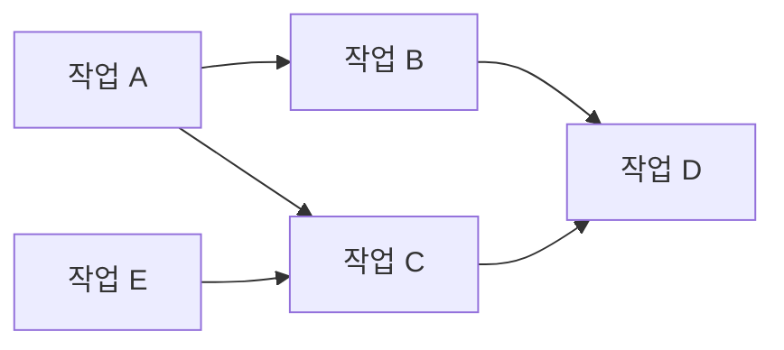
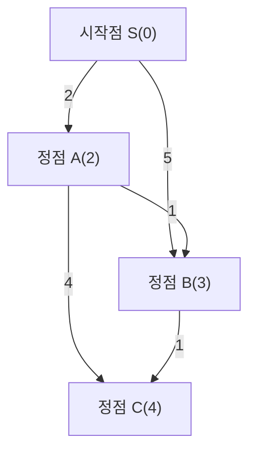
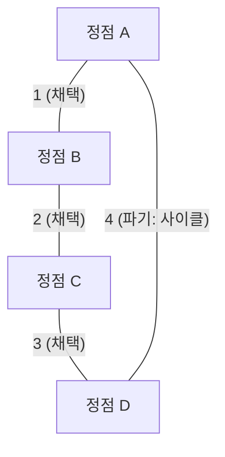
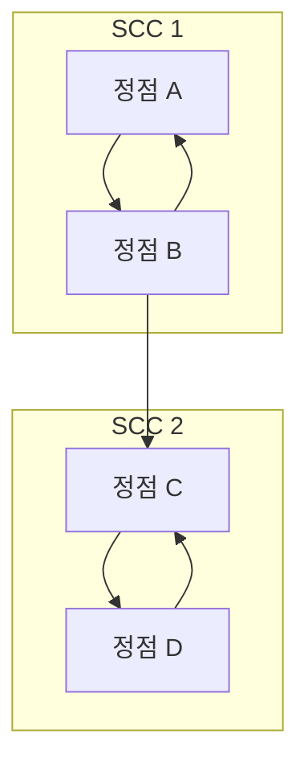

경쟁 프로그래밍(경프)에서 그래프 이론과 그 알고리즘은 피할 수 없는 가장 중요한 주제 중 하나입니다. AtCoder, Codeforces, TopCoder 등의 콘테스트에 출제되는 많은 문제가 이면에 그래프 구조를 가지고 있습니다. 도로망의 최단 경로, 네트워크 통신 비용 최소화, 작업의 의존성 해결 등 현실 세계의 문제를 추상화하여 풀기 위한 강력한 무기가 됩니다.

이 글에서는 경쟁 프로그래밍에 자주 등장하는 주요 그래프 알고리즘(위상 정렬, 다익스트라 알고리즘, 벨만-포드 알고리즘, 플로이드-워셜 알고리즘, 크루스칼 알고리즘, 프림 알고리즘, 강결합 컴포넌트 분해)에 대해 이론적인 배경, 수식을 활용한 시간 복잡도 평가, 그리고 최신 C++(C++17/20)로 고도로 최적화된 구현 예시와 함께 완전하게 다룹니다. 약 10,000자에 달하는 방대한 분량으로 전해드리는 그야말로 '완전 정복' 가이드입니다.

---

## 1. 그래프 알고리즘의 기초와 제약

알고리즘을 배우기 전에, 경쟁 프로그래밍의 그래프 문제에서 일반적인 제약 조건과 시간 복잡도의 기준을 파악해 두는 것이 중요합니다. 그래프는 정점 수 $V$ (Vertices) 와 간선 수 $E$ (Edges) 로 나타냅니다.

*   $O(V + E)$ : 정점 수 $V, E \le 10^5 \sim 10^6$ 인 문제에서 요구되는 시간 복잡도입니다. 깊이 우선 탐색 (DFS) 이나 너비 우선 탐색 (BFS) 이 이에 해당합니다.
*   $O((V + E) \log V)$ : $V, E \le 10^5 \sim 2 \cdot 10^5$ 인 문제에서 자주 나옵니다. 다익스트라 알고리즘이나 프림 알고리즘 등에서 우선순위 큐를 사용할 경우의 시간 복잡도입니다.
*   $O(V^2)$ : $V \le 2000 \sim 3000$ 인 밀집 그래프($E \approx V^2$)에서 허용됩니다.
*   $O(V^3)$ : $V \le 400 \sim 500$ 인 문제. 플로이드-워셜 알고리즘이 대표적입니다.

경쟁 프로그래밍에서는 그래프의 표현으로 **인접 리스트 (Adjacency List)** 를 사용하는 것이 일반적입니다. 인접 행렬은 메모리를 $O(V^2)$ 만큼 소비하기 때문에 정점 수가 많은 문제에서는 메모리 제한 (Memory Limit Exceeded) 에 걸리게 됩니다.

---

## 2. 그래프의 탐색과 순서 지정

### 위상 정렬 (Topological Sort)

위상 정렬은 방향 비순환 그래프 (DAG: Directed Acyclic Graph) 의 정점들을, 모든 방향 간선이 앞쪽 정점에서 뒤쪽 정점을 향하도록 일렬로 나열하는 알고리즘입니다. 작업의 의존성(예: 작업 A가 끝나지 않으면 작업 B를 시작할 수 없음)을 해결할 때나 DAG 위에서의 동적 계획법 (DP) 계산 순서를 결정하기 위해 사용됩니다.

시간 복잡도는 $O(V + E)$ 입니다. 칸(Kahn)의 알고리즘(진입 차수를 이용한 BFS 기반)과 후위 순회를 이용한 DFS 기반의 2가지 구현이 있습니다만, 여기서는 사전순으로 가장 앞서는 위상 정렬도 쉽게 구할 수 있는 칸의 알고리즘을 소개합니다.



#### C++ 구현 예시 (칸의 알고리즘)

```cpp
#include <iostream>
#include <vector>
#include <queue>

using namespace std;

// 위상 정렬을 수행하는 함수
// 사이클이 존재하는 경우 빈 배열을 반환
vector<int> topological_sort(int V, const vector<vector<int>>& graph) {
    vector<int> in_degree(V, 0);
    // 진입 차수 계산
    for (int u = 0; u < V; ++u) {
        for (int v : graph[u]) {
            in_degree[v]++;
        }
    }

    // 진입 차수가 0인 정점을 큐에 추가 (사전순 최소가 필요한 경우 priority_queue<int, vector<int>, greater<int>> 사용)
    queue<int> q;
    for (int i = 0; i < V; ++i) {
        if (in_degree[i] == 0) {
            q.push(i);
        }
    }

    vector<int> res;
    while (!q.empty()) {
        int u = q.front();
        q.pop();
        res.push_back(u);

        // 인접한 정점의 진입 차수 감소
        for (int v : graph[u]) {
            in_degree[v]--;
            if (in_degree[v] == 0) {
                q.push(v);
            }
        }
    }

    // 그래프에 사이클이 포함되어 있는지 확인
    if (res.size() != V) {
        return {}; // 사이클 존재
    }
    return res;
}
```

---

## 3. 단일 출발지 최단 경로 문제 (SSSP: Single Source Shortest Path)

어떤 출발지(시작점)에서 다른 모든 정점까지의 최단 경로를 구하는 문제입니다. 간선의 가중치가 음이 아닌지, 혹은 음의 가중치가 존재하는지에 따라 적용할 수 있는 알고리즘이 다릅니다.

### 다익스트라 알고리즘 (Dijkstra's Algorithm)

다익스트라 알고리즘은 **모든 간선의 가중치가 음수 값이 아닐 때** 적용할 수 있는 빠른 최단 경로 알고리즘입니다. '현재까지 알려진 최단 거리가 가장 짧은 정점을 확정 짓고, 그 정점에서 인접한 정점들로의 거리를 갱신한다(완화)'는 그리디(탐욕) 방법에 기반합니다.

#### 완화 (Relaxation) 수식
출발지를 $s$ 라 하고 정점 $u$ 까지의 최단 거리를 $d[u]$, 간선 $(u, v)$ 의 가중치를 $w(u, v)$ 라 합시다.
갱신식은 다음과 같습니다.
$$ d[v] = \min(d[v], d[u] + w(u, v)) $$

우선순위 큐 (`std::priority_queue`) 를 사용함으로써, 거리가 최소인 미확정 정점을 $O(\log V)$ 만에 꺼낼 수 있으며, 전체 시간 복잡도는 $O((V + E) \log V)$ 가 됩니다. 공간 복잡도는 $O(V + E)$ 입니다.


위 그림처럼 S에서 B로 직접 가는 비용은 5이지만, A를 거쳐 가면 비용 3으로 도달할 수 있습니다. 다익스트라 알고리즘은 이와 같이 최적화를 진행합니다.

#### C++ 구현 예시

```cpp
#include <iostream>
#include <vector>
#include <queue>

using namespace std;

const long long INF = 1e18; // 충분히 큰 값

struct Edge {
    int to;
    long long weight;
};

// 다익스트라 알고리즘
// 출발지 s에서 각 정점까지의 최단 거리 배열을 반환
vector<long long> dijkstra(int V, const vector<vector<Edge>>& graph, int s) {
    vector<long long> dist(V, INF);
    dist[s] = 0;
    
    // {거리, 정점} 을 관리하는 우선순위 큐 (거리가 작은 순)
    using P = pair<long long, int>;
    priority_queue<P, vector<P>, greater<P>> pq;
    pq.push({0, s});
    
    while (!pq.empty()) {
        auto [d, u] = pq.top();
        pq.pop();
        
        // 이미 더 짧은 경로를 찾은 경우는 스킵 (오래된 정보 폐기)
        if (dist[u] < d) continue;
        
        // 완화 처리
        for (const auto& edge : graph[u]) {
            int v = edge.to;
            long long cost = edge.weight;
            if (dist[v] > dist[u] + cost) {
                dist[v] = dist[u] + cost;
                pq.push({dist[v], v});
            }
        }
    }
    return dist;
}
```
`if (dist[u] < d) continue;` 라는 한 줄이 매우 중요합니다. 다익스트라 알고리즘에서는 같은 정점이 여러 번 큐에 푸시될 수 있는데, 이 확인 작업을 통해 쓸데없는 탐색을 가지치기합니다.

### 벨만-포드 알고리즘 (Bellman-Ford Algorithm)

간선의 가중치에 음수 값이 포함될 경우, 다익스트라 알고리즘은 올바른 답을 도출하지 못합니다. 이때 활약하는 것이 벨만-포드 알고리즘입니다. 모든 간선에 대한 완화 처리를 $V - 1$ 번 반복함으로써, 음의 가중치가 있더라도 최단 경로를 정확하게 계산합니다.

만약 $V$ 번째 반복에서도 갱신이 발생한다면, 그것은 **음의 사이클 (Negative Cycle)** 이 존재한다는 것을 의미합니다. 경쟁 프로그래밍에서는 '음의 사이클을 찾아라'라는 문제도 자주 출제되며, 벨만-포드 알고리즘은 그 탐지 알고리즘으로서도 매우 뛰어납니다.

시간 복잡도는 $O(V \times E)$ 가 되어 다익스트라 알고리즘보다 느리기 때문에, $V \le 2000, E \le 5000$ 정도의 제약에서만 적용할 수 있다는 점에 주의해야 합니다.

#### C++ 구현 예시

```cpp
#include <iostream>
#include <vector>

using namespace std;

const long long INF = 1e18;

struct Edge {
    int from;
    int to;
    long long weight;
};

// 벨만-포드 알고리즘
// 반환값: {최단 거리 배열, 음의 사이클 존재 여부}
pair<vector<long long>, bool> bellman_ford(int V, const vector<Edge>& edges, int s) {
    vector<long long> dist(V, INF);
    dist[s] = 0;
    bool negative_cycle = false;

    // V번 루프를 돈다
    for (int i = 0; i < V; ++i) {
        bool updated = false;
        for (const auto& edge : edges) {
            if (dist[edge.from] != INF && dist[edge.to] > dist[edge.from] + edge.weight) {
                dist[edge.to] = dist[edge.from] + edge.weight;
                updated = true;
                // V번째 갱신이 발생했다면 음의 사이클이 존재함
                if (i == V - 1) {
                    negative_cycle = true;
                }
            }
        }
        // 갱신이 없으면 조기 종료 (최적화)
        if (!updated) break;
    }
    
    return {dist, negative_cycle};
}
```

---

## 4. 모든 쌍 최단 경로 문제 (APSP: All-Pairs Shortest Path)

### 플로이드-워셜 알고리즘 (Floyd-Warshall Algorithm)

그래프 내의 모든 정점 쌍 간의 최단 거리를 구하는 알고리즘입니다. 동적 계획법 (DP) 을 기반으로 합니다. 알고리즘이 매우 간결하고 구현이 극히 쉽다는 점이 매력적입니다.

상태 전이 방정식은 다음과 같습니다. 정점 $k$ 를 거쳐가는 경로와 거치지 않는 경로 중 더 짧은 쪽을 채택합니다.
$$ d[i][j] = \min(d[i][j], d[i][k] + d[k][j]) $$

3중 루프를 돌기 때문에 시간 복잡도는 $O(V^3)$, 공간 복잡도는 $O(V^2)$ 가 됩니다. 정점 수가 $V \le 400$ 정도라면 실행 시간 제한(보통 2초)에 맞출 수 있습니다.

#### C++ 구현 예시

```cpp
#include <iostream>
#include <vector>
#include <algorithm>

using namespace std;

const long long INF = 1e18;

// 플로이드-워셜 알고리즘
// dist[i][j] 는 초기 상태에서 i부터 j까지의 간선 가중치 (간선이 없는 경우 INF, i==j인 경우 0)
void floyd_warshall(int V, vector<vector<long long>>& dist) {
    // 거쳐가는 정점 k
    for (int k = 0; k < V; ++k) {
        // 출발지 i
        for (int i = 0; i < V; ++i) {
            // 도착지 j
            for (int j = 0; j < V; ++j) {
                // 오버플로우를 막기 위해 INF인지 확인
                if (dist[i][k] != INF && dist[k][j] != INF) {
                    dist[i][j] = min(dist[i][j], dist[i][k] + dist[k][j]);
                }
            }
        }
    }
}
```

플로이드-워셜 알고리즘에서도 음의 사이클을 찾아낼 수 있습니다. 루프가 끝난 후 `dist[i][i] < 0` 이 되는 정점 `i` 가 하나라도 존재한다면, 그래프에 음의 사이클이 포함되어 있는 것입니다.

---

## 5. 최소 신장 트리 (MST: Minimum Spanning Tree)

연결된 무방향 그래프에서 모든 정점을 연결하는 트리(사이클이 없는 부분 그래프) 중 간선 가중치의 총합이 최소가 되는 것을 **최소 신장 트리 (MST)** 라고 부릅니다. 네트워크 구축 비용의 최소화 등에서 직접적으로 출제됩니다.

### 크루스칼 알고리즘 (Kruskal's Algorithm)

모든 간선을 가중치가 작은 순서대로 정렬하고, 사이클을 만들지 않도록 차례대로 간선을 선택해 나가는 그리디 알고리즘입니다. 사이클 판별에는 **서로소 집합 자료구조 (Union-Find, Disjoint Set)** 를 이용하면 고속으로 처리할 수 있습니다.

시간 복잡도는 간선 정렬이 병목이 되어 $O(E \log E)$ 입니다. 경쟁 프로그래밍에서 가장 빈번하게 사용되는 MST 구축 알고리즘입니다.



#### C++ 구현 예시

```cpp
#include <iostream>
#include <vector>
#include <algorithm>

using namespace std;

// Union-Find (서로소 집합 자료구조)
struct UnionFind {
    vector<int> parent, rank, size;
    UnionFind(int n) : parent(n), rank(n, 0), size(n, 1) {
        for (int i = 0; i < n; i++) parent[i] = i;
    }
    int find(int x) {
        if (parent[x] == x) return x;
        // 경로 압축
        return parent[x] = find(parent[x]);
    }
    bool unite(int x, int y) {
        int root_x = find(x);
        int root_y = find(y);
        if (root_x == root_y) return false;
        
        // 랭크에 기반한 병합
        if (rank[root_x] < rank[root_y]) swap(root_x, root_y);
        parent[root_y] = root_x;
        if (rank[root_x] == rank[root_y]) rank[root_x]++;
        size[root_x] += size[root_y];
        return true;
    }
    bool same(int x, int y) { return find(x) == find(y); }
};

struct Edge {
    int u, v;
    long long weight;
    // 정렬을 위한 비교 연산자
    bool operator<(const Edge& other) const {
        return weight < other.weight;
    }
};

// 크루스칼 알고리즘
long long kruskal(int V, vector<Edge>& edges) {
    // 간선을 가중치 오름차순으로 정렬
    sort(edges.begin(), edges.end());
    
    UnionFind uf(V);
    long long mst_cost = 0;
    int edge_count = 0;
    
    for (const auto& edge : edges) {
        if (uf.unite(edge.u, edge.v)) {
            mst_cost += edge.weight;
            edge_count++;
            // 정점 개수 V-1개의 간선이 선택되면 종료 (최적화)
            if (edge_count == V - 1) break;
        }
    }
    return mst_cost;
}
```

### 프림 알고리즘 (Prim's Algorithm)

다익스트라 알고리즘과 매우 유사한 접근 방식을 취합니다. 어떤 하나의 정점에서 시작하여, 이미 만들어진 트리에 직접 연결된 간선 중 가장 가중치가 작은 것을 차례차례 선택하며 트리를 성장시켜 나갑니다.

우선순위 큐를 사용할 경우의 시간 복잡도는 $O((V + E) \log V)$ 입니다. 밀집 그래프(간선 수가 많은 그래프)의 경우, 프림 알고리즘의 배열 기반 구현 $O(V^2)$ 이 크루스칼 알고리즘보다 빠를 수 있습니다.

#### C++ 구현 예시

```cpp
#include <iostream>
#include <vector>
#include <queue>

using namespace std;

struct Edge {
    int to;
    long long weight;
};

// 프림 알고리즘
long long prim(int V, const vector<vector<Edge>>& graph) {
    vector<bool> used(V, false);
    // {가중치, 정점}
    using P = pair<long long, int>;
    priority_queue<P, vector<P>, greater<P>> pq;
    
    long long mst_cost = 0;
    // 정점 0을 시작점으로 삼는다
    pq.push({0, 0});
    
    while (!pq.empty()) {
        auto [cost, u] = pq.top();
        pq.pop();
        
        if (used[u]) continue;
        used[u] = true;
        mst_cost += cost;
        
        for (const auto& edge : graph[u]) {
            if (!used[edge.to]) {
                pq.push({edge.weight, edge.to});
            }
        }
    }
    return mst_cost;
}
```

---

## 6. 심화: 강결합 컴포넌트 분해 (SCC: Strongly Connected Components)

방향 그래프에서 '서로 왕래할 수 있는 정점들의 집합'을 강결합 컴포넌트 (SCC) 라고 부릅니다. 임의의 방향 그래프를 강결합 컴포넌트별로 묶으면 전체적으로 반드시 DAG (방향 비순환 그래프) 가 됩니다. 이것을 **강결합 컴포넌트 분해**라고 합니다. 그래프 구조를 단순화하여 문제를 풀기 쉽게 하기 위한 매우 중요한 전처리 작업입니다.

경쟁 프로그래밍에서는 2-SAT 문제 해결이나 사이클이 있는 그래프를 DAG로 축소하여 DP를 수행하는 상황에서 많이 쓰입니다.

### 코사라주 알고리즘 (Kosaraju's Algorithm)

코사라주 알고리즘은 DFS(깊이 우선 탐색)를 2번 수행하는 것만으로 SCC를 구축할 수 있는 아름답고 효율적인 기법입니다. 시간 복잡도는 $O(V + E)$ 로 선형 시간에 동작합니다.

알고리즘 절차:
1. 원래 그래프에서 DFS를 수행하여 후위 순회(post-order)로 정점을 배열에 기록합니다.
2. 모든 간선의 방향을 뒤집은 **역방향 그래프**를 생성합니다.
3. 1에서 기록한 배열의 **뒤에서부터 차례로**(후위 순회가 늦은 순서로), 역방향 그래프에서 아직 방문하지 않은 정점부터 DFS를 수행합니다. 이 1회의 DFS로 도달할 수 있었던 정점의 집합이 하나의 SCC가 됩니다.



#### C++ 구현 예시

```cpp
#include <iostream>
#include <vector>
#include <algorithm>

using namespace std;

struct SCC {
    int V;
    vector<vector<int>> graph, rev_graph;
    vector<int> order, comp;
    vector<bool> used;

    SCC(int n) : V(n), graph(n), rev_graph(n), comp(n, -1), used(n, false) {}

    void add_edge(int from, int to) {
        graph[from].push_back(to);
        rev_graph[to].push_back(from);
    }

    // 1번째 DFS (후위 순회 기록)
    void dfs1(int u) {
        used[u] = true;
        for (int v : graph[u]) {
            if (!used[v]) dfs1(v);
        }
        order.push_back(u);
    }

    // 2번째 DFS (역방향 그래프 탐색)
    void dfs2(int u, int id) {
        used[u] = true;
        comp[u] = id;
        for (int v : rev_graph[u]) {
            if (!used[v]) dfs2(v, id);
        }
    }

    // SCC 구축 처리. 반환값은 SCC 그룹 수
    int build() {
        // 1번째 DFS
        for (int i = 0; i < V; ++i) {
            if (!used[i]) dfs1(i);
        }

        fill(used.begin(), used.end(), false);
        int group_id = 0;

        // 2번째 DFS (order의 역순)
        for (int i = V - 1; i >= 0; --i) {
            int u = order[i];
            if (!used[u]) {
                dfs2(u, group_id++);
            }
        }
        return group_id;
    }
};
```

`comp` 배열에는 각 정점이 속한 SCC의 ID가 저장됩니다. 이 ID는 사실 위상 정렬 순서대로 할당된다는 매우 편리한 성질을 가지고 있습니다. 즉, `comp` 값을 보면 DAG로 축소한 뒤의 의존 관계를 즉각적으로 알 수 있습니다.

---

## 7. 정리와 학습 조언

이 글에서는 경쟁 프로그래밍에 자주 등장하는 그래프 알고리즘을 총망라했습니다.
그래프 문제의 실력을 높이는 요령은 **'손에 익을 때까지 여러 번 구현하는 것'** 과 **'이 문제는 어떤 그래프로 환원할 수 있을까(정점은 무엇인가, 간선은 무엇인가)를 생각하는 훈련을 하는 것'** 입니다.

1. 먼저 DFS / BFS 를 실수 없이 빠르게 작성할 수 있도록 합니다.
2. 다음으로 다익스트라 알고리즘과 크루스칼 알고리즘을 안 보고 쓸 수 있도록 합니다(AtCoder 브라운~그린 구간에서 필수).
3. 마지막으로 벨만-포드, 플로이드-워셜, 위상 정렬, SCC 등의 무기를 늘려나갑니다(AtCoder 시안~블루 구간에서 무기가 됩니다).

코드 스니펫(조각)으로 라이브러리화(스니펫 도구 등이나 자신의 GitHub 저장소에 보관)해 두고, 대회 실전에서 망설임 없이 불러올 수 있도록 준비해 두는 것을 강력히 권장합니다.

경쟁 프로그래밍의 그래프 알고리즘은 알고리즘의 아름다움과 강력함을 가장 잘 체감할 수 있는 분야입니다. 꼭 이 글의 코드를 직접 타이핑해 보고 온라인 저지에서 기출 문제에 도전해 보세요!
