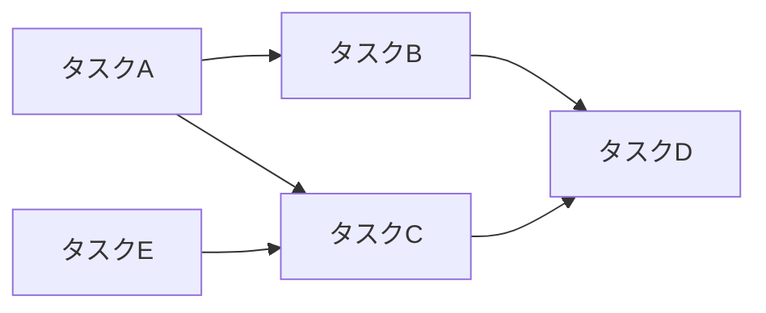
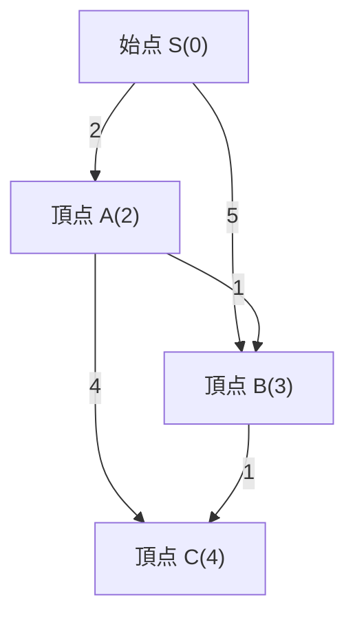
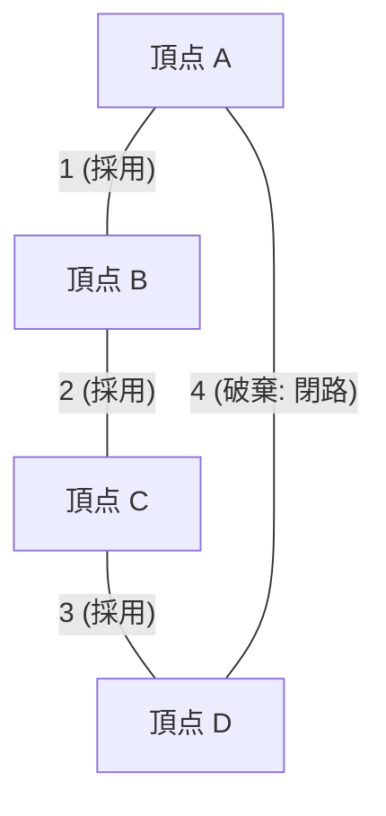
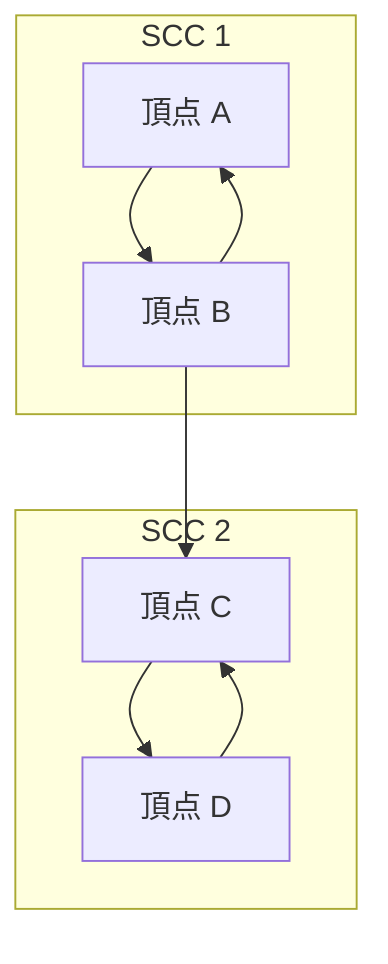

競技プログラミング（競プロ）において、グラフ理論とそのアルゴリズムは避けて通れない最重要テーマの一つです。AtCoderやCodeforces、トップコーダーなどのコンテストで出題される問題の多くは、背後にグラフの構造を持っています。道路網の最短経路、ネットワークの通信コスト最小化、タスクの依存関係の解消など、現実世界の問題を抽象化して解くための強力な武器となります。

本記事では、競技プログラミングで頻出となる主要なグラフアルゴリズム（トポロジカルソート、ダイクストラ法、ベルマンフォード法、ワーシャルフロイド法、クラスカル法、プリム法、強連結成分分解）について、その理論的な背景、数式を用いた計算量評価、そしてモダンなC++（C++17/20）による高度に最適化された実装例を交えて完全に網羅します。約10,000文字の大ボリュームでお届けする、まさに「完全攻略」ガイドです。

---

## 1. グラフアルゴリズムの基礎と制約

アルゴリズムを学ぶ前に、競プロにおけるグラフ問題の一般的な制約と計算量の目安を把握しておくことが重要です。グラフは頂点数 $V$ (Vertices) と 辺数 $E$ (Edges) で表されます。

*   $O(V + E)$ : 頂点数 $V, E \le 10^5 \sim 10^6$ の問題で要求される計算量です。深さ優先探索 (DFS) や 幅優先探索 (BFS) が該当します。
*   $O((V + E) \log V)$ : $V, E \le 10^5 \sim 2 \cdot 10^5$ の問題で頻出です。ダイクストラ法やプリム法などで優先度付きキューを使用した場合の計算量です。
*   $O(V^2)$ : $V \le 2000 \sim 3000$ の密グラフ（$E \approx V^2$）で許容されます。
*   $O(V^3)$ : $V \le 400 \sim 500$ の問題。ワーシャルフロイド法などが代表的です。

競技プログラミングでは、グラフの表現として**隣接リスト (Adjacency List)** を用いるのが一般的です。隣接行列はメモリを $O(V^2)$ 消費するため、頂点数が多い問題ではメモリ制限 (Memory Limit Exceeded) に引っかかってしまいます。

---

## 2. グラフの探索と順序付け

### トポロジカルソート (Topological Sort)

トポロジカルソートは、有向非巡回グラフ (DAG: Directed Acyclic Graph) の頂点を、すべての有向辺が前方の頂点から後方の頂点へと向かうように一列に並べるアルゴリズムです。タスクの依存関係（例: タスクAが終わらないとタスクBを開始できない）を解消する際や、DAG上での動的計画法 (DP) の計算順序を決定するために用いられます。

計算量は $O(V + E)$ です。Kahnのアルゴリズム（入次数を用いたBFSベース）と、帰りがけ順を用いたDFSベースの2種類の実装がありますが、ここでは辞書順最小のトポロジカルソートも簡単に求められるKahnのアルゴリズムを紹介します。



#### C++ 実装例 (Kahnのアルゴリズム)

```cpp
#include <iostream>
#include <vector>
#include <queue>

using namespace std;

// トポロジカルソートを行う関数
// 閉路が存在する場合は空の配列を返す
vector<int> topological_sort(int V, const vector<vector<int>>& graph) {
    vector<int> in_degree(V, 0);
    // 入次数の計算
    for (int u = 0; u < V; ++u) {
        for (int v : graph[u]) {
            in_degree[v]++;
        }
    }

    // 入次数が0の頂点をキューに追加 (辞書順最小が欲しい場合は priority_queue<int, vector<int>, greater<int>> を使用)
    queue<int> q;
    for (int i = 0; i < V; ++i) {
        if (in_degree[i] == 0) {
            q.push(i);
        }
    }

    vector<int> res;
    while (!q.empty()) {
        int u = q.front();
        q.pop();
        res.push_back(u);

        // 隣接する頂点の入次数を減らす
        for (int v : graph[u]) {
            in_degree[v]--;
            if (in_degree[v] == 0) {
                q.push(v);
            }
        }
    }

    // グラフに閉路が含まれているかチェック
    if (res.size() != V) {
        return {}; // 閉路あり
    }
    return res;
}
```

---

## 3. 単一始点最短経路問題 (SSSP: Single Source Shortest Path)

ある始点から他のすべての頂点への最短経路を求める問題です。辺の重みが非負か、負の重みが存在するかによって適用できるアルゴリズムが異なります。

### ダイクストラ法 (Dijkstra's Algorithm)

ダイクストラ法は、**すべての辺の重みが非負**である場合に適用できる高速な最短経路アルゴリズムです。「現在わかっている最短距離が最も短い頂点を確定させ、その頂点から隣接する頂点への距離を更新する（緩和）」という貪欲法に基づいています。

#### 緩和 (Relaxation) の数式
始点を $s$ とし、頂点 $u$ までの最短距離を $d[u]$、辺 $(u, v)$ の重みを $w(u, v)$ とします。
更新式は以下のようになります。
$$ d[v] = \min(d[v], d[u] + w(u, v)) $$

優先度付きキュー (`std::priority_queue`) を用いることで、距離が最小の未確定頂点を $O(\log V)$ で取り出すことができ、全体の時間計算量は $O((V + E) \log V)$ となります。空間計算量は $O(V + E)$ です。


上の図のように、直接SからBへ行くコストは5ですが、Aを経由するとコスト3で到達できます。ダイクストラ法はこのように最適化を行います。

#### C++ 実装例

```cpp
#include <iostream>
#include <vector>
#include <queue>

using namespace std;

const long long INF = 1e18; // 十分に大きな値

struct Edge {
    int to;
    long long weight;
};

// ダイクストラ法
// 始点sから各頂点への最短距離の配列を返す
vector<long long> dijkstra(int V, const vector<vector<Edge>>& graph, int s) {
    vector<long long> dist(V, INF);
    dist[s] = 0;
    
    // {距離, 頂点} を管理する優先度付きキュー (距離が小さい順)
    using P = pair<long long, int>;
    priority_queue<P, vector<P>, greater<P>> pq;
    pq.push({0, s});
    
    while (!pq.empty()) {
        auto [d, u] = pq.top();
        pq.pop();
        
        // 既により短い経路が見つかっている場合はスキップ (古くなった情報の破棄)
        if (dist[u] < d) continue;
        
        // 緩和処理
        for (const auto& edge : graph[u]) {
            int v = edge.to;
            long long cost = edge.weight;
            if (dist[v] > dist[u] + cost) {
                dist[v] = dist[u] + cost;
                pq.push({dist[v], v});
            }
        }
    }
    return dist;
}
```
`if (dist[u] < d) continue;` の一文が非常に重要です。ダイクストラ法では同一頂点が複数回キューにプッシュされることがありますが、このチェックによって無駄な探索を枝刈りします。

### ベルマンフォード法 (Bellman-Ford Algorithm)

辺の重みに負の値が含まれる場合、ダイクストラ法は正しい答えを導き出せません。このとき活躍するのがベルマンフォード法です。すべての辺に対する緩和処理を $V - 1$ 回繰り返すことで、負の重みがあっても最短経路を正しく計算します。

もし $V$ 回目の反復でも更新が発生した場合、それは**負の閉路 (Negative Cycle)** が存在することを意味します。競プロでは「負の閉路を検出せよ」という問題も頻出であり、ベルマンフォード法はその検出アルゴリズムとしても優れています。

時間計算量は $O(V \times E)$ となり、ダイクストラ法より遅いため、$V \le 2000, E \le 5000$ 程度の制約でしか適用できない点に注意してください。

#### C++ 実装例

```cpp
#include <iostream>
#include <vector>

using namespace std;

const long long INF = 1e18;

struct Edge {
    int from;
    int to;
    long long weight;
};

// ベルマンフォード法
// 戻り値: {最短距離の配列, 負の閉路が存在するかどうか}
pair<vector<long long>, bool> bellman_ford(int V, const vector<Edge>& edges, int s) {
    vector<long long> dist(V, INF);
    dist[s] = 0;
    bool negative_cycle = false;

    // V回ループを回す
    for (int i = 0; i < V; ++i) {
        bool updated = false;
        for (const auto& edge : edges) {
            if (dist[edge.from] != INF && dist[edge.to] > dist[edge.from] + edge.weight) {
                dist[edge.to] = dist[edge.from] + edge.weight;
                updated = true;
                // V回目の更新が発生したなら負の閉路が存在する
                if (i == V - 1) {
                    negative_cycle = true;
                }
            }
        }
        // 更新がなければ早期終了 (最適化)
        if (!updated) break;
    }
    
    return {dist, negative_cycle};
}
```

---

## 4. 全点対最短経路問題 (APSP: All-Pairs Shortest Path)

### ワーシャルフロイド法 (Floyd-Warshall Algorithm)

グラフ内のすべての頂点のペア間の最短距離を求めるアルゴリズムです。動的計画法 (DP) をベースにしています。アルゴリズムが非常に簡潔であり、実装が極めて容易である点が魅力的です。

状態遷移の方程式は以下のようになります。頂点 $k$ を経由する経路としない経路で短い方を採用します。
$$ d[i][j] = \min(d[i][j], d[i][k] + d[k][j]) $$

三重ループを回すため、時間計算量は $O(V^3)$、空間計算量は $O(V^2)$ となります。頂点数が $V \le 400$ 程度であれば実行時間制限(通常2秒)に間に合います。

#### C++ 実装例

```cpp
#include <iostream>
#include <vector>
#include <algorithm>

using namespace std;

const long long INF = 1e18;

// ワーシャルフロイド法
// dist[i][j] は初期状態で i から j への辺の重み (辺がない場合はINF、i==jの場合は0)
void floyd_warshall(int V, vector<vector<long long>>& dist) {
    // 経由する頂点 k
    for (int k = 0; k < V; ++k) {
        // 始点 i
        for (int i = 0; i < V; ++i) {
            // 終点 j
            for (int j = 0; j < V; ++j) {
                // オーバーフローを防ぐため INF かどうかのチェックを行う
                if (dist[i][k] != INF && dist[k][j] != INF) {
                    dist[i][j] = min(dist[i][j], dist[i][k] + dist[k][j]);
                }
            }
        }
    }
}
```

ワーシャルフロイド法でも負の閉路を検出できます。ループ終了後、`dist[i][i] < 0` となる頂点 `i` が一つでも存在すれば、グラフに負の閉路が含まれています。

---

## 5. 最小全域木 (MST: Minimum Spanning Tree)

連結な無向グラフにおいて、すべての頂点を結ぶ木（閉路を含まない部分グラフ）のうち、辺の重みの総和が最小となるものを**最小全域木 (MST)** と呼びます。ネットワークの敷設コストの最小化などで直接的に問われます。

### クラスカル法 (Kruskal's Algorithm)

すべての辺を重みが小さい順にソートし、閉路を作らないように順番に辺を採用していく貪欲法です。閉路の判定には**素集合データ構造 (Union-Find, Disjoint Set)** を用いることで高速に処理できます。

時間計算量は辺のソートがボトルネックとなり $O(E \log E)$ です。競プロで最も頻繁に用いられるMST構築アルゴリズムです。



#### C++ 実装例

```cpp
#include <iostream>
#include <vector>
#include <algorithm>

using namespace std;

// Union-Find (素集合データ構造)
struct UnionFind {
    vector<int> parent, rank, size;
    UnionFind(int n) : parent(n), rank(n, 0), size(n, 1) {
        for (int i = 0; i < n; i++) parent[i] = i;
    }
    int find(int x) {
        if (parent[x] == x) return x;
        // 経路圧縮
        return parent[x] = find(parent[x]);
    }
    bool unite(int x, int y) {
        int root_x = find(x);
        int root_y = find(y);
        if (root_x == root_y) return false;
        
        // ランクによるマージ
        if (rank[root_x] < rank[root_y]) swap(root_x, root_y);
        parent[root_y] = root_x;
        if (rank[root_x] == rank[root_y]) rank[root_x]++;
        size[root_x] += size[root_y];
        return true;
    }
    bool same(int x, int y) { return find(x) == find(y); }
};

struct Edge {
    int u, v;
    long long weight;
    // ソート用の比較関数
    bool operator<(const Edge& other) const {
        return weight < other.weight;
    }
};

// クラスカル法
long long kruskal(int V, vector<Edge>& edges) {
    // 辺を重みの昇順にソート
    sort(edges.begin(), edges.end());
    
    UnionFind uf(V);
    long long mst_cost = 0;
    int edge_count = 0;
    
    for (const auto& edge : edges) {
        if (uf.unite(edge.u, edge.v)) {
            mst_cost += edge.weight;
            edge_count++;
            // 頂点数 V-1 本の辺が選ばれたら終了 (最適化)
            if (edge_count == V - 1) break;
        }
    }
    return mst_cost;
}
```

### プリム法 (Prim's Algorithm)

ダイクストラ法に非常に似たアプローチを取ります。ある1つの頂点から始めて、既に作られている木から直接繋がっている辺のうち、最も重みが小さいものを次々に選んで木を成長させていきます。

優先度付きキューを使用した場合の計算量は $O((V + E) \log V)$ です。密グラフ (辺の数が多いグラフ) の場合、プリム法の配列ベース実装 $O(V^2)$ がクラスカル法よりも高速になることがあります。

#### C++ 実装例

```cpp
#include <iostream>
#include <vector>
#include <queue>

using namespace std;

struct Edge {
    int to;
    long long weight;
};

// プリム法
long long prim(int V, const vector<vector<Edge>>& graph) {
    vector<bool> used(V, false);
    // {重み, 頂点}
    using P = pair<long long, int>;
    priority_queue<P, vector<P>, greater<P>> pq;
    
    long long mst_cost = 0;
    // 頂点0を始点とする
    pq.push({0, 0});
    
    while (!pq.empty()) {
        auto [cost, u] = pq.top();
        pq.pop();
        
        if (used[u]) continue;
        used[u] = true;
        mst_cost += cost;
        
        for (const auto& edge : graph[u]) {
            if (!used[edge.to]) {
                pq.push({edge.weight, edge.to});
            }
        }
    }
    return mst_cost;
}
```

---

## 6. 発展：強連結成分分解 (SCC: Strongly Connected Components)

有向グラフにおいて、「互いに行き来できる頂点の集合」を強連結成分 (SCC) と呼びます。任意の有向グラフを強連結成分ごとにまとめると、全体としては必ずDAG (有向非巡回グラフ) になります。これを**強連結成分分解**と言います。グラフ構造を単純化して問題を解きやすくするための非常に重要な前処理です。

競プロでは、2-SAT問題の解決や、サイクルを持つグラフをDAGに縮約してDPを行う場面で多用されます。

### コサラジュのアルゴリズム (Kosaraju's Algorithm)

コサラジュのアルゴリズムは、DFS（深さ優先探索）を2回行うだけでSCCを構築できる美しく効率的な手法です。計算量は $O(V + E)$ と線形時間で動作します。

アルゴリズムの手順：
1. 元のグラフでDFSを行い、帰りがけ順（post-order）で頂点を配列に記録する。
2. すべての辺の向きを逆にした**逆グラフ**を作成する。
3. 1で記録した配列の**後ろから順**（帰りがけ順が遅い順）に、逆グラフ上で未訪問の頂点からDFSを行う。この1回のDFSで到達できた頂点の集合が1つのSCCとなる。



#### C++ 実装例

```cpp
#include <iostream>
#include <vector>
#include <algorithm>

using namespace std;

struct SCC {
    int V;
    vector<vector<int>> graph, rev_graph;
    vector<int> order, comp;
    vector<bool> used;

    SCC(int n) : V(n), graph(n), rev_graph(n), comp(n, -1), used(n, false) {}

    void add_edge(int from, int to) {
        graph[from].push_back(to);
        rev_graph[to].push_back(from);
    }

    // 1回目のDFS (帰りがけ順の記録)
    void dfs1(int u) {
        used[u] = true;
        for (int v : graph[u]) {
            if (!used[v]) dfs1(v);
        }
        order.push_back(u);
    }

    // 2回目のDFS (逆グラフの探索)
    void dfs2(int u, int id) {
        used[u] = true;
        comp[u] = id;
        for (int v : rev_graph[u]) {
            if (!used[v]) dfs2(v, id);
        }
    }

    // SCC構築処理。戻り値はSCCのグループ数
    int build() {
        // 1回目のDFS
        for (int i = 0; i < V; ++i) {
            if (!used[i]) dfs1(i);
        }

        fill(used.begin(), used.end(), false);
        int group_id = 0;

        // 2回目のDFS (orderの逆順)
        for (int i = V - 1; i >= 0; --i) {
            int u = order[i];
            if (!used[u]) {
                dfs2(u, group_id++);
            }
        }
        return group_id;
    }
};
```

`comp` 配列には、各頂点が属するSCCのIDが格納されます。このIDは、実はトポロジカルソート順に割り当てられるという非常に便利な性質を持っています。つまり、`comp` の値を見ればDAGに縮約した後の依存関係が即座に分かります。

---

## 7. まとめと学習のアドバイス

本記事では、競技プログラミングで頻出のグラフアルゴリズムを総ざらいしました。
グラフ問題上達のコツは、**「手癖になるまで何度も実装すること」** と **「この問題はどのグラフに帰着できるか（頂点は何か、辺は何か）を考える訓練をすること」** です。

1. まずは DFS / BFS をミスなく素早く書けるようにする。
2. 次に、ダイクストラ法とクラスカル法をそらで書けるようにする（AtCoder茶〜緑帯で必須）。
3. 最後に、ベルマンフォードやワーシャルフロイド、トポロジカルソート、SCCなどの引き出しを増やす（AtCoder水〜青帯で武器になる）。

コードスニペットとしてライブラリ化（スニペットツールや自分のGitHubリポジトリに保存）しておき、コンテスト本番で迷わず呼び出せるように準備しておくことを強くおすすめします。

競技プログラミングにおけるグラフアルゴリズムは、アルゴリズムの美しさと強力さを最も体感できる分野です。ぜひこの記事のコードを写経し、オンラインジャッジで過去問に挑んでみてください！
