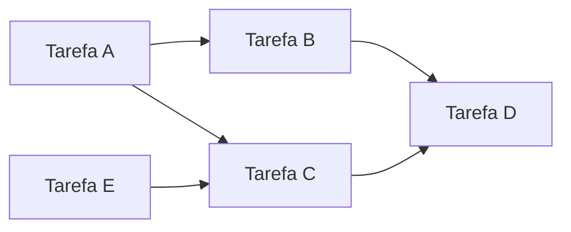
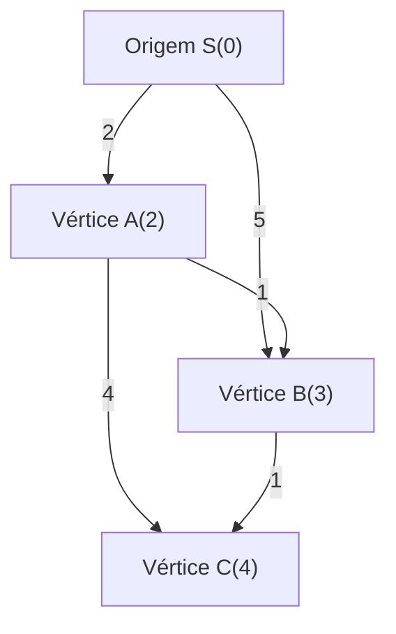
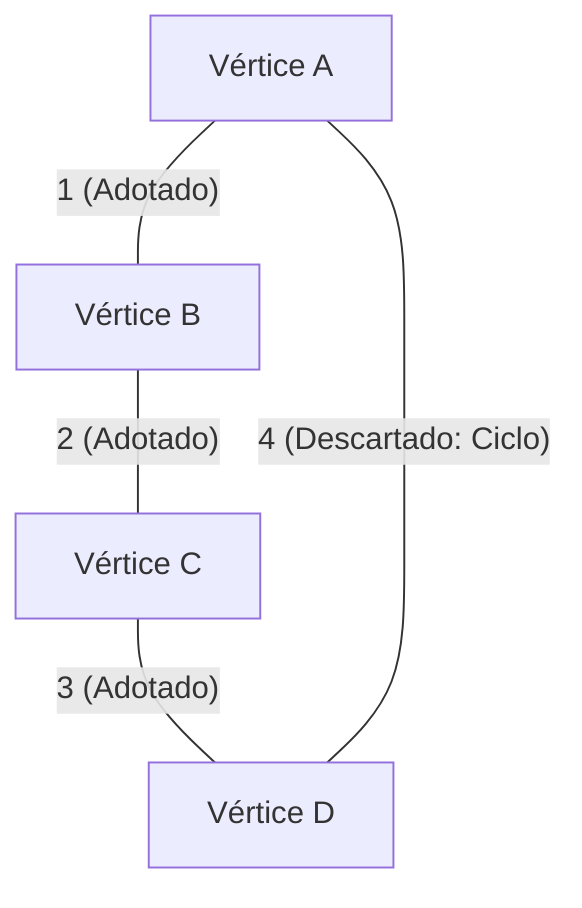
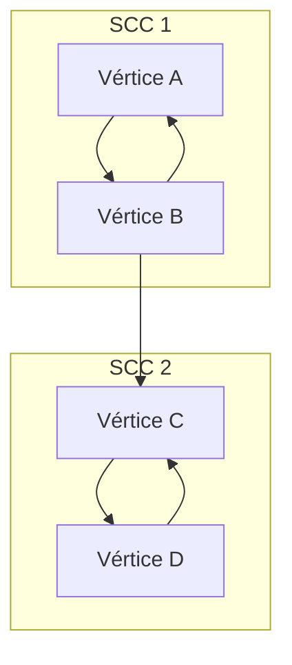

Na programação competitiva (maratona de programação), a teoria dos grafos e seus algoritmos são um dos temas mais importantes que não podem ser evitados. Muitos dos problemas apresentados em competições como AtCoder, Codeforces e TopCoder têm uma estrutura de grafo por trás deles. Servem como uma arma poderosa para abstrair e resolver problemas do mundo real, como o caminho mais curto de uma rede rodoviária, a minimização do custo de comunicação de uma rede e a resolução de dependências de tarefas.

Neste artigo, cobriremos de forma abrangente os principais algoritmos de grafos que aparecem frequentemente em programação competitiva (Ordenação Topológica, Algoritmo de Dijkstra, Algoritmo de Bellman-Ford, Algoritmo de Floyd-Warshall, Algoritmo de Kruskal, Algoritmo de Prim e Decomposição em Componentes Fortemente Conexos). Incluiremos o seu contexto teórico, a avaliação da complexidade computacional usando fórmulas matemáticas e exemplos de implementação altamente otimizados em C++ moderno (C++17/20). Este é um verdadeiro guia "completo", entregue em um grande volume de cerca de 10.000 caracteres!

---

## 1. Fundamentos e Restrições dos Algoritmos de Grafos

Antes de aprender os algoritmos, é importante entender as restrições gerais e as estimativas de complexidade computacional dos problemas de grafos em programação competitiva. Um grafo é representado pelo número de vértices $V$ (Vertices) e pelo número de arestas $E$ (Edges).

*   $O(V + E)$ : Esta é a complexidade computacional exigida para problemas com número de vértices $V, E \le 10^5 \sim 10^6$. Exemplos incluem a Busca em Profundidade (DFS) e a Busca em Largura (BFS).
*   $O((V + E) \log V)$ : Muito frequente em problemas com $V, E \le 10^5 \sim 2 \cdot 10^5$. Esta é a complexidade quando se usa uma fila de prioridade em algoritmos como o de Dijkstra ou de Prim.
*   $O(V^2)$ : Aceitável em grafos densos ($E \approx V^2$) onde $V \le 2000 \sim 3000$.
*   $O(V^3)$ : Problemas onde $V \le 400 \sim 500$. O algoritmo de Floyd-Warshall é um exemplo representativo.

Na programação competitiva, é comum usar a **Lista de Adjacência (Adjacency List)** como representação de grafo. Como uma matriz de adjacência consome $O(V^2)$ de memória, ela pode causar um erro de limite de memória (Memory Limit Exceeded) em problemas com um grande número de vértices.

---

## 2. Busca em Grafos e Ordenação

### Ordenação Topológica (Topological Sort)

A ordenação topológica é um algoritmo que alinha os vértices de um Grafo Direcionado Acíclico (DAG: Directed Acyclic Graph) em uma linha, de forma que todas as arestas direcionadas apontem de um vértice anterior para um vértice posterior. É usada ao resolver dependências de tarefas (por exemplo: a Tarefa B não pode começar até que a Tarefa A termine) ou para determinar a ordem de cálculo da Programação Dinâmica (DP) em um DAG.

A complexidade computacional é $O(V + E)$. Existem dois tipos de implementação: o Algoritmo de Kahn (baseado em BFS usando grau de entrada) e o baseado em DFS usando a ordem de pós-visita. Aqui, apresentaremos o Algoritmo de Kahn, que também permite obter facilmente a ordenação topológica lexicograficamente menor.



#### Exemplo de Implementação em C++ (Algoritmo de Kahn)

```cpp
#include <iostream>
#include <vector>
#include <queue>

using namespace std;

// Função para realizar a ordenação topológica
// Retorna um array vazio se houver um ciclo
vector<int> topological_sort(int V, const vector<vector<int>>& graph) {
    vector<int> in_degree(V, 0);
    // Cálculo do grau de entrada
    for (int u = 0; u < V; ++u) {
        for (int v : graph[u]) {
            in_degree[v]++;
        }
    }

    // Adiciona vértices com grau de entrada 0 à fila (se quiser a menor ordem lexicográfica, use priority_queue<int, vector<int>, greater<int>>)
    queue<int> q;
    for (int i = 0; i < V; ++i) {
        if (in_degree[i] == 0) {
            q.push(i);
        }
    }

    vector<int> res;
    while (!q.empty()) {
        int u = q.front();
        q.pop();
        res.push_back(u);

        // Diminui o grau de entrada dos vértices adjacentes
        for (int v : graph[u]) {
            in_degree[v]--;
            if (in_degree[v] == 0) {
                q.push(v);
            }
        }
    }

    // Verifica se o grafo contém um ciclo
    if (res.size() != V) {
        return {}; // Ciclo detectado
    }
    return res;
}
```

---

## 3. Problema do Caminho Mais Curto de Origem Única (SSSP: Single Source Shortest Path)

Este é o problema de encontrar o caminho mais curto de um ponto de origem para todos os outros vértices. O algoritmo aplicável difere dependendo se os pesos das arestas são não-negativos ou se existem pesos negativos.

### Algoritmo de Dijkstra (Dijkstra's Algorithm)

O algoritmo de Dijkstra é um algoritmo de caminho mais curto rápido aplicável quando **todos os pesos das arestas são não-negativos**. Baseia-se em uma abordagem gulosa: "fixar o vértice com a menor distância atual conhecida e atualizar (relaxar) a distância para os vértices adjacentes a partir desse vértice".

#### Fórmula de Relaxamento (Relaxation)
Sendo a origem $s$, a menor distância até o vértice $u$ como $d[u]$, e o peso da aresta $(u, v)$ como $w(u, v)$.
A fórmula de atualização é a seguinte:
$$ d[v] = \min(d[v], d[u] + w(u, v)) $$

Usando uma fila de prioridade (`std::priority_queue`), o vértice indeterminado com a menor distância pode ser extraído em $O(\log V)$, e a complexidade de tempo total é $O((V + E) \log V)$. A complexidade de espaço é $O(V + E)$.


Como na figura acima, o custo direto de S para B é 5, mas pode-se alcançá-lo com custo 3 passando por A. O algoritmo de Dijkstra realiza otimizações dessa maneira.

#### Exemplo de Implementação em C++

```cpp
#include <iostream>
#include <vector>
#include <queue>

using namespace std;

const long long INF = 1e18; // Um valor suficientemente grande

struct Edge {
    int to;
    long long weight;
};

// Algoritmo de Dijkstra
// Retorna o array de distâncias mais curtas da origem s para cada vértice
vector<long long> dijkstra(int V, const vector<vector<Edge>>& graph, int s) {
    vector<long long> dist(V, INF);
    dist[s] = 0;
    
    // Fila de prioridade para gerenciar {distância, vértice} (em ordem crescente de distância)
    using P = pair<long long, int>;
    priority_queue<P, vector<P>, greater<P>> pq;
    pq.push({0, s});
    
    while (!pq.empty()) {
        auto [d, u] = pq.top();
        pq.pop();
        
        // Pula se um caminho mais curto já foi encontrado (descarte de informações desatualizadas)
        if (dist[u] < d) continue;
        
        // Processo de relaxamento
        for (const auto& edge : graph[u]) {
            int v = edge.to;
            long long cost = edge.weight;
            if (dist[v] > dist[u] + cost) {
                dist[v] = dist[u] + cost;
                pq.push({dist[v], v});
            }
        }
    }
    return dist;
}
```
A declaração `if (dist[u] < d) continue;` é extremamente importante. No algoritmo de Dijkstra, o mesmo vértice pode ser inserido na fila várias vezes, mas essa verificação poda explorações desnecessárias.

### Algoritmo de Bellman-Ford (Bellman-Ford Algorithm)

Quando há valores negativos nos pesos das arestas, o algoritmo de Dijkstra não consegue derivar a resposta correta. É aqui que o algoritmo de Bellman-Ford se destaca. Repetindo o processo de relaxamento para todas as arestas $V - 1$ vezes, ele calcula corretamente o caminho mais curto mesmo que haja pesos negativos.

Se uma atualização ocorrer na $V$-ésima iteração, isso significa que existe um **ciclo negativo (Negative Cycle)**. Em programação competitiva, problemas que pedem para "detectar um ciclo negativo" também são frequentes, e o algoritmo de Bellman-Ford é excelente como algoritmo de detecção para isso.

A complexidade de tempo é $O(V \times E)$, sendo mais lenta que a do algoritmo de Dijkstra, por isso, atente-se que ele só pode ser aplicado a restrições em torno de $V \le 2000, E \le 5000$.

#### Exemplo de Implementação em C++

```cpp
#include <iostream>
#include <vector>

using namespace std;

const long long INF = 1e18;

struct Edge {
    int from;
    int to;
    long long weight;
};

// Algoritmo de Bellman-Ford
// Retorno: {array de distâncias mais curtas, se existe um ciclo negativo}
pair<vector<long long>, bool> bellman_ford(int V, const vector<Edge>& edges, int s) {
    vector<long long> dist(V, INF);
    dist[s] = 0;
    bool negative_cycle = false;

    // Faz um loop V vezes
    for (int i = 0; i < V; ++i) {
        bool updated = false;
        for (const auto& edge : edges) {
            if (dist[edge.from] != INF && dist[edge.to] > dist[edge.from] + edge.weight) {
                dist[edge.to] = dist[edge.from] + edge.weight;
                updated = true;
                // Se uma atualização ocorrer na V-ésima vez, existe um ciclo negativo
                if (i == V - 1) {
                    negative_cycle = true;
                }
            }
        }
        // Termina cedo se não houver atualizações (Otimização)
        if (!updated) break;
    }
    
    return {dist, negative_cycle};
}
```

---

## 4. Problema do Caminho Mais Curto de Todos os Pares (APSP: All-Pairs Shortest Path)

### Algoritmo de Floyd-Warshall (Floyd-Warshall Algorithm)

Este é um algoritmo que encontra as distâncias mais curtas entre todos os pares de vértices no grafo. É baseado em Programação Dinâmica (DP). É muito atraente porque o algoritmo é muito simples e extremamente fácil de implementar.

A equação de transição de estado é a seguinte. O mais curto entre o caminho que passa pelo vértice $k$ e o caminho que não passa é adotado.
$$ d[i][j] = \min(d[i][j], d[i][k] + d[k][j]) $$

Devido ao uso de três loops aninhados, a complexidade de tempo é $O(V^3)$ e a complexidade de espaço é $O(V^2)$. Se o número de vértices for cerca de $V \le 400$, ele cumprirá o limite de tempo de execução (geralmente 2 segundos).

#### Exemplo de Implementação em C++

```cpp
#include <iostream>
#include <vector>
#include <algorithm>

using namespace std;

const long long INF = 1e18;

// Algoritmo de Floyd-Warshall
// dist[i][j] é inicialmente o peso da aresta de i para j (INF se não houver aresta, 0 se i==j)
void floyd_warshall(int V, vector<vector<long long>>& dist) {
    // Vértice intermediário k
    for (int k = 0; k < V; ++k) {
        // Origem i
        for (int i = 0; i < V; ++i) {
            // Destino j
            for (int j = 0; j < V; ++j) {
                // Verifica se é INF para evitar overflow
                if (dist[i][k] != INF && dist[k][j] != INF) {
                    dist[i][j] = min(dist[i][j], dist[i][k] + dist[k][j]);
                }
            }
        }
    }
}
```

O algoritmo de Floyd-Warshall também pode detectar ciclos negativos. Após o término do loop, se houver pelo menos um vértice `i` tal que `dist[i][i] < 0`, então o grafo contém um ciclo negativo.

---

## 5. Árvore Geradora Mínima (MST: Minimum Spanning Tree)

Em um grafo não direcionado conectado, a árvore (subgrafo que não contém ciclos) que conecta todos os vértices e tem a menor soma dos pesos das arestas é chamada de **Árvore Geradora Mínima (MST)**. É diretamente questionada em problemas como a minimização do custo de implantação de uma rede.

### Algoritmo de Kruskal (Kruskal's Algorithm)

É um algoritmo guloso que classifica todas as arestas em ordem crescente de peso e as adota em ordem, tomando cuidado para não criar ciclos. Para a verificação de ciclos, o processamento pode ser feito de forma rápida usando a **Estrutura de Dados de Conjuntos Disjuntos (Union-Find, Disjoint Set)**.

A complexidade de tempo é $O(E \log E)$, pois a classificação das arestas se torna o gargalo. Este é o algoritmo de construção de MST mais usado em programação competitiva.



#### Exemplo de Implementação em C++

```cpp
#include <iostream>
#include <vector>
#include <algorithm>

using namespace std;

// Union-Find (Estrutura de Dados de Conjuntos Disjuntos)
struct UnionFind {
    vector<int> parent, rank, size;
    UnionFind(int n) : parent(n), rank(n, 0), size(n, 1) {
        for (int i = 0; i < n; i++) parent[i] = i;
    }
    int find(int x) {
        if (parent[x] == x) return x;
        // Compressão de caminho
        return parent[x] = find(parent[x]);
    }
    bool unite(int x, int y) {
        int root_x = find(x);
        int root_y = find(y);
        if (root_x == root_y) return false;
        
        // União por rank
        if (rank[root_x] < rank[root_y]) swap(root_x, root_y);
        parent[root_y] = root_x;
        if (rank[root_x] == rank[root_y]) rank[root_x]++;
        size[root_x] += size[root_y];
        return true;
    }
    bool same(int x, int y) { return find(x) == find(y); }
};

struct Edge {
    int u, v;
    long long weight;
    // Função de comparação para ordenação
    bool operator<(const Edge& other) const {
        return weight < other.weight;
    }
};

// Algoritmo de Kruskal
long long kruskal(int V, vector<Edge>& edges) {
    // Ordena as arestas em ordem crescente de peso
    sort(edges.begin(), edges.end());
    
    UnionFind uf(V);
    long long mst_cost = 0;
    int edge_count = 0;
    
    for (const auto& edge : edges) {
        if (uf.unite(edge.u, edge.v)) {
            mst_cost += edge.weight;
            edge_count++;
            // Termina quando V-1 arestas forem selecionadas (Otimização)
            if (edge_count == V - 1) break;
        }
    }
    return mst_cost;
}
```

### Algoritmo de Prim (Prim's Algorithm)

Ele segue uma abordagem muito semelhante ao algoritmo de Dijkstra. Começando em um vértice, ele escolhe sucessivamente a aresta de menor peso conectada diretamente da árvore já formada para aumentar a árvore.

A complexidade computacional ao usar uma fila de prioridade é $O((V + E) \log V)$. No caso de grafos densos (grafos com muitas arestas), a implementação baseada em array do algoritmo de Prim com $O(V^2)$ pode ser mais rápida que a do algoritmo de Kruskal.

#### Exemplo de Implementação em C++

```cpp
#include <iostream>
#include <vector>
#include <queue>

using namespace std;

struct Edge {
    int to;
    long long weight;
};

// Algoritmo de Prim
long long prim(int V, const vector<vector<Edge>>& graph) {
    vector<bool> used(V, false);
    // {peso, vértice}
    using P = pair<long long, int>;
    priority_queue<P, vector<P>, greater<P>> pq;
    
    long long mst_cost = 0;
    // O vértice 0 é o ponto de partida
    pq.push({0, 0});
    
    while (!pq.empty()) {
        auto [cost, u] = pq.top();
        pq.pop();
        
        if (used[u]) continue;
        used[u] = true;
        mst_cost += cost;
        
        for (const auto& edge : graph[u]) {
            if (!used[edge.to]) {
                pq.push({edge.weight, edge.to});
            }
        }
    }
    return mst_cost;
}
```

---

## 6. Avançado: Decomposição em Componentes Fortemente Conexos (SCC: Strongly Connected Components)

Em um grafo direcionado, um conjunto de vértices "que podem alcançar uns aos outros" é chamado de Componente Fortemente Conexo (SCC). Se os vértices de qualquer grafo direcionado forem agrupados por componentes fortemente conexos, o todo se tornará um DAG (Grafo Direcionado Acíclico). A isso se dá o nome de **Decomposição em Componentes Fortemente Conexos**. É um pré-processamento muito importante para simplificar a estrutura do grafo e tornar os problemas mais fáceis de resolver.

Em programação competitiva, é frequentemente usado ao resolver problemas 2-SAT ou ao realizar DP condensando um grafo com ciclos em um DAG.

### Algoritmo de Kosaraju (Kosaraju's Algorithm)

O algoritmo de Kosaraju é um método belo e eficiente que pode construir as SCCs simplesmente realizando uma DFS (Busca em Profundidade) duas vezes. A complexidade computacional é $O(V + E)$ operando em tempo linear.

Passos do algoritmo:
1. Realize uma DFS no grafo original e registre os vértices em um array na ordem de pós-visita (post-order).
2. Crie um **grafo reverso** onde a direção de todas as arestas seja invertida.
3. Começando pelo **fim** do array gravado no passo 1 (ou seja, começando do último na ordem de pós-visita), realize uma DFS a partir dos vértices não visitados no grafo reverso. O conjunto de vértices alcançáveis nesta única DFS formará uma SCC.



#### Exemplo de Implementação em C++

```cpp
#include <iostream>
#include <vector>
#include <algorithm>

using namespace std;

struct SCC {
    int V;
    vector<vector<int>> graph, rev_graph;
    vector<int> order, comp;
    vector<bool> used;

    SCC(int n) : V(n), graph(n), rev_graph(n), comp(n, -1), used(n, false) {}

    void add_edge(int from, int to) {
        graph[from].push_back(to);
        rev_graph[to].push_back(from);
    }

    // Primeira DFS (Registro da ordem de pós-visita)
    void dfs1(int u) {
        used[u] = true;
        for (int v : graph[u]) {
            if (!used[v]) dfs1(v);
        }
        order.push_back(u);
    }

    // Segunda DFS (Busca no grafo reverso)
    void dfs2(int u, int id) {
        used[u] = true;
        comp[u] = id;
        for (int v : rev_graph[u]) {
            if (!used[v]) dfs2(v, id);
        }
    }

    // Processo de construção de SCC. Retorna o número de grupos SCC
    int build() {
        // Primeira DFS
        for (int i = 0; i < V; ++i) {
            if (!used[i]) dfs1(i);
        }

        fill(used.begin(), used.end(), false);
        int group_id = 0;

        // Segunda DFS (ordem reversa de order)
        for (int i = V - 1; i >= 0; --i) {
            int u = order[i];
            if (!used[u]) {
                dfs2(u, group_id++);
            }
        }
        return group_id;
    }
};
```

O array `comp` armazenará o ID da SCC à qual cada vértice pertence. Este ID tem uma propriedade muito útil: ele é atribuído na ordem do topological sort. Em outras palavras, observando os valores de `comp`, você pode entender imediatamente os relacionamentos de dependência depois de condensar o grafo em um DAG.

---

## 7. Resumo e Conselhos de Estudo

Neste artigo, revisamos os algoritmos de grafos mais comuns que aparecem em programação competitiva.
As dicas para melhorar na resolução de problemas de grafos são **"implementar repetidamente até se tornar um hábito"** e **"treinar para pensar em qual grafo este problema pode ser reduzido (o que são os vértices, o que são as arestas)"**.

1. Primeiro, seja capaz de escrever DFS / BFS de forma rápida e sem erros.
2. Em seguida, seja capaz de escrever o algoritmo de Dijkstra e o algoritmo de Kruskal de cor (essencial nas classificações Marrom a Verde do AtCoder).
3. Por fim, expanda seu repertório com algoritmos como Bellman-Ford, Floyd-Warshall, Ordenação Topológica, SCC, etc. (uma arma nas classificações Azul claro a Azul do AtCoder).

Recomendamos vivamente que os transforme numa biblioteca como snippets de código (salvando-os numa ferramenta de snippets ou no seu próprio repositório GitHub) para que possa chamá-los sem hesitação durante um concurso real.

Os algoritmos de grafos na programação competitiva são o campo onde se pode sentir de perto a beleza e o poder dos algoritmos. Certifique-se de copiar os códigos deste artigo à mão e tentar resolver problemas passados nos juízes online (online judges)!
