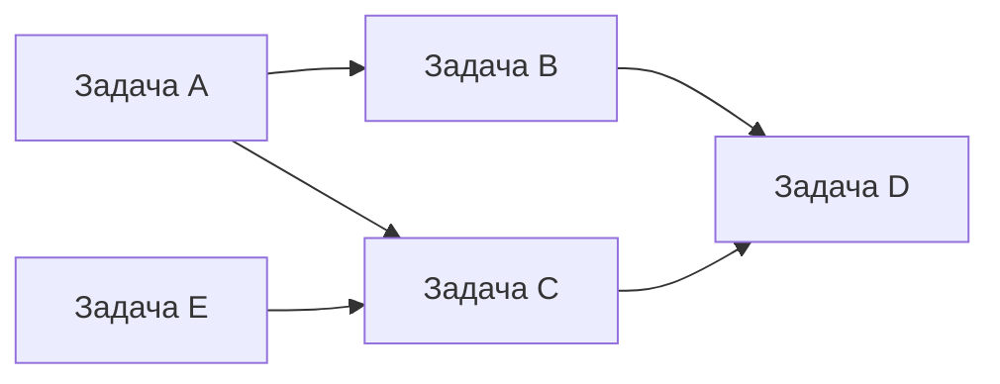
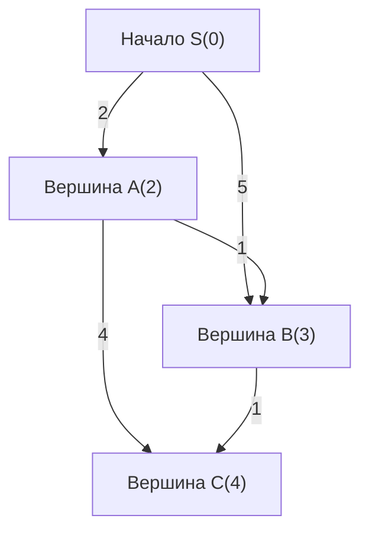
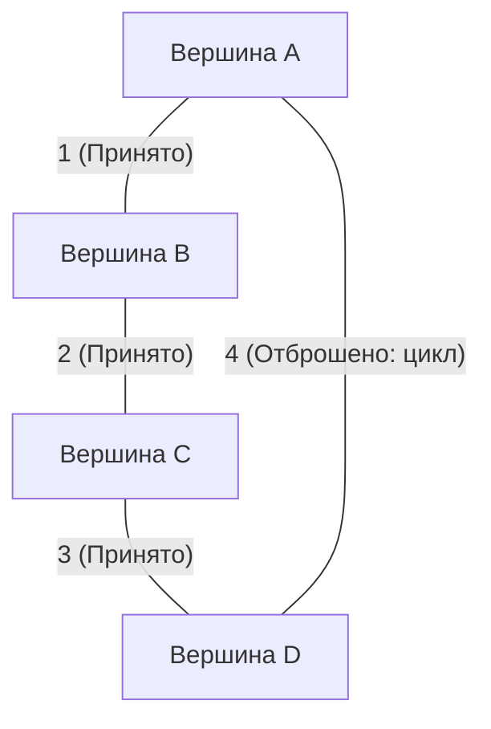
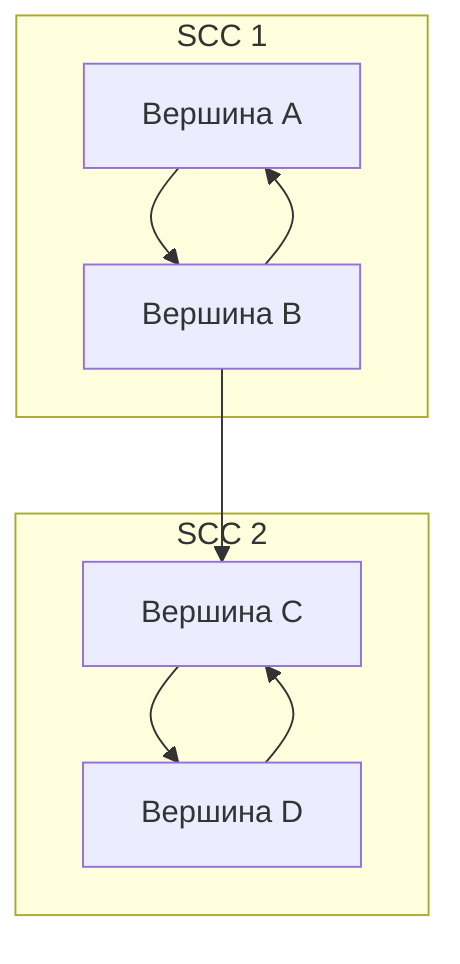

В спортивном программировании теория графов и графовые алгоритмы являются одной из важнейших тем, которую нельзя обойти стороной. Многие задачи, предлагаемые на соревнованиях, таких как AtCoder, Codeforces и TopCoder, имеют в своей основе графовую структуру. Кратчайшие пути в дорожной сети, минимизация стоимости связи в сети, разрешение зависимостей задач — все это мощные инструменты для абстрагирования и решения проблем реального мира.

В этой статье мы полностью охватим основные графовые алгоритмы, часто встречающиеся в спортивном программировании (топологическая сортировка, алгоритм Дейкстры, алгоритм Беллмана-Форда, алгоритм Флойда-Уоршелла, алгоритм Краскала, алгоритм Прима, выделение компонент сильной связности), включая их теоретические основы, оценку вычислительной сложности с использованием формул, а также примеры высокооптимизированной реализации на современном C++ (C++17/20). Это поистине «полное руководство», представленное в виде объемного материала из примерно 10 000 символов.

---

## 1. Основы графовых алгоритмов и ограничения

Перед изучением алгоритмов важно понять общие ограничения и ориентиры вычислительной сложности для графовых задач в спортивном программировании. Граф представляется количеством вершин $V$ (Vertices) и количеством ребер $E$ (Edges).

*   $O(V + E)$ : Требуемая сложность для задач с количеством вершин $V, E \le 10^5 \sim 10^6$. Сюда относятся поиск в глубину (DFS) и поиск в ширину (BFS).
*   $O((V + E) \log V)$ : Часто встречается в задачах с $V, E \le 10^5 \sim 2 \cdot 10^5$. Это сложность алгоритмов Дейкстры или Прима при использовании очереди с приоритетом.
*   $O(V^2)$ : Допустимо для плотных графов ($E \approx V^2$) с $V \le 2000 \sim 3000$.
*   $O(V^3)$ : Задачи с $V \le 400 \sim 500$. Типичным примером является алгоритм Флойда-Уоршелла.

В спортивном программировании в качестве представления графа обычно используется **список смежности (Adjacency List)**. Матрица смежности потребляет $O(V^2)$ памяти, поэтому в задачах с большим количеством вершин это приведет к превышению лимита памяти (Memory Limit Exceeded).

---

## 2. Поиск и упорядочение в графах

### Топологическая сортировка (Topological Sort)

Топологическая сортировка — это алгоритм упорядочения вершин ориентированного ациклического графа (DAG: Directed Acyclic Graph) в одну линию таким образом, чтобы все ориентированные ребра были направлены от предыдущей вершины к последующей. Она используется для разрешения зависимостей задач (например, задача B не может быть начата, пока не будет завершена задача A) или для определения порядка вычислений в динамическом программировании (DP) на DAG.

Вычислительная сложность составляет $O(V + E)$. Существуют две реализации: алгоритм Кана (на основе BFS с использованием входящих степеней) и алгоритм на основе DFS с использованием порядка выхода. Здесь мы представим алгоритм Кана, который также позволяет легко найти лексикографически минимальную топологическую сортировку.



#### Пример реализации на C++ (Алгоритм Кана)

```cpp
#include <iostream>
#include <vector>
#include <queue>

using namespace std;

// Функция для выполнения топологической сортировки
// Возвращает пустой массив, если существует цикл
vector<int> topological_sort(int V, const vector<vector<int>>& graph) {
    vector<int> in_degree(V, 0);
    // Вычисление входящих степеней
    for (int u = 0; u < V; ++u) {
        for (int v : graph[u]) {
            in_degree[v]++;
        }
    }

    // Добавление вершин со входящей степенью 0 в очередь (если нужен лексикографически минимальный порядок, используйте priority_queue<int, vector<int>, greater<int>>)
    queue<int> q;
    for (int i = 0; i < V; ++i) {
        if (in_degree[i] == 0) {
            q.push(i);
        }
    }

    vector<int> res;
    while (!q.empty()) {
        int u = q.front();
        q.pop();
        res.push_back(u);

        // Уменьшение входящей степени смежных вершин
        for (int v : graph[u]) {
            in_degree[v]--;
            if (in_degree[v] == 0) {
                q.push(v);
            }
        }
    }

    // Проверка наличия цикла в графе
    if (res.size() != V) {
        return {}; // Есть цикл
    }
    return res;
}
```

---

## 3. Задача о кратчайших путях из одной вершины (SSSP: Single Source Shortest Path)

Это задача нахождения кратчайших путей от одной начальной вершины ко всем остальным вершинам. Применимые алгоритмы различаются в зависимости от того, являются ли веса ребер неотрицательными или существуют ли отрицательные веса.

### Алгоритм Дейкстры (Dijkstra's Algorithm)

Алгоритм Дейкстры — это быстрый алгоритм поиска кратчайшего пути, применимый, когда **веса всех ребер неотрицательны**. Он основан на жадном подходе: «зафиксировать вершину с наименьшим известным на данный момент кратчайшим расстоянием и обновить расстояния до соседних с ней вершин (релаксация)».

#### Формула релаксации (Relaxation)
Пусть $s$ — начальная вершина, $d[u]$ — кратчайшее расстояние до вершины $u$, а $w(u, v)$ — вес ребра $(u, v)$.
Формула обновления выглядит следующим образом:
$$ d[v] = \min(d[v], d[u] + w(u, v)) $$

При использовании очереди с приоритетом (`std::priority_queue`) можно извлекать непосещенную вершину с минимальным расстоянием за $O(\log V)$, и общая временная сложность составляет $O((V + E) \log V)$. Пространственная сложность составляет $O(V + E)$.


Как показано на рисунке выше, стоимость прямого пути из S в B равна 5, но через вершину A можно добраться со стоимостью 3. Алгоритм Дейкстры выполняет оптимизацию именно таким образом.

#### Пример реализации на C++

```cpp
#include <iostream>
#include <vector>
#include <queue>

using namespace std;

const long long INF = 1e18; // Достаточно большое значение

struct Edge {
    int to;
    long long weight;
};

// Алгоритм Дейкстры
// Возвращает массив кратчайших расстояний от начальной вершины s до каждой вершины
vector<long long> dijkstra(int V, const vector<vector<Edge>>& graph, int s) {
    vector<long long> dist(V, INF);
    dist[s] = 0;
    
    // Очередь с приоритетом для хранения {расстояние, вершина} (в порядке возрастания расстояния)
    using P = pair<long long, int>;
    priority_queue<P, vector<P>, greater<P>> pq;
    pq.push({0, s});
    
    while (!pq.empty()) {
        auto [d, u] = pq.top();
        pq.pop();
        
        // Пропуск, если уже найден более короткий путь (отбрасывание устаревшей информации)
        if (dist[u] < d) continue;
        
        // Релаксация
        for (const auto& edge : graph[u]) {
            int v = edge.to;
            long long cost = edge.weight;
            if (dist[v] > dist[u] + cost) {
                dist[v] = dist[u] + cost;
                pq.push({dist[v], v});
            }
        }
    }
    return dist;
}
```
Строка `if (dist[u] < d) continue;` чрезвычайно важна. В алгоритме Дейкстры одна и та же вершина может быть добавлена в очередь несколько раз, и эта проверка позволяет отсечь лишние вычисления.

### Алгоритм Беллмана-Форда (Bellman-Ford Algorithm)

Если веса ребер содержат отрицательные значения, алгоритм Дейкстры не сможет дать правильный ответ. В таких случаях на помощь приходит алгоритм Беллмана-Форда. Путем повторения процесса релаксации для всех ребер $V - 1$ раз он корректно вычисляет кратчайшие пути даже при наличии отрицательных весов.

Если обновление происходит и на $V$-й итерации, это означает, что существует **отрицательный цикл (Negative Cycle)**. В спортивном программировании часто встречаются задачи типа «найдите отрицательный цикл», и алгоритм Беллмана-Форда отлично подходит в качестве алгоритма для его обнаружения.

Обратите внимание, что временная сложность составляет $O(V \times E)$, что медленнее, чем у алгоритма Дейкстры, поэтому он применим только для ограничений порядка $V \le 2000, E \le 5000$.

#### Пример реализации на C++

```cpp
#include <iostream>
#include <vector>

using namespace std;

const long long INF = 1e18;

struct Edge {
    int from;
    int to;
    long long weight;
};

// Алгоритм Беллмана-Форда
// Возвращаемое значение: {массив кратчайших расстояний, существует ли отрицательный цикл}
pair<vector<long long>, bool> bellman_ford(int V, const vector<Edge>& edges, int s) {
    vector<long long> dist(V, INF);
    dist[s] = 0;
    bool negative_cycle = false;

    // Цикл выполняется V раз
    for (int i = 0; i < V; ++i) {
        bool updated = false;
        for (const auto& edge : edges) {
            if (dist[edge.from] != INF && dist[edge.to] > dist[edge.from] + edge.weight) {
                dist[edge.to] = dist[edge.from] + edge.weight;
                updated = true;
                // Если обновление произошло на V-й итерации, значит существует отрицательный цикл
                if (i == V - 1) {
                    negative_cycle = true;
                }
            }
        }
        // Если обновлений не было, досрочно завершаем (оптимизация)
        if (!updated) break;
    }
    
    return {dist, negative_cycle};
}
```

---

## 4. Задача о кратчайших путях между всеми парами вершин (APSP: All-Pairs Shortest Path)

### Алгоритм Флойда-Уоршелла (Floyd-Warshall Algorithm)

Это алгоритм для нахождения кратчайших расстояний между всеми парами вершин в графе. Он основан на динамическом программировании (DP). Алгоритм очень лаконичен, а его реализация чрезвычайно проста, что делает его весьма привлекательным.

Уравнение перехода состояний выглядит следующим образом. Выбирается более короткий путь между путем, проходящим через вершину $k$, и путем, не проходящим через нее.
$$ d[i][j] = \min(d[i][j], d[i][k] + d[k][j]) $$

Из-за использования тройного цикла временная сложность составляет $O(V^3)$, а пространственная сложность — $O(V^2)$. Если количество вершин составляет около $V \le 400$, алгоритм уложится в ограничение по времени выполнения (обычно 2 секунды).

#### Пример реализации на C++

```cpp
#include <iostream>
#include <vector>
#include <algorithm>

using namespace std;

const long long INF = 1e18;

// Алгоритм Флойда-Уоршелла
// dist[i][j] изначально содержит вес ребра из i в j (если ребра нет, то INF, если i==j, то 0)
void floyd_warshall(int V, vector<vector<long long>>& dist) {
    // Промежуточная вершина k
    for (int k = 0; k < V; ++k) {
        // Начальная вершина i
        for (int i = 0; i < V; ++i) {
            // Конечная вершина j
            for (int j = 0; j < V; ++j) {
                // Во избежание переполнения проверяем, не равно ли значение INF
                if (dist[i][k] != INF && dist[k][j] != INF) {
                    dist[i][j] = min(dist[i][j], dist[i][k] + dist[k][j]);
                }
            }
        }
    }
}
```

С помощью алгоритма Флойда-Уоршелла также можно обнаружить отрицательные циклы. Если после завершения цикла существует хотя бы одна вершина `i`, для которой выполняется условие `dist[i][i] < 0`, то граф содержит отрицательный цикл.

---

## 5. Минимальное остовное дерево (MST: Minimum Spanning Tree)

В связном неориентированном графе дерево (подграф, не содержащий циклов), соединяющее все вершины, с минимальной суммой весов ребер называется **минимальным остовным деревом (MST)**. Это часто встречается в задачах на минимизацию затрат на прокладку сетей.

### Алгоритм Краскала (Kruskal's Algorithm)

Это жадный алгоритм, который сортирует все ребра в порядке возрастания их весов и поочередно добавляет их, следя за тем, чтобы не образовывались циклы. Для проверки на наличие циклов можно использовать **структуру данных непересекающихся множеств (Union-Find, Disjoint Set)**, что позволяет выполнять обработку очень быстро.

Временная сложность определяется сортировкой ребер и составляет $O(E \log E)$. Это наиболее часто используемый алгоритм построения MST в спортивном программировании.



#### Пример реализации на C++

```cpp
#include <iostream>
#include <vector>
#include <algorithm>

using namespace std;

// Union-Find (Структура данных непересекающихся множеств)
struct UnionFind {
    vector<int> parent, rank, size;
    UnionFind(int n) : parent(n), rank(n, 0), size(n, 1) {
        for (int i = 0; i < n; i++) parent[i] = i;
    }
    int find(int x) {
        if (parent[x] == x) return x;
        // Сжатие путей
        return parent[x] = find(parent[x]);
    }
    bool unite(int x, int y) {
        int root_x = find(x);
        int root_y = find(y);
        if (root_x == root_y) return false;
        
        // Слияние по рангу
        if (rank[root_x] < rank[root_y]) swap(root_x, root_y);
        parent[root_y] = root_x;
        if (rank[root_x] == rank[root_y]) rank[root_x]++;
        size[root_x] += size[root_y];
        return true;
    }
    bool same(int x, int y) { return find(x) == find(y); }
};

struct Edge {
    int u, v;
    long long weight;
    // Функция сравнения для сортировки
    bool operator<(const Edge& other) const {
        return weight < other.weight;
    }
};

// Алгоритм Краскала
long long kruskal(int V, vector<Edge>& edges) {
    // Сортировка ребер в порядке возрастания веса
    sort(edges.begin(), edges.end());
    
    UnionFind uf(V);
    long long mst_cost = 0;
    int edge_count = 0;
    
    for (const auto& edge : edges) {
        if (uf.unite(edge.u, edge.v)) {
            mst_cost += edge.weight;
            edge_count++;
            // Завершение, когда выбрано V-1 ребер (оптимизация)
            if (edge_count == V - 1) break;
        }
    }
    return mst_cost;
}
```

### Алгоритм Прима (Prim's Algorithm)

Он использует подход, очень похожий на алгоритм Дейкстры. Начиная с одной вершины, он постепенно наращивает дерево, выбирая из ребер, непосредственно связанных с уже построенным деревом, то, которое имеет наименьший вес.

При использовании очереди с приоритетом вычислительная сложность составляет $O((V + E) \log V)$. Для плотных графов (с большим количеством ребер) реализация алгоритма Прима на основе массивов за $O(V^2)$ может быть быстрее, чем алгоритм Краскала.

#### Пример реализации на C++

```cpp
#include <iostream>
#include <vector>
#include <queue>

using namespace std;

struct Edge {
    int to;
    long long weight;
};

// Алгоритм Прима
long long prim(int V, const vector<vector<Edge>>& graph) {
    vector<bool> used(V, false);
    // {вес, вершина}
    using P = pair<long long, int>;
    priority_queue<P, vector<P>, greater<P>> pq;
    
    long long mst_cost = 0;
    // Вершина 0 является начальной
    pq.push({0, 0});
    
    while (!pq.empty()) {
        auto [cost, u] = pq.top();
        pq.pop();
        
        if (used[u]) continue;
        used[u] = true;
        mst_cost += cost;
        
        for (const auto& edge : graph[u]) {
            if (!used[edge.to]) {
                pq.push({edge.weight, edge.to});
            }
        }
    }
    return mst_cost;
}
```

---

## 6. Продвинутый уровень: Выделение компонент сильной связности (SCC: Strongly Connected Components)

В ориентированном графе «множество вершин, между которыми существуют взаимные пути», называется компонентой сильной связности (SCC). Если сгруппировать любой ориентированный граф по компонентам сильной связности, то в целом он обязательно станет DAG (ориентированным ациклическим графом). Это называется **выделением компонент сильной связности**. Это очень важная предварительная обработка для упрощения структуры графа и облегчения решения задач.

В спортивном программировании он часто используется для решения задач 2-SAT или в ситуациях, когда граф с циклами стягивается в DAG для выполнения DP.

### Алгоритм Косарайю (Kosaraju's Algorithm)

Алгоритм Косарайю — это красивый и эффективный метод построения SCC всего за два прохода DFS (поиска в глубину). Его вычислительная сложность линейна и составляет $O(V + E)$.

Шаги алгоритма:
1. Выполнить DFS на исходном графе и записать вершины в массив в порядке выхода (post-order).
2. Создать **обратный граф**, в котором направление всех ребер изменено на противоположное.
3. В порядке **с конца** записанного на шаге 1 массива (в порядке убывания времени выхода) выполнить DFS на обратном графе, начиная с непосещенных вершин. Множество вершин, достигнутых в ходе одного такого DFS, образует одну SCC.



#### Пример реализации на C++

```cpp
#include <iostream>
#include <vector>
#include <algorithm>

using namespace std;

struct SCC {
    int V;
    vector<vector<int>> graph, rev_graph;
    vector<int> order, comp;
    vector<bool> used;

    SCC(int n) : V(n), graph(n), rev_graph(n), comp(n, -1), used(n, false) {}

    void add_edge(int from, int to) {
        graph[from].push_back(to);
        rev_graph[to].push_back(from);
    }

    // Первый DFS (запись порядка выхода)
    void dfs1(int u) {
        used[u] = true;
        for (int v : graph[u]) {
            if (!used[v]) dfs1(v);
        }
        order.push_back(u);
    }

    // Второй DFS (поиск в обратном графе)
    void dfs2(int u, int id) {
        used[u] = true;
        comp[u] = id;
        for (int v : rev_graph[u]) {
            if (!used[v]) dfs2(v, id);
        }
    }

    // Процесс построения SCC. Возвращает количество групп SCC
    int build() {
        // Первый DFS
        for (int i = 0; i < V; ++i) {
            if (!used[i]) dfs1(i);
        }

        fill(used.begin(), used.end(), false);
        int group_id = 0;

        // Второй DFS (в обратном порядке order)
        for (int i = V - 1; i >= 0; --i) {
            int u = order[i];
            if (!used[u]) {
                dfs2(u, group_id++);
            }
        }
        return group_id;
    }
};
```

Массив `comp` хранит ID SCC, к которой принадлежит каждая вершина. Этот ID обладает очень удобным свойством — фактически он назначается в порядке топологической сортировки. Другими словами, посмотрев на значения `comp`, можно сразу понять зависимости после стягивания в DAG.

---

## 7. Заключение и советы по изучению

В этой статье мы сделали обзор графовых алгоритмов, часто встречающихся в спортивном программировании.
Ключ к совершенствованию в решении графовых задач — это **«реализовывать их снова и снова, пока это не станет привычкой»** и **«тренироваться думать о том, к какому графу можно свести данную задачу (что является вершинами, а что — ребрами)»**.

1. Сначала научитесь быстро и безошибочно писать DFS / BFS.
2. Затем научитесь писать алгоритмы Дейкстры и Краскала по памяти (обязательно для коричнево-зеленого рейтинга AtCoder).
3. И, наконец, расширьте свой арсенал за счет алгоритмов Беллмана-Форда, Флойда-Уоршелла, топологической сортировки, SCC и др. (это станет вашим оружием для голубо-синего рейтинга AtCoder).

Настоятельно рекомендуем оформить их в виде библиотеки сниппетов кода (сохранить в инструментах для сниппетов или в вашем репозитории на GitHub), чтобы быть готовым применить их без колебаний во время самих соревнований.

Графовые алгоритмы в спортивном программировании — это область, где вы можете в полной мере ощутить красоту и мощь алгоритмов. Обязательно перепишите код из этой статьи и попробуйте решить прошлые задачи в онлайн-судьях!
