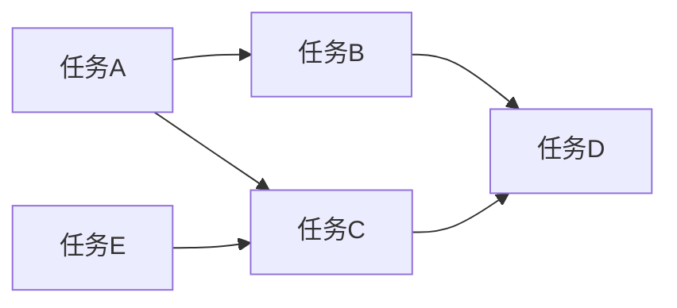
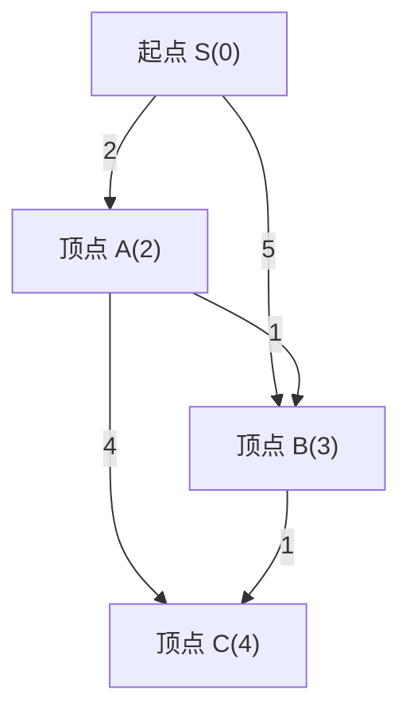
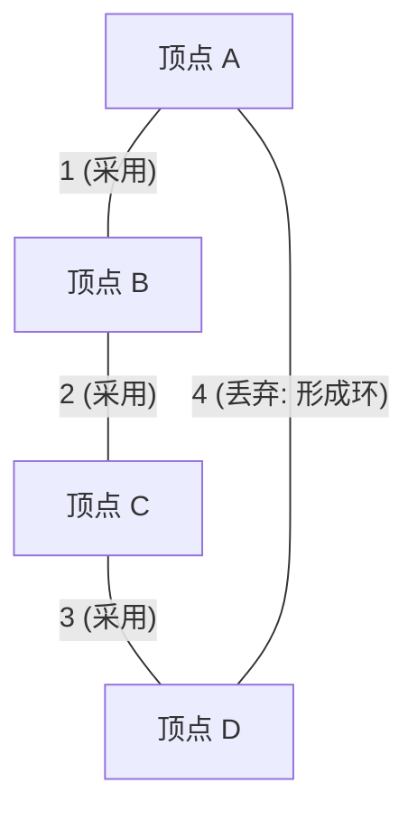
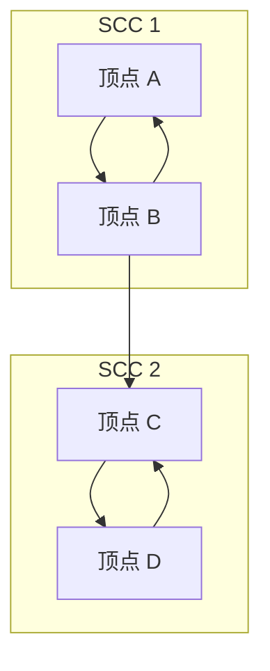

在竞技编程（竞程）中，图论及其算法是不可避免的最重要主题之一。在AtCoder、Codeforces、TopCoder等比赛中，许多题目背后都具有图的结构。无论是道路网的最短路径、网络通信成本的最小化，还是任务依赖关系的解除，它都是将现实世界的问题抽象化并加以解决的强大武器。

本文将针对竞技编程中频繁出现的主要图算法（拓扑排序、Dijkstra算法、Bellman-Ford算法、Floyd-Warshall算法、Kruskal算法、Prim算法、强连通分量分解），从其理论背景、使用数学公式进行的时间复杂度评估，以及使用现代C++ (C++17/20) 编写的高度优化的实现示例，进行全面而彻底的解析。为您带来约10,000字的超大容量，名副其实的“完全攻略”指南。

---

## 1. 图算法的基础与限制

在学习算法之前，掌握竞程中图问题的常见限制和时间复杂度的基准是非常重要的。图由顶点数 $V$ (Vertices) 和边数 $E$ (Edges) 来表示。

*   $O(V + E)$ : 顶点数 $V, E \le 10^5 \sim 10^6$ 的题目所要求的时间复杂度。深度优先搜索 (DFS) 和广度优先搜索 (BFS) 属于此类。
*   $O((V + E) \log V)$ : 在 $V, E \le 10^5 \sim 2 \cdot 10^5$ 的题目中频繁出现。是Dijkstra算法和Prim算法等使用优先队列时的时间复杂度。
*   $O(V^2)$ : 允许在 $V \le 2000 \sim 3000$ 的稠密图（$E \approx V^2$）中使用。
*   $O(V^3)$ : $V \le 400 \sim 500$ 的题目。Floyd-Warshall算法等是其代表。

在竞技编程中，通常使用**邻接表 (Adjacency List)** 来表示图。由于邻接矩阵会消耗 $O(V^2)$ 的内存，在顶点数较多的题目中会触发内存限制超出 (Memory Limit Exceeded)。

---

## 2. 图的遍历与排序

### 拓扑排序 (Topological Sort)

拓扑排序是一种将有向无环图 (DAG: Directed Acyclic Graph) 的顶点排成一列，使得所有有向边都从前面的顶点指向后面的顶点的算法。在解除任务依赖关系（例如：任务A不结束，任务B就无法开始），以及决定DAG上的动态规划 (DP) 的计算顺序时会用到。

时间复杂度为 $O(V + E)$。有Kahn算法（基于入度的BFS方式）和基于后序遍历的DFS方式这两种实现方法，这里我们将介绍不仅易于实现，还能轻松求出字典序最小拓扑排序的Kahn算法。



#### C++ 实现示例 (Kahn算法)

```cpp
#include <iostream>
#include <vector>
#include <queue>

using namespace std;

// 进行拓扑排序的函数
// 如果存在环则返回空数组
vector<int> topological_sort(int V, const vector<vector<int>>& graph) {
    vector<int> in_degree(V, 0);
    // 计算入度
    for (int u = 0; u < V; ++u) {
        for (int v : graph[u]) {
            in_degree[v]++;
        }
    }

    // 将入度为0的顶点加入队列 (如果需要字典序最小，请使用 priority_queue<int, vector<int>, greater<int>>)
    queue<int> q;
    for (int i = 0; i < V; ++i) {
        if (in_degree[i] == 0) {
            q.push(i);
        }
    }

    vector<int> res;
    while (!q.empty()) {
        int u = q.front();
        q.pop();
        res.push_back(u);

        // 减少相邻顶点的入度
        for (int v : graph[u]) {
            in_degree[v]--;
            if (in_degree[v] == 0) {
                q.push(v);
            }
        }
    }

    // 检查图是否包含环
    if (res.size() != V) {
        return {}; // 存在环
    }
    return res;
}
```

---

## 3. 单源最短路径问题 (SSSP: Single Source Shortest Path)

求从某个起点到其他所有顶点的最短路径问题。根据边的权重是非负数，还是存在负权边，适用的算法会有所不同。

### Dijkstra算法 (Dijkstra's Algorithm)

Dijkstra算法是一种在**所有边的权重均为非负数**时适用的快速最短路径算法。它基于贪心法：“确定目前已知最短距离最小的顶点，并更新从该顶点到其相邻顶点的距离（松弛）”。

#### 松弛 (Relaxation) 的公式
设起点为 $s$，到顶点 $u$ 的最短距离为 $d[u]$，边 $(u, v)$ 的权重为 $w(u, v)$。
更新公式如下所示：
$$ d[v] = \min(d[v], d[u] + w(u, v)) $$

通过使用优先队列 (`std::priority_queue`)，可以在 $O(\log V)$ 内取出距离最小的未确定顶点，总体时间复杂度为 $O((V + E) \log V)$。空间复杂度为 $O(V + E)$。


如上图所示，从S直接到B的代价是5，但是如果经过A，则只需代价3即可到达。Dijkstra算法就是这样进行优化的。

#### C++ 实现示例

```cpp
#include <iostream>
#include <vector>
#include <queue>

using namespace std;

const long long INF = 1e18; // 足够大的值

struct Edge {
    int to;
    long long weight;
};

// Dijkstra算法
// 返回从起点s到各个顶点的最短距离数组
vector<long long> dijkstra(int V, const vector<vector<Edge>>& graph, int s) {
    vector<long long> dist(V, INF);
    dist[s] = 0;
    
    // 管理 {距离, 顶点} 的优先队列 (距离从小到大)
    using P = pair<long long, int>;
    priority_queue<P, vector<P>, greater<P>> pq;
    pq.push({0, s});
    
    while (!pq.empty()) {
        auto [d, u] = pq.top();
        pq.pop();
        
        // 如果已经找到了更短的路径则跳过 (丢弃过时的信息)
        if (dist[u] < d) continue;
        
        // 松弛操作
        for (const auto& edge : graph[u]) {
            int v = edge.to;
            long long cost = edge.weight;
            if (dist[v] > dist[u] + cost) {
                dist[v] = dist[u] + cost;
                pq.push({dist[v], v});
            }
        }
    }
    return dist;
}
```
`if (dist[u] < d) continue;` 这一句非常重要。在Dijkstra算法中，同一个顶点可能会被多次推入队列，通过这个检查可以剪去无效的搜索分支。

### Bellman-Ford算法 (Bellman-Ford Algorithm)

当边的权重包含负数时，Dijkstra算法无法得出正确的答案。这时就要用到Bellman-Ford算法。通过对所有边重复进行 $V - 1$ 次松弛操作，即使有负权边也能正确计算最短路径。

如果在第 $V$ 次迭代时仍然发生了更新，这就意味着存在**负环 (Negative Cycle)**。在竞程中，“检测负环”的题目也很常见，而Bellman-Ford算法也是非常优秀的检测算法。

时间复杂度为 $O(V \times E)$，比Dijkstra算法慢，因此请注意它只能在 $V \le 2000, E \le 5000$ 左右的限制下适用。

#### C++ 实现示例

```cpp
#include <iostream>
#include <vector>

using namespace std;

const long long INF = 1e18;

struct Edge {
    int from;
    int to;
    long long weight;
};

// Bellman-Ford算法
// 返回值: {最短距离数组, 是否存在负环}
pair<vector<long long>, bool> bellman_ford(int V, const vector<Edge>& edges, int s) {
    vector<long long> dist(V, INF);
    dist[s] = 0;
    bool negative_cycle = false;

    // 循环 V 次
    for (int i = 0; i < V; ++i) {
        bool updated = false;
        for (const auto& edge : edges) {
            if (dist[edge.from] != INF && dist[edge.to] > dist[edge.from] + edge.weight) {
                dist[edge.to] = dist[edge.from] + edge.weight;
                updated = true;
                // 如果在第 V 次仍然发生了更新，说明存在负环
                if (i == V - 1) {
                    negative_cycle = true;
                }
            }
        }
        // 如果没有更新则提前结束 (优化)
        if (!updated) break;
    }
    
    return {dist, negative_cycle};
}
```

---

## 4. 全源最短路径问题 (APSP: All-Pairs Shortest Path)

### Floyd-Warshall算法 (Floyd-Warshall Algorithm)

这是求图中所有顶点对之间最短距离的算法。它基于动态规划 (DP)。算法非常简洁，实现极其容易是它的魅力所在。

状态转移方程如下所示。在“经过顶点 $k$ 的路径”与“不经过顶点 $k$ 的路径”中取较短者。
$$ d[i][j] = \min(d[i][j], d[i][k] + d[k][j]) $$

由于要执行三重循环，时间复杂度为 $O(V^3)$，空间复杂度为 $O(V^2)$。只要顶点数 $V \le 400$ 左右，就能在执行时间限制（通常为2秒）内完成。

#### C++ 实现示例

```cpp
#include <iostream>
#include <vector>
#include <algorithm>

using namespace std;

const long long INF = 1e18;

// Floyd-Warshall算法
// dist[i][j] 初始状态为从 i 到 j 的边的权重 (如果没有边则为 INF，如果 i==j 则为 0)
void floyd_warshall(int V, vector<vector<long long>>& dist) {
    // 中转顶点 k
    for (int k = 0; k < V; ++k) {
        // 起点 i
        for (int i = 0; i < V; ++i) {
            // 终点 j
            for (int j = 0; j < V; ++j) {
                // 为了防止溢出，需要检查是否为 INF
                if (dist[i][k] != INF && dist[k][j] != INF) {
                    dist[i][j] = min(dist[i][j], dist[i][k] + dist[k][j]);
                }
            }
        }
    }
}
```

Floyd-Warshall算法也能检测负环。在循环结束后，只要存在任何一个顶点 `i` 使得 `dist[i][i] < 0`，就说明图中包含了负环。

---

## 5. 最小生成树 (MST: Minimum Spanning Tree)

在连通的无向图中，连接所有顶点且不包含环的子图（树）中，边权总和最小的那一个被称为**最小生成树 (MST)**。在要求最小化网络铺设成本等问题中会被直接考察。

### Kruskal算法 (Kruskal's Algorithm)

这是一种贪心算法：将所有边按权重从小到大排序，为了不产生环，按顺序依次采用边。判断环的存在可以使用**并查集 (Union-Find, Disjoint Set)** 数据结构，从而进行高速处理。

时间复杂度的瓶颈在于边的排序，为 $O(E \log E)$。这是在竞程中最频繁被使用的MST构建算法。



#### C++ 实现示例

```cpp
#include <iostream>
#include <vector>
#include <algorithm>

using namespace std;

// Union-Find (并查集数据结构)
struct UnionFind {
    vector<int> parent, rank, size;
    UnionFind(int n) : parent(n), rank(n, 0), size(n, 1) {
        for (int i = 0; i < n; i++) parent[i] = i;
    }
    int find(int x) {
        if (parent[x] == x) return x;
        // 路径压缩
        return parent[x] = find(parent[x]);
    }
    bool unite(int x, int y) {
        int root_x = find(x);
        int root_y = find(y);
        if (root_x == root_y) return false;
        
        // 按秩合并
        if (rank[root_x] < rank[root_y]) swap(root_x, root_y);
        parent[root_y] = root_x;
        if (rank[root_x] == rank[root_y]) rank[root_x]++;
        size[root_x] += size[root_y];
        return true;
    }
    bool same(int x, int y) { return find(x) == find(y); }
};

struct Edge {
    int u, v;
    long long weight;
    // 用于排序的比较函数
    bool operator<(const Edge& other) const {
        return weight < other.weight;
    }
};

// Kruskal算法
long long kruskal(int V, vector<Edge>& edges) {
    // 将边按权重升序排序
    sort(edges.begin(), edges.end());
    
    UnionFind uf(V);
    long long mst_cost = 0;
    int edge_count = 0;
    
    for (const auto& edge : edges) {
        if (uf.unite(edge.u, edge.v)) {
            mst_cost += edge.weight;
            edge_count++;
            // 当选出 V-1 条边时结束 (优化)
            if (edge_count == V - 1) break;
        }
    }
    return mst_cost;
}
```

### Prim算法 (Prim's Algorithm)

采用了与Dijkstra算法非常相似的方法。从某个顶点开始，在与已经生成的树直接相连的边中，不断选择权重最小的边来让树逐渐生长。

使用优先队列时的时间复杂度为 $O((V + E) \log V)$。在稠密图（边数较多的图）中，基于数组的Prim算法实现 $O(V^2)$ 可能会比Kruskal算法更快。

#### C++ 实现示例

```cpp
#include <iostream>
#include <vector>
#include <queue>

using namespace std;

struct Edge {
    int to;
    long long weight;
};

// Prim算法
long long prim(int V, const vector<vector<Edge>>& graph) {
    vector<bool> used(V, false);
    // {权重, 顶点}
    using P = pair<long long, int>;
    priority_queue<P, vector<P>, greater<P>> pq;
    
    long long mst_cost = 0;
    // 以顶点0为起点
    pq.push({0, 0});
    
    while (!pq.empty()) {
        auto [cost, u] = pq.top();
        pq.pop();
        
        if (used[u]) continue;
        used[u] = true;
        mst_cost += cost;
        
        for (const auto& edge : graph[u]) {
            if (!used[edge.to]) {
                pq.push({edge.weight, edge.to});
            }
        }
    }
    return mst_cost;
}
```

---

## 6. 进阶：强连通分量分解 (SCC: Strongly Connected Components)

在有向图中，“可以相互到达的顶点集合”被称为强连通分量 (SCC)。如果把任意有向图按强连通分量进行合并缩点，整体必定会变成一个DAG（有向无环图）。这被称为**强连通分量分解**。这是一种简化图结构、使问题更易解决的非常重要的预处理手段。

在竞程中，它常被用于解决2-SAT问题，以及将含有环的图缩点成DAG后再进行DP的情况。

### Kosaraju算法 (Kosaraju's Algorithm)

Kosaraju算法是一种只需进行2次DFS（深度优先搜索）即可构建SCC的优美且高效的方法。它的时间复杂度为线性的 $O(V + E)$。

算法步骤：
1. 在原图上进行DFS，以后序遍历（post-order）的顺序将顶点记录到数组中。
2. 将所有边的方向反转，创建**反向图**。
3. 从步骤1中记录的数组的**末尾开始**（后序遍历较晚的优先），在反向图上对未访问过的顶点进行DFS。这一次DFS能够到达的顶点集合即构成一个SCC。



#### C++ 实现示例

```cpp
#include <iostream>
#include <vector>
#include <algorithm>

using namespace std;

struct SCC {
    int V;
    vector<vector<int>> graph, rev_graph;
    vector<int> order, comp;
    vector<bool> used;

    SCC(int n) : V(n), graph(n), rev_graph(n), comp(n, -1), used(n, false) {}

    void add_edge(int from, int to) {
        graph[from].push_back(to);
        rev_graph[to].push_back(from);
    }

    // 第一次 DFS (记录后序遍历顺序)
    void dfs1(int u) {
        used[u] = true;
        for (int v : graph[u]) {
            if (!used[v]) dfs1(v);
        }
        order.push_back(u);
    }

    // 第二次 DFS (在反向图上搜索)
    void dfs2(int u, int id) {
        used[u] = true;
        comp[u] = id;
        for (int v : rev_graph[u]) {
            if (!used[v]) dfs2(v, id);
        }
    }

    // 构建 SCC，返回值为 SCC 的组数
    int build() {
        // 第一次 DFS
        for (int i = 0; i < V; ++i) {
            if (!used[i]) dfs1(i);
        }

        fill(used.begin(), used.end(), false);
        int group_id = 0;

        // 第二次 DFS (按 order 的逆序)
        for (int i = V - 1; i >= 0; --i) {
            int u = order[i];
            if (!used[u]) {
                dfs2(u, group_id++);
            }
        }
        return group_id;
    }
};
```

`comp` 数组中存储了各顶点所属SCC的ID。这个ID其实具有按拓扑排序顺序分配的极其便利的性质。也就是说，只要查看 `comp` 的值，就能立刻明白缩点成DAG后的依赖关系。

---

## 7. 总结与学习建议

本文对竞技编程中高频出现的图算法进行了全面梳理。
提高解决图问题能力的诀窍在于**“反复实现直到形成肌肉记忆”**，以及**“训练思考这个问题能归结为什么样的图（顶点是什么，边是什么）”**。

1. 首先要做到能准确迅速地写出 DFS / BFS。
2. 其次，要做到能默写出 Dijkstra 算法和 Kruskal 算法（在 AtCoder 茶色到绿色段位是必须的）。
3. 最后，增加 Bellman-Ford、Floyd-Warshall、拓扑排序、SCC 等知识储备（在 AtCoder 水色到蓝色段位将成为有力武器）。

强烈建议将代码片段作为代码库保存起来（保存在代码片段工具或自己的 GitHub 仓库中），以便在正式比赛中能毫不犹豫地调用。

竞技编程中的图算法，是能让人最深刻体会到算法之美和强大力量的领域。请务必抄写本文的代码，并在在线评测系统上挑战往年真题吧！
