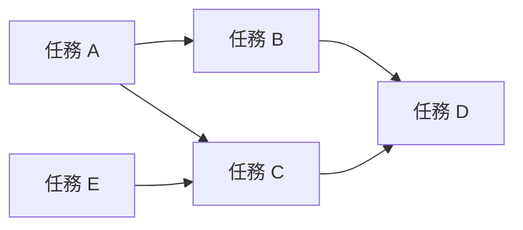
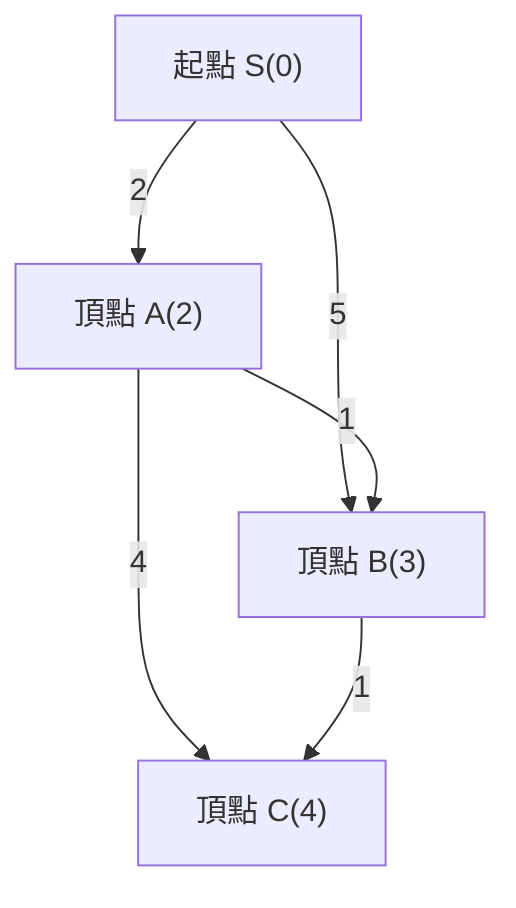
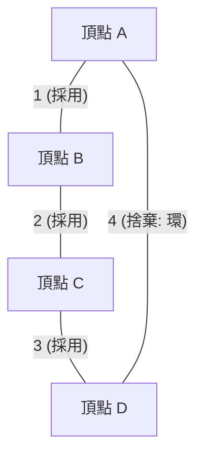
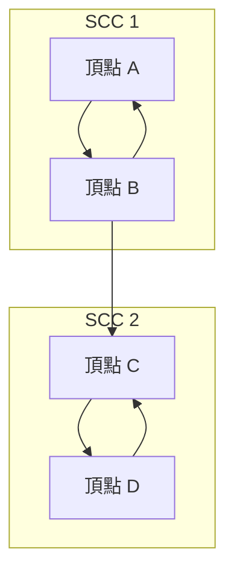

在競技程式設計（競程）中，圖論及其演算法是無法避開的最重要主題之一。在 AtCoder、Codeforces、TopCoder 等競賽中出現的許多問題，其背後都具有圖的結構。例如道路網的最短路徑、網路通訊成本的最小化、任務依賴關係的解除等，將現實世界的問題抽象化並解決，這是非常強大的武器。

本文將針對競技程式設計中常見的主要圖論演算法（拓撲排序、Dijkstra 演算法、Bellman-Ford 演算法、Floyd-Warshall 演算法、Kruskal 演算法、Prim 演算法、強連通分量分解），介紹其理論背景、使用數學公式的複雜度評估，以及使用現代 C++（C++17/20）高度最佳化的實作範例，進行全面性的網羅。這是一份將近 10,000 字的大份量「完全攻略」指南。

---

## 1. 圖論演算法的基礎與限制

在學習演算法之前，掌握競程中圖論問題的一般限制和時間複雜度標準是非常重要的。圖由頂點數 $V$ (Vertices) 和邊數 $E$ (Edges) 來表示。

*   $O(V + E)$ : 這是頂點數 $V, E \le 10^5 \sim 10^6$ 的問題所要求的時間複雜度。深度優先搜尋 (DFS) 和廣度優先搜尋 (BFS) 即屬此類。
*   $O((V + E) \log V)$ : 在 $V, E \le 10^5 \sim 2 \cdot 10^5$ 的問題中很常見。這是 Dijkstra 演算法或 Prim 演算法等在使用優先權佇列時的時間複雜度。
*   $O(V^2)$ : 允許在 $V \le 2000 \sim 3000$ 的稠密圖（$E \approx V^2$）中使用。
*   $O(V^3)$ : $V \le 400 \sim 500$ 的問題。Floyd-Warshall 演算法是其代表。

在競技程式設計中，一般使用**相鄰串列 (Adjacency List)** 作為圖的表示方式。由於相鄰矩陣會消耗 $O(V^2)$ 的記憶體，在頂點數較多的問題中會遇到記憶體限制超時 (Memory Limit Exceeded)。

---

## 2. 圖的搜尋與排序

### 拓撲排序 (Topological Sort)

拓撲排序是一種將有向無環圖 (DAG: Directed Acyclic Graph) 的頂點排成一列，使得所有有向邊都從前面的頂點指向後面的頂點的演算法。它通常用於解除任務的依賴關係（例如：任務 A 結束前無法開始任務 B），或決定 DAG 上動態規劃 (DP) 的計算順序。

時間複雜度為 $O(V + E)$。實作方式有兩種：Kahn 演算法（基於入分度的 BFS 基礎）和使用離開順序的 DFS 基礎。這裡介紹 Kahn 演算法，它也很容易求得字典序最小的拓撲排序。



#### C++ 實作範例 (Kahn 演算法)

```cpp
#include <iostream>
#include <vector>
#include <queue>

using namespace std;

// 執行拓撲排序的函式
// 若存在環，則回傳空陣列
vector<int> topological_sort(int V, const vector<vector<int>>& graph) {
    vector<int> in_degree(V, 0);
    // 計算入分度
    for (int u = 0; u < V; ++u) {
        for (int v : graph[u]) {
            in_degree[v]++;
        }
    }

    // 將入分度為 0 的頂點加入佇列 (若需要字典序最小，請使用 priority_queue<int, vector<int>, greater<int>>)
    queue<int> q;
    for (int i = 0; i < V; ++i) {
        if (in_degree[i] == 0) {
            q.push(i);
        }
    }

    vector<int> res;
    while (!q.empty()) {
        int u = q.front();
        q.pop();
        res.push_back(u);

        // 減少相鄰頂點的入分度
        for (int v : graph[u]) {
            in_degree[v]--;
            if (in_degree[v] == 0) {
                q.push(v);
            }
        }
    }

    // 檢查圖中是否包含環
    if (res.size() != V) {
        return {}; // 有環
    }
    return res;
}
```

---

## 3. 單源最短路徑問題 (SSSP: Single Source Shortest Path)

這是一個求從某個起點到其他所有頂點的最短路徑的問題。根據邊的權重是非負數還是存在負權重，適用的演算法會有所不同。

### Dijkstra 演算法 (Dijkstra's Algorithm)

Dijkstra 演算法是一種在**所有邊的權重皆為非負**時適用的高速最短路徑演算法。它基於貪婪法：「確定目前已知最短距離最短的頂點，並更新從該頂點到相鄰頂點的距離（鬆弛）」。

#### 鬆弛 (Relaxation) 的數學公式
假設起點為 $s$，到頂點 $u$ 的最短距離為 $d[u]$，邊 $(u, v)$ 的權重為 $w(u, v)$。
更新公式如下：
$$ d[v] = \min(d[v], d[u] + w(u, v)) $$

透過使用優先權佇列 (`std::priority_queue`)，可以在 $O(\log V)$ 的時間內取出距離最小且尚未確定的頂點，整體的時間複雜度為 $O((V + E) \log V)$。空間複雜度為 $O(V + E)$。


如上圖所示，直接從 S 到 B 的成本是 5，但如果經過 A，則能以成本 3 抵達。Dijkstra 演算法就是這樣進行最佳化的。

#### C++ 實作範例

```cpp
#include <iostream>
#include <vector>
#include <queue>

using namespace std;

const long long INF = 1e18; // 足夠大的值

struct Edge {
    int to;
    long long weight;
};

// Dijkstra 演算法
// 回傳從起點 s 到各個頂點最短距離的陣列
vector<long long> dijkstra(int V, const vector<vector<Edge>>& graph, int s) {
    vector<long long> dist(V, INF);
    dist[s] = 0;
    
    // 管理 {距離, 頂點} 的優先權佇列 (距離由小到大)
    using P = pair<long long, int>;
    priority_queue<P, vector<P>, greater<P>> pq;
    pq.push({0, s});
    
    while (!pq.empty()) {
        auto [d, u] = pq.top();
        pq.pop();
        
        // 若已經找到更短的路徑則跳過 (捨棄舊資訊)
        if (dist[u] < d) continue;
        
        // 鬆弛處理
        for (const auto& edge : graph[u]) {
            int v = edge.to;
            long long cost = edge.weight;
            if (dist[v] > dist[u] + cost) {
                dist[v] = dist[u] + cost;
                pq.push({dist[v], v});
            }
        }
    }
    return dist;
}
```
`if (dist[u] < d) continue;` 這行程式碼非常重要。在 Dijkstra 演算法中，同一個頂點可能會被多次推入佇列，透過這個檢查可以剪枝（剪去無謂的搜尋）。

### Bellman-Ford 演算法 (Bellman-Ford Algorithm)

當邊的權重包含負值時，Dijkstra 演算法無法得出正確答案。這時就輪到 Bellman-Ford 演算法發揮作用了。藉由對所有邊重複進行 $V - 1$ 次的鬆弛處理，即使有負權重也能正確計算出最短路徑。

如果在第 $V$ 次迭代中仍發生更新，這意味著存在**負環 (Negative Cycle)**。在競程中，「檢測負環」也是常見的問題，而 Bellman-Ford 演算法作為檢測演算法也非常優秀。

時間複雜度為 $O(V \times E)$，因為比 Dijkstra 演算法慢，請注意它只能適用於 $V \le 2000, E \le 5000$ 左右的限制。

#### C++ 實作範例

```cpp
#include <iostream>
#include <vector>

using namespace std;

const long long INF = 1e18;

struct Edge {
    int from;
    int to;
    long long weight;
};

// Bellman-Ford 演算法
// 回傳值: {最短距離的陣列, 是否存在負環}
pair<vector<long long>, bool> bellman_ford(int V, const vector<Edge>& edges, int s) {
    vector<long long> dist(V, INF);
    dist[s] = 0;
    bool negative_cycle = false;

    // 迴圈執行 V 次
    for (int i = 0; i < V; ++i) {
        bool updated = false;
        for (const auto& edge : edges) {
            if (dist[edge.from] != INF && dist[edge.to] > dist[edge.from] + edge.weight) {
                dist[edge.to] = dist[edge.from] + edge.weight;
                updated = true;
                // 若在第 V 次發生更新，則存在負環
                if (i == V - 1) {
                    negative_cycle = true;
                }
            }
        }
        // 若無更新則提早結束 (最佳化)
        if (!updated) break;
    }
    
    return {dist, negative_cycle};
}
```

---

## 4. 全點對最短路徑問題 (APSP: All-Pairs Shortest Path)

### Floyd-Warshall 演算法 (Floyd-Warshall Algorithm)

這是一種求圖中所有頂點對之間最短距離的演算法。它基於動態規劃 (DP)。該演算法非常簡潔，實作極其容易是其魅力所在。

狀態轉移方程式如下。選擇經過頂點 $k$ 的路徑和不經過的路徑中較短者。
$$ d[i][j] = \min(d[i][j], d[i][k] + d[k][j]) $$

因為需要執行三層迴圈，時間複雜度為 $O(V^3)$，空間複雜度為 $O(V^2)$。如果頂點數在 $V \le 400$ 左右，可以在執行時間限制（通常為 2 秒）內完成。

#### C++ 實作範例

```cpp
#include <iostream>
#include <vector>
#include <algorithm>

using namespace std;

const long long INF = 1e18;

// Floyd-Warshall 演算法
// dist[i][j] 在初始狀態下是從 i 到 j 的邊權重 (若無邊則為 INF，若 i==j 則為 0)
void floyd_warshall(int V, vector<vector<long long>>& dist) {
    // 經過的頂點 k
    for (int k = 0; k < V; ++k) {
        // 起點 i
        for (int i = 0; i < V; ++i) {
            // 終點 j
            for (int j = 0; j < V; ++j) {
                // 為防止溢位，檢查是否為 INF
                if (dist[i][k] != INF && dist[k][j] != INF) {
                    dist[i][j] = min(dist[i][j], dist[i][k] + dist[k][j]);
                }
            }
        }
    }
}
```

Floyd-Warshall 演算法也能檢測負環。在迴圈結束後，只要存在任何一個頂點 `i` 使得 `dist[i][i] < 0`，就代表圖中包含負環。

---

## 5. 最小生成樹 (MST: Minimum Spanning Tree)

在連通的無向圖中，連接所有頂點的樹（不含環的子圖）中，邊權重總和最小的稱為**最小生成樹 (MST)**。通常在網路鋪設成本最小化等問題中被直接問到。

### Kruskal 演算法 (Kruskal's Algorithm)

這是一種貪婪法，將所有邊依權重由小到大排序，在不形成環的情況下依序採用邊。判斷是否形成環可以使用**互斥集資料結構 (Union-Find, Disjoint Set)** 來高速處理。

時間複雜度的瓶頸在於邊的排序，為 $O(E \log E)$。這是競程中最頻繁使用的 MST 建構演算法。



#### C++ 實作範例

```cpp
#include <iostream>
#include <vector>
#include <algorithm>

using namespace std;

// Union-Find (互斥集資料結構)
struct UnionFind {
    vector<int> parent, rank, size;
    UnionFind(int n) : parent(n), rank(n, 0), size(n, 1) {
        for (int i = 0; i < n; i++) parent[i] = i;
    }
    int find(int x) {
        if (parent[x] == x) return x;
        // 路徑壓縮
        return parent[x] = find(parent[x]);
    }
    bool unite(int x, int y) {
        int root_x = find(x);
        int root_y = find(y);
        if (root_x == root_y) return false;
        
        // 依秩 (rank) 合併
        if (rank[root_x] < rank[root_y]) swap(root_x, root_y);
        parent[root_y] = root_x;
        if (rank[root_x] == rank[root_y]) rank[root_x]++;
        size[root_x] += size[root_y];
        return true;
    }
    bool same(int x, int y) { return find(x) == find(y); }
};

struct Edge {
    int u, v;
    long long weight;
    // 用於排序的比較函式
    bool operator<(const Edge& other) const {
        return weight < other.weight;
    }
};

// Kruskal 演算法
long long kruskal(int V, vector<Edge>& edges) {
    // 將邊依權重遞增排序
    sort(edges.begin(), edges.end());
    
    UnionFind uf(V);
    long long mst_cost = 0;
    int edge_count = 0;
    
    for (const auto& edge : edges) {
        if (uf.unite(edge.u, edge.v)) {
            mst_cost += edge.weight;
            edge_count++;
            // 當選出 V-1 條邊時結束 (最佳化)
            if (edge_count == V - 1) break;
        }
    }
    return mst_cost;
}
```

### Prim 演算法 (Prim's Algorithm)

採用與 Dijkstra 演算法非常相似的方法。從某一個頂點開始，在已經建構的樹所直接連接的邊中，不斷選擇權重最小的邊來讓樹成長。

使用優先權佇列時的時間複雜度為 $O((V + E) \log V)$。在稠密圖（邊數多的圖）的情況下，Prim 演算法的陣列基礎實作 $O(V^2)$ 有時會比 Kruskal 演算法更快。

#### C++ 實作範例

```cpp
#include <iostream>
#include <vector>
#include <queue>

using namespace std;

struct Edge {
    int to;
    long long weight;
};

// Prim 演算法
long long prim(int V, const vector<vector<Edge>>& graph) {
    vector<bool> used(V, false);
    // {權重, 頂點}
    using P = pair<long long, int>;
    priority_queue<P, vector<P>, greater<P>> pq;
    
    long long mst_cost = 0;
    // 將頂點 0 作為起點
    pq.push({0, 0});
    
    while (!pq.empty()) {
        auto [cost, u] = pq.top();
        pq.pop();
        
        if (used[u]) continue;
        used[u] = true;
        mst_cost += cost;
        
        for (const auto& edge : graph[u]) {
            if (!used[edge.to]) {
                pq.push({edge.weight, edge.to});
            }
        }
    }
    return mst_cost;
}
```

---

## 6. 進階：強連通分量分解 (SCC: Strongly Connected Components)

在有向圖中，「彼此可以互相到達的頂點集合」稱為強連通分量 (SCC)。若將任意有向圖以強連通分量為單位進行縮點，整體必定會變成 DAG (有向無環圖)。這稱為**強連通分量分解**。這是為了簡化圖結構使問題更容易解決的極其重要的前置處理。

在競程中，常被用於解決 2-SAT 問題，或是將有環的圖縮點成 DAG 後進行 DP。

### Kosaraju 演算法 (Kosaraju's Algorithm)

Kosaraju 演算法是一種優美且有效率的方法，只需執行 2 次 DFS（深度優先搜尋）即可建構 SCC。時間複雜度為 $O(V + E)$，在線性時間內運作。

演算法步驟：
1. 在原圖上進行 DFS，並以離開順序（post-order）將頂點記錄到陣列中。
2. 建立一個將所有邊反向的**反圖**。
3. 從步驟 1 記錄的陣列中**由後往前**（離開順序較晚的優先），在反圖上對未訪問的頂點進行 DFS。這次 DFS 能到達的頂點集合即構成一個 SCC。



#### C++ 實作範例

```cpp
#include <iostream>
#include <vector>
#include <algorithm>

using namespace std;

struct SCC {
    int V;
    vector<vector<int>> graph, rev_graph;
    vector<int> order, comp;
    vector<bool> used;

    SCC(int n) : V(n), graph(n), rev_graph(n), comp(n, -1), used(n, false) {}

    void add_edge(int from, int to) {
        graph[from].push_back(to);
        rev_graph[to].push_back(from);
    }

    // 第 1 次 DFS (記錄離開順序)
    void dfs1(int u) {
        used[u] = true;
        for (int v : graph[u]) {
            if (!used[v]) dfs1(v);
        }
        order.push_back(u);
    }

    // 第 2 次 DFS (搜尋反圖)
    void dfs2(int u, int id) {
        used[u] = true;
        comp[u] = id;
        for (int v : rev_graph[u]) {
            if (!used[v]) dfs2(v, id);
        }
    }

    // 建構 SCC 處理。回傳值為 SCC 的組數
    int build() {
        // 第 1 次 DFS
        for (int i = 0; i < V; ++i) {
            if (!used[i]) dfs1(i);
        }

        fill(used.begin(), used.end(), false);
        int group_id = 0;

        // 第 2 次 DFS (order 的反序)
        for (int i = V - 1; i >= 0; --i) {
            int u = order[i];
            if (!used[u]) {
                dfs2(u, group_id++);
            }
        }
        return group_id;
    }
};
```

`comp` 陣列中會儲存各頂點所屬的 SCC ID。這個 ID 其實具有一個非常方便的性質，也就是它會依照拓撲排序的順序分配。換句話說，只要看 `comp` 的值，就能立即了解縮點成 DAG 後的依賴關係。

---

## 7. 總結與學習建議

本文全面介紹了競技程式設計中常見的圖論演算法。
擅長圖論問題的秘訣在於**「反覆實作直到變成反射動作」**，以及**「訓練自己思考這個問題可以歸約為哪種圖（頂點是什麼，邊是什麼）」**。

1. 首先要能無誤且快速地寫出 DFS / BFS。
2. 接著要能默寫出 Dijkstra 演算法和 Kruskal 演算法（AtCoder 棕色～綠色區間必備）。
3. 最後，增加 Bellman-Ford、Floyd-Warshall、拓撲排序、SCC 等演算法的武器庫（在 AtCoder 水色～藍色區間將成為利器）。

強烈建議將程式碼片段整理成函式庫（儲存在 Snippet 工具或自己的 GitHub 儲存庫中），以便在正式比賽中能毫不猶豫地呼叫使用。

競技程式設計中的圖論演算法，是最能體會到演算法之美與強大威力的領域。請務必臨摹本文的程式碼，並在線上解題系統 (Online Judge) 中挑戰考古題吧！
