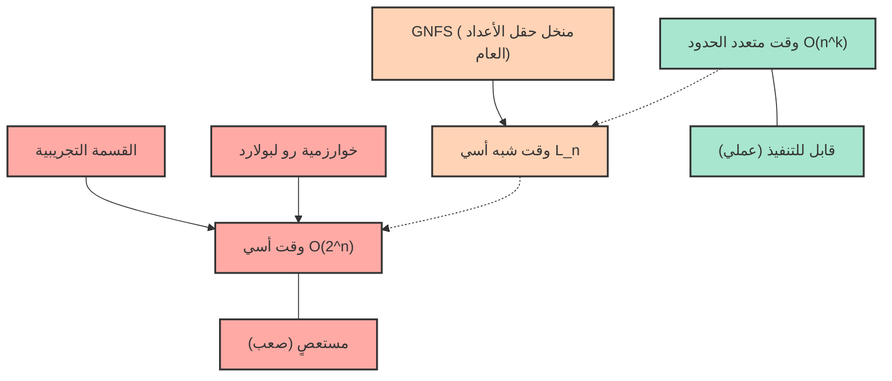
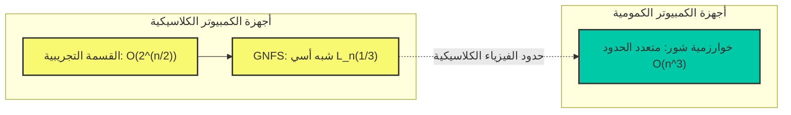

# مقدمة: لماذا يعتبر التحليل إلى العوامل الأولية "صعباً"؟

في مجتمع الإنترنت الحديث، السبب الذي يجعلنا نستطيع التسوق عبر الإنترنت وتبادل المعلومات السرية بأمان هو وجود "تقنية التشفير". والأساس الذي يدعم أمان هذه التقنية (خاصة تشفير RSA المستخدم على نطاق واسع) هو الحقيقة الرياضية القائلة بأن "تحليل الأعداد الصحيحة الضخمة إلى عوامل أولية أمر صعب للغاية".

للوهلة الأولى، يبدو التحليل إلى العوامل الأولية وكأنه مهمة بسيطة تتمثل في "مجرد تفكيك الأعداد إلى حاصل ضرب أعداد أولية"، ولكن عندما يصبح عدد الخانات كبيراً، فإنه يتحول إلى مشكلة بالغة الصعوبة لا يمكن حلها حتى لو تم تشغيل أسرع أجهزة الكمبيوتر العملاقة في العالم لعشرات أو مئات السنين. التحليل إلى العوامل الأولية الذي نتعلمه عادة في المدرسة هو في أحسن الأحوال مهمة بسيطة للقسمة على $2$ أو $3$ أو $5$، ولكن عند مواجهة حاصل ضرب أعداد أولية غير معروفة تتكون من مئات الخانات، فإن هذا النهج البسيط ينهار تماماً.

في هذا المقال، انطلاقاً من مفهوم "التعقيد الحسابي (تدوين بيغ أو: $\mathcal{O}$)"، والذي يعتبر أساس علوم المعلومات وعلوم الكمبيوتر، سنشرح بالتفصيل وبشكل رياضي مقدار الوقت الحسابي الذي تتطلبه الخوارزميات المختلفة لحل مشكلة التحليل إلى العوامل الأولية (القسمة التجريبية، خوارزمية $\rho$ لبولارد، منخل حقل الأعداد العام، إلخ). وسنوضح بالتفصيل لماذا يعتبر تحليل الأعداد الضخمة إلى عوامل أولية أمراً شبه مستحيل عملياً على أجهزة الكمبيوتر الكلاسيكية، وكيف يحمي ذلك معلوماتنا وخصوصيتنا، وعلاوة على ذلك، كيف ستقلب أجهزة الكمبيوتر الكمومية هذه الفرضية رأساً على عقب.

---

# التعقيد الحسابي والتعريف الدقيق لتدوين بيغ أو ($\mathcal{O}$)

عند تقييم أداء وكفاءة الخوارزميات، لا يكفي مجرد قياس "وقت تنفيذ البرنامج (بالثواني)". وذلك لأن وقت التنفيذ يعتمد بشكل كبير على أداء الكمبيوتر المستخدم (سرعة ساعة وحدة المعالجة المركزية، سرعة الذاكرة، إلخ)، ولغة البرمجة، وتحسين المترجم.

لذلك، يُستخدم **التعقيد الزمني (Time Complexity)** كمقياس تقييم عالمي لا يعتمد على الأجهزة أو البيئات، والتدوين المستخدم للتعبير عنه هو **تدوين بيغ أو (Big-O Notation)**. تدوين بيغ أو هو تدوين رياضي يمثل كيفية زيادة وقت تنفيذ الخوارزمية (أو عدد خطوات التنفيذ) بالنسبة لحجم بيانات الإدخال $N$ (معدل النمو التقاربي) عندما يصبح $N$ كبيراً جداً.

## التعريف الرياضي للتدوين التقاربي

في علوم الكمبيوتر، بالنسبة للدوال $f(n)$ و $g(n)$، يُعرّف $f(n) = \mathcal{O}(g(n))$ رياضياً على النحو التالي:

$$ \exists c > 0, \exists n_0 > 0 \text{ s.t. } \forall n \ge n_0, 0 \le f(n) \le c \cdot g(n) $$

هذا يعني أنه "عندما يكون حجم الإدخال $n$ كبيراً بما يكفي ($n \ge n_0$)، فإن نمو الدالة $f(n)$ يكون مقيداً من الأعلى بمضاعف ثابت للدالة $g(n)$". بعبارة أخرى، فإنه يشير إلى "الحد الأعلى (Upper Bound)" حيث يظل وقت معالجة الخوارزمية ضمن مضاعف ثابت لـ $g(n)$ حتى في أسوأ الحالات.

وبالمثل، يوجد $\Omega$ (بيغ أوميغا) كتدوين للإشارة إلى الحد الأدنى، و $\Theta$ (بيغ ثيتا) كتدوين عندما يتطابق الحدان الأعلى والأدنى، ولكن بشكل عام، يُستخدم تدوين $\mathcal{O}$ في أغلب الأحيان عند مناقشة تعقيد أسوأ حالة للخوارزميات.

## فئات التعقيد الحسابي النموذجية

هناك عدة فئات نموذجية للتعقيد الحسابي. دعونا نلقي نظرة عليها بترتيب أقصر وقت للتنفيذ (الأعلى كفاءة).

1. **$\mathcal{O}(1)$ : وقت ثابت (Constant time)**
   مهما زاد حجم الإدخال $N$، فإن وقت تنفيذ هذه الخوارزمية لا يتغير. على سبيل المثال، تندرج العمليات مثل تحديد فهرس مصفوفة للحصول على قيمة، أو البحث في جدول التجزئة (في الحالة المثالية) ضمن هذه الفئة.

2. **$\mathcal{O}(\log N)$ : وقت لوغاريتمي (Logarithmic time)**
   حتى لو تضاعف حجم الإدخال، فإن وقت التنفيذ يزداد بمقدار ثابت فقط، مما يجعلها خوارزمية فعالة للغاية. "البحث الثنائي (Binary Search)"، الذي يبحث عن قيمة مستهدفة في مصفوفة مرتبة، هو مثال نموذجي. حتى مع وجود مليار نقطة بيانات، يمكن العثور على البيانات المستهدفة في حوالي 30 مقارنة فقط.

3. **$\mathcal{O}(N)$ : وقت خطي (Linear time)**
   يزداد وقت التنفيذ بشكل متناسب مع حجم الإدخال. إذا زادت البيانات 10 أضعاف، يزداد الوقت أيضاً 10 أضعاف. "البحث الخطي"، الذي يتحقق من جميع عناصر المصفوفة بالترتيب، يندرج ضمن هذه الفئة.

4. **$\mathcal{O}(N \log N)$ : وقت شبه خطي (Linearithmic time)**
   أبطأ قليلاً من $\mathcal{O}(N)$، لكنه يقع ضمن الفئة الفعالة. تمتلك العديد من خوارزميات الفرز السريعة العملية، مثل الفرز بالدمج (Merge Sort) ومتوسط تعقيد الفرز السريع (Quick Sort)، هذا التعقيد.

5. **$\mathcal{O}(N^2)$ : وقت متعدد الحدود / وقت تربيعي (Quadratic time)**
   إذا تضاعف حجم الإدخال، يتضاعف وقت التنفيذ أربع مرات، وإذا زاد 10 أضعاف، يصبح الوقت 100 ضعف. تندرج المعالجة البسيطة باستخدام الحلقات المزدوجة، والفرز الفقاعي، والفرز بالإدراج، وغيرها ضمن هذه الفئة. عندما تتجاوز كمية البيانات عشرات الآلاف، تستغرق المعالجة وقتاً طويلاً. تُسمى هذه التعقيدات، التي يُعبر عنها بصيغة $\mathcal{O}(N^k)$، مجتمعة بـ **الوقت متعدد الحدود (Polynomial time)**.

6. **$\mathcal{O}(2^N)$ : وقت أسي (Exponential time)**
   يتضاعف وقت التنفيذ بمجرد زيادة حجم الإدخال بمقدار 1. إنها غير فعالة للغاية، وبمجرد أن يصبح $N$ 40 أو 50، حتى أحدث أجهزة الكمبيوتر لا يمكنها إنهاء الحسابات في فترة زمنية واقعية. يندرج البحث الشامل لمشكلة حقيبة الظهر أو الحل البسيط لمشكلة البائع المتجول ضمن هذه الفئة.

7. **$\mathcal{O}(N!)$ : وقت عاملي (Factorial time)**
   يزداد بسرعة أكبر من $\mathcal{O}(2^N)$. هذه مثل الخوارزمية التي تجرب جميع التباديل لمشكلة البائع المتجول.

يقارن مخطط Mermaid أدناه بشكل تخطيطي معدل نمو وقت التنفيذ (عدد الخطوات) لكل تعقيد حسابي بالنسبة للزيادة في $N$.

آمل أن تكونوا قد أدركتم مدى أهمية الاختلاف في التعقيد الحسابي عند اختيار الخوارزمية. في تقنية التشفير، يتم ضمان الأمان من خلال الاستخدام المتعمد للمشاكل التي تتطلب "وقتاً أسياً" أو "تعقيداً حسابياً مشابهاً" (أي المشاكل التي لا يمكن حلها بسهولة).

---

# آلية تشفير RSA ومشكلة التحليل إلى العوامل الأولية

لفهم سبب أهمية التحليل إلى العوامل الأولية، دعونا نراجع بإيجاز كيفية عمل تشفير RSA. تشفير RSA هو نظام تشفير بالمفتاح العام تم تطويره في عام 1977 من قبل ثلاثة أشخاص: رونالد ريفست، وآدي شامير، وليونارد أدلمان.

### خطوات إنشاء المفاتيح
1. اختر عددين أوليين كبيرين جداً $p$ و $q$ بشكل عشوائي. (على سبيل المثال، طول كل منهما 1024 بت)
2. اضربهم لحساب $N = p \times q$. يتم نشر $N$ هذا للعالم بأسره كجزء من المفتاح العام. (سيكون طوله 2048 بت)
3. احسب دالة مؤشر أويلر $\phi(N) = (p-1)(q-1)$.
4. اختر عدداً صحيحاً $e$ يكون أولياً نسبياً مع $\phi(N)$، واجعله أيضاً جزءاً من المفتاح العام.
5. احسب $d$ (المفتاح الخاص) بحيث يكون $e \times d \equiv 1 \pmod{\phi(N)}$.

ما هو مهم للغاية هنا هو حقيقة أنه **"لفك التشفير، فإن المفتاح الخاص $d$ ضروري، ولحساب $d$، فإن $\phi(N)$ ضروري، ولحساب $\phi(N)$، يجب تحليل $N$ إلى عامليه الأوليين $p$ و $q$"**.

عملية ضرب الأعداد الأولية الضخمة $p \times q$ تنتهي في لحظة، ولكن العثور على $p$ و $q$ الأصليين من الناتج $N$ (التحليل إلى العوامل الأولية) هو أمر صعب بشكل يائس. طبيعة "الدالة ذات الاتجاه الواحد (One-way function)" هذه هي قلب تشفير RSA.

هناك نقطة مهمة جداً يجب ملاحظتها هنا. إن "حجم الإدخال $n$" في مشكلة التحليل إلى العوامل الأولية ليس حجم الرقم $N$ نفسه، بل "عدد البتات المطلوبة لتمثيل الرقم $N$".
إذا كان عدد الخانات عند تمثيل العدد الصحيح $N$ بالنظام الثنائي هو $n$، فإن $n \approx \log_2 N$. بعبارة أخرى، يجب تقييم التعقيد الحسابي للخوارزمية بالنسبة لـ $n = \log_2 N$ (أو $\ln N$)، وليس $N$.

---

# تاريخ خوارزميات التحليل إلى العوامل الأولية والتعقيد الحسابي

من هنا، سنشرح بالتفصيل آليات والتعقيدات الحسابية للخوارزميات المختلفة التي تحلل عدداً مؤلفاً $N$ إلى حاصل ضرب أعداد أولية. وهذا هو أيضاً تاريخ لكيفية تحدي البشرية لحدود التحليل إلى العوامل الأولية.

## 1. القسمة التجريبية (Trial Division)

الخوارزمية الأكثر بديهية وبدائية هي "القسمة التجريبية". وهي طريقة لمحاولة معرفة ما إذا كان $N$ يقبل القسمة على أعداد أولية بدءاً من $2$ بالترتيب.

### نظرة عامة على الخوارزمية
تستفيد الخوارزمية من خاصية أن العوامل الأولية لـ $N$ لن تتجاوز أبداً $\sqrt{N}$ كحد أقصى (لأن $\sqrt{N} \times \sqrt{N} = N$، فإذا كان هناك عامل أولي أكبر من ذلك، فيجب أن يقترن بالتأكيد بعامل أولي أقل من أو يساوي $\sqrt{N}$).
لذلك، فإنها تتحقق مما إذا كان الرقم يقبل القسمة على جميع الأعداد (أو الأعداد الأولية) حتى $2, 3, 5, 7, \dots, \lfloor\sqrt{N}\rfloor$.

### تقييم التعقيد الحسابي
في أسوأ الحالات (مثل عندما يكون $N$ هو حاصل ضرب عددين أوليين ضخمين)، يكون من الضروري إجراء عمليات قسمة تصل إلى $\sqrt{N}$.
كما ذكرنا سابقاً، نظراً لأن حجم الإدخال $n$ هو $n = \log_2 N$, فيمكن التعبير عنه كـ $N = 2^n$.
لذلك، فإن الحد الأقصى لعدد خطوات الحساب يتناسب مع ما يلي:

$$ \sqrt{N} = \sqrt{2^n} = (2^n)^{1/2} = 2^{n/2} $$

وهذا يعني تعقيداً حسابياً قدره **$\mathcal{O}(2^{n/2})$** بالنسبة لطول البت $n$. بعبارة أخرى، فإن القسمة التجريبية هي **"خوارزمية وقت أسي بحت"** بالنسبة لـ $n$.
في كل مرة يزداد فيها عدد الخانات بمقدار بت واحد (يتضاعف الرقم)، يزداد وقت الحساب بنحو $\sqrt{2} \approx 1.414$ مرة. إذا كان $N$ رقماً يتجاوز 1024 بت (حوالي 300 خانة في النظام العشري)، فلن ينتهي الحساب حتى لو استغرق وقتاً يعادل عمر الكون.

## 2. طريقة فيرما للتحليل إلى العوامل (Fermat's Factorization Method)

هذه الطريقة ابتكرها عالم الرياضيات في القرن السابع عشر بيير دي فيرما. بالنظر إلى عدد فردي مؤلف $N$، تحاول الخوارزمية التعبير عن $N$ كفرق بين مربعين.

$$ N = x^2 - y^2 = (x - y)(x + y) $$

إذا تم العثور على مثل هذين الـ $x$ و $y$، فإن $a = x - y$ و $b = x + y$ يصبحان عاملي $N$.
كخوارزمية، تتم زيادة $x$ تدريجياً بدءاً من $\lceil \sqrt{N} \rceil$ والتحقق مما إذا كان $x^2 - N$ يصبح مربعاً كاملاً (مربع عدد صحيح ما $y$).
تعمل هذه الطريقة بسرعة فائقة عندما يكون العامالان الأوليان $p$ و $q$ متقاربين جداً في القيمة. ومع ذلك، في الحالة العامة (حيث يأخذ $p$ و $q$ قيماً متباعدة عشوائياً)، فإنها تتطلب في النهاية وقتاً أسياً مشابهاً للقسمة التجريبية.

## 3. خوارزمية رو لبولارد (Pollard's rho algorithm)

إحدى الخوارزميات التي تم ابتكارها لاختراق حدود القسمة التجريبية هي "خوارزمية $\rho$ (رو) لبولارد"، التي نشرها جون بولارد في عام 1975.

### نظرة عامة على الخوارزمية
تطبق هذه الطريقة مفهوم نظرية الاحتمالات المسمى "مفارقة يوم الميلاد" والدورية لتسلسلات الأرقام العشوائية الزائفة (يأتي اسمها من حقيقة أن مسارها يشبه شكل الحرف اليوناني $\rho$).

تقوم بتوليد تسلسل باستخدام دالة توليد الأرقام العشوائية الزائفة $f(x) = (x^2 + 1) \pmod N$، وتجد قيمتين في التسلسل بحيث يكون $x_i \equiv x_j \pmod p$ (حيث $p$ هو عامل أولي غير معروف لـ $N$).
في هذا الوقت، نظراً لأن $x_i - x_j$ هو مضاعف لـ $p$، فمن خلال حساب القاسم المشترك الأكبر $\gcd(|x_i - x_j|, N)$، يمكن استخراج $p$ (أي العامل الأولي لـ $N$) باحتمالية عالية. وتقوم بحساب ذلك بكفاءة مع إبقاء استهلاك الذاكرة عند $\mathcal{O}(1)$ عن طريق دمجها مع خوارزمية اكتشاف الحلقات لروبرت فلويد (خوارزمية السلحفاة والأرنب)، إلخ.

### تقييم التعقيد الحسابي
من المعروف أن عدد الخطوات التي تتطلبها خوارزمية $\rho$ لبولارد للعثور على العامل الأولي $p$ يقارب $\mathcal{O}(\sqrt{p})$.
في أسوأ الحالات (عندما يكون $N$ هو حاصل ضرب عددين أوليين $p, q$ من نفس الحجم، بحيث $p \approx \sqrt{N}$)، فإن التعقيد الحسابي يكون $\mathcal{O}(N^{1/4})$.

بالتعبير عنه بحجم الإدخال $n = \log_2 N$:

$$ N^{1/4} = (2^n)^{1/4} = 2^{n/4} $$

لذلك، فإن التعقيد الحسابي هو **$\mathcal{O}(2^{n/4})$**.

بالمقارنة مع $\mathcal{O}(2^{n/2})$ للقسمة التجريبية، فهي أسرع بشكل كبير، وفعالة للغاية عملياً في تحليل الأرقام متوسطة الحجم (عشرات الخانات). ومع ذلك، فهي لا تزال غير قادرة على التغلب على حاجز "الوقت الأسي" بالنسبة لطول البت $n$، وتقف عاجزة أمام الأعداد الضخمة مثل 2048 بت (حوالي 600 خانة عشرية) المستخدمة في تشفير RSA.

## 4. منخل التربيع متعدد الحدود (MPQS: Multiple Polynomial Quadratic Sieve)

في ثمانينيات القرن العشرين، ابتكر كارل بوميرانس "المنخل التربيعي (Quadratic Sieve: QS)". وهو امتداد لمفهوم فيرما عن "الفرق بين مربعين".
في حين أن طريقة فيرما بحثت مباشرة عن $x^2 - y^2 = N$، فإن المنخل التربيعي يبحث عن شروط أكثر تساهلاً.

$$ x^2 \equiv y^2 \pmod N $$
و
$$ x \not\equiv \pm y \pmod N $$

إذا كان من الممكن العثور على مثل هذا الزوج من $x, y$، فإن $x^2 - y^2 = (x - y)(x + y)$ يصبح مضاعفاً لـ $N$. لذلك، من خلال حساب $\gcd(x - y, N)$ أو $\gcd(x + y, N)$، يمكن الحصول على عامل أولي غير بديهي لـ $N$.

في طريقة المنخل التربيعي، يتم العثور على كمية كبيرة من القيم $x$ بحيث يصبح $x^2 \pmod N$ "رقماً يحتوي فقط على أعداد أولية صغيرة كعوامل أولية (يُطلق على هذا الرقم اسم رقم $B$-ناعم أو $B$-smooth)"، ويتم ترتيب نتائج تحليلها إلى العوامل الأولية في شكل مصفوفة (نظام من المعادلات الخطية على حقل مكون من عنصرين $\mathbb{F}_2$). بعد ذلك، باستخدام طريقة الحذف لغاوس وما شابه ذلك، يتم ضرب تعبيرات علائقية متعددة معاً، ومن خلال التعديل بحيث يصبح الجانب الأيمن مربعاً كاملاً (أس كل عامل أولي زوجياً)، يتم بناء $x^2 \equiv y^2 \pmod N$.

كانت طريقة المنخل التربيعي أسرع خوارزمية في العالم حتى ظهور منخل حقل الأعداد العام، ولا تزال تُعتبر الأسرع في تحليل الأرقام المكونة من 100 خانة أو أقل.

## 5. نظرة متعمقة على منخل حقل الأعداد العام (General Number Field Sieve: GNFS)

في الوقت الحاضر، الخوارزمية "الأسرع في العالم" في تحليل الأعداد الصحيحة الضخمة التي تتجاوز 100 خانة هي **منخل حقل الأعداد العام (GNFS)**. تم ابتكارها في أواخر الثمانينيات، وهي خوارزمية متقدمة للغاية عملت على تطوير المنخل التربيعي بشكل أكبر من خلال الاستفادة من النتائج العميقة لنظرية الأعداد الجبرية (حقول الأعداد).

في الهجمات ضد تشفير RSA (التحليل إلى العوامل الأولية من المفاتيح العامة)، فإن خوارزمية GNFS هذه هي التي تستمر دائماً في تحطيم الأرقام القياسية العالمية. في عام 2020، كان هناك تقرير عن نجاح عملية التحليل إلى العوامل الأولية لعدد مؤلف من 829 بت (250 خانة) (RSA-250)، ولكن هذا تطلب تشغيل الآلاف من أجهزة الكمبيوتر بالتوازي لفترة طويلة.

### البنية الرياضية للخوارزمية
خوارزمية GNFS معقدة للغاية، ولكنها تسير تقريباً وفقاً للخطوات التالية.

1. **اختيار متعددة الحدود (Polynomial Selection):**
   بالنسبة لـ $N$، اختر عدداً صحيحاً معيناً $m$ ومتعددة حدود غير قابلة للاختزال $f(X)$ بمعاملات صغيرة بحيث يكون $f(m) \equiv 0 \pmod N$. من خلال القيام بذلك، قم بتعريف حلقة الأعداد الصحيحة $\mathbb{Z}[\alpha]$ لحقل الأعداد الجبري (حقل الأعداد) المضافة إليه الجذر $\alpha$ لـ $f(X)$.

2. **الغربلة (Sieving):**
   ابحث عن الأرقام الناعمة في وقت واحد في "عالمين مختلفين": حلقة الأعداد الصحيحة $\mathbb{Z}$ فوق حقل الأعداد الكسرية، وحلقة الأعداد الصحيحة $\mathbb{Z}[\alpha]$ فوق حقل الأعداد الجبري. على وجه التحديد، ابحث عن عدد كبير من الأزواج $(a, b)$ بحيث يتحلل كل من معيار العدد الصحيح الكسري $a - bm$ ومعيار العدد الصحيح الجبري $a - b\alpha$ بالكامل على مجموعة محددة مسبقاً من الأعداد الأولية الصغيرة (قاعدة العوامل: Factor Base).

3. **اختزال المصفوفة (Matrix Reduction):**
   عبّر عن العدد الهائل من الأزواج الناعمة التي تم العثور عليها في شكل مصفوفة (مصفوفة متناثرة ضخمة). ابحث عن مساحة الحل باستخدام خوارزمية لانكزوس (مثل خوارزمية لانكزوس الكتلية) على الحقل المكون من عنصرين $\mathbb{F}_2$. ليس من غير المألوف أن تصل هذه المصفوفة إلى ملايين الصفوف $\times$ ملايين الأعمدة.

4. **حساب الجذر التربيعي (Square Root):**
   من حلول المصفوفة، أنشئ مربعات ضخمة في كل من "العالمين المختلفين"، واشتق في النهاية التعبير العلائقي $X^2 \equiv Y^2 \pmod N$. ثم احسب $\gcd(X-Y, N)$ للحصول على العوامل الأولية.

### التعقيد الحسابي لمنخل حقل الأعداد العام: وقت شبه أسي (Sub-exponential time)

الإنجاز الأكبر لـ GNFS هو أنه خفّض التعقيد الحسابي للتحليل إلى العوامل الأولية من "الوقت الأسي البحت" إلى **"الوقت شبه الأسي (Sub-exponential time)"**.
يُعبّر عن التعقيد الزمني التقاربي لـ GNFS على النحو التالي باستخدام تدوين خاص يسمى تدوين L.

$$ L_N[\gamma, c] = \exp\left( (c + o(1)) (\ln N)^\gamma (\ln \ln N)^{1-\gamma} \right) $$

هنا، $N$ هو الرقم المراد تحليله، و $\ln$ هو اللوغاريتم الطبيعي.
$\gamma$ هي معلمة تأخذ قيمة بين $0 \le \gamma \le 1$، وتشير إلى "درجة" تعقيد الخوارزمية.
- عندما يكون $\gamma = 0$، تصبح $L_N[0, c]$ عبارة عن $(\ln N)^c$، مما يعني وقتاً متعدد الحدود $\mathcal{O}(n^c)$. (فعال)
- عندما يكون $\gamma = 1$، تصبح $L_N[1, c]$ عبارة عن $e^{c \ln N} = N^c$, مما يعني وقتاً أسياً $\mathcal{O}(2^{cn})$. (غير فعال)

في حالة GNFS، تكون هذه المعلمة على النحو التالي:

$$ L_N\left[\frac{1}{3}, \left(\frac{64}{9}\right)^{1/3}\right] = e^{\left(\sqrt[3]{\frac{64}{9}} + o(1)\right) (\ln N)^{1/3} (\ln \ln N)^{2/3}} $$

في هذه المعادلة، الثابت $c = (64/9)^{1/3} \approx 1.923$.
بإعادة الكتابة باستخدام حجم الإدخال $n \approx \ln N$ (يتناسب مع طول البت)، يتصرف التعقيد الحسابي تقريباً على النحو التالي:

$$ \mathcal{O}\left( \exp\left( 1.923 \cdot n^{1/3} (\ln n)^{2/3} \right) \right) $$

يمكن ملاحظة أن الجزء الأسي لا يعتمد على الأس الأول لـ $n$، بل يعتمد على $n^{1/3}$ (الجذر التكعيبي لـ $n$).
في حين أن خوارزمية $\rho$ لبولارد كانت $\mathcal{O}(2^{n/4})$، أي $\mathcal{O}(\exp(c \cdot n^1))$، فقد انخفضت درجة $n$ في GNFS إلى $1/3$.
هذا يعني أنه على الرغم من أنها لم تصل إلى الوقت متعدد الحدود ($\gamma=0$)، إلا أن التعقيد الحسابي يزداد ببطء أكبر بكثير من الوقت الأسي البحت ($\gamma=1$). وهذا هو سبب تسميته بـ "الوقت شبه الأسي".

---

# حدود التشفير الحديث والكمبيوتر الكمومي

كما رأينا حتى الآن، استمرت البشرية في تحدي جدار التحليل إلى العوامل الأولية من خلال حشد الحكمة الرياضية وتطوير الخوارزميات من القسمة التجريبية إلى GNFS. ومع ذلك، حتى مع GNFS، لم يتم بعد حل التحليل إلى العوامل الأولية في "وقت متعدد الحدود" على أجهزة الكمبيوتر الكلاسيكية.

## مسألة P مقابل NP وموقع التحليل إلى العوامل الأولية

واحدة من أكبر المشاكل غير المحلولة في علوم الكمبيوتر هي "حدسية P مقابل NP".
تنتمي مشكلة التحليل إلى العوامل الأولية إلى فئة NP (فئة المشاكل التي يمكن التحقق من صحتها في وقت متعدد الحدود إذا تم إعطاء إجابة)، ولكن لم يثبت أنها NP-complete (فئة أصعب المشاكل في NP).
أيضاً، ما إذا كانت تنتمي إلى فئة P (فئة المشاكل التي يمكن حلها في وقت متعدد الحدود) (مما يعني ما إذا كانت هناك خوارزمية بوقت متعدد الحدود) هي أيضاً مسألة غير محلولة.

يتوقع العديد من الباحثين أن التحليل إلى العوامل الأولية ينتمي إلى فئة وسيطة ليست P ولا NP-complete (تُسمى NP-intermediate). إذا تم اكتشاف خوارزمية تحل التحليل إلى العوامل الأولية في وقت متعدد الحدود (على سبيل المثال، $\mathcal{O}(n^3)$، إلخ) على جهاز كمبيوتر كلاسيكي، فسيكون ذلك حدثاً كبيراً من شأنه أن يطيح بأنظمة التشفير في جميع أنحاء العالم، ولكن حتى الآن لم يتم اكتشاف مثل هذه الخوارزمية. يُقدّر أن كسر تشفير RSA بطول 2048 بت سيستغرق وقتاً أطول من عمر الكون، حتى لو تحسن أداء أجهزة الكمبيوتر الكلاسيكية وفقاً لقانون مور.

## الكمبيوتر الكمومي كـ "مغير للعبة": خوارزمية شور

تشفير RSA قوي جداً على أجهزة الكمبيوتر الكلاسيكية، ولكن الوضع يتغير تماماً عندما يتم وضع "أجهزة الكمبيوتر الكمومية"، التي تعمل وفقاً لمبادئ مختلفة تماماً، موضع التنفيذ العملي.
**"خوارزمية شور (Shor's algorithm)"**، التي نشرها بيتر شور في عام 1994، هي خوارزمية يمكنها بشكل صادم حل التحليل إلى العوامل الأولية في **وقت متعدد الحدود $\mathcal{O}(n^3)$** (بشكل أكثر دقة، حوالي $\mathcal{O}(n^2 \log n \log \log n)$ في عدد البوابات الكمومية) باستخدام تحويل فورييه الكمومي.

دعونا نتحقق من الاختلاف في التعقيد الحسابي بين الخوارزميات الكلاسيكية والخوارزميات الكمومية في مخطط Mermaid أدناه.

في خوارزمية شور، يتم حساب عملية "البحث عن الدورة"، والتي كانت تمثل عنق الزجاجة في الخوارزميات الكلاسيكية، بالتوازي وفي لحظة بواسطة "تحويل فورييه الكمومي (QFT)" باستخدام التشابك الكمومي والتراكب الكمومي.
عندما يصبح من الممكن تنفيذها على كمبيوتر كمومي ذي نطاق عملي (مع ضوضاء قليلة وعدد كافٍ من البتات الكمومية المنطقية)، فإن تشفير RSA بطول 2048 بت والذي يُعتبر آمناً حالياً يمكن أن يتم كسره تماماً في غضون بضع ساعات إلى بضعة أيام.

للاستعداد لهذا التهديد، يسارع خبراء التشفير في جميع أنحاء العالم والمعهد الوطني للمعايير والتكنولوجيا (NIST) في الولايات المتحدة حالياً بأعمال التوحيد القياسي نحو الانتقال إلى "تشفير ما بعد الكم (PQC)"، والذي يصعب كسره حتى باستخدام أجهزة الكمبيوتر الكمومية. يعد التشفير القائم على الشبكات (Lattice-based cryptography) مثالاً تمثيلياً على ذلك، وهي تستند في أمانها إلى صعوبات رياضية مختلفة تماماً عن مشكلة التحليل إلى العوامل الأولية (على سبيل المثال، مشكلة أقصر متجه).

---

# الخلاصة

في هذا المقال، بدءاً من أساسيات التعقيد الحسابي (تدوين بيغ أو)، تعمقنا في شرح تطور خوارزميات التحليل إلى العوامل الأولية وحدودها الرياضية.

* يعد **تدوين بيغ أو ($\mathcal{O}$)** مؤشراً مهماً يوضح معدل الزيادة في خطوات الحساب بالنسبة للزيادة في حجم الإدخال $n$، وهناك جدار ضخم بين الوقت متعدد الحدود والوقت الأسي لا يمكن التغلب عليه من الناحية العملية.
* **القسمة التجريبية** و **خوارزمية $\rho$ لبولارد** هما خوارزميات "وقت أسي" بحتة، وتقف عاجزة أمام الأعداد الضخمة.
* حقق **منخل حقل الأعداد العام (GNFS)**، وهو أسرع خوارزمية كلاسيكية حالياً، "وقتاً شبه أسي" من خلال الاستفادة الكاملة من نظرية الأعداد الجبرية المتقدمة، لكنه لا يزال لا يصل إلى الوقت متعدد الحدود، ويتطلب وقتاً فلكياً لتحليل الأعداد الضخمة إلى عوامل أولية.
* حقيقة أنه **"من المتوقع بشدة عدم وجود خوارزمية كلاسيكية تحل المشكلة في وقت متعدد الحدود"** هي بالذات ما يضمن أمان تشفير RSA ويدعم المجتمع الرقمي الحديث.
* ومع ذلك، مع ظهور **أجهزة الكمبيوتر الكمومية وخوارزمية شور**، يصبح التحليل إلى العوامل الأولية في وقت متعدد الحدود ممكناً نظرياً، وعلى وشك أن تنتقل تقنية التشفير إلى العصر التالي (تشفير ما بعد الكم).

حقيقة أن المفهوم المجرد للتعقيد الحسابي للخوارزميات يرتبط ارتباطاً مباشراً بأمن حياتنا هو أحد أكثر الجوانب إثارة للاهتمام والتشويق في علوم المعلومات والرياضيات. يرجى إيلاء الاهتمام للتقدم التكنولوجي في المستقبل، وخاصة اتجاهات تطوير أجهزة الكمبيوتر الكمومية والتحولات في تقنية التشفير.
