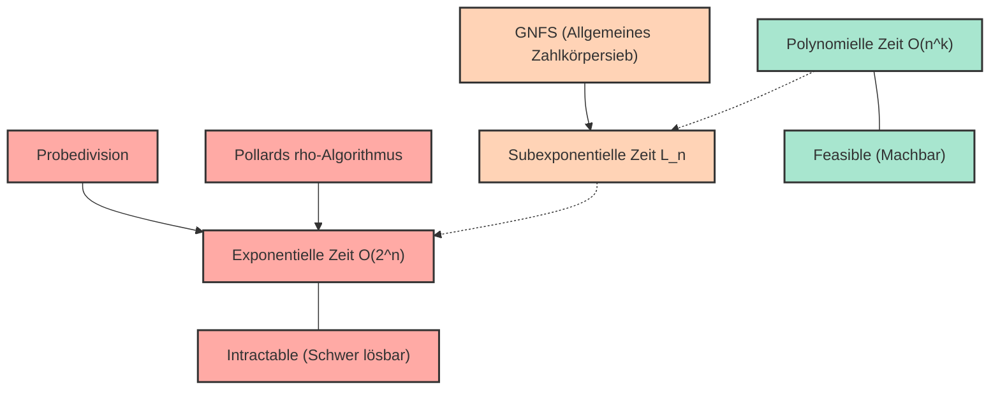
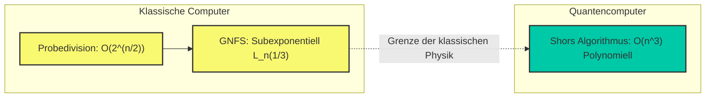

# Einführung: Warum ist die Primfaktorzerlegung so „schwierig“?

Dass wir in der modernen Internetgesellschaft sicher online einkaufen oder vertrauliche Informationen austauschen können, verdanken wir der Existenz der „Kryptographie“. Und das Fundament, das die Sicherheit dieser kryptographischen Techniken (insbesondere der weit verbreiteten RSA-Verschlüsselung) trägt, ist die mathematische Tatsache, dass „die Primfaktorzerlegung sehr großer ganzer Zahlen extrem schwierig ist“.

Auf den ersten Blick scheint die Primfaktorzerlegung eine einfache Aufgabe zu sein, bei der man „eine Zahl lediglich in das Produkt von Primzahlen zerlegt“. Wenn jedoch die Anzahl der Ziffern groß wird, verwandelt sie sich in ein extrem schwieriges Problem, das selbst die schnellsten Supercomputer der Welt, wenn sie für Jahrzehnte oder Jahrhunderte laufen, nicht lösen können. Die Primfaktorzerlegung, die wir normalerweise in der Schule lernen, ist bestenfalls eine einfache Aufgabe, bei der durch $2$, $3$ oder $5$ dividiert wird. Wenn wir jedoch mit dem Produkt unbekannter Primzahlen von Hunderten von Ziffern konfrontiert werden, bricht dieser einfache Ansatz völlig zusammen.

In diesem Artikel beginnen wir mit dem Konzept der „Zeitkomplexität (Big-O-Notation: $\mathcal{O}$-Notation)“, welches eine Grundlage der Informatik darstellt. Wir erklären ausführlich und mathematisch, wie viel Rechenzeit verschiedene Algorithmen zur Lösung der Primfaktorzerlegung (Probedivision, Pollards $\rho$-Methode, allgemeines Zahlkörpersieb usw.) benötigen. Anschließend beleuchten wir detailliert, warum die Primfaktorzerlegung großer Zahlen auf klassischen Computern praktisch unmöglich ist, wie dies unsere Informationen und Privatsphäre schützt und wie Quantencomputer diese Prämisse auf den Kopf stellen.

---

# Strenge Definition der Zeitkomplexität und der Big-O-Notation ($\mathcal{O}$)

Bei der Bewertung der Leistung und Effizienz eines Algorithmus reicht es nicht aus, einfach „die Ausführungszeit des Programms (in Sekunden)“ zu messen. Die Ausführungszeit hängt stark von der Leistung des verwendeten Computers (CPU-Taktrate, Speichergeschwindigkeit usw.), der Programmiersprache und den Compiler-Optimierungen ab.

Daher wird die **Zeitkomplexität (Time Complexity)** als ein universeller, hardware- und umgebungsunabhängiger Bewertungsmaßstab verwendet, und die Schreibweise zu ihrer Darstellung ist die **Big-O-Notation (Big-O Notation)**. Die Big-O-Notation ist eine mathematische Schreibweise, die beschreibt, wie die Ausführungszeit (oder die Anzahl der Ausführungsschritte) eines Algorithmus im Verhältnis zur Größe $N$ der Eingabedaten ansteigt (asymptotische Wachstumsrate), wenn $N$ sehr groß wird.

## Mathematische Definition der asymptotischen Notation

In der Informatik wird für die Funktionen $f(n)$ und $g(n)$ die Aussage $f(n) = \mathcal{O}(g(n))$ mathematisch wie folgt definiert:

$$ \exists c > 0, \exists n_0 > 0 \text{ s.t. } \forall n \ge n_0, 0 \le f(n) \le c \cdot g(n) $$

Dies bedeutet: „Wenn die Eingabegröße $n$ ausreichend groß ist ($n \ge n_0$), wird das Wachstum der Funktion $f(n)$ nach oben durch ein konstantes Vielfaches von $g(n)$ beschränkt.“ Das heißt, es zeigt eine „obere Schranke (Upper Bound)“ an, bei der die Verarbeitungszeit des Algorithmus selbst im schlimmsten Fall innerhalb eines konstanten Vielfachen von $g(n)$ bleibt.

Ebenso gibt es die $\Omega$-Notation (Big-Omega) zur Angabe einer unteren Schranke und die $\Theta$-Notation (Big-Theta) für den Fall, dass die obere und untere Schranke übereinstimmen. Wenn man jedoch allgemein die Worst-Case-Komplexität eines Algorithmus diskutiert, wird am häufigsten die $\mathcal{O}$-Notation verwendet.

## Typische Komplexitätsklassen

Es gibt einige typische Klassen für die Komplexität. Betrachten wir sie in der Reihenfolge von der kürzesten (effizientesten) zur längsten Ausführungszeit.

1. **$\mathcal{O}(1)$ : Konstante Zeit (Constant time)**
   Ein Algorithmus, dessen Ausführungszeit sich nicht ändert, egal wie groß die Eingabegröße $N$ wird. Beispiele hierfür sind der Zugriff auf einen Wert in einem Array über seinen Index oder die Suche in einer Hash-Tabelle (im Idealfall).

2. **$\mathcal{O}(\log N)$ : Logarithmische Zeit (Logarithmic time)**
   Ein sehr effizienter Algorithmus, bei dem die Ausführungszeit nur um einen konstanten Betrag steigt, selbst wenn sich die Eingabegröße verdoppelt. Ein typisches Beispiel ist die „binäre Suche (Binary Search)“, bei der ein bestimmter Wert in einem sortierten Array gesucht wird. Selbst bei einer Datenmenge von einer Milliarde kann der gewünschte Wert mit nur etwa 30 Vergleichen gefunden werden.

3. **$\mathcal{O}(N)$ : Lineare Zeit (Linear time)**
   Die Ausführungszeit steigt proportional zur Eingabegröße. Wenn sich die Datenmenge verzehnfacht, verzehnfacht sich auch die Zeit. Ein Beispiel ist die „lineare Suche“, bei der alle Elemente eines Arrays nacheinander überprüft werden.

4. **$\mathcal{O}(N \log N)$ : Quasilineare Zeit (Linearithmic time)**
   Etwas langsamer als $\mathcal{O}(N)$, gehört aber immer noch zur effizienten Kategorie. Viele praktische und schnelle Sortieralgorithmen, wie z.B. Merge Sort oder Quick Sort (durchschnittliche Komplexität), haben diese Komplexität.

5. **$\mathcal{O}(N^2)$ : Polynomielle Zeit / Quadratische Zeit (Quadratic time)**
   Wenn sich die Eingabegröße verdoppelt, vervierfacht sich die Ausführungszeit; bei einer Verzehnfachung steigt sie um das Hundertfache. Beispiele sind einfache Verarbeitungen mit verschachtelten Schleifen, Bubble Sort oder Insertion Sort. Wenn die Datenmenge Zehntausende übersteigt, nimmt die Verarbeitung viel Zeit in Anspruch. Die Komplexitäten, die in der Form $\mathcal{O}(N^k)$ ausgedrückt werden, bezeichnet man zusammenfassend als **polynomielle Zeit (Polynomial time)**.

6. **$\mathcal{O}(2^N)$ : Exponentielle Zeit (Exponential time)**
   Wenn die Eingabegröße um 1 steigt, verdoppelt sich die Ausführungszeit. Diese sind sehr ineffizient; sobald $N$ 40 oder 50 erreicht, kann selbst der modernste Computer die Berechnung nicht mehr in einer realistischen Zeit abschließen. Beispiele sind die erschöpfende Suche (Brute-Force) beim Rucksackproblem oder ein einfacher Lösungsansatz für das Problem des Handlungsreisenden.

7. **$\mathcal{O}(N!)$ : Faktorielle Zeit (Factorial time)**
   Wächst noch schneller als $\mathcal{O}(2^N)$. Ein Beispiel wäre ein Algorithmus, der alle Permutationen für das Problem des Handlungsreisenden ausprobiert.

Das folgende Mermaid-Diagramm vergleicht schematisch die Wachstumsraten der Ausführungszeit (Anzahl der Schritte) der verschiedenen Komplexitäten in Bezug auf die Zunahme von $N$.

Ich hoffe, es ist klar geworden, wie wichtig die Unterschiede in der Komplexität bei der Auswahl von Algorithmen sind. In der Kryptographie werden Probleme, die eine „exponentielle Zeit“ oder „eine Komplexität in der Nähe davon“ erfordern (also Probleme, die nicht leicht zu lösen sind), absichtlich genutzt, um die Sicherheit zu gewährleisten.

---

# Die Funktionsweise der RSA-Verschlüsselung und das Problem der Primfaktorzerlegung

Um zu verstehen, warum die Primfaktorzerlegung so wichtig ist, werfen wir einen kurzen Blick auf die Funktionsweise der RSA-Verschlüsselung. Die RSA-Verschlüsselung ist ein asymmetrisches kryptographisches Verfahren (Public-Key-Kryptographie), das 1977 von Ron Rivest, Adi Shamir und Leonard Adleman entwickelt wurde.

### Schritte der Schlüsselgenerierung
1. Wählen Sie zufällig zwei sehr große Primzahlen $p$ und $q$ aus. (Zum Beispiel jeweils mit einer Länge von 1024 Bit)
2. Multiplizieren Sie diese, um $N = p \times q$ zu berechnen. Dieses $N$ wird als Teil des öffentlichen Schlüssels (Public Key) weltweit veröffentlicht. (Es wird 2048 Bit lang sein)
3. Berechnen Sie Eulers Totient-Funktion $\phi(N) = (p-1)(q-1)$.
4. Wählen Sie eine ganze Zahl $e$, die teilerfremd zu $\phi(N)$ ist, und machen Sie dies ebenfalls zum Teil des öffentlichen Schlüssels.
5. Berechnen Sie ein $d$ (den privaten Schlüssel), sodass $e \times d \equiv 1 \pmod{\phi(N)}$ gilt.

Das Äußerst Wichtige hierbei ist die Tatsache, dass **„man zur Entschlüsselung den privaten Schlüssel $d$ benötigt, zur Berechnung von $d$ die Funktion $\phi(N)$ benötigt wird und man zur Berechnung von $\phi(N)$ die Zahl $N$ in $p$ und $q$ primfaktorzerlegen muss.“**

Die Multiplikation der riesigen Primzahlen $p \times q$ ist in einem Bruchteil einer Sekunde abgeschlossen, aber die ursprünglichen $p$ und $q$ aus dem resultierenden $N$ zu finden (Primfaktorzerlegung), ist hoffnungslos schwierig. Diese Eigenschaft einer „Einwegfunktion (One-way function)“ ist das Herzstück der RSA-Verschlüsselung.

Hier gibt es einen sehr wichtigen Punkt zu beachten. Die „Eingabegröße $n$“ beim Problem der Primfaktorzerlegung ist nicht die Größe der Zahl $N$ selbst, sondern „die Anzahl der Bits, die benötigt werden, um die Zahl $N$ darzustellen“.
Wenn $n$ die Anzahl der Ziffern ist, wenn die ganze Zahl $N$ binär dargestellt wird, dann ist $n \approx \log_2 N$. Das bedeutet, dass die Komplexität des Algorithmus nicht nach $N$, sondern nach $n = \log_2 N$ (oder $\ln N$) bewertet werden muss.

---

# Geschichte und Komplexität der Primfaktorzerlegungs-Algorithmen

Ab hier werden wir die Funktionsweise und Komplexität verschiedener Algorithmen zur Zerlegung einer gegebenen zusammengesetzten Zahl $N$ in ein Produkt von Primzahlen im Detail erklären. Es ist auch die Geschichte, wie die Menschheit die Grenzen der Primfaktorzerlegung herausgefordert hat.

## 1. Probedivision (Trial Division)

Der intuitivste und primitivste Algorithmus ist die „Probedivision“. Bei dieser Methode wird ausgehend von $2$ der Reihe nach versucht, ob $N$ durch eine Primzahl teilbar ist.

### Übersicht des Algorithmus
Es wird die Eigenschaft genutzt, dass ein Primfaktor von $N$ höchstens $\sqrt{N}$ groß sein kann (da $\sqrt{N} \times \sqrt{N} = N$ ist; wenn es einen größeren Primfaktor gibt, ist er zwangsläufig mit einem Primfaktor gepaart, der kleiner oder gleich $\sqrt{N}$ ist).
Daher wird überprüft, ob die Zahl durch alle Zahlen (oder Primzahlen) bis zu $2, 3, 5, 7, \dots, \lfloor\sqrt{N}\rfloor$ ohne Rest teilbar ist.

### Bewertung der Komplexität
Im schlimmsten Fall (z. B. wenn $N$ das Produkt zweier riesiger Primzahlen ist) müssen Divisionen bis $\sqrt{N}$ durchgeführt werden.
Wie bereits erwähnt, ist die Eingabegröße $n = \log_2 N$, sodass man $N = 2^n$ schreiben kann.
Folglich ist die Anzahl der Rechenschritte maximal proportional zu:

$$ \sqrt{N} = \sqrt{2^n} = (2^n)^{1/2} = 2^{n/2} $$

Dies bedeutet, dass die Komplexität für die Bitlänge $n$ **$\mathcal{O}(2^{n/2})$** beträgt. Mit anderen Worten: Die Probedivision ist ein **„rein exponentieller Zeit-Algorithmus (Exponential time algorithm)“** in Bezug auf $n$.
Für jedes zusätzliche Bit (was einer Verdoppelung des Zahlenwertes entspricht) steigt die Rechenzeit um etwa das $\sqrt{2} \approx 1.414$-fache. Wenn $N$ eine Zahl ist, die 1024 Bit (etwa 300 Ziffern im Dezimalsystem) überschreitet, würde die Berechnung nicht einmal nach der Dauer des Alters des Universums abgeschlossen sein.

## 2. Fermats Faktorisierungsmethode (Fermat's Factorization Method)

Dies ist eine Methode, die von dem Mathematiker Pierre de Fermat im 17. Jahrhundert entwickelt wurde. Gegeben eine ungerade zusammengesetzte Zahl $N$, versucht die Methode, $N$ als Differenz zweier Quadratzahlen darzustellen.

$$ N = x^2 - y^2 = (x - y)(x + y) $$

Wenn solche $x$ und $y$ gefunden werden, dann sind $a = x - y$ und $b = x + y$ die Faktoren von $N$.
Als Algorithmus wird $x$ beginnend bei $\lceil \sqrt{N} \rceil$ inkrementiert, und es wird geprüft, ob $x^2 - N$ ein perfektes Quadrat (das Quadrat einer ganzen Zahl $y$) ist.
Diese Methode funktioniert extrem schnell, wenn die Werte der beiden Primfaktoren $p$ und $q$ sehr nah beieinander liegen. Im allgemeinen Fall (wenn $p$ und $q$ zufällig weit voneinander entfernte Werte annehmen) erfordert sie jedoch letztendlich eine exponentielle Zeit, vergleichbar mit der Probedivision.

## 3. Pollards $\rho$-Methode (Pollard's rho algorithm)

Einer der Algorithmen, die entwickelt wurden, um die Grenzen der Probedivision zu überwinden, ist „Pollards $\rho$ (Rho)-Methode“, die 1975 von John Pollard veröffentlicht wurde.

### Übersicht des Algorithmus
Diese Methode nutzt ein Konzept der Wahrscheinlichkeitstheorie namens „Geburtstagsparadoxon (Birthday Paradox)“ und die Periodizität einer pseudozufälligen Zahlenfolge (die Form ähnelt dem griechischen Buchstaben $\rho$, daher der Name).

Es wird eine Pseudozufallsfunktion $f(x) = (x^2 + 1) \pmod N$ verwendet, um eine Folge zu generieren, und es werden zwei Werte in der Folge gesucht, so dass $x_i \equiv x_j \pmod p$ gilt (wobei $p$ ein unbekannter Primfaktor von $N$ ist).
Zu diesem Zeitpunkt ist $x_i - x_j$ ein Vielfaches von $p$, so dass durch die Berechnung des größten gemeinsamen Teilers $\gcd(|x_i - x_j|, N)$ das $p$ (also der Primfaktor von $N$) mit hoher Wahrscheinlichkeit extrahiert werden kann. Durch die Kombination mit dem Zyklusfindungsalgorithmus von Robert Floyd (der Hase-und-Igel-Algorithmus) kann dies effizient berechnet werden, wobei der Speicherverbrauch auf $\mathcal{O}(1)$ begrenzt wird.

### Bewertung der Komplexität
Es ist bekannt, dass die Anzahl der Schritte, die Pollards $\rho$-Methode benötigt, um einen Primfaktor $p$ zu finden, ungefähr $\mathcal{O}(\sqrt{p})$ beträgt.
Im schlimmsten Fall (wenn $N$ das Produkt zweier gleich großer Primzahlen $p$ und $q$ ist, sodass $p \approx \sqrt{N}$ gilt), beträgt die Komplexität $\mathcal{O}(N^{1/4})$.

Ausgedrückt durch die Eingabegröße $n = \log_2 N$:

$$ N^{1/4} = (2^n)^{1/4} = 2^{n/4} $$

Folglich beträgt die Komplexität **$\mathcal{O}(2^{n/4})$**.
Im Vergleich zu $\mathcal{O}(2^{n/2})$ der Probedivision ist dies drastisch schneller, und in der Praxis ist es für die Primfaktorzerlegung von Zahlen mittlerer Größe (Dutzende von Ziffern) äußerst leistungsfähig. Dennoch hat es die Barriere der „exponentiellen Zeit“ für die Bitlänge $n$ immer noch nicht überwunden und ist gegenüber den riesigen Zahlen von 2048 Bit (etwa 600 Dezimalstellen), wie sie bei der RSA-Verschlüsselung verwendet werden, machtlos.

## 4. Multiples Polynom-quadratisches Sieb (MPQS: Multiple Polynomial Quadratic Sieve)

In den 1980er Jahren wurde von Carl Pomerance das „Quadratische Sieb (Quadratic Sieve: QS)“ entwickelt. Es ist eine Erweiterung von Fermats Konzept der „Differenz von Quadraten“.
Während die Fermat-Methode direkt nach $x^2 - y^2 = N$ suchte, sucht das Quadratische Sieb nach einer viel lockereren Bedingung:

$$ x^2 \equiv y^2 \pmod N $$
und
$$ x \not\equiv \pm y \pmod N $$

Wenn ein solches Paar von $x, y$ gefunden werden kann, ist $x^2 - y^2 = (x - y)(x + y)$ ein Vielfaches von $N$. Durch die Berechnung von $\gcd(x - y, N)$ oder $\gcd(x + y, N)$ kann man daher einen nicht-trivialen Primfaktor von $N$ erhalten.

Beim Quadratischen Sieb werden zahlreiche $x$ gefunden, für die $x^2 \pmod N$ eine „Zahl mit nur kleinen Primfaktoren (eine sogenannte $B$-glatte Zahl)“ ergibt. Die Ergebnisse ihrer Primfaktorzerlegung werden in Matrixform angeordnet (als System linearer Gleichungen über dem Körper $\mathbb{F}_2$ mit zwei Elementen). Dann werden mehrere Beziehungen multipliziert (z. B. unter Verwendung des Gaußschen Eliminationsverfahrens) und so angepasst, dass die rechte Seite ein perfektes Quadrat ist (die Exponenten jedes Primfaktors sind gerade), wodurch $x^2 \equiv y^2 \pmod N$ konstruiert wird.

Das Quadratische Sieb war der schnellste Algorithmus der Welt, bis das Allgemeine Zahlkörpersieb (GNFS) aufkam, und es gilt immer noch als das schnellste für die Zerlegung von Zahlen mit bis zu 100 Ziffern.

## 5. Tieferer Einblick in das Allgemeine Zahlkörpersieb (General Number Field Sieve: GNFS)

Derzeit gilt das **Allgemeine Zahlkörpersieb (GNFS)** als „weltweit schnellstes“ Verfahren zur Primfaktorzerlegung von riesigen ganzen Zahlen mit über 100 Ziffern. Es wurde in den späten 1980er Jahren entwickelt und ist ein fortschrittlicher Algorithmus, der das Quadratische Sieb weiterentwickelt und tiefgehende Ergebnisse der algebraischen Zahlentheorie (Zahlkörper) nutzt.

Bei Angriffen auf die RSA-Verschlüsselung (Primfaktorzerlegung aus dem öffentlichen Schlüssel) ist es stets dieses GNFS, das immer wieder Weltrekorde bricht. Es gibt Berichte, dass im Jahr 2020 eine 829-Bit-Zahl (250 Dezimalstellen, RSA-250) erfolgreich primfaktorzerlegt wurde, aber das erforderte den parallelen, langfristigen Betrieb von Tausenden von Computern.

### Mathematische Struktur des Algorithmus
GNFS ist sehr komplex, verläuft aber grob in folgenden Schritten:

1. **Polynomauswahl (Polynomial Selection):**
   Für $N$ wählt man eine ganze Zahl $m$ und ein irreduzibles Polynom $f(X)$ mit kleinen Koeffizienten, für das $f(m) \equiv 0 \pmod N$ gilt. Dadurch wird der Ganzheitsring $\mathbb{Z}[\alpha]$ eines algebraischen Zahlkörpers definiert, dem die Wurzel $\alpha$ von $f(X)$ adjungiert ist.

2. **Sieben (Sieving):**
   In den „zwei verschiedenen Welten“, dem Ganzheitsring $\mathbb{Z}$ über dem Körper der rationalen Zahlen und dem Ganzheitsring $\mathbb{Z}[\alpha]$ über dem algebraischen Zahlkörper, wird gleichzeitig nach glatten (Smooth) Zahlen gesucht. Genauer gesagt, man findet eine große Anzahl von $(a, b)$-Paaren, bei denen sowohl die rationale ganze Zahl $a - bm$ als auch die Norm der algebraischen ganzen Zahl $a - b\alpha$ vollständig über einer im Voraus bestimmten Menge kleiner Primzahlen (Faktorbasis: Factor Base) zerlegt werden.

3. **Matrixreduktion (Matrix Reduction):**
   Die gefundene enorme Anzahl an glatten Paaren wird als Matrix (riesige dünnbesetzte Matrix) dargestellt. Über dem binären Körper $\mathbb{F}_2$ wird der Lösungsraum mithilfe des Lanczos-Algorithmus (z. B. Block-Lanczos-Verfahren) gesucht. Es ist nicht ungewöhnlich, dass diese Matrix Millionen von Zeilen $\times$ Millionen von Spalten hat.

4. **Berechnung der Quadratwurzel (Square Root):**
   Aus der Lösung der Matrix werden in jeder der „zwei verschiedenen Welten“ riesige Quadratzahlen konstruiert, um schließlich die Beziehung $X^2 \equiv Y^2 \pmod N$ abzuleiten. Dann wird $\gcd(X-Y, N)$ berechnet, um den Primfaktor zu erhalten.

### Komplexität des Allgemeinen Zahlkörpersiebs: Subexponentielle Zeit (Sub-exponential time)

Der größte Erfolg des GNFS ist, dass es die Komplexität der Primfaktorzerlegung von einer „reinen exponentiellen Zeit“ auf eine **„subexponentielle Zeit (Sub-exponential time)“** reduziert hat.
Die asymptotische Zeitkomplexität des GNFS wird unter Verwendung einer speziellen Notation, der L-Notation (L-notation), wie folgt ausgedrückt:

$$ L_N[\gamma, c] = \exp\left( (c + o(1)) (\ln N)^\gamma (\ln \ln N)^{1-\gamma} \right) $$

Hierbei ist $N$ die zu zerlegende Zahl und $\ln$ der natürliche Logarithmus.
$\gamma$ ist ein Parameter, der Werte im Bereich $0 \le \gamma \le 1$ annimmt und den „Grad“ der Komplexität des Algorithmus anzeigt.
- Wenn $\gamma = 0$ ist, wird $L_N[0, c]$ zu $(\ln N)^c$, was eine polynomielle Zeit $\mathcal{O}(n^c)$ bedeutet. (Effizient)
- Wenn $\gamma = 1$ ist, wird $L_N[1, c]$ zu $e^{c \ln N} = N^c$, was eine exponentielle Zeit $\mathcal{O}(2^{cn})$ bedeutet. (Ineffizient)

Im Fall von GNFS sieht dieser Parameter wie folgt aus:

$$ L_N\left[\frac{1}{3}, \left(\frac{64}{9}\right)^{1/3}\right] = e^{\left(\sqrt[3]{\frac{64}{9}} + o(1)\right) (\ln N)^{1/3} (\ln \ln N)^{2/3}} $$

In dieser Gleichung ist die Konstante $c = (64/9)^{1/3} \approx 1.923$.
Wenn man es mit der Eingabegröße $n \approx \ln N$ (proportional zur Bitlänge) umschreibt, verhält sich die Komplexität ungefähr so:

$$ \mathcal{O}\left( \exp\left( 1.923 \cdot n^{1/3} (\ln n)^{2/3} \right) \right) $$

Es ist ersichtlich, dass der exponentielle Teil nicht von $n$ zur 1. Potenz, sondern von $n^{1/3}$ (der Kubikwurzel von $n$) abhängt.
Während Pollards $\rho$-Methode $\mathcal{O}(2^{n/4})$ bzw. $\mathcal{O}(\exp(c \cdot n^1))$ war, hat sich bei GNFS der Grad von $n$ auf $1/3$ verringert.
Das bedeutet, dass die Komplexität zwar noch nicht die polynomielle Zeit ($\gamma=0$) erreicht hat, aber viel langsamer wächst als eine rein exponentielle Zeit ($\gamma=1$). Dies ist der Grund, warum sie „subexponentielle Zeit“ genannt wird.

---

# Die Grenzen der modernen Kryptographie und Quantencomputer

Wie wir bisher gesehen haben, hat die Menschheit weiterhin die Barrieren der Primfaktorzerlegung herausgefordert, indem sie ihr mathematisches Wissen bündelte und die Algorithmen von der Probedivision bis zum GNFS weiterentwickelte. Aber selbst mit dem GNFS kann die Primfaktorzerlegung auf klassischen Computern immer noch nicht in „polynomieller Zeit“ gelöst werden.

## Das P-vs-NP-Problem und die Position der Primfaktorzerlegung

Eines der größten ungelösten Probleme der Informatik ist die „P = NP-Vermutung“.
Das Problem der Primfaktorzerlegung gehört zu NP (der Klasse von Problemen, deren Richtigkeit in polynomieller Zeit überprüft werden kann, wenn eine Lösung gegeben ist), aber es ist nicht bewiesen, dass es NP-vollständig ist (die Klasse der schwierigsten Probleme innerhalb von NP).
Außerdem ist ungelöst, ob es zu P (der Klasse von Problemen, die in polynomieller Zeit gelöst werden können) gehört (das heißt, ob ein Algorithmus mit polynomieller Zeit existiert).

Viele Forscher vermuten, dass die Primfaktorzerlegung zu einer Zwischenklasse gehört, die weder P noch NP-vollständig ist (NP-intermediate). Wenn ein Algorithmus entdeckt werden sollte, der die Primfaktorzerlegung auf einem klassischen Computer in polynomieller Zeit (z. B. $\mathcal{O}(n^3)$) löst, wäre das ein gewaltiges Ereignis, das die kryptographischen Systeme weltweit kollabieren lassen würde. Bisher wurde jedoch kein solcher Algorithmus gefunden. Es wird geschätzt, dass das Entschlüsseln eines 2048-Bit-RSA-Schlüssels länger als das Alter des Universums dauern würde, selbst wenn die Leistungssteigerung klassischer Computer dem Mooreschen Gesetz folgt.

## Der „Gamechanger“ Quantencomputer: Shors Algorithmus

Während die RSA-Verschlüsselung auf klassischen Computern robust ist, wird sich die Situation komplett ändern, wenn „Quantencomputer“, die nach völlig anderen Prinzipien funktionieren, praktisch nutzbar werden.
**„Shors Algorithmus (Shor's algorithm)“**, der 1994 von Peter Shor vorgestellt wurde, ist ein Algorithmus, der durch die Verwendung der Quanten-Fourier-Transformation die Primfaktorzerlegung in unglaublich kurzer **polynomieller Zeit $\mathcal{O}(n^3)$** (genauer gesagt in der Größenordnung von $\mathcal{O}(n^2 \log n \log \log n)$ Quantengattern) lösen kann.

Lassen Sie uns im folgenden Mermaid-Diagramm den Unterschied in der Komplexität zwischen klassischen und Quantenalgorithmen überprüfen.

In Shors Algorithmus wird der Prozess der „Periodenfindung“, der bei klassischen Algorithmen einen Engpass darstellt, durch die „Quanten-Fourier-Transformation (QFT)“ unter Verwendung von Quantenverschränkung und Quantenüberlagerung massiv parallel und im Bruchteil einer Sekunde berechnet.
Sobald er auf einem Quantencomputer praktischer Größe (mit wenig Rauschen und einer ausreichenden Anzahl logischer Qubits) ausgeführt werden kann, besteht die Möglichkeit, dass die derzeit als sicher geltende 2048-Bit-RSA-Verschlüsselung innerhalb von Stunden bis wenigen Tagen vollständig entschlüsselt wird.

Um sich auf diese Bedrohung vorzubereiten, treiben derzeit Kryptographen weltweit und das NIST (National Institute of Standards and Technology der USA) die Standardisierung in Richtung einer „Post-Quanten-Kryptographie (Post-Quantum Cryptography: PQC)“ voran, die auch für Quantencomputer schwer zu entschlüsseln ist. Gitterbasierte Kryptographie (Lattice-based cryptography) ist ein typisches Beispiel dafür. Deren Sicherheit beruht auf mathematischen Schwierigkeiten, die sich völlig vom Problem der Primfaktorzerlegung unterscheiden (wie z. B. dem Problem des kürzesten Vektors).

---

# Zusammenfassung

In diesem Artikel haben wir von den Grundlagen der Zeitkomplexität (Big-O-Notation) ausgehend die Entwicklung der Primfaktorzerlegungs-Algorithmen und ihre mathematischen Grenzen eingehend erläutert.

* Die **Big-O-Notation ($\mathcal{O}$)** ist ein wichtiger Indikator, der die Wachstumsrate der Anzahl der Rechenschritte im Verhältnis zur Zunahme der Eingabegröße $n$ zeigt, und zwischen polynomieller Zeit und exponentieller Zeit existiert eine praktisch unüberwindbare, riesige Mauer.
* Die **Probedivision** und **Pollards $\rho$-Methode** sind rein „exponentielle Zeit“-Algorithmen und bei riesigen Zahlen machtlos.
* Das **Allgemeine Zahlkörpersieb (GNFS)**, der derzeit schnellste klassische Algorithmus, nutzt fortschrittliche algebraische Zahlentheorie, um eine „subexponentielle Zeit“ zu erreichen, aber es erreicht dennoch keine polynomielle Zeit und benötigt astronomische Zeiten für die Primfaktorzerlegung riesiger Zahlen.
* Gerade die Tatsache, **„dass kein klassischer Algorithmus existiert, der dieses in polynomieller Zeit löst (was stark vermutet wird)“**, gewährleistet die Sicherheit der RSA-Verschlüsselung und stützt die moderne digitale Gesellschaft.
* Mit dem Aufkommen von **Quantencomputern und Shors Algorithmus** wird die Primfaktorzerlegung in polynomieller Zeit jedoch theoretisch möglich, und die Kryptographie ist dabei, in das nächste Zeitalter (Post-Quanten-Kryptographie) überzugehen.

Die Tatsache, dass ein abstraktes Konzept wie die Komplexität von Algorithmen direkt mit der Sicherheit unseres Lebens verbunden ist, gehört zu den faszinierendsten und spannendsten Aspekten der Informatik und Mathematik. Bitte behalten Sie die zukünftigen technologischen Fortschritte, insbesondere die Entwicklungen bei Quantencomputern und den Wandel in der Kryptographie, genau im Auge.
