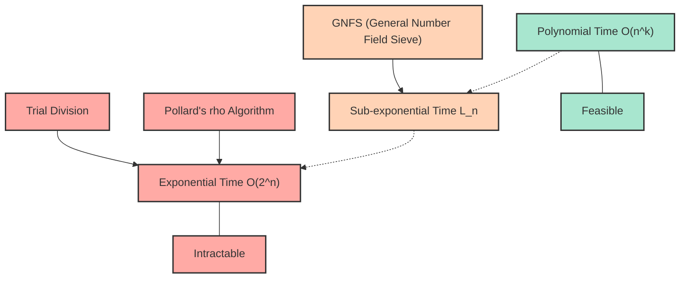
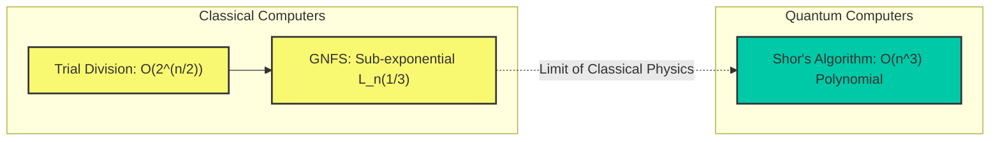

# Introduction: Why is Prime Factorization "Difficult"?

In our modern Internet society, the reason we can safely enjoy online shopping and exchange confidential information is because of the existence of "cryptography". And the foundation of the security of this cryptography (especially widely used ones like RSA) is supported by the mathematical fact that "prime factorization of enormous integers is extremely difficult."

At first glance, prime factorization might seem like a simple task of "just breaking down numbers into a multiplication of primes," but as the number of digits grows, it transforms into an ultra-difficult problem that cannot be solved even if the world's fastest supercomputer is run for decades or centuries. The prime factorization we typically learn in school is, at best, a simple process of dividing by $2$, $3$, or $5$. However, when faced with the product of unknown prime numbers spanning hundreds of digits, that simple approach completely breaks down.

In this article, starting from the concept of "computational complexity (Big-O notation: $\mathcal{O}$ notation)," which is a fundamental of information science and computer science, we will explain in detail and mathematically how much computational time various algorithms for solving prime factorization (trial division, Pollard's $\rho$ algorithm, general number field sieve, etc.) require. Furthermore, we will thoroughly unravel why prime factorization of huge numbers is practically impossible on classical computers, how it protects our information and privacy, and even how quantum computers are overturning this premise.

---

# Strict Definition of Computational Complexity and Big-O ($\mathcal{O}$) Notation

When evaluating the performance and efficiency of an algorithm, simply measuring the "program execution time (in seconds)" is insufficient. This is because execution time heavily depends on the performance of the computer used (such as CPU clock speed and memory speed), the programming language, and compiler optimization.

Therefore, **Time Complexity** is used as a universal evaluation metric independent of hardware and environments, and the notation used to express this is the **Big-O Notation**. Big-O notation is a mathematical notation that represents how the execution time (or the number of execution steps) of an algorithm increases (the asymptotic growth rate) with respect to the input data size $N$ when $N$ becomes extremely large.

## Mathematical Definition of Asymptotic Notation

In computer science, for functions $f(n)$ and $g(n)$, saying $f(n) = \mathcal{O}(g(n))$ is mathematically defined as follows:

$$ \exists c > 0, \exists n_0 > 0 \text{ s.t. } \forall n \ge n_0, 0 \le f(n) \le c \cdot g(n) $$

This means that "when the input size $n$ is sufficiently large ($n \ge n_0$), the growth of the function $f(n)$ is bounded from above by some constant multiple of $g(n)$." In other words, it indicates the "Upper Bound" where the algorithm's processing time, even in the worst case, fits within a constant multiple of $g(n)$.

Similarly, there exists $\Omega$ (Big-Omega) as a notation to indicate a lower bound, and $\Theta$ (Big-Theta) as a notation for when the upper and lower bounds coincide. However, $\mathcal{O}$ notation is most frequently used when discussing the worst-case computational complexity of an algorithm.

## Typical Complexity Classes

There are several typical classes of computational complexity. Let's look at them in order from the shortest execution time (most efficient).

1. **$\mathcal{O}(1)$ : Constant time**
   An algorithm whose execution time does not change no matter how large the input size $N$ becomes. Examples include retrieving a value by specifying an array index, or searching in a hash table (in the ideal case).

2. **$\mathcal{O}(\log N)$ : Logarithmic time**
   A highly efficient algorithm where even if the input size doubles, the execution time only increases by a constant. "Binary Search" for finding a target value in a sorted array is a typical example. Even with 1 billion pieces of data, the target data can be found in just about 30 comparisons.

3. **$\mathcal{O}(N)$ : Linear time**
   The execution time increases in proportion to the input size. If the data increases 10 times, the time also increases 10 times. "Linear search," which checks all elements of an array in order, falls into this category.

4. **$\mathcal{O}(N \log N)$ : Linearithmic time**
   It is slightly slower than $\mathcal{O}(N)$, but falls into the efficient category. Many practical fast sorting algorithms, such as Merge Sort and Quick Sort (average case complexity), have this computational complexity.

5. **$\mathcal{O}(N^2)$ : Polynomial time / Quadratic time**
   If the input size doubles, the execution time quadruples; if it increases 10 times, the time increases 100 times. Simple processing using double loops, Bubble Sort, Insertion Sort, etc., fall into this category. When the amount of data exceeds tens of thousands, processing takes a long time. These complexities represented in the form of $\mathcal{O}(N^k)$ are collectively referred to as **Polynomial time**.

6. **$\mathcal{O}(2^N)$ : Exponential time**
   An increase of just 1 in the input size doubles the execution time. It is highly inefficient, and just by $N$ becoming 40 or 50, even state-of-the-art computers cannot finish calculations in a realistic amount of time. Brute-force search for the knapsack problem, or a simple solution to the traveling salesperson problem fall into this category.

7. **$\mathcal{O}(N!)$ : Factorial time**
   It increases even more rapidly than $\mathcal{O}(2^N)$. This is like an algorithm that tries all permutations of the traveling salesperson problem.

The Mermaid diagram below roughly compares the growth rate of execution time (number of steps) for each computational complexity with respect to the increase in $N$.

You can see how important the difference in computational complexity is in selecting an algorithm. In cryptography, problems that require this "exponential time" or a "complexity close to it" (that is, problems that cannot be easily solved) are intentionally used to ensure security.

---

# The Mechanism of RSA Cryptography and the Prime Factorization Problem

To understand why prime factorization is important, let's briefly review the mechanism of RSA cryptography. RSA cryptography is a public-key cryptosystem developed in 1977 by Ron Rivest, Adi Shamir, and Leonard Adleman.

### Key Generation Steps
1. Randomly select two very large prime numbers $p$ and $q$. (e.g., each 1024 bits long)
2. Multiply them to calculate $N = p \times q$. This $N$ is published to the whole world as part of the public key. (It will be 2048 bits long)
3. Calculate Euler's totient function $\phi(N) = (p-1)(q-1)$.
4. Choose an integer $e$ that is coprime to $\phi(N)$, and this is also made part of the public key.
5. Calculate $d$ (private key) such that $e \times d \equiv 1 \pmod{\phi(N)}$.

What is extremely important here is the fact that **"to decrypt the cipher, the private key $d$ is required; to calculate $d$, $\phi(N)$ is required; and to calculate $\phi(N)$, $N$ must be factored into the primes $p$ and $q$."**

The multiplication of huge prime numbers $p \times q$ finishes in an instant, but finding the original $p$ and $q$ from the resulting $N$ (prime factorization) is hopelessly difficult. The property of this "One-way function" is precisely the heart of RSA cryptography.

There is a very important point to note here. The "input size $n$" in the prime factorization problem is not the magnitude of the number $N$ itself, but the "number of bits required to represent the number $N$."
If $n$ is the number of digits when the integer $N$ is expressed in binary, then $n \approx \log_2 N$. In other words, the computational complexity of the algorithm must be evaluated with respect to $n = \log_2 N$ (or $\ln N$), not $N$.

---

# The History and Computational Complexity of Prime Factorization Algorithms

From here, we will explain in detail the mechanisms and computational complexities of various algorithms for breaking down a given composite number $N$ into the product of primes. This is also the history of how humanity has challenged the limits of prime factorization.

## 1. Trial Division

The most intuitive and primitive algorithm is "Trial Division." This is a method that tries dividing $N$ by prime numbers starting from $2$ in order.

### Algorithm Overview
It utilizes the property that a prime factor of $N$ will never exceed $\sqrt{N}$ at maximum (since $\sqrt{N} \times \sqrt{N} = N$, if there is a prime factor larger than that, it will always pair with a prime factor less than or equal to $\sqrt{N}$).
Therefore, it checks if $N$ is divisible by all numbers (or prime numbers) up to $2, 3, 5, 7, \dots, \lfloor\sqrt{N}\rfloor$.

### Complexity Evaluation
In the worst case (such as when $N$ is the product of two huge prime numbers), division must be performed up to $\sqrt{N}$.
As mentioned earlier, the input size $n$ is $n = \log_2 N$, so it can be expressed as $N = 2^n$.
Therefore, the maximum number of computational steps is proportional to:

$$ \sqrt{N} = \sqrt{2^n} = (2^n)^{1/2} = 2^{n/2} $$

This means that the computational complexity is **$\mathcal{O}(2^{n/2})$** for the bit length $n$. In other words, Trial Division is a **"pure exponential time algorithm"** with respect to $n$.
For every 1 bit increase in the number of digits (the number doubles), the computational time increases by a factor of about $\sqrt{2} \approx 1.414$. If $N$ is a number exceeding 1024 bits (about 300 decimal digits), the calculation would not finish even if you spent the age of the universe.

## 2. Fermat's Factorization Method

This is a method devised by the 17th-century mathematician Pierre de Fermat. Given an odd composite number $N$, it attempts to express $N$ as the difference of two squares.

$$ N = x^2 - y^2 = (x - y)(x + y) $$

If such $x$ and $y$ are found, $a = x - y$ and $b = x + y$ become the factors of $N$.
As an algorithm, it increments $x$ sequentially from $\lceil \sqrt{N} \rceil$ and checks whether $x^2 - N$ becomes a perfect square (the square of an integer $y$).
This method works extremely fast when the two prime factors $p$ and $q$ are very close in value. However, in the general case (where $p$ and $q$ take randomly distant values), it ends up requiring an exponential time comparable to Trial Division.

## 3. Pollard's $\rho$ algorithm

One of the algorithms devised to break through the limits of Trial Division is "Pollard's $\rho$ (rho) algorithm," published by John Pollard in 1975.

### Algorithm Overview
This method applies a probability concept known as the "Birthday Paradox" and the periodicity of pseudo-random number sequences (the name comes from its resemblance to the shape of the Greek letter $\rho$).

It generates a sequence using a pseudo-random number generation function like $f(x) = (x^2 + 1) \pmod N$, and finds two values in the sequence such that $x_i \equiv x_j \pmod p$ (where $p$ is an unknown prime factor of $N$).
At this time, since $x_i - x_j$ is a multiple of $p$, by calculating the greatest common divisor $\gcd(|x_i - x_j|, N)$, $p$ (i.e., a prime factor of $N$) can be extracted with high probability. It efficiently computes this while keeping memory usage to $\mathcal{O}(1)$ by combining it with Robert Floyd's cycle-finding algorithm (the tortoise and the hare algorithm).

### Complexity Evaluation
It is known that the number of steps required for Pollard's $\rho$ algorithm to find a prime factor $p$ is approximately $\mathcal{O}(\sqrt{p})$.
In the worst case (when $N$ is the product of two prime numbers $p, q$ of the same size, where $p \approx \sqrt{N}$), the computational complexity is $\mathcal{O}(N^{1/4})$.

Expressing this with the input size $n = \log_2 N$:

$$ N^{1/4} = (2^n)^{1/4} = 2^{n/4} $$

Therefore, the computational complexity is **$\mathcal{O}(2^{n/4})$**.
Compared to Trial Division's $\mathcal{O}(2^{n/2})$, it is dramatically faster, and in practice, it is very powerful for factoring numbers of medium scale (tens of digits). However, it still has not broken the wall of "exponential time" relative to the bit length $n$, and it is powerless against the huge numbers used in RSA cryptography, such as 2048 bits (about 600 decimal digits).

## 4. Multiple Polynomial Quadratic Sieve (MPQS)

Entering the 1980s, the "Quadratic Sieve (QS)" was devised by Carl Pomerance. This is an extension of Fermat's concept of the "difference of squares."
While Fermat's method looked directly for $x^2 - y^2 = N$, the Quadratic Sieve looks for a much looser condition:

$$ x^2 \equiv y^2 \pmod N $$
and
$$ x \not\equiv \pm y \pmod N $$

If such a pair of $x, y$ can be found, $x^2 - y^2 = (x - y)(x + y)$ is a multiple of $N$. Therefore, calculating $\gcd(x - y, N)$ or $\gcd(x + y, N)$ can yield non-trivial prime factors of $N$.

The Quadratic Sieve finds a large number of $x$'s such that $x^2 \pmod N$ becomes a "number that has only small prime factors" (this is called a $B$-smooth number), and arranges the results of their prime factorization in a matrix form (a system of linear equations over the binary field $\mathbb{F}_2$). Then, it multiplies multiple relations using Gaussian elimination or similar methods, and constructs $x^2 \equiv y^2 \pmod N$ by adjusting the right side to be a perfect square (the exponent of each prime factor is an even number).

The Quadratic Sieve was the world's fastest algorithm until the General Number Field Sieve appeared, and it is still considered the fastest for factoring numbers of 100 digits or less.

## 5. In-depth Look at the General Number Field Sieve (GNFS)

Currently, the **General Number Field Sieve (GNFS)** is considered the "world's fastest" in prime factorization of huge integers exceeding 100 digits. Devised in the late 1980s, it is an advanced algorithm that further developed the Quadratic Sieve using deep results from algebraic number theory (number fields).

In attacks on RSA cryptography (prime factorization from the public key), it is always this GNFS that continues to break world records. In 2020, it was reported that the prime factorization of an 829-bit (250-digit) composite number (RSA-250) was successful, but this required running thousands of computers in parallel for a long period.

### Mathematical Structure of the Algorithm
GNFS is extremely complex, but it roughly proceeds in the following steps.

1. **Polynomial Selection:**
   For $N$, choose an integer $m$ and an irreducible polynomial $f(X)$ with small coefficients such that $f(m) \equiv 0 \pmod N$. By doing this, define the ring of integers $\mathbb{Z}[\alpha]$ of an algebraic number field (number field) obtained by adjoining a root $\alpha$ of $f(X)$.

2. **Sieving:**
   Look for smooth numbers simultaneously in "two different worlds": the ring of integers $\mathbb{Z}$ over the rational number field, and the ring of integers $\mathbb{Z}[\alpha]$ over the algebraic number field. Specifically, it finds a large number of pairs $(a, b)$ such that the norm of the rational integer $a - bm$ and the norm of the algebraic integer $a - b\alpha$ both factor completely over a predetermined set of small prime numbers (Factor Base).

3. **Matrix Reduction:**
   Express the huge number of smooth pairs found as a matrix (a huge sparse matrix). Find the solution space using the Lanczos algorithm (such as block Lanczos algorithm) over the binary field $\mathbb{F}_2$. It is not uncommon for this matrix to reach millions of rows $\times$ millions of columns.

4. **Square Root:**
   From the solution of the matrix, create huge squares in each of the "two different worlds," and ultimately derive the relation $X^2 \equiv Y^2 \pmod N$. Then, calculate $\gcd(X-Y, N)$ to obtain the prime factors.

### Computational Complexity of the General Number Field Sieve: Sub-exponential time

The greatest achievement of GNFS is that it reduced the computational complexity of prime factorization from "pure exponential time" to **"Sub-exponential time."**
The asymptotic time complexity of GNFS is expressed as follows using a special notation called the L-notation.

$$ L_N[\gamma, c] = \exp\left( (c + o(1)) (\ln N)^\gamma (\ln \ln N)^{1-\gamma} \right) $$

Here, $N$ is the number to be factored, and $\ln$ is the natural logarithm.
$\gamma$ is a parameter that takes a value of $0 \le \gamma \le 1$, indicating the "degree" of the algorithm's complexity.
- When $\gamma = 0$, $L_N[0, c]$ becomes $(\ln N)^c$, which means polynomial time $\mathcal{O}(n^c)$. (Efficient)
- When $\gamma = 1$, $L_N[1, c]$ becomes $e^{c \ln N} = N^c$, which means exponential time $\mathcal{O}(2^{cn})$. (Inefficient)

In the case of GNFS, this parameter is as follows:

$$ L_N\left[\frac{1}{3}, \left(\frac{64}{9}\right)^{1/3}\right] = e^{\left(\sqrt[3]{\frac{64}{9}} + o(1)\right) (\ln N)^{1/3} (\ln \ln N)^{2/3}} $$

In this equation, the constant $c = (64/9)^{1/3} \approx 1.923$.
When rewritten with the input size $n \approx \ln N$ (proportional to the bit length), the computational complexity behaves approximately as follows:

$$ \mathcal{O}\left( \exp\left( 1.923 \cdot n^{1/3} (\ln n)^{2/3} \right) \right) $$

It can be seen that the exponent part depends on $n^{1/3}$ (the cube root of $n$) rather than the first power of $n$.
While Pollard's $\rho$ algorithm was $\mathcal{O}(2^{n/4})$, or $\mathcal{O}(\exp(c \cdot n^1))$, the degree of $n$ in GNFS is reduced to $1/3$.
This means that although it hasn't reached polynomial time ($\gamma=0$), the computational complexity increases much more slowly than pure exponential time ($\gamma=1$). This is the reason why it is called "Sub-exponential time."

---

# The Limits of Modern Cryptography and Quantum Computers

As we have seen so far, humanity has continued to challenge the wall of prime factorization by bringing together mathematical wisdom and advancing algorithms from Trial Division to GNFS. However, even with GNFS, prime factorization still cannot be solved in "polynomial time" on classical computers.

## The P vs NP Problem and the Position of Prime Factorization

One of the greatest unsolved problems in computer science is the "P = NP conjecture."
The prime factorization problem belongs to NP (the class of problems whose correctness can be verified in polynomial time if an answer is given), but it has not been proven to be NP-complete (the class of the most difficult problems in NP).
Also, whether it belongs to P (the class of problems that can be solved in polynomial time) (i.e., whether a polynomial time algorithm exists) remains unsolved.

Many researchers conjecture that prime factorization belongs to an intermediate class that is neither P nor NP-complete (NP-intermediate). If an algorithm that solves prime factorization on a classical computer in polynomial time (for example, $\mathcal{O}(n^3)$) is discovered, it will be a huge incident that destroys cryptographic systems all over the world, but to date, no such algorithm has been discovered. It is estimated that breaking a 2048-bit RSA cipher would take longer than the lifespan of the universe, even if the performance of classical computers improves according to Moore's Law.

## Quantum Computers as a "Game Changer": Shor's Algorithm

RSA cryptography is robust on classical computers, but the situation changes entirely when "quantum computers," which operate on entirely different principles, are put to practical use.
**"Shor's algorithm"**, published by Peter Shor in 1994, is an algorithm that can shockingly solve prime factorization in **polynomial time $\mathcal{O}(n^3)$** (more strictly, about $\mathcal{O}(n^2 \log n \log \log n)$ in terms of the number of quantum gates) by utilizing the Quantum Fourier Transform.

Let's verify the difference in computational complexity between classical algorithms and quantum algorithms in the Mermaid diagram below.

In Shor's algorithm, the process of "period finding," which was a bottleneck in classical algorithms, is computed in parallel and instantaneously by the "Quantum Fourier Transform (QFT)" using quantum entanglement and quantum superposition.
When it becomes executable on a practical-scale quantum computer (with low noise and a sufficient number of logical qubits), the 2048-bit RSA cipher currently considered safe could be completely decrypted in a matter of hours or days.

To prepare for this threat, cryptographers around the world and NIST (National Institute of Standards and Technology) are currently accelerating standardization efforts to transition to "Post-Quantum Cryptography (PQC)," which is difficult to break even with quantum computers. Lattice-based cryptography is a representative example of this, and their security relies on entirely different mathematical difficulties (such as the shortest vector problem) rather than the prime factorization problem.

---

# Conclusion

In this article, starting from the basics of computational complexity (Big-O notation), we have deeply explored and explained the evolution of prime factorization algorithms and their mathematical limits.

* **Big-O ($\mathcal{O}$) notation** is an important metric showing the growth rate of computational steps against the increase in input size $n$, and there is a massive wall that cannot practically be crossed between polynomial time and exponential time.
* **Trial Division** and **Pollard's $\rho$ algorithm** are pure "exponential time" algorithms and are powerless against huge numbers.
* The currently fastest classical algorithm, the **General Number Field Sieve (GNFS)**, achieved "sub-exponential time" by making full use of advanced algebraic number theory, but it still falls short of polynomial time and requires astronomical amounts of time for factoring huge numbers.
* The fact that **"no classical algorithm exists that solves it in polynomial time (as strongly conjectured)"** guarantees the security of RSA cryptography and supports modern digital society.
* However, with the advent of **quantum computers and Shor's algorithm**, prime factorization in polynomial time has theoretically become possible, and cryptographic technology is about to shift to the next era (post-quantum cryptography).

The fact that the abstract concept of an algorithm's computational complexity is directly linked to the security of our daily lives is one of the most fascinating and thrilling aspects of information science and mathematics. Please pay close attention to future technological progress, especially the development trends of quantum computers and the transitions in cryptography.
