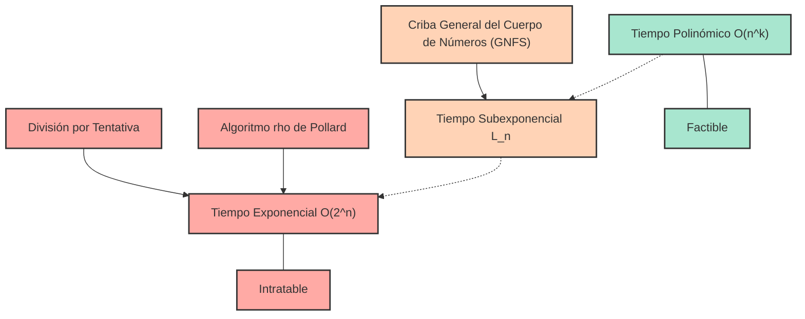
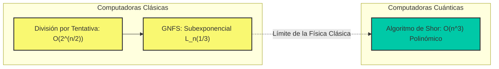

# Introducción: ¿Por qué la factorización de números primos es "difícil"?

En la sociedad de Internet actual, la razón por la que podemos disfrutar de las compras en línea y el intercambio de información confidencial con tranquilidad es la existencia de la "tecnología criptográfica". Y el fundamento que sustenta la seguridad de esta tecnología criptográfica (especialmente el cifrado RSA, que se usa ampliamente) es el hecho matemático de que "la factorización de enteros enormes en números primos es extremadamente difícil".

A primera vista, la factorización de números primos puede parecer una tarea simple de "simplemente descomponer un número en una multiplicación de números primos", pero a medida que aumenta el número de dígitos, se transforma en un problema sumamente difícil que ni las supercomputadoras más rápidas del mundo podrían resolver incluso si estuvieran funcionando durante décadas o siglos. La factorización de números primos que solemos aprender en la escuela es, en el mejor de los casos, la simple tarea de dividir por $2$, $3$ o $5$, pero frente al producto de números primos desconocidos de cientos de dígitos, ese enfoque simple colapsa por completo.

En este artículo, comenzando desde el concepto de "complejidad temporal (notación Big O: $\mathcal{O}$)", que es la base de las ciencias de la información y la computación, explicaremos matemática y detalladamente cuánto tiempo de cálculo requieren varios algoritmos para resolver la factorización de números primos (división por tentativa, algoritmo $\rho$ de Pollard, criba general del cuerpo de números, etc.). Luego, desentrañaremos por qué la factorización en números primos de números gigantescos es prácticamente imposible para las computadoras clásicas, cómo esto protege nuestra información y privacidad, e incluso cómo las computadoras cuánticas cambiarán esta premisa.

---

# Definición estricta de complejidad temporal y notación Big O ($\mathcal{O}$)

Al evaluar el rendimiento y la eficiencia de un algoritmo, no basta con simplemente medir "el tiempo de ejecución del programa (en segundos)". Esto se debe a que el tiempo de ejecución depende en gran medida del rendimiento de la computadora utilizada (como la frecuencia del reloj de la CPU y la velocidad de la memoria), el lenguaje de programación y la optimización del compilador.

Por lo tanto, la **complejidad temporal (Time Complexity)** se utiliza como una métrica de evaluación universal independiente del hardware y el entorno, y la notación utilizada para expresarla es la **notación Big O (Big-O Notation)**. La notación Big O es una notación matemática que expresa cómo el tiempo de ejecución (o el número de pasos de ejecución) de un algoritmo aumenta en relación con el tamaño de los datos de entrada $N$ (la tasa de crecimiento asintótico) cuando $N$ se vuelve muy grande.

## Definición matemática de la notación asintótica

En ciencias de la computación, para las funciones $f(n)$ y $g(n)$, decir que $f(n) = \mathcal{O}(g(n))$ se define matemáticamente de la siguiente manera:

$$ \exists c > 0, \exists n_0 > 0 \text{ s.t. } \forall n \ge n_0, 0 \le f(n) \le c \cdot g(n) $$

Esto significa que "cuando el tamaño de entrada $n$ es lo suficientemente grande ($n \ge n_0$), el crecimiento de la función $f(n)$ está acotado superiormente por un múltiplo constante de $g(n)$". En otras palabras, indica un "límite superior (Upper Bound)" de que el tiempo de procesamiento del algoritmo, incluso en el peor de los casos, estará dentro de un múltiplo constante de $g(n)$.

Del mismo modo, existen notaciones como $\Omega$ (Big-Omega) para indicar un límite inferior, y $\Theta$ (Big-Theta) para los casos en que los límites superior e inferior coinciden, pero en general, al discutir la complejidad temporal del peor caso de un algoritmo, la notación $\mathcal{O}$ es la que se usa con más frecuencia.

## Clases representativas de complejidad temporal

Existen varias clases representativas de complejidad temporal. Veámoslas en orden desde el tiempo de ejecución más corto (más eficiente).

1. **$\mathcal{O}(1)$ : Tiempo constante (Constant time)**
   Es un algoritmo cuyo tiempo de ejecución no cambia por mucho que aumente el tamaño de entrada $N$. Ejemplos de esto incluyen obtener un valor especificando el índice de un arreglo o buscar en una tabla hash (en el caso ideal).

2. **$\mathcal{O}(\log N)$ : Tiempo logarítmico (Logarithmic time)**
   Es un algoritmo altamente eficiente donde, incluso si el tamaño de la entrada se duplica, el tiempo de ejecución solo aumenta en una constante. La "búsqueda binaria (Binary Search)", que busca un valor objetivo en un arreglo ordenado, es un ejemplo representativo. Incluso con 1,000 millones de datos, el objetivo se puede encontrar con solo unas 30 comparaciones.

3. **$\mathcal{O}(N)$ : Tiempo lineal (Linear time)**
   El tiempo de ejecución aumenta proporcionalmente al tamaño de la entrada. Si los datos se multiplican por 10, el tiempo también se multiplica por 10. La "búsqueda lineal", que verifica todos los elementos de un arreglo uno por uno, pertenece a esta categoría.

4. **$\mathcal{O}(N \log N)$ : Tiempo cuasilineal (Linearithmic time)**
   Es un poco más lento que $\mathcal{O}(N)$, pero entra en la categoría eficiente. Muchos de los algoritmos de ordenamiento rápido prácticos, como el ordenamiento por mezcla (Merge Sort) y el ordenamiento rápido (Quick Sort, en su complejidad promedio), tienen esta complejidad temporal.

5. **$\mathcal{O}(N^2)$ : Tiempo polinómico / Tiempo cuadrático (Quadratic time)**
   Cuando el tamaño de la entrada se duplica, el tiempo de ejecución se cuadruplica; si se multiplica por 10, aumenta 100 veces. Los procesamientos simples que usan bucles anidados, el ordenamiento de burbuja (Bubble Sort) y el ordenamiento por inserción (Insertion Sort) caen en esta categoría. Cuando la cantidad de datos supera las decenas de miles, el procesamiento lleva mucho tiempo. Las complejidades temporales expresadas en la forma $\mathcal{O}(N^k)$ se denominan colectivamente **tiempo polinómico (Polynomial time)**.

6. **$\mathcal{O}(2^N)$ : Tiempo exponencial (Exponential time)**
   Un simple aumento de 1 en el tamaño de la entrada duplica el tiempo de ejecución. Es extremadamente ineficiente, y con solo que $N$ llegue a 40 o 50, incluso las computadoras más avanzadas no podrán finalizar el cálculo en un tiempo realista. La búsqueda exhaustiva del problema de la mochila o las soluciones simples para el problema del viajante de comercio pertenecen a esta categoría.

7. **$\mathcal{O}(N!)$ : Tiempo factorial (Factorial time)**
   Aumenta aún más rápido que $\mathcal{O}(2^N)$. Un algoritmo de este tipo probaría todas las permutaciones en el problema del viajante de comercio.

El siguiente diagrama Mermaid es una comparación esquemática de la tasa de crecimiento del tiempo de ejecución (número de pasos) de cada complejidad temporal con respecto al aumento de $N$.

Espero que haya comprendido cuán importante es la diferencia en la complejidad temporal a la hora de elegir un algoritmo. En criptografía, garantizamos la seguridad utilizando intencionalmente problemas que requieren este "tiempo exponencial" o "complejidad temporal cercana a este" (es decir, problemas que no se pueden resolver fácilmente).

---

# El mecanismo del cifrado RSA y el problema de la factorización de números primos

Para comprender por qué es importante la factorización en números primos, repasemos brevemente cómo funciona el cifrado RSA. El cifrado RSA es un sistema criptográfico de clave pública desarrollado en 1977 por Ronald Rivest, Adi Shamir y Leonard Adleman.

### Pasos para la generación de claves
1. Se eligen aleatoriamente dos números primos muy grandes, $p$ y $q$. (Por ejemplo, de 1024 bits de longitud cada uno).
2. Se multiplican para calcular $N = p \times q$. Este $N$ se hace público al mundo entero como parte de la clave pública. (Tendrá una longitud de 2048 bits).
3. Se calcula la función indicatriz de Euler $\phi(N) = (p-1)(q-1)$.
4. Se elige un número entero $e$ que sea coprimo con $\phi(N)$, y esto también se convierte en la clave pública.
5. Se calcula un $d$ (clave privada) de tal manera que $e \times d \equiv 1 \pmod{\phi(N)}$.

Aquí, lo extremadamente importante es el hecho de que **"para descifrar el cifrado es necesaria la clave privada $d$, para calcular $d$ es necesario $\phi(N)$, y para calcular $\phi(N)$, el número $N$ debe ser factorizado en $p$ y $q$"**.

La multiplicación de números primos enormes $p \times q$ se realiza en un instante, pero es desesperadamente difícil encontrar (factorizar) los números primos originales $p$ y $q$ a partir del resultado $N$. Esta propiedad de "función unidireccional (One-way function)" es precisamente el corazón del cifrado RSA.

Aquí hay un punto muy importante a tener en cuenta. El "tamaño de entrada $n$" en el problema de la factorización de números primos no es el tamaño del número $N$ en sí, sino "el número de bits necesarios para representar el número $N$".
Si el número de dígitos de la representación binaria del entero $N$ es $n$, entonces $n \approx \log_2 N$. Es decir, la complejidad del algoritmo debe evaluarse en relación con $n = \log_2 N$ (o $\ln N$), no con $N$.

---

# Historia de los algoritmos de factorización de números primos y su complejidad temporal

A partir de aquí, explicaremos en detalle los mecanismos y complejidades de varios algoritmos para descomponer un número compuesto dado $N$ en el producto de números primos. Esta es también la historia de cómo la humanidad ha desafiado los límites de la factorización de números primos.

## 1. División por tentativa (Trial Division)

El algoritmo más intuitivo y primitivo es la "división por tentativa". Es un método que intenta dividir $N$ por números primos en ordern, comenzando desde $2$.

### Descripción general del algoritmo
Se basa en la propiedad de que los factores primos de $N$ nunca superarán $\sqrt{N}$ (dado que $\sqrt{N} \times \sqrt{N} = N$, si hay un factor primo mayor que eso, necesariamente estará emparejado con un factor primo menor o igual a $\sqrt{N}$).
Por lo tanto, se verifica si es divisible por todos los números (o números primos) hasta $2, 3, 5, 7, \dots, \lfloor\sqrt{N}\rfloor$.

### Evaluación de la complejidad temporal
En el peor de los casos (como cuando $N$ es el producto de dos números primos enormes), es necesario realizar divisiones hasta $\sqrt{N}$.
Como se mencionó anteriormente, dado que el tamaño de entrada $n$ es $n = \log_2 N$, se puede expresar como $N = 2^n$.
Por lo tanto, el número de pasos de cálculo es, como máximo, proporcional a lo siguiente:

$$ \sqrt{N} = \sqrt{2^n} = (2^n)^{1/2} = 2^{n/2} $$

Esto significa que la complejidad temporal es de **$\mathcal{O}(2^{n/2})$** con respecto a la longitud en bits $n$. En otras palabras, la división por tentativa es un **"algoritmo de tiempo puramente exponencial (Exponential time)"** con respecto a $n$.
Por cada aumento de 1 bit en el número de dígitos (el número se duplica), el tiempo de cálculo se multiplica por aproximadamente $\sqrt{2} \approx 1.414$. Si $N$ es un número que supera los 1024 bits (unos 300 dígitos en decimal), el cálculo no terminaría ni siquiera utilizando una cantidad de tiempo equivalente a la edad del universo.

## 2. Método de factorización de Fermat (Fermat's Factorization Method)

Este método fue ideado por el matemático Pierre de Fermat en el siglo XVII. Dado un número compuesto impar $N$, intenta expresar $N$ como la diferencia de dos cuadrados.

$$ N = x^2 - y^2 = (x - y)(x + y) $$

Si se pueden encontrar tales $x$ e $y$, entonces $a = x - y$ y $b = x + y$ serán los factores de $N$.
El algoritmo implica incrementar $x$ gradualmente a partir de $\lceil \sqrt{N} \rceil$ y verificar si $x^2 - N$ es un cuadrado perfecto (el cuadrado de algún entero $y$).
Este método funciona de manera extremadamente rápida cuando los dos factores primos $p$ y $q$ tienen valores muy cercanos. Sin embargo, en un caso general (cuando $p$ y $q$ toman valores que están separados al azar), en última instancia requerirá un tiempo exponencial similar al de la división por tentativa.

## 3. Algoritmo $\rho$ de Pollard (Pollard's rho algorithm)

Uno de los algoritmos ideados para superar los límites de la división por tentativa fue el "Algoritmo $\rho$ (rho) de Pollard", presentado por John Pollard en 1975.

### Descripción general del algoritmo
Este método aplica el concepto probabilístico conocido como la "Paradoja del cumpleaños (Birthday Paradox)" y la periodicidad de las secuencias de números pseudoaleatorios (se llama así porque esta forma se asemeja a la letra griega $\rho$).

Usando una función generadora de números pseudoaleatorios $f(x) = (x^2 + 1) \pmod N$, genera una secuencia de números y encuentra dos valores $x_i \equiv x_j \pmod p$ (donde $p$ es un factor primo desconocido de $N$) dentro de la secuencia.
En este momento, dado que $x_i - x_j$ será un múltiplo de $p$, se puede extraer $p$ (es decir, el factor primo de $N$) con alta probabilidad calculando el máximo común divisor $\gcd(|x_i - x_j|, N)$. Al combinarlo con el algoritmo de detección de ciclos de Robert Floyd (el algoritmo de la liebre y la tortuga), los cálculos se pueden realizar de manera eficiente manteniendo el uso de memoria en $\mathcal{O}(1)$.

### Evaluación de la complejidad temporal
Se sabe que el número de pasos necesarios para que el algoritmo $\rho$ de Pollard encuentre un factor primo $p$ es aproximadamente $\mathcal{O}(\sqrt{p})$.
En el peor de los casos (cuando $N$ es el producto de dos números primos del mismo tamaño $p$ y $q$, resultando en $p \approx \sqrt{N}$), la complejidad es $\mathcal{O}(N^{1/4})$.

Expresado en términos del tamaño de entrada $n = \log_2 N$:

$$ N^{1/4} = (2^n)^{1/4} = 2^{n/4} $$

Por lo tanto, la complejidad temporal es **$\mathcal{O}(2^{n/4})$**.
Es drásticamente más rápido en comparación con el $\mathcal{O}(2^{n/2})$ de la división por tentativa, y en la práctica es muy poderoso para la factorización de números de tamaño mediano (decenas de dígitos). Sin embargo, todavía no ha superado la barrera del "tiempo exponencial" con respecto a la longitud en bits $n$, y es inútil contra números gigantescos de 2048 bits (alrededor de 600 dígitos en decimal) como los que se utilizan en el cifrado RSA.

## 4. Criba cuadrática de polinomios múltiples (MPQS: Multiple Polynomial Quadratic Sieve)

A principios de la década de 1980, Carl Pomerance ideó la "Criba cuadrática (Quadratic Sieve: QS)". Esta es una extensión del concepto de "diferencia de cuadrados" de Fermat.
Mientras que el método de Fermat buscaba directamente $x^2 - y^2 = N$, la criba cuadrática busca condiciones mucho más laxas.

$$ x^2 \equiv y^2 \pmod N $$
y
$$ x \not\equiv \pm y \pmod N $$

Si podemos encontrar un par de $x$ e $y$ así, $x^2 - y^2 = (x - y)(x + y)$ será un múltiplo de $N$. Por lo tanto, calculando $\gcd(x - y, N)$ o $\gcd(x + y, N)$, podemos obtener un factor primo no trivial de $N$.

En la criba cuadrática, encontramos una gran cantidad de $x$ tales que $x^2 \pmod N$ sea un número compuesto únicamente por pequeños factores primos (esto se denomina número $B$-liso), y organizamos los resultados de su factorización en forma de matriz (un sistema de ecuaciones lineales sobre el cuerpo finito $\mathbb{F}_2$). Luego, usando la eliminación gaussiana u otros métodos, multiplicamos múltiples relaciones matemáticas para ajustar el lado derecho y que se convierta en un cuadrado perfecto (haciendo pares los exponentes de cada factor primo), construyendo así $x^2 \equiv y^2 \pmod N$.

La criba cuadrática fue el algoritmo más rápido del mundo hasta la aparición de la criba general del cuerpo de números, y en la actualidad sigue siendo considerado el más rápido para factorizar números de menos de 100 dígitos.

## 5. Profundización en la Criba General del Cuerpo de Números (General Number Field Sieve: GNFS)

Actualmente, se considera que el algoritmo "más rápido del mundo" para la factorización en números primos de enteros gigantes que superan los 100 dígitos es la **Criba General del Cuerpo de Números (GNFS)**. Fue ideado a finales de la década de 1980 y es un algoritmo avanzado que desarrolla aún más la criba cuadrática, utilizando resultados profundos de la teoría algebraica de números (cuerpos de números).

En los ataques al cifrado RSA (factorización de números primos a partir de una clave pública), siempre es este GNFS el que sigue rompiendo récords mundiales. En 2020, hubo un informe de una factorización exitosa de un número compuesto de 829 bits (250 dígitos) (RSA-250), pero esto requirió la operación paralela a gran escala de miles de computadoras durante un largo período.

### Estructura matemática del algoritmo
Aunque GNFS es extremadamente complejo, a grandes rasgos procede en los siguientes pasos:

1. **Selección del polinomio (Polynomial Selection):**
   Para $N$, elegimos un entero $m$ y un polinomio irreducible $f(X)$ con coeficientes pequeños de tal manera que $f(m) \equiv 0 \pmod N$. Esto define el anillo de enteros $\mathbb{Z}[\alpha]$ de un cuerpo algebraico (cuerpo de números) que adjunta la raíz $\alpha$ de $f(X)$.

2. **Criba (Sieving):**
   Buscamos simultáneamente números lisos (Smooth) en los "dos mundos diferentes": el anillo de enteros $\mathbb{Z}$ sobre el cuerpo de los números racionales, y el anillo de enteros $\mathbb{Z}[\alpha]$ sobre el cuerpo algebraico. Específicamente, buscamos una gran cantidad de pares $(a, b)$ de modo que las normas de un entero racional $a - bm$ y de un entero algebraico $a - b\alpha$ se factoricen completamente sobre un conjunto de números primos pequeños predefinidos (Base de Factores: Factor Base).

3. **Reducción de la matriz (Matrix Reduction):**
   Representamos la gran cantidad de pares lisos encontrados como una matriz (una matriz dispersa gigante). Encontramos el espacio de soluciones utilizando el algoritmo de Lanczos (como el método de Lanczos por bloques) sobre el cuerpo finito $\mathbb{F}_2$. No es raro que esta matriz abarque millones de filas $\times$ millones de columnas.

4. **Cálculo de la raíz cuadrada (Square Root):**
   A partir de la solución de la matriz, creamos un número cuadrado gigante en cada uno de los "dos mundos diferentes", y finalmente derivamos la relación $X^2 \equiv Y^2 \pmod N$. Luego, calculamos $\gcd(X-Y, N)$ para obtener los factores primos.

### Complejidad temporal de la criba general del cuerpo de números: Tiempo subexponencial (Sub-exponential time)

El mayor logro de GNFS es que redujo la complejidad temporal de la factorización de números primos de "tiempo puramente exponencial" a **"tiempo subexponencial (Sub-exponential time)"**.
La complejidad temporal asintótica de GNFS se expresa de la siguiente manera usando una notación especial llamada notación L (L-notation).

$$ L_N[\gamma, c] = \exp\left( (c + o(1)) (\ln N)^\gamma (\ln \ln N)^{1-\gamma} \right) $$

Donde $N$ es el número a factorizar y $\ln$ es el logaritmo natural.
$\gamma$ es un parámetro que toma un valor de $0 \le \gamma \le 1$ e indica el "grado" de complejidad del algoritmo.
- Cuando $\gamma = 0$, $L_N[0, c]$ se convierte en $(\ln N)^c$, lo que significa tiempo polinómico $\mathcal{O}(n^c)$. (Eficiente)
- Cuando $\gamma = 1$, $L_N[1, c]$ se convierte en $e^{c \ln N} = N^c$, lo que significa tiempo exponencial $\mathcal{O}(2^{cn})$. (Ineficiente)

En el caso de GNFS, este parámetro es el siguiente:

$$ L_N\left[\frac{1}{3}, \left(\frac{64}{9}\right)^{1/3}\right] = e^{\left(\sqrt[3]{\frac{64}{9}} + o(1)\right) (\ln N)^{1/3} (\ln \ln N)^{2/3}} $$

En esta fórmula, la constante $c = (64/9)^{1/3} \approx 1.923$.
Reescribiéndolo en términos del tamaño de entrada $n \approx \ln N$ (proporcional a la longitud en bits), la complejidad se comporta aproximadamente de la siguiente manera:

$$ \mathcal{O}\left( \exp\left( 1.923 \cdot n^{1/3} (\ln n)^{2/3} \right) \right) $$

Podemos ver que la parte exponencial depende de $n^{1/3}$ (la raíz cúbica de $n$), en lugar de la primera potencia de $n$.
Mientras que el algoritmo $\rho$ de Pollard era de $\mathcal{O}(2^{n/4})$, es decir, $\mathcal{O}(\exp(c \cdot n^1))$, el grado de $n$ en GNFS se ha reducido a $1/3$.
Esto significa que, aunque no alcanza el tiempo polinómico ($\gamma=0$), la complejidad temporal aumenta mucho más lentamente que en el tiempo puramente exponencial ($\gamma=1$). Esta es la razón por la que se le llama "tiempo subexponencial".

---

# Los límites de la criptografía moderna y la computación cuántica

Como hemos visto hasta ahora, la humanidad ha movilizado su sabiduría matemática para continuar desafiando las barreras de la factorización de números primos mediante la evolución de algoritmos, desde la división por tentativa hasta el GNFS. Sin embargo, incluso con el GNFS, la factorización de números primos aún no se puede resolver en "tiempo polinómico" en una computadora clásica.

## El problema P vs NP y la posición de la factorización de números primos

El mayor problema sin resolver en la informática es la "hipótesis P = NP".
El problema de la factorización de números primos pertenece a NP (la clase de problemas para los cuales la corrección de una respuesta proporcionada se puede verificar en tiempo polinómico), pero no se ha demostrado que sea NP-completo (la clase de problemas más difíciles dentro de NP).
Además, tampoco está resuelto si pertenece a P (la clase de problemas que se pueden resolver en tiempo polinómico) (es decir, si existe un algoritmo de tiempo polinómico).

Muchos investigadores conjeturan que la factorización de números primos pertenece a una clase intermedia (NP-intermediate) que no es ni P ni NP-completa. Si se descubriera un algoritmo que resuelva la factorización de números primos en tiempo polinómico en una computadora clásica (por ejemplo, $\mathcal{O}(n^3)$), sería un evento monumental que colapsaría los sistemas criptográficos de todo el mundo; sin embargo, hasta la fecha, no se ha descubierto tal algoritmo. Se estima que descifrar un cifrado RSA de 2048 bits tomaría un tiempo mayor que la edad del universo, incluso asumiendo que las mejoras de rendimiento en computadoras clásicas sigan la Ley de Moore.

## Las computadoras cuánticas como "cambiadores de juego": El algoritmo de Shor

Aunque el cifrado RSA es robusto en las computadoras clásicas, la situación cambiará drásticamente cuando las "computadoras cuánticas", que operan bajo principios completamente diferentes, se vuelvan viables.
El **"Algoritmo de Shor (Shor's algorithm)"**, publicado por Peter Shor en 1994, es un algoritmo que puede resolver de manera asombrosa la factorización de números primos en **tiempo polinómico $\mathcal{O}(n^3)$** (más estrictamente, alrededor de $\mathcal{O}(n^2 \log n \log \log n)$ en términos de número de puertas cuánticas) aprovechando la transformada cuántica de Fourier.

Verifiquemos la diferencia en la complejidad temporal entre los algoritmos clásicos y cuánticos en el siguiente diagrama Mermaid.

En el algoritmo de Shor, el proceso de "búsqueda de período", que era un cuello de botella en los algoritmos clásicos, se calcula de manera instantánea y paralela mediante la "Transformada Cuántica de Fourier (QFT)" utilizando entrelazamiento y superposición cuántica.
Una vez que pueda ejecutarse en una computadora cuántica a escala práctica (con poco ruido y suficientes qubits lógicos), el cifrado RSA de 2048 bits que hoy se considera seguro podría descifrarse por completo en un plazo de unas horas a unos días.

Para prepararse para esta amenaza, criptógrafos de todo el mundo y el NIST (Instituto Nacional de Estándares y Tecnología de EE.UU.) están avanzando rápidamente en los trabajos de estandarización hacia la transición a la "Criptografía Post-Cuántica (PQC: Post-Quantum Cryptography)", la cual es difícil de descifrar incluso para las computadoras cuánticas. La criptografía basada en retículos (Lattice-based cryptography) es un ejemplo representativo, que basa su seguridad en dificultades matemáticas (como el problema del vector más corto) que son completamente diferentes del problema de la factorización de números primos.

---

# Resumen

En este artículo, comenzando desde los conceptos básicos de la complejidad temporal (notación Big O), hemos profundizado en la evolución de los algoritmos de factorización de números primos y sus límites matemáticos.

* La **notación Big O ($\mathcal{O}$)** es un indicador importante que muestra la tasa de aumento en el número de pasos computacionales con respecto a un aumento en el tamaño de la entrada $n$, y existe un muro enorme, prácticamente insuperable en la práctica, entre el tiempo polinómico y el tiempo exponencial.
* La **división por tentativa** y el **algoritmo $\rho$ de Pollard** son algoritmos puros de "tiempo exponencial" y son impotentes frente a números gigantescos.
* El algoritmo clásico más rápido en la actualidad, la **Criba General del Cuerpo de Números (GNFS)**, logró un "tiempo subexponencial" haciendo pleno uso de la teoría algebraica avanzada de números, pero aun así no alcanza el tiempo polinómico y requiere una cantidad de tiempo astronómica para factorizar números enormes.
* El hecho de que **"se conjetura fuertemente que no existe ningún algoritmo clásico que resuelva el problema en tiempo polinómico"** es exactamente lo que garantiza la seguridad del cifrado RSA y apoya a la sociedad digital moderna.
* Sin embargo, con el advenimiento de las **computadoras cuánticas y el algoritmo de Shor**, la factorización de números primos en tiempo polinómico se ha vuelto teóricamente posible, y la tecnología de cifrado está a punto de dar el salto a la próxima era (criptografía post-cuántica).

El hecho de que un concepto abstracto como la complejidad temporal de un algoritmo esté directamente vinculado a la seguridad de nuestras vidas es uno de los aspectos más fascinantes y emocionantes de la informática y las matemáticas. No deje de seguir de cerca la futura evolución de la tecnología, especialmente las tendencias en el desarrollo de las computadoras cuánticas y los cambios en la tecnología criptográfica.
