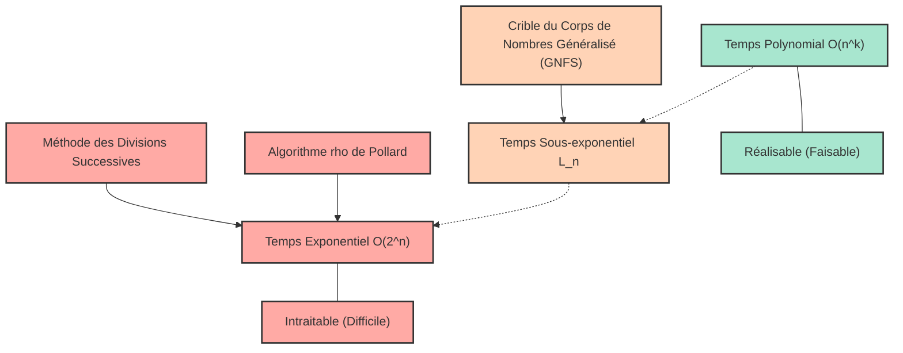
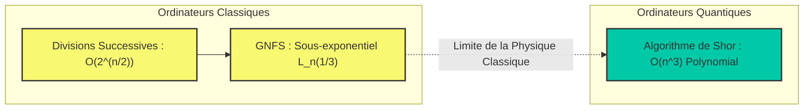

# Introduction : Pourquoi la factorisation en nombres premiers est-elle « difficile » ?

Dans la société Internet moderne, si nous pouvons faire des achats en ligne en toute tranquillité et échanger des informations confidentielles, c'est grâce à l'existence de la « cryptographie ». Et la sécurité de cette cryptographie (en particulier le chiffrement RSA, largement utilisé) repose sur un fait mathématique : « la factorisation de très grands nombres entiers en nombres premiers est extrêmement difficile ».

À première vue, la factorisation en nombres premiers peut sembler être une tâche simple consistant « juste à décomposer un nombre en produits de nombres premiers ». Cependant, lorsque le nombre de chiffres devient important, cela se transforme en un problème tellement complexe que même les superordinateurs les plus rapides du monde, fonctionnant pendant des décennies ou des siècles, ne pourraient le résoudre. La factorisation que nous apprenons à l'école est au mieux une tâche simple consistant à diviser par $2$, $3$ ou $5$, mais face au produit de deux nombres premiers inconnus de plusieurs centaines de chiffres, cette approche simpliste s'effondre complètement.

Dans cet article, en partant du concept de « complexité algorithmique (notation Grand O : $\mathcal{O}$) », qui est la base de l'informatique, nous expliquerons en détail et mathématiquement combien de temps de calcul nécessitent divers algorithmes de factorisation (méthode des divisions successives, algorithme $\rho$ de Pollard, crible du corps de nombres généralisé, etc.). Ensuite, nous analyserons pourquoi la factorisation de nombres géants est pratiquement impossible sur des ordinateurs classiques, comment cela protège nos informations et notre vie privée, et enfin, comment les ordinateurs quantiques pourraient bouleverser ce paradigme.

---

# Définition rigoureuse de la complexité algorithmique et de la notation Grand O ($\mathcal{O}$)

Lors de l'évaluation des performances ou de l'efficacité d'un algorithme, il ne suffit pas de mesurer simplement le « temps d'exécution (en secondes) » du programme. En effet, le temps d'exécution dépend fortement des performances de l'ordinateur utilisé (fréquence d'horloge du processeur, vitesse de la mémoire, etc.), du langage de programmation et des optimisations du compilateur.

Par conséquent, l'indicateur d'évaluation universel indépendant du matériel et de l'environnement est la **complexité temporelle (Time Complexity)**, et la notation utilisée pour l'exprimer est la **notation Grand O (Big-O Notation)**. La notation Grand O est une écriture mathématique qui décrit comment le temps d'exécution (ou le nombre d'étapes d'exécution) d'un algorithme augmente par rapport à la taille des données d'entrée $N$ lorsque celle-ci devient très grande (taux de croissance asymptotique).

## Définition mathématique de la notation asymptotique

En informatique, pour les fonctions $f(n)$ et $g(n)$, l'expression $f(n) = \mathcal{O}(g(n))$ est définie mathématiquement comme suit :

$$ \exists c > 0, \exists n_0 > 0 \text{ s.t. } \forall n \ge n_0, 0 \le f(n) \le c \cdot g(n) $$

Cela signifie que « lorsque la taille de l'entrée $n$ est suffisamment grande ($n \ge n_0$), la croissance de la fonction $f(n)$ est bornée supérieurement par $g(n)$ multipliée par une constante ». En d'autres termes, cela indique une « borne supérieure (Upper Bound) », garantissant que même dans le pire des cas, le temps de traitement de l'algorithme restera dans une constante multipliée par $g(n)$.

De même, il existe la notation $\Omega$ (Grand Oméga) pour indiquer une borne inférieure, et $\Theta$ (Grand Thêta) lorsque les bornes supérieure et inférieure coïncident. Cependant, la notation $\mathcal{O}$ est la plus fréquemment utilisée pour discuter de la complexité dans le pire des cas d'un algorithme.

## Classes de complexité représentatives

Il existe plusieurs classes représentatives de complexité algorithmique. Examinons-les dans l'ordre, du temps d'exécution le plus court (le plus efficace) au plus long.

1. **$\mathcal{O}(1)$ : Temps constant (Constant time)**
   Un algorithme dont le temps d'exécution ne change pas, quelle que soit la taille de l'entrée $N$. Par exemple, l'accès à une valeur en spécifiant l'index d'un tableau, ou la recherche dans une table de hachage (dans le cas idéal).

2. **$\mathcal{O}(\log N)$ : Temps logarithmique (Logarithmic time)**
   Un algorithme très efficace où même si la taille de l'entrée double, le temps d'exécution n'augmente que d'une constante. La « recherche dichotomique (Binary Search) », qui recherche une valeur cible dans un tableau trié, en est un exemple typique. Même avec un milliard de données, il suffit d'environ 30 comparaisons pour trouver la donnée souhaitée.

3. **$\mathcal{O}(N)$ : Temps linéaire (Linear time)**
   Le temps d'exécution augmente proportionnellement à la taille de l'entrée. Si les données sont multipliées par 10, le temps sera également multiplié par 10. La « recherche linéaire », qui vérifie tous les éléments d'un tableau dans l'ordre, correspond à ce cas.

4. **$\mathcal{O}(N \log N)$ : Temps quasi-linéaire (Linearithmic time)**
   Un peu plus lent que $\mathcal{O}(N)$, mais toujours considéré comme efficace. De nombreux algorithmes de tri rapide pratiques, tels que le tri fusion (Merge Sort) et le tri rapide (Quick Sort, complexité moyenne), ont cette complexité.

5. **$\mathcal{O}(N^2)$ : Temps polynomial / Temps quadratique (Quadratic time)**
   Lorsque la taille de l'entrée double, le temps d'exécution quadruple ; si elle est multipliée par 10, il est multiplié par 100. Les traitements simples utilisant des boucles imbriquées, le tri à bulles ou le tri par insertion en font partie. Si la quantité de données dépasse plusieurs dizaines de milliers, le traitement commence à prendre beaucoup de temps. Ces complexités exprimées sous la forme $\mathcal{O}(N^k)$ sont collectivement appelées **temps polynomial (Polynomial time)**.

6. **$\mathcal{O}(2^N)$ : Temps exponentiel (Exponential time)**
   Il suffit que la taille de l'entrée augmente de 1 pour que le temps d'exécution double. C'est extrêmement inefficace : dès que $N$ atteint 40 ou 50, même les ordinateurs de pointe ne peuvent plus terminer le calcul dans un temps réaliste. La recherche exhaustive du problème du sac à dos, ou la solution naïve du problème du voyageur de commerce en sont des exemples.

7. **$\mathcal{O}(N!)$ : Temps factoriel (Factorial time)**
   Il augmente encore plus rapidement que $\mathcal{O}(2^N)$. C'est le cas d'un algorithme qui testerait toutes les permutations possibles pour le problème du voyageur de commerce.

Le diagramme Mermaid ci-dessous est une comparaison schématique du taux d'augmentation du temps d'exécution (nombre d'étapes) pour chaque classe de complexité par rapport à l'augmentation de $N$.

Vous comprenez désormais à quel point la différence de complexité est cruciale dans le choix d'un algorithme. En cryptographie, la sécurité est garantie en utilisant intentionnellement des problèmes qui nécessitent un « temps exponentiel » ou une « complexité proche » (c'est-à-dire des problèmes qui ne peuvent pas être résolus facilement).

---

# Mécanisme du chiffrement RSA et le problème de la factorisation en nombres premiers

Pour comprendre pourquoi la factorisation en nombres premiers est importante, rappelons brièvement le fonctionnement du chiffrement RSA. Le chiffrement RSA est un système de cryptographie à clé publique développé en 1977 par Ronald Rivest, Adi Shamir et Leonard Adleman.

### Étapes de génération des clés
1. Deux très grands nombres premiers $p$ et $q$ sont choisis au hasard (par exemple, chacun d'une longueur de 1024 bits).
2. Ils sont multipliés pour calculer $N = p \times q$. Ce $N$ est publié dans le monde entier comme faisant partie de la clé publique (il aura une longueur de 2048 bits).
3. L'indicatrice d'Euler $\phi(N) = (p-1)(q-1)$ est calculée.
4. Un entier $e$ premier avec $\phi(N)$ est choisi et devient également une partie de la clé publique.
5. Une clé privée $d$ est calculée de sorte que $e \times d \equiv 1 \pmod{\phi(N)}$.

Le point crucial ici est le fait que **« pour déchiffrer le message, la clé privée $d$ est nécessaire ; pour calculer $d$, $\phi(N)$ est nécessaire ; et pour calculer $\phi(N)$, il faut factoriser $N$ en $p$ et $q$ »**.

La multiplication de très grands nombres premiers $p \times q$ se fait en un instant, mais retrouver les $p$ et $q$ d'origine à partir du résultat $N$ (factorisation en nombres premiers) est désespérément difficile. Cette nature de « fonction à sens unique (One-way function) » est le cœur même du chiffrement RSA.

Il y a un point très important à noter ici. La « taille de l'entrée $n$ » dans le problème de la factorisation n'est pas la grandeur du nombre $N$ lui-même, mais le « nombre de bits nécessaires pour représenter le nombre $N$ ».
Si $n$ est le nombre de chiffres lors de la représentation de l'entier $N$ en binaire, alors $n \approx \log_2 N$. En d'autres termes, la complexité de l'algorithme doit être évaluée par rapport à $n = \log_2 N$ (ou $\ln N$), et non à $N$.

---

# Histoire des algorithmes de factorisation en nombres premiers et leur complexité

À partir d'ici, nous expliquerons en détail le fonctionnement et la complexité des divers algorithmes utilisés pour décomposer un nombre composé donné $N$ en produit de nombres premiers. C'est aussi l'histoire de la façon dont l'humanité a défié les limites de la factorisation.

## 1. Méthode des divisions successives (Trial Division)

L'algorithme le plus intuitif et primitif est la « méthode des divisions successives ». Il consiste à essayer de diviser $N$ par des nombres premiers dans l'ordre, à partir de $2$.

### Aperçu de l'algorithme
Il tire parti de la propriété selon laquelle les facteurs premiers de $N$ ne dépasseront jamais $\sqrt{N}$ (puisque $\sqrt{N} \times \sqrt{N} = N$, s'il existait un facteur premier plus grand, il serait nécessairement associé à un facteur premier inférieur ou égal à $\sqrt{N}$).
Par conséquent, on vérifie si $N$ est divisible par tous les nombres (ou nombres premiers) jusqu'à $\lfloor\sqrt{N}\rfloor$ : $2, 3, 5, 7, \dots$.

### Évaluation de la complexité
Dans le pire des cas (par exemple, si $N$ est le produit de deux très grands nombres premiers), il faut effectuer des divisions jusqu'à $\sqrt{N}$.
Comme mentionné précédemment, la taille de l'entrée $n$ est $n = \log_2 N$, on peut donc exprimer $N = 2^n$.
Ainsi, le nombre maximal d'étapes de calcul est proportionnel à :

$$ \sqrt{N} = \sqrt{2^n} = (2^n)^{1/2} = 2^{n/2} $$

Cela signifie que pour une longueur de bit $n$, la complexité est **$\mathcal{O}(2^{n/2})$**. Autrement dit, la méthode des divisions successives est un algorithme à **« temps exponentiel pur (Exponential time) »** par rapport à $n$.
Chaque fois que le nombre de bits augmente de 1 (le nombre double), le temps de calcul est multiplié par environ $\sqrt{2} \approx 1,414$. Si $N$ est un nombre dépassant 1024 bits (environ 300 chiffres en décimal), même en y consacrant un temps égal à l'âge de l'univers, le calcul ne s'achèverait pas.

## 2. Méthode de factorisation de Fermat (Fermat's Factorization Method)

Il s'agit d'une méthode inventée par le mathématicien du 17ème siècle, Pierre de Fermat. Étant donné un nombre composé impair $N$, on tente de représenter $N$ comme la différence de deux carrés.

$$ N = x^2 - y^2 = (x - y)(x + y) $$

Si l'on trouve de tels $x$ et $y$, alors $a = x - y$ et $b = x + y$ seront les facteurs de $N$.
Dans l'algorithme, on augmente $x$ progressivement à partir de $\lceil \sqrt{N} \rceil$ et on vérifie si $x^2 - N$ est un carré parfait (le carré d'un entier $y$).
Cette méthode fonctionne de manière extrêmement rapide lorsque les deux facteurs premiers $p$ et $q$ sont très proches en valeur. Cependant, dans le cas général (où $p$ et $q$ ont des valeurs aléatoirement distantes), elle nécessite finalement un temps exponentiel similaire à celui de la méthode des divisions successives.

## 3. Algorithme $\rho$ de Pollard (Pollard's rho algorithm)

L'un des algorithmes conçus pour dépasser les limites de la méthode des divisions successives est « l'algorithme $\rho$ (rho) de Pollard », publié par John Pollard en 1975.

### Aperçu de l'algorithme
Cette méthode applique un concept probabiliste appelé « paradoxe des anniversaires (Birthday Paradox) » et la périodicité des suites pseudo-aléatoires (qui ressemble à la forme de la lettre grecque $\rho$, d'où son nom).

En utilisant une certaine fonction génératrice de nombres pseudo-aléatoires $f(x) = (x^2 + 1) \pmod N$, on génère une suite et on cherche deux valeurs dans la suite telles que $x_i \equiv x_j \pmod p$ (où $p$ est un facteur premier inconnu de $N$).
À ce stade, comme $x_i - x_j$ est un multiple de $p$, on peut extraire $p$ (c'est-à-dire un facteur premier de $N$) avec une forte probabilité en calculant le plus grand commun diviseur $\gcd(|x_i - x_j|, N)$. En combinant cela avec l'algorithme de détection de cycle de Robert Floyd (algorithme du lièvre et de la tortue), le calcul se fait efficacement tout en maintenant l'utilisation de la mémoire à $\mathcal{O}(1)$.

### Évaluation de la complexité
Il est connu que le nombre d'étapes nécessaires pour que l'algorithme $\rho$ de Pollard trouve un facteur premier $p$ est d'environ $\mathcal{O}(\sqrt{p})$.
Dans le pire des cas (lorsque $N$ est le produit de deux nombres premiers $p, q$ de même taille, tel que $p \approx \sqrt{N}$), la complexité est de $\mathcal{O}(N^{1/4})$.

Exprimé avec la taille d'entrée $n = \log_2 N$ :

$$ N^{1/4} = (2^n)^{1/4} = 2^{n/4} $$

Par conséquent, la complexité est **$\mathcal{O}(2^{n/4})$**.
Par rapport au $\mathcal{O}(2^{n/2})$ de la méthode des divisions successives, l'accélération est spectaculaire, et elle est très puissante en pratique pour factoriser des nombres de taille moyenne (plusieurs dizaines de chiffres). Cependant, elle ne parvient toujours pas à franchir la barrière du « temps exponentiel » par rapport à la longueur de bit $n$, la rendant impuissante face aux nombres gigantesques de 2048 bits (environ 600 chiffres décimaux) utilisés dans le chiffrement RSA.

## 4. Crible Quadratique à Polys Multiples (MPQS: Multiple Polynomial Quadratic Sieve)

Au début des années 1980, Carl Pomerance a inventé le « crible quadratique (Quadratic Sieve : QS) ». C'est une extension du concept de la « différence de carrés » de Fermat.
Alors que la méthode de Fermat cherchait directement $x^2 - y^2 = N$, le crible quadratique recherche une condition beaucoup plus souple.

$$ x^2 \equiv y^2 \pmod N $$
et
$$ x \not\equiv \pm y \pmod N $$

Si l'on peut trouver une telle paire $x, y$, alors $x^2 - y^2 = (x - y)(x + y)$ est un multiple de $N$. Par conséquent, en calculant $\gcd(x - y, N)$ ou $\gcd(x + y, N)$, on peut obtenir un facteur premier non trivial de $N$.

Dans le crible quadratique, on trouve un grand nombre de $x$ tels que $x^2 \pmod N$ donne un « nombre n'ayant que de petits facteurs premiers (ce qu'on appelle un nombre $B$-friable) », et on dispose le résultat de leurs factorisations sous forme de matrice (un système d'équations linéaires sur le corps fini $\mathbb{F}_2$). Ensuite, on utilise l'élimination de Gauss ou des méthodes similaires pour multiplier plusieurs relations entre elles, afin d'ajuster le côté droit pour qu'il devienne un carré parfait (les exposants de chaque facteur premier deviennent pairs), construisant ainsi $x^2 \equiv y^2 \pmod N$.

Le crible quadratique fut l'algorithme le plus rapide au monde jusqu'à l'apparition du crible du corps de nombres généralisé, et il est toujours considéré comme le plus rapide pour factoriser des nombres de moins de 100 chiffres.

## 5. Examen approfondi du Crible du Corps de Nombres Généralisé (General Number Field Sieve : GNFS)

Actuellement, l'algorithme réputé « le plus rapide au monde » pour la factorisation de nombres entiers géants dépassant 100 chiffres est le **crible du corps de nombres généralisé (GNFS)**. Conçu à la fin des années 1980, il s'agit d'un algorithme très sophistiqué qui prolonge le crible quadratique en utilisant des résultats profonds de la théorie algébrique des nombres (corps de nombres).

Dans les attaques contre le chiffrement RSA (factorisation à partir de la clé publique), c'est toujours ce GNFS qui bat les records mondiaux. En 2020, on a signalé le succès de la factorisation d'un nombre composé de 829 bits (250 chiffres) (RSA-250), mais cela a nécessité l'exécution en parallèle de milliers d'ordinateurs sur une longue période.

### Structure mathématique de l'algorithme
Le GNFS est extrêmement complexe, mais il se déroule grossièrement selon les étapes suivantes.

1. **Sélection du polynôme (Polynomial Selection):**
   Pour $N$, on choisit un entier $m$ et un polynôme irréductible $f(X)$ avec de petits coefficients tel que $f(m) \equiv 0 \pmod N$. Cela définit l'anneau des entiers $\mathbb{Z}[\alpha]$ du corps algébrique (corps de nombres) obtenu en ajoutant la racine $\alpha$ de $f(X)$.

2. **Criblage (Sieving):**
   On recherche des nombres friables (Smooth) simultanément dans « deux mondes différents » : l'anneau des entiers rationnels $\mathbb{Z}$ et l'anneau des entiers algébriques $\mathbb{Z}[\alpha]$. Concrètement, on trouve un grand nombre de paires $(a, b)$ telles que la norme de l'entier rationnel $a - bm$ et de l'entier algébrique $a - b\alpha$ se factorisent complètement sur un ensemble de petits nombres premiers prédéfini (la base de facteurs : Factor Base).

3. **Réduction de matrice (Matrix Reduction):**
   On représente l'énorme quantité de paires friables trouvées sous forme de matrice (une gigantesque matrice creuse). On recherche l'espace des solutions sur le corps fini $\mathbb{F}_2$ à l'aide de l'algorithme de Lanczos (comme la méthode de Lanczos par blocs). Il n'est pas rare que cette matrice atteigne des millions de lignes sur des millions de colonnes.

4. **Calcul de la racine carrée (Square Root):**
   À partir de la solution de la matrice, on crée un carré parfait géant dans chacun des « deux mondes différents », pour finalement dériver la relation $X^2 \equiv Y^2 \pmod N$. Ensuite, on calcule $\gcd(X-Y, N)$ pour obtenir les facteurs premiers.

### Complexité du crible du corps de nombres généralisé : Temps sous-exponentiel (Sub-exponential time)

La plus grande réalisation du GNFS est d'avoir réduit la complexité de la factorisation du « temps exponentiel pur » au **« temps sous-exponentiel (Sub-exponential time) »**.
La complexité temporelle asymptotique du GNFS s'exprime à l'aide d'une notation spéciale appelée notation L (L-notation) :

$$ L_N[\gamma, c] = \exp\left( (c + o(1)) (\ln N)^\gamma (\ln \ln N)^{1-\gamma} \right) $$

Où $N$ est le nombre à factoriser et $\ln$ est le logarithme népérien.
$\gamma$ est un paramètre compris entre $0 \le \gamma \le 1$ qui indique le « degré » de complexité de l'algorithme.
- Lorsque $\gamma = 0$, $L_N[0, c]$ devient $(\ln N)^c$, ce qui signifie un temps polynomial $\mathcal{O}(n^c)$. (Efficace)
- Lorsque $\gamma = 1$, $L_N[1, c]$ devient $e^{c \ln N} = N^c$, ce qui signifie un temps exponentiel $\mathcal{O}(2^{cn})$. (Inefficace)

Dans le cas du GNFS, ce paramètre est le suivant :

$$ L_N\left[\frac{1}{3}, \left(\frac{64}{9}\right)^{1/3}\right] = e^{\left(\sqrt[3]{\frac{64}{9}} + o(1)\right) (\ln N)^{1/3} (\ln \ln N)^{2/3}} $$

Dans cette équation, la constante $c = (64/9)^{1/3} \approx 1,923$.
Si on la réécrit avec la taille de l'entrée $n \approx \ln N$ (proportionnelle à la longueur des bits), la complexité se comporte approximativement comme suit :

$$ \mathcal{O}\left( \exp\left( 1,923 \cdot n^{1/3} (\ln n)^{2/3} \right) \right) $$

On constate que la partie exponentielle ne dépend pas de $n$ à la puissance 1, mais de $n^{1/3}$ (la racine cubique de $n$).
Alors que l'algorithme $\rho$ de Pollard était en $\mathcal{O}(2^{n/4})$, c'est-à-dire $\mathcal{O}(\exp(c \cdot n^1))$, le GNFS a fait chuter le degré de $n$ à $1/3$.
Cela signifie que bien qu'on n'atteigne pas le temps polynomial ($\gamma=0$), la complexité croît beaucoup plus lentement que pour un temps exponentiel pur ($\gamma=1$). C'est la raison pour laquelle on l'appelle « temps sous-exponentiel ».

---

# Limites de la cryptographie moderne et ordinateurs quantiques

Comme nous l'avons vu, l'humanité a mobilisé la sagesse mathématique pour repousser les limites de la factorisation en faisant évoluer les algorithmes, de la méthode des divisions successives au GNFS. Cependant, même avec le GNFS, la factorisation n'a toujours pas pu être résolue en « temps polynomial » sur des ordinateurs classiques.

## Le problème P vs NP et la position de la factorisation en nombres premiers

L'un des plus grands problèmes non résolus de l'informatique est la « conjecture P = NP ».
Le problème de la factorisation appartient à NP (la classe des problèmes dont la solution, si elle est donnée, peut être vérifiée en temps polynomial), mais il n'a pas été prouvé qu'il soit NP-complet (la classe des problèmes les plus difficiles dans NP).
De plus, il n'est pas encore prouvé s'il appartient à P (la classe des problèmes solvables en temps polynomial), c'est-à-dire s'il existe un algorithme en temps polynomial pour le résoudre.

De nombreux chercheurs supposent que la factorisation appartient à une classe intermédiaire entre P et NP-complet (NP-intermédiaire). Si un algorithme résolvant la factorisation en temps polynomial sur un ordinateur classique (par exemple, $\mathcal{O}(n^3)$) venait à être découvert, ce serait un événement majeur qui ferait s'effondrer les systèmes cryptographiques du monde entier ; cependant, jusqu'à présent, aucun algorithme de ce type n'a été trouvé. Il est estimé que le déchiffrement d'une clé RSA de 2048 bits prendrait plus de temps que la durée de vie de l'univers, même si les performances des ordinateurs classiques continuaient à s'améliorer selon la loi de Moore.

## L'ordinateur quantique, un « changeur de donne (Game Changer) » : l'algorithme de Shor

Alors que le chiffrement RSA est robuste face aux ordinateurs classiques, la situation changera radicalement avec la mise en pratique des « ordinateurs quantiques », qui fonctionnent sur des principes totalement différents.
Publié en 1994 par Peter Shor, l'**« algorithme de Shor (Shor's algorithm) »** est un algorithme capable de résoudre la factorisation en nombres premiers en **temps polynomial $\mathcal{O}(n^3)$** (ou plus précisément, environ $\mathcal{O}(n^2 \log n \log \log n)$ en termes de portes quantiques), de manière stupéfiante, grâce à la transformée de Fourier quantique.

Voyons la différence de complexité entre les algorithmes classiques et quantiques dans le diagramme Mermaid suivant.

Dans l'algorithme de Shor, le processus de « recherche de période », qui constituait un goulot d'étranglement dans les algorithmes classiques, est calculé en parallèle et en un instant grâce à l'intrication et à la superposition quantiques utilisant la « transformée de Fourier quantique (QFT) ».
S'il devient possible de l'exécuter sur un ordinateur quantique de taille pratique (avec peu de bruit et un nombre suffisant de qubits logiques), la clé RSA de 2048 bits, actuellement considérée comme sûre, pourrait être complètement déchiffrée en quelques heures à quelques jours.

Pour se prémunir contre cette menace, les cryptographes du monde entier et le NIST (Institut national des normes et de la technologie aux États-Unis) accélèrent actuellement les travaux de normalisation pour la transition vers la « Cryptographie post-quantique (Post-Quantum Cryptography : PQC) », qui reste difficile à déchiffrer même pour les ordinateurs quantiques. La cryptographie fondée sur les réseaux euclidiens (Lattice-based cryptography) en est un exemple représentatif, sa sécurité reposant sur une difficulté mathématique totalement différente de celle de la factorisation (par exemple, le problème du vecteur le plus court).

---

# Conclusion

Dans cet article, en partant des bases de la complexité algorithmique (notation Grand O), nous avons exploré en profondeur l'évolution des algorithmes de factorisation et leurs limites mathématiques.

* La **notation Grand O ($\mathcal{O}$)** est un indicateur clé montrant le taux de croissance du nombre d'étapes de calcul par rapport à l'augmentation de la taille d'entrée $n$, et il existe un fossé infranchissable en pratique entre le temps polynomial et le temps exponentiel.
* La **méthode des divisions successives** et l'**algorithme $\rho$ de Pollard** sont de purs algorithmes en « temps exponentiel », impuissants face aux nombres gigantesques.
* Le **crible du corps de nombres généralisé (GNFS)**, actuellement le plus rapide des algorithmes classiques, a atteint un temps « sous-exponentiel » en exploitant une théorie algébrique des nombres avancée, mais n'atteint toujours pas un temps polynomial, et la factorisation de nombres énormes prendrait un temps astronomique.
* Le fait **« qu'il n'existe pas (ou qu'on suppose fortement qu'il n'existe pas) d'algorithme classique résolvant ce problème en temps polynomial »** est exactement ce qui garantit la sécurité du chiffrement RSA et soutient notre société numérique moderne.
* Cependant, avec l'avènement de **l'ordinateur quantique et de l'algorithme de Shor**, la factorisation en temps polynomial devient théoriquement possible, et la technologie cryptographique s'apprête à entrer dans une nouvelle ère (la cryptographie post-quantique).

Le fait qu'un concept aussi abstrait que la complexité d'un algorithme soit directement lié à la sécurité de notre quotidien est l'un des aspects les plus fascinants et palpitants de l'informatique et des mathématiques. Nous vous invitons à rester attentifs aux futurs développements technologiques, en particulier à l'évolution des ordinateurs quantiques et aux transitions de la technologie cryptographique.
