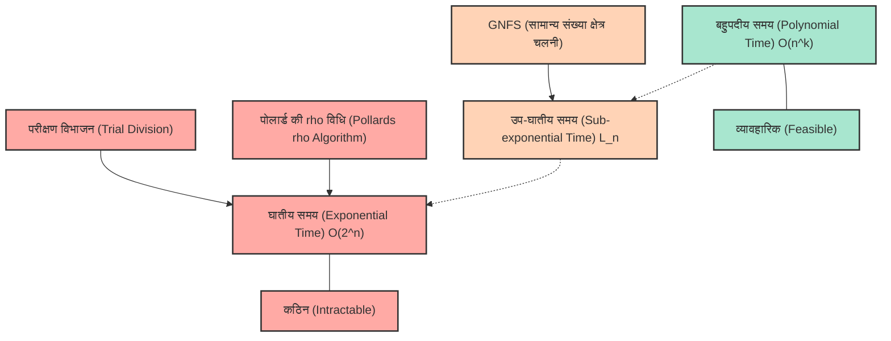
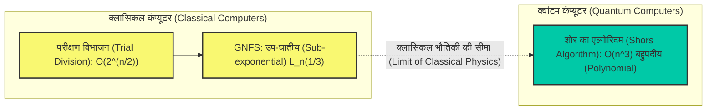

# परिचय: अभाज्य गुणनखंडन "कठिन" क्यों है?

आधुनिक इंटरनेट समाज में, हम सुरक्षित रूप से ऑनलाइन खरीदारी का आनंद ले सकते हैं और गोपनीय जानकारी का आदान-प्रदान कर सकते हैं क्योंकि "क्रिप्टोग्राफी" (Cryptography) तकनीक मौजूद है। और इस क्रिप्टोग्राफी तकनीक (विशेष रूप से व्यापक रूप से उपयोग किए जाने वाले RSA एन्क्रिप्शन आदि) की सुरक्षा का मूल आधार एक गणितीय तथ्य है कि "विशाल पूर्णांकों का अभाज्य गुणनखंडन (Prime Factorization) बेहद कठिन है"।

पहली नज़र में, अभाज्य गुणनखंडन "किसी संख्या को अभाज्य संख्याओं (prime numbers) के गुणनफल में तोड़ने" जैसा एक सरल कार्य लग सकता है, लेकिन जैसे-जैसे अंकों की संख्या बढ़ती है, यह एक इतनी कठिन समस्या में बदल जाता है कि दुनिया के सबसे तेज़ सुपर कंप्यूटर भी इसे हल करने के लिए दशकों या सदियों तक काम करके भी हल नहीं कर सकते। हम जो अभाज्य गुणनखंडन आम तौर पर स्कूल में सीखते हैं, वह अधिक से अधिक $2$, $3$, या $5$ से भाग देने का एक सरल कार्य है, लेकिन जब सैकड़ों अंकों वाले अज्ञात अभाज्य संख्याओं के गुणनफल का सामना करना पड़ता है, तो वह सरल दृष्टिकोण पूरी तरह से विफल हो जाता है।

इस लेख में, हम सूचना विज्ञान और कंप्यूटर विज्ञान के मूल सिद्धांत "कम्प्यूटेशनल जटिलता (Big-O Notation: $\mathcal{O}$ notation)" की अवधारणा से शुरू करेंगे, और विस्तार से और गणितीय रूप से बताएंगे कि अभाज्य गुणनखंडन को हल करने के लिए विभिन्न एल्गोरिदम (जैसे परीक्षण विभाजन (Trial Division), पोलार्ड की $\rho$ विधि, सामान्य संख्या क्षेत्र चलनी (General Number Field Sieve) आदि) को कितना समय लगता है। और फिर, हम गहराई से जानेंगे कि क्यों क्लासिकल कंप्यूटरों के लिए विशाल संख्याओं का अभाज्य गुणनखंडन व्यावहारिक रूप से असंभव है, यह हमारी जानकारी और गोपनीयता की रक्षा कैसे कर रहा है, और अंततः क्वांटम कंप्यूटर इस आधार को कैसे उलट देंगे।

---

# कम्प्यूटेशनल जटिलता और बिग ओ ($\mathcal{O}$) नोटेशन की सटीक परिभाषा

एल्गोरिदम के प्रदर्शन और दक्षता का मूल्यांकन करते समय, केवल "प्रोग्राम के निष्पादन समय (सेकंड में)" को मापना पर्याप्त नहीं है। ऐसा इसलिए है क्योंकि निष्पादन समय उपयोग किए जा रहे कंप्यूटर के प्रदर्शन (जैसे CPU की क्लॉक स्पीड और मेमोरी की गति), प्रोग्रामिंग भाषा और कंपाइलर अनुकूलन (optimization) पर बहुत अधिक निर्भर करता है।

इसलिए, हार्डवेयर या वातावरण से स्वतंत्र एक सार्वभौमिक मूल्यांकन मीट्रिक के रूप में **समय जटिलता (Time Complexity)** का उपयोग किया जाता है, और इसे व्यक्त करने के लिए प्रयुक्त संकेतन को **बिग-ओ नोटेशन (Big-O Notation)** कहा जाता है। बिग ओ नोटेशन एक गणितीय संकेतन है जो यह दर्शाता है कि जब इनपुट डेटा का आकार $N$ बहुत बड़ा हो जाता है, तो एल्गोरिदम का निष्पादन समय (या निष्पादन चरणों की संख्या) $N$ के सापेक्ष कैसे बढ़ता है (स्पर्शोन्मुख वृद्धि दर - Asymptotic growth rate)।

## स्पर्शोन्मुख संकेतन (Asymptotic Notation) की गणितीय परिभाषा

कंप्यूटर विज्ञान में, फ़ंक्शन $f(n)$ और $g(n)$ के लिए, $f(n) = \mathcal{O}(g(n))$ गणितीय रूप से निम्नानुसार परिभाषित किया गया है:

$$ \exists c > 0, \exists n_0 > 0 \text{ s.t. } \forall n \ge n_0, 0 \le f(n) \le c \cdot g(n) $$

इसका अर्थ है, "जब इनपुट आकार $n$ पर्याप्त रूप से बड़ा हो ($n \ge n_0$), तो फ़ंक्शन $f(n)$ की वृद्धि ऊपर से $g(n)$ के एक निरंतर गुणक (constant multiple) द्वारा सीमित होती है"। दूसरे शब्दों में, यह एक "ऊपरी सीमा (Upper Bound)" को इंगित करता है कि एल्गोरिदम का प्रसंस्करण समय सबसे खराब स्थिति में भी $g(n)$ के निरंतर गुणक के भीतर रहता है।

इसी तरह, निचली सीमा को दर्शाने के लिए $\Omega$ (बिग ओमेगा) और जब ऊपरी और निचली सीमाएँ मेल खाती हैं तो उस स्थिति के लिए $\Theta$ (बिग थीटा) नोटेशन मौजूद हैं, लेकिन आमतौर पर जब एल्गोरिदम की सबसे खराब समय जटिलता पर चर्चा की जाती है, तो $\mathcal{O}$ नोटेशन का सबसे अधिक उपयोग किया जाता है।

## समय जटिलता के प्रमुख वर्ग

समय जटिलता के कई प्रमुख वर्ग हैं। आइए उन्हें निष्पादन समय के क्रम में देखें, सबसे छोटे (सबसे कुशल) से लेकर सबसे बड़े तक।

1. **$\mathcal{O}(1)$ : निरंतर समय (Constant time)**
   एक ऐसा एल्गोरिदम जिसका निष्पादन समय इनपुट आकार $N$ के बढ़ने पर भी नहीं बदलता है। उदाहरणों में किसी सरणी (array) में एक सूचकांक निर्दिष्ट करके मूल्य प्राप्त करना, या हैश टेबल में खोजना (आदर्श मामले में) शामिल हैं।

2. **$\mathcal{O}(\log N)$ : लघुगणकीय समय (Logarithmic time)**
   एक अत्यधिक कुशल एल्गोरिदम जहां यदि इनपुट आकार दोगुना भी हो जाता है, तो निष्पादन समय केवल एक स्थिरांक से बढ़ता है। "बाइनरी सर्च (Binary Search)", जो एक सॉर्ट किए गए एरे से एक लक्ष्य मान की खोज करता है, एक विशिष्ट उदाहरण है। यहां तक कि 1 अरब डेटा आइटम के साथ, लक्ष्य डेटा केवल 30 तुलनाओं में पाया जा सकता है।

3. **$\mathcal{O}(N)$ : रैखिक समय (Linear time)**
   निष्पादन समय इनपुट आकार के अनुपात में बढ़ता है। यदि डेटा 10 गुना बढ़ जाता है, तो समय भी 10 गुना बढ़ जाएगा। "लीनियर सर्च (Linear Search)", जो एक सरणी में सभी तत्वों की क्रमिक रूप से जांच करता है, इसका एक उदाहरण है।

4. **$\mathcal{O}(N \log N)$ : अर्ध-रैखिक समय (Linearithmic time)**
   यह $\mathcal{O}(N)$ से थोड़ा धीमा है, लेकिन फिर भी कुशल श्रेणी में आता है। कई व्यावहारिक उच्च गति सॉर्टिंग एल्गोरिदम, जैसे कि मर्ज सॉर्ट (Merge Sort) और क्विक सॉर्ट (Quick Sort की औसत जटिलता), में यह जटिलता होती है।

5. **$\mathcal{O}(N^2)$ : बहुपदीय समय / द्विघातीय समय (Quadratic time)**
   जब इनपुट आकार दोगुना हो जाता है, तो निष्पादन समय 4 गुना बढ़ जाता है, और जब यह 10 गुना हो जाता है, तो समय 100 गुना बढ़ जाता है। इसमें डबल लूप (double loops) का उपयोग करने वाले सरल ऑपरेशन, बबल सॉर्ट (Bubble Sort) और इन्सर्शन सॉर्ट (Insertion Sort) शामिल हैं। जब डेटा की मात्रा दसियों हज़ार से अधिक हो जाती है, तो प्रसंस्करण में काफी समय लगने लगता है। $\mathcal{O}(N^k)$ के रूप में व्यक्त इन जटिलताओं को सामूहिक रूप से **बहुपदीय समय (Polynomial time)** कहा जाता है।

6. **$\mathcal{O}(2^N)$ : घातीय समय (Exponential time)**
   इनपुट आकार में केवल 1 की वृद्धि होने पर निष्पादन समय दोगुना हो जाता है। यह बेहद अकुशल है, और यहां तक कि जब $N$ केवल 40 या 50 तक पहुंचता है, तो सबसे उन्नत कंप्यूटर भी व्यावहारिक समय में गणना पूरी नहीं कर पाएंगे। नैपसैक समस्या (Knapsack problem) की संपूर्ण खोज और ट्रैवलिंग सेल्समैन समस्या (Traveling Salesman Problem) के लिए सरल समाधान इस श्रेणी में आते हैं।

7. **$\mathcal{O}(N!)$ : फैक्टोरियल समय (Factorial time)**
   यह $\mathcal{O}(2^N)$ से भी अधिक तेजी से बढ़ता है। एक ऐसा एल्गोरिदम जो ट्रैवलिंग सेल्समैन समस्या के सभी क्रमपरिवर्तन (permutations) की कोशिश करता है, इसका उदाहरण है।

निम्नलिखित मर्मेड (Mermaid) आरेख $N$ में वृद्धि के साथ प्रत्येक जटिलता के निष्पादन समय (चरणों की संख्या) की वृद्धि दर की तुलनात्मक रूपरेखा प्रस्तुत करता है।

अब आप समझ सकते हैं कि एल्गोरिदम का चयन करते समय समय जटिलता में अंतर कितना महत्वपूर्ण है। क्रिप्टोग्राफी में, इस "घातीय समय" या "इसके करीब की जटिलता" की आवश्यकता वाली समस्याओं (यानी ऐसी समस्याएं जिन्हें आसानी से हल नहीं किया जा सकता) का उपयोग जानबूझकर सुरक्षा सुनिश्चित करने के लिए किया जाता है।

---

# RSA एन्क्रिप्शन का तंत्र और अभाज्य गुणनखंडन समस्या

अभाज्य गुणनखंडन क्यों महत्वपूर्ण है, यह समझने के लिए आइए संक्षेप में RSA एन्क्रिप्शन के तंत्र पर विचार करें। RSA एन्क्रिप्शन एक सार्वजनिक कुंजी एन्क्रिप्शन पद्धति (public-key cryptography) है जिसे 1977 में रोनाल्ड रिवेस्ट (Ron Rivest), आदि शमीर (Adi Shamir) और लियोनार्ड एडलमैन (Leonard Adleman) द्वारा विकसित किया गया था।

### कुंजी निर्माण के चरण
1. दो बहुत बड़ी अभाज्य संख्याएँ $p$ और $q$ यादृच्छिक रूप से (randomly) चुनें। (उदाहरण के लिए, प्रत्येक 1024 बिट्स लंबी)
2. उन्हें गुणा करें और $N = p \times q$ की गणना करें। यह $N$ सार्वजनिक कुंजी के भाग के रूप में पूरी दुनिया में प्रकाशित किया जाता है। (यह 2048 बिट्स लंबा होगा)
3. यूलर के टॉटिएंट फ़ंक्शन (Euler's totient function) $\phi(N) = (p-1)(q-1)$ की गणना करें।
4. एक ऐसा पूर्णांक $e$ चुनें जो $\phi(N)$ के साथ सह-अभाज्य (coprime) हो, और इसे भी सार्वजनिक कुंजी के रूप में सेट करें।
5. एक ऐसा $d$ (निजी कुंजी - secret key) निकालें जिसके लिए $e \times d \equiv 1 \pmod{\phi(N)}$ हो।

यहाँ अत्यधिक महत्वपूर्ण तथ्य यह है कि **"एन्क्रिप्शन को डिक्रिप्ट करने के लिए निजी कुंजी $d$ की आवश्यकता होती है, $d$ की गणना करने के लिए $\phi(N)$ की आवश्यकता होती है, और $\phi(N)$ की गणना करने के लिए $N$ का $p$ और $q$ में अभाज्य गुणनखंडन किया जाना चाहिए।"**

विशाल अभाज्य संख्याओं का गुणन $p \times q$ तुरंत समाप्त हो जाता है, लेकिन परिणामी $N$ से मूल $p$ और $q$ का पता लगाना (अभाज्य गुणनखंडन करना) अत्यंत कठिन है। इस "एकतरफा फ़ंक्शन" (One-way function) की यह विशेषता RSA एन्क्रिप्शन का हृदय है।

यहाँ ध्यान देने योग्य एक बहुत ही महत्वपूर्ण बात है। अभाज्य गुणनखंडन समस्या में "इनपुट आकार $n$", संख्या $N$ का आकार ही नहीं है, बल्कि "संख्या $N$ का प्रतिनिधित्व करने के लिए आवश्यक बिट्स की संख्या" है।
यदि हम बाइनरी (द्विआधारी) में व्यक्त पूर्णांक $N$ के अंकों की संख्या को $n$ मान लें, तो $n \approx \log_2 N$ होगा। दूसरे शब्दों में, एल्गोरिदम की जटिलता का मूल्यांकन $N$ के लिए नहीं, बल्कि $n = \log_2 N$ (या $\ln N$) के सापेक्ष किया जाना चाहिए।

---

# अभाज्य गुणनखंडन एल्गोरिदम का इतिहास और जटिलता

यहाँ से, हम दी गई संयुक्त संख्या (composite number) $N$ को अभाज्य संख्याओं के गुणनफल में विभाजित करने के लिए विभिन्न एल्गोरिदम के तंत्र और जटिलता के बारे में विस्तार से बताएंगे। यह इस बात का भी इतिहास है कि कैसे मानवता ने अभाज्य गुणनखंडन की सीमाओं को चुनौती दी है।

## 1. परीक्षण विभाजन (Trial Division)

सबसे सहज और आदिम एल्गोरिदम "परीक्षण विभाजन" (Trial Division) है। यह एक ऐसी विधि है जहाँ हम $2$ से शुरू करके क्रमिक रूप से जांच करते हैं कि क्या $N$ को अभाज्य संख्याओं से विभाजित किया जा सकता है।

### एल्गोरिदम का अवलोकन
यह इस गुण का उपयोग करता है कि $N$ का अभाज्य गुणनखंड अधिकतम $\sqrt{N}$ से अधिक नहीं हो सकता (चूंकि $\sqrt{N} \times \sqrt{N} = N$, यदि इससे बड़ा कोई अभाज्य गुणनखंड है, तो उसे हमेशा $\sqrt{N}$ या उससे छोटे अभाज्य गुणनखंड के साथ जोड़ा जाना चाहिए)।
इसलिए, यह जाँचता है कि क्या यह $2, 3, 5, 7, \dots, \lfloor\sqrt{N}\rfloor$ तक की सभी संख्याओं (या अभाज्य संख्याओं) से विभाज्य है।

### जटिलता का मूल्यांकन
सबसे खराब स्थिति (Worst case) में (जैसे जब $N$ दो विशाल अभाज्य संख्याओं का गुणनफल हो), हमें $\sqrt{N}$ तक विभाजन करना होगा।
जैसा कि पहले उल्लेख किया गया है, इनपुट आकार $n$, $n = \log_2 N$ है, इसलिए इसे $N = 2^n$ के रूप में व्यक्त किया जा सकता है।
इसलिए, गणना चरणों की संख्या अधिकतम रूप से निम्नलिखित के समानुपाती होती है:

$$ \sqrt{N} = \sqrt{2^n} = (2^n)^{1/2} = 2^{n/2} $$

इसका मतलब यह है कि बिट लंबाई $n$ के लिए, जटिलता **$\mathcal{O}(2^{n/2})$** है। दूसरे शब्दों में, परीक्षण विभाजन $n$ के लिए एक **"विशुद्ध रूप से घातीय समय (Exponential time) एल्गोरिदम"** है।
प्रत्येक 1-बिट वृद्धि (जब संख्या दोगुनी हो जाती है) के लिए, गणना का समय लगभग $\sqrt{2} \approx 1.414$ गुना बढ़ जाता है। यदि $N$ एक ऐसी संख्या है जो 1024 बिट्स (दशमलव में लगभग 300 अंक) से अधिक है, तो गणना ब्रह्मांड की आयु के बराबर समय व्यतीत करने के बाद भी समाप्त नहीं होगी।

## 2. फ़र्मेट की गुणनखंडन विधि (Fermat's Factorization Method)

यह विधि 17वीं सदी के गणितज्ञ पियरे डी फ़र्मेट (Pierre de Fermat) द्वारा तैयार की गई थी। जब एक विषम संयुक्त संख्या $N$ दी जाती है, तो यह $N$ को दो पूर्ण वर्गों (perfect squares) के अंतर के रूप में व्यक्त करने का प्रयास करता है।

$$ N = x^2 - y^2 = (x - y)(x + y) $$

यदि ऐसे $x$ और $y$ मिल जाते हैं, तो $a = x - y$ और $b = x + y$, $N$ के गुणनखंड बन जाते हैं।
एल्गोरिदम के रूप में, यह क्रमिक रूप से $x$ को $\lceil \sqrt{N} \rceil$ से बढ़ाता है और जांचता है कि क्या $x^2 - N$ एक पूर्ण वर्ग (किसी पूर्णांक $y$ का वर्ग) बनता है।
यह विधि तब बहुत तेज़ी से काम करती है जब दो अभाज्य गुणनखंड $p$ और $q$ मान में बहुत करीब हों। हालाँकि, सामान्य मामलों में (जहाँ $p$ और $q$ बेतरतीब ढंग से दूर के मान लेते हैं), इसमें अंततः परीक्षण विभाजन के समान ही घातीय समय लगता है।

## 3. पोलार्ड की $\rho$ (रो) विधि (Pollard's rho algorithm)

परीक्षण विभाजन की सीमाओं को पार करने के लिए तैयार किए गए एल्गोरिदम में से एक "पोलार्ड की $\rho$ (रो) विधि" है जिसे 1975 में जॉन पोलार्ड (John Pollard) द्वारा प्रकाशित किया गया था।

### एल्गोरिदम का अवलोकन
यह विधि प्रायिकता सिद्धांत (probability theory) की एक अवधारणा को लागू करती है जिसे "जन्मदिन का विरोधाभास (Birthday Paradox)" कहा जाता है, और छद्म-यादृच्छिक संख्या अनुक्रमों (pseudo-random number sequences) की आवधिकता (periodicity) का उपयोग करती है (इसे यह नाम इसलिए मिला क्योंकि इसका आकार ग्रीक अक्षर $\rho$ जैसा दिखता है)।

यह एक अनुक्रम उत्पन्न करने के लिए छद्म-यादृच्छिक संख्या जनरेटर फ़ंक्शन $f(x) = (x^2 + 1) \pmod N$ का उपयोग करता है, और अनुक्रम में दो मान ढूंढता है जो $x_i \equiv x_j \pmod p$ को संतुष्ट करते हैं (जहाँ $p$, $N$ का एक अज्ञात अभाज्य गुणनखंड है)।
इस समय, चूंकि $x_i - x_j$, $p$ का गुणज होगा, हम महत्तम समापवर्तक (greatest common divisor) $\gcd(|x_i - x_j|, N)$ की गणना करके उच्च संभावना के साथ $p$ (यानी, $N$ का अभाज्य गुणनखंड) निकाल सकते हैं। यह मेमोरी उपयोग को $\mathcal{O}(1)$ तक सीमित रखते हुए कुशलतापूर्वक गणना करने के लिए रॉबर्ट फ्लॉयड (Robert Floyd) के चक्र-खोज एल्गोरिदम (कछुआ और खरगोश एल्गोरिदम) को जोड़ता है।

### जटिलता का मूल्यांकन
यह ज्ञात है कि पोलार्ड की $\rho$ विधि द्वारा अभाज्य गुणनखंड $p$ को खोजने के लिए आवश्यक चरणों की संख्या लगभग $\mathcal{O}(\sqrt{p})$ है।
सबसे खराब स्थिति में (जब $N$, समान आकार के दो अभाज्य संख्याओं $p, q$ का गुणनफल होता है, तो $p \approx \sqrt{N}$), जटिलता $\mathcal{O}(N^{1/4})$ होती है।

इनपुट आकार $n = \log_2 N$ के संदर्भ में:

$$ N^{1/4} = (2^n)^{1/4} = 2^{n/4} $$

इसलिए, जटिलता **$\mathcal{O}(2^{n/4})$** है।
परीक्षण विभाजन की $\mathcal{O}(2^{n/2})$ की तुलना में, यह नाटकीय रूप से तेज़ है और व्यवहार में मध्यम आकार की (दहाई अंकों की) संख्याओं का गुणनखंडन करने के लिए बहुत शक्तिशाली है। हालाँकि, यह अभी भी बिट लंबाई $n$ के लिए "घातीय समय" की दीवार को पार नहीं कर पाया है, और यह RSA एन्क्रिप्शन में उपयोग की जाने वाली 2048 बिट्स (दशमलव में लगभग 600 अंक) जैसी विशाल संख्याओं के विरुद्ध शक्तिहीन है।

## 4. बहुपदीय द्विघातीय चलनी (MPQS: Multiple Polynomial Quadratic Sieve)

1980 के दशक में, कार्ल पोमेरेंस (Carl Pomerance) ने "द्विघातीय चलनी (Quadratic Sieve: QS)" का आविष्कार किया। यह फ़र्मेट की "वर्गों के अंतर" की अवधारणा का विस्तार है।
फ़र्मेट की विधि में, हमने सीधे $x^2 - y^2 = N$ की खोज की, लेकिन द्विघातीय चलनी विधि में, हम अधिक शिथिल स्थितियों की तलाश करते हैं।

$$ x^2 \equiv y^2 \pmod N $$
तथा
$$ x \not\equiv \pm y \pmod N $$

यदि हम इस तरह के $x, y$ का जोड़ा पा सकते हैं, तो $x^2 - y^2 = (x - y)(x + y)$, $N$ का गुणज होगा। इसलिए, यदि हम $\gcd(x - y, N)$ या $\gcd(x + y, N)$ की गणना करते हैं, तो हम $N$ का एक गैर-तुच्छ अभाज्य गुणनखंड प्राप्त कर सकते हैं।

द्विघातीय चलनी विधि में, हम बड़ी संख्या में ऐसे $x$ ढूँढ़ते हैं कि $x^2 \pmod N$ एक "ऐसी संख्या हो जिसके अभाज्य गुणनखंड के रूप में केवल छोटी अभाज्य संख्याएँ हों (इसे $B$-स्मूथ संख्या कहा जाता है)", और उनके अभाज्य गुणनखंडों के परिणामों को एक मैट्रिक्स के रूप में (क्षेत्र $\mathbb{F}_2$ पर रैखिक समीकरणों की एक प्रणाली) व्यवस्थित करते हैं। फिर, गाऊसी उन्मूलन (Gaussian elimination) आदि का उपयोग करके, हम कई संबंधों को एक साथ गुणा करते हैं और उन्हें समायोजित करते हैं ताकि दाहिना पक्ष एक पूर्ण वर्ग (प्रत्येक अभाज्य गुणनखंड का घातांक सम हो) बन जाए, जिससे $x^2 \equiv y^2 \pmod N$ का निर्माण होता है।

सामान्य संख्या क्षेत्र चलनी के उद्भव तक द्विघातीय चलनी विधि दुनिया का सबसे तेज़ एल्गोरिदम था, और अभी भी 100 अंकों या उससे कम की संख्याओं के गुणनखंडन के लिए इसे सबसे तेज़ माना जाता है।

## 5. सामान्य संख्या क्षेत्र चलनी (General Number Field Sieve: GNFS) का गहन अध्ययन

वर्तमान में, 100 अंकों से बड़ी विशाल पूर्णांकों के अभाज्य गुणनखंडन में **सामान्य संख्या क्षेत्र चलनी (GNFS)** को "दुनिया में सबसे तेज़" माना जाता है। 1980 के दशक के उत्तरार्ध में विकसित, यह एक उन्नत एल्गोरिदम है जो बीजीय संख्या सिद्धांत (algebraic number theory - संख्या क्षेत्र) के गहन परिणामों का उपयोग करता है जो द्विघातीय चलनी विधि का और विस्तार करते हैं।

RSA एन्क्रिप्शन (सार्वजनिक कुंजी से अभाज्य गुणनखंडन) पर हमलों में, यह हमेशा GNFS है जो विश्व रिकॉर्ड तोड़ता रहता है। 2020 में, एक 829-बिट (250 अंकों) संयुक्त संख्या (RSA-250) के सफल अभाज्य गुणनखंडन की रिपोर्ट मिली थी, लेकिन इसके लिए हज़ारों कंप्यूटरों को लंबे समय तक समानांतर में चलाने की आवश्यकता थी।

### एल्गोरिदम की गणितीय संरचना
GNFS बहुत जटिल है, लेकिन यह मोटे तौर पर निम्नलिखित चरणों में आगे बढ़ता है।

1. **बहुपद चयन (Polynomial Selection):**
   $N$ के लिए, हम एक पूर्णांक $m$ और एक इरेड्यूसिबल बहुपद (irreducible polynomial) $f(X)$ चुनते हैं जिसके गुणांक छोटे होते हैं और जो $f(m) \equiv 0 \pmod N$ को संतुष्ट करता है। इसके साथ, हम $f(X)$ के मूल $\alpha$ को जोड़कर एक बीजीय संख्या क्षेत्र के पूर्णांकों के वलय (ring of integers) $\mathbb{Z}[\alpha]$ को परिभाषित करते हैं।

2. **छानना (Sieving):**
   परिमेय संख्या क्षेत्र (rational number field) पर पूर्णांकों के वलय $\mathbb{Z}$ और बीजीय संख्या क्षेत्र (algebraic number field) पर पूर्णांकों के वलय $\mathbb{Z}[\alpha]$ की "दो अलग-अलग दुनियाओं" में, हम एक साथ स्मूथ (Smooth) संख्याओं की तलाश करते हैं। विशेष रूप से, हम बड़ी संख्या में $(a, b)$ के ऐसे जोड़े खोजते हैं कि एक परिमेय पूर्णांक $a - bm$ का मानदंड (norm) और बीजीय पूर्णांक $a - b\alpha$ का मानदंड दोनों पूरी तरह से छोटी अभाज्य संख्याओं के पूर्व-निर्धारित समुच्चय (कारक आधार: Factor Base) में विघटित हो जाते हैं।

3. **मैट्रिक्स न्यूनीकरण (Matrix Reduction):**
   पाए गए स्मूथ जोड़ो की विशाल संख्या को एक मैट्रिक्स (एक विशाल स्पार्स मैट्रिक्स - sparse matrix) के रूप में दर्शाया गया है। लांक्ज़ोस एल्गोरिदम (Lanczos algorithm - जैसे कि ब्लॉक लांक्ज़ोस विधि) का उपयोग करके बाइनरी क्षेत्र $\mathbb{F}_2$ पर समाधान स्थान (solution space) पाया जाता है। इस मैट्रिक्स में लाखों पंक्तियाँ $\times$ लाखों कॉलम होना कोई असामान्य बात नहीं है।

4. **वर्गमूल की गणना (Square Root):**
   मैट्रिक्स के समाधान से, "दो अलग-अलग दुनियाओं" में से प्रत्येक में एक विशाल वर्ग संख्या बनाई जाती है, और अंततः $X^2 \equiv Y^2 \pmod N$ संबंध प्राप्त किया जाता है। फिर अभाज्य गुणनखंड प्राप्त करने के लिए $\gcd(X-Y, N)$ की गणना की जाती है।

### सामान्य संख्या क्षेत्र चलनी की जटिलता: उप-घातीय समय (Sub-exponential time)

GNFS की सबसे बड़ी उपलब्धि अभाज्य गुणनखंडन की जटिलता को "विशुद्ध घातीय समय" से घटाकर **"उप-घातीय समय (Sub-exponential time)"** करना है।
GNFS की स्पर्शोन्मुख समय जटिलता को L-नोटेशन (L-notation) नामक एक विशेष संकेतन का उपयोग करके निम्नानुसार व्यक्त किया जाता है:

$$ L_N[\gamma, c] = \exp\left( (c + o(1)) (\ln N)^\gamma (\ln \ln N)^{1-\gamma} \right) $$

यहाँ, $N$ वह संख्या है जिसका गुणनखंडन किया जाना है, और $\ln$ प्राकृतिक लघुगणक (natural logarithm) है।
$\gamma$ एक पैरामीटर है जो $0 \le \gamma \le 1$ मान लेता है, और एल्गोरिदम की जटिलता की "डिग्री" को दर्शाता है।
- जब $\gamma = 0$ होता है, तो $L_N[0, c]$, $(\ln N)^c$ बन जाता है, जिसका अर्थ है बहुपदीय समय $\mathcal{O}(n^c)$। (कुशल)
- जब $\gamma = 1$ होता है, तो $L_N[1, c]$, $e^{c \ln N} = N^c$ बन जाता है, जिसका अर्थ है घातीय समय $\mathcal{O}(2^{cn})$। (अकुशल)

GNFS के मामले में, यह पैरामीटर निम्नानुसार है:

$$ L_N\left[\frac{1}{3}, \left(\frac{64}{9}\right)^{1/3}\right] = e^{\left(\sqrt[3]{\frac{64}{9}} + o(1)\right) (\ln N)^{1/3} (\ln \ln N)^{2/3}} $$

इस सूत्र में, स्थिरांक $c = (64/9)^{1/3} \approx 1.923$ है।
यदि हम इसे इनपुट आकार $n \approx \ln N$ (बिट लंबाई के समानुपाती) के रूप में फिर से लिखते हैं, तो जटिलता मोटे तौर पर इस तरह व्यवहार करती है:

$$ \mathcal{O}\left( \exp\left( 1.923 \cdot n^{1/3} (\ln n)^{2/3} \right) \right) $$

हम देख सकते हैं कि घातीय भाग $n$ की पहली घात पर निर्भर नहीं है, बल्कि $n^{1/3}$ ($n$ का घनमूल) पर निर्भर है।
जबकि पोलार्ड की $\rho$ विधि $\mathcal{O}(2^{n/4})$ थी, जो कि $\mathcal{O}(\exp(c \cdot n^1))$ है, GNFS में $n$ की घात $1/3$ तक गिर गई है।
इसका मतलब यह है कि हालांकि यह बहुपदीय समय ($\gamma=0$) तक नहीं पहुंचा है, लेकिन यह विशुद्ध रूप से घातीय समय ($\gamma=1$) की तुलना में बहुत धीमी गति से बढ़ता है। यही कारण है कि इसे "उप-घातीय समय" कहा जाता है।

---

# आधुनिक क्रिप्टोग्राफी की सीमाएं और क्वांटम कंप्यूटर

जैसा कि हमने देखा है, मानवता ने परीक्षण विभाजन से GNFS में एल्गोरिदम विकसित करके, गणितीय ज्ञान का उपयोग करते हुए, अभाज्य गुणनखंडन की दीवार को चुनौती देना जारी रखा है। हालाँकि, यहां तक कि GNFS के साथ भी, अभाज्य गुणनखंडन को क्लासिकल कंप्यूटरों पर "बहुपदीय समय" में अभी तक हल नहीं किया गया है।

## P बनाम NP समस्या और अभाज्य गुणनखंडन की स्थिति

कंप्यूटर विज्ञान में सबसे बड़ी अनसुलझी समस्याओं में से एक "P = NP अनुमान" है।
अभाज्य गुणनखंडन समस्या NP से संबंधित है (उन समस्याओं का वर्ग जिनकी सत्यता को बहुपदीय समय में सत्यापित किया जा सकता है यदि उत्तर दिया गया हो), लेकिन यह NP-पूर्ण (NP में सबसे कठिन समस्याओं का वर्ग) सिद्ध नहीं हुआ है।
यह भी अनसुलझा है कि क्या यह P से संबंधित है (उन समस्याओं का वर्ग जिन्हें बहुपदीय समय में हल किया जा सकता है) (यानी क्या कोई बहुपदीय-समय एल्गोरिदम मौजूद है)।

कई शोधकर्ताओं का अनुमान है कि अभाज्य गुणनखंडन एक मध्यवर्ती वर्ग (NP-intermediate) से संबंधित है जो न तो P है और न ही NP-पूर्ण। यदि क्लासिकल कंप्यूटर पर अभाज्य गुणनखंडन को बहुपदीय समय में हल करने के लिए कोई एल्गोरिदम (उदाहरण के लिए $\mathcal{O}(n^3)$ आदि) खोजा जाता है, तो यह एक बड़ी घटना होगी जो दुनिया भर की सभी एन्क्रिप्शन प्रणालियों को नष्ट कर देगी, लेकिन अभी तक ऐसा कोई एल्गोरिदम नहीं खोजा गया है। यह अनुमान लगाया गया है कि एक 2048-बिट RSA एन्क्रिप्शन को तोड़ने में ब्रह्मांड के जीवनकाल से अधिक समय लगेगा, भले ही मूर के नियम (Moore's law) के अनुसार क्लासिकल कंप्यूटरों के प्रदर्शन में सुधार हो।

## क्वांटम कंप्यूटर के रूप में एक "गेम चेंजर": शोर का एल्गोरिदम (Shor's Algorithm)

जबकि RSA एन्क्रिप्शन क्लासिकल कंप्यूटरों के विरुद्ध मज़बूत है, "क्वांटम कंप्यूटर", जो पूरी तरह से अलग सिद्धांतों पर काम करते हैं, के व्यावहारिक उपयोग में आने पर स्थिति पूरी तरह से बदल जाती है।
1994 में पीटर शोर (Peter Shor) द्वारा प्रकाशित **"शोर का एल्गोरिदम (Shor's algorithm)"**, एक ऐसा एल्गोरिदम है जो क्वांटम फूरियर ट्रांसफॉर्म (Quantum Fourier Transform) का उपयोग करके, अभाज्य गुणनखंडन को आश्चर्यजनक रूप से **बहुपदीय समय $\mathcal{O}(n^3)$** में हल कर सकता है (अधिक सटीक रूप से, क्वांटम गेट्स की संख्या के संदर्भ में लगभग $\mathcal{O}(n^2 \log n \log \log n)$)।

आइए नीचे दिए गए मर्मेड (Mermaid) आरेख में क्लासिकल एल्गोरिदम और क्वांटम एल्गोरिदम के बीच जटिलता में अंतर को समझें।

शोर के एल्गोरिदम में, "अवधि खोजने (period finding)" की प्रक्रिया, जो क्लासिकल एल्गोरिदम में एक बाधा थी, की गणना क्वांटम फूरियर ट्रांसफॉर्म (QFT) का उपयोग करके समानांतर में और तुरंत की जाती है जो क्वांटम एंटेन्गलमेंट (quantum entanglement) और क्वांटम सुपरपोजिशन (quantum superposition) का उपयोग करता है।
एक बार जब इसे व्यावहारिक पैमाने के क्वांटम कंप्यूटर (एक जिसमें कम शोर हो और तार्किक क्यूबिट्स की पर्याप्त संख्या हो) पर निष्पादित किया जा सकता है, तो 2048-बिट RSA एन्क्रिप्शन, जिसे वर्तमान में सुरक्षित माना जाता है, घंटों से लेकर दिनों के भीतर पूरी तरह से डिक्रिप्ट होने की संभावना है।

इस खतरे की तैयारी में, दुनिया भर के क्रिप्टोग्राफर और NIST (नेशनल इंस्टीट्यूट ऑफ स्टैंडर्ड्स एंड टेक्नोलॉजी, अमेरिका) "पोस्ट-क्वांटम क्रिप्टोग्राफी (PQC)" में संक्रमण की दिशा में मानकीकरण के काम में तेज़ी ला रहे हैं, जिसे क्वांटम कंप्यूटर के लिए भी तोड़ना मुश्किल है। लैटिस-आधारित क्रिप्टोग्राफी (Lattice-based cryptography) इसका एक प्रमुख उदाहरण है, और ये अपनी सुरक्षा को अभाज्य गुणनखंडन समस्या (उदाहरण के लिए, सबसे छोटी वेक्टर समस्या (shortest vector problem)) से पूरी तरह से अलग गणितीय कठिनाइयों पर आधारित करते हैं।

---

# निष्कर्ष

इस लेख में, हमने जटिलता (बिग-ओ नोटेशन) की मूल बातों से शुरुआत करते हुए, अभाज्य गुणनखंडन एल्गोरिदम के विकास और उनकी गणितीय सीमाओं की गहराई से जांच की।

* **बिग ओ ($\mathcal{O}$) नोटेशन** एक महत्वपूर्ण संकेतक है जो इनपुट आकार $n$ में वृद्धि के सापेक्ष गणना चरणों की संख्या की वृद्धि दर को दर्शाता है, और बहुपदीय समय और घातीय समय के बीच एक विशाल दीवार है जिसे व्यावहारिक रूप से पार नहीं किया जा सकता है।
* **परीक्षण विभाजन (Trial Division)** और **पोलार्ड की $\rho$ विधि** शुद्ध "घातीय समय" एल्गोरिदम हैं और विशाल संख्याओं के विरुद्ध शक्तिहीन हैं।
* **सामान्य संख्या क्षेत्र चलनी (GNFS)**, जो वर्तमान में सबसे तेज़ क्लासिकल एल्गोरिदम है, उन्नत बीजीय संख्या सिद्धांत का पूरा उपयोग करके "उप-घातीय समय" प्राप्त करता है, लेकिन फिर भी यह बहुपदीय समय तक नहीं पहुंचता है, और विशाल संख्याओं के अभाज्य गुणनखंडन के लिए खगोलीय समय की आवश्यकता होती है।
* तथ्य यह है कि **"बहुपदीय समय में इसे हल करने के लिए कोई क्लासिकल एल्गोरिदम मौजूद नहीं है (या ऐसा दृढ़ता से अनुमान लगाया गया है)"** वह है जो RSA एन्क्रिप्शन की सुरक्षा सुनिश्चित करता है और आधुनिक डिजिटल समाज का समर्थन करता है।
* हालाँकि, **क्वांटम कंप्यूटर और शोर के एल्गोरिदम** के आगमन के साथ, बहुपदीय समय में अभाज्य गुणनखंडन सैद्धांतिक रूप से संभव हो गया है, और क्रिप्टोग्राफी तकनीक अगले युग (पोस्ट-क्वांटम क्रिप्टोग्राफी) में स्थानांतरित होने वाली है।

यह तथ्य कि एल्गोरिदम की जटिलता की अमूर्त अवधारणा हमारे जीवन की सुरक्षा से सीधे जुड़ी हुई है, सूचना विज्ञान और गणित के सबसे आकर्षक और रोमांचकारी पहलुओं में से एक है। कृपया प्रौद्योगिकी में भविष्य के विकास, विशेष रूप से क्वांटम कंप्यूटर के विकास के रुझान और क्रिप्टोग्राफी प्रौद्योगिकी में परिवर्तन पर नज़र रखें।
