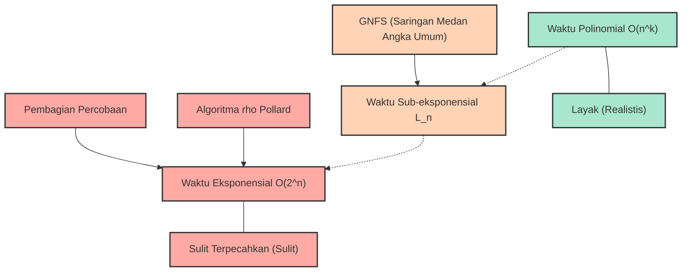
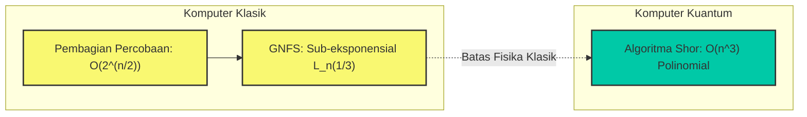

# Pendahuluan: Mengapa Faktorisasi Prima Itu "Sulit"?

Dalam masyarakat internet modern, alasan kita dapat menikmati belanja online dengan aman dan bertukar informasi rahasia adalah berkat keberadaan "teknologi kriptografi". Dan inti yang menopang keamanan teknologi kriptografi tersebut (terutama kriptografi RSA yang banyak digunakan) adalah fakta matematis bahwa "faktorisasi prima dari bilangan bulat yang sangat besar adalah hal yang sangat sulit".

Sekilas, faktorisasi prima mungkin terlihat seperti tugas sederhana yaitu "sekadar memecah bilangan menjadi perkalian bilangan-bilangan prima", tetapi ketika jumlah digitnya menjadi sangat besar, ini berubah menjadi masalah super sulit yang bahkan tidak dapat dipecahkan oleh superkomputer tercepat di dunia meskipun dijalankan selama puluhan atau ratusan tahun. Faktorisasi prima yang biasa kita pelajari di sekolah paling-paling hanyalah proses sederhana dengan membagi menggunakan $2$, $3$, atau $5$, namun ketika dihadapkan pada perkalian antara bilangan-bilangan prima tak dikenal yang panjangnya mencapai ratusan digit, pendekatan sederhana tersebut akan hancur sepenuhnya.

Dalam artikel ini, kita akan berangkat dari konsep "kompleksitas waktu (Notasi Big O: $\mathcal{O}$)" yang merupakan dasar dari ilmu informasi dan ilmu komputer, dan menjelaskan secara rinci dan matematis berapa banyak waktu komputasi yang dibutuhkan oleh berbagai algoritma untuk memecahkan faktorisasi prima (Pembagian Percobaan, Algoritma $\rho$ Pollard, Saringan Medan Angka Umum, dll.). Kemudian, kita akan mengupas tuntas mengapa secara praktis tidak mungkin untuk memfaktorkan bilangan raksasa pada komputer klasik, dan bagaimana hal itu melindungi informasi dan privasi kita, serta bagaimana komputer kuantum akan menjungkirbalikkan asumsi tersebut.

---

# Kompleksitas Waktu dan Definisi Ketat dari Notasi Big O ($\mathcal{O}$)

Saat mengevaluasi kinerja dan efisiensi sebuah algoritma, sekadar mengukur "waktu eksekusi program (dalam detik)" tidaklah cukup. Hal ini karena waktu eksekusi sangat bergantung pada kinerja komputer yang digunakan (seperti kecepatan clock CPU dan kecepatan memori), bahasa pemrograman, dan optimisasi dari kompilator.

Oleh karena itu, metrik evaluasi universal yang tidak bergantung pada perangkat keras atau lingkungan yang digunakan adalah **Kompleksitas Waktu (Time Complexity)**, dan notasi yang digunakan untuk merepresentasikannya adalah **Notasi Big O (Big-O Notation)**. Notasi Big O adalah notasi matematis yang menunjukkan bagaimana waktu eksekusi (atau jumlah langkah eksekusi) dari sebuah algoritma meningkat terhadap ukuran input $N$ (laju pertumbuhan asimtotik) ketika $N$ menjadi sangat besar.

## Definisi Matematis dari Notasi Asimtotik

Dalam ilmu komputer, untuk fungsi $f(n)$ dan $g(n)$, $f(n) = \mathcal{O}(g(n))$ didefinisikan secara matematis sebagai berikut:

$$ \exists c > 0, \exists n_0 > 0 \text{ s.t. } \forall n \ge n_0, 0 \le f(n) \le c \cdot g(n) $$

Ini berarti "ketika ukuran input $n$ cukup besar ($n \ge n_0$), pertumbuhan fungsi $f(n)$ dibatasi dari atas oleh kelipatan konstanta dari $g(n)$". Dengan kata lain, ini menunjukkan "Batas Atas (Upper Bound)" di mana waktu pemrosesan algoritma akan tetap berada dalam kelipatan konstanta dari $g(n)$ bahkan pada skenario terburuk sekalipun.

Demikian pula, ada notasi $\Omega$ (Big Omega) untuk menunjukkan batas bawah, dan $\Theta$ (Big Theta) ketika batas atas dan batas bawah sama. Namun, secara umum, notasi $\mathcal{O}$ adalah yang paling sering digunakan ketika membahas kompleksitas waktu terburuk dari sebuah algoritma.

## Kelas Kompleksitas Waktu yang Umum

Ada beberapa kelas kompleksitas waktu yang umum. Mari kita lihat dari urutan waktu eksekusi yang paling singkat (paling efisien).

1. **$\mathcal{O}(1)$ : Waktu konstan (Constant time)**
   Algoritma yang waktu eksekusinya tidak berubah sebesar apa pun ukuran input $N$. Contohnya termasuk mengambil nilai dari sebuah array dengan menentukan indeksnya, atau pencarian pada tabel hash (dalam kasus ideal).

2. **$\mathcal{O}(\log N)$ : Waktu logaritmik (Logarithmic time)**
   Algoritma yang sangat efisien di mana meskipun ukuran input berlipat ganda, waktu eksekusinya hanya meningkat dengan jumlah yang konstan. "Pencarian Biner (Binary Search)" untuk mencari nilai target dari sebuah array yang sudah diurutkan adalah contoh yang representatif. Meskipun jumlah datanya 1 miliar, Anda dapat menemukan data target hanya dengan sekitar 30 perbandingan.

3. **$\mathcal{O}(N)$ : Waktu linear (Linear time)**
   Waktu eksekusi meningkat sebanding dengan ukuran input. Jika data bertambah 10 kali lipat, waktunya juga menjadi 10 kali lipat. "Pencarian Linear" yang memeriksa semua elemen array secara berurutan adalah salah satu contohnya.

4. **$\mathcal{O}(N \log N)$ : Waktu linearitmik (Linearithmic time)**
   Sedikit lebih lambat dari $\mathcal{O}(N)$, tetapi masih tergolong efisien. Banyak algoritma pengurutan cepat yang praktis memiliki kompleksitas ini, seperti Merge Sort dan Quick Sort (kompleksitas waktu rata-rata).

5. **$\mathcal{O}(N^2)$ : Waktu polinomial / Waktu kuadratik (Quadratic time)**
   Jika ukuran input menjadi 2 kali lipat, waktu eksekusi menjadi 4 kali lipat, dan jika 10 kali lipat menjadi 100 kali lipat. Pemrosesan sederhana menggunakan perulangan bersarang ganda, Bubble Sort, atau Insertion Sort termasuk dalam kategori ini. Jika jumlah data melebihi puluhan ribu, prosesnya akan memakan waktu lama. Kompleksitas waktu yang dinyatakan dalam bentuk $\mathcal{O}(N^k)$ ini secara kolektif disebut **Waktu Polinomial (Polynomial time)**.

6. **$\mathcal{O}(2^N)$ : Waktu eksponensial (Exponential time)**
   Hanya dengan penambahan ukuran input sebesar 1, waktu eksekusi berlipat ganda menjadi 2 kali lipat. Sangat tidak efisien, dan ketika $N$ mencapai 40 atau 50, bahkan komputer paling canggih sekalipun tidak dapat menyelesaikan perhitungannya dalam waktu yang realistis. Pencarian lengkap untuk Masalah Ransel (Knapsack Problem) dan solusi sederhana untuk Masalah Pedagang Keliling (Traveling Salesperson Problem) termasuk dalam kategori ini.

7. **$\mathcal{O}(N!)$ : Waktu faktorial (Factorial time)**
   Meningkat lebih cepat dibandingkan $\mathcal{O}(2^N)$. Ini seperti algoritma yang mencoba semua permutasi pada Masalah Pedagang Keliling.

Diagram Mermaid di bawah ini membandingkan laju pertumbuhan waktu eksekusi (jumlah langkah) dari setiap kompleksitas waktu secara kasar terhadap peningkatan $N$.

Saya harap Anda sekarang mengerti betapa pentingnya perbedaan kompleksitas waktu dalam pemilihan algoritma. Dalam teknologi kriptografi, masalah yang membutuhkan "waktu eksponensial" atau "kompleksitas waktu yang mendekatinya" (yaitu masalah yang tidak mudah dipecahkan) dengan sengaja digunakan untuk menjamin keamanan.

---

# Cara Kerja Kriptografi RSA dan Masalah Faktorisasi Prima

Untuk memahami mengapa faktorisasi prima itu penting, mari kita tinjau secara singkat bagaimana kriptografi RSA bekerja. Kriptografi RSA adalah sistem kriptografi kunci publik yang dikembangkan pada tahun 1977 oleh tiga orang: Ronald Rivest, Adi Shamir, dan Leonard Adleman.

### Langkah-langkah Pembuatan Kunci
1. Pilih dua bilangan prima yang sangat besar $p$ dan $q$ secara acak. (Misalnya, masing-masing dengan panjang 1024 bit).
2. Kalikan keduanya untuk menghitung $N = p \times q$. $N$ ini dipublikasikan ke seluruh dunia sebagai bagian dari kunci publik. (Akan menjadi panjang 2048 bit).
3. Hitung fungsi totient Euler $\phi(N) = (p-1)(q-1)$.
4. Pilih sebuah bilangan bulat $e$ yang relatif prima dengan $\phi(N)$, dan jadikan ini juga sebagai kunci publik.
5. Hitung $d$ (kunci privat) sedemikian rupa sehingga $e \times d \equiv 1 \pmod{\phi(N)}$.

Sangat penting untuk diperhatikan di sini bahwa: **"Untuk mendekripsi pesan sandi diperlukan kunci privat $d$, untuk menghitung $d$ diperlukan $\phi(N)$, dan untuk menghitung $\phi(N)$, $N$ harus difaktorkan menjadi $p$ dan $q$."**

Perkalian antara bilangan prima raksasa $p \times q$ selesai dalam sekejap, tetapi untuk menemukan (memfaktorkan) $p$ dan $q$ asli dari hasil $N$ adalah tugas yang luar biasa sulit. Sifat dari "fungsi satu arah (One-way function)" inilah yang menjadi jantung dari kriptografi RSA.

Ada satu poin yang sangat penting untuk diperhatikan di sini. "Ukuran input $n$" dalam masalah faktorisasi prima bukanlah besaran dari nilai $N$ itu sendiri, melainkan "jumlah bit yang diperlukan untuk merepresentasikan nilai $N$".
Jika kita misalkan $n$ adalah jumlah digit dari bilangan bulat $N$ saat direpresentasikan dalam bilangan biner, maka $n \approx \log_2 N$. Dengan kata lain, kompleksitas waktu dari suatu algoritma harus dievaluasi terhadap $n = \log_2 N$ (atau $\ln N$), bukan terhadap $N$.

---

# Sejarah dan Kompleksitas Waktu dari Algoritma Faktorisasi Prima

Mulai dari sini, kita akan menjelaskan secara rinci cara kerja dan kompleksitas waktu dari berbagai algoritma untuk menguraikan bilangan komposit yang diberikan $N$ menjadi produk bilangan-bilangan prima. Ini juga merupakan sejarah bagaimana umat manusia telah menantang batas kemampuan dalam faktorisasi prima.

## 1. Pembagian Percobaan (Trial Division)

Algoritma yang paling intuitif dan primitif adalah "Pembagian Percobaan". Ini adalah metode yang mencoba membagi $N$ dengan bilangan prima secara berurutan mulai dari $2$.

### Ringkasan Algoritma
Ini memanfaatkan sifat bahwa faktor prima dari $N$ tidak akan melebihi $\sqrt{N}$ (karena $\sqrt{N} \times \sqrt{N} = N$, jika ada faktor prima yang lebih besar dari itu, ia pasti akan berpasangan dengan faktor prima yang kurang dari atau sama dengan $\sqrt{N}$).
Oleh karena itu, ia akan memeriksa keterbagian dengan semua angka (atau bilangan prima) hingga $\lfloor\sqrt{N}\rfloor$ yaitu $2, 3, 5, 7, \dots, \lfloor\sqrt{N}\rfloor$.

### Evaluasi Kompleksitas Waktu
Pada kasus terburuk (misalnya saat $N$ adalah produk dari dua bilangan prima besar), pembagian harus dilakukan sampai $\sqrt{N}$.
Seperti yang disebutkan sebelumnya, ukuran input $n$ adalah $n = \log_2 N$, sehingga dapat direpresentasikan sebagai $N = 2^n$.
Oleh karena itu, jumlah maksimal langkah perhitungan sebanding dengan:

$$ \sqrt{N} = \sqrt{2^n} = (2^n)^{1/2} = 2^{n/2} $$

Ini berarti bahwa untuk panjang bit $n$, kompleksitas waktunya adalah **$\mathcal{O}(2^{n/2})$**. Dengan kata lain, pembagian percobaan adalah algoritma dengan **"waktu eksponensial murni (Exponential time)"** terhadap $n$.
Setiap kali jumlah digit bertambah 1 bit (nilainya menjadi dua kali lipat), waktu perhitungan akan meningkat sekitar $\sqrt{2} \approx 1,414$ kali. Jika $N$ adalah angka yang melebihi 1024 bit (sekitar 300 digit desimal), perhitungan tidak akan selesai bahkan jika memakan waktu seumur alam semesta.

## 2. Metode Faktorisasi Fermat (Fermat's Factorization Method)

Ini adalah metode yang dirancang oleh matematikawan abad ke-17, Pierre de Fermat. Ketika diberikan bilangan komposit ganjil $N$, ia mencoba merepresentasikan $N$ sebagai selisih dari dua bilangan kuadrat.

$$ N = x^2 - y^2 = (x - y)(x + y) $$

Jika $x$ dan $y$ tersebut ditemukan, maka $a = x - y$ dan $b = x + y$ akan menjadi faktor dari $N$.
Sebagai algoritma, ini meningkatkan nilai $x$ secara berurutan mulai dari $\lceil \sqrt{N} \rceil$ dan memeriksa apakah $x^2 - N$ menjadi kuadrat sempurna (kuadrat dari suatu bilangan bulat $y$).
Metode ini bekerja dengan sangat cepat jika kedua faktor prima $p$ dan $q$ nilainya sangat berdekatan. Namun, pada kasus umum (di mana $p$ dan $q$ mengambil nilai yang jauh berbeda secara acak), ia pada akhirnya akan memakan waktu eksponensial yang sama dengan metode pembagian percobaan.

## 3. Algoritma $\rho$ Pollard (Pollard's rho algorithm)

Salah satu algoritma yang dirancang untuk menerobos batas dari pembagian percobaan adalah "Algoritma $\rho$ (rho) Pollard" yang diterbitkan oleh John Pollard pada tahun 1975.

### Ringkasan Algoritma
Metode ini menerapkan konsep probabilitas yang disebut "Paradoks Ulang Tahun (Birthday Paradox)" dan sifat periodisitas dari deret bilangan pseudo-acak (karena bentuknya mirip dengan huruf Yunani $\rho$, itulah asal usul namanya).

Dengan menggunakan fungsi pembangkit bilangan pseudo-acak $f(x) = (x^2 + 1) \pmod N$ untuk menghasilkan deret bilangan, ia mencari dua nilai di dalam deret sedemikian rupa sehingga $x_i \equiv x_j \pmod p$ (di mana $p$ adalah faktor prima tak dikenal dari $N$).
Pada saat ini, karena $x_i - x_j$ adalah kelipatan $p$, dengan menghitung pembagi persekutuan terbesar $\gcd(|x_i - x_j|, N)$, $p$ (yaitu faktor prima dari $N$) dapat diekstraksi dengan probabilitas tinggi. Dengan menggabungkannya dengan metode deteksi siklus Robert Floyd (algoritma kelinci dan kura-kura), perhitungan dilakukan secara efisien sambil menjaga penggunaan memori pada $\mathcal{O}(1)$.

### Evaluasi Kompleksitas Waktu
Diketahui bahwa jumlah langkah yang diperlukan oleh algoritma $\rho$ Pollard untuk menemukan faktor prima $p$ adalah sekitar $\mathcal{O}(\sqrt{p})$.
Pada kasus terburuk (ketika $N$ adalah produk dari dua bilangan prima dengan ukuran yang sama, $p, q$, di mana $p \approx \sqrt{N}$), kompleksitas waktunya menjadi $\mathcal{O}(N^{1/4})$.

Dinyatakan dalam ukuran input $n = \log_2 N$:

$$ N^{1/4} = (2^n)^{1/4} = 2^{n/4} $$

Oleh karena itu, kompleksitas waktunya adalah **$\mathcal{O}(2^{n/4})$**.
Dibandingkan dengan $\mathcal{O}(2^{n/2})$ pada pembagian percobaan, kecepatan ini telah meningkat drastis, dan secara praktis sangat kuat untuk memfaktorkan bilangan berskala menengah (puluhan digit). Namun, ia masih belum mampu melampaui dinding "waktu eksponensial" terhadap panjang bit $n$, dan tidak berdaya melawan angka raksasa sebesar 2048 bit (sekitar 600 digit desimal) seperti yang digunakan dalam kriptografi RSA.

## 4. Saringan Kuadrat Polinomial Berganda (MPQS: Multiple Polynomial Quadratic Sieve)

Memasuki tahun 1980-an, Carl Pomerance menemukan "Saringan Kuadrat (Quadratic Sieve: QS)". Ini merupakan perluasan dari konsep "selisih kuadrat" dari Fermat.
Sementara metode Fermat mencari $x^2 - y^2 = N$ secara langsung, metode saringan kuadrat mencari kondisi yang lebih longgar.

$$ x^2 \equiv y^2 \pmod N $$
dan
$$ x \not\equiv \pm y \pmod N $$

Jika pasangan $x, y$ semacam itu dapat ditemukan, $x^2 - y^2 = (x - y)(x + y)$ akan menjadi kelipatan $N$. Oleh karena itu, dengan menghitung $\gcd(x - y, N)$ atau $\gcd(x + y, N)$, faktor prima tak trivial dari $N$ dapat diperoleh.

Pada saringan kuadrat, sejumlah besar nilai $x$ ditemukan sehingga $x^2 \pmod N$ menjadi "bilangan yang hanya memiliki faktor-faktor prima kecil (ini disebut bilangan mulus-$B$)". Hasil faktorisasi prima mereka lalu disusun dalam bentuk matriks (persamaan linear simultan pada medan biner $\mathbb{F}_2$). Kemudian, dengan menggunakan Eliminasi Gauss atau cara serupa untuk mengalikan banyak relasi, persamaan disesuaikan sehingga ruas kanannya benar-benar kuadrat sempurna (pangkat dari setiap faktor prima adalah genap), dengan demikian membentuk $x^2 \equiv y^2 \pmod N$.

Saringan kuadrat adalah algoritma tercepat di dunia hingga munculnya saringan medan angka umum, dan masih dianggap yang tercepat saat ini untuk memfaktorkan bilangan hingga 100 digit.

## 5. Pendalaman Saringan Medan Angka Umum (General Number Field Sieve: GNFS)

Saat ini, apa yang dianggap sebagai "tercepat di dunia" dalam faktorisasi bilangan bulat raksasa yang lebih dari 100 digit adalah **Saringan Medan Angka Umum (GNFS)**. Ditemukan pada akhir tahun 1980-an, ini merupakan algoritma tingkat lanjut yang memanfaatkan hasil mendalam dari teori bilangan aljabar (medan angka), memperluas metode saringan kuadrat.

Dalam serangan terhadap kriptografi RSA (faktorisasi prima dari kunci publik), GNFS inilah yang selalu memecahkan rekor dunia baru. Pada tahun 2020, dilaporkan adanya keberhasilan dalam memfaktorkan bilangan komposit sebesar 829 bit (250 digit) (RSA-250), tetapi ini membutuhkan pengoperasian paralel ribuan komputer selama jangka waktu yang lama.

### Struktur Matematis dari Algoritma
GNFS sangat rumit, tetapi secara kasar berjalan dengan langkah-langkah berikut.

1. **Pemilihan Polinomial (Polynomial Selection):**
   Untuk sebuah nilai $N$, dipilih suatu bilangan bulat $m$ dan suatu polinomial tak tereduksi $f(X)$ dengan koefisien kecil yang memenuhi $f(m) \equiv 0 \pmod N$. Ini mendefinisikan cincin bilangan bulat aljabar $\mathbb{Z}[\alpha]$ dari medan aljabar (medan angka) di mana akar dari $f(X)$ ditambahkan kepadanya.

2. **Penyaringan (Sieving):**
   Secara bersamaan dicari bilangan-bilangan mulus (Smooth) pada "dua dunia yang berbeda", yaitu cincin bilangan bulat atas medan rasional $\mathbb{Z}$, dan cincin bilangan bulat atas medan aljabar $\mathbb{Z}[\alpha]$. Secara spesifik, dicari secara massal pasangan $(a, b)$ sedemikian rupa sehingga norma dari bilangan bulat rasional $a - bm$ dan bilangan bulat aljabar $a - b\alpha$ benar-benar terurai atas suatu himpunan bilangan prima kecil (Basis Faktor: Factor Base) yang telah ditentukan sebelumnya.

3. **Reduksi Matriks (Matrix Reduction):**
   Pasangan-pasangan mulus dalam jumlah besar yang ditemukan direpresentasikan sebagai matriks (matriks jarang atau sparse matrix raksasa). Ruang solusi kemudian dicari menggunakan algoritma Lanczos (seperti metode blok Lanczos) pada medan biner $\mathbb{F}_2$. Tidak jarang matriks ini mencapai ukuran jutaan baris $\times$ jutaan kolom.

4. **Perhitungan Akar Kuadrat (Square Root):**
   Dari solusi matriks, bentuk kuadrat raksasa dibuat pada "kedua dunia yang berbeda", dan akhirnya relasi $X^2 \equiv Y^2 \pmod N$ diturunkan. Kemudian $\gcd(X-Y, N)$ dihitung untuk memperoleh faktor prima.

### Kompleksitas Waktu dari Saringan Medan Angka Umum: Waktu Sub-eksponensial (Sub-exponential time)

Pencapaian terbesar GNFS adalah bahwa ia menurunkan kompleksitas waktu faktorisasi prima dari "waktu eksponensial murni" menjadi **"waktu sub-eksponensial (Sub-exponential time)"**.
Kompleksitas waktu asimtotik dari GNFS diekspresikan sebagai berikut menggunakan notasi khusus yang disebut Notasi L (L-notation):

$$ L_N[\gamma, c] = \exp\left( (c + o(1)) (\ln N)^\gamma (\ln \ln N)^{1-\gamma} \right) $$

Di sini, $N$ adalah angka yang ingin difaktorkan, dan $\ln$ adalah logaritma natural.
$\gamma$ adalah parameter yang mengambil nilai antara $0 \le \gamma \le 1$, yang menunjukkan "tingkat" kerumitan algoritma.
- Ketika $\gamma = 0$, $L_N[0, c]$ menjadi $(\ln N)^c$, yang berarti waktu polinomial $\mathcal{O}(n^c)$. (Efisien)
- Ketika $\gamma = 1$, $L_N[1, c]$ menjadi $e^{c \ln N} = N^c$, yang berarti waktu eksponensial $\mathcal{O}(2^{cn})$. (Tidak efisien)

Dalam kasus GNFS, parameter ini menjadi sebagai berikut:

$$ L_N\left[\frac{1}{3}, \left(\frac{64}{9}\right)^{1/3}\right] = e^{\left(\sqrt[3]{\frac{64}{9}} + o(1)\right) (\ln N)^{1/3} (\ln \ln N)^{2/3}} $$

Pada rumus ini, konstanta $c = (64/9)^{1/3} \approx 1,923$.
Jika kita tulis ulang menggunakan ukuran input $n \approx \ln N$ (sebanding dengan panjang bit), kompleksitas waktunya akan berperilaku kira-kira seperti berikut:

$$ \mathcal{O}\left( \exp\left( 1,923 \cdot n^{1/3} (\ln n)^{2/3} \right) \right) $$

Dapat dilihat bahwa bagian eksponen tidak bergantung pada $n$ pangkat $1$, tetapi pada $n^{1/3}$ (akar pangkat tiga dari $n$).
Jika algoritma $\rho$ Pollard adalah $\mathcal{O}(2^{n/4})$ atau sama dengan $\mathcal{O}(\exp(c \cdot n^1))$, pada GNFS derajat dari $n$ telah menurun hingga $1/3$.
Ini berarti, meskipun belum mencapai waktu polinomial ($\gamma=0$), kompleksitas waktunya meningkat jauh lebih lambat daripada waktu eksponensial murni ($\gamma=1$). Itulah alasan mengapa ia disebut "waktu sub-eksponensial".

---

# Batas dari Kriptografi Modern dan Komputer Kuantum

Seperti yang telah kita lihat, umat manusia telah mengerahkan kebijaksanaan matematika untuk terus menantang batasan faktorisasi prima dengan mengembangkan algoritma dari pembagian percobaan hingga GNFS. Namun, bahkan dengan menggunakan GNFS, faktorisasi prima masih tidak dapat diselesaikan dalam "waktu polinomial" pada komputer klasik.

## Masalah P vs NP dan Posisi Faktorisasi Prima

Masalah yang belum terpecahkan terbesar dalam ilmu komputer adalah "Masalah P = NP".
Masalah faktorisasi prima masuk dalam kelas NP (kelas masalah di mana jika diberikan jawaban, kebenarannya dapat diverifikasi dalam waktu polinomial), tetapi belum terbukti sebagai NP-complete (kelas masalah yang paling sulit di dalam NP).
Selain itu, masih belum terpecahkan juga apakah masalah tersebut masuk ke dalam kelas P (kelas masalah yang dapat diselesaikan dalam waktu polinomial) atau tidak (yaitu apakah ada algoritma waktu polinomial).

Banyak peneliti memperkirakan bahwa faktorisasi prima masuk ke dalam kelas perantara antara P dan NP-complete (NP-intermediate). Jika suatu algoritma yang dapat menyelesaikan faktorisasi prima pada komputer klasik dalam waktu polinomial (misalnya, $\mathcal{O}(n^3)$) ditemukan, hal itu akan menjadi peristiwa besar yang menghancurkan sistem kriptografi di seluruh dunia. Namun, hingga saat ini, belum ada algoritma semacam itu yang ditemukan. Untuk memecahkan kriptografi RSA 2048 bit, diperkirakan butuh waktu yang lebih lama dari umur alam semesta, bahkan jika kinerja komputer klasik meningkat sesuai dengan Hukum Moore.

## Komputer Kuantum sang "Pengubah Permainan": Algoritma Shor

Kriptografi RSA memang kuat di hadapan komputer klasik, tetapi ketika "Komputer Kuantum" yang beroperasi dengan prinsip yang sama sekali berbeda direalisasikan ke penggunaan praktis, situasinya akan berubah total.
**"Algoritma Shor (Shor's algorithm)"**, yang diumumkan oleh Peter Shor pada tahun 1994, secara mengejutkan dapat memecahkan faktorisasi prima dalam **waktu polinomial $\mathcal{O}(n^3)$** (lebih tepatnya sekitar $\mathcal{O}(n^2 \log n \log \log n)$ dalam jumlah gerbang kuantum) dengan memanfaatkan Transformasi Fourier Kuantum.

Mari kita periksa perbedaan kompleksitas waktu antara algoritma klasik dan algoritma kuantum menggunakan diagram Mermaid di bawah ini.

Dalam Algoritma Shor, proses "penemuan periode (period finding)" yang menjadi hambatan (bottleneck) pada algoritma klasik, dapat dihitung secara instan dan paralel oleh "Transformasi Fourier Kuantum (QFT)" yang menggunakan keterikatan kuantum dan superposisi kuantum.
Jika nanti dapat dieksekusi pada komputer kuantum skala praktis (dengan noise rendah dan memiliki jumlah qubit logis yang memadai), kriptografi RSA 2048-bit yang saat ini dianggap aman berpotensi dapat dipecahkan sepenuhnya dalam waktu beberapa jam hingga beberapa hari.

Untuk bersiap menghadapi ancaman ini, ahli kriptografi di seluruh dunia dan NIST (Institut Standar dan Teknologi Nasional AS) saat ini mempercepat proses standardisasi menuju transisi ke "Kriptografi Pasca-Kuantum (Post-Quantum Cryptography: PQC)" yang sulit untuk dipecahkan bahkan oleh komputer kuantum sekalipun. Kriptografi berbasis kisi (Lattice-based cryptography) adalah salah satu contoh yang representatif, di mana mereka mendasarkan keamanan pada kesulitan matematis yang sama sekali berbeda dengan masalah faktorisasi prima (contohnya masalah vektor terpendek).

---

# Kesimpulan

Dalam artikel ini, kita telah membahas secara mendalam dan terperinci, mulai dari dasar-dasar kompleksitas waktu (Notasi Big O), evolusi algoritma faktorisasi prima, hingga batasan-batasan matematisnya.

* **Notasi Big O ($\mathcal{O}$)** adalah indikator penting yang menunjukkan laju peningkatan jumlah langkah komputasi terhadap peningkatan ukuran input $n$, dan terdapat pembatas (dinding) raksasa yang praktis tidak dapat dilampaui di antara waktu polinomial dan waktu eksponensial.
* **Pembagian Percobaan** dan **Algoritma $\rho$ Pollard** murni merupakan algoritma "waktu eksponensial", dan sama sekali tak berdaya ketika menghadapi angka yang sangat besar.
* Algoritma klasik tercepat saat ini, **Saringan Medan Angka Umum (GNFS)**, mencapai "waktu sub-eksponensial" dengan memanfaatkan kemajuan teori bilangan aljabar tingkat lanjut, tetapi ia masih belum mencapai waktu polinomial, sehingga untuk memfaktorkan bilangan besar masih memerlukan waktu yang astronomis.
* Fakta bahwa **"tidak ada algoritma klasik (atau diduga kuat tidak ada) yang bisa memecahkannya dalam waktu polinomial"** inilah yang menjadi penjamin keamanan kriptografi RSA, yang menopang masyarakat digital modern kita.
* Namun, berkat kehadiran **komputer kuantum dan Algoritma Shor**, secara teoritis faktorisasi prima kini dimungkinkan dalam waktu polinomial, dan teknologi kriptografi sedang bergeser ke era baru (Kriptografi Pasca-Kuantum).

Fakta bahwa konsep abstrak dari sebuah kompleksitas waktu sebuah algoritma terhubung langsung dengan keamanan hidup kita adalah salah satu sisi ilmu komputer dan matematika yang paling mendebarkan dan mempesona. Silakan terus pantau kemajuan teknologi di masa mendatang, terutama tren pengembangan komputer kuantum dan pergeseran dalam teknologi kriptografi.
