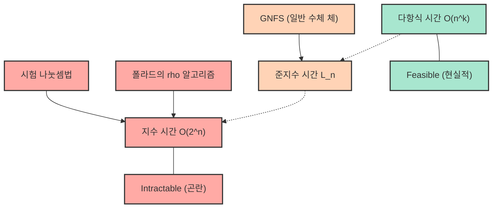
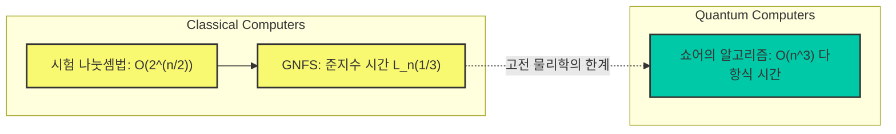

# 시작하며: 왜 소인수분해는 '어려운' 것일까?

현대 인터넷 사회에서 우리가 안심하고 온라인 쇼핑을 즐기거나 기밀 정보를 주고받을 수 있는 것은 '암호 기술'이 존재하기 때문입니다. 그리고 그 암호 기술(특히 널리 사용되는 RSA 암호 등)의 안전성의 근간을 받치고 있는 것이 '거대한 정수의 소인수분해는 매우 어렵다'는 수학적 사실입니다.

언뜻 보기에는 '수를 소수의 곱셈으로 분해할 뿐'인 단순한 작업처럼 보이는 소인수분해이지만, 자릿수가 커지면 세계에서 가장 빠른 슈퍼컴퓨터를 수십 년, 수백 년 동안 가동해도 풀 수 없을 정도의 초난문으로 변모합니다. 우리가 평소 학교에서 배우는 소인수분해는 기껏해야 $2$나 $3$, $5$로 나누어가는 단순한 작업이지만, 수백 자리에 달하는 미지의 소수끼리의 곱 앞에서는 그 단순한 접근 방식이 완전히 무너집니다.

이 글에서는 정보과학 및 컴퓨터 과학의 기본인 '계산량(빅오 표기법: $\mathcal{O}$ 표기법)'의 개념에서 출발하여, 소인수분해를 풀기 위한 다양한 알고리즘(시험 나눗셈법, 폴라드의 $\rho$ 알고리즘, 일반 수체 체 등)이 어느 정도의 계산 시간을 필요로 하는지 상세하고 수학적으로 해설합니다. 그리고 왜 고전 컴퓨터에서는 거대한 수의 소인수분해가 사실상 불가능한지, 그것이 어떻게 우리의 정보와 프라이버시를 지키고 있는지, 나아가 양자 컴퓨터가 그 전제를 어떻게 뒤집는지까지 철저하게 파헤쳐 보겠습니다.

---

# 계산량과 빅오($\mathcal{O}$) 표기법의 엄밀한 정의

알고리즘의 성능이나 효율을 평가할 때, 단순히 '프로그램의 실행 시간(초)'을 측정하는 것만으로는 불충분합니다. 왜냐하면 실행 시간은 사용하는 컴퓨터의 성능(CPU 클럭 수나 메모리 속도 등)이나 프로그래밍 언어, 컴파일러의 최적화에 크게 의존하기 때문입니다.

따라서 하드웨어나 환경에 의존하지 않는 보편적인 평가 지표로 사용되는 것이 **시간 복잡도(Time Complexity)** 이며, 이를 표현하기 위한 표기법이 **빅오 표기법(Big-O Notation)** 입니다. 빅오 표기법은 입력 데이터의 크기 $N$이 매우 커졌을 때, 알고리즘의 실행 시간(혹은 실행 단계 수)이 $N$에 대해 어떻게 증가해 가는지(점근적 증가율)를 나타내는 수학적인 표기법입니다.

## 점근적 표기법의 수학적 정의

컴퓨터 과학에서 함수 $f(n)$과 $g(n)$에 대하여 $f(n) = \mathcal{O}(g(n))$이라는 것은 수학적으로 다음과 같이 정의됩니다.

$$ \exists c > 0, \exists n_0 > 0 \text{ s.t. } \forall n \ge n_0, 0 \le f(n) \le c \cdot g(n) $$

이것은 "입력 크기 $n$이 충분히 클($n \ge n_0$) 때, 함수 $f(n)$의 증가는 어떤 상수배의 $g(n)$에 의해 위에서 억제된다"는 의미입니다. 즉, 알고리즘의 처리 시간이 최악의 경우라도 $g(n)$의 상수배 이내로 수렴한다는 '상한(Upper Bound)'을 나타냅니다.

마찬가지로 하한을 나타내는 표기법으로 $\Omega$(빅 오메가), 상한과 하한이 일치하는 경우의 표기법으로 $\Theta$(빅 세타)가 존재하지만, 일반적으로 알고리즘의 최악 계산량을 논할 때는 $\mathcal{O}$ 표기법이 가장 빈번하게 사용됩니다.

## 대표적인 계산량의 클래스

계산량에는 몇 가지 대표적인 클래스가 존재합니다. 실행 시간이 짧은(효율이 좋은) 순서대로 살펴보겠습니다.

1. **$\mathcal{O}(1)$ : 상수 시간(Constant time)**
   입력 크기 $N$이 아무리 커져도 실행 시간이 변하지 않는 알고리즘입니다. 예를 들어, 배열의 인덱스를 지정하여 값을 가져오는 작업이나 해시 테이블에서의 검색(이상적인 경우) 등이 이에 해당합니다.

2. **$\mathcal{O}(\log N)$ : 로그 시간(Logarithmic time)**
   입력 크기가 두 배가 되어도 실행 시간은 상수만큼만 늘어나는 매우 효율적인 알고리즘입니다. 정렬된 배열에서 원하는 값을 찾는 '이진 탐색(Binary Search)'이 대표적인 예입니다. 데이터 양이 10억 개라도 불과 30번 정도의 비교만으로 원하는 데이터를 찾을 수 있습니다.

3. **$\mathcal{O}(N)$ : 선형 시간(Linear time)**
   입력 크기에 비례하여 실행 시간이 증가합니다. 데이터가 10배가 되면 시간도 10배가 됩니다. 배열의 모든 요소를 순서대로 확인하는 '선형 탐색' 등이 이에 해당합니다.

4. **$\mathcal{O}(N \log N)$ : 선형 로그 시간(Linearithmic time)**
   $\mathcal{O}(N)$보다는 조금 느리지만 효율적인 분류에 들어갑니다. 병합 정렬(Merge Sort)이나 퀵 정렬(Quick Sort의 평균 계산량) 등 실용적이고 빠른 정렬 알고리즘의 대부분이 이 계산량을 가집니다.

5. **$\mathcal{O}(N^2)$ : 다항식 시간 / 2차 시간(Quadratic time)**
   입력 크기가 2배가 되면 실행 시간은 4배로, 10배가 되면 100배가 됩니다. 이중 루프를 사용한 단순한 처리나 버블 정렬, 삽입 정렬 등이 이에 해당합니다. 데이터 양이 수만을 넘어가면 처리에 시간이 걸리게 됩니다. 이처럼 $\mathcal{O}(N^k)$ 형태로 표현되는 계산량을 총칭하여 **다항식 시간(Polynomial time)** 이라고 부릅니다.

6. **$\mathcal{O}(2^N)$ : 지수 시간(Exponential time)**
   입력 크기가 1 늘어나는 것만으로 실행 시간이 2배가 됩니다. 매우 비효율적이며 $N$이 40이나 50이 되는 것만으로도 최첨단 컴퓨터조차 현실적인 시간 내에 계산을 끝낼 수 없게 됩니다. 배낭 문제의 완전 탐색이나 외판원 순회 문제의 단순한 해법 등이 이에 해당합니다.

7. **$\mathcal{O}(N!)$ : 팩토리얼 시간(Factorial time)**
   $\mathcal{O}(2^N)$보다 더 급속하게 증가합니다. 외판원 순회 문제의 모든 순열을 시험해 보는 것과 같은 알고리즘입니다.

다음 Mermaid 다이어그램은 $N$의 증가에 대한 각 계산량의 실행 시간(단계 수) 증가율을 개략적으로 비교한 것입니다.

계산량의 차이가 알고리즘 선택에서 얼마나 중요한지 이해하셨을 것입니다. 암호 기술에서는 이 '지수 시간'이나 '그에 가까운 계산량'을 필요로 하는 문제(즉, 쉽게 풀리지 않는 문제)를 의도적으로 이용하여 안전성을 담보하고 있습니다.

---

# RSA 암호의 원리와 소인수분해 문제

왜 소인수분해가 중요한지 이해하기 위해, RSA 암호의 원리를 간단히 되짚어 봅시다. RSA 암호는 1977년 로널드 리베스트, 아디 샤미르, 레너드 에이들먼 세 사람에 의해 개발된 공개키 암호 방식입니다.

### 키 생성 단계
1. 매우 큰 두 개의 소수 $p$와 $q$를 무작위로 선택합니다. (예를 들어 각각 1024비트 길이)
2. 그것들을 곱하여 $N = p \times q$를 계산합니다. 이 $N$은 공개키의 일부로서 전 세계에 공개됩니다. (2048비트 길이가 됩니다)
3. 오일러의 피 함수 $\phi(N) = (p-1)(q-1)$을 계산합니다.
4. $\phi(N)$과 서로소인 정수 $e$를 선택하고, 이것 역시 공개키로 삼습니다.
5. $e \times d \equiv 1 \pmod{\phi(N)}$가 되는 $d$(비밀키)를 계산합니다.

여기서 매우 중요한 것은, **"암호를 해독하기 위해서는 비밀키 $d$가 필요하며, $d$를 계산하기 위해서는 $\phi(N)$이 필요하고, $\phi(N)$을 계산하기 위해서는 $N$을 $p$와 $q$로 소인수분해해야 한다"**는 사실입니다.

거대한 소수의 곱셈 $p \times q$는 순식간에 끝나지만, 그 결과인 $N$에서 원래의 $p$와 $q$를 찾아내는(소인수분해하는) 것은 절망적으로 어렵습니다. 이 '일방향 함수(One-way function)'의 성질이야말로 RSA 암호의 심장부인 것입니다.

여기서 주의해야 할 매우 중요한 점이 있습니다. 소인수분해 문제에서의 '입력 크기 $n$'이란, 수치 $N$ 그 자체의 크기가 아니라 '수치 $N$을 표현하는 데 필요한 비트 수'입니다.
정수 $N$을 2진수로 표현했을 때의 자릿수를 $n$이라고 하면 $n \approx \log_2 N$이 됩니다. 즉, 알고리즘의 계산량은 $N$이 아니라 $n = \log_2 N$(혹은 $\ln N$)에 대해 평가되어야 합니다.

---

# 소인수분해 알고리즘의 역사와 계산량

지금부터는 주어진 합성수 $N$을 소수의 곱으로 분해하는 다양한 알고리즘에 대해 그 원리와 계산량을 자세히 해설합니다. 인류가 어떻게 소인수분해의 한계에 도전해 왔는지에 대한 역사이기도 합니다.

## 1. 시험 나눗셈법 (Trial Division)

가장 직관적이고 원시적인 알고리즘이 '시험 나눗셈법'입니다. 이것은 $2$부터 순서대로 소수를 사용하여 $N$을 나눌 수 있는지 시험해 보는 방법입니다.

### 알고리즘의 개요
$N$의 소인수는 최대라도 $\sqrt{N}$을 넘지 않는다($\sqrt{N} \times \sqrt{N} = N$이기 때문에, 그 이상의 소인수가 있다면 반드시 $\sqrt{N}$ 이하의 소인수와 짝이 된다)는 성질을 이용합니다.
따라서 $2, 3, 5, 7, \dots, \lfloor\sqrt{N}\rfloor$까지의 모든 수(또는 소수)로 나누어떨어지는지 확인합니다.

### 계산량 평가
최악의 경우($N$이 두 개의 거대한 소수의 곱인 경우 등)에는 $\sqrt{N}$까지의 나눗셈을 수행할 필요가 있습니다.
앞서 언급한 바와 같이, 입력 크기 $n$은 $n = \log_2 N$이므로 $N = 2^n$으로 표현할 수 있습니다.
따라서 계산 단계 수는 최대로 아래 식에 비례합니다.

$$ \sqrt{N} = \sqrt{2^n} = (2^n)^{1/2} = 2^{n/2} $$

이것은 비트 길이 $n$에 대해 **$\mathcal{O}(2^{n/2})$** 의 계산량이라는 것을 의미합니다. 즉, 시험 나눗셈법은 $n$에 대한 **'순수한 지수 시간(Exponential time) 알고리즘'** 인 것입니다.
자릿수가 1비트 늘어날(수치가 2배가 될) 때마다 계산 시간은 약 $\sqrt{2} \approx 1.414$배가 됩니다. 만약 $N$이 1024비트(10진수로 약 300자리)를 넘는 숫자라면 우주의 나이만큼의 시간을 들여도 계산은 끝나지 않습니다.

## 2. 페르마의 소인수분해법 (Fermat's Factorization Method)

17세기 수학자 피에르 드 페르마에 의해 고안된 기법입니다. 홀수인 합성수 $N$이 주어졌을 때, $N$을 두 평방수의 차이로 표현하려고 시도합니다.

$$ N = x^2 - y^2 = (x - y)(x + y) $$

만약 이러한 $x$와 $y$를 찾을 수 있다면, $a = x - y$와 $b = x + y$가 $N$의 인수가 됩니다.
알고리즘으로서는 $x$를 $\lceil \sqrt{N} \rceil$부터 순서대로 늘려가며 $x^2 - N$이 완전 평방수(어떤 정수 $y$의 제곱)가 되는지 확인합니다.
이 방법은 두 소인수 $p$와 $q$가 값으로서 매우 가까운 경우에 극히 고속으로 기능합니다. 그러나 일반적인($p$와 $q$가 무작위로 떨어진 값을 갖는) 경우에는, 결국 시험 나눗셈법과 비슷한 수준의 지수 시간을 필요로 하고 맙니다.

## 3. 폴라드의 $\rho$ 알고리즘 (Pollard's rho algorithm)

시험 나눗셈법의 한계를 돌파하기 위해 고안된 알고리즘 중 하나가 1975년 존 폴라드가 발표한 '폴라드의 $\rho$(로) 알고리즘'입니다.

### 알고리즘의 개요
이 방법은 '생일 문제(Birthday Paradox)'라고 불리는 확률론의 개념과 의사 난수열의 주기성(이것이 그리스 문자 $\rho$의 모양과 닮은 것이 이름의 유래입니다)을 응용하고 있습니다.

어떤 의사 난수 생성 함수 $f(x) = (x^2 + 1) \pmod N$을 사용하여 수열을 생성하고, 수열 중에서 $x_i \equiv x_j \pmod p$가 되는($p$는 $N$의 미지의 소인수) 두 값을 찾아냅니다.
이때 $x_i - x_j$는 $p$의 배수가 되므로, 최대공약수 $\gcd(|x_i - x_j|, N)$을 계산함으로써 $p$(즉 $N$의 소인수)를 높은 확률로 추출할 수 있습니다. 로버트 플로이드의 순환 검출법(토끼와 거북이 알고리즘) 등을 조합하여, 메모리 사용량을 $\mathcal{O}(1)$로 억제하면서 효율적으로 계산합니다.

### 계산량 평가
폴라드의 $\rho$ 알고리즘이 소인수 $p$를 찾기 위해 필요한 단계 수는 대략 $\mathcal{O}(\sqrt{p})$인 것으로 알려져 있습니다.
최악의 경우($N$이 같은 크기인 두 소수 $p, q$의 곱일 때, $p \approx \sqrt{N}$이 된다), 계산량은 $\mathcal{O}(N^{1/4})$가 됩니다.

입력 크기 $n = \log_2 N$으로 표현하면:

$$ N^{1/4} = (2^n)^{1/4} = 2^{n/4} $$

따라서 계산량은 **$\mathcal{O}(2^{n/4})$** 가 됩니다.
시험 나눗셈법의 $\mathcal{O}(2^{n/2})$와 비교하면 극적으로 고속화되었으며, 실용적으로는 중규모(수십 자리) 숫자의 소인수분해에 매우 강력합니다. 그러나 여전히 비트 길이 $n$에 대해서는 '지수 시간'의 벽을 넘지 못하고 있으며, RSA 암호에서 사용되는 것과 같은 2048비트(10진수로 약 600자리)의 거대한 숫자에 대해서는 무력합니다.

## 4. 다중 다항식 2차 체 (MPQS: Multiple Polynomial Quadratic Sieve)

1980년대에 들어와 칼 포머런스에 의해 '2차 체(Quadratic Sieve: QS)'가 고안되었습니다. 이것은 페르마의 '평방의 차' 개념을 확장한 것입니다.
페르마법에서는 $x^2 - y^2 = N$을 직접 찾았지만, 2차 체에서는 좀 더 느슨한 조건을 찾습니다.

$$ x^2 \equiv y^2 \pmod N $$
그리고
$$ x \not\equiv \pm y \pmod N $$

이러한 $x, y$ 쌍을 찾을 수 있다면, $x^2 - y^2 = (x - y)(x + y)$는 $N$의 배수가 됩니다. 따라서 $\gcd(x - y, N)$ 또는 $\gcd(x + y, N)$을 계산하면 $N$의 자명하지 않은 소인수를 얻을 수 있습니다.

2차 체에서는 $x^2 \pmod N$이 '작은 소수만을 소인수로 가지는 수(이를 $B$-스무스 수(smooth number)라고 부릅니다)'가 되는 $x$를 대량으로 찾아내고, 그 소인수분해 결과를 행렬 형태(이원체 $\mathbb{F}_2$ 상의 연립일차방정식)로 나열합니다. 그리고 가우스 소거법 등을 사용하여 여러 관계식을 곱하고 우변이 완전한 평방수(각 소인수의 지수가 짝수)가 되도록 조정함으로써 $x^2 \equiv y^2 \pmod N$을 구성합니다.

2차 체는 일반 수체 체가 등장하기 전까지는 세계에서 가장 빠른 알고리즘이었으며, 100자리 이하의 수 분해에서는 현재도 가장 빠른 것으로 여겨지고 있습니다.

## 5. 일반 수체 체 (General Number Field Sieve: GNFS) 심층 탐구

현재 100자리를 넘는 거대한 정수의 소인수분해에서 '세계 최고속'으로 꼽히는 것이 **일반 수체 체(GNFS)** 입니다. 1980년대 후반에 고안되어, 2차 체를 더욱 발전시킨 대수적 정수론의 깊은 결과(수체)를 이용한 고도의 알고리즘입니다.

RSA 암호에 대한 공격(공개키로부터의 소인수분해)에 있어서, 세계 기록을 계속 갱신하고 있는 것은 항상 이 GNFS입니다. 2020년에는 829비트(250자리)의 합성수(RSA-250) 소인수분해에 성공했다는 보고가 있지만, 이를 위해서는 수천 대 규모의 컴퓨터를 장기간 병렬 가동해야 했습니다.

### 알고리즘의 수학적 구조
GNFS는 매우 복잡하지만 대체로 다음과 같은 단계로 진행됩니다.

1. **다항식 선택 (Polynomial Selection):**
   $N$에 대해 어떤 정수 $m$과, 계수가 작고 $f(m) \equiv 0 \pmod N$이 되는 기약 다항식 $f(X)$를 선택합니다. 이를 통해 $f(X)$의 근 $\alpha$를 첨가한 대수체(수체)의 정수환 $\mathbb{Z}[\alpha]$를 정의합니다.

2. **체질 (Sieving):**
   유리수체 상의 정수환 $\mathbb{Z}$와 대수체 상의 정수환 $\mathbb{Z}[\alpha]$라는 '두 개의 다른 세계'에서 동시에 스무스(Smooth) 수를 찾습니다. 구체적으로는 $a - bm$이라는 유리 정수와 $a - b\alpha$라는 대수적 정수의 노름(norm)이 모두 사전에 정해둔 작은 소수 집합(인자 기저: Factor Base) 상에서 완전히 분해되는 $(a, b)$ 쌍을 대량으로 찾아냅니다.

3. **행렬 축소 (Matrix Reduction):**
   찾아낸 방대한 수의 스무스한 쌍을 행렬(거대한 희소 행렬)로 표현합니다. 이원체 $\mathbb{F}_2$ 상에서 Lanczos 알고리즘(블록 란초스법 등)을 사용하여 해 공간을 구합니다. 이 행렬은 수백만 행 $\times$ 수백만 열에 달하는 경우도 드물지 않습니다.

4. **제곱근 계산 (Square Root):**
   행렬의 해에서 '두 개의 다른 세계' 각각에 거대한 평방수를 만들어내고, 최종적으로 $X^2 \equiv Y^2 \pmod N$이라는 관계식을 도출합니다. 그리고 $\gcd(X-Y, N)$을 계산하여 소인수를 얻습니다.

### 일반 수체 체의 계산량: 준지수 시간 (Sub-exponential time)

GNFS의 최대 공적은 소인수분해의 계산량을 '순수한 지수 시간'에서 **'준지수 시간(Sub-exponential time)'** 으로 낮춘 것입니다.
GNFS의 점근적 시간 복잡도는 L 표기법(L-notation)이라고 불리는 특별한 표기법을 사용하여 다음과 같이 표현됩니다.

$$ L_N[\gamma, c] = \exp\left( (c + o(1)) (\ln N)^\gamma (\ln \ln N)^{1-\gamma} \right) $$

여기서 $N$은 분해하고 싶은 수, $\ln$은 자연로그입니다.
$\gamma$는 $0 \le \gamma \le 1$의 값을 갖는 매개변수로, 알고리즘 복잡도의 '정도'를 나타냅니다.
- $\gamma = 0$일 때, $L_N[0, c]$는 $(\ln N)^c$가 되어 다항식 시간 $\mathcal{O}(n^c)$를 의미합니다. (효율적)
- $\gamma = 1$일 때, $L_N[1, c]$는 $e^{c \ln N} = N^c$가 되어 지수 시간 $\mathcal{O}(2^{cn})$을 의미합니다. (비효율적)

GNFS의 경우, 이 매개변수는 다음과 같이 됩니다.

$$ L_N\left[\frac{1}{3}, \left(\frac{64}{9}\right)^{1/3}\right] = e^{\left(\sqrt[3]{\frac{64}{9}} + o(1)\right) (\ln N)^{1/3} (\ln \ln N)^{2/3}} $$

이 식에서 상수 $c = (64/9)^{1/3} \approx 1.923$입니다.
입력 크기 $n \approx \ln N$(비트 길이에 비례)으로 다시 쓰면, 계산량은 대략 다음과 같이 움직입니다.

$$ \mathcal{O}\left( \exp\left( 1.923 \cdot n^{1/3} (\ln n)^{2/3} \right) \right) $$

지수 부분이 $n$의 1제곱이 아니라 $n^{1/3}$($n$의 세제곱근)에 의존하고 있음을 알 수 있습니다.
폴라드의 $\rho$ 알고리즘이 $\mathcal{O}(2^{n/4})$, 즉 $\mathcal{O}(\exp(c \cdot n^1))$이었던 것에 반해, GNFS는 $n$의 차수가 $1/3$까지 내려가 있습니다.
이것은 다항식 시간($\gamma=0$)에는 도달하지 못했지만, 순수한 지수 시간($\gamma=1$)보다는 훨씬 천천히 계산량이 증가한다는 것을 의미합니다. 이것이 '준지수 시간'이라고 불리는 이유입니다.

---

# 현대 암호의 한계와 양자 컴퓨터

지금까지 살펴본 바와 같이, 인류는 수학적 지혜를 결집하여 시험 나눗셈법에서 GNFS로 알고리즘을 진화시킴으로써 소인수분해의 벽에 계속 도전해 왔습니다. 그러나 GNFS를 가지고서도 소인수분해는 여전히 고전 컴퓨터에서 '다항식 시간'에 푸는 것은 불가능합니다.

## P vs NP 문제와 소인수분해의 위치

컴퓨터 과학의 가장 큰 미해결 문제로 'P = NP 문제'가 있습니다.
소인수분해 문제는 NP(답이 주어지면 다항식 시간 안에 정답 여부를 검증할 수 있는 문제 클래스)에 속해 있지만, NP-완전(NP 중에서 가장 어려운 문제 클래스)이라고는 증명되지 않았습니다.
또한 P(다항식 시간에 풀 수 있는 문제 클래스)에 속하는지(즉, 다항식 시간 알고리즘이 존재하는지) 여부도 미해결입니다.

많은 연구자들은 소인수분해가 P도 아니고 NP-완전도 아닌 중간 클래스에 속해 있다고(NP-intermediate) 예상합니다. 만약 소인수분해를 고전 컴퓨터에서 다항식 시간에 푸는 알고리즘(예를 들어 $\mathcal{O}(n^3)$ 등)이 발견된다면 전 세계의 암호 시스템이 붕괴되는 대사건이 되겠지만, 현재까지 그러한 알고리즘은 발견되지 않았습니다. 2048비트 RSA 암호 해독에는 고전 컴퓨터의 성능 향상이 무어의 법칙을 따른다고 해도 우주의 수명보다 더 오랜 시간이 걸릴 것으로 추산됩니다.

## 양자 컴퓨터라는 '게임 체인저': 쇼어의 알고리즘

고전 컴퓨터에서는 견고한 RSA 암호이지만, 완전히 다른 원리로 동작하는 '양자 컴퓨터'가 실용화되면 상황이 돌변합니다.
1994년 피터 쇼어(Peter Shor)에 의해 발표된 **'쇼어의 알고리즘(Shor's algorithm)'** 은 양자 푸리에 변환을 이용함으로써 소인수분해를 무려 **다항식 시간 $\mathcal{O}(n^3)$**(더 엄밀하게는 양자 게이트 수로 $\mathcal{O}(n^2 \log n \log \log n)$ 정도)에 풀 수 있는 알고리즘입니다.

다음 Mermaid 다이어그램에서 고전 알고리즘과 양자 알고리즘의 계산량 차이를 확인해 봅시다.

쇼어의 알고리즘에서는 고전적인 알고리즘에서 병목이 되었던 '주기 발견'이라는 프로세스를 양자 얽힘과 양자 중첩을 사용한 '양자 푸리에 변환(QFT)'을 통해 병렬적이고 순식간에 계산해 버립니다.
실용적인 규모의(노이즈가 적고 충분한 수의 논리 양자 비트를 가지는) 양자 컴퓨터상에서 실행할 수 있게 되면, 현재 안전하다고 여겨지는 2048비트 RSA 암호는 몇 시간에서 며칠 만에 완전히 해독되어 버릴 가능성이 있습니다.

이러한 위협에 대비해 현재 전 세계의 암호학자들과 NIST(미국 국립표준기술연구소)는 양자 컴퓨터로도 해독이 어려운 '양자 내성 암호(Post-Quantum Cryptography: PQC)'로의 이전을 위한 표준화 작업을 빠른 속도로 진행하고 있습니다. 격자 기반 암호(Lattice-based cryptography) 등이 그 대표적인 예이며, 이들은 소인수분해 문제와는 완전히 다른 수학적 난제(예를 들어 최단 벡터 문제 등)에 안전성의 근거를 두고 있습니다.

---

# 요약

이 글에서는 계산량(빅오 표기법)의 기초부터 시작하여 소인수분해 알고리즘의 진화와 그 수학적 한계에 대해 깊이 파고들어 해설했습니다.

* **빅오($\mathcal{O}$) 표기법**은 입력 크기 $n$의 증가에 대한 계산 단계 수의 증대율을 나타내는 중요한 지표이며, 다항식 시간과 지수 시간 사이에는 실용적으로 넘을 수 없는 거대한 벽이 존재합니다.
* **시험 나눗셈법**이나 **폴라드의 $\rho$ 알고리즘**은 순수한 '지수 시간' 알고리즘이므로 거대한 숫자에 대해서는 무력합니다.
* 현재 가장 빠른 고전 알고리즘인 **일반 수체 체(GNFS)** 는 고도의 대수적 정수론을 구사하여 '준지수 시간'을 달성했지만, 그럼에도 다항식 시간까지는 도달하지 못하여 거대한 숫자의 소인수분해에는 천문학적인 시간을 필요로 합니다.
* 이 **"다항식 시간에 푸는 고전 알고리즘이 존재하지 않는다(고 강하게 예상된다)"**는 사실이야말로 RSA 암호의 안전성을 담보하며 현대 디지털 사회를 지탱하고 있습니다.
* 그러나 **양자 컴퓨터와 쇼어의 알고리즘**의 등장으로 다항식 시간에서의 소인수분해가 이론적으로 가능해졌으며, 암호 기술은 다음 시대(양자 내성 암호)로 넘어가려 하고 있습니다.

알고리즘 계산량이라는 추상적인 개념이 우리 생활의 안전과 직결되어 있다는 사실은 정보과학 및 수학의 가장 매력적이고 스릴 넘치는 측면 중 하나입니다. 앞으로의 기술 진전, 특히 양자 컴퓨터의 개발 동향과 암호 기술의 변천에 꼭 주목해 보시기 바랍니다.
