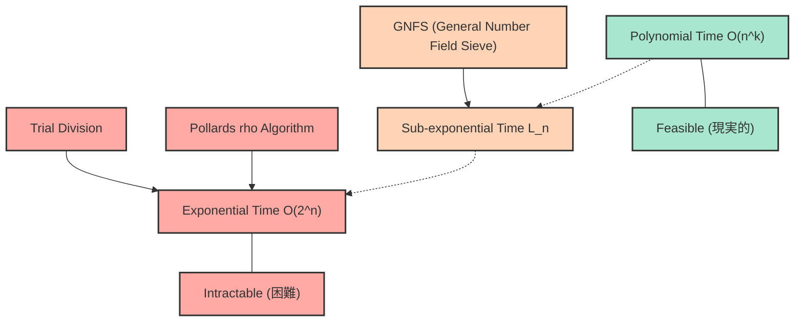
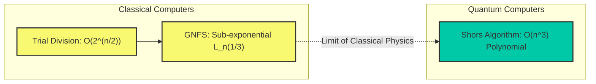

# はじめに：なぜ素因数分解は「難しい」のか？

現代のインターネット社会において、私たちが安心してオンラインショッピングを楽しんだり、機密情報をやり取りしたりできるのは、「暗号技術」の存在があるからです。そして、その暗号技術（特に広く使われているRSA暗号など）の安全性の根幹を支えているのが、「巨大な整数の素因数分解は非常に難しい」という数学的事実です。

一見すると、「数を素数の掛け算に分解するだけ」の単純な作業に思える素因数分解ですが、桁数が大きくなると、世界最速のスーパーコンピュータを何十年、何百年と稼働させても解けないほどの超難問へと変貌します。私たちが普段学校で習う素因数分解は、せいぜい $2$ や $3$、$5$ で割っていく単純な作業ですが、数百桁に及ぶ未知の素数同士の積を前にしたとき、その単純なアプローチは完全に崩壊します。

この記事では、情報科学・計算機科学の基本である「計算量（ビッグオー表記：$\mathcal{O}$ 表記）」の概念から出発し、素因数分解を解くための様々なアルゴリズム（試し割り法、ポラードの $\rho$ 法、一般数体ふるい法など）がどれほどの計算時間を要するのかを詳細かつ数学的に解説します。そして、なぜ古典コンピュータでは巨大な数の素因数分解が事実上不可能であり、それがどのように私たちの情報とプライバシーを守っているのか、さらに量子コンピュータがその前提をどう覆すのかまでを徹底的に紐解いていきます。

---

# 計算量とビッグオー($\mathcal{O}$)表記の厳密な定義

アルゴリズムの性能や効率を評価する際、単純に「プログラムの実行時間（秒数）」を測るだけでは不十分です。なぜなら、実行時間は使用するコンピュータの性能（CPUのクロック数やメモリの速度など）や、プログラミング言語、コンパイラの最適化に大きく依存するからです。

そこで、ハードウェアや環境に依存しない普遍的な評価指標として用いられるのが **時間計算量（Time Complexity）** であり、それを表現するための記法が **ビッグオー表記（Big-O Notation）** です。ビッグオー表記は、入力データのサイズ $N$ が非常に大きくなったときに、アルゴリズムの実行時間（あるいは実行ステップ数）が $N$ に対してどのように増加していくか（漸近的な増加率）を表す数学的な記法です。

## 漸近的記法の数学的定義

計算機科学において、関数 $f(n)$ と $g(n)$ に対して、$f(n) = \mathcal{O}(g(n))$ であるとは、数学的に次のように定義されます。

$$ \exists c > 0, \exists n_0 > 0 \text{ s.t. } \forall n \ge n_0, 0 \le f(n) \le c \cdot g(n) $$

これは、「入力サイズ $n$ が十分に大きい（$n \ge n_0$）とき、関数 $f(n)$ の増加は、ある定数倍の $g(n)$ によって上から抑えられる」という意味です。つまり、アルゴリズムの処理時間が最悪の場合でも $g(n)$ の定数倍に収まるという「上界（Upper Bound）」を示しています。

同様に、下界を示す記法として $\Omega$（ビッグオメガ）、上界と下界が一致する場合の記法として $\Theta$（ビッグシータ）が存在しますが、一般的にアルゴリズムの最悪計算量を論じる際には $\mathcal{O}$ 表記が最も頻繁に使用されます。

## 代表的な計算量のクラス

計算量にはいくつか代表的なクラスが存在します。実行時間が短い（効率が良い）順に見ていきましょう。

1. **$\mathcal{O}(1)$ : 定数時間（Constant time）**
   入力サイズ $N$ がどれだけ大きくなっても、実行時間が変わらないアルゴリズムです。例えば、配列のインデックスを指定して値を取得する操作や、ハッシュテーブルでの検索（理想的な場合）などが該当します。

2. **$\mathcal{O}(\log N)$ : 対数時間（Logarithmic time）**
   入力サイズが倍になっても、実行時間は定数しか増えない非常に効率の良いアルゴリズムです。ソート済みの配列から目的の値を探す「二分探索（Binary Search）」が代表例です。データ量が10億であっても、わずか30回程度の比較で目的のデータを見つけることができます。

3. **$\mathcal{O}(N)$ : 線形時間（Linear time）**
   入力サイズに比例して実行時間が増加します。データが10倍になれば時間も10倍になります。配列のすべての要素を順番に確認する「線形探索」などが該当します。

4. **$\mathcal{O}(N \log N)$ : 準線形時間（Linearithmic time）**
   $\mathcal{O}(N)$ よりも少しだけ遅いですが、効率的な部類に入ります。マージソート（Merge Sort）やクイックソート（Quick Sortの平均計算量）など、実用的な高速ソートアルゴリズムの多くがこの計算量を持ちます。

5. **$\mathcal{O}(N^2)$ : 多項式時間 / 2乗時間（Quadratic time）**
   入力サイズが2倍になると、実行時間は4倍に、10倍になれば100倍になります。二重ループを使った単純な処理や、バブルソート、挿入ソートなどが該当します。データ量が数万を超えると、処理に時間がかかるようになります。これら $\mathcal{O}(N^k)$ の形で表される計算量を総称して **多項式時間（Polynomial time）** と呼びます。

6. **$\mathcal{O}(2^N)$ : 指数時間（Exponential time）**
   入力サイズが1増えるだけで実行時間が2倍になります。非常に効率が悪く、$N$ が40や50になるだけで、最先端のコンピュータでも現実的な時間で計算が終わらなくなります。ナップサック問題の全探索や、巡回セールスマン問題の単純な解法などが該当します。

7. **$\mathcal{O}(N!)$ : 階乗時間（Factorial time）**
   $\mathcal{O}(2^N)$ よりもさらに急速に増加します。巡回セールスマン問題の全ての順列を試すようなアルゴリズムです。

以下の Mermaid ダイアグラムは、$N$ の増加に対する各計算量の実行時間（ステップ数）の増加率を概略的に比較したものです。

計算量の違いがアルゴリズムの選択においていかに重要であるかをお分かりいただけたと思います。暗号技術においては、この「指数時間」や「それに近い計算量」を要する問題（つまり簡単には解けない問題）を意図的に利用して安全性を担保しています。

---

# RSA暗号の仕組みと素因数分解問題

なぜ素因数分解が重要なのかを理解するために、RSA暗号の仕組みを簡単に振り返ってみましょう。RSA暗号は、1977年にロナルド・リベスト、アディ・シャミア、レオナルド・エーデルマンの3人によって開発された公開鍵暗号方式です。

### 鍵生成のステップ
1. 非常に大きな2つの素数 $p$ と $q$ をランダムに選びます。（例えばそれぞれ1024ビットの長さ）
2. それらを掛け合わせて $N = p \times q$ を計算します。この $N$ は公開鍵の一部として全世界に公開されます。（2048ビット長になります）
3. オイラーのトーティエント関数 $\phi(N) = (p-1)(q-1)$ を計算します。
4. $\phi(N)$ と互いに素な整数 $e$ を選び、これも公開鍵とします。
5. $e \times d \equiv 1 \pmod{\phi(N)}$ となるような $d$（秘密鍵）を計算します。

ここで極めて重要なのは、**「暗号を解読するためには秘密鍵 $d$ が必要であり、$d$ を計算するためには $\phi(N)$ が必要であり、$\phi(N)$ を計算するためには $N$ を $p$ と $q$ に素因数分解しなければならない」** という事実です。

巨大な素数の掛け算 $p \times q$ は一瞬で終わりますが、その結果である $N$ から元の $p$ と $q$ を見つけ出す（素因数分解する）のは絶望的に難しい。この「一方向性関数（One-way function）」の性質こそがRSA暗号の心臓部なのです。

ここで注意すべき非常に重要な点があります。素因数分解問題における「入力サイズ $n$」とは、数値 $N$ そのものの大きさではなく、「数値 $N$ を表現するために必要なビット数」です。
整数 $N$ を2進数で表現したときの桁数を $n$ とすると、$n \approx \log_2 N$ となります。つまり、アルゴリズムの計算量は $N$ ではなく、$n = \log_2 N$（あるいは $\ln N$）に対して評価されなければなりません。

---

# 素因数分解アルゴリズムの歴史と計算量

ここからは、与えられた合成数 $N$ を素数の積に分解する様々なアルゴリズムについて、その仕組みと計算量を詳しく解説します。人類がどのようにして素因数分解の限界に挑んできたかの歴史でもあります。

## 1. 試し割り法（Trial Division）

最も直感的で原始的なアルゴリズムが「試し割り法」です。これは、$2$ から順番に素数で $N$ を割れるかどうかを試していく方法です。

### アルゴリズムの概要
$N$ の素因数は最大でも $\sqrt{N}$ を超えることはない（$\sqrt{N} \times \sqrt{N} = N$ のため、それ以上の素因数があれば必ず $\sqrt{N}$ 以下の素因数と対になる）という性質を利用します。
したがって、$2, 3, 5, 7, \dots, \lfloor\sqrt{N}\rfloor$ までのすべての数（または素数）で割り切れるかを確認します。

### 計算量の評価
最悪のケース（$N$ が2つの巨大な素数の積である場合など）では、$\sqrt{N}$ までの割り算を行う必要があります。
前述の通り、入力サイズ $n$ は $n = \log_2 N$ なので、$N = 2^n$ と表現できます。
したがって、計算ステップ数は最大で以下に比例します。

$$ \sqrt{N} = \sqrt{2^n} = (2^n)^{1/2} = 2^{n/2} $$

これは、ビット長 $n$ に対して **$\mathcal{O}(2^{n/2})$** の計算量であることを意味します。つまり、試し割り法は $n$ に対する **「純粋な指数時間（Exponential time）アルゴリズム」** なのです。
桁数が1ビット増える（数値が2倍になる）ごとに、計算時間は約 $\sqrt{2} \approx 1.414$ 倍になります。もし $N$ が1024ビット（10進数で約300桁）を超えるような数であれば、宇宙の年齢ほどの時間をかけても計算は終わりません。

## 2. フェルマーの素因数分解法（Fermat's Factorization Method）

17世紀の数学者ピエール・ド・フェルマーによって考案された手法です。奇数の合成数 $N$ が与えられたとき、$N$ を2つの平方数の差として表現しようと試みます。

$$ N = x^2 - y^2 = (x - y)(x + y) $$

もしこのような $x$ と $y$ が見つかれば、$a = x - y$ と $b = x + y$ が $N$ の因数となります。
アルゴリズムとしては、$x$ を $\lceil \sqrt{N} \rceil$ から順に増やしていき、$x^2 - N$ が完全平方数（ある整数 $y$ の2乗）になるかを確認します。
この方法は、2つの素因数 $p$ と $q$ が値として非常に近い場合に極めて高速に機能します。しかし、一般的な（$p$ と $q$ がランダムに離れた値をとる）場合には、結局のところ試し割り法と同程度の指数時間を要してしまいます。

## 3. ポラードの $\rho$ 法（Pollard's rho algorithm）

試し割り法の限界を突破するために考案されたアルゴリズムの一つが、1975年にジョン・ポラードが発表した「ポラードの $\rho$ （ロー）法」です。

### アルゴリズムの概要
この方法は、「誕生日のパラドックス（Birthday Paradox）」と呼ばれる確率論の概念と、擬似乱数列の周期性（これがギリシャ文字の $\rho$ の形に似ていることが名前の由来です）を応用しています。

ある擬似乱数生成関数 $f(x) = (x^2 + 1) \pmod N$ を用いて数列を生成し、数列の中に $x_i \equiv x_j \pmod p$ となるような（$p$ は $N$ の未知の素因数）2つの値を見つけ出します。
このとき、$x_i - x_j$ は $p$ の倍数となるため、最大公約数 $\gcd(|x_i - x_j|, N)$ を計算することで、$p$（すなわち $N$ の素因数）を高確率で取り出すことができます。ロバート・フロイドの循環検出法（ウサギとカメのアルゴリズム）などを組み合わせて、メモリ使用量を $\mathcal{O}(1)$ に抑えつつ効率的に計算します。

### 計算量の評価
ポラードの $\rho$ 法が素因数 $p$ を見つけるために必要なステップ数は、およそ $\mathcal{O}(\sqrt{p})$ であることが知られています。
最悪の場合（$N$ が2つの同じ大きさの素数 $p, q$ の積であるとき、$p \approx \sqrt{N}$ となる）、計算量は $\mathcal{O}(N^{1/4})$ となります。

入力サイズ $n = \log_2 N$ で表すと：

$$ N^{1/4} = (2^n)^{1/4} = 2^{n/4} $$

したがって、計算量は **$\mathcal{O}(2^{n/4})$** となります。
試し割り法の $\mathcal{O}(2^{n/2})$ と比べると劇的に高速化されており、実用的には中規模（数十桁）の数の素因数分解に非常に強力です。しかし、依然としてビット長 $n$ に対しては「指数時間」の壁を越えられておらず、RSA暗号で使われるような2048ビット（10進数で約600桁）の巨大な数に対しては無力です。

## 4. 複数多項式二次ふるい法（MPQS: Multiple Polynomial Quadratic Sieve）

1980年代に入り、カール・ポメランスによって「二次ふるい法（Quadratic Sieve: QS）」が考案されました。これはフェルマーの「平方の差」の概念を拡張したものです。
フェルマー法では $x^2 - y^2 = N$ を直接探しましたが、二次ふるい法ではもっと緩い条件を探します。

$$ x^2 \equiv y^2 \pmod N $$
かつ
$$ x \not\equiv \pm y \pmod N $$

このような $x, y$ のペアを見つけることができれば、$x^2 - y^2 = (x - y)(x + y)$ は $N$ の倍数となります。したがって、$\gcd(x - y, N)$ または $\gcd(x + y, N)$ を計算すれば、$N$ の非自明な素因数を得ることができます。

二次ふるい法では、$x^2 \pmod N$ が「小さな素数のみを素因数に持つ数（これを $B$-スムーズな数 と呼びます）」になるような $x$ を大量に見つけ出し、それらの素因数分解の結果を行列の形（二元体 $\mathbb{F}_2$ 上の連立一次方程式）に並べます。そして、ガウスの消去法などを用いて複数の関係式を掛け合わせ、右辺が完全に平方数（各素因数の指数が偶数）になるように調整することで $x^2 \equiv y^2 \pmod N$ を構成します。

二次ふるい法は、一般数体ふるい法が登場するまでは世界最速のアルゴリズムであり、100桁以下の数の分解においては現在でも最速とされています。

## 5. 一般数体ふるい法（General Number Field Sieve: GNFS）の深掘り

現在、100桁を超える巨大な整数の素因数分解において「世界最速」とされるのが **一般数体ふるい法 (GNFS)** です。1980年代後半に考案され、二次ふるい法をさらに発展させた代数的整数論の深い結果（数体）を利用した高度なアルゴリズムです。

RSA暗号への攻撃（公開鍵からの素因数分解）において、世界記録を更新し続けているのは常にこのGNFSです。2020年には 829ビット（250桁）の合成数（RSA-250）の素因数分解に成功したという報告がありますが、これには数千台規模のコンピュータを長期間並列稼働させる必要がありました。

### アルゴリズムの数学的構造
GNFSは非常に複雑ですが、大まかに以下のステップで進行します。

1. **多項式の選択 (Polynomial Selection):**
   $N$ に対して、ある整数 $m$ と、係数が小さく $f(m) \equiv 0 \pmod N$ となるような既約多項式 $f(X)$ を選びます。これにより、$f(X)$ の根 $\alpha$ を添加した代数体（数体）の整数環 $\mathbb{Z}[\alpha]$ を定義します。

2. **ふるい分け (Sieving):**
   有理数体上の整数環 $\mathbb{Z}$ と、代数体上の整数環 $\mathbb{Z}[\alpha]$ という「2つの異なる世界」で、同時にスムーズ（Smooth）な数を探します。具体的には、$a - bm$ という有理整数と、$a - b\alpha$ という代数的整数のノルムが、どちらも事前に定めた小さな素数の集合（因子基底: Factor Base）上で完全に分解されるような $(a, b)$ のペアを大量に見つけ出します。

3. **行列の簡約 (Matrix Reduction):**
   見つかった膨大な数のスムーズなペアを行列（巨大な疎行列）として表現します。二元体 $\mathbb{F}_2$ 上で Lanczos アルゴリズム（ブロック・ランチョス法など）を用いて解空間を求めます。この行列は数百万行 $\times$ 数百万列に及ぶことも珍しくありません。

4. **平方根の計算 (Square Root):**
   行列の解から、「2つの異なる世界」それぞれにおいて巨大な平方数を作り出し、最終的に $X^2 \equiv Y^2 \pmod N$ という関係式を導き出します。そして $\gcd(X-Y, N)$ を計算して素因数を得ます。

### 一般数体ふるい法の計算量：準指数時間（Sub-exponential time）

GNFSの最大の功績は、素因数分解の計算量を「純粋な指数時間」から **「準指数時間（Sub-exponential time）」** へと引き下げたことです。
GNFSの漸近的な時間計算量は、L記法（L-notation）と呼ばれる特別な記法を用いて次のように表されます。

$$ L_N[\gamma, c] = \exp\left( (c + o(1)) (\ln N)^\gamma (\ln \ln N)^{1-\gamma} \right) $$

ここで、$N$ は分解したい数、$\ln$ は自然対数です。
$\gamma$ は $0 \le \gamma \le 1$ の値をとるパラメータで、アルゴリズムの複雑さの「度合い」を示します。
- $\gamma = 0$ のとき、$L_N[0, c]$ は $(\ln N)^c$ となり、多項式時間 $\mathcal{O}(n^c)$ を意味します。（効率的）
- $\gamma = 1$ のとき、$L_N[1, c]$ は $e^{c \ln N} = N^c$ となり、指数時間 $\mathcal{O}(2^{cn})$ を意味します。（非効率）

GNFSの場合、このパラメータは以下のようになります。

$$ L_N\left[\frac{1}{3}, \left(\frac{64}{9}\right)^{1/3}\right] = e^{\left(\sqrt[3]{\frac{64}{9}} + o(1)\right) (\ln N)^{1/3} (\ln \ln N)^{2/3}} $$

この式において、定数 $c = (64/9)^{1/3} \approx 1.923$ です。
入力サイズ $n \approx \ln N$（ビット長に比例）で書き換えると、計算量はおおよそ次のように振る舞います。

$$ \mathcal{O}\left( \exp\left( 1.923 \cdot n^{1/3} (\ln n)^{2/3} \right) \right) $$

指数部分が $n$ の1乗ではなく、$n^{1/3}$（$n$ の3乗根）に依存していることがわかります。
ポラードの $\rho$ 法が $\mathcal{O}(2^{n/4})$ つまり $\mathcal{O}(\exp(c \cdot n^1))$ であったのに対し、GNFSは $n$ の次数が $1/3$ にまで下がっています。
これは、多項式時間（$\gamma=0$）には到達していないものの、純粋な指数時間（$\gamma=1$）よりは遥かにゆっくりと計算量が増加することを意味します。これが「準指数時間」と呼ばれる所以です。

---

# 現代暗号の限界と量子コンピュータ

これまで見てきたように、人類は数学の叡智を結集し、試し割り法からGNFSへとアルゴリズムを進化させることで、素因数分解の壁に挑み続けてきました。しかし、GNFSをもってしても、素因数分解は依然として古典コンピュータにおいて「多項式時間」で解くことはできていません。

## P vs NP 問題と素因数分解の位置づけ

計算機科学における最大の未解決問題に「P = NP 予想」があります。
素因数分解問題は、NP（答えを与えられれば多項式時間で正しさを検証できる問題のクラス）に属していますが、NP完全（NPの中で最も難しい問題のクラス）であるとは証明されていません。
また、P（多項式時間で解ける問題のクラス）に属する（つまり多項式時間のアルゴリズムが存在する）かどうかも未解決です。

多くの研究者は、素因数分解は P でも NP完全 でもない中間のクラスに属している（NP-intermediate）と予想しています。もし素因数分解を古典コンピュータで多項式時間で解くアルゴリズム（例えば $\mathcal{O}(n^3)$ など）が発見されれば、世界中の暗号システムが崩壊する大事件となりますが、現在までのところそのようなアルゴリズムは発見されていません。2048ビットのRSA暗号の解読には、古典コンピュータの性能向上がムーアの法則に従ったとしても、宇宙の寿命より長い時間がかかると見積もられています。

## 量子コンピュータという「ゲームチェンジャー」：ショアのアルゴリズム

古典コンピュータでは堅牢なRSA暗号ですが、全く異なる原理で動作する「量子コンピュータ」が実用化されると、状況が一変します。
1994年にピーター・ショア（Peter Shor）によって発表された **「ショアのアルゴリズム（Shor's algorithm）」** は、量子フーリエ変換を利用することで、素因数分解をなんと **多項式時間 $\mathcal{O}(n^3)$**（より厳密には量子ゲート数で $\mathcal{O}(n^2 \log n \log \log n)$ 程度）で解くことができるアルゴリズムです。

以下の Mermaid ダイアグラムで、古典アルゴリズムと量子アルゴリズムの計算量の違いを確認しましょう。

ショアのアルゴリズムでは、古典的なアルゴリズムでボトルネックとなっていた「周期発見」というプロセスを、量子もつれと量子重ね合わせを用いた「量子フーリエ変換（QFT）」によって並列的かつ一瞬で計算してしまいます。
実用的な規模の（ノイズが少なく十分な数の論理量子ビットを持つ）量子コンピュータ上で実行できるようになると、現在安全とされている2048ビットのRSA暗号は、数時間から数日で完全に解読されてしまう可能性があります。

この脅威に備え、現在世界中の暗号学者やNIST（米国国立標準技術研究所）は、量子コンピュータでも解読が困難な「耐量子計算機暗号（Post-Quantum Cryptography: PQC）」への移行に向けた標準化作業を急ピッチで進めています。格子暗号（Lattice-based cryptography）などがその代表例であり、これらは素因数分解問題とは全く異なる数学的困難さ（例えば最短ベクトル問題など）に安全性の根拠を置いています。

---

# まとめ

本記事では、計算量（ビッグオー表記）の基礎から始まり、素因数分解アルゴリズムの進化と、その数学的限界について深く掘り下げて解説しました。

* **ビッグオー($\mathcal{O}$)表記**は、入力サイズ $n$ の増加に対する計算ステップ数の増大率を示す重要な指標であり、多項式時間と指数時間の間には実用上越えられない巨大な壁が存在します。
* **試し割り法**や**ポラードの $\rho$ 法**は純粋な「指数時間」アルゴリズムであり、巨大な数に対しては無力です。
* 現在最速の古典アルゴリズムである**一般数体ふるい法 (GNFS)** は、高度な代数的整数論を駆使して「準指数時間」を達成しましたが、それでも多項式時間には届かず、巨大な数の素因数分解には天文学的な時間を要します。
* この**「多項式時間で解く古典アルゴリズムが存在しない（と強く予想されている）」**という事実こそが、RSA暗号の安全性を担保し、現代のデジタル社会を支えています。
* しかし、**量子コンピュータとショアのアルゴリズム**の登場により、多項式時間での素因数分解が理論上可能となり、暗号技術は次なる時代（耐量子計算機暗号）へとシフトしようとしています。

アルゴリズムの計算量という抽象的な概念が、私たちの生活の安全に直結しているという事実は、情報科学・数学の最も魅力的でスリリングな側面の一つです。今後の技術の進展、特に量子コンピュータの開発動向と暗号技術の変遷に、ぜひ注目してみてください。
