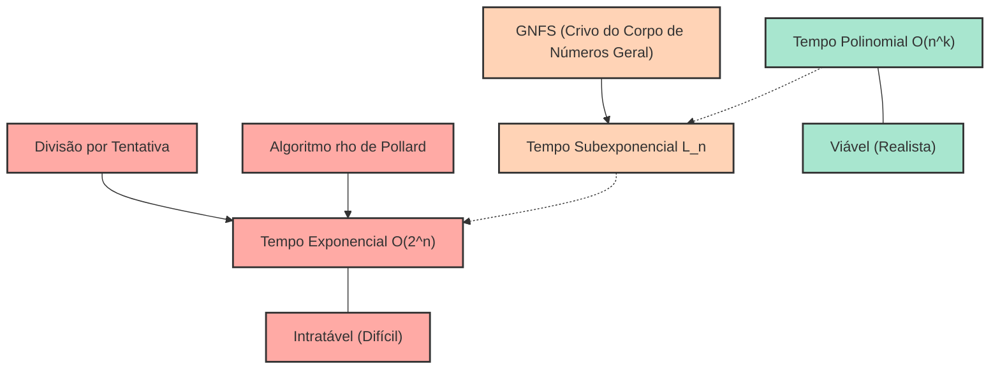
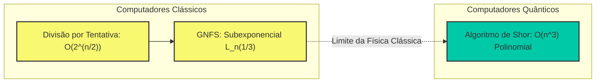

# Introdução: Por que a fatoração de primos é "difícil"?

Na sociedade moderna da internet, a razão pela qual podemos desfrutar de compras online e trocar informações confidenciais com segurança deve-se à existência da "tecnologia de criptografia". E a base da segurança dessa tecnologia (especialmente a criptografia RSA, amplamente utilizada) baseia-se no fato matemático de que "a fatoração de números inteiros gigantes em primos é extremamente difícil".

À primeira vista, a fatoração de primos pode parecer uma tarefa simples, apenas "decompor um número em multiplicações de números primos", mas à medida que o número de dígitos aumenta, ela se transforma em um problema tão difícil que mesmo o supercomputador mais rápido do mundo não conseguiria resolvê-lo, mesmo se operasse por dezenas ou centenas de anos. A fatoração de primos que normalmente aprendemos na escola é, no máximo, o simples trabalho de dividir por $2$, $3$ ou $5$, mas quando confrontada com o produto de primos desconhecidos com centenas de dígitos, essa abordagem simples desmorona completamente.

Neste artigo, partiremos do conceito de "complexidade computacional (notação Big-O: $\mathcal{O}$)", que é fundamental na ciência da informação e da computação, para explicar em detalhes, e de forma matemática, quanto tempo de computação é necessário para vários algoritmos de fatoração de primos (como a divisão por tentativa, algoritmo $\rho$ de Pollard, crivo do corpo de números geral, etc.). Em seguida, vamos desvendar minuciosamente por que a fatoração de primos de números gigantescos é praticamente impossível em computadores clássicos, como isso protege nossas informações e privacidade, e até como os computadores quânticos irão subverter essa premissa.

---

# Definição Rigorosa de Complexidade Computacional e Notação Big O ($\mathcal{O}$)

Ao avaliar o desempenho ou a eficiência de um algoritmo, não basta simplesmente medir o "tempo de execução do programa (em segundos)". Isso ocorre porque o tempo de execução depende fortemente do desempenho do computador utilizado (frequência do clock da CPU, velocidade da memória, etc.), da linguagem de programação e da otimização do compilador.

Portanto, a **Complexidade de Tempo (Time Complexity)** é usada como uma métrica de avaliação universal independente de hardware ou ambiente, e a notação para expressá-la é a **Notação Big O (Big-O Notation)**. A notação Big O é uma notação matemática que expressa como o tempo de execução (ou número de etapas de execução) de um algoritmo aumenta em relação ao tamanho dos dados de entrada $N$ quando este se torna muito grande (taxa de crescimento assintótico).

## Definição Matemática da Notação Assintótica

Na ciência da computação, para funções $f(n)$ e $g(n)$, $f(n) = \mathcal{O}(g(n))$ é matematicamente definido da seguinte forma:

$$ \exists c > 0, \exists n_0 > 0 \text{ s.t. } \forall n \ge n_0, 0 \le f(n) \le c \cdot g(n) $$

Isso significa que "quando o tamanho da entrada $n$ é grande o suficiente ($n \ge n_0$), o crescimento da função $f(n)$ é limitado superiormente por algum múltiplo constante de $g(n)$". Ou seja, indica um "Limite Superior (Upper Bound)" em que o tempo de processamento do algoritmo se enquadrará em um múltiplo constante de $g(n)$ mesmo no pior dos casos.

Da mesma forma, há $\Omega$ (Big Omega) como uma notação que mostra o limite inferior, e $\Theta$ (Big Theta) como uma notação para quando os limites superior e inferior coincidem, mas geralmente, a notação $\mathcal{O}$ é a mais frequentemente usada ao discutir a complexidade computacional no pior caso de um algoritmo.

## Principais Classes de Complexidade Computacional

Existem várias classes representativas de complexidade computacional. Vamos analisá-las na ordem do menor tempo de execução (mais eficiente).

1. **$\mathcal{O}(1)$ : Tempo constante (Constant time)**
   Um algoritmo cujo tempo de execução não muda independentemente de quão grande o tamanho da entrada $N$ se torne. Exemplos incluem acessar um valor especificando um índice de matriz, ou pesquisar em uma tabela hash (no caso ideal).

2. **$\mathcal{O}(\log N)$ : Tempo logarítmico (Logarithmic time)**
   Um algoritmo altamente eficiente em que, mesmo que o tamanho da entrada dobre, o tempo de execução aumenta apenas por uma constante. A "Busca Binária (Binary Search)", que procura um valor desejado em uma matriz classificada, é um exemplo típico. Mesmo que a quantidade de dados seja de 1 bilhão, você pode encontrar os dados desejados com apenas cerca de 30 comparações.

3. **$\mathcal{O}(N)$ : Tempo linear (Linear time)**
   O tempo de execução aumenta em proporção ao tamanho da entrada. Se os dados aumentarem 10 vezes, o tempo também aumentará 10 vezes. A "Busca Linear", que verifica todos os elementos de uma matriz sequencialmente, é um exemplo.

4. **$\mathcal{O}(N \log N)$ : Tempo linearítmico (Linearithmic time)**
   Embora seja ligeiramente mais lento que $\mathcal{O}(N)$, enquadra-se na categoria de eficiência. Muitos algoritmos de classificação práticos e de alta velocidade têm essa complexidade, como o Merge Sort e o Quick Sort (complexidade média).

5. **$\mathcal{O}(N^2)$ : Tempo polinomial / Tempo quadrático (Quadratic time)**
   Quando o tamanho da entrada dobra, o tempo de execução quadruplica, e se aumentar 10 vezes, aumenta 100 vezes. Processos simples usando loops duplos, Bubble Sort e Insertion Sort são exemplos. Quando o volume de dados excede dezenas de milhares, o processamento leva tempo. Essas complexidades computacionais expressas na forma de $\mathcal{O}(N^k)$ são chamadas coletivamente de **Tempo Polinomial (Polynomial time)**.

6. **$\mathcal{O}(2^N)$ : Tempo exponencial (Exponential time)**
   O tempo de execução dobra apenas adicionando 1 ao tamanho da entrada. É extremamente ineficiente e, apenas por $N$ chegar a 40 ou 50, o cálculo não terminará em um tempo realista, mesmo nos computadores mais avançados. Exemplos incluem a pesquisa exaustiva do problema da mochila (knapsack problem) ou abordagens simples para o problema do caixeiro-viajante.

7. **$\mathcal{O}(N!)$ : Tempo fatorial (Factorial time)**
   Aumenta ainda mais rápido do que $\mathcal{O}(2^N)$. São algoritmos que tentam todas as permutações, como no problema do caixeiro-viajante.

O diagrama Mermaid a seguir é uma comparação esquemática da taxa de crescimento do tempo de execução (número de etapas) de cada complexidade computacional em relação ao aumento de $N$.

Acredito que agora você entende o quão importante é a diferença na complexidade computacional na seleção de algoritmos. Na tecnologia de criptografia, o fato de os problemas exigirem "tempo exponencial" ou "complexidades computacionais próximas a isso" (ou seja, problemas que não são fáceis de resolver) é usado intencionalmente para garantir a segurança.

---

# A Estrutura da Criptografia RSA e o Problema da Fatoração de Primos

Para entender por que a fatoração de primos é importante, vamos rever brevemente a estrutura da criptografia RSA. A criptografia RSA é um sistema de criptografia de chave pública desenvolvido em 1977 por três pessoas: Ronald Rivest, Adi Shamir e Leonard Adleman.

### Etapas de Geração de Chaves
1. Dois números primos muito grandes, $p$ e $q$, são selecionados aleatoriamente. (Por exemplo, cada um com 1024 bits de comprimento)
2. Eles são multiplicados para calcular $N = p \times q$. Este $N$ é divulgado para o mundo inteiro como parte da chave pública. (Terá 2048 bits de comprimento)
3. Calcula-se a função totiente de Euler $\phi(N) = (p-1)(q-1)$.
4. Um número inteiro $e$ co-primo de $\phi(N)$ é escolhido, e isso também se torna a chave pública.
5. Calcula-se a chave privada $d$ tal que $e \times d \equiv 1 \pmod{\phi(N)}$.

O que é extremamente importante aqui é o fato de que **"para descriptografar a mensagem, é necessária a chave privada $d$, e para calcular $d$, $\phi(N)$ é necessário, e para calcular $\phi(N)$, $N$ deve ser fatorado em primos $p$ e $q$"**.

A multiplicação de números primos gigantescos $p \times q$ termina num instante, mas descobrir os $p$ e $q$ originais (fatorá-los) a partir do resultado $N$ é irremediavelmente difícil. Essa propriedade de "função de via única (One-way function)" é o próprio núcleo da criptografia RSA.

Existe um ponto muito importante a se notar aqui. O "tamanho da entrada $n$" no problema de fatoração não é o tamanho do próprio número $N$, mas "o número de bits necessários para representar o número $N$".
Se o número de dígitos ao expressar o inteiro $N$ em formato binário for $n$, então $n \approx \log_2 N$. Em outras palavras, a complexidade computacional do algoritmo deve ser avaliada não em relação a $N$, mas em relação a $n = \log_2 N$ (ou $\ln N$).

---

# História e Complexidade dos Algoritmos de Fatoração de Primos

A partir daqui, explicaremos em detalhes os mecanismos e as complexidades computacionais de vários algoritmos que decompõem um dado número composto $N$ em um produto de números primos. É também a história de como a humanidade tem desafiado os limites da fatoração de primos.

## 1. Divisão por Tentativa (Trial Division)

O algoritmo mais intuitivo e primitivo é o "método de divisão por tentativa". É um método de testar sequencialmente se $N$ pode ser dividido por números primos a partir de $2$.

### Visão Geral do Algoritmo
Ele utiliza a propriedade de que os fatores primos de $N$ nunca excederão no máximo $\sqrt{N}$ (como $\sqrt{N} \times \sqrt{N} = N$, qualquer fator primo maior do que isso será necessariamente pareado com um fator primo igual ou inferior a $\sqrt{N}$).
Portanto, verificamos se ele é divisível por todos os números (ou números primos) até $2, 3, 5, 7, \dots, \lfloor\sqrt{N}\rfloor$.

### Avaliação da Complexidade Computacional
No pior dos casos (por exemplo, quando $N$ é o produto de dois grandes primos), é necessário realizar divisões até $\sqrt{N}$.
Como mencionado acima, o tamanho da entrada $n$ é $n = \log_2 N$, portanto, pode ser expresso como $N = 2^n$.
Consequentemente, o número máximo de passos computacionais é proporcional a:

$$ \sqrt{N} = \sqrt{2^n} = (2^n)^{1/2} = 2^{n/2} $$

Isso significa que, para um comprimento de bit $n$, a complexidade computacional é **$\mathcal{O}(2^{n/2})$**. Em outras palavras, a divisão por tentativa é um **"algoritmo de tempo exponencial puro"** em relação a $n$.
Para cada aumento de 1 bit (o número dobra), o tempo de computação é multiplicado por aproximadamente $\sqrt{2} \approx 1.414$. Se $N$ for um número que excede 1024 bits (cerca de 300 dígitos decimais), os cálculos não terminariam nem mesmo se o tempo gasto equivalesse à idade do universo.

## 2. Método de Fatoração de Fermat (Fermat's Factorization Method)

Este é um método concebido pelo matemático do século 17, Pierre de Fermat. Dado um número composto ímpar $N$, ele tenta expressar $N$ como a diferença de dois quadrados perfeitos.

$$ N = x^2 - y^2 = (x - y)(x + y) $$

Se tais $x$ e $y$ forem encontrados, $a = x - y$ e $b = x + y$ se tornam os fatores de $N$.
No algoritmo, incrementamos sequencialmente $x$ a partir de $\lceil \sqrt{N} \rceil$ e verificamos se $x^2 - N$ é um quadrado perfeito (o quadrado de algum número inteiro $y$).
Este método funciona extremamente rápido quando os dois fatores primos $p$ e $q$ são valores muito próximos. No entanto, em um caso geral (onde $p$ e $q$ são valores aleatoriamente distantes um do outro), ele acaba exigindo o mesmo tempo exponencial do método da divisão por tentativa.

## 3. Algoritmo $\rho$ de Pollard (Pollard's rho algorithm)

Um dos algoritmos criados para romper as barreiras do método de divisão por tentativa foi o "algoritmo $\rho$ (rho) de Pollard", publicado por John Pollard em 1975.

### Visão Geral do Algoritmo
Este método aplica o conceito probabilístico chamado "Paradoxo do Aniversário (Birthday Paradox)" e a periodicidade de sequências de números pseudoaleatórios (o fato de a sua forma lembrar a letra grega $\rho$ é a origem do nome).

Ele gera uma sequência usando alguma função de geração de números pseudoaleatórios $f(x) = (x^2 + 1) \pmod N$, e encontra dois valores dentro da sequência tais que $x_i \equiv x_j \pmod p$ ($p$ sendo um fator primo desconhecido de $N$).
Neste momento, $x_i - x_j$ é um múltiplo de $p$, portanto, ao calcular o máximo divisor comum $\gcd(|x_i - x_j|, N)$, é possível extrair $p$ (ou seja, o fator primo de $N$) com alta probabilidade. Combinando-o com o algoritmo de detecção de ciclos de Robert Floyd (o algoritmo da lebre e da tartaruga), ele calcula eficientemente, limitando o uso de memória a $\mathcal{O}(1)$.

### Avaliação da Complexidade Computacional
Sabe-se que o número de passos necessários para o algoritmo $\rho$ de Pollard encontrar um fator primo $p$ é de aproximadamente $\mathcal{O}(\sqrt{p})$.
No pior caso (quando $N$ é o produto de dois primos do mesmo tamanho $p$ e $q$, resultando em $p \approx \sqrt{N}$), a complexidade é $\mathcal{O}(N^{1/4})$.

Expresso em termos do tamanho da entrada $n = \log_2 N$:

$$ N^{1/4} = (2^n)^{1/4} = 2^{n/4} $$

Portanto, a complexidade computacional é **$\mathcal{O}(2^{n/4})$**.
Em comparação com $\mathcal{O}(2^{n/2})$ da divisão por tentativa, houve uma aceleração drástica e, na prática, é um algoritmo incrivelmente poderoso para decompor números de escala média (dezenas de dígitos). No entanto, ele ainda não superou a barreira do "tempo exponencial" em relação ao comprimento de bit $n$, sendo impotente contra números gigantescos de 2048 bits (cerca de 600 dígitos em base decimal), como os usados na criptografia RSA.

## 4. Crivo Quadrático de Múltiplos Polinômios (MPQS: Multiple Polynomial Quadratic Sieve)

Na década de 1980, Carl Pomerance inventou o "Crivo Quadrático (Quadratic Sieve: QS)". É uma extensão do conceito de "diferença de quadrados" de Fermat.
O método de Fermat procurava diretamente por $x^2 - y^2 = N$, mas o crivo quadrático busca uma condição mais branda.

$$ x^2 \equiv y^2 \pmod N $$
e
$$ x \not\equiv \pm y \pmod N $$

Se conseguirmos encontrar tal par de $x$ e $y$, então $x^2 - y^2 = (x - y)(x + y)$ será um múltiplo de $N$. Assim, calculando $\gcd(x - y, N)$ ou $\gcd(x + y, N)$, podemos obter um fator primo não trivial de $N$.

No crivo quadrático, nós buscamos extensivamente por $x$ tal que $x^2 \pmod N$ seja um "número cujos fatores primos contêm apenas primos pequenos (que é chamado de número $B$-suave)", e alinhamos os resultados de sua fatoração em forma de matriz (um sistema de equações lineares sobre o campo binário $\mathbb{F}_2$). Em seguida, multiplicamos as múltiplas relações usando a eliminação de Gauss e afins, e construímos $x^2 \equiv y^2 \pmod N$ ajustando de forma que o lado direito seja um quadrado perfeito (onde o expoente de cada fator primo é par).

O crivo quadrático era o algoritmo mais rápido do mundo antes do surgimento do crivo do corpo de números geral, e ainda é considerado o método mais rápido da atualidade para a fatoração de números com 100 dígitos ou menos.

## 5. Aprofundamento no Crivo do Corpo de Números Geral (General Number Field Sieve: GNFS)

Atualmente, aquele considerado "o mais rápido do mundo" na fatoração de primos para números gigantes com mais de 100 dígitos é o **Crivo do Corpo de Números Geral (GNFS)**. Foi concebido no final da década de 1980, e é um algoritmo muito avançado que utiliza descobertas profundas da teoria algébrica dos números (corpos de números), desenvolvendo ainda mais o crivo quadrático.

Quando se trata de ataques à criptografia RSA (fatoração de primos a partir de chaves públicas), o GNFS é aquele que continua constantemente a quebrar recordes mundiais. Houve um relatório de que em 2020 foi bem-sucedida a fatoração em primos de um número composto de 829 bits (250 dígitos decimais) (RSA-250), mas isso exigiu o funcionamento em paralelo de uma rede de milhares de computadores por um longo período de tempo.

### Estrutura Matemática do Algoritmo
O GNFS é bastante complexo, mas basicamente progride seguindo estas etapas:

1. **Seleção de Polinômio (Polynomial Selection):**
   Para $N$, selecionamos um certo inteiro $m$ e um polinômio irredutível $f(X)$ com coeficientes pequenos tal que $f(m) \equiv 0 \pmod N$. Isso define um anel de inteiros $\mathbb{Z}[\alpha]$ do corpo algébrico (corpo de números) pela adjunção de uma raiz $\alpha$ de $f(X)$.

2. **Crivagem (Sieving):**
   Procuramos números suaves simultaneamente em "dois mundos diferentes": o anel de inteiros racionais $\mathbb{Z}$ sobre o corpo racional e o anel de inteiros algébricos $\mathbb{Z}[\alpha]$ sobre o corpo algébrico. Especificamente, buscamos massivamente pares $(a, b)$ onde as normas do inteiro racional $a - bm$ e do inteiro algébrico $a - b\alpha$ possam ser completamente decompostas sobre um conjunto predeterminado de primos pequenos (Base de Fatores: Factor Base).

3. **Redução de Matriz (Matrix Reduction):**
   Representamos o imenso número de pares suaves encontrados como uma matriz (uma enorme matriz esparsa). Determinamos o espaço solução sobre o campo binário $\mathbb{F}_2$ usando o algoritmo de Lanczos (por exemplo, método de Lanczos em bloco). Não é incomum que essas matrizes atinjam proporções de milhões de linhas por milhões de colunas.

4. **Cálculo da Raiz Quadrada (Square Root):**
   Das soluções da matriz, construímos quadrados gigantes em cada um dos "dois mundos diferentes", para finalmente deduzir a relação $X^2 \equiv Y^2 \pmod N$. E então calculamos $\gcd(X-Y, N)$ para obter o fator primo.

### Complexidade Computacional do Crivo do Corpo de Números Geral: Tempo Subexponencial (Sub-exponential time)

A maior conquista do GNFS foi reduzir a complexidade computacional da fatoração de primos de um "tempo exponencial puro" para um **"tempo subexponencial (Sub-exponential time)"**.
A complexidade de tempo assintótica do GNFS é expressa através do uso de uma notação especial chamada notação L (L-notation) da seguinte forma:

$$ L_N[\gamma, c] = \exp\left( (c + o(1)) (\ln N)^\gamma (\ln \ln N)^{1-\gamma} \right) $$

Onde, $N$ é o número a ser fatorado e $\ln$ é o logaritmo natural.
$\gamma$ é um parâmetro que assume o valor $0 \le \gamma \le 1$, e indica o "grau" de complexidade do algoritmo.
- Quando $\gamma = 0$, $L_N[0, c]$ se torna $(\ln N)^c$, implicando tempo polinomial $\mathcal{O}(n^c)$. (Eficiente)
- Quando $\gamma = 1$, $L_N[1, c]$ se torna $e^{c \ln N} = N^c$, implicando tempo exponencial $\mathcal{O}(2^{cn})$. (Ineficiente)

No caso do GNFS, este parâmetro torna-se o seguinte:

$$ L_N\left[\frac{1}{3}, \left(\frac{64}{9}\right)^{1/3}\right] = e^{\left(\sqrt[3]{\frac{64}{9}} + o(1)\right) (\ln N)^{1/3} (\ln \ln N)^{2/3}} $$

Nesta equação, a constante $c = (64/9)^{1/3} \approx 1.923$.
Reescrevendo em termos de tamanho de entrada $n \approx \ln N$ (proporcional ao comprimento do bit), o comportamento da complexidade computacional se assemelha aproximadamente a:

$$ \mathcal{O}\left( \exp\left( 1.923 \cdot n^{1/3} (\ln n)^{2/3} \right) \right) $$

Você pode ver que a parte do expoente não depende de $n$ à potência de 1, mas depende de $n^{1/3}$ (a raiz cúbica de $n$).
Enquanto o algoritmo $\rho$ de Pollard possuía $\mathcal{O}(2^{n/4})$, isto é, $\mathcal{O}(\exp(c \cdot n^1))$, no GNFS o grau de $n$ foi reduzido para $1/3$.
Isto significa que, embora não tenha chegado ao tempo polinomial ($\gamma=0$), o aumento da complexidade é consideravelmente mais brando do que o do tempo exponencial puro ($\gamma=1$). Este é o motivo de ser chamado de "tempo subexponencial".

---

# Os Limites da Criptografia Moderna e os Computadores Quânticos

Como vimos, a humanidade conseguiu evoluir os algoritmos da divisão por tentativa para o GNFS, concentrando seu brilhantismo matemático na tentativa de suplantar o obstáculo imposto pela fatoração. Contudo, mesmo com o GNFS, a fatoração de primos continua incapaz de ser resolvida em "tempo polinomial" num computador clássico.

## O Problema P vs NP e a Posição da Fatoração de Primos

Um dos maiores problemas não resolvidos da ciência da computação é a hipótese "P = NP".
O problema de fatoração de primos pertence a NP (uma classe de problemas onde, uma vez fornecida uma resposta, a corretude pode ser testada em tempo polinomial), no entanto, não está provado que ele seja NP-completo (a classe de problemas mais complexos da categoria NP).
Adicionalmente, se ele pertence a P (uma classe de problemas solucionáveis em tempo polinomial, ou seja, onde existe um algoritmo em tempo polinomial), ainda não se sabe.

Muitos estudiosos preveem que a fatoração de primos pertence a uma classe intermediária que não é P nem NP-completo (NP-intermediário). Se fosse descoberto um algoritmo em tempo polinomial (por exemplo, $\mathcal{O}(n^3)$) num computador clássico, seria um evento colossal que colapsaria sistemas de criptografia mundiais, mas até então tal algoritmo ainda não foi encontrado. Estima-se que decifrar a criptografia RSA-2048 exigiria mais tempo que o tempo de vida do universo, mesmo se o desempenho do computador clássico melhorasse consoante à lei de Moore.

## O Computador Quântico como um "Divisor de Águas": Algoritmo de Shor

A criptografia RSA, robusta diante dos computadores clássicos, entra em um panorama diametralmente distinto com a viabilidade dos "computadores quânticos", que funcionam baseados em princípios inteiramente diversos.
O **"Algoritmo de Shor (Shor's algorithm)"**, revelado por Peter Shor em 1994, utiliza a transformada quântica de Fourier para solucionar de maneira notável o problema da fatoração de primos em **tempo polinomial $\mathcal{O}(n^3)$** (ou mais precisamente, requerendo no contexto das portas lógicas quânticas, cerca de $\mathcal{O}(n^2 \log n \log \log n)$).

No diagrama Mermaid abaixo, note o contraste nas complexidades computacionais para algoritmos clássicos versus quânticos.

Com o algoritmo de Shor, o processo de "identificação de períodos", um gargalo severo em algoritmos clássicos, é resolvido quase de modo imediato e contíguo via o emprego do emaranhamento quântico (quantum entanglement) e da sobreposição quântica integrados à "Transformada Quântica de Fourier (QFT)".
Se este puder ser posto em marcha utilizando um computador quântico de dimensão viável (pouco ruído e abundância de qubits lógicos), assevera-se que a criptografia RSA-2048, outrora percebida como impenetrável, estaria sucumbindo por inteiro de horas até poucos dias.

Face a semelhante prenúncio, analistas criptográficos ao redor do globo, aliados ao NIST (Instituto Nacional de Padrões e Tecnologia dos EUA), correm rapidamente para conduzir tarefas de padronização orientadas para a "Criptografia Pós-Quântica (Post-Quantum Cryptography: PQC)", com o desafio de continuar sendo dificultoso de quebrar mesmo para os computadores quânticos. A Criptografia Baseada em Reticulados (Lattice-based cryptography) constitui um modelo preponderante disso, pois tem seus embasamentos protetivos calçados numa complexidade matemática fundamentalmente alheia à fatoração de primos (como no problema do vetor mais curto).

---

# Conclusão

Neste compêndio, investigamos mais profundamente abordando desde o limiar da complexidade (notação Big O), prosseguindo por todo o processo evolutivo dos algoritmos para fatorar números primos e até seus constrangimentos restritivos matemáticos.

* A **Notação Big O ($\mathcal{O}$)** exprime o crescimento do número das etapas computacionais quando confrontado ao desenvolvimento do tamanho de entrada $n$, sendo um indicativo crítico em que perdura uma colossal barreira que no terreno prático é insuperável dividindo o tempo polinomial ao exponencial.
* O **método de divisão por tentativa** e o **algoritmo $\rho$ de Pollard** configuram-se algoritmos puros no estrato do "tempo exponencial" e demonstram incapacidade de lidar frente à números magnos.
* O **Crivo do Corpo de Números Geral (GNFS)**, reputado o preeminente algoritmo clássico mais rápido do mundo até hoje, atinge um desempenho de "tempo subexponencial" servindo-se da intrincada Teoria Algébrica dos Números, não se qualificando ainda na ordem de tempo polinomial e resultando que números avantajados peçam de intervalos incrivelmente estratosféricos.
* Esse exato preceito (altamente considerado verossímil) do qual **"Um algoritmo clássico com capacidade para desatar as dificuldades num ritmo de tempo polinomial de fato é inexistente"** afiança e atesta as engrenagens de segurança providas pelo RSA, amparando integralmente nosso atual tecido social e digital.
* Em contraponto a isso, atrelado com o vislumbramento propiciado por **computadores quânticos conjuntamente ao algoritmo de Shor**, a viabilidade técnica no tangente à fatoração em ritmo de ordem polinomial passa agora a ser imaginável na área teórica, fazendo com que as ferramentas cifradas estejam em vias de uma contundente migração a favor de um ciclo futurista (a criptografia pós-quântica).

As circunstâncias ditando que um termo teórico peculiar qual a complexidade algorítmica detém implicações retas à segurança da vida ordinária e quotidiana é singularmente uma entre as facetas atrativas e formidáveis que englobam a Ciência da Informação e Matemática. Pedimos gentilmente sua plena atenção a respeito da jornada percorrida pelo seguimento inovador desses aparatos, em vista aos andamentos de construção pertinentes às computações quânticas com atrelações que delineiam os moldes evolutivos referentes a essa seara criptográfica.
