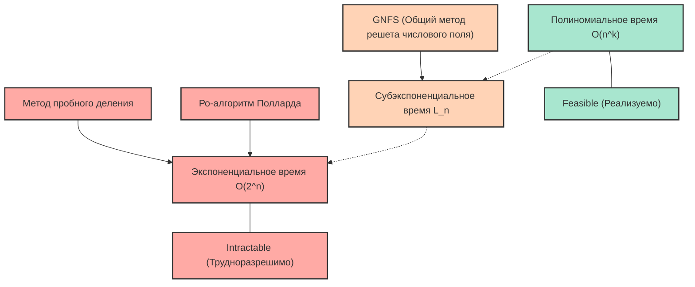
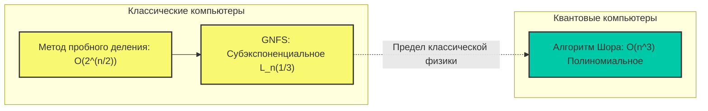

# Введение: Почему факторизация простых чисел — это «сложно»?

В современном интернет-обществе мы можем спокойно наслаждаться онлайн-покупками и обмениваться конфиденциальной информацией именно благодаря существованию «криптографии». И основу безопасности этих криптографических технологий (особенно широко используемого алгоритма RSA) составляет математический факт: «разложение огромных целых чисел на простые множители является крайне сложной задачей».

На первый взгляд, разложение на простые множители кажется простой задачей — «просто разложить число на произведение простых чисел», но с увеличением количества цифр это превращается в сверхсложную проблему, которую не решить даже самым быстрым суперкомпьютерам в мире, если они будут работать десятилетиями или столетиями. Разложение на простые множители, которое мы обычно изучаем в школе, — это простая задача деления на $2$, $3$ или $5$, но когда мы сталкиваемся с произведением неизвестных простых чисел длиной в сотни цифр, этот простой подход полностью рушится.

В этой статье мы начнем с базовой концепции информатики и вычислительной техники — «вычислительной сложности» (нотации «О-большое»: $\mathcal{O}$), и подробно математически объясним, сколько времени требуется различным алгоритмам для решения задачи разложения на множители (метод пробного деления, $\rho$-алгоритм Полларда, общий метод решета числового поля и т. д.). Затем мы детально разберем, почему разложение огромных чисел на множители на классических компьютерах практически невозможно, как это защищает нашу информацию и конфиденциальность, и, наконец, как квантовые компьютеры могут перевернуть эти представления.

---

# Строгое определение вычислительной сложности и нотации «О-большое» ($\mathcal{O}$)

При оценке производительности и эффективности алгоритмов недостаточно просто измерить «время выполнения программы (в секундах)». Это связано с тем, что время выполнения сильно зависит от производительности используемого компьютера (тактовой частоты процессора, скорости памяти и т. д.), языка программирования и оптимизации компилятора.

Поэтому в качестве универсального показателя оценки, не зависящего от оборудования и среды, используется **временная сложность (Time Complexity)**, а для ее выражения применяется **нотация «О-большое» (Big-O Notation)**. Нотация «О-большое» — это математическая запись, которая показывает, как время выполнения алгоритма (или количество шагов выполнения) увеличивается по отношению к $N$ (асимптотическая скорость роста), когда размер входных данных $N$ становится очень большим.

## Математическое определение асимптотической нотации

В информатике для функций $f(n)$ и $g(n)$ выражение $f(n) = \mathcal{O}(g(n))$ математически определяется следующим образом:

$$ \exists c > 0, \exists n_0 > 0 \text{ s.t. } \forall n \ge n_0, 0 \le f(n) \le c \cdot g(n) $$

Это означает, что «когда размер ввода $n$ достаточно велик ($n \ge n_0$), рост функции $f(n)$ ограничен сверху некоторой константой, умноженной на $g(n)$». Другими словами, это указывает на «верхнюю оценку» (Upper Bound), показывая, что время работы алгоритма даже в худшем случае не превысит $g(n)$, умноженное на константу.

Аналогичным образом, существует нотация $\Omega$ (Омега-большое) для обозначения нижней оценки и $\Theta$ (Тета-большое) для случаев, когда верхняя и нижняя оценки совпадают, но, как правило, при обсуждении вычислительной сложности алгоритмов в худшем случае чаще всего используется нотация $\mathcal{O}$.

## Основные классы вычислительной сложности

Существует несколько основных классов вычислительной сложности. Давайте рассмотрим их в порядке возрастания времени выполнения (от наиболее до наименее эффективных).

1. **$\mathcal{O}(1)$ : Константное время (Constant time)**
   Это алгоритмы, время выполнения которых не меняется независимо от того, насколько большим становится размер ввода $N$. Примерами могут служить получение значения массива по индексу или поиск в хеш-таблице (в идеальном случае).

2. **$\mathcal{O}(\log N)$ : Логарифмическое время (Logarithmic time)**
   Это очень эффективные алгоритмы, где при удвоении размера ввода время выполнения увеличивается лишь на константу. Типичным примером является «бинарный поиск» (Binary Search) нужного значения в отсортированном массиве. Даже если объем данных составляет миллиард, найти нужные данные можно всего примерно за 30 сравнений.

3. **$\mathcal{O}(N)$ : Линейное время (Linear time)**
   Время выполнения увеличивается пропорционально размеру ввода. Если объем данных увеличивается в 10 раз, время также увеличивается в 10 раз. Примером служит «линейный поиск», при котором последовательно проверяются все элементы массива.

4. **$\mathcal{O}(N \log N)$ : Линеаритмическое время (Linearithmic time)**
   Немного медленнее, чем $\mathcal{O}(N)$, но все еще относится к эффективным. Большинство практичных алгоритмов быстрой сортировки, таких как сортировка слиянием (Merge Sort) или быстрая сортировка (Quick Sort, средняя сложность), имеют такую сложность.

5. **$\mathcal{O}(N^2)$ : Квадратичное время (Quadratic time)**
   Если размер ввода увеличивается в 2 раза, время выполнения возрастает в 4 раза; если в 10 раз — в 100 раз. Сюда относятся простые операции с использованием двойных циклов, пузырьковая сортировка и сортировка вставками. Если объем данных превышает несколько десятков тысяч, обработка начинает занимать много времени. Сложности, выраженные в форме $\mathcal{O}(N^k)$, собирательно называются **полиномиальным временем (Polynomial time)**.

6. **$\mathcal{O}(2^N)$ : Экспоненциальное время (Exponential time)**
   Увеличение размера ввода всего на 1 приводит к удвоению времени выполнения. Это крайне неэффективно: если $N$ достигает 40 или 50, даже самые современные компьютеры не смогут закончить вычисления за разумное время. К этой категории относятся полный перебор для задачи о рюкзаке и простое решение задачи коммивояжера.

7. **$\mathcal{O}(N!)$ : Факториальное время (Factorial time)**
   Увеличивается еще быстрее, чем $\mathcal{O}(2^N)$. Пример — алгоритмы, проверяющие все перестановки в задаче коммивояжера.

Следующая диаграмма Mermaid дает схематическое сравнение скорости роста времени выполнения (количества шагов) для различных вычислительных сложностей по мере увеличения $N$.

Я думаю, вы поняли, насколько важна разница в вычислительной сложности при выборе алгоритма. В криптографии вопросы, требующие «экспоненциального времени» или «близкой к нему вычислительной сложности» (то есть проблемы, которые нелегко решить), намеренно используются для обеспечения безопасности.

---

# Механизм шифрования RSA и проблема факторизации простых чисел

Чтобы понять, почему факторизация на простые множители так важна, давайте кратко рассмотрим, как работает алгоритм RSA. RSA — это криптографическая система с открытым ключом, разработанная в 1977 году Рональдом Ривестом, Ади Шамиром и Леонардом Адлеманом.

### Шаги генерации ключей
1. Случайным образом выбираются два очень больших простых числа $p$ и $q$ (например, каждое длиной 1024 бита).
2. Они перемножаются для вычисления $N = p \times q$. Это число $N$ публикуется для всего мира как часть открытого ключа (его длина составит 2048 бит).
3. Вычисляется функция Эйлера $\phi(N) = (p-1)(q-1)$.
4. Выбирается целое число $e$, взаимно простое с $\phi(N)$, которое также становится частью открытого ключа.
5. Вычисляется такое число $d$ (закрытый ключ), что $e \times d \equiv 1 \pmod{\phi(N)}$.

Здесь крайне важен тот факт, что **«для расшифровки необходим закрытый ключ $d$, для вычисления $d$ необходимо знать $\phi(N)$, а для вычисления $\phi(N)$ необходимо разложить $N$ на простые множители $p$ и $q$»**.

Умножение огромных простых чисел $p \times q$ выполняется за мгновение, но найти исходные $p$ и $q$ из результата $N$ (разложить на простые множители) безнадежно сложно. Свойство этой «односторонней функции» (One-way function) и является сердцем криптографии RSA.

Здесь есть один очень важный момент, на который следует обратить внимание. «Размер ввода $n$» в проблеме факторизации — это не величина самого числа $N$, а «количество битов, необходимых для представления числа $N$».
Если $n$ — это количество цифр при представлении целого числа $N$ в двоичной системе, то $n \approx \log_2 N$. Это означает, что вычислительная сложность алгоритма должна оцениваться относительно $n = \log_2 N$ (или $\ln N$), а не относительно $N$.

---

# История алгоритмов факторизации простых чисел и их вычислительная сложность

С этого момента мы подробно объясним механизмы и вычислительную сложность различных алгоритмов для разложения заданного составного числа $N$ на произведение простых чисел. Это также история того, как человечество бросало вызов пределам факторизации простых чисел.

## 1. Метод пробного деления (Trial Division)

Самый интуитивно понятный и примитивный алгоритм — это «метод пробного деления». Это метод последовательной проверки делимости $N$ на простые числа, начиная с $2$.

### Краткое описание алгоритма
Он использует то свойство, что простой множитель $N$ не может превышать $\sqrt{N}$ (так как $\sqrt{N} \times \sqrt{N} = N$, если есть множитель больше, он обязательно будет в паре с множителем меньше или равным $\sqrt{N}$).
Следовательно, мы проверяем делимость на все числа (или простые числа) вплоть до $\lfloor\sqrt{N}\rfloor$, такие как $2, 3, 5, 7, \dots$.

### Оценка вычислительной сложности
В худшем случае (например, когда $N$ является произведением двух огромных простых чисел) необходимо выполнять деление до $\sqrt{N}$.
Как упоминалось ранее, размер ввода $n$ равен $n = \log_2 N$, поэтому его можно выразить как $N = 2^n$.
Следовательно, максимальное количество вычислительных шагов пропорционально следующему значению:

$$ \sqrt{N} = \sqrt{2^n} = (2^n)^{1/2} = 2^{n/2} $$

Это означает вычислительную сложность **$\mathcal{O}(2^{n/2})$** относительно длины в битах $n$. Иначе говоря, метод пробного деления — это **«чисто экспоненциальный (Exponential time) алгоритм»** относительно $n$.
При увеличении количества цифр на 1 бит (число удваивается) время вычислений увеличивается примерно в $\sqrt{2} \approx 1.414$ раза. Если $N$ — число, превышающее 1024 бита (около 300 десятичных цифр), вычисления не завершатся, даже если потратить на них время, равное возрасту Вселенной.

## 2. Метод факторизации Ферма (Fermat's Factorization Method)

Это метод, придуманный французским математиком XVII века Пьером де Ферма. Когда дано нечетное составное число $N$, делается попытка представить $N$ как разность двух квадратов.

$$ N = x^2 - y^2 = (x - y)(x + y) $$

Если найти такие $x$ и $y$, то $a = x - y$ и $b = x + y$ будут множителями числа $N$.
В качестве алгоритма мы последовательно увеличиваем $x$, начиная с $\lceil \sqrt{N} \rceil$, и проверяем, является ли $x^2 - N$ полным квадратом (квадратом некоторого целого числа $y$).
Этот метод работает очень быстро, если значения двух простых множителей $p$ и $q$ очень близки. Однако в общем случае (когда $p$ и $q$ принимают случайно удаленные друг от друга значения) он в конечном итоге требует экспоненциального времени, сопоставимого с методом пробного деления.

## 3. Ро-алгоритм Полларда (Pollard's rho algorithm)

Один из алгоритмов, разработанных для преодоления ограничений метода пробного деления, — это «$\rho$ (ро) алгоритм Полларда», опубликованный Джоном Поллардом в 1975 году.

### Краткое описание алгоритма
Этот метод применяет концепцию теории вероятностей, называемую «парадоксом дней рождения» (Birthday Paradox), и периодичность последовательности псевдослучайных чисел (которая напоминает форму греческой буквы $\rho$, откуда и произошло название).

Используя функцию генерации псевдослучайных чисел $f(x) = (x^2 + 1) \pmod N$, мы генерируем числовую последовательность и находим в ней два значения, для которых выполняется $x_i \equiv x_j \pmod p$ (где $p$ — неизвестный простой множитель $N$).
В этом случае $x_i - x_j$ будет кратно $p$, поэтому, вычислив наибольший общий делитель $\gcd(|x_i - x_j|, N)$, мы с высокой вероятностью сможем выделить $p$ (то есть простой множитель $N$). Комбинируя это с алгоритмом Флойда для поиска цикла (алгоритм черепахи и зайца), вычисления производятся эффективно, при этом использование памяти ограничивается $\mathcal{O}(1)$.

### Оценка вычислительной сложности
Известно, что количество шагов, необходимое $\rho$-алгоритму Полларда для нахождения простого множителя $p$, составляет примерно $\mathcal{O}(\sqrt{p})$.
В худшем случае (когда $N$ является произведением двух простых чисел $p$ и $q$ одинакового размера, то есть $p \approx \sqrt{N}$), вычислительная сложность составляет $\mathcal{O}(N^{1/4})$.

Выразив это через размер ввода $n = \log_2 N$:

$$ N^{1/4} = (2^n)^{1/4} = 2^{n/4} $$

Следовательно, вычислительная сложность равна **$\mathcal{O}(2^{n/4})$**.
По сравнению с $\mathcal{O}(2^{n/2})$ метода пробного деления это резко ускоряет процесс, и на практике этот метод очень эффективен для факторизации чисел среднего размера (несколько десятков цифр). Однако он все еще не преодолел барьер «экспоненциального времени» относительно длины в битах $n$ и бессилен против огромных чисел длиной в 2048 бит (около 600 десятичных цифр), используемых в криптографии RSA.

## 4. Метод множественного полиномиального квадратичного решета (MPQS: Multiple Polynomial Quadratic Sieve)

В 1980-х годах Карл Померанс разработал «метод квадратичного решета (Quadratic Sieve: QS)». Это расширение концепции «разности квадратов» Ферма.
В то время как метод Ферма непосредственно ищет $x^2 - y^2 = N$, метод квадратичного решета ищет более мягкое условие:

$$ x^2 \equiv y^2 \pmod N $$
и
$$ x \not\equiv \pm y \pmod N $$

Если удастся найти такую пару $x, y$, то $x^2 - y^2 = (x - y)(x + y)$ будет кратно $N$. Следовательно, вычислив $\gcd(x - y, N)$ или $\gcd(x + y, N)$, мы сможем получить нетривиальный простой множитель $N$.

В методе квадратичного решета находится большое количество таких $x$, для которых $x^2 \pmod N$ является «числом, имеющим в качестве множителей только малые простые числа» (такие числа называются $B$-гладкими), а результаты их факторизации представляются в виде матрицы (система линейных уравнений над бинарным полем $\mathbb{F}_2$). Затем, используя методы вроде исключения Гаусса, перемножаются несколько соотношений и корректируются так, чтобы правая часть стала полным квадратом (показатель степени каждого простого множителя четный), конструируя таким образом $x^2 \equiv y^2 \pmod N$.

Метод квадратичного решета был самым быстрым в мире алгоритмом до появления общего метода решета числового поля, и он до сих пор считается самым быстрым для разложения чисел, содержащих менее 100 цифр.

## 5. Глубокое погружение в Общий метод решета числового поля (General Number Field Sieve: GNFS)

В настоящее время **Общий метод решета числового поля (GNFS)** считается «самым быстрым в мире» для разложения на множители огромных целых чисел, состоящих из более чем 100 цифр. Этот продвинутый алгоритм, разработанный в конце 1980-х годов, является дальнейшим развитием метода квадратичного решета и использует глубокие результаты алгебраической теории чисел (числовые поля).

Именно GNFS постоянно обновляет мировые рекорды по взлому RSA-шифрования (факторизации по открытому ключу). В 2020 году сообщалось об успешной факторизации составного числа размером 829 бит (250 цифр) (RSA-250), но для этого потребовалось длительное параллельное выполнение вычислений на тысячах компьютеров.

### Математическая структура алгоритма
GNFS очень сложен, но в общих чертах он состоит из следующих шагов:

1. **Выбор полинома (Polynomial Selection):**
   Для числа $N$ выбирается некоторое целое число $m$ и неприводимый полином $f(X)$ с небольшими коэффициентами, такой, что $f(m) \equiv 0 \pmod N$. Это определяет кольцо целых чисел $\mathbb{Z}[\alpha]$ алгебраического поля (числового поля), полученного присоединением корня $\alpha$ полинома $f(X)$.

2. **Просеивание (Sieving):**
   Осуществляется поиск гладких (Smooth) чисел одновременно в «двух разных мирах»: кольце целых чисел над полем рациональных чисел $\mathbb{Z}$ и кольце целых чисел над алгебраическим полем $\mathbb{Z}[\alpha]$. В частности, находится огромное количество пар $(a, b)$ таких, что нормы рационального целого числа $a - bm$ и алгебраического целого числа $a - b\alpha$ полностью разлагаются на заранее определенное множество малых простых чисел (факторная база: Factor Base).

3. **Редукция матрицы (Matrix Reduction):**
   Огромное количество найденных гладких пар представляется в виде матрицы (гигантской разреженной матрицы). Пространство решений находится над бинарным полем $\mathbb{F}_2$ с помощью алгоритма Ланцоша (например, блочного метода Ланцоша). Нередко такая матрица достигает размеров в миллионы строк на миллионы столбцов.

4. **Вычисление квадратного корня (Square Root):**
   Из решения матрицы в каждом из «двух разных миров» создаются огромные полные квадраты, и в итоге выводится соотношение $X^2 \equiv Y^2 \pmod N$. Затем вычисляется $\gcd(X-Y, N)$ для получения простых множителей.

### Вычислительная сложность Общего метода решета числового поля: Субэкспоненциальное время (Sub-exponential time)

Величайшим достижением GNFS стало то, что он снизил вычислительную сложность разложения на множители с «чисто экспоненциального времени» до **«субэкспоненциального времени (Sub-exponential time)»**.
Асимптотическая временная сложность GNFS выражается с использованием специальной нотации, называемой L-нотацией (L-notation), следующим образом:

$$ L_N[\gamma, c] = \exp\left( (c + o(1)) (\ln N)^\gamma (\ln \ln N)^{1-\gamma} \right) $$

Где $N$ — число, которое нужно разложить, а $\ln$ — натуральный логарифм.
Параметр $\gamma$ принимает значения в диапазоне $0 \le \gamma \le 1$ и указывает на «степень» сложности алгоритма.
- При $\gamma = 0$, $L_N[0, c]$ становится $(\ln N)^c$, что означает полиномиальное время $\mathcal{O}(n^c)$ (эффективно).
- При $\gamma = 1$, $L_N[1, c]$ становится $e^{c \ln N} = N^c$, что означает экспоненциальное время $\mathcal{O}(2^{cn})$ (неэффективно).

В случае GNFS этот параметр выглядит следующим образом:

$$ L_N\left[\frac{1}{3}, \left(\frac{64}{9}\right)^{1/3}\right] = e^{\left(\sqrt[3]{\frac{64}{9}} + o(1)\right) (\ln N)^{1/3} (\ln \ln N)^{2/3}} $$

В этой формуле константа $c = (64/9)^{1/3} \approx 1.923$.
Если переписать это через размер ввода $n \approx \ln N$ (пропорционально длине в битах), вычислительная сложность ведет себя примерно так:

$$ \mathcal{O}\left( \exp\left( 1.923 \cdot n^{1/3} (\ln n)^{2/3} \right) \right) $$

Видно, что экспоненциальная часть зависит не от $n$ в первой степени, а от $n^{1/3}$ (кубического корня из $n$).
В то время как у $\rho$-алгоритма Полларда сложность была $\mathcal{O}(2^{n/4})$, то есть $\mathcal{O}(\exp(c \cdot n^1))$, в GNFS степень $n$ снижена до $1/3$.
Это означает, что, хотя полиномиальное время ($\gamma=0$) и не достигнуто, вычислительная сложность растет гораздо медленнее, чем при чисто экспоненциальном времени ($\gamma=1$). Именно поэтому оно называется «субэкспоненциальным временем».

---

# Пределы современной криптографии и квантовые компьютеры

Как мы уже видели, человечество продолжало бросать вызов барьерам факторизации простых чисел, объединяя математическую мудрость и развивая алгоритмы от метода пробного деления до GNFS. Однако даже с GNFS разложение на простые множители все еще не может быть решено за «полиномиальное время» на классических компьютерах.

## Проблема P vs NP и позиция разложения на простые множители

Одной из величайших нерешенных проблем в информатике является «гипотеза P = NP».
Задача факторизации принадлежит к классу NP (классу проблем, правильность ответа на которые можно проверить за полиномиальное время, если ответ предоставлен), но не доказано, что она является NP-полной (самый сложный класс проблем внутри NP).
Также остается нерешенным вопрос о том, принадлежит ли она к классу P (классу проблем, решаемых за полиномиальное время, то есть существует ли полиномиальный алгоритм).

Многие исследователи предполагают, что разложение на простые множители принадлежит к промежуточному классу (NP-intermediate), не являясь ни P, ни NP-полной задачей. Если будет найден алгоритм (например, $\mathcal{O}(n^3)$), решающий задачу разложения на простые множители за полиномиальное время на классическом компьютере, это станет грандиозным событием, которое разрушит криптографические системы по всему миру. Однако на данный момент такого алгоритма не найдено. По оценкам, взлом 2048-битного шифрования RSA займет время, превышающее возраст Вселенной, даже если производительность классических компьютеров будет расти согласно закону Мура.

## Квантовые компьютеры как «изменившие правила игры»: Алгоритм Шора

Шифрование RSA, будучи надежным на классических компьютерах, кардинально изменит свое положение после практической реализации «квантовых компьютеров», которые работают на совершенно иных принципах.
**«Алгоритм Шора (Shor's algorithm)»**, опубликованный Питером Шором в 1994 году, — это алгоритм, который, используя квантовое преобразование Фурье, способен решить задачу факторизации за **полиномиальное время $\mathcal{O}(n^3)$** (или, более точно, примерно $\mathcal{O}(n^2 \log n \log \log n)$ квантовых вентилей).

Давайте посмотрим на разницу в вычислительной сложности между классическими и квантовыми алгоритмами на следующей диаграмме Mermaid.

В алгоритме Шора процесс «поиска периода», который был узким местом в классических алгоритмах, вычисляется мгновенно и параллельно благодаря «квантовому преобразованию Фурье (QFT)», использующему квантовую запутанность и квантовую суперпозицию.
Как только алгоритм станет возможным для запуска на квантовых компьютерах практического масштаба (с низким уровнем шума и достаточным количеством логических кубитов), 2048-битное шифрование RSA, которое сейчас считается безопасным, потенциально может быть полностью взломано за время от нескольких часов до нескольких дней.

Готовясь к этой угрозе, криптографы по всему миру и NIST (Национальный институт стандартов и технологий США) в настоящее время ускоренными темпами ведут работу по стандартизации для перехода на «постквантовую криптографию (Post-Quantum Cryptography: PQC)», которую трудно взломать даже квантовым компьютерам. Ярким примером является криптография на решетках (Lattice-based cryptography), которая основывает свою безопасность на математических трудностях совершенно иного рода, нежели задача разложения на множители (например, задача о кратчайшем векторе).

---

# Заключение

В этой статье мы начали с основ вычислительной сложности (нотации «О-большое») и глубоко погрузились в эволюцию алгоритмов факторизации простых чисел и их математические пределы.

* **Нотация «О-большое» ($\mathcal{O}$)** — это важный показатель, отражающий скорость роста количества вычислительных шагов при увеличении размера ввода $n$, и между полиномиальным и экспоненциальным временем существует огромная стена, непреодолимая на практике.
* **Метод пробного деления** и **$\rho$-алгоритм Полларда** — это чисто «экспоненциальные» алгоритмы, которые бессильны перед огромными числами.
* Самый быстрый в настоящее время классический алгоритм — **Общий метод решета числового поля (GNFS)** — достиг «субэкспоненциального времени» благодаря использованию передовой алгебраической теории чисел, но все же не достигает полиномиального времени, поэтому факторизация огромных чисел требует астрономических затрат времени.
* Именно этот факт — **«не существует (как убедительно предполагается) классического алгоритма, решающего задачу за полиномиальное время»** — гарантирует безопасность шифрования RSA и поддерживает современное цифровое общество.
* Однако с появлением **квантовых компьютеров и алгоритма Шора** факторизация простых чисел за полиномиальное время теоретически становится возможной, и криптография готовится перейти в новую эру (постквантовую криптографию).

Тот факт, что абстрактная концепция вычислительной сложности алгоритмов напрямую связана с безопасностью нашей жизни, является одной из самых захватывающих и увлекательных сторон информатики и математики. Пожалуйста, следите за дальнейшим развитием технологий, особенно за тенденциями в разработке квантовых компьютеров и эволюцией криптографии.
