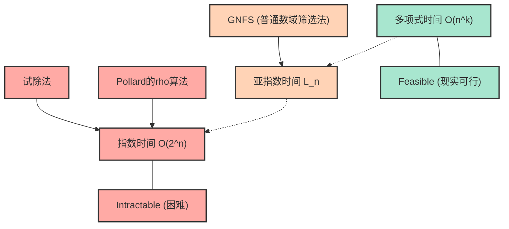
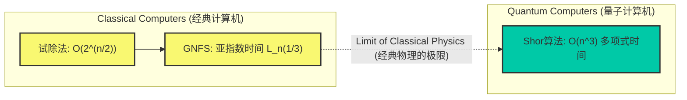

# 引言：为什么素数分解“很难”？

在现代互联网社会中，我们之所以能安心地享受在线购物、交换机密信息，是因为有“密码技术”的存在。而支撑这些密码技术（特别是被广泛使用的RSA加密等）安全性的核心，正是“对极大整数进行素数分解非常困难”这一数学事实。

乍看之下，素数分解似乎只是“将数字分解为素数相乘”的简单工作，但随着位数的增加，它会变成即使让世界最快的超级计算机运行数十年、数百年也无法解开的超级难题。我们平时在学校里学的素数分解，充其量只是不断用 $2$、$3$、$5$ 去除的简单操作，但当面对几百位未知素数的乘积时，这种简单的方法就会彻底崩溃。

本文将从信息科学、计算机科学的基础概念“时间复杂度（大O表示法：$\mathcal{O}$ 表示法）”出发，详细且在数学层面上解析用于解决素数分解的各种算法（试除法、Pollard的 $\rho$ 算法、普通数域筛选法等）到底需要花费多长的计算时间。并且，我们将彻底剖析为什么在经典计算机上分解巨大数字实际上是不可能的，它是如何保护我们的信息与隐私的，以及量子计算机将如何推翻这一前提。

---

# 时间复杂度与大O($\mathcal{O}$)表示法的严格定义

在评估算法的性能和效率时，仅仅测量“程序的执行时间（秒数）”是不够的。因为执行时间在很大程度上取决于所用计算机的性能（CPU时钟频率、内存速度等），以及编程语言和编译器的优化。

因此，作为不依赖于硬件和环境的通用评估指标，我们使用 **时间复杂度（Time Complexity）**，而用来表达它的记法就是 **大O表示法（Big-O Notation）**。大O表示法是一种数学记号，用来表示当输入数据的规模 $N$ 变得非常大时，算法的执行时间（或执行步骤数）随 $N$ 增加而增长的趋势（渐近增长率）。

## 渐近记法的数学定义

在计算机科学中，对于函数 $f(n)$ 和 $g(n)$，$f(n) = \mathcal{O}(g(n))$ 的数学定义如下：

$$ \exists c > 0, \exists n_0 > 0 \text{ s.t. } \forall n \ge n_0, 0 \le f(n) \le c \cdot g(n) $$

这意味着，“当输入规模 $n$ 足够大（$n \ge n_0$）时，函数 $f(n)$ 的增长可以被 $g(n)$ 的某个常数倍从上方限制住”。换句话说，它表示算法的处理时间在最坏情况下也能控制在 $g(n)$ 的常数倍之内，即“上界（Upper Bound）”。

同样地，表示下界的记法是 $\Omega$（大Omega），表示上界和下界一致时的记法是 $\Theta$（大Theta）。不过，在一般讨论算法的最坏时间复杂度时，最常使用的是 $\mathcal{O}$ 表示法。

## 常见的时间复杂度类别

时间复杂度有几个常见的类别。我们按照执行时间从短（效率高）到长来看看：

1. **$\mathcal{O}(1)$ : 常数时间（Constant time）**
   无论输入规模 $N$ 变得多大，执行时间都保持不变的算法。例如，通过数组索引获取值的操作，或者哈希表中的搜索（理想情况下）等。

2. **$\mathcal{O}(\log N)$ : 对数时间（Logarithmic time）**
   即使输入规模翻倍，执行时间也只增加常数级，是非常高效的算法。从已排序的数组中查找目标值的“二分查找（Binary Search）”就是典型例子。即使数据量达到10亿，也只需约30次比较就能找到目标数据。

3. **$\mathcal{O}(N)$ : 线性时间（Linear time）**
   执行时间与输入规模成正比增加。如果数据量达到原来的10倍，时间也会变成10倍。按顺序检查数组中所有元素的“线性搜索”就是这种情况。

4. **$\mathcal{O}(N \log N)$ : 线性对数时间（Linearithmic time）**
   比 $\mathcal{O}(N)$ 稍慢一些，但仍属于高效的一类。归并排序（Merge Sort）和快速排序（Quick Sort 的平均时间复杂度）等大多数实用的高效排序算法都属于这个复杂度。

5. **$\mathcal{O}(N^2)$ : 多项式时间 / 平方时间（Quadratic time）**
   当输入规模翻倍时，执行时间变为4倍；如果是10倍，则变为100倍。使用双重循环的简单处理、冒泡排序、插入排序等属于此类。当数据量超过几万时，处理时间就会变得很长。这些以 $\mathcal{O}(N^k)$ 形式表示的时间复杂度统称为 **多项式时间（Polynomial time）**。

6. **$\mathcal{O}(2^N)$ : 指数时间（Exponential time）**
   输入规模每增加1，执行时间就会翻倍。效率极低，只要 $N$ 达到40或50，即便是最先进的计算机也无法在现实的时间内完成计算。背包问题的全搜索、旅行商问题的简单解法等属于此类。

7. **$\mathcal{O}(N!)$ : 阶乘时间（Factorial time）**
   比 $\mathcal{O}(2^N)$ 增长得还要快。例如尝试旅行商问题所有排列的算法。

以下 Mermaid 图表粗略比较了随着 $N$ 的增加，各时间复杂度对应的执行时间（步骤数）的增长率。

相信您已经了解时间复杂度的不同对于算法的选择是多么重要。在密码技术中，正是利用了这种需要“指数时间”或“接近指数时间的复杂度”的问题（也就是无法轻易求解的问题）来确保安全性。

---

# RSA加密的机制与素数分解问题

为了理解为什么素数分解如此重要，让我们简单回顾一下RSA加密的机制。RSA加密是由罗纳德·李维斯特（Ron Rivest）、阿迪·萨莫尔（Adi Shamir）和伦纳德·阿德曼（Leonard Adleman）三人于1977年开发的公钥加密算法。

### 密钥生成的步骤
1. 随机选择两个极大的素数 $p$ 和 $q$。（例如各自长达1024比特）
2. 将它们相乘计算得出 $N = p \times q$。这个 $N$ 将作为公钥的一部分向全世界公开。（长度将达到2048比特）
3. 计算欧拉函数 $\phi(N) = (p-1)(q-1)$。
4. 选择一个与 $\phi(N)$ 互质的整数 $e$，这也作为公钥。
5. 计算满足 $e \times d \equiv 1 \pmod{\phi(N)}$ 的 $d$（私钥）。

这里极为重要的一点是：**“为了破解密码，必须要有私钥 $d$；为了计算 $d$，必须要有 $\phi(N)$；为了计算 $\phi(N)$，就必须将 $N$ 素数分解为 $p$ 和 $q$。”**

巨大素数的乘法 $p \times q$ 可以在瞬间完成，但从其结果 $N$ 中反推找出原来的 $p$ 和 $q$（即素数分解）却令人绝望地困难。这种“单向函数（One-way function）”的特性正是RSA加密的核心。

这里必须注意一个非常重要的一点。在素数分解问题中，“输入规模 $n$”并不是数值 $N$ 本身的大小，而是“表示数值 $N$ 所需的比特数”。
如果将整数 $N$ 用二进制表示时的位数设为 $n$，那么 $n \approx \log_2 N$。也就是说，算法的时间复杂度必须相对于 $n = \log_2 N$（或者 $\ln N$）来评估，而不是相对于 $N$ 评估。

---

# 素数分解算法的历史与时间复杂度

接下来，我们将详细解释用于将给定的合数 $N$ 分解为素数乘积的各种算法及其工作原理和时间复杂度。这也是人类如何挑战素数分解极限的一部历史。

## 1. 试除法（Trial Division）

最直观、最原始的算法就是“试除法”。这种方法是从 $2$ 开始，按顺序尝试用素数去整除 $N$。

### 算法概述
利用 $N$ 的素因子最大也不会超过 $\sqrt{N}$ 的特性（因为 $\sqrt{N} \times \sqrt{N} = N$，如果存在更大的素因子，必定会与一个小于等于 $\sqrt{N}$ 的素因子成对出现）。
因此，只需要检查它是否能被 $2, 3, 5, 7, \dots, \lfloor\sqrt{N}\rfloor$ 的所有数（或素数）整除即可。

### 时间复杂度评估
在最坏的情况下（例如 $N$ 是两个巨大素数的乘积时），需要进行到 $\sqrt{N}$ 为止的除法。
如前所述，输入规模 $n$ 满足 $n = \log_2 N$，所以可以表示为 $N = 2^n$。
因此，计算步骤数最多与以下数值成正比：

$$ \sqrt{N} = \sqrt{2^n} = (2^n)^{1/2} = 2^{n/2} $$

这意味着，相对于比特长度 $n$，其时间复杂度为 **$\mathcal{O}(2^{n/2})$**。也就是说，试除法是一个关于 $n$ 的 **“纯指数时间（Exponential time）算法”**。
位数每增加1比特（数值变为2倍），计算时间就会变为约 $\sqrt{2} \approx 1.414$ 倍。如果 $N$ 是一个超过1024比特（十进制约300位）的数字，即使花费宇宙年龄那么长的时间也算不完。

## 2. 费马素数分解法（Fermat's Factorization Method）

这是由17世纪数学家皮埃尔·德·费马提出的方法。当给定一个奇合数 $N$ 时，它尝试将 $N$ 表示为两个平方数之差：

$$ N = x^2 - y^2 = (x - y)(x + y) $$

如果能找到这样的 $x$ 和 $y$，那么 $a = x - y$ 和 $b = x + y$ 就是 $N$ 的因数。
在算法执行上，让 $x$ 从 $\lceil \sqrt{N} \rceil$ 开始依次递增，并检查 $x^2 - N$ 是否为完全平方数（某个整数 $y$ 的平方）。
当两个素因子 $p$ 和 $q$ 在数值上非常接近时，这种方法运作得极其迅速。但在一般情况下（$p$ 和 $q$ 取随机相距较远的值），它最终仍需要花费与试除法相当的指数时间。

## 3. Pollard的 $\rho$ 算法（Pollard's rho algorithm）

为了突破试除法的限制，1975年约翰·波拉德（John Pollard）提出了一种被称为“Pollard的 $\rho$（Rho）算法”的方法。

### 算法概述
这种方法应用了被称为“生日悖论（Birthday Paradox）”的概率论概念，以及伪随机数序列的周期性（因为它的形状类似于希腊字母 $\rho$，因此得名）。

使用某个伪随机数生成函数 $f(x) = (x^2 + 1) \pmod N$ 生成序列，并找出序列中满足 $x_i \equiv x_j \pmod p$ （$p$ 是 $N$ 的未知素因子）的两个值。
此时，由于 $x_i - x_j$ 是 $p$ 的倍数，通过计算最大公约数 $\gcd(|x_i - x_j|, N)$，就能以很高概率提取出 $p$（即 $N$ 的素因子）。结合罗伯特·弗洛伊德的循环检测算法（龟兔赛跑算法）等，可以在保持内存使用量为 $\mathcal{O}(1)$ 的同时进行高效计算。

### 时间复杂度评估
已知 Pollard的 $\rho$ 算法找到素因子 $p$ 所需的步骤数大约为 $\mathcal{O}(\sqrt{p})$。
在最坏的情况下（当 $N$ 是两个大小相近的素数 $p, q$ 的乘积时，有 $p \approx \sqrt{N}$），时间复杂度为 $\mathcal{O}(N^{1/4})$。

用输入规模 $n = \log_2 N$ 来表示：

$$ N^{1/4} = (2^n)^{1/4} = 2^{n/4} $$

因此，时间复杂度为 **$\mathcal{O}(2^{n/4})$**。
与试除法的 $\mathcal{O}(2^{n/2})$ 相比有了戏剧性的速度提升，在实际应用中对中等规模（数十位）数字的素数分解非常强大。然而，相对于比特长度 $n$，它依然未能跨越“指数时间”的壁垒，对于RSA加密中使用的如2048比特（十进制约600位）的巨大数字仍然无能为力。

## 4. 多项式二次筛选法（MPQS: Multiple Polynomial Quadratic Sieve）

进入20世纪80年代，卡尔·波默兰斯（Carl Pomerance）提出了“二次筛选法（Quadratic Sieve: QS）”。这是对费马“平方差”概念的扩展。
费马法直接寻找 $x^2 - y^2 = N$，而二次筛选法则寻找更宽松的条件：

$$ x^2 \equiv y^2 \pmod N $$
且
$$ x \not\equiv \pm y \pmod N $$

如果能找到这样的一对 $x, y$，那么 $x^2 - y^2 = (x - y)(x + y)$ 就会是 $N$ 的倍数。因此，只要计算 $\gcd(x - y, N)$ 或 $\gcd(x + y, N)$，就能得到 $N$ 的非平凡素因子。

在二次筛选法中，需要找出大量使得 $x^2 \pmod N$ 成为“仅包含小素数因子的数（这被称为 $B$-平滑数）”的 $x$，并将它们的素数分解结果排列成矩阵的形式（二元域 $\mathbb{F}_2$ 上的线性方程组）。然后使用高斯消元法等将多个关系式相乘，并调整使得等式右边成为完全平方数（各素因子的指数均为偶数），从而构造出 $x^2 \equiv y^2 \pmod N$。

在普通数域筛选法出现之前，二次筛选法一直是世界上最快的算法，并且目前在分解100位以下的数字时，它依然被认为是最快的。

## 5. 普通数域筛选法（General Number Field Sieve: GNFS）深度解析

目前，在超过100位的巨大整数素数分解中，被认为是“世界最快”的就是 **普通数域筛选法 (GNFS)**。它在20世纪80年代后期被提出，是进一步发展了二次筛选法并利用了代数数论的深刻结果（数域）的高级算法。

在针对RSA加密的攻击（从公钥进行素数分解）中，不断刷新世界纪录的始终是GNFS。2020年曾有报告称成功分解了829比特（250位）的合数（RSA-250），但这需要数千台规模的计算机长期并行运行才能完成。

### 算法的数学结构
GNFS 非常复杂，但大致按以下步骤进行：

1. **多项式选择 (Polynomial Selection):**
   对于 $N$，选择一个整数 $m$ 和一个系数较小且满足 $f(m) \equiv 0 \pmod N$ 的不可约多项式 $f(X)$。由此，定义添加了 $f(X)$ 的根 $\alpha$ 的代数数域的整数环 $\mathbb{Z}[\alpha]$。

2. **筛选 (Sieving):**
   在有理数域上的整数环 $\mathbb{Z}$ 和代数数域上的整数环 $\mathbb{Z}[\alpha]$ 这“两个不同的世界”中，同时寻找平滑（Smooth）数。具体来说，就是找出大量 $(a, b)$ 对，使得有理整数 $a - bm$ 和代数整数 $a - b\alpha$ 的范数都能在一个预先确定的小素数集合（因子基底: Factor Base）上被完全分解。

3. **矩阵化简 (Matrix Reduction):**
   将找到的海量平滑对表示为矩阵（巨大的稀疏矩阵）。在二元域 $\mathbb{F}_2$ 上使用 Lanczos 算法（如块 Lanczos 算法）求出解空间。这个矩阵达到数百万行 $\times$ 数百万列也是很常见的。

4. **平方根计算 (Square Root):**
   从矩阵的解中，分别在“两个不同的世界”里构造出巨大的平方数，最终推导出 $X^2 \equiv Y^2 \pmod N$ 的关系式。然后计算 $\gcd(X-Y, N)$ 从而得到素因子。

### 普通数域筛选法的时间复杂度：亚指数时间（Sub-exponential time）

GNFS 最大的贡献在于，它将素数分解的时间复杂度从“纯指数时间”降到了 **“亚指数时间（Sub-exponential time）”**。
GNFS 的渐近时间复杂度使用被称为 L 记法（L-notation）的特殊记法，表示如下：

$$ L_N[\gamma, c] = \exp\left( (c + o(1)) (\ln N)^\gamma (\ln \ln N)^{1-\gamma} \right) $$

其中，$N$ 是要分解的数字，$\ln$ 是自然对数。
$\gamma$ 是取值在 $0 \le \gamma \le 1$ 之间的参数，表示算法复杂度的“程度”。
- 当 $\gamma = 0$ 时，$L_N[0, c]$ 变为 $(\ln N)^c$，代表多项式时间 $\mathcal{O}(n^c)$。（高效）
- 当 $\gamma = 1$ 时，$L_N[1, c]$ 变为 $e^{c \ln N} = N^c$，代表指数时间 $\mathcal{O}(2^{cn})$。（低效）

在 GNFS 的情况下，这个参数如下所示：

$$ L_N\left[\frac{1}{3}, \left(\frac{64}{9}\right)^{1/3}\right] = e^{\left(\sqrt[3]{\frac{64}{9}} + o(1)\right) (\ln N)^{1/3} (\ln \ln N)^{2/3}} $$

在这个公式中，常数 $c = (64/9)^{1/3} \approx 1.923$。
如果将其改写为输入规模 $n \approx \ln N$（与比特长度成正比），时间复杂度大致表现如下：

$$ \mathcal{O}\left( \exp\left( 1.923 \cdot n^{1/3} (\ln n)^{2/3} \right) \right) $$

可以看出，指数部分不再依赖于 $n$ 的1次方，而是依赖于 $n^{1/3}$（$n$ 的立方根）。
相比于 Pollard的 $\rho$ 算法的 $\mathcal{O}(2^{n/4})$ 即 $\mathcal{O}(\exp(c \cdot n^1))$，GNFS 将 $n$ 的次数降到了 $1/3$。
这意味着，虽然还没有达到多项式时间（$\gamma=0$），但其计算量增长速度要比纯指数时间（$\gamma=1$）缓慢得多。这就是它被称为“亚指数时间”的原因。

---

# 现代密码的极限与量子计算机

正如我们迄今所见，人类汇集数学智慧，将算法从试除法进化到 GNFS，不断挑战着素数分解的壁垒。然而，即使有了 GNFS，对于经典计算机而言，素数分解仍然无法在“多项式时间”内被解决。

## P vs NP 问题与素数分解的地位

计算机科学中最大的未解问题是“P = NP 猜想”。
素数分解问题属于 NP（只要给出答案就能在多项式时间内验证其正确性的问题类别），但尚未被证明是 NP完全（NP 中最难的问题类别）。
此外，它是否属于 P（能在多项式时间内求解的问题类别，即是否存在多项式时间算法）也还是个未知数。

许多研究人员猜测，素数分解属于既不是 P 也不是 NP完全 的中间类别（NP-intermediate）。如果在经典计算机上发现了能够在多项式时间（例如 $\mathcal{O}(n^3)$ 等）内解决素数分解的算法，那将成为令全球密码系统崩溃的大事件，但到目前为止，尚未发现此类算法。据估计，要破解2048比特的RSA加密，即使经典计算机的性能提升遵循摩尔定律，所需的时间也会比宇宙的寿命还要长。

## 量子计算机这位“游戏改变者”：Shor算法

虽然 RSA 加密在经典计算机面前坚如磐石，但当基于完全不同原理运行的“量子计算机”投入实用时，情况将发生彻底改变。
1994年彼得·秀尔（Peter Shor）提出的 **“Shor算法（Shor's algorithm）”** 利用量子傅里叶变换，居然能在 **多项式时间 $\mathcal{O}(n^3)$**（更严格地说，量子门数量级别为 $\mathcal{O}(n^2 \log n \log \log n)$ 左右）内解决素数分解问题。

让我们通过以下的 Mermaid 图表来确认经典算法与量子算法在时间复杂度上的差异。

在 Shor 算法中，经典算法里的瓶颈——“寻找周期”的过程，通过利用量子纠缠和量子叠加的“量子傅里叶变换（QFT）”，能够被并行且瞬间计算出来。
一旦其能够在实用规模（噪声低且具备足够数量的逻辑量子比特）的量子计算机上运行，目前被认为是安全的2048比特 RSA 加密，可能在数小时到数天内就会被完全破解。

为了应对这一威胁，目前世界各地的密码学家以及美国国家标准与技术研究院（NIST），正马不停蹄地推进“抗量子计算密码（Post-Quantum Cryptography: PQC）”的标准化工作，这种密码即使是量子计算机也难以破解。基于格的密码学（Lattice-based cryptography）等就是其中的代表，它们的安全性建立在与素数分解问题完全不同的数学困难性（例如最短向量问题等）之上。

---

# 总结

本文从时间复杂度（大O表示法）的基础开始，深入探讨并解析了素数分解算法的演进及其数学极限。

* **大O($\mathcal{O}$)表示法** 是衡量计算步骤数随输入规模 $n$ 增加而增长的重要指标，在多项式时间与指数时间之间，存在着在实际应用中难以逾越的巨大鸿沟。
* **试除法** 和 **Pollard的 $\rho$ 算法** 属于纯“指数时间”算法，对极大的数字无能为力。
* 目前最快的经典算法 **普通数域筛选法 (GNFS)**，运用了高级的代数数论，实现了“亚指数时间”，但它仍未达到多项式时间，对于巨大数字的素数分解仍需要天文数字般的时间。
* 正是基于这种 **“（强烈猜测）不存在能以多项式时间求解的经典算法”** 的事实，保障了 RSA 加密的安全性，支撑了现代数字社会。
* 然而，随着 **量子计算机和 Shor算法** 的问世，理论上在多项式时间内进行素数分解成为了可能，密码技术正即将迈向下一个时代（抗量子计算密码）。

算法的时间复杂度这种抽象的概念，实际上直接关系到我们日常生活的安全，这正是信息科学与数学最迷人、最激动人心的一面。敬请持续关注未来的技术发展，特别是量子计算机的研发动态以及密码技术的演变。
